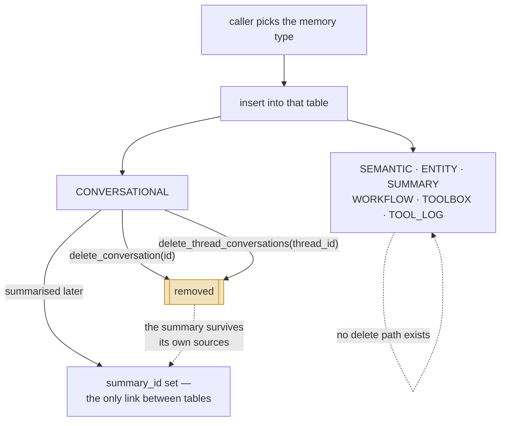

## 1. Executive Summary

7layermem is a **seven-table memory schema for a LangChain agent**, 7,016 lines
of Python. It is the smallest system reviewed here in some time, and the size is
what makes it worth reading: the whole design is legible in an afternoon.

**There is no licence file at this commit.** The repository contains no
`LICENSE`, `LICENCE` or `COPYING` — not a permissive grant or a restrictive one
but the absence of any, which defaults to all rights reserved. The mechanisms
are described below on the atlas's usual terms; a reader intending to copy any
of it needs to resolve that first.

**The idea is that memory types deserve separate tables rather than one table
with a `type` column.** `store_manager.py` opens with the seven, each annotated
with the cognitive category it stands for:

| Table | Annotated as |
| --- | --- |
| `CONVERSATIONAL_MEMORY` | episodic |
| `SEMANTIC_MEMORY` | semantic |
| `ENTITY_MEMORY` | semantic |
| `SUMMARY_MEMORY` | semantic |
| `WORKFLOW_MEMORY` | procedural |
| `TOOLBOX_MEMORY` | procedural |
| `TOOL_LOG_MEMORY` | tool execution logs |

Separating them at the schema means a query for a workflow cannot accidentally
match a conversation, and each type gets its own columns instead of a JSON blob
doing seven jobs. That is a defensible choice and the reason to look.

**The name is the weakness.** *Layer* implies a hierarchy with movement between
levels, and there is none. Nothing promotes a conversation into a summary,
expires an entity, or demotes a workflow that stopped working. The seven are
**destinations chosen at write time by the caller**, not stages a memory passes
through. The word the code supports is *categories*.

The second weakness follows from the first: **correction has almost nowhere to
happen.** Searching the source for `tombstone`, `supersede`, `retract` or
`forget` returns nothing; the only lifecycle vocabulary present is two
occurrences of `decay`, neither a mechanism. `memory_manager` exposes
`delete_conversation` and `delete_thread_conversations`, and the single `UPDATE`
in the codebase sets `summary_id`. **Six of the seven tables have no delete path
at all**, so a wrong entity, a stale workflow or a superseded tool definition
stays until someone opens the database by hand.

## 2. Mental Model

A memory is a **row in the table its type belongs to**, and the type is decided
by which manager method the caller invokes.

The conversational table is the one with structure worth reading:

```sql
CREATE TABLE CONVERSATIONAL_MEMORY (
    id TEXT PRIMARY KEY,
    thread_id TEXT NOT NULL,
    role TEXT NOT NULL,
    content TEXT NOT NULL,
    timestamp DATETIME DEFAULT CURRENT_TIMESTAMP,
    metadata TEXT,
    created_at DATETIME DEFAULT CURRENT_TIMESTAMP,
    summary_id TEXT DEFAULT NULL
)
```

`thread_id` is indexed and is the only grouping key in the system. `summary_id`
is the one link between layers — a conversation row can point at the summary
covering it, set after the fact by `update_conversation_summary_id`. That is the
entire inter-layer relationship: one nullable foreign key, in one direction,
between two of the seven.

There is **no status, confidence or provenance column on any table**. Nothing
records where a fact came from, whether it was verified, or whether anything has
contradicted it.

### How a thing becomes a belief, and how it stops being one



Two dashed edges, and both are the finding. Six of the seven tables are
write-and-read only: a row enters and no code path removes or changes it. And
the one inter-layer link is also the one place a delete propagates wrongly —
deleting a thread's turns leaves the summary derived from them in place, with
nothing recording that its sources are gone.

## 3. Architecture

One SQLite file, seven tables, created on demand by `store_manager`. A separate
RAG subsystem under `src/RAG/` carries its own persistence — `context_store.py`
creates `retrieved_contexts` and `search_contexts` — and a hybrid retriever
combining a BM25 layer and a vector layer.

An operator needs Python, SQLite, and whatever the vector layer's embedding
backend requires. There is no server and no scheduler.

### Deployment and ergonomics

The absence of a migration path is the operational cost. Table existence is
checked with a `sqlite_master` query and then `CREATE TABLE` is issued directly,
so a schema change means editing the create statement and reconciling existing
databases by hand. At seven tables and no versioning, the first schema change is
a manual migration.

## 4. Essential Implementation Paths

- **Schema:** `src/memory/store_manager.py` — the seven table names with their
  cognitive annotations, and the create statements.
- **Write and read:** `src/memory/memory_manager.py` — per-type methods,
  `update_conversation_summary_id` (`:286`), `delete_conversation` (`:298`),
  `delete_thread_conversations` (`:306`).
- **Agent surface:** `src/memory/agent_memory.py`, `agent.py`.
- **LangChain adapters:** `src/langchain_extension/memory.py`
  (`SevenLayerMemory(BaseMemory)`), `src/langchain_extension/store.py`
  (`SevenLayerStore(BaseStore[str, str])`).
- **Corpus retrieval:** `src/RAG/hybrid_retriever.py`, `vector_layer.py`,
  `ingestor.py`, `context_store.py`.

## 5. Memory Data Model

Seven tables, one grouping key. `thread_id` scopes conversations; the other six
have no equivalent, so entities, workflows and tool definitions are global to the
database.

The absence of a `user_id` or `project_id` anywhere is why the scope mark is
withheld, and it is a design consequence rather than an oversight: a
single-agent, single-database deployment does not need one, and this is built as
one.

## 6. Retrieval Mechanics

Two unrelated retrieval systems live in this repository, and the distinction
matters more than either.

Memory reads are direct SQL keyed on `thread_id` or row id — no ranking, no
recency weighting, no scoring. The RAG subsystem is separate and more developed:
`hybrid_retriever` runs a BM25 layer and a vector layer, takes `k * 2` from each,
and fuses them.

**The two do not meet.** The hybrid retriever searches an ingested document
corpus; the seven memory tables are read by key. A memory written through
`memory_manager` is not reachable through the hybrid retriever. The `bm25_layer`
and `vector_layer` named in that subsystem are also unrelated to the seven memory
layers despite sharing the word, which makes "layer" ambiguous inside a single
7,000-line repository.

## 7. Write Mechanics

Writes are synchronous inserts. The caller chooses the table by choosing the
method; nothing classifies, routes or gates. There is no extraction step, so
nothing decides what is worth remembering — the agent code decides by calling or
not calling, which is a legitimate design and puts the whole write policy in the
caller.

**No background pass exists.** No scheduler, no consolidation worker, no decay
job, so nothing rewrites the store and the lag between writing a memory and it
being retrievable is a single insert.

## 8. Agent Integration

The LangChain adapters are the intended surface: `SevenLayerMemory` implements
`BaseMemory` and `SevenLayerStore` implements `BaseStore[str, str]`, so the
tables can be mounted where LangChain expects a memory or a key-value store.
`agent.py` is a standalone entry point. There is no MCP server and no HTTP API.

The `BaseStore[str, str]` typing is worth noting: a store constrained to string
values flattens the typed tables at the boundary, so a consumer arriving through
the LangChain path loses the schema separation that is the design's main idea.

## 9. Reliability, Safety, and Trust

**No capability marks are earned, and the reasons differ per column.**

- **Tombstone, trust state, bi-temporal:** absent, with no near-miss. No status
  field, no validity interval, no record of a rejected value.
- **Scope:** `thread_id` is a real indexed key applied on conversational reads,
  but it groups a conversation rather than isolating a principal, and six of the
  seven tables have no key at all. The mark wants a stored scope key applied as a
  filter on the read path across the memory the system holds; this covers one
  table of seven.
- **Audit log:** no mutation record. `TOOL_LOG_MEMORY` logs tool *executions* —
  what the agent did, not what the memory did — and nothing writes an entry when
  a row is deleted.
- **Human review:** no surface.
- **Negative evals:** the tests create tables and exercise the manager; no
  committed case asserts that particular material must not be retrieved.

**The deletion asymmetry is the risk worth naming.**
`delete_thread_conversations` removes a whole thread's turns and any summary
derived from that thread survives it. `summary_id` points from conversation to
summary, so after the delete the summary remains with no back-reference intact
and nothing recording that its sources are gone. This is the failure the
[benchmarks page](../../benchmarks/) calls step 9 — a deleted memory surviving in
derived form — in its simplest possible instance, two tables and one foreign key.

## 10. Tests, Evals, and Benchmarks

`tests/` contains `test_memory_manager.py` and `testing.py`. The test file
builds the conversational and tool-log tables **with its own `CREATE TABLE`
statements** rather than calling `store_manager`, so the schema exists twice in
the repository as two separate strings that can drift, and nothing compares them.
A column added to the implementation and not to the test leaves the suite green
and testing a schema the system no longer has.

No benchmark, no committed retrieval numbers, and no evaluation of the hybrid
retriever. I did not run the suite.

## 11. For Your Own Build

### Steal

- **Separate tables per memory type, annotated with the cognitive category.**
  Seven `CREATE TABLE` statements and a comment each. It costs nothing at this
  scale and makes "which kind of memory is this" a schema question rather than a
  runtime one.
- **The `summary_id` back-link.** Pointing a raw row at the derived artifact
  covering it is the cheap half of
  [evidence before belief](../../patterns/evidence-before-belief/) — you can
  always get from a summary back to what it summarised, provided you also handle
  the delete.

### Avoid

- **Calling them layers.** They are categories. A reader expecting promotion,
  expiry or demotion will look for machinery that does not exist, and the design
  is more defensible under its accurate name.
- **A delete path on one table of seven.** The types a user is most likely to
  want removed — a wrong entity, a stale workflow — are the ones with no removal
  code.
- **Duplicating the schema in the tests.** Two `CREATE TABLE` strings for one
  table is a drift the suite cannot detect.

### Fit

This suits **reading, not adopting**. It is a clear, small worked example of
typed memory tables behind a LangChain adapter, and at 7,016 lines a developer
can hold all of it at once — genuinely rare in this corpus and the reason it is
here. It is not a fit for production: no licence grant, no migrations, no scope
beyond a thread, no correction, and two retrieval systems that never meet.

## 12. Open Questions

- **Is the hybrid retriever ever pointed at the memory tables?** It searches an
  ingested corpus, and no code path was found connecting the two. If that
  connection is intended, it is the missing half of the design.
- **What decides that a thread should be summarised?** The `summary_id` link
  exists and its write side was traced; the trigger was not.
- **Is the licence absence deliberate?** The README makes no licence claim, so
  unlike [membase](../membase/) there is no assertion contradicted by a missing
  file — there is simply nothing.

## Appendix: File Index

**Storage and schema**
- `src/memory/store_manager.py` — the seven tables and their annotations
- `src/RAG/context_store.py` — the RAG subsystem's own two tables

**Write and read path**
- `src/memory/memory_manager.py` — per-type methods, the one update, the two
  deletes
- `src/memory/agent_memory.py` — the agent-facing wrapper

**Retrieval**
- `src/RAG/hybrid_retriever.py`, `vector_layer.py`, `ingestor.py`

**Integration**
- `src/langchain_extension/memory.py`, `store.py` — `BaseMemory` and `BaseStore`
- `agent.py` — standalone entry point

**Tests**
- `tests/test_memory_manager.py`, `tests/testing.py`

## History

**2026-08-04** — [`d3500bfd74b380585e8220f6c6f235c825bc803e`](https://github.com/Prateek816/7layermem/commit/d3500bfd74b380585e8220f6c6f235c825bc803e) — first reading.
