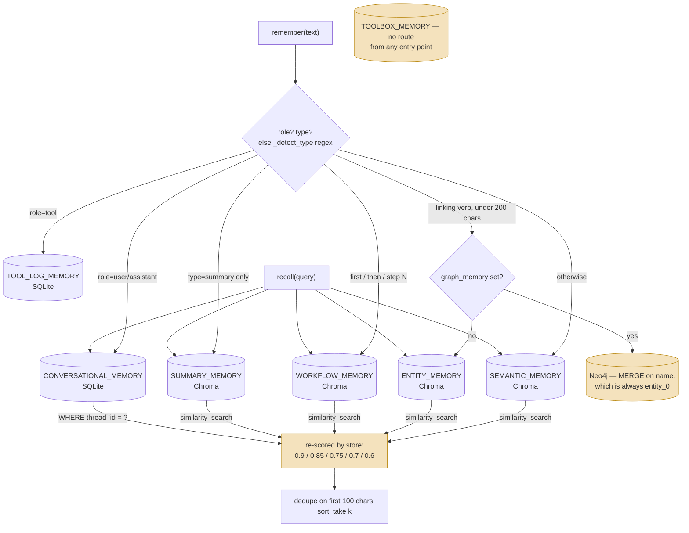

## 1. Executive Summary

7layermem is a **seven-type memory framework for a LangChain agent**, 7,016 lines
of Python, spread across three storage engines and presented behind two methods.
The size is what makes it worth reading: the whole design is legible in an
afternoon.

**There is no licence file at this commit**, and the README ends with a `##
License` heading whose body is the single word `MIT`. The repository contains no
`LICENSE`, `LICENCE` or `COPYING`, so the grant asserted in the README exists
nowhere a court or a package manager would look, and the default is all rights
reserved. This is the same shape as [membase](../membase/) — an assertion with no
file under it. The mechanisms are described below on the atlas's usual terms; a
reader intending to copy any of it needs to resolve that first.

**The idea is that memory types deserve separate stores rather than one table
with a `type` column.** `store_manager.py` opens with seven constants, each
annotated with the cognitive category it stands for, and they do not all name the
same kind of thing:

| Constant | Annotated as | What it actually names |
| --- | --- | --- |
| `CONVERSATIONAL_MEMORY` | episodic | a SQLite table |
| `TOOL_LOG_MEMORY` | tool execution logs | a SQLite table |
| `SEMANTIC_MEMORY` | semantic | a Chroma collection |
| `ENTITY_MEMORY` | semantic | a Chroma collection, or Neo4j |
| `SUMMARY_MEMORY` | semantic | a Chroma collection |
| `WORKFLOW_MEMORY` | procedural | a Chroma collection |
| `TOOLBOX_MEMORY` | procedural | a Chroma collection |

Two of the seven are relational rows read by key; five are embedded documents
read by cosine similarity against `all-MiniLM-L6-v2` (`store_manager.py:22`).
Separating them means a query for a workflow cannot match a conversation, and
each type gets its own retrieval semantics rather than a JSON blob doing seven
jobs. That is a defensible choice and the reason to look.

**The name is the weakness.** *Layer* implies a hierarchy with movement between
levels, and there is none. Nothing promotes a conversation into a summary,
expires an entity, or demotes a workflow that stopped working. The seven are
**destinations chosen at write time**, not stages a memory passes through. The
word the code supports is *categories*.

**The interesting failure is in the ranking.** `AgentMemory.recall` searches four
Chroma collections and the conversational table, then assigns each result a score
from a constant chosen by which store it came from — 0.9 knowledge, 0.85 entity,
0.75 summary, 0.7 workflow, 0.6 conversation (`agent_memory.py:390`, `:397`,
`:404`, `:411`, `:425`) — decayed by result position, never by anything the
similarity search reported. `similarity_search` returns documents without
scores, so the ranking that reaches the agent is a fixed preference order over
stores plus each store's internal order. A perfect match in workflow loses to a
weak match in knowledge, always.

**Correction has a delete surface and no vocabulary above it.** Searching the
source for `tombstone`, `supersede`, `retract` or `forget` returns nothing; the
only occurrences of `decay` are the two ranking comments above. Removal exists on
every store — `delete_conversation` (`:298`), `delete_thread_conversations`
(`:306`), `delete_tool_log` (`:411`), the generic `delete_from_store(store_name,
ids)` covering all five collections (`:652`), `delete_entity_graph` (`:607`) and
`delete_entities_by_thread` (`:700`), with `delete_collection` and
`reset_database` under them — but nothing records that a value was removed or
rejected, so a corrected fact and one that was never written are the same state.

## 2. Mental Model

A memory is **whatever the store it was routed to holds**: a row, an embedded
document, or a graph node. The routing is the first epistemic decision the system
makes, and a regex makes it. `_detect_type` (`agent_memory.py:66`) classifies
free text with two patterns — under 200 characters containing a linking verb
(`is|are|was|were|has|works|lives|likes|knows|created|built`) becomes an
**entity**; anything containing `first|then|next|finally|step \d|after that`
becomes a **workflow**; everything else becomes **knowledge**. No model is
consulted, and the branches are ordered, so "Alice is a developer, first onboard
her then assign a mentor" is an entity because the length test ran first.

Chroma writes upsert on a SHA-256 hash of the text (`memory_manager.py:177`), so
identical text written twice is one document and near-identical text is two. That
is the whole deduplication story on five of the seven stores: byte equality.

There is **no status, confidence or provenance field anywhere**. Nothing records
where a fact came from, whether it was verified, or whether anything has
contradicted it. The single `status` column in the tree is on `TOOL_LOG_MEMORY`
and defaults to `'success'` — it records whether a tool call worked, which cannot
turn out to be false, and nothing filters on it.

The conversational table is the one with structure worth reading:

```sql
CREATE TABLE CONVERSATIONAL_MEMORY (
    id TEXT PRIMARY KEY,
    thread_id TEXT NOT NULL,
    role TEXT NOT NULL,
    content TEXT NOT NULL,
    timestamp DATETIME DEFAULT CURRENT_TIMESTAMP,
    metadata TEXT,
    created_at DATETIME DEFAULT CURRENT_TIMESTAMP,
    summary_id TEXT DEFAULT NULL
)
```

`thread_id` is indexed and is the only grouping key in the system. `summary_id`
is the one declared link between types — a conversation row can point at the
summary covering it, set by `update_conversation_summary_id`
(`memory_manager.py:286`), whose `UPDATE` (`:294`) is the only one in the
codebase. **Nothing calls it.** The symbol appears in `memory_manager.py`'s own
class docstring and in one test, and on no path an agent or a user reaches, so
the column is always `NULL` in practice and the inter-type relationship is a
declared one. `TOOLBOX_MEMORY` is in the same condition from the other end:
`write_toolbox` and `search_toolbox` exist on `MemoryManager` and nothing in
`AgentMemory`, `agent.py` or the LangChain adapters routes to them, so one of the
seven types is unreachable through every published entry point.

### How a thing becomes a belief, and how it stops being one



Three shaded boxes and each is a finding. `TOOLBOX_MEMORY` has no producer on any
reachable path. The Neo4j branch collapses (section 7). And the re-scoring step
throws away the only evidence about relevance the retrieval produced.

## 3. Architecture

Three engines, stood up by one import. `store_manager.py` runs at module scope:
it instantiates `HuggingFaceEmbeddings` (`:22`), creates `./data`, opens two
SQLite files — `conversational_memory.db` and `tool_log_memory.db` (`:289`) —
issues the two `CREATE TABLE` statements, and builds a global `StoreManager`
(`:302`) that opens a `chromadb.PersistentClient` on `./data` (`:186`) and five
`Chroma` collections over it (`:195`–`:228`). `src/memory/__init__.py` imports it
transitively, so `from src.memory import AgentMemory` downloads a
sentence-transformers model and touches disk before the caller has configured
anything.

Neo4j is optional and injected: `AgentMemory.from_config` builds an
`EntityGraphMemory` only when both `neo4j_uri` and `neo4j_password` are passed,
inside a bare `except Exception: pass` (`agent_memory.py:174`) that falls back to
Chroma without a log line. `EntityGraphMemory` opens a `Neo4jGraph`, creates a
uniqueness constraint on `Entity.name` (`entity_graph_memory.py:114`) and
constructs a `ChatGroq(model="openai/gpt-oss-120b")` (`:105`) — so the graph path
requires a `GROQ_API_KEY` and a network round trip, and `.env.example` contains
that key and nothing else.

A separate RAG subsystem under `src/RAG/` carries its own persistence:
`context_store.py` creates `retrieved_contexts` (`:65`) and `search_contexts`
(`:80`), and `hybrid_retriever.py` combines a BM25 layer and a vector layer.

### Deployment and ergonomics

`requirements.txt` lists `sqlite3` and `hashlib` — standard-library modules, not
distributions — so the documented `pip install -r requirements.txt` does not
resolve as written. The README's data-directory listing (`conversations.db`,
`tool_logs.db`, `chroma/`, `embeddings/`) does not match what the code creates,
and the `examples/` directory it documents is not in the tree.

Nothing runs in the background and there is no server. Fully local operation
works for six of the seven types; the graph path needs a Neo4j instance and a
hosted LLM, and it is the only path with an API key on it.

The absence of a migration path is the operational cost that outlasts the rest.
Table existence is checked with a `sqlite_master` query and then `CREATE TABLE`
is issued directly, and Chroma collections are opened by name with no schema
version anywhere, so a change to either means reconciling existing stores by
hand. The SQLite half is human-readable and repairable with a shell; the Chroma
half is not.

## 4. Essential Implementation Paths

- **Schema and store construction:** `src/memory/store_manager.py` — the seven
  constants with their cognitive annotations, `create_conversational_history_table`
  (`:40`), `create_tool_log_table` (`:93`), the `StoreManager` class and its five
  Chroma collections (`:195`–`:228`), `delete_collection` (`:265`),
  `reset_database` (`:271`).
- **Write path:** `src/memory/memory_manager.py` — `_write_to_store` (`:162`),
  which hashes content into an id (`:177`) and calls `add_documents` (`:183`);
  the per-type `write_*` wrappers; `write_conversation` and `write_tool_log`.
- **Read path:** `_search_store` (`:186`) wrapping `store.similarity_search`
  (`:197`); `read_conversations` and `read_tool_logs`, both filtering
  `WHERE thread_id = ?`.
- **Routing and fan-out:** `src/memory/agent_memory.py` — `_detect_type` (`:66`),
  the `remember` router, and `recall`'s five-store fan-out with its per-store
  base scores (`:390`–`:425`), dedupe (`:433`, keyed on the first 100 characters)
  and top-`k`.
- **Update/delete/forget:** `update_conversation_summary_id` (`:286`),
  `delete_conversation` (`:298`), `delete_thread_conversations` (`:306`),
  `delete_tool_log` (`:411`), `delete_from_store` (`:652`) with its entity
  re-route to the graph (`:663`), `delete_entity_graph` (`:607`),
  `delete_entities_by_thread` (`:700`).
- **Extraction:** `src/graphDB/entity_graph_memory.py` —
  `ENTITY_EXTRACTION_PROMPT` (`:35`), `extract_entities` (`:125`),
  `write_entities_from_text` (`:232`), reached through
  `MemoryManager.write_entities_from_text` (`:564`).
- **LangChain adapters:** `src/langchain_extension/memory.py`
  (`SevenLayerMemory(BaseMemory)`), `store.py` (`SevenLayerStore(BaseStore[str,
  str])`), `chat_message_history.py` (`SevenLayerChatMessageHistory`).
- **Corpus retrieval:** `src/RAG/hybrid_retriever.py`, `vector_layer.py`,
  `bm25_layer.py`, `ingestor.py`, `context_store.py`.

## 5. Memory Data Model

Two SQL schemas, five untyped document collections, and one graph.

The SQL side carries columns: `CONVERSATIONAL_MEMORY` as quoted above, and
`TOOL_LOG_MEMORY` with `tool_call_id`, `tool_name`, `tool_args`, `result`,
`result_preview`, `status`, `error_message`, `metadata` and two timestamps. Both
tables set `timestamp` and `created_at` from the same `_now()` call in the same
`INSERT`, so the two columns are one value written twice — record time exists,
validity time does not.

The Chroma side has no schema. A document is text plus a free-form metadata dict,
and the only key any code depends on is `key`, written by `SevenLayerStore.mset`
and read back as a filter by `mget` (`store.py:56`). Graph nodes get `created_at`
on `MERGE`-create and `updated_at` on every write, and `updated_at` overwrites.

**Scoping is one key applied in two places and stamped in a third that ignores
it.** `thread_id` filters `read_conversations` and `read_tool_logs`, and
`AgentMemory._write_entity` writes `meta["thread_id"] = thread_id` into the
entity document's Chroma metadata (`agent_memory.py:282`). No read path passes a
`thread_id` filter to any `search_*` method: `recall` accepts a `thread_id`
argument and forwards it only to the conversational read. The graph side is the
same shape from the other direction — `EntityGraphMemory.search_entity` accepts a
`thread_id` and adds `e.thread_id = $thread_id` to the `WHERE` clause (`:319`),
and `search_entity_documents` extracts it from a `filter` dict that the fan-out
never supplies. There is no `user_id`, `project_id` or tenant key anywhere.

## 6. Retrieval Mechanics

Three retrieval mechanisms, and the distinctions between them matter more than
any one of them.

**Vector similarity over the memory stores.** Five of the seven types are read by
`store.similarity_search(query, k)` against their own Chroma collection,
optionally with a metadata filter. This is the primary read path and the one
`recall` exercises.

**SQL by key over the two tables.** `read_conversations` and `read_tool_logs`
select on `thread_id`, order by `timestamp DESC`, take `limit`, then reverse into
chronological order. `read_conversations` also accepts `before_timestamp` for
paging backwards. No ranking, and none is wanted.

**Graph traversal, when Neo4j is configured.** `search_entity` matches
`toLower(e.name) CONTAINS toLower($query)` — a substring test on the name, not a
similarity search — and `search_entity_documents` then walks each hit's
relationships to depth 1 and renders them into the document text.

**The fusion on top of all three is where relevance is lost.**
`AgentMemory.recall` queries knowledge, entity, workflow and summary, reads the
conversational table, and assigns every result `base_score * (1.0 - i * 0.05)`
where `base_score` is the constant for its store (`agent_memory.py:455`).
Conversation rows get `0.6 * (1.0 - i * 0.1)` (`:425`). Nothing consults a
distance: `similarity_search` returns bare `Document`s, and the
`similarity_search_with_score` variant that would return one is not called
anywhere. So the cross-store order is fixed — every knowledge hit outranks every
entity hit outranks every summary hit — and within a store the order is whatever
Chroma returned, re-labelled with a number that looks like a relevance score and
is not one. Results are then deduplicated on their first 100 lowercased
characters (`:469`), which merges two documents sharing a prefix.

Each of the five searches is wrapped in `try/except Exception: pass`, so a store
that fails contributes nothing and says nothing, and a `recall` against a broken
Chroma client is indistinguishable from one that found no matches.

**The RAG subsystem never meets any of this.** `hybrid_retriever` runs a BM25
layer and a vector layer, takes `k * 2` from each (`:160`, `:165`), normalizes
and fuses with configurable weights. Its vector layer is also Chroma with the
same `all-MiniLM-L6-v2` embeddings — but a different persist directory
(`./data/vector_store`) and a different collection (`hybrid_rag`,
`config.py:25`), so a memory written through `memory_manager` is not reachable
through the hybrid retriever and nothing bridges them. `RAGConfig.rerank_threshold
= 0.7` (`config.py:34`) is read by nothing outside `to_dict`. The `bm25_layer` and
`vector_layer` in that subsystem are also unrelated to the seven memory layers
despite sharing the word, which makes "layer" ambiguous inside a single
7,000-line repository.

## 7. Write Mechanics

Writes are synchronous, and on six of the seven paths they are cheap: an `INSERT`
or an `add_documents` call whose only cost is embedding the text locally. The
seventh is not. When Neo4j is configured, `MemoryManager.write_entity` routes to
the graph (`:504`), and `write_entities_from_text` (`:564`) calls an LLM —
`ENTITY_EXTRACTION_PROMPT` asks a Groq-hosted model for a JSON object of
entities and relationships (`entity_graph_memory.py:35`), and a `json.loads`
failure returns `{"entities": [], "relationships": []}` with no log and no retry.
That is the only extraction step in the system, it is on the hot path, and it is
reachable only by calling `MemoryManager` directly — `AgentMemory` exposes no
route to it.

**Enabling Neo4j breaks entity memory through the simple API.**
`AgentMemory._write_entity` passes metadata containing only `thread_id`;
`MemoryManager.write_entity` forwards to
`EntityGraphMemory.write_entity_documents`, which names each node
`metadata.get("name", f"entity_{i}")` (`entity_graph_memory.py:446`) — and `i` is
`0` for the single-text call the simple API always makes. Every entity written
through `remember(..., type="entity")` therefore `MERGE`s onto one node named
`entity_0` (`:181`), overwriting the previous `description` on match. The Chroma
fallback has no such collision, because content-hash ids give distinct text
distinct documents. Configuring the richer backend replaces per-fact entity
storage with a single mutable slot, and then searches it by substring on a name
that is always `entity_0`.

**Nothing gates a write.** No classifier beyond the regex, no threshold, no
conflict check, no filter on noisy or adversarial input. Text arriving from a
user reaches an embedding and a store unexamined, and on the graph path reaches
an LLM prompt as `{text}` with no delimiting.

### Operational cost

The write path blocks the agent for one local embedding on the Chroma types and
for one hosted LLM call on the graph type. There is no deferred queue, so the lag
between writing a memory and it being retrievable is a single insert. **No
background pass exists** — no scheduler, no consolidation worker, no expiry job —
so nothing rewrites the store and the token bill is exactly the writes and reads
performed. On the read path, `recall` injects at most `k` results (default 5)
truncated by the caller; `SevenLayerMemory.load_memory_variables` joins them into
one string under the `history` key, which sits wherever the chain puts its memory
variable.

## 8. Agent Integration

`AgentMemory` is the intended surface and is genuinely two methods: `remember`
and `recall`, with `clear_thread` beside them. `agent.py` wraps it in an
interactive REPL with `/remember`, `/entity`, `/workflow`, `/recall`, `/history`
and `/stats` commands, and every command also writes a tool-log row, so the tool
log is populated by the demo agent even though nothing reads it back except
`/stats`.

Three LangChain adapters sit above `AgentMemory`: `SevenLayerMemory` implements
`BaseMemory` (`save_context` writes the turn, `load_memory_variables` calls
`recall`), `SevenLayerChatMessageHistory` implements `BaseChatMessageHistory`
over the conversational table alone, and `SevenLayerStore` implements
`BaseStore[str, str]` over four of the five collections. There is no MCP server
and no HTTP API.

Two things are worth naming about that boundary. The `BaseStore[str, str]`
typing flattens the typed stores to string values, so a consumer arriving through
the key-value path loses the type separation that is the design's main idea. And
`SevenLayerStore.yield_keys` enumerates by running `search_store(query="",
k=100)` (`store.py:90`) — a similarity search against an empty string, capped at
100, presented as key iteration, which the docstring concedes is O(n) while
understating that it is also lossy above 100 keys.

The model has no agency over memory beyond what the application grants it: there
are no memory tools, no prompt affordances, and no automatic injection except the
one `SevenLayerMemory` performs per chain turn.

## 9. Reliability, Safety, and Trust

**One capability mark is earned, and the reasons for the other six differ.**

- **Negative retrieval assertion — earned.**
  `tests/test_memory_manager.py:276` writes one row into `t1` and one into `t2`,
  reads each thread, and asserts both that the result length is 1 and that the
  content is the right one, so the other thread's row is provably absent from a
  populated result. `:320` writes two rows into `t1` and one into `t2`, deletes
  `t1`, and asserts `len(rows_t1) == 0` alongside `len(rows_t2) == 1` — the
  surviving control is what makes the empty assertion non-vacuous. Both are about
  a read path. Neither says anything about the five vector stores.
- **Scope enforced — withheld, and the near-miss is precise.** `thread_id` is a
  real indexed key applied as a SQL filter on both table reads, but it groups a
  conversation rather than isolating a principal, and the primary recall path
  applies no filter at all. The sharper half is that
  `AgentMemory._write_entity` *stores* `thread_id` on every entity document and
  no read consults it — a scope written as a tag and never applied, which is
  exactly what the rubric excludes.
- **Tombstone, trust state, bi-temporal — absent, with no near-miss.** No
  rejected-value record, no epistemic status field, and `timestamp`/`created_at`
  written from one `_now()` call in one statement.
- **Audit log — no mutation record.** `TOOL_LOG_MEMORY` logs tool *executions*,
  which is a record of what happened rather than of what the memory came to
  believe, and nothing writes an entry when a row or a document is deleted.
- **Human review — no surface.** Nothing inspects, approves or adjudicates.

**The deletion asymmetries are the risks worth naming, and there are two.**
`delete_thread_conversations` removes a whole thread's turns from
`CONVERSATIONAL_MEMORY` and touches nothing else, so a summary derived from that
thread survives in `SUMMARY_MEMORY` — and because `update_conversation_summary_id`
is called by no reachable path, `summary_id` is `NULL`, so there is not even a
stored pointer from which the orphaned summary could be found and removed. This
is the failure the [benchmarks page](../../benchmarks/) calls step 9 — a deleted
memory surviving in derived form — in its simplest instance. The second is the
graph: `delete_entities_by_thread` exists on both `MemoryManager` (`:700`) and
`EntityGraphMemory` (`:531`) and has no caller anywhere in the tree, including
the tests, so the one cross-store thread-delete that would reach entities is
written and unwired.

Nothing defends against prompt-injected memories. Text from a user is routed by
regex, embedded, and on the graph path interpolated into an extraction prompt;
the resulting entities are `MERGE`d into a store the next `recall` reads back
into the model's context.

## 10. Tests, Evals, and Benchmarks

`tests/` holds six files: `test_memory_manager.py` (824 lines),
`test_agent_memory.py` (304), `test_langchain_chat_history.py` (127),
`test_langchain_memory.py` (112), `test_langchain_store.py` (110) and a
script-style `testing.py` (275). Coverage is real on shape and behaviour —
routing, ordering, thread filtering, deletion, the LangChain adapter contracts —
and the two thread-boundary cases in section 9 are the strongest thing in it.

Two limits matter. `test_memory_manager.py` builds the conversational and
tool-log tables **with its own `CREATE TABLE` statements** (`:52`, `:73`) rather
than calling `store_manager`, so the schema exists twice in the repository as two
strings that can drift with nothing comparing them; a column added to the
implementation and not to the test leaves the suite green against a schema the
system does not have. And every Chroma and Neo4j interaction is a `MagicMock`, so
no committed test exercises an embedding, a similarity search, or a Cypher query
— which is why the `entity_0` collision above survives a green suite: the mock
records the call and never `MERGE`s anything.

No benchmark, no committed retrieval numbers, no evaluation of the hybrid
retriever, and no paper — the README cites none and the tree contains no
`CITATION.cff`, `bibtex` or `arxiv` reference. I did not run the suite.

## 11. For Your Own Build

### Steal

- **Separate stores per memory type, annotated with the cognitive category.**
  Seven constants and a comment each. It costs nothing at this scale and makes
  "which kind of memory is this" a store question rather than a runtime one — and
  it lets episodic memory be a table read by key while semantic memory is a
  vector collection read by similarity, which is the right answer for both.
- **Content-hash ids for upserted documents.** Deriving a document id from a
  SHA-256 of its text makes re-ingestion idempotent for free and is four lines.
  Know what it does not buy you: near-duplicates are distinct documents.
- **A two-method public API over a many-method internal one.**
  `remember`/`recall` over a 32-method manager is a good split, and the manager
  stays available for callers who need the graph or the toolbox.

### Avoid

- **Scoring a fused result by which store it came from.** A constant per source
  is a preference order wearing a score's clothes: it cannot express that this
  workflow matches better than that fact, and it silently discards the distance
  the vector store computed. If you fan out across stores, carry the real scores
  through — `similarity_search_with_score` exists — and normalize them, or admit
  the ordering is a policy and do not print it as a number.
- **A regex as the classifier on the write path.** Ordered patterns over raw text
  put the type decision somewhere it cannot be inspected, corrected or tested
  against intent, and the first branch to match wins on input that belongs in two
  places.
- **Silent fallback between backends with different semantics.** Catching every
  exception around backend construction and continuing on the other one means an
  operator who configured a graph and got a vector store finds out from the
  results. Two backends behind one interface need the same identity and search
  semantics, or they are two systems with one name.
- **Duplicating the schema in the tests.** Two `CREATE TABLE` strings for one
  table is a drift the suite cannot detect.

### Fit

This suits **reading, not adopting**. It is a clear, small worked example of
typed memory stores behind a two-method API, and at 7,016 lines a developer can
hold all of it at once — genuinely rare in this corpus and the reason it is here.
The thing to read it for is the fusion problem: it is the smallest complete
illustration of what happens when a system retrieves from several stores and has
no principled way to compare the results, which is a problem every multi-store
memory design has and most hide behind a reranker. It is not a fit for
production: no licence grant, no migrations, no scope beyond a thread, no
correction vocabulary, an install file that does not install, and a graph backend
that degrades the type it upgrades.

## 12. Open Questions

- **Is the hybrid retriever meant to be pointed at the memory collections?** Both
  are Chroma with the same embedding model, and only a persist directory and a
  collection name separate them. If the connection is intended, it is a
  configuration change rather than a design one — which makes its absence harder
  to read as deliberate.
- **What is supposed to call `update_conversation_summary_id`?** The column, the
  method and its test exist; the summarizer that would produce a `summary_id` does
  not appear in the tree.
- **Is the `entity_0` naming a stub or a defect?** `write_entity_documents`
  accepts a `name` in metadata, and `usage_example.py` supplies real names when
  it calls the graph directly. Only the `AgentMemory` route omits it.
- **Is the licence discrepancy deliberate?** The README asserts MIT and no file
  carries it. Unlike a repository that simply says nothing, this is an assertion
  with nothing under it.

## Appendix: File Index

**Storage and schema**
- `src/memory/store_manager.py` — the seven constants, the two `CREATE TABLE`
  functions, the five Chroma collections, `delete_collection`, `reset_database`
- `src/RAG/context_store.py` — the RAG subsystem's own two tables

**Write and read path**
- `src/memory/memory_manager.py` — SQL and Chroma helpers, the per-type methods,
  the one update, the delete surface, the graph delegation
- `src/memory/agent_memory.py` — `_detect_type`, `remember`, `recall` and its
  scoring

**Extraction and graph**
- `src/graphDB/entity_graph_memory.py` — the extraction prompt, Cypher writes and
  reads, `DETACH DELETE`
- `src/graphDB/usage_example.py`

**Retrieval (corpus)**
- `src/RAG/hybrid_retriever.py`, `vector_layer.py`, `bm25_layer.py`,
  `ingestor.py`, `config.py`

**Integration**
- `src/langchain_extension/memory.py`, `store.py`, `chat_message_history.py` —
  `BaseMemory`, `BaseStore` and `BaseChatMessageHistory`
- `agent.py` — standalone entry point

**Tests**
- `tests/test_memory_manager.py`, `test_agent_memory.py`,
  `test_langchain_memory.py`, `test_langchain_store.py`,
  `test_langchain_chat_history.py`, `testing.py`

## History

**2026-08-31** — [`d3500bfd74b380585e8220f6c6f235c825bc803e`](https://github.com/Prateek816/7layermem/commit/d3500bfd74b380585e8220f6c6f235c825bc803e) — same pin, re-read against the source. The architectural spine published for this commit was wrong in one direction: it described seven SQLite tables read by direct SQL with a delete path on one of them. `store_manager` creates two SQLite tables; the other five constants name Chroma collections embedded with `all-MiniLM-L6-v2` and read by `similarity_search`, the optional Neo4j entity graph in `src/graphDB/` went undescribed, and deletion reaches every store. `negative_eval` is earned on the two thread-boundary cases in `tests/test_memory_manager.py`; the other six marks stay withheld, `scope_enforced` on the sharper ground that entity documents carry a `thread_id` no read path consults. Also corrected: the README asserts MIT with no licence file under it, `update_conversation_summary_id` and `delete_entities_by_thread` have no caller outside tests, and `TOOLBOX_MEMORY` has no route from any entry point.

**2026-08-04** — [`d3500bfd74b380585e8220f6c6f235c825bc803e`](https://github.com/Prateek816/7layermem/commit/d3500bfd74b380585e8220f6c6f235c825bc803e) — first reading.
