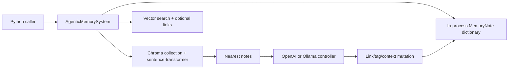

## 1. Executive Summary

A-MEM is a compact research implementation of agentic, Zettelkasten-inspired
memory. Each note can carry keywords, context, tags, links, access metadata, and
an evolution history. On insertion, vector-nearest notes are shown to an LLM,
which can link the new note and rewrite neighboring tags or context.

The valuable idea is that memory organization can evolve with new evidence
rather than freezing metadata at ingestion time. The current implementation,
however, is not safe to use as a production memory engine:

- The core system is process-local and resets a global in-memory Chroma
  collection on initialization.
- Search is vector-only despite “hybrid” docstrings.
- Neighbor positions are confused with memory identities during evolution, so
  the wrong note can be mutated.
- LLM-authored links are not validated as existing UUIDs.
- No user/project scope, provenance, trust state, or durable correction model
  exists.

Treat A-MEM as a readable research sketch and source of design questions, not
as a borrowing-ready library. The paper's experimental reproduction lives in a
different repository linked from the README.


## 2. Mental Model

Memory is a graph-like collection of enriched notes:

```text
new note
  -> vector-nearest existing notes
  -> LLM evolution decision
  -> optional new links and tag changes
  -> optional neighbor context/tag rewrites
  -> note + metadata in Chroma and process memory
```

The Zettelkasten analogy comes from small notes and explicit links. Unlike a
human-maintained Zettelkasten, link creation and neighborhood revision are
delegated to an LLM. Retrieval starts with embedding similarity and can append
linked neighbors.

“Evolution” here means metadata and link mutation. It is not reinforcement
learning, factual verification, decay, or model-weight adaptation.


## 3. Architecture



`AgenticMemorySystem` owns an in-memory dictionary and an ephemeral
`ChromaRetriever`. A separate `PersistentChromaRetriever` exists, along with a
temporary-copy variant for isolated experiments, but the main memory system
does not use them.

There is no server, worker, queue, transaction coordinator, authentication
layer, or prompt-injection boundary.


## 4. Essential Implementation Paths

- `agentic_memory/memory_system.py::MemoryNote`: note schema.
- `AgenticMemorySystem.__init__`: resets and opens the shared `memories`
  collection, configures the LLM, and defines the evolution prompt.
- `add_note`: runs evolution, writes the process dictionary, then adds Chroma
  metadata.
- `find_related_memories`: returns formatted nearest notes and positional
  indexes.
- `process_memory`: asks the LLM to link or rewrite a neighborhood.
- `search_agentic`: vector retrieval followed by limited linked-note expansion.
- `update` and `delete`: mutate the dictionary and vector store.
- `consolidate_memories`: recreates a retriever and re-adds all notes.
- `agentic_memory/retrievers.py`: ephemeral, persistent, and copied Chroma
  wrappers.


## 5. Memory Data Model

`MemoryNote` contains:

- Free-text content and a UUID.
- Keywords, context, category, and tags.
- Links to other notes.
- Creation and last-access timestamps.
- Retrieval count.
- Evolution history.

Most fields default to empty or generic values. Although `analyze_content`
defines an LLM extraction prompt, no caller in the repository invokes it. A
new note therefore keeps caller-supplied metadata or defaults unless the
evolution path changes its tags or links.

Chroma metadata serializes lists and dictionaries to JSON strings and attempts
to recover their types with `ast.literal_eval` on read. The in-memory
`MemoryNote` objects remain the practical source of truth for core operations.


## 6. Retrieval Mechanics

`ChromaRetriever.search` embeds the query with a sentence-transformer and asks
Chroma for nearest documents. Both `search` and `search_agentic` rely on this
one semantic channel.

`search_agentic` hydrates metadata, then looks up linked memories in the process
dictionary. Because the final list is truncated to `k`, appended neighbors
often cannot expand the returned set when the initial vector search already
filled it.

The internal `_search` method claims to combine Chroma and an embedding
retriever but calls the same retriever twice and then iterates the second
Chroma result as if it were a list of result dictionaries. It is not a working
hybrid implementation.

There is no lexical retrieval, rank fusion, scope filter, recency/importance
reranking, token budget, or evidence-aware result format.


## 7. Write Mechanics

`add_note` creates a note and calls `process_memory` before persisting it. The
first note bypasses analysis and evolution. Later notes retrieve five neighbors
and ask the LLM for strict JSON containing:

- Whether to evolve.
- `strengthen` and/or `update_neighbor` actions.
- Suggested connections.
- New tags for the new note.
- New context and tags for every neighbor.

The implementation then mutates live objects. `find_related_memories` appends
the enumeration position `i`, not the returned document UUID. `process_memory`
uses those positions against insertion-ordered `self.memories.values()`. Vector
rank position is therefore treated as collection position, which can rewrite a
different memory than the LLM was shown.

Update is delete-then-add in Chroma after mutating the live object. Delete
removes the target but does not clean incoming links. Neither operation is
atomic across the dictionary and Chroma.

“Consolidation” does not summarize or merge notes; it opens the collection and
re-adds every current document, which risks duplicate-ID failure depending on
Chroma behavior.


## 8. Agent Integration

Integration is a direct Python API: create `AgenticMemorySystem`, add notes,
search, update, and delete. The included example demonstrates a local Ollama
backend.

There are no lifecycle hooks, MCP tools, REST endpoints, automatic context
injection, multi-agent namespace, or framework adapters. The persistent and
copied retrievers can support experimental sharing or forked starting memory,
but callers must assemble that behavior themselves.


## 9. Reliability, Safety, and Trust

Strengths:

- Strict JSON schema constrains the shape of the evolution response.
- Evolution errors fail closed to leaving the new note unchanged.
- Persistent Chroma access requires an explicit `extend=True` for an existing
  collection.
- The copied retriever offers an isolated disposable clone for experiments.

Limitations:

- Main-system initialization resets a globally named ephemeral collection.
- Neighbor identity confusion can corrupt unrelated notes.
- Suggested link IDs are accepted without referential validation.
- No locking protects concurrent writes.
- No provenance connects an evolved field to source evidence or model output.
- No privacy filtering, authentication, scope, retention, or audit trail.
- No candidate/verified/rejected state distinguishes generated organization
  from trusted knowledge.
- Mutation errors can leave Chroma and process memory inconsistent.


## 10. Tests, Evals, and Benchmarks

The repository has focused tests for CRUD, metadata serialization, vector
top-k, persistent collection access, copied/persistent behavior, relationships,
and consolidation. The memory-system tests instantiate an OpenAI backend and do
not inject the included `MockLLMController`; several “evolution” assertions only
check that metadata fields are non-null. They do not assert correct neighbor
identity or link validity.

The test suite was not run for this atlas review because it downloads embedding
models and may call an external LLM.

The README says experiments across six foundation models outperform baselines,
but directs reproducibility to `WujiangXu/AgenticMemory`. This package contains
neither the paper benchmark harness nor committed result artifacts, so those
claims cannot be verified from the inspected repository.


## 11. Patterns Worth Stealing

- Model memory as small linkable notes rather than one growing summary.
- Reconsider local organization when new evidence arrives.
- Separate a shared persistent corpus from disposable per-agent copies.
- Constrain model decisions with a strict structured schema.
- Keep evolution optional and fail closed on parsing errors.

The invariant to add before stealing the design is simple: every neighbor and
link must use a stable memory ID end to end.


## 12. Antipatterns / Risks

- Using a ranking position as a persistent object identity.
- Letting an LLM mutate active neighboring memories without provenance or
  review.
- Naming vector-only retrieval “hybrid.”
- Treating reindexing as semantic consolidation.
- Resetting a shared collection inside a constructor.
- Keeping graph links without referential integrity or delete cleanup.
- Citing results whose runnable evaluation lives outside the analyzed package.


## 13. Build-vs-Borrow Takeaways

Borrow the concept, not the current core. A production implementation would
need stable IDs, durable canonical storage, a rebuildable vector projection,
validated edges, provenance for every mutation, scoped access, transactional
updates, and reviewable candidate changes.

The system is useful for research prototypes where observing emergent note
organization matters more than persistence and correctness. It should not sit
on a consequential agent path without substantial redesign.

If implementing the pattern, generate proposed links and metadata revisions
into a change set. Validate referenced IDs, record the source neighborhood and
model, then atomically accept or reject the proposal.


## 14. Open Questions

- Should evolution create proposals instead of mutating active notes?
- How should contradictory notes be linked without rewriting one into the
  other?
- What is the intended role of `analyze_content`, which has no call site?
- How should linked neighbors affect top-k rather than being truncated away?
- Can the paper evaluation be packaged with the library and pinned artifacts?
- What consolidation invariant was intended beyond reindexing?


## Appendix: File Index

- `agentic_memory/memory_system.py`: notes, evolution, CRUD, retrieval.
- `agentic_memory/retrievers.py`: Chroma adapters and collection copying.
- `agentic_memory/llm_controller.py`: OpenAI and Ollama completion backends.
- `examples/sovereign_memory.py`: local Ollama example.
- `tests/test_memory_system.py`: memory lifecycle tests.
- `tests/test_retriever.py`: Chroma and persistence tests.
- `tests/test_utils.py`: unused mock LLM controller.
- `README.md`: architecture and external paper-reproduction link.
