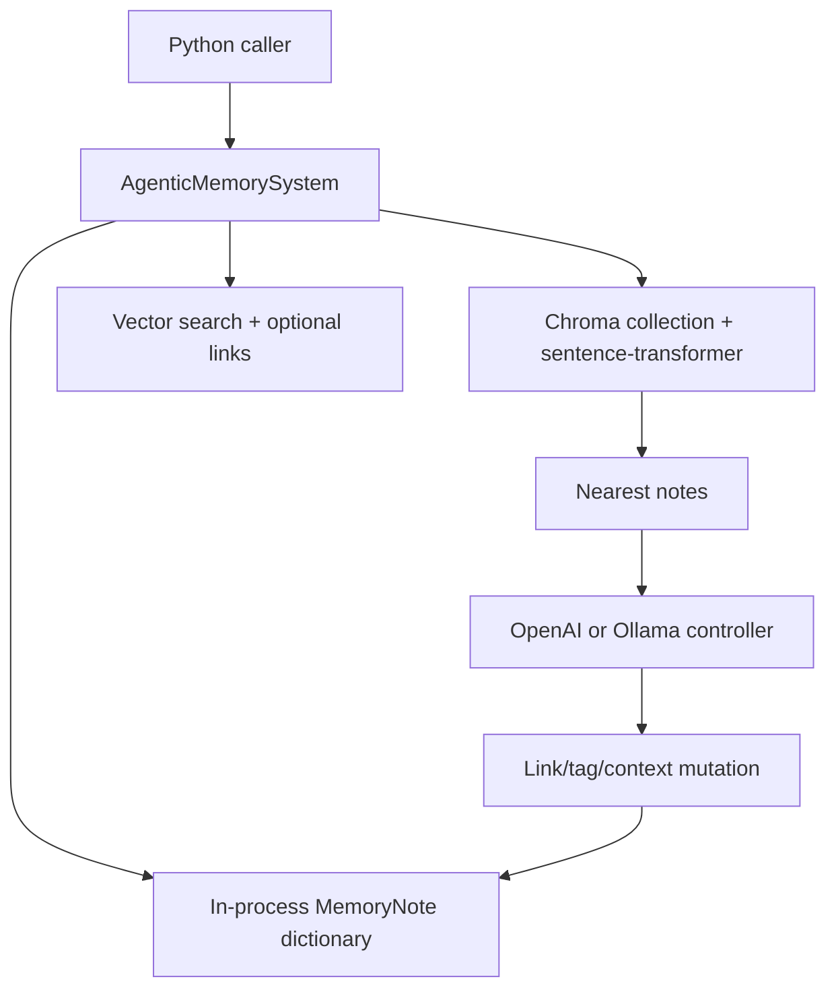

## 1. Executive Summary

A-MEM is a compact research implementation of agentic, Zettelkasten-inspired
memory. Each note can carry keywords, context, tags, links, access metadata, and
an evolution history. On insertion, vector-nearest notes are shown to an LLM,
which can link the new note and rewrite neighboring tags or context.

The valuable idea is that memory organization can evolve with new evidence
rather than freezing metadata at ingestion time. The current implementation,
however, is not safe to use as a production memory engine:

- The core system is process-local, and its constructor calls
  `temp_retriever.client.reset()` — which drops every collection on that
  in-process Chroma client, not only the one named `memories`. The settings it
  passes, `Settings(allow_reset=True)`, exist to make that call possible.
- Search is vector-only despite “hybrid” docstrings, and the method carrying
  those docstrings has no caller.
- **The notes the model is shown are not the notes the code rewrites.**
  `find_related_memories` discards the UUIDs it just read and returns the
  enumeration positions `[0, 1, 2, …]`; `process_memory` uses those to index
  `list(self.memories.values())`, which is insertion-ordered. Since the indices
  are always `0..n-1`, the notes rewritten are the *first notes ever added*,
  whatever the nearest neighbours were. The code says so itself, in a comment
  above the lookup: *"Since indices are just numbers now, we need to find the
  memory / In memory list using its index number."*
- LLM-authored links are not validated as existing UUIDs.
- No user/project scope, provenance, trust state, or durable correction model
  exists.

And the test named for the mechanism cannot fail on it: `test_memory_evolution`
adds three related notes and then asserts `assertIsNotNone` on each one's
`tags`, `context` and `keywords` — all three of which `MemoryNote.__init__`
sets to `[]`, `"General"` and `[]` before any evolution runs. A suite that
exercises the evolution path and asserts only what the constructor guarantees
is why a defect of this size can sit in a repository that has tests.

Treat A-MEM as a readable research sketch and source of design questions, not
as a borrowing-ready library. MIT-licensed. The paper is
[arXiv:2502.12110](https://arxiv.org/abs/2502.12110) and the README sends
reproduction to `WujiangXu/AgenticMemory`, so neither the harness nor the
results are in this tree.


## 2. Mental Model

Memory is a graph-like collection of enriched notes:

```text
new note
  -> vector-nearest existing notes
  -> LLM evolution decision
  -> optional new links and tag changes
  -> optional neighbor context/tag rewrites
  -> note + metadata in Chroma and process memory
```

The Zettelkasten analogy comes from small notes and explicit links. Unlike a
human-maintained Zettelkasten, link creation and neighborhood revision are
delegated to an LLM. Retrieval starts with embedding similarity and can append
linked neighbors.

“Evolution” here means metadata and link mutation. It is not reinforcement
learning, factual verification, decay, or model-weight adaptation.


## 3. Architecture



`AgenticMemorySystem` owns an in-memory dictionary and an ephemeral
`ChromaRetriever`. A separate `PersistentChromaRetriever` exists, along with a
temporary-copy variant for isolated experiments, but the main memory system
does not use them.

There is no server, worker, queue, transaction coordinator, authentication
layer, or prompt-injection boundary.


## 4. Essential Implementation Paths

- `agentic_memory/memory_system.py::MemoryNote`: note schema.
- `AgenticMemorySystem.__init__`: resets and opens the shared `memories`
  collection, configures the LLM, and defines the evolution prompt.
- `add_note`: runs evolution, writes the process dictionary, then adds Chroma
  metadata.
- `find_related_memories`: returns formatted nearest notes and positional
  indexes.
- `process_memory`: asks the LLM to link or rewrite a neighborhood.
- `search_agentic`: vector retrieval followed by limited linked-note expansion.
- `update` and `delete`: mutate the dictionary and vector store.
- `consolidate_memories`: recreates a retriever and re-adds all notes.
- `agentic_memory/retrievers.py`: ephemeral, persistent, and copied Chroma
  wrappers.


## 5. Memory Data Model

`MemoryNote` contains:

- Free-text content and a UUID.
- Keywords, context, category, and tags.
- Links to other notes.
- Creation and last-access timestamps.
- Retrieval count.
- Evolution history.

Most fields default to empty or generic values. Although `analyze_content`
defines an LLM extraction prompt, no caller in the repository invokes it. A
new note therefore keeps caller-supplied metadata or defaults unless the
evolution path changes its tags or links.

Chroma metadata serializes lists and dictionaries to JSON strings and attempts
to recover their types with `ast.literal_eval` on read. The in-memory
`MemoryNote` objects remain the practical source of truth for core operations.


## 6. Retrieval Mechanics

`ChromaRetriever.search` embeds the query with a sentence-transformer and asks
Chroma for nearest documents. Both `search` and `search_agentic` rely on this
one semantic channel.

`search_agentic` hydrates metadata from the vector hits, then appends linked
memories from the process dictionary — and returns `memories[:k]`. The vector
loop has already filled the list to `k` whenever the store holds at least that
many notes, so in the ordinary case every appended neighbour is truncated away
before the caller sees it. The `is_neighbor: True` flag the appended entries
carry is only observable when the vector search came back short.

The internal `_search` method carries the hybrid docstring and **has no caller
anywhere in the repository or its tests.** It would also fail if one were added:
it calls `self.retriever.search(query, k)` twice, and `ChromaRetriever.search`
returns a dict, so `for result in embedding_results` iterates the dict's *keys*
and `result.get('id')` is called on a string. The hybrid retrieval is not a
weak implementation; it is unreachable code that would raise `AttributeError`
on its first iteration.

There is no lexical retrieval, rank fusion, scope filter, recency/importance
reranking, token budget, or evidence-aware result format.


## 7. Write Mechanics

`add_note` creates a note and calls `process_memory` before persisting it. The
first note bypasses analysis and evolution. Later notes retrieve five neighbors
and ask the LLM for strict JSON containing:

- Whether to evolve.
- `strengthen` and/or `update_neighbor` actions.
- Suggested connections.
- New tags for the new note.
- New context and tags for every neighbor.

The implementation then mutates live objects, and this is where the identity is
lost. `find_related_memories` enumerates `results['ids'][0]` — the real UUIDs —
formats each neighbour into the prompt as `memory index:{i}`, and appends `i` to
the list it returns, dropping `doc_id`. `process_memory` then does:

```python
noteslist = list(self.memories.values())
notes_id = list(self.memories.keys())
...
memorytmp_idx = indices[i]
if memorytmp_idx < len(noteslist):
    notetmp = noteslist[memorytmp_idx]
    notetmp.tags = tag
    notetmp.context = context
```

`indices` is `[0, 1, 2, …]` by construction, so `memorytmp_idx` is the vector
rank, and `noteslist` is in insertion order. The notes whose tags and context
get overwritten are therefore the **first ones ever added to the store**, and
the correspondence to the neighbours the model was shown holds only when
insertion order happens to match vector rank — which it does for the first few
notes of a fresh store, and then never again. The mutation is not random: it is
systematically aimed at the oldest notes.

Update is delete-then-add in Chroma after mutating the live object. Delete
removes the target but does not clean incoming links. Neither operation is
atomic across the dictionary and Chroma.

“Consolidation” does not summarize or merge notes; it opens the collection and
re-adds every current document, which risks duplicate-ID failure depending on
Chroma behavior.


## 8. Agent Integration

Integration is a direct Python API: create `AgenticMemorySystem`, add notes,
search, update, and delete. The included example demonstrates a local Ollama
backend.

There are no lifecycle hooks, MCP tools, REST endpoints, automatic context
injection, multi-agent namespace, or framework adapters. The persistent and
copied retrievers can support experimental sharing or forked starting memory,
but callers must assemble that behavior themselves.


## 9. Reliability, Safety, and Trust

Strengths:

- Strict JSON schema constrains the shape of the evolution response.
- Evolution errors fail closed to leaving the new note unchanged.
- Persistent Chroma access requires an explicit `extend=True` for an existing
  collection.
- The copied retriever offers an isolated disposable clone for experiments.

Limitations:

- Main-system initialization calls `client.reset()`, which drops every
  collection on that in-process Chroma client rather than only `memories`. The
  persistent retriever is unaffected: it builds its own `PersistentClient` over
  a directory.
- Neighbour identity is not confused so much as discarded: the rewritten notes
  are the oldest in the store.
- Suggested link IDs are accepted without referential validation.
- No locking protects concurrent writes.
- No provenance connects an evolved field to source evidence or model output.
- No privacy filtering, authentication, scope, retention, or audit trail.
- No candidate/verified/rejected state distinguishes generated organization
  from trusted knowledge.
- Mutation errors can leave Chroma and process memory inconsistent.


## 10. Tests, Evals, and Benchmarks

Twenty-two test functions across two files: CRUD, metadata serialization,
vector top-k, persistent collection access, copied/persistent behaviour,
relationships and consolidation. The memory-system tests instantiate an OpenAI
backend and never inject the included `MockLLMController`, which is defined in
`tests/test_utils.py` and referenced nowhere else in the repository.

**The evolution assertions are vacuous, and this is the finding of the
re-reading.** `test_memory_evolution` adds three related notes, then asserts
`assertIsNotNone` on each note's `tags`, `context` and `keywords`, and again on
the same three fields of each search result. `MemoryNote.__init__` sets them to
`[]`, `"General"` and `[]`, so every assertion holds on a note that was never
evolved at all. Nothing in the suite asserts that the note the model was shown
is the note that changed, which is exactly the defect in section 7.

`negative_eval` is withheld, and the nearest thing to it is worth naming:
`test_delete_document` adds one document, deletes it, and asserts
`len(results["ids"]) == 0`. That is a keyed `collection.get(ids=[doc_id])`
rather than a query, and the collection holds nothing else at the time, so it
asserts that an empty store returns nothing rather than that particular
material was withheld from a result.

The test suite was not run for this atlas review because it downloads embedding
models and may call an external LLM.

The README says experiments across six foundation models outperform baselines,
but directs reproducibility to `WujiangXu/AgenticMemory`. This package contains
neither the paper benchmark harness nor committed result artifacts, so those
claims cannot be verified from the inspected repository.


## 11. For Your Own Build

### Steal

- Model memory as small linkable notes rather than one growing summary.
- Reconsider local organization when new evidence arrives.
- Separate a shared persistent corpus from disposable per-agent copies.
- Constrain model decisions with a strict structured schema.
- Keep evolution optional and fail closed on parsing errors.

The invariant to add before stealing the design is simple: every neighbor and
link must use a stable memory ID end to end.


### Avoid

- Using a ranking position as a persistent object identity. The comment that
  admits the substitution — *"Since indices are just numbers now"* — is the
  moment to stop and thread the id through instead.
- Asserting `assertIsNotNone` on a field the constructor initialises. A test
  named for a mechanism should fail when the mechanism does not run, and the
  cheapest version of that here is to capture a neighbour's tags before the
  write and assert they changed.
- Letting an LLM mutate active neighboring memories without provenance or
  review.
- Naming vector-only retrieval “hybrid.”
- Treating reindexing as semantic consolidation.
- Resetting a shared collection inside a constructor.
- Keeping graph links without referential integrity or delete cleanup.
- Citing results whose runnable evaluation lives outside the analyzed package.


### Fit

Borrow the concept, not the current core. A production implementation would
need stable IDs, durable canonical storage, a rebuildable vector projection,
validated edges, provenance for every mutation, scoped access, transactional
updates, and reviewable candidate changes.

The system is useful for research prototypes where observing emergent note
organization matters more than persistence and correctness. It should not sit
on a consequential agent path without substantial redesign.

If implementing the pattern, generate proposed links and metadata revisions
into a change set. Validate referenced IDs, record the source neighborhood and
model, then atomically accept or reject the proposal.


## 12. Open Questions

- Should evolution create proposals instead of mutating active notes?
- How should contradictory notes be linked without rewriting one into the
  other?
- What is the intended role of `analyze_content`, which has no call site?
- How should linked neighbors affect top-k rather than being truncated away?
- Can the paper evaluation be packaged with the library and pinned artifacts?
- What consolidation invariant was intended beyond reindexing?


## Appendix: File Index

- `agentic_memory/memory_system.py`: notes, evolution, CRUD, retrieval.
- `agentic_memory/retrievers.py`: Chroma adapters and collection copying.
- `agentic_memory/llm_controller.py`: OpenAI and Ollama completion backends.
- `examples/sovereign_memory.py`: local Ollama example.
- `tests/test_memory_system.py`: memory lifecycle tests.
- `tests/test_retriever.py`: Chroma and persistence tests.
- `tests/test_utils.py`: unused mock LLM controller.
- `README.md`: architecture and external paper-reproduction link.

**Searches recorded for the negative claims** (re-run at this pin)

```sh
grep -rn "analyze_content" . --include="*.py"     # one hit: the definition. No caller.
grep -rn "_search(" . --include="*.py"            # no caller; the only match is a
                                                  # test function named test_search,
                                                  # which exercises the retriever's own
                                                  # search and not this method
grep -rn "MockLLMController" . --include="*.py"    # one hit: its definition in tests/test_utils.py
grep -rn "assert" tests/*.py | grep -E "not |!=|None|raises"
                                                  # every negative-shaped assertion in the
                                                  # suite; the only content-level one is the
                                                  # keyed get after a delete
git rev-list --count <pin>..HEAD                  # 0 — the pin is still the tip of main,
                                                  # whose last commit is 2025-12-12
```

The grep for `_search` is the reason this block exists: a first pass without
`--include` quoted was eaten by the shell and returned nothing at all, which
would have supported the same conclusion for the wrong reason.

## History

**2026-09-17** — [`ceffb860f0712bbae97b184d440df62bc910ca8d`](https://github.com/agiresearch/A-mem/commit/ceffb860f0712bbae97b184d440df62bc910ca8d) — re-read at the same commit, which is still the tip of `main`: `git rev-list --count <pin>..HEAD` returns 0 and the last commit upstream is 2025-12-12. Nothing had changed, so this reading audited the previous one's claims against the code rather than looking for drift, and three of them are now stated more exactly.

The positional-identity defect is not that the wrong neighbour *can* be mutated but that the notes rewritten are the **oldest in the store**: `indices` is `[0..n-1]` by construction and it indexes an insertion-ordered list, so the correspondence to the neighbours the model was shown holds only while insertion order matches vector rank. The destructive initialisation is wider than a single collection — `client.reset()` drops every collection on that in-process client, with `Settings(allow_reset=True)` passed to make the call possible — and narrower in one respect the previous reading did not say: the persistent retriever builds its own `PersistentClient` and is untouched. And the hybrid `_search` is not a weak implementation but unreachable code that would raise `AttributeError` if it were called, because it iterates a Chroma result dict and calls `.get` on the resulting string keys.

The new finding is why a defect that size survives in a repository with twenty-two tests: `test_memory_evolution` asserts `assertIsNotNone` on `tags`, `context` and `keywords`, which `MemoryNote.__init__` sets to `[]`, `"General"` and `[]`. The test named for the mechanism passes on a note that was never evolved. `MockLLMController` is still defined and still never injected. Marks unchanged at none, with the near-miss on `negative_eval` now named: a keyed `collection.get` after a delete, against a collection holding nothing else.

`stack_source` moves from `seeded` to `reviewed` — Chroma plus an in-process dictionary, one vector arm, no lexical channel — and the appendix now carries the searches behind the absence claims. Screened again before reading: no auto-run surface, one build-time execution path (`tests/conftest.py`), two unpinned manifests, nothing inside the seven-day cooldown. Nothing was installed and nothing was run; the suite downloads embedding models and calls an external LLM.

**2026-07-27** — [`ceffb860f0712bbae97b184d440df62bc910ca8d`](https://github.com/agiresearch/A-mem/commit/ceffb860f0712bbae97b184d440df62bc910ca8d) — first reading. Screened before reading; nothing was installed or run.
