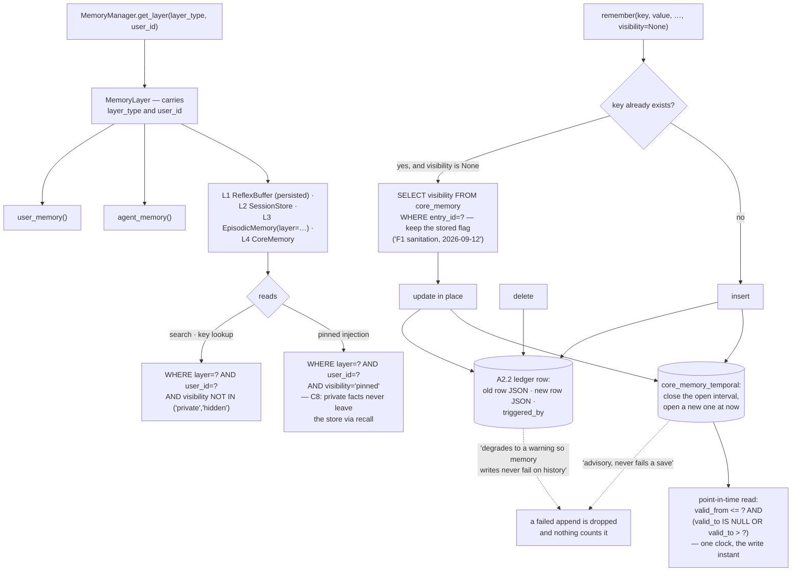

## 1. Executive Summary

a-memory is "4-tier agent memory with hybrid search and a real knowledge graph —
all in plain SQLite files. Zero cloud. Zero external APIs." MIT, Python, 66,891
lines with 281 test files and 1,606 test functions, on PyPI, with an MCP server
and an optional embeddings extra.

The four tiers are an L1 reflex buffer (now persisted — "was in-memory only
since forever"), an L2 session store, L3 episodes and L4 core facts. Three
mechanisms in the L4 store are worth the visit, and they share a weakness.

**Visibility is a quarantine that sticks.** A fact carries
`visible | pinned | private | hidden`. Search and key lookup both select
`WHERE layer=? AND user_id=? AND visibility NOT IN ('private','hidden')`, and
the pinned-injection block selects only `visibility='pinned'` — with the
invariant written down beside it: "C8: private facts never leave the store via
recall (the inject pinned block does not read them)."

What makes it a quarantine rather than a flag is the re-save path. Passing no
visibility on a write re-reads the stored one before updating, under a comment
that records both the bug and its date:

> "a 'hidden' row re-saved with the same canonical key would otherwise be back
> to 'visible' — F1 sanitation, 2026-09-12"

So, as the API docstring puts it, "'hidden' works as a key quarantine: future
writes update the row but never un-hide it." A memory suppressed once cannot be
resurrected by writing to it again, which is the failure most systems with a
suppression flag have. The quarantine is also asymmetric in the useful
direction: `visibility` is an argument on the MCP write tool
(`mcp_server/tools/memory.py:37`, `:78`), so the agent can hide a key for
itself — and the re-save rule means it cannot unhide one.

**The predicate is in three queries and not in the fourth.** `search`
(`core/memory.py:407`), the key lookup (`:450`) and the pinned-injection read
(`:348`) each carry the visibility clause in SQL. `get_all` (`:328-334`) does
not: it selects every row for the layer and user, orders by importance and takes
a limit. One caller adds the missing test in Python —
`features/inject.py:222` keeps only `visibility == 'visible'` — and five
production callers do not:

- `features/inject.py:165-170`, the compaction block, twenty lines from the one
  that does, emits every fact at or above the importance threshold
- `features/smart_context.py:51-56`, same threshold, into the important-candidate
  list
- `features/recall.py:62-64`, which emits facts whose key begins `dream_` or
  whose importance is at least 0.95
- `core/__init__.py:106-108`, the `summary()` helper, which emits all ten
- `mcp_server/tools/ops.py:93-94`, which writes the facts string into a
  `CONTEXT.md` snapshot

Each renders `key=value`, so a `private` or `hidden` fact with high importance
reaches a prompt — or a file — through any of them. That is the same sentence
the store disproves two files away: *"C8: private facts never leave the store
via recall."* The invariant is true of the query it is written beside and of no
other read. The distiller is the one deliberate exception and says so: hidden
rows stay in its novelty-gate select (`lifecycle/distiller.py:244-250`) because
a paraphrase aimed at a quarantined key has to be suppressed too — it compares
against the value without emitting it.

The search that finds this is one line: list the callers of `get_all` and check
each for a `visibility` test.

```bash
grep -rn "get_all(" --include=*.py . | grep -v tests
```

**Scope is a property of the handle.** `MemoryManager.get_layer(layer_type,
user_id)` returns a `MemoryLayer` that carries both and builds its episodic and
core stores beneath it; `user_memory()` and `agent_memory()` are the named
accessors. Every core-memory read begins `WHERE layer=? AND user_id=?`, and
`episodes` carries a `layer` column with two indexes on `(layer, user_id)`.

That is a predicate on a shared table, not a file per layer, and the caller
never passes it — which is what the README's "[u]ser facts and agent identity
never share a namespace" amounts to in code, and the reason it earns the mark
rather than reading as a filing convention.

**Every mutation appends a before-and-after row.** `_record_history` writes "one
A2.2 ledger row with full before/after row JSON" and is called from all three
paths: update with the old row and the new, insert with a null before, and
delete with a null after attributed `triggered_by or "delete"`. Beside it,
`_record_temporal` maintains an interval chain per key in
`core_memory_temporal`, closing the open interval and opening a new one on each
write, with a point-in-time read selecting
`valid_from <= ? AND (valid_to IS NULL OR valid_to > ?)`.

The shared weakness is that the last two are advisory. `_record_history`
"[d]egrades to a warning so memory writes never fail on history"; `_record_temporal`
is "advisory, never fails a save". Both are wrapped in a bare exception handler.
The intent is right — a ledger failure should not lose a memory — but the
implementation drops the record silently, so a gap in the ledger and a broken
interval chain are both invisible after the fact, and nothing counts them.

The interval chain is also not a second time axis. `valid_from` is set to the
write instant, the same clock as `updated_at`, so the point-in-time query
answers what the store held at a past moment rather than when anything was true
in the world. No bitemporal mark is claimed.

## 2. Mental Model

A **layer** is user or agent, and you are handed one rather than naming it.

A **fact** is a key and a value with an importance, a kind, a source and a
visibility.

**Hidden** is a decision about a key that later writes inherit.

A **ledger row** is what changed, with both images and who triggered it.



## 3. Architecture

| Area | Role |
| --- | --- |
| `core/__init__.py` | `MemoryManager`, `MemoryLayer`, and the tier wiring |
| `core/memory.py` | `CoreMemory`: save, the visibility rules, the ledger, the interval chain |
| `core/episodic.py` | L3 episodes, layer-scoped with its own indexes |
| `core/session.py`, `reflex.py` | L2 and L1 |
| `graph/`, `rag/` | The knowledge graph and hybrid retrieval |
| `lifecycle/`, `features/` | Consolidation, promotion and TTL |
| `mcp_server/`, `hooks/` | The agent surfaces |
| `alembic/` | Schema migrations |

## 4. Essential Implementation Paths

`core/memory.py:110-131` — the re-save that preserves visibility, the ledger
call and the interval close, in one block.

`core/memory.py:398-410` — the search predicate, and the C8 comment.

`core/__init__.py:38-53` and `:122-132` — how a handle comes to carry its own
scope.

## 5. Memory Data Model

An L4 fact is a key, a value, an importance, a memory kind, a visibility, a
source, an optional expiry and a layer and user. `source` is a documented
provenance contract — `user_explicit`, `staging_promotion`, `episode_promotion`
or `manual` — which distinguishes a fact a person stated from one the
consolidation sweep promoted out of an episode. That distinction is the one the
atlas most often finds missing in systems that extract from their own output.

Memory kind is validated and optionally reclassified on save, which makes it a
write-time genre rather than an epistemic state; `importance` is a float.
`visibility` is the discrete field that governs what a reader sees.

## 6. Retrieval Mechanics

Hybrid lexical and vector search over the core store with a knowledge graph
beside it, over-fetching ten times the limit so Python-side ranking can prefer
rows matching more query tokens.

The two exclusions are the part to copy. `private` and `hidden` never appear in
search results or key lookups, and the pinned block that injects facts into
context reads only `pinned` — so the set a model sees is narrower than the set a
search returns, deliberately.

## 7. Write Mechanics

One save path handling both update and insert, each appending a ledger row and
maintaining the interval chain, with delete doing the same in reverse.

The re-save visibility rule is the design decision worth naming: an explicit
`visibility` argument wins, and its absence means *keep what is stored* rather
than *use the default*. Those two readings of a missing argument are easy to
conflate and the difference here is whether a quarantine holds.

## 8. Agent Integration

An MCP server, hooks, and an OpenAPI surface, with the layer accessors as the
integration seam: an agent tool bound to `agent_memory()` cannot reach the user
layer through any argument it accepts.

## 9. Reliability, Safety, and Trust

The three mechanisms above are the trust story, and each has a caveat: two
degrade rather than fail, and the third holds in the queries that carry it and
not in the read that does not.

**The visibility predicate is written per query, not once.** Three L4 reads
carry it in SQL and `get_all` does not, so whether a `private` fact reaches a
prompt depends on which helper a caller happened to use — and five callers
render `key=value` with no test. The structural fix is the one
[MuninnDB](../muninndb/) reaches for: put the predicate in an admission
function every read path constructs, so a path that forgets it also forgets
lifecycle, scope and expiry and fails visibly. Here the same decision lives in
four places, three agree and the fourth is the default.

A ledger that "never fails a write" is the correct policy and a silent `except`
is the wrong implementation of it, for the same reason it was wrong in the other
systems this atlas has found doing it. The fix is small: count the drops, expose
the count, and a ledger can be both non-blocking and honest about its holes.

The interval chain has the same handling and one further limit — closing and
opening intervals outside a guarantee means a crash between the two statements
leaves a key with either two open intervals or none, and nothing reconciles it.

## 10. Tests, Evals, and Benchmarks

281 test files and 1,606 test functions, with an `eval/` directory, a CI badge
and coverage reporting. The repository also carries an `AUDIT_REPORT_20260629.md`
and an `ARIEL_RULES.md`, so the F1 and C8 labels in the comments appear to index
a review process; that process was not read here.

## 11. For Your Own Build

Decide what a missing argument means, and write it down. `visibility=None`
meaning "keep the stored flag" rather than "use the default" is the whole
difference between a quarantine and a suggestion, and the comment recording the
bug that taught them is what will stop it regressing.

Bind scope to the handle, not the query. `user_memory()` and `agent_memory()`
return objects that carry their own predicate, so isolation is not something a
caller can forget to pass — which is the failure mode this atlas finds in almost
every system whose scope is an argument.

Narrow the injected set further than the searched set. Search excludes private
and hidden; the block that actually reaches the model reads only pinned. Two
different questions, two different predicates.

And if a ledger must never block a write, count what it drops. A silent
`except` turns "we never lose a memory" into "we sometimes lose the record and
cannot tell".

## 12. Open Questions

Whether anything reconciles a broken interval chain. `_record_temporal` closes
and opens in two statements under an advisory handler, and no repair pass was
found.

What the F1, C8 and A2.2 labels index. They read as review findings, and
`AUDIT_REPORT_20260629.md` exists; the relationship was not traced.

Whether the unfiltered `get_all` callers are an oversight or a decision. One
sibling block in the same file adds the visibility test and the other does not,
which reads as an oversight; but the distiller's unfiltered select is
deliberate and says why, so the pattern is not uniform. Nothing in the tree
states which reads are meant to honour `private`.

## Appendix: File Index

| Path | What to read it for |
| --- | --- |
| `core/memory.py:110-131` | A re-save that cannot un-hide, with the dated bug behind it |
| `core/memory.py:398-410` | The search predicate and the C8 invariant |
| `core/__init__.py:38-53`, `:122-132` | Scope carried by the handle |
| `core/memory.py:217-231` | The before-and-after ledger, and what it does on failure |
| `core/memory.py:265-300` | An interval chain on one clock, and a point-in-time read |

## History

**2026-09-19** — [`32edbb91da0f54ad25b157e13bf6867c0a409526`](https://github.com/Cipher208/a-memory/commit/32edbb91da0f54ad25b157e13bf6867c0a409526) — `trust_state` re-tested against the narrowed line. `core/memory.py` and `core/__init__.py` are byte-identical to the previous pin, so what follows is a correction to this report rather than drift. The mark stands: `visibility` is a validated four-value state, three L4 queries carry it in SQL — `search` (`:407`), the key lookup (`:450`) and the pinned-injection read (`:348`) — and a re-save with no visibility re-reads the stored flag, so a hidden key stays hidden. The report said private and hidden are excluded from *both* read paths. There are more than two, and the predicate is written per query rather than once. `get_all` (`:328-334`) selects every row for the layer and user ordered by importance and takes no visibility clause. `features/inject.py:222` adds the test in Python; five production callers do not — `features/inject.py:165-170` (the compaction block, twenty lines from the one that does), `features/smart_context.py:51-56`, `features/recall.py:62-64`, `core/__init__.py:106-108` and `mcp_server/tools/ops.py:93-94`, which writes the facts string into a `CONTEXT.md` snapshot. Each renders `key=value`, so a private or hidden fact above the importance threshold reaches a prompt or a file through any of them — which the comment at `core/memory.py:406` says cannot happen: *C8: private facts never leave the store via recall.* It is true of the query it is written beside. The distiller is the one deliberate exception and says so: hidden rows stay in its novelty-gate select (`lifecycle/distiller.py:244-250`) so a paraphrase aimed at a quarantined key is suppressed too, and it compares against the value without emitting it. One open question is now answered: `hidden` is reachable from the agent-facing tools — `visibility` is an argument on the MCP write tool (`mcp_server/tools/memory.py:37`, `:78`), which makes the quarantine asymmetric in the useful direction, since the re-save rule means the agent can hide a key and not unhide it. Section 1, section 9, the matrix rows and the open questions were rewritten. Screened again first; nothing was installed and no suite was run.

**2026-09-16** — [`32edbb91da0f54ad25b157e13bf6867c0a409526`](https://github.com/Cipher208/a-memory/commit/32edbb91da0f54ad25b157e13bf6867c0a409526) — first reading, at a commit dated 16 September 2026. Screened before opening, from a shallow clone: eight files scanned, two auto-run surfaces, one build-time execution point, no unpinned surfaces and two dependency files inside the seven-day cooldown. Nothing was installed, built or run.
