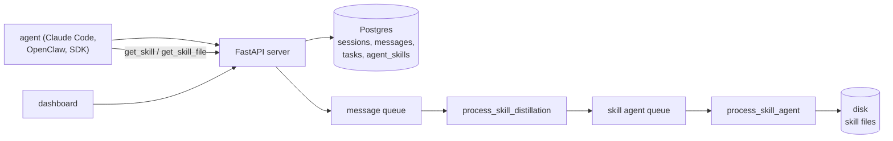

## 1. Executive Summary

Acontext is a skill-memory layer: it watches agent sessions, waits for a task to
finish, distils what worked and what did not, and writes the result into **agent
skill files** — Markdown directories with a `SKILL.md` whose schema you define. It
is from the same organization as [Memobase](../memobase/) and is close to its
opposite in philosophy. Memobase compiles conversations into the smallest possible
profile behind an API. Acontext writes files you can `git diff`.

The stated bet is worth quoting because the whole design follows from it: memory
should be "files you can read, edit, and share across agents", with "no
embeddings, no API lock-in" and "progressive disclosure, not search" — the agent
calls `get_skill` and `get_skill_file` and decides what it needs, rather than
being handed a semantic top-*k*.

**The reason this report matters to the atlas is the write gate.** The
[skills as procedural memory](../../patterns/skills-as-procedural-memory/) pattern
argues that a procedure should not be written to memory until an execution has
been verified, and notes that almost nothing does this. Acontext does. Its `tasks`
table constrains `status IN ('success', 'failed', 'running', 'pending')` as a
database CHECK, and only `success` or `failed` enqueue a learning task. More
unusually, **there are tests asserting the gate holds** —
`test_running_does_not_append`, `test_pending_does_not_append` and
`test_no_status_does_not_append` each assert `len(ctx.learning_task_ids) == 0`.
That is a mechanism, a constraint, and a test, which is a combination this atlas
does not often get to report.

The weaknesses follow from the same bet. Retrieval only happens if the agent
chooses to look; a skill that exists and is never fetched is inert. And a skill
file that is wrong can be rewritten or deleted, but nothing records that it was —
so the next successful task on the same subject can write it back.

## 2. Mental Model

A memory is a **skill**: a directory of Markdown files whose structure the user
declares.

```text
project
  └─ agent_skill  (project_id, disk_id, user_id)
        └─ SKILL.md + files      ← you define the schema
session ─► messages
   └─ task   status ∈ {pending, running, success, failed}
```

The lifecycle is an outcome-triggered pipeline rather than a state machine over
the memory itself:

```text
task.status → success | failed
        │
        ▼
   distillation        "what worked, what failed, user preferences"
        │              session: DISTILLING → SKILL_WRITING
        ▼
   skill agent         decides existing skill or new, writes per your SKILL.md
        │              session: → COMPLETED | FAILED
        ▼
   skill files updated
```

Two things are worth noticing about that diagram.

First, **failure is a first-class input.** `failed` triggers learning exactly as
`success` does, and the distillation prompt is described as inferring "what
worked, what failed". Most of this atlas records only what succeeded — the
comparative report makes the same observation about
[Neo4j Agent Memory](../neo4j-agent-memory/) storing failures by default — and it
is the difference between an agent that stops repeating a mistake and one that
only accumulates recipes.

Second, the statuses in the system belong to the **pipeline**, not to the memory.
`SessionStatus` moves through `QUEUED`, `DISTILLING`, `SKILL_WRITING`,
`COMPLETED`, `FAILED`; that is a job state. A skill file itself is never
candidate, verified, disputed or rejected. So `trust_state` is withheld even
though the codebase is full of statuses, and the distinction is worth keeping in
mind when reading any system: a status on the process is not a status on the
belief.

## 3. Architecture



- **Server** is `src/server/core/acontext_core/` — `schema/orm/` for the tables,
  `service/` for the data layer and the skill learner, `llm/` for the agent and
  prompt machinery, `infra/` for the queue and storage.
- **Two asynchronous stages** driven by a message queue:
  `process_skill_distillation` then `process_skill_agent`, each updating session
  status and each able to fail independently — the second has a
  `skill_agent.retrigger_failed` path.
- **A sandbox** (`src/server/sandbox/`, `packages/sandbox-cloudflare`) runs the
  skill agent's file edits, which is why "mount to the sandbox" appears in the
  project's own description of the workflow.
- **Clients** are Python, TypeScript and a CLI, plus packages for Claude Code and
  OpenClaw.

### Deployment and ergonomics

Heavier than the file-canonical systems it philosophically resembles: Postgres, a
queue, a sandbox and a server. `docker-compose.yaml` is committed and there is a
Helm chart under `charts/acontext`, so the intended deployment is a service rather
than a local library — which is a slightly odd fit for a design whose selling
point is "plain files, any framework".

The compensation is real, though, and it is the part to weigh: the *output* has no
lock-in even though the *system* does. Skills are Markdown, exportable as a ZIP,
readable by any agent that can read files. If you turn Acontext off, you keep the
memory in a form another system can use, which is not true of anything
vector-shaped in this atlas.

## 4. Essential Implementation Paths

**Task tracking** — `schema/orm/task.py`. The CHECK constraint
`status IN ('success', 'failed', 'running', 'pending')` is declared in the table
itself, with `Index("ix_task_session_id_status", "session_id", "status")` for the
lookup the trigger does.

**The gate** — the task-update path appends a task id to
`ctx.learning_task_ids` only on a terminal status. Its behaviour is pinned by
`src/server/core/tests/llm/test_skill_learner_trigger.py`:
`test_success_appends_task_id`, `test_failed_appends_task_id`,
`test_running_does_not_append`, `test_pending_does_not_append`,
`test_no_status_does_not_append`, `test_multiple_updates_collect_all`.

**Distillation** — `service/skill_learner.py:37`,
`process_skill_distillation(body, message)`. It moves the session to `DISTILLING`,
runs the LLM pass, records a `distillation_outcome` of `success` or `failed` in
its wide event, and on success moves to `SKILL_WRITING` and publishes to the skill
agent queue.

**Skill writing** — `service/skill_learner.py:124`,
`process_skill_agent(body, message)`. It decides target skill and file layout
according to the project's `SKILL.md` schema, writes through the disk
abstraction, sets `agent_outcome`, and marks sessions `COMPLETED` or `FAILED`.

**Retrieval** — there is no retrieval service. The agent is given
`list_skills`, `get_skill` and `get_skill_file` as tools
(`llm/tool/`, and the client packages) and calls them.

**Scoped reads** — `service/data/agent_skill.py:87` and `:98`:
`.where(AgentSkill.id == skill_id, AgentSkill.project_id == project_id)` and
`AgentSkill.project_id == project_id`. `service/data/disk.py:12` does the same
with `Disk.project_id`.

**Schema** — `schema/orm/`: `agent_skill.py`, `task.py`, `session.py`,
`message.py`, `artifact.py`, `disk.py`, `project.py`, `user.py`,
`learning_space*.py`, `session_event.py`, `sandbox_log.py`, `metric.py`.

## 5. Memory Data Model

The durable memory is **files**; the database holds the addressing and the
lifecycle around them.

`AgentSkill` carries foreign keys to `projects`, `disks` and `users`, all with
`ondelete="CASCADE"`, so removing a project actually removes its skills rather
than orphaning rows. The read path filters on `project_id`, which is what earns
`scope_enforced` — the boundary is applied in the query, not left as a tag.

`Task` is the interesting table because it is not memory: it is the *evidence for
a write*. A skill exists because a task with a terminal status existed, and the
task row persists alongside the session and its messages. That is
[evidence before belief](../../patterns/evidence-before-belief/) with an unusual
shape — the evidence is not the content the memory was derived from, it is the
*outcome that justified deriving it*. Both matter, and almost nothing else in the
atlas keeps the second.

What is absent: no version on a skill file beyond whatever the disk layer keeps,
no supersession pointer, no validity interval, no confidence, and no rejected-value
record. A skill is current or gone.

There is also no per-file provenance from a skill back to the tasks that shaped
it. The pipeline knows which tasks it distilled on the way through — the wide
events carry it — but no join from a skill file to the task ids was found,
so "why does this skill say that" is answerable from logs rather
than from the store.

## 6. Retrieval Mechanics

There is no retrieval mechanism, and that is the design.

The agent gets `list_skills`, `get_skill` and `get_skill_file`. It reads names and
descriptions, decides what looks relevant, and fetches. The project calls this
"progressive disclosure, not search" and is explicit that there is no embedding
index.

The case for it is strong and this atlas has made half of it elsewhere: a semantic
top-*k* returns something on every turn whether or not the turn needs memory,
which is the failure [gate the expensive path](../../patterns/gate-the-expensive-path/)
exists to prevent. Acontext's gate is the strongest possible version — the agent
must actively decide to look, so an irrelevant turn costs nothing and injects
nothing.

The cost is equally direct and should not be understated. Recall now depends on
the agent's judgement and on the quality of the skill *names and descriptions*,
because those are all it sees before fetching. A well-written skill with a vague
description is unreachable; a large skill collection becomes a listing problem;
and a weaker model will simply not look. This trades a retrieval-quality problem
you can measure for an agent-behaviour problem you mostly cannot — and nothing in
the repository measures whether the agent looks when it should.

Because it is files, the fallback is good: `grep` works, and so does mounting the
directory.

## 7. Write Mechanics

Writes are asynchronous, queued, two-stage, and — this is the point — **gated on
an outcome**.

The gate is the mechanism the
[skills as procedural memory](../../patterns/skills-as-procedural-memory/) page
asks for. That page's requirement is that a procedure is not written until an
execution verified it, and its complaint is that most systems distil from
transcripts regardless. Acontext will not learn from a session whose task is still
`running`, and it will not learn from one that never reported a status at all —
`test_no_status_does_not_append` pins that case specifically, which is the one a
naive implementation would get wrong.

Note what the gate is and is not. It verifies that *something concluded*, not that
the resulting skill is correct: a `failed` task also triggers learning, correctly,
because knowing what failed is the point. So this is an execution gate, not a
correctness gate, and the distinction matters when reading the pattern page's
claim.

Correction is the weak half. The skill agent decides "existing skill or new" and
rewrites files. There is no diff guard on that rewrite — nothing asserts that
content survived, in contrast to [ReMe](../reme/), which at least states an
additive-update rule even if it does not enforce it. And there is no tombstone: a
user who deletes a wrong skill from the dashboard has removed a file, not recorded
a rejection, so the next terminal task on the same subject can distil it back.
Given that distillation runs on every completed task, that is not a hypothetical
path.

### Operational cost

- **Synchronous?** No. The agent's turn never blocks on learning.
- **Lag?** Two queue hops plus two LLM stages after a task concludes. A skill
  learned from this run may not exist for the next one, and nothing measures the
  interval.
- **Whole-store passes?** None. Work is per-task, so cost scales with completed
  tasks rather than with the size of the skill library.
- **Read path?** Whatever the agent fetches — potentially nothing, potentially a
  whole skill directory. The token cost is agent-controlled, which is the flip
  side of agent-controlled recall.

## 8. Agent Integration

`src/packages/claude-code` and `src/packages/openclaw` are shipped integrations,
and the install path is a `SKILL.md` the agent is told to read — memory delivered
as a skill, which is consistent to the point of being a little recursive.

Model agency is high on the read side and nil on the write side: the agent chooses
what to fetch and cannot choose what is remembered. That split is unusual here and
defensible — recall is a reasoning decision, learning is an outcome-driven one.

`src/client/` provides Python, TypeScript and CLI clients, so adapting to another
host is realistic. There is no MCP server at this commit; the tools are provided
through the client packages.

## 9. Reliability, Safety, and Trust

Trust in the memory is not modelled. What Acontext has instead is a *provenance
of justification* — the task that triggered the write — and that is genuinely
worth something even though it earns no capability mark: an operator asking "why
does the agent think this" can at least reach the session and task that caused the
skill to be written, through the pipeline's events.

The human review surface is real and this report grants the mark on it, so the
reasoning should be checkable. `dashboard/app/project/[id]/agent-skills/page.tsx`
lists skills; `[skillId]/agent-skill-detail-client.tsx` renders the skill's file
tree, fetches file contents through `getAgentSkillFile`, and offers
`deleteAgentSkill` behind a confirmation dialog. A person can therefore read what
was learned, file by file, and remove it. Under the rubric — a place a person
inspects or adjudicates memory content, as opposed to a UI that only displays —
that qualifies. It is the weak form of the capability: delete-only, after the
fact, with no approve-before-effect step and no record of the removal. Compare
[MIRIX](../mirix/), whose dashboard renders six memory types and wires no mutation
at all, and [MineContext](../minecontext/), whose server implements a delete
endpoint the UI never calls.

Prompt injection has a narrower path than in the capture-driven systems, because
learning is triggered by task outcome rather than by content — but the
distillation still reads session messages, so injected text in a session that
completes successfully can shape a skill file. And a skill file is *instructions
an agent will follow*, which is a more dangerous payload than a stored fact.
Nothing in the inspected code treats skill content as lower-trust than a
hand-written skill.

Multi-tenancy is sound: project-scoped reads, cascading deletes, and a separate
`disk` abstraction per project.

## 10. Tests, Evals, and Benchmarks

43 test files across the server, and the coverage is aimed at the right place. The
`core/tests/llm/` group tests the learning machinery directly —
`test_skill_learner_trigger.py`, `test_skill_learner_agent.py`,
`test_skill_learner_distill.py`, `test_task_agent_atomicity.py` — with
`core/tests/service/test_skill_learner_consumer.py` covering the queue consumer
and `tests/e2e/` running the pipeline.

**The trigger tests are the most valuable artifact in this repository**, and they
are the reason this system changes what the atlas can say about the skills
pattern. Three of the six assert a *negative*: that a running task, a pending
task, and a task update with no status each leave `ctx.learning_task_ids` empty.
The gate is not a comment or a prompt instruction — it is behaviour with tests
that fail if it regresses.

Those are write-path assertions, so they do not earn `negative_eval`, which asks
for cases asserting that particular material must not be *retrieved*. But they are
the same discipline applied one stage earlier, and the atlas should say so: a
mechanism nobody tests is a mechanism nobody has, and Acontext tested the one that
matters most to its own design.

There is no benchmark harness and no committed scores, which is consistent — there
is no public benchmark for "did the agent learn the right skill", and inventing a
number would be worse than the absence.

The test I would want: distil a skill, delete it from the dashboard, run another
successful task on the same subject, and assert what happens. From reading the
code the answer is that it comes back.

## 11. For Your Own Build

### Steal

- **Gate the write on a terminal outcome, and test the gate.** A CHECK constraint
  on the status vocabulary, an enqueue that only fires on `success` or `failed`,
  and three tests asserting the other cases do nothing. That is the whole
  mechanism, it is cheap, and it is the difference between a skill library and a
  transcript summary.
- **Learn from failure explicitly.** Treating `failed` as a first-class learning
  trigger costs nothing extra once the gate exists and it is where most of the
  value is — an agent that stops repeating a mistake beats one that accumulates
  recipes.
- **Keep the outcome that justified the write, not just the content it came
  from.** Retaining the task row alongside the session gives "why was this
  written" a different and better answer than "here is the text it came from".
- **Let the agent decide to look.** No automatic injection means no irrelevant
  memory bending an answer, which is the failure most of this atlas's retrieval
  sections end up describing. Just budget for what section 6 says it costs.
- **Make the output portable even if the system is not.** Markdown skills
  exportable as a ZIP mean the memory outlives the vendor, which is a promise very
  few systems here can make.

### Avoid

- **Do not confuse a pipeline status with a trust state.** This codebase has
  `QUEUED`, `DISTILLING`, `SKILL_WRITING`, `COMPLETED`, `FAILED` — and no state
  that says anything about whether a skill is *right*. Rich job status can make a
  system look epistemically richer than it is.
- **Do not let a delete be the only correction.** Removing a skill file leaves no
  record, and in a system that distils on every completed task, the same content
  is one successful run away from returning.
- **Do not rewrite a skill file without a guard on what survived.** The skill
  agent decides existing-or-new and writes; nothing checks that the parts of the
  file the user wrote by hand are still there.
- **Do not assume progressive disclosure is free.** Recall now depends on names,
  descriptions and the agent's willingness to look — three things that are hard to
  measure and easy to get quietly wrong.

### Fit

Acontext suits a team running agents on repeatable tasks with detectable outcomes
— coding agents, workflow agents, anything that reports success or failure — and
that wants the accumulated know-how to be inspectable and portable rather than
locked in a vector store. That is a narrower brief than "agent memory" and the
narrowness is what makes the design coherent: the outcome gate only works if your
tasks have outcomes.

It is a poor fit for conversational or preference memory. There is no user profile,
nothing to remember about a person between sessions except insofar as a skill file
records it, and the whole write path waits for a task to conclude — so an agent
whose job is to talk will learn very little.

The judgement that decides it: do your agents' tasks have a status you can trust?
If yes, Acontext's gate is the best-implemented version of an idea this atlas has
been arguing for, and the tests mean it will stay implemented. If your tasks end
ambiguously, the gate never fires and you have deployed a queue, a sandbox and a
Postgres for nothing.

## 12. Open Questions

- **Who sets `task.status`, and how reliably?** The gate's value is entirely a
  function of that. The README says outcomes come "by agent report or automatic
  detection"; the detection path was not traced.
- **Is there a join from a skill file to the tasks that shaped it?** The wide
  events carry task ids through the pipeline; no persisted link from skill to task
  was found.
- **What does the disk layer keep?** Whether skill files are versioned — which
  would make rewrites recoverable — depends on the disk implementation and the
  sandbox, and was not established.
- **Can a user edit a skill file from the dashboard, or only delete it?** The
  detail client fetches file contents and offers delete; no save path was found,
  though editing the files directly is the documented workflow.
- **What is a `learning_space`?** It has three ORM tables
  (`learning_space`, `learning_space_session`, `learning_space_skill`) and was not
  traced through the service layer.

## Appendix: File Index

**Schema** — `src/server/core/acontext_core/schema/orm/agent_skill.py`,
`task.py`, `session.py`, `message.py`, `disk.py`, `project.py`, `artifact.py`,
`learning_space*.py`, `session_event.py`

**Write path / gate** —
`src/server/core/acontext_core/service/skill_learner.py`
(`process_skill_distillation`, `process_skill_agent`),
`src/server/core/acontext_core/llm/agent/`, `llm/prompt/`

**Scoped reads** — `src/server/core/acontext_core/service/data/agent_skill.py`,
`disk.py`, `artifact.py`, `project.py`

**Retrieval tools** — `src/server/core/acontext_core/llm/tool/`,
`src/client/acontext-py`, `acontext-ts`, `acontext-cli`

**Integration** — `src/packages/claude-code`, `src/packages/openclaw`,
`src/packages/sandbox-cloudflare`, `src/server/sandbox/`

**Review surface** — `dashboard/app/project/[id]/agent-skills/page.tsx`,
`[skillId]/agent-skill-detail-client.tsx`, `dashboard/app/project/[id]/actions.ts`

**Tests** — `src/server/core/tests/llm/test_skill_learner_trigger.py`,
`test_skill_learner_agent.py`, `test_skill_learner_distill.py`,
`test_task_agent_atomicity.py`,
`src/server/core/tests/service/test_skill_learner_consumer.py`,
`src/server/tests/e2e/`

## History

**2026-07-29** — [`259d73bfdebeed35ec2d4211ddc060a2d4126bc6`](https://github.com/memodb-io/Acontext/commit/259d73bfdebeed35ec2d4211ddc060a2d4126bc6) — first reading.
