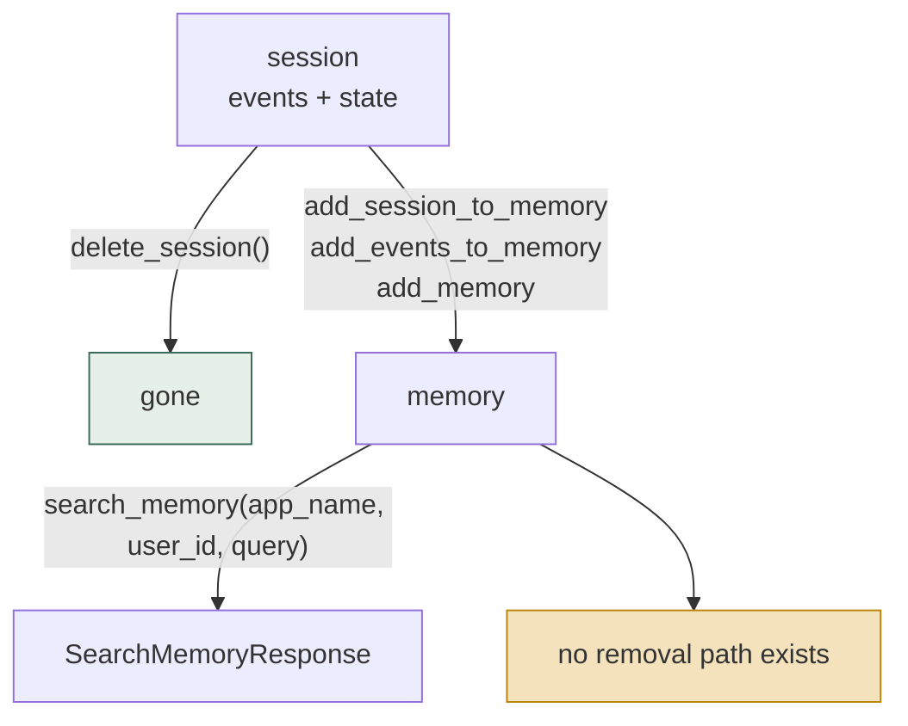
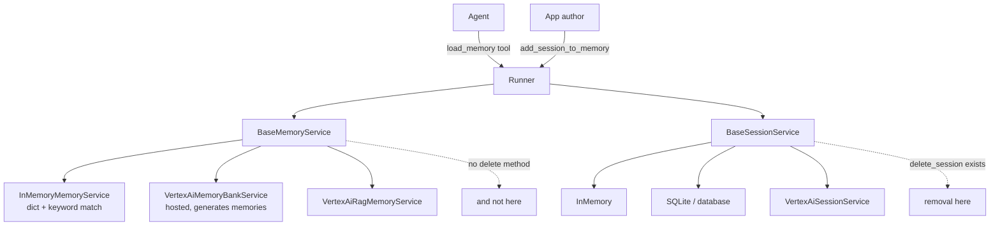

## 1. Executive Summary

ADK is Google's agent framework, and its memory layer is a **contract** rather
than a store: `BaseMemoryService`, three shipped implementations, and an
ecosystem of applications that will only ever be able to do what that interface
permits. That makes it a consequential member of the
[pluggable memory provider](../../patterns/pluggable-memory-provider/) family —
not for the code, but because many agents are written against the interface.

Two things it gets right.
**Scope is not optional.** `app_name` and `user_id` are required keyword
arguments on every write path and on `search_memory`, and the Memory Bank client
forwards them as a `scope` dict on retrieval — so a memory service in this
framework cannot quietly forget which user it is serving. A signature is
necessary rather than sufficient: at the first reading the in-memory service
composed the two into the string `"{app_name}/{user_id}"`, so an app named
`app/other-user` and a user `user` shared a bucket with app `app` and user
`other-user/user`; a tuple key replaced it on 5 August 2026, with a test. And **session and
memory are cleanly separated**: `BaseSessionService` owns the live conversation,
`BaseMemoryService` owns what outlives it, and `add_session_to_memory` is the
explicit hand-off between them.

The finding is what the contract omits. `BaseMemoryService` declares
`add_session_to_memory`, `add_events_to_memory`, `add_memory` and
`search_memory`. **There is no delete, no update and no expiry** — not as an
abstract method, not as an optional one that raises, and not in any of the three
implementations. Meanwhile `BaseSessionService` *does* declare `delete_session`.
So the transient half of a user's data has a removal path and the durable half
does not, and `add_session_to_memory` is a one-way door: content promoted out of
a deletable session into memory becomes unremovable through the framework.

For a framework carrying Google's name into regulated deployments, that is the
gap worth naming. Everything else — the keyword-matching default, the thin
`MemoryEntry`, the absent provenance — is ordinary and forgivable in an interface
meant to be replaced. An interface that cannot express deletion is not
replaceable by an implementation that supports it.

## 2. Mental Model

ADK distinguishes two things that are often conflated.

A **session** is the live conversation: an ordered list of `Event`s plus a
`State` dict, owned by `BaseSessionService`, created and deleted explicitly.

A **memory** is what an application decided should outlive that session. Its
unit is `MemoryEntry`: a `types.Content`, plus optional `id`, `author`,
`timestamp` and `custom_metadata`. That is the whole schema.

The asymmetry is the finding. A session has an explicit `delete_session()`; the
memory derived from it has nothing — so the transient half of a user's data can
be removed and the durable half cannot.

There is no state machine beyond that. Nothing is a candidate, nothing is
verified, nothing is superseded, nothing expires. A memory is present or was
never written, and the only transition the framework models is session → memory,
in one direction.

Control is **application-controlled** — neither agent-controlled nor automatic.
The framework does not decide what to remember: an app author calls
`add_session_to_memory` at whatever boundary they choose, and the agent calls
`load_memory` to read. The one place ADK exercises judgement on the user's behalf
is Vertex AI Memory Bank, which *generates* memories from events server-side —
and that generation is the vendor's, not visible here.

## 3. Architecture

Python, Apache 2.0, a large framework of which memory is a small and
deliberately replaceable part. The relevant modules are `memory/` (seven files,
~1,720 lines) and `sessions/`, with `tools/load_memory_tool.py` as the
agent-facing surface.

Three memory implementations ship:

- **`InMemoryMemoryService`** — a `dict` keyed `"{app_name}/{user_id}"`, then by
  session id. Search is `_extract_words_lower` on both sides and a set
  intersection. Its own docstring says "for prototyping purpose only" and "Uses
  keyword matching instead of semantic search". Honest, and nothing survives the
  process.
- **`VertexAiMemoryBankService`** (~1,000 lines) — the real one. Calls
  `agent_engines.memories` on a Vertex AI reasoning engine, with
  `generate_memories`, direct `create`, an ingest path, similarity search and a
  `retrieve_profiles` surface. Behaviour lives behind the API.
- **`VertexAiRagMemoryService`** — a RAG corpus as the memory backend.

The session side is better provisioned than the memory side: in-memory, SQLite,
a general database service with migrations, and Vertex.

### Deployment and ergonomics

- **What has to run:** nothing, for the default — but the default stores memory
  in a process dict, so "memory" in a stock ADK app does not survive a restart.
  Durable memory means a Vertex AI agent engine, which means a Google Cloud
  project, credentials and a billed hosted service.
- **Local and offline:** the framework runs; durable memory does not. There is no
  shipped local persistent memory backend — no SQLite memory service to match the
  SQLite *session* service.
- **An API key is required to durably store anything**, which is unusual in this
  atlas and follows directly from the previous point.
- **Hand-repairable:** the local store is a dict; the hosted store is someone
  else's database. Neither is a file you fix.

## 4. Essential Implementation Paths

**The contract.** `src/google/adk/memory/base_memory_service.py` — four methods,
of which two are `@abstractmethod` (`add_session_to_memory`, `search_memory`)
and two are non-abstract but **raise `NotImplementedError` in the base class**:
`add_events_to_memory` at line 92 ("This memory service does not support adding
event deltas. Call add_session_to_memory(session) to ingest the full session.")
and `add_memory` at line 117, with a message pointing the caller back at the
event-based paths. There is no working default behind either — an implementation
that wants them overrides them, and one that does not leaves a caller with an
exception. Only `add_session_to_memory` is guaranteed to be implemented.

**The schema.** `memory/memory_entry.py`, 45 lines including licence header.
`content`, `custom_metadata`, `id`, `author`, `timestamp` — the last documented
as "when the original content of this memory happened" and noted as forwarded to
the model.

**Default write and read.** `memory/in_memory_memory_service.py` —
`_user_key(app_name, user_id)` returns the `(app_name, user_id)` tuple; events
without `content.parts` are dropped; search extracts words Unicode-aware —
including a Latin word embedded in unspaced script — ranks entries by the number
of matching words and returns at most ten; a `threading.Lock` guards the dict.

**Hosted write.** `memory/vertex_ai_memory_bank_service.py` —
`_add_events_to_memory_from_events` (line 332),
`_add_events_to_memory_via_ingest` (385), `_add_memories_via_create` (474),
`_add_memories_via_generate_direct_memories_source` (509). A `MemoryEntry.id`
is now forwarded as the Memory Bank `memory_id`, and generation can be limited to
`allowed_topics`. Feature-detection
helpers (`_should_use_generate_memories`, `_supports_create_memory_metadata`,
`_get_create_memory_config_keys`) negotiate which server-side path is available.

**Hosted read.** `search_memory` (line 543) calls
`agent_engines.memories.retrieve` with `scope={'app_name': ..., 'user_id': ...}`
and `similarity_search_params={'search_query': query}`. `retrieve_profiles`
(line 599) is a second read surface carrying the same scope dict; `search_memory`
now returns each memory's `custom_metadata`.

**RAG read.** `memory/vertex_ai_rag_memory_service.py` — `search_memory` lists
the corpus, keeps the files whose encoded display name names the requesting app
and user, and ranks only inside them; with no such files it returns nothing. If
the listing fails or the corpus exceeds about a thousand files it retrieves
unscoped and filters the returned contexts, which the commit message describes as
a recall and data-transfer fix rather than a disclosure one.

**Agent surface.** `tools/load_memory_tool.py` — `load_memory` as a
`FunctionTool` with a generated declaration, plus `process_llm_request` to wire
it into a turn.

**Session lifecycle, for contrast.** `sessions/base_session_service.py` —
`create_session`, `get_session`, `list_sessions`, **`delete_session`**,
`get_user_state`, `append_event`, `flush`.

**Tests.** `tests/unittests/memory/` — 80 test functions across the three
services, plus `tests/unittests/tools/test_load_memory_tool.py`.

## 5. Memory Data Model

`MemoryEntry` is the entire durable schema: four optional fields on a content
blob. What that means in practice:

- **No source link.** `author` is a string; there is no session id, event id or
  span pointing back at what produced the memory. Once `add_session_to_memory`
  has run, an entry cannot be traced to its turn.
- **One timestamp**, describing when the content happened, with no counterpart —
  so nothing here is bi-temporal.
- **`custom_metadata` is the escape hatch**, and the contract states its keys are
  "implementation-defined by each memory service". Anything an application puts
  there is therefore not portable across the providers the interface exists to
  make interchangeable.
- **No confidence, no state, no expiry, no version.**

**Scoping is the strong part and it is structural.** `app_name` and `user_id` are
keyword-only *required* arguments on `add_events_to_memory`, `add_memory` and
`search_memory`; the in-memory service composes them into its dict key; the
Memory Bank service forwards them as a `scope` dict on both write and retrieve;
the RAG service encodes them into each file's display name and filters on it. A
memory service in this framework cannot be written that ignores the user boundary
without deliberately discarding arguments it was handed. That earns
`scope_enforced` — with the caveat the slash collision taught, that each
implementation still has to key on both values without ambiguity.

## 6. Retrieval Mechanics

One method, one query string, no options: `search_memory(app_name, user_id,
query) -> SearchMemoryResponse`. No `k`, no filters, no time range, no metadata
predicate, no ranking hints, and no scores on the way back —
`SearchMemoryResponse` is a pydantic model with exactly one field,
`memories: list[MemoryEntry]`, and nothing alongside it to rank on.

The default implementation is keyword matching, honestly labelled, now ranked by
the number of matching words and capped at ten results. The
Memory Bank implementation delegates to hosted similarity search whose ranking,
thresholds and chunking are not visible in this repository.

The consequence for an application author is that retrieval quality is entirely
the provider's, and the interface offers no vocabulary in which to ask for
anything different. A team wanting hybrid retrieval, recency weighting or a
narrowed scope implements `BaseMemoryService` themselves and ignores the query
signature's limits — at which point the portability the interface promises is
gone.

`retrieve_profiles` is a second, unabstracted read path: it exists on the Vertex
implementation and not on the base, so an application using it is bound to
Vertex.

## 7. Write Mechanics

Three entry points, deliberately layered, but only the first is required of an
implementation:

- `add_session_to_memory(session)` — the coarse one, and the only abstract write.
  Hands the whole session over and lets the service decide.
- `add_events_to_memory(app_name, user_id, events, session_id, custom_metadata)`
  — the same thing with explicit scope, for callers not holding a `Session`.
  Optional, raising a helpful `NotImplementedError` that redirects the caller to
  `add_session_to_memory` on services that do not support event deltas.
- `add_memory(app_name, user_id, memories, custom_metadata)` — direct writes,
  optional, raising a helpful `NotImplementedError` on services that do not
  support them.

So the layering is a convention rather than a guarantee. A caller holding only a
`BaseMemoryService` can rely on one write path; the other two are a question
answered by the concrete service, and answered at runtime.

Writes are **application-triggered and synchronous at the call site**; no hook
captures automatically at a turn or compaction boundary. What Memory Bank does
afterwards — `generate_memories` runs an extraction server-side — is asynchronous
and opaque, and `_log_ingest_task_error` exists because the ingest path fires
tasks whose failures have to be caught somewhere.

**There is no deduplication, no conflict detection and no consolidation** in
anything shipped locally. Calling `add_session_to_memory` twice on one session is
explicitly anticipated — the docstring says "A session may be added multiple
times during its lifetime" — and nothing in the local implementation prevents the
second call producing duplicate content.

Nothing filters input. An event whose text is a prompt injection is stored and
returned by `load_memory` like any other.

### Operational cost

- **Local writes are cheap and non-durable.** A dict insert under a lock.
- **Hosted writes are a network call**, and with `generate_memories` a model runs
  on Google's side per ingest — a cost that is real and not visible here.
- **Lag before a memory is retrievable** is unstated. Zero for the in-memory
  service. For Memory Bank, generation and indexing are server-side, and
  `_add_events_to_memory_via_ingest` fires a task and logs errors from a
  callback, so the write is not acknowledged as retrievable.
- **No background pass exists in this repository.** Whatever Memory Bank runs on
  a schedule is not here.
- **On the read path** nothing is bounded: no `k`, no token budget. The agent
  gets whatever the service returns, and the `load_memory` tool puts it in the
  prompt.

## 8. Agent Integration

`LoadMemoryTool` is a `FunctionTool` the agent calls explicitly, with a
`process_llm_request` that injects it into a turn. So the model decides *when* to
consult memory and never decides what to store — writes belong to the
application. That asymmetry is the mirror of [Logseq](../logseq/)'s (create and
edit, never delete) and of [MemMachine](../memmachine/)'s (delete, never author),
and of the three it is the most conservative: the agent can only read.

The `Runner` wires a memory service into an app, and the plugin and `apps`
surfaces let an author swap it. Adapting a third-party memory system to ADK means
implementing two abstract methods — genuinely low friction, and the reason the
contract's omissions propagate.

## 9. Reliability, Safety, and Trust

**No trust model exists**, and for an interface that is defensible up to the
point where it prevents an implementation from having one. `MemoryEntry` has no
field in which a provider could return a confidence, a verification state or a
provenance chain, so a memory service that tracks those internally must flatten
them into `custom_metadata`, whose keys the contract declares
implementation-defined and therefore non-portable. The interface does not merely
lack a trust model; it makes a portable one impossible to express.

**The deletion gap is the finding, and it is asymmetric in the worst direction.**
`BaseSessionService` declares `delete_session`. `BaseMemoryService` declares no
removal method of any kind. `add_session_to_memory` moves content from the layer
that can be deleted to the layer that cannot. An application honouring a deletion
request by calling `delete_session` removes the conversation and leaves every
memory derived from it in place, with no framework-level way to find or remove
them. Reaching them means dropping to the provider's own API — Vertex's
`agent_engines.memories` — which is exactly the vendor coupling the abstraction
exists to prevent.

This atlas's [pluggable memory provider](../../patterns/pluggable-memory-provider/)
page records that the provider contracts reviewed carry scope more often than
deletion. ADK is an instance of that finding: scope in every signature, and still
no deletion.

**Multi-tenancy** is otherwise handled well — see §5. **Concurrency**: the
in-memory service takes a `threading.Lock`; the hosted service inherits whatever
Vertex provides. **Data loss**: the default service loses everything on restart,
which is documented rather than hidden.

## 10. Tests, Evals, and Benchmarks

**80 memory test functions** across `test_in_memory_memory_service.py`,
`test_vertex_ai_memory_bank_service.py` and
`test_vertex_ai_rag_memory_service.py`, plus a tool test. For an interface
package that is proportionate: the tests exercise scope-key composition, event
filtering, the feature-detection helpers that choose a Memory Bank path, and
error handling.

No memory benchmarks, and none would mean much — there is no retrieval pipeline
here to score, only a delegation.

`negative_eval` is earned on the isolation cases. `test_search_memory_is_scoped_by_user`
stores a secret for one user, asserts another user's search returns nothing, and
asserts the owner's search returns it; it was present at the first reading, which
missed it. `test_search_memory_does_not_collide_on_slash_in_identifiers` pins the
August fix, and the RAG suite asserts search returns only the caller's memory and
skips retrieval when the caller owns no files.

**What I would want before trusting it in a regulated deployment:** a deletion
method on the contract, and a test that it cascades.

## 11. For Your Own Build

### Steal

- **Put scope in the signature, not the query.** Required keyword arguments for
  `app_name` and `user_id` on every read and write make a scope bug a
  `TypeError` rather than a leak. This is the cheapest correct thing in the
  system — and key the store on the pair as a tuple, not a joined string.
- **Separate the session service from the memory service.** Two interfaces and
  one explicit hand-off means "what is live" and "what persists" cannot quietly
  become the same object — a confusion several systems here never escape.
- **Give the optional method a helpful failure.** `add_memory` raising
  `NotImplementedError` with a message naming the two alternatives is better
  ergonomics than omitting it and better honesty than faking it.
- **Say "prototyping purpose only" in the docstring** of the implementation that
  is a dict. ADK's default memory service is upfront that it is not durable
  memory, which is more than several products here manage.

### Avoid

- **Shipping a memory contract without a removal method.** Every application
  written against it inherits the gap, and it cannot be fixed by a better
  provider — only by changing the interface and breaking them. If you publish an
  abstraction, deletion belongs in v1 even if the first implementation raises
  `NotImplementedError`.
- **Deletion on the transient layer only.** If content is promoted from a
  deletable store into a durable one, the durable one needs the stronger removal
  guarantee. The direction of the promotion is the direction the guarantees must
  run.
- **A metadata escape hatch whose keys are implementation-defined.** It looks
  like extensibility and functions as an anti-portability clause: anything
  important enough to put there is important enough to be in the schema.
- **A retrieval signature with no parameters.** `query` alone gives an
  application no way to ask for recency, a limit or a filter, so the first
  serious user forks the interface.

### Fit

If you are already building on ADK, use the memory service — the scope discipline
is real and the session separation is right. Then write down, on day one, how you
will honour a deletion request, because the framework will not help you and the
answer will be provider-specific code that outlives your abstraction.

If you are choosing a framework and deletion is a compliance requirement rather
than a nicety, this is the wrong layer to inherit it from at this commit. That is
not an argument against ADK — it is an argument for treating its memory interface
as a read-and-write convenience and owning the lifecycle yourself.

If you are designing your own provider interface, this is the one to read first
and the one to diff against: copy the scope handling verbatim, and add the two
methods it is missing.

## 12. Open Questions

- **Does Vertex AI Memory Bank support deletion at the API level?** Almost
  certainly, being a managed store — but no client method here exposes it, so the
  question is whether the omission is an interface decision or a gap in this
  client.
- **What does `generate_memories` actually extract**, and against what prompt? It
  is the one place ADK forms beliefs rather than storing them, and it is entirely
  server-side.
- **What is the retrieval latency contract for a freshly ingested event?** The
  ingest path fires a task and logs failures from a callback; nothing states when
  the write becomes searchable.
- **Is `retrieve_profiles` intended to reach the base contract?** It exists only
  on the Vertex implementation, so any application using it is no longer
  portable.
- **Do any two shipped services agree on any `custom_metadata` key?** The
  contract says implementation-defined; this was not determined.

## Appendix: File Index

**Contract and schema**

- `src/google/adk/memory/base_memory_service.py` — the four methods
- `src/google/adk/memory/memory_entry.py` — `MemoryEntry`
- `src/google/adk/memory/__init__.py`, `_utils.py`

**Implementations**

- `src/google/adk/memory/in_memory_memory_service.py` — dict + keyword match
- `src/google/adk/memory/vertex_ai_memory_bank_service.py` — hosted, ~1,000 lines
- `src/google/adk/memory/vertex_ai_rag_memory_service.py`

**Session layer, for contrast**

- `src/google/adk/sessions/base_session_service.py` — including `delete_session`
- `src/google/adk/sessions/sqlite_session_service.py`,
  `database_session_service.py`, `vertex_ai_session_service.py`

**Agent surface**

- `src/google/adk/tools/load_memory_tool.py`
- `src/google/adk/runners.py`

**Tests**

- `tests/unittests/memory/test_in_memory_memory_service.py`
- `tests/unittests/memory/test_vertex_ai_memory_bank_service.py`
- `tests/unittests/memory/test_vertex_ai_rag_memory_service.py`
- `tests/unittests/tools/test_load_memory_tool.py`

## History

**2026-09-15** — [`322e3bf0ae4896f44ce4589926c1daa930c781b5`](https://github.com/google/adk-python/commit/322e3bf0ae4896f44ce4589926c1daa930c781b5) — 762 commits on, 2026-09-15; eleven touched `memory/`. Screened before reading: no auto-run surface, five build-time execution points, seven unpinned surfaces, one dependency surface inside the cooldown and an agent-instruction file read as data; nothing was installed or run. `BaseMemoryService` is unchanged: still no delete, update or expiry, so the headline stands. What moved in the implementations: the in-memory store is keyed by an `(app_name, user_id)` tuple after a slash in either value could alias another pair (5 August), its search became Unicode-aware, ranked and capped at ten; Vertex RAG search ranks inside the caller's own files instead of the whole corpus; Memory Bank gained `memory_id`, `allowed_topics`, injected credentials and returned `custom_metadata`. `negative_eval` added: the user-isolation test with its positive control was present at the first reading, which said no such test existed. `scope_enforced` kept with an evidence record. Two marks.

**2026-08-31** — [`6bab08fc803d26853417c4d6e71704b1a72e035e`](https://github.com/google/adk-python/commit/6bab08fc803d26853417c4d6e71704b1a72e035e) — count and citation audit at the same pin. Two claims were wrong, both understating how thin the contract is. §4 called `add_events_to_memory` concrete with a working default; it raises `NotImplementedError` at `base_memory_service.py:92` exactly as `add_memory` does at :117, so `add_session_to_memory` is the only guaranteed write — §7's layering is corrected to match. And `SearchMemoryResponse` was described as a bare `list[MemoryEntry]`; it is a pydantic model with a single `memories` field. The substance of both, that no scores come back and that the required methods are two, is unchanged. No capability mark changed.

**2026-07-29** — [`6bab08fc803d26853417c4d6e71704b1a72e035e`](https://github.com/google/adk-python/commit/6bab08fc803d26853417c4d6e71704b1a72e035e) — first reading.
