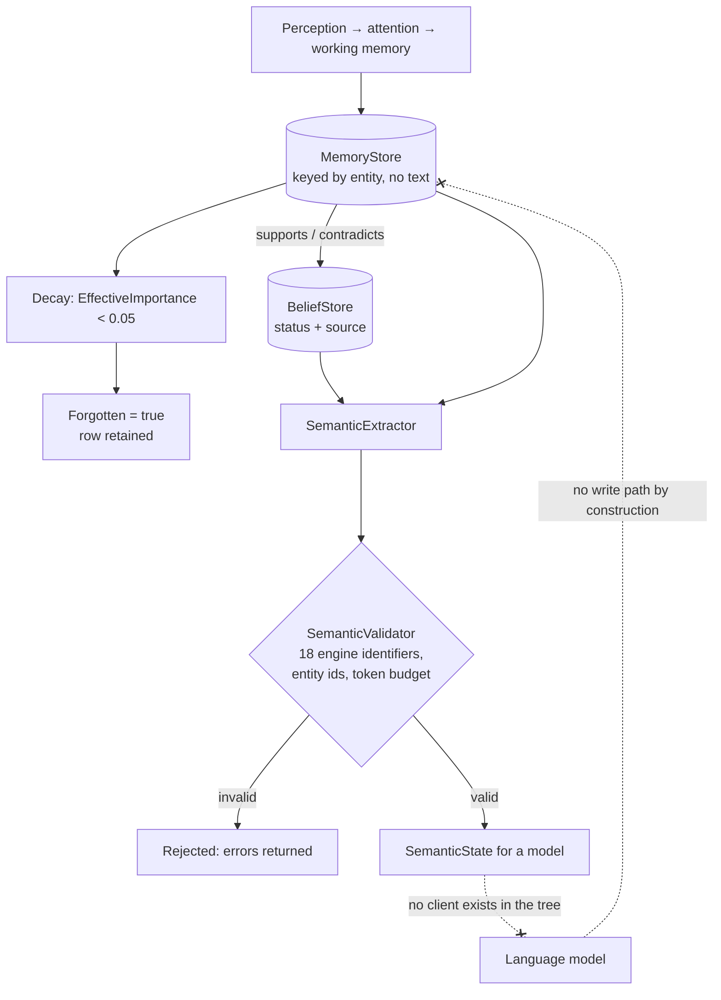

## 1. Executive Summary

Aeris is a 16,700-line GPL-3.0 cognitive simulation engine in C# on .NET 10,
built on an entity-component-system and documented in Spanish across nineteen
design documents and eight architecture decision records. Its stated purpose is a
simulated world in which narrative emerges from simulation rather than from a
prompt, and its central architectural commitment is stated in the README as a
rule about the model: *"El LLM nunca modifica el estado del mundo; únicamente
interpreta y expresa el estado interno"* — the model never modifies world state,
it only interprets and expresses the internal state.

That rule is enforced rather than asserted, which is what makes the system worth
a report. The engine builds a `SemanticState` — identity, situation, internal
state, world model, attention, working memory, long-term memory, social context
and directives — and `SemanticValidator` refuses it if it contains any of
eighteen engine identifiers: `EntityId`, `Entity(`, `Arch.`, `MemoryStore`,
`BeliefData` and the rest. Committed tests assert on the *serialized* payload
that `EntityId`, `Arch.` and `Store` do not appear in it. The boundary between
what the simulation knows and what a model is allowed to see is a checked
property.

The memory model is unusual in this corpus in a way that cuts both directions. A
`MemoryData` is a struct with no text: type, category, emotional weight,
importance, certainty, timestamp, the entity involved, the location, a forgotten
flag and a decay start. Nothing stores *what* was remembered. A `BeliefData` is
similarly compact, and carries what most systems here do not — a discrete
`BeliefStatus` of `Active | Weakening | Revised | Abandoned | Contradicted`, a
`BeliefSource` of `DirectObservation | ToldByTrusted | ToldByUntrusted |
CulturalTradition | InferredFromEvidence | Assumed`, and two pointers:
`SupportingMemoryId` and `ContradictingMemoryId`.

So a belief here knows how it was acquired, which memory supports it, which
memory contradicts it, and whether it currently stands — and neither the belief
nor the memory contains a sentence. Correction is a status transition on a
numeric record, not a repair of content, because there is no content to repair.

**Why it is in scope.** The stores are world resources, and `JsonPersistence`
serializes every resource except four runtime ones into a `WorldSnapshot` that
`LoadWorld` restores. Beliefs and memories therefore survive the session with
stable ids and a status that can later change, which is the atlas's admission
test. That the agent is a simulated character rather than an assistant is the
same situation as the roleplay clients already here.

## 2. Mental Model

A tick moves state through ordered phases, and belief is what survives the
journey.

**Perception writes memories.** `PerceptionSystem` produces percepts,
`AttentionSystem` selects among them by a swappable strategy, and
`WorkingMemorySystem` holds what is currently active.

**Consolidation and decay run on the clock, not on judgement.**
`MemoryConsolidationSystem` promotes, and `LongTermMemorySystem` walks every
entity's memories, computes `EffectiveImportance` — importance halved per
half-life of simulation time — and flips `Forgotten` when it falls below `0.05`.
Nothing is deleted; a forgotten memory keeps its row and stops being relevant.

**Belief is downstream of memory and carries its provenance.** A belief points at
the memory that supports it and at the memory that contradicts it, and its status
moves rather than its content changing.

**And the model sits outside all of it.** `SemanticExtractor` builds a projection,
`SemanticValidator` checks it for engine leakage, entity ids and token budget,
and something not present in this repository is expected to render it. The model
has no write path by construction: there is no API through which it could return
state.

Both dotted edges are findings. The model cannot write back — that is the design.
And nothing in the repository sends it anything — that is the gap.

## 3. Architecture

A library and a benchmark project, no application. `Aeris.Engine` holds the ECS
world, the systems and the stores; `Aeris.Benchmarks` runs BenchmarkDotNet over
the engine; `Aeris.Engine.Tests` is 9,834 lines of xUnit across 27 files with
FluentAssertions and FsCheck property tests.

Operational discipline is well above the median for this corpus. All eight NuGet
package references are exactly pinned. GitHub Actions are pinned to commit SHAs
with the version in a trailing comment. There are four workflows — CI,
documentation, OSSF Scorecard, and a separate **Determinism Check** that runs
only the tests whose names match `Determinis`. `Directory.Build.props` sets
`TreatWarningsAsErrors` and `EnforceCodeStyleInBuild` for every project.

Eight ADRs record the choices, including `0002-use-sqlite-json` and
`0006-self-model-reconstructed`. The second is load-bearing: the self is not a
stored component but a `SelfSnapshot` rebuilt each tick, so there is no
accumulating identity record to drift. The first has not landed — persistence at
this commit is JSON files, and no SQLite dependency exists.

## 4. Essential Implementation Paths

- **Memory** — `src/Aeris.Engine/MemoryData.cs`: the struct, `EffectiveImportance`,
  and `MemoryStore` keyed by entity.
- **Decay and forgetting** — `LongTermMemorySystem.cs`, threshold `0.05`,
  half-life defaulting to one simulated day.
- **Belief** — `BeliefData.cs`: `BeliefStatus`, `BeliefSource`,
  `SupportingMemoryId`, `ContradictingMemoryId`.
- **Retrieval** — `IMemoryRetrievalStrategy.cs` and `MemoryRetrievalSystem.cs`,
  with interchangeability covered by its own test file.
- **Projection** — `SemanticExtractor.cs`, `SemanticState.cs`, `SemanticFact.cs`.
- **The boundary** — `SemanticValidator.cs`: `EcsLeakPatterns`,
  `ValidateNoEntityIds`, `ValidateTokenBudget`, `ValidateStructure`.
- **Persistence** — `JsonPersistence.cs`: `CreateSnapshot`, the four excluded
  resource types, `SaveWorld`/`LoadWorld`, tick-interval checkpointing.
- **Trace** — `CognitiveTrace.cs`: `Record(system, input, output, why)`.

## 5. Memory Data Model

`MemoryType` is `Observed | Experienced | Learned | Inferred | Forgotten` and
`MemoryCategory` is `Social | Environmental | Combat | Discovery | Emotional |
Quest`. Both are single bytes, and the whole record is a value type — this is
data-oriented design applied to memory, and it is the cleanest example of that
shape in the atlas.

The absence of content is the defining property. A memory says *an event of this
kind, involving this entity, at this place, mattered this much and I am this
certain of it*. What actually happened lives in the simulation that produced it
and in the projection assembled for the model, not in the row.

`BeliefStatus` is the strongest part of the model and earns `trust_state`
outright. `Weakening` is a state most systems here express, if at all, as a
falling number; `Revised` and `Abandoned` distinguish two outcomes that a single
`active` boolean collapses; and `Contradicted` is a withholding state with a
pointer to the memory that caused it. `IsActive` requires both the status and a
confidence floor, so the enum gates reachability rather than decorating it.

`SemanticFact` — subject, predicate, object, certainty, source — is the only
place text appears, and it is a projection type rather than a stored one.

## 6. Retrieval Mechanics

`IMemoryRetrievalStrategy` takes a context carrying the working-memory store and
returns a `RetrievalResult`; strategies are swappable, and
`MemoryRetrievalInterchangeabilityTests` exists to assert that swapping one does
not change the engine's contract. The same interchangeability discipline covers
planning, reasoning and attention — four strategy interfaces, each with a test
file dedicated to substitutability.

Scoring is importance decayed against simulation time. There is no embedding, no
index, and no similarity anywhere in the tree, which is coherent: with no text in
a memory there is nothing to embed.

Scope is structural. Every store is a `Dictionary<uint, List<...>>` keyed by
entity, and every read is `GetBeliefs(entityId)` or the memory equivalent, so one
simulated agent reaching another's memory would require a different call rather
than a forgotten predicate. That earns `scope_enforced` on the same basis as the
file-boundary cases already here, with the same limit: it is partitioning inside
one process, not authorisation, and there is no user or tenant axis at all.

## 7. Write Mechanics

Writes are synchronous, deterministic and ordered. `SystemManager` runs systems
by `SystemPhase` and `Priority` within a tick; nothing is asynchronous, nothing
retries, and no model call sits on any write path. Write-to-retrievable lag is
one tick by construction.

Persistence is a checkpoint rather than a journal. `ShouldCheckpoint` fires on a
tick interval, `SaveWorld` serializes every entity's components and every
resource except `TimeResource`, `EngineStats`, `EventBus` and
`SchedulerResource`, and `LoadWorld` clears and reapplies. A save is a full
snapshot; there is no incremental write, and no record anywhere of a single
memory or belief having changed.

## 8. Agent Integration

There is none to review, and that is worth stating plainly rather than implying.
`docs/06-llm-contract.md` specifies the contract, `SemanticState` implements the
payload, `ExtractionOptions` carries a token budget and `EstimatedTokens` is
computed — and no HTTP client, provider SDK or model interface exists anywhere in
the repository. The engine is one half of an integration, built to a
specification, with the other half absent at this commit.

For a reader that is a feature as much as a gap: the projection is inspectable and
testable without any model in the loop, which is exactly why the leak assertions
can be ordinary unit tests.

## 9. Reliability, Safety, and Trust

**The validator is the mechanism to take away.** Eighteen forbidden identifiers,
a check for bare entity ids, a token-budget check and a structural check, all
returning a `ValidationResult` with errors and warnings rather than throwing. The
threat it addresses is not prompt injection but *representation leakage* — the
model being handed the engine's own vocabulary and reasoning about `EntityId`
values as though they were facts about the world. Nothing else in this atlas
checks that boundary in code.

**Determinism is a CI job, not a claim.** A dedicated workflow runs the
determinism-named tests on every push, which is the kind of thing usually
asserted in a README and left unverified.

**The trace explains and does not persist.** `CognitiveTraceLog.Record` takes a
system name, an input summary, an output summary and a **`why`**, links entries
by `ParentTraceId`, and is cleared each tick. It is the best-shaped explanation
record in the corpus for a single decision and it is not an audit: it does not
survive the tick, and no memory mutation is recorded anywhere.

**Nothing can be wrong in a way that needs correcting.** A memory has no claim in
it, so a wrong memory is a wrong *weight*, and the repair is decay. This is
internally consistent and it means the mechanisms this atlas most often looks for
— tombstones, supersession chains, provenance on content — have nothing to attach
to here.

## 10. Tests, Evals, and Benchmarks

9,834 lines of tests over 16,719 lines of engine, in 27 files. FsCheck brings
property-based tests; FluentAssertions the readability; and the naming shows what
the project considers risky — `CognitiveStressTests`, `E2EPipelineTests`,
`ModelInterchangeabilityTests`, four separate strategy-interchangeability suites.

`negative_eval` is earned on `SemanticExtractorTests`, which serializes the
extracted state and asserts `DoesNotContain("EntityId")`, `DoesNotContain("Arch.")`
and `DoesNotContain("Store")`, alongside a named
`Validation_NoEcsLeaks_InExtractedState`. The assertion is on the assembled
payload rather than on the extractor's return value, which is the form this atlas
asks for and rarely finds.

`Aeris.Benchmarks` runs BenchmarkDotNet over the engine. No results are committed,
and none is quoted anywhere — a benchmark harness with no published number is a
cleaner position than the reverse.

## 11. Patterns Worth Stealing

### Steal

**Validate what the model is allowed to see, by name.** A list of internal
identifiers, a check on the serialized projection, and unit tests asserting
absence. Any system that assembles context from an internal store can do this in
an afternoon, and it catches the class of bug where a schema field name, a row id
or a store name reaches the prompt and becomes something the model reasons about.

**Give a belief a status enum, not a confidence score.** Five values, of which
three are ways of not being believed, and `IsActive` requiring the status *and* a
floor. The distinction between `Revised` and `Abandoned` is the sort of thing a
float cannot carry.

**Point a belief at both its supporting and its contradicting evidence.** Two ids
on a struct give a *why* and a *why not* for the price of eight bytes.

**Put determinism in its own CI job** if you claim it.

### Avoid

**Do not let the explanation trace be the only record and then clear it.** The
`why` field is the most useful thing in the trace, and it exists only until the
next tick.

**Do not leave an ADR's storage decision unimplemented without saying so.** The
repository chose SQLite in ADR-0002 and persists JSON snapshots; a reader
following the ADRs will design against a store that is not there.

**Do not assume a snapshot is a memory system's persistence story.** Whole-world
serialization at a tick interval means a crash loses everything since the last
checkpoint, and nothing distinguishes a memory written a second ago from one
written a thousand ticks ago in terms of durability.

### Fit

This is a good engine for a simulated world and a poor starting point for an
assistant's memory, and the reason is the same in both cases: memories have no
content. If what you want is agents whose behaviour emerges from decaying
weighted experience under a deterministic clock, the ECS shape, the status enum
and the validator are all directly usable. If you want an agent that can be told
it was wrong about a fact, there is no fact here to be wrong about, and the parts
that would hold one — a store keyed by value, a supersession record, an audit —
are the parts this design deliberately does not have.

## 12. Antipatterns / Risks

- **No durable mutation record.** The trace is per-tick and the persistence is a
  whole-world snapshot, so "when did this belief become contradicted" is
  unanswerable after the fact.
- **Checkpoint-only durability**, with everything since the last tick interval
  lost on a crash.
- **An ADR that does not match the code** on the storage engine.
- **A specified integration with no implementation**, so the contract has never
  been exercised against a real model.
- **`RemoveEntity` drops an entity's entire memory and belief lists** with no
  record that it happened — the only destructive path, and it is unlogged.
- **Spanish-only documentation** against an English-named public API, which is a
  contribution barrier rather than a defect.

## 13. Build-vs-Borrow Takeaways

Borrow the validator, the status enum and the dual evidence pointers. All three
are small, independent of the ECS, and portable to any memory layer that assembles
context for a model.

Do not borrow the storage model unless you are also building a simulation: value
structs in per-entity dictionaries serialized whole are exactly right for a
deterministic tick loop and exactly wrong for a store that must answer questions
about its own past.

## 14. Open Questions

- Is the SQLite persistence of ADR-0002 planned, and would it record mutations or
  continue to snapshot?
- Does anything intend to consume `SemanticState`, and will the validator run in
  that caller or in the engine?
- What sets `ContradictingMemoryId`, and does any system move a belief to
  `Contradicted` today, or is the state currently only expressible?
- Should the trace survive a tick? The `why` field is the part a debugger would
  want after the fact, and it is the part that is discarded.

## 15. Appendix: File Index

| Path | Role |
| --- | --- |
| `src/Aeris.Engine/MemoryData.cs` | Memory struct, decay function, per-entity store |
| `src/Aeris.Engine/BeliefData.cs` | Status and source enums, evidence pointers, per-entity store |
| `src/Aeris.Engine/LongTermMemorySystem.cs` | Decay pass that flips `Forgotten` and destroys nothing |
| `src/Aeris.Engine/MemoryRetrievalSystem.cs` | Retrieval over one entity's list, strategy-driven |
| `src/Aeris.Engine/SemanticExtractor.cs` | Builds the model-facing projection |
| `src/Aeris.Engine/SemanticValidator.cs` | Eighteen forbidden identifiers, entity ids, token budget |
| `src/Aeris.Engine/JsonPersistence.cs` | World snapshots, resource inclusion rules, checkpointing |
| `src/Aeris.Engine/CognitiveTrace.cs` | Per-tick explanation trace with a `why` |
| `tests/Aeris.Engine.Tests/SemanticExtractorTests.cs` | The committed leak assertions |
| `docs/adr/` | Eight decision records, including the unimplemented storage choice |

## History

**2026-08-07** — [`68a2bd6d11a12beab705ce400e5c3a052d7f71db`](https://github.com/Cedrick-Coto/Aeris/commit/68a2bd6d11a12beab705ce400e5c3a052d7f71db) — first reading. The screen returned **NOTHING SCANNED** — this is a .NET tree and the tool parses no `.csproj` — so the execution surface was read by hand instead: all eight `PackageReference` entries are exactly pinned, `Directory.Build.props` declares properties only and no targets, no `.envrc`, devcontainer, editor task or git hook exists, and the four GitHub workflows pin every action to a commit SHA with the version in a trailing comment. Nothing was restored, built or run; the analysis is static. `NOTHING SCANNED` was recorded as a finding about the screen's coverage rather than as a clean result; `screen_repo.py` parses MSBuild projects since, and reports this tree's eight exactly-pinned references as the clean result it could not previously see.
