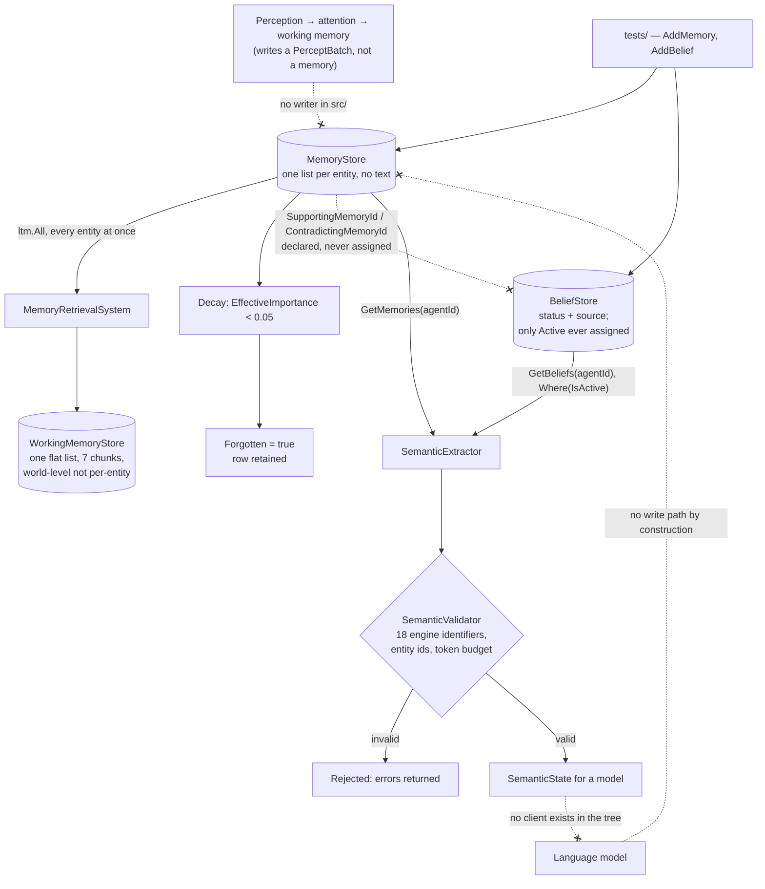

## 1. Executive Summary

Aeris is a GPL-3.0 cognitive simulation engine in C# on .NET 10, built on an
entity-component-system and documented in Spanish across nineteen design
documents and ten architecture decision records. It is 6,472 lines of engine
under 9,834 lines of test — a suite half again the size of the thing it covers,
which turns out to be the fact that explains the rest of this report. Its stated
purpose is a simulated world in which narrative emerges from simulation rather
than from a prompt, and its central architectural commitment is stated in the
README as a rule about the model: *"El LLM nunca modifica el estado del mundo;
únicamente interpreta y expresa el estado interno"* — the model never modifies
world state, it only interprets and expresses the internal state.

**The implementation is not at the repository's head.** On 2026-08-11 the author
removed it in one commit, [`ab1f18cd03a5c297e0b5ec9825d93b13096b8de5`](https://github.com/Cedrick-Coto/Aeris/commit/ab1f18cd03a5c297e0b5ec9825d93b13096b8de5)
— 129 files and 16,729 lines — under a message giving the reason: *"the project
have a bad implementation and I dont understand how and why the project go and
went to the actual project status."* What remains upstream is the documentation
and three empty project files. This report describes the commit it is pinned to,
which the atlas's archive fork preserves; the sections below are about code that
existed and no longer ships.

That rule is enforced rather than asserted, which is what makes the system worth
a report. The engine builds a `SemanticState` — identity, situation, internal
state, world model, attention, working memory, long-term memory, social context
and directives — and `SemanticValidator` refuses it if it contains any of
eighteen engine identifiers: `EntityId`, `Entity(`, `Arch.`, `MemoryStore`,
`BeliefData` and the rest. Committed tests assert on the *serialized* payload
that `EntityId`, `Arch.` and `Store` do not appear in it. The boundary between
what the simulation knows and what a model is allowed to see is a checked
property.

The memory model is unusual in this corpus in a way that cuts both directions. A
`MemoryData` is a struct with no text: type, category, emotional weight,
importance, certainty, timestamp, the entity involved, the location, a forgotten
flag and a decay start. Nothing stores *what* was remembered. A `BeliefData` is
similarly compact, and declares what most systems here do not — a discrete
`BeliefStatus` of `Active | Weakening | Revised | Abandoned | Contradicted`, a
`BeliefSource` of `DirectObservation | ToldByTrusted | ToldByUntrusted |
CulturalTradition | InferredFromEvidence | Assumed`, and two pointers:
`SupportingMemoryId` and `ContradictingMemoryId`.

**And nothing in the engine ever creates one.** `MemoryStore.AddMemory` and
`BeliefStore.AddBelief` have no caller in `src/` or `benchmarks/`; the only calls
are in the test suite. `Engine.cs:28-29` registers an empty `BeliefStore` as a
world resource, `SemanticExtractor.cs:196-201` reads it and filters
`Where(b => b.IsActive)`, and no system in between puts anything in it. Of the
five `BeliefStatus` values, `Active` is the only one assigned anywhere in the
repository, in four test lines; `Weakening`, `Revised`, `Abandoned` and
`Contradicted` appear once each, in the enum that declares them. The status model
this report was originally written around is a consumer with no producer, which is
why it carries no `trust_state` mark: there is no path by which a belief in a
running Aeris world could reach a state other than the one it was constructed in,
because there is no path by which it is constructed.

Read that alongside the test-to-engine ratio and the shape resolves. Aeris is a
specification with an unusually rigorous conformance suite attached, and the
suite is also the only client. Every mechanism below is real code with real
assertions on it, exercised exclusively from `tests/`.

**Why it is in scope.** The stores are world resources and the memory tier is
durable *by design*: `JsonPersistence` serializes every resource except four
runtime ones into a `WorldSnapshot` that `LoadWorld` restores, and a memory
carries a stable id and a `Forgotten` flag that later passes flip. The atlas
admits it on that design, with the gap stated: the engine writes nothing into it,
and seventeen persistence tests cover entities, components and `TimeResource`
without round-tripping a `MemoryStore` or a `BeliefStore` once. Both stores keep
their contents in a private field whose only public surfaces are a get-only
`Count` and a get-only `All`, so what a snapshot carries for them is not
something the suite establishes. That the agent is a simulated character rather
than an assistant is the same situation as the roleplay clients already here.

## 2. Mental Model

A tick moves state through ordered phases, and belief is what survives the
journey.

**Perception does not write memories.** `PerceptionSystem` scans the world for
entities carrying a `CognitiveAgentMarker` and publishes a `PerceptBatch`
resource; `AttentionSystem` selects among percepts by a swappable strategy, and
`WorkingMemorySystem` holds what is currently active. The volatile tier is fully
wired. The path from a percept to a durable `MemoryData` is the one that is not
there.

**Consolidation and decay run on the clock, not on judgement.**
`MemoryConsolidationSystem` promotes, and `LongTermMemorySystem` walks every
entity's memories, computes `EffectiveImportance` — importance halved per
half-life of simulation time — and flips `Forgotten` when it falls below `0.05`.
Nothing is deleted; a forgotten memory keeps its row and stops being relevant.

**Belief is designed downstream of memory and carries its provenance.** A belief
points at the memory that supports it and at the memory that contradicts it, and
the design is that its status moves rather than its content changing. In the code
the two pointers are struct fields nothing assigns and the status is a field
nothing transitions.

**And the model sits outside all of it.** `SemanticExtractor` builds a projection,
`SemanticValidator` checks it for engine leakage, entity ids and token budget,
and something not present in this repository is expected to render it. The model
has no write path by construction: there is no API through which it could return
state.

Both dotted edges are findings. The model cannot write back — that is the design.
And nothing in the repository sends it anything — that is the gap.

The heavier gap is on the left of the same diagram: the arrow into `MemoryStore`
has no source in the engine.

## 3. Architecture

A library and a benchmark project, no application. `Aeris.Engine` is 6,472 lines
holding the ECS world, the systems and the stores; `Aeris.Benchmarks` is 413
lines running BenchmarkDotNet over the engine; `Aeris.Engine.Tests` is 9,834
lines of xUnit across 27 files with FluentAssertions and FsCheck property tests.

Operational discipline is well above the median for this corpus. All eight NuGet
package references are exactly pinned. GitHub Actions are pinned to commit SHAs
with the version in a trailing comment. There are four workflows — CI,
documentation, OSSF Scorecard, and a separate **Determinism Check** that runs
only the tests whose names match `Determinis`. `Directory.Build.props` sets
`TreatWarningsAsErrors` and `EnforceCodeStyleInBuild` for every project.

Ten ADRs record the choices, including `0002-use-sqlite-json` and
`0006-self-model-reconstructed`. The second is load-bearing: the self is not a
stored component but a `SelfSnapshot` rebuilt each tick, so there is no
accumulating identity record to drift. The first has not landed — persistence at
this commit is JSON files, and no SQLite dependency exists.

## 4. Essential Implementation Paths

- **Memory** — `src/Aeris.Engine/MemoryData.cs`: the struct, `EffectiveImportance`,
  and `MemoryStore` as one list per entity, with `AddMemory` at `:53` reachable
  only from tests.
- **Decay and forgetting** — `LongTermMemorySystem.cs`, threshold `0.05`,
  half-life defaulting to one simulated day.
- **Belief** — `BeliefData.cs`: `BeliefStatus`, `BeliefSource`,
  `SupportingMemoryId`, `ContradictingMemoryId`, and `IsActive` at `:33` — the
  one place a status is read.
- **Retrieval** — `IMemoryRetrievalStrategy.cs` and `MemoryRetrievalSystem.cs`,
  whose candidate assembly at `:32-40` iterates `ltm.All`, with
  interchangeability covered by its own test file.
- **Projection** — `SemanticExtractor.cs`, `SemanticState.cs`, `SemanticFact.cs`.
- **The boundary** — `SemanticValidator.cs`: `EcsLeakPatterns`,
  `ValidateNoEntityIds`, `ValidateTokenBudget`, `ValidateStructure`.
- **Persistence** — `JsonPersistence.cs`: `CreateSnapshot`, the four excluded
  resource types, `SaveWorld`/`LoadWorld`, tick-interval checkpointing.
- **Trace** — `CognitiveTrace.cs`: `Record(system, input, output, why)`.

## 5. Memory Data Model

`MemoryType` is `Observed | Experienced | Learned | Inferred | Forgotten` and
`MemoryCategory` is `Social | Environmental | Combat | Discovery | Emotional |
Quest`. Both are single bytes, and the whole record is a value type — this is
data-oriented design applied to memory, and it is the cleanest example of that
shape in the atlas.

The absence of content is the defining property. A memory says *an event of this
kind, involving this entity, at this place, mattered this much and I am this
certain of it*. What actually happened lives in the simulation that produced it
and in the projection assembled for the model, not in the row.

`BeliefStatus` is the best-designed part of the model and carries no mark.
`Weakening` is a state most systems here express, if at all, as a falling number;
`Revised` and `Abandoned` distinguish two outcomes that a single `active` boolean
collapses; `Contradicted` is a withholding state with a pointer to the memory
that caused it; and `IsActive` requires both the status and a confidence floor,
so the enum is written to gate reachability rather than decorate it. All of that
is a design, and the atlas marks mechanisms. Grep the tree for the four
non-`Active` values and the enum declaration is the only hit — no system assigns
one, no test asserts a belief in one is withheld, and no test could, because
nothing would put a belief there. Compare [Citra](../citra/), whose ten statuses
are a `WHERE` clause with writers on every branch: the difference between the two
systems is not the vocabulary, it is whether anything speaks it.

`SemanticFact` — subject, predicate, object, certainty, source — is the only
place text appears, and it is a projection type rather than a stored one.

## 6. Retrieval Mechanics

`IMemoryRetrievalStrategy` takes a context carrying the working-memory store and
returns a `RetrievalResult`; strategies are swappable, and
`MemoryRetrievalInterchangeabilityTests` exists to assert that swapping one does
not change the engine's contract. The same interchangeability discipline covers
planning, reasoning and attention — four strategy interfaces, each with a test
file dedicated to substitutability.

Scoring is importance decayed against simulation time. There is no embedding, no
index, and no similarity anywhere in the tree, which is coherent: with no text in
a memory there is nothing to embed.

**Scope is structural, and the retrieval path does not use it.** Every store is a
`Dictionary<uint, List<...>>`, so a memory's owner is the container it sits in
rather than a field on the record; `MemoryData` has an `InvolvedEntityId`, which
is who the memory is *about*, and no field for whose memory it is. That is a
partition, not a stored key applied as a filter, so it carries no
`scope_enforced` mark — the boundary is real, and it is a different boundary from
the one the mark names.

The larger point is that the engine mostly does not lean on it. Exactly three
reads in `src/` pass an entity id: `SemanticExtractor.cs:199` and `:295` for the
agent's beliefs and memories, and `MemoryConsolidationSystem.cs:27` for the
consolidation sweep. `MemoryRetrievalSystem` — the system named for retrieval,
and the one that feeds working memory — does the opposite. At `:32-40` it
flattens `ltm.All` into a single candidate list across every entity in the world,
hands that to the strategy, and writes the winners into `WorkingMemoryStore`,
which is a world resource holding one flat `List<WorkingMemoryChunk>` capped at
seven. There is no entity axis anywhere on that path. The engine is written for
one cognitive agent per world, and in a world with two the second agent's
memories are candidates for the first agent's working memory.

The projection is the part that *is* scoped: `SemanticExtractor` reads nine
stores and keys every one of them on `AgentId(ctx)`, so what reaches a model is
one agent's material. The gap is between the store and working memory, not
between working memory and the prompt.

## 7. Write Mechanics

**There is no durable write.** `AddMemory` and `AddBelief` exist, are public,
are tested, and are called from nowhere in `src/` or `benchmarks/`. What the
per-tick systems write is the volatile tier and its derivatives: a `PerceptBatch`,
`WorkingMemoryChunk`s, an `InferenceStore`, goals, plans, relationships and a
trace. What they write *into* the long-term stores is a mutation of rows already
there — `MemoryConsolidationSystem` and `LongTermMemorySystem` both flip
`Forgotten` on an existing struct — never a new row. So the description that fits
the code is: the engine ages a memory it cannot create.

Where writes do happen they are synchronous, deterministic and ordered.
`SystemManager` runs systems by `SystemPhase` and `Priority` within a tick;
nothing is asynchronous, nothing retries, and no model call sits on any write
path.

Persistence is a checkpoint rather than a journal. `ShouldCheckpoint` fires on a
tick interval, `SaveWorld` walks `world.GetResourceTypes()` and serializes every
resource except `TimeResource`, `EngineStats`, `EventBus` and `SchedulerResource`
through `JsonSerializer.Serialize(value, resource, JsonOptions)`, and `LoadWorld`
clears every entity and reapplies. A save is a full snapshot; there is no
incremental write, and no record anywhere of a single memory or belief having
changed. Because the loop is generic over resource types, the memory stores are
in it by default rather than by decision, and nothing asserts what survives:
`JsonPersistenceTests.cs` has seventeen cases covering entities, components,
entity ids, empty worlds and the checkpoint interval, and not one constructs a
`MemoryStore` or a `BeliefStore`.

## 8. Agent Integration

There is none to review, and that is worth stating plainly rather than implying.
`docs/06-llm-contract.md` specifies the contract, `SemanticState` implements the
payload, `ExtractionOptions` carries a token budget and `EstimatedTokens` is
computed — and no HTTP client, provider SDK or model interface exists anywhere in
the repository (see the appendix search). The engine is one half of an
integration, built to a specification, with the other half absent at this commit.

For a reader that is a feature as much as a gap: the projection is inspectable and
testable without any model in the loop, which is exactly why the leak assertions
can be ordinary unit tests.

## 9. Reliability, Safety, and Trust

**The validator is the mechanism to take away.** Eighteen forbidden identifiers,
a check for bare entity ids, a token-budget check and a structural check, all
returning a `ValidationResult` with errors and warnings rather than throwing. The
threat it addresses is not prompt injection but *representation leakage* — the
model being handed the engine's own vocabulary and reasoning about `EntityId`
values as though they were facts about the world. Nothing else in this atlas
checks that boundary in code.

**Determinism is a CI job, not a claim.** A dedicated workflow runs the
determinism-named tests on every push, which is the kind of thing usually
asserted in a README and left unverified.

**The trace explains and does not persist.** `CognitiveTraceLog.Record` takes a
system name, an input summary, an output summary and a **`why`**, links entries
by `ParentTraceId`, and is cleared each tick. It is the best-shaped explanation
record in the corpus for a single decision and it is not an audit: it does not
survive the tick, and no memory mutation is recorded anywhere.

**Nothing can be wrong in a way that needs correcting.** A memory has no claim in
it, so a wrong memory is a wrong *weight*, and the repair is decay. This is
internally consistent and it means the mechanisms this atlas most often looks for
— tombstones, supersession chains, provenance on content — have nothing to attach
to here.

**And the belief model, which would carry those, is not connected.** `IsActive`
is read once, in the extractor. `Status` is assigned once in the repository, to
`Active`, in tests. `SupportingMemoryId` and `ContradictingMemoryId` are assigned
nowhere. `MemoryStore.RemoveEntity` and `BeliefStore.RemoveEntity` have no caller
either — and `World.RemoveEntity`, which `LoadWorld` calls for every entity
before reapplying a snapshot, removes the entity from `_entities` and does not
touch the stores, so removal does not cascade. This is the pattern this atlas
calls declared and unwired, and the reason Aeris carries one mark rather than
three.

## 10. Tests, Evals, and Benchmarks

9,834 lines of tests over 6,472 lines of engine, in 27 files — a ratio of about
three to two, and the highest in this corpus for a system of this size. FsCheck
brings property-based tests; FluentAssertions the readability; and the naming
shows what the project considers risky — `CognitiveStressTests`,
`E2EPipelineTests`, `ModelInterchangeabilityTests`, four separate
strategy-interchangeability suites.

`negative_eval` is earned in `SemanticExtractorTests.cs`.
`Extract_NoEntityIds_InOutput` at `:640-661` builds a world, adds a memory and a
goal for the agent, extracts, serializes the `SemanticState` and asserts
`DoesNotContain("EntityId")` and `DoesNotContain("\"Value\":")`;
`Validation_JsonOutput_IsCleanString` at `:1231-1248` does the same for
`"EntityId"`, `"Entity("`, `"Arch."` and `"Store"`. The assertion is on the
assembled payload rather than on the extractor's return value, which is the form
this atlas asks for and rarely finds.

It does not carry an in-test positive control, and it does not need one from a
distance: the extraction that these run is the same construction that
`Extract_WithMemory_ExtractsRelevantMemories` at `:451-472` asserts produces
exactly one memory whose description contains `Memoria-1`. The pair worth naming is at `:471` and `:491` —
one test asserts a live memory is extracted, and
`Extract_ForgottenMemory_NotExtracted` at `:475-492` asserts a `Forgotten` one is
not, over the same fixture. That is the vacuity guard, split across two cases
rather than held inside one.

`Aeris.Benchmarks` runs BenchmarkDotNet over the engine. No results are committed,
and none is quoted anywhere — a benchmark harness with no published number is a
cleaner position than the reverse.

## 11. Patterns Worth Stealing

### Steal

**Validate what the model is allowed to see, by name.** A list of internal
identifiers, a check on the serialized projection, and unit tests asserting
absence. Any system that assembles context from an internal store can do this in
an afternoon, and it catches the class of bug where a schema field name, a row id
or a store name reaches the prompt and becomes something the model reasons about.

**Give a belief a status enum, not a confidence score** — and then wire the
transitions before you ship the enum. Five values, of which three are ways of not
being believed, and `IsActive` requiring the status *and* a floor: the
distinction between `Revised` and `Abandoned` is the sort of thing a float cannot
carry, and it is worth copying. What Aeris shows is the other half of the lesson.
An enum is cheap to declare and the writers are the expensive part, so a status
model with no transition function is indistinguishable in the schema from one
that works, and only a grep for assignments tells them apart.

**Point a belief at both its supporting and its contradicting evidence.** Two ids
on a struct give a *why* and a *why not* for the price of eight bytes. Same
caveat: here they are never set.

**Put determinism in its own CI job** if you claim it.

### Avoid

**Do not let the explanation trace be the only record and then clear it.** The
`why` field is the most useful thing in the trace, and it exists only until the
next tick.

**Do not leave an ADR's storage decision unimplemented without saying so.** The
repository chose SQLite in ADR-0002 and persists JSON snapshots; a reader
following the ADRs will design against a store that is not there.

**Do not let the test suite be the only writer.** Every mechanism in the durable
tier here has assertions on it and no caller, which is the failure mode a
green build cannot show you: the tests construct the state the engine never
produces, so they pass on code no run reaches. A single assertion that a full
tick loop leaves a non-empty `MemoryStore` would have caught it.

**Do not assume a snapshot is a memory system's persistence story.** Whole-world
serialization at a tick interval means a crash loses everything since the last
checkpoint, and nothing distinguishes a memory written a second ago from one
written a thousand ticks ago in terms of durability.

### Fit

This is a good engine for a simulated world and a poor starting point for an
assistant's memory, and the reason is the same in both cases: memories have no
content. If what you want is agents whose behaviour emerges from decaying
weighted experience under a deterministic clock, the ECS shape, the status enum
and the validator are all directly usable. If you want an agent that can be told
it was wrong about a fact, there is no fact here to be wrong about, and the parts
that would hold one — a store keyed by value, a supersession record, an audit —
are the parts this design deliberately does not have.

## 12. Antipatterns / Risks

- **No durable mutation record.** The trace is per-tick and the persistence is a
  whole-world snapshot, so "when did this belief become contradicted" is
  unanswerable after the fact.
- **Checkpoint-only durability**, with everything since the last tick interval
  lost on a crash.
- **An ADR that does not match the code** on the storage engine.
- **A specified integration with no implementation**, so the contract has never
  been exercised against a real model.
- **The durable tier has no producer.** `AddMemory` and `AddBelief` are called
  only from tests, so decay, consolidation, retrieval and projection all run
  over a store an actual simulation leaves empty.
- **`RemoveEntity` on the stores has no caller either**, and `World.RemoveEntity`
  does not cascade to them, so entity removal and store contents are unrelated
  operations.
- **Retrieval has no entity axis.** `MemoryRetrievalSystem` reads `ltm.All` and
  writes into a single world-level working memory of seven chunks, so the
  per-entity partition stops at the store boundary.
- **Spanish-only documentation** against an English-named public API, which is a
  contribution barrier rather than a defect.

## 13. Build-vs-Borrow Takeaways

Borrow the validator, the status enum and the dual evidence pointers. All three
are small, independent of the ECS, and portable to any memory layer that assembles
context for a model.

Do not borrow the storage model unless you are also building a simulation: value
structs in per-entity dictionaries serialized whole are exactly right for a
deterministic tick loop and exactly wrong for a store that must answer questions
about its own past.

## 14. Open Questions

- Was the durable tier meant to be written by a system that was never built, or
  by an embedding application outside this repository? The public `AddMemory`
  signature suggests the second, and nothing in the docs says which.
- Is the SQLite persistence of ADR-0002 planned, and would it record mutations or
  continue to snapshot?
- Does anything intend to consume `SemanticState`, and will the validator run in
  that caller or in the engine?
- Is `MemoryRetrievalSystem`'s flattening of `ltm.All` a single-agent assumption
  or an oversight? The rest of the engine keys on an entity id and this one does
  not, which reads more like the former than the latter — but `WorkingMemoryStore`
  being world-level rather than per-entity has to change either way for a
  two-agent world.
- Should the trace survive a tick? The `why` field is the part a debugger would
  want after the fact, and it is the part that is discarded.

## 15. Appendix: File Index

| Path | Role |
| --- | --- |
| `src/Aeris.Engine/MemoryData.cs` | Memory struct, decay function, per-entity store |
| `src/Aeris.Engine/BeliefData.cs` | Status and source enums, evidence pointers, per-entity store |
| `src/Aeris.Engine/LongTermMemorySystem.cs` | Decay pass that flips `Forgotten` and destroys nothing |
| `src/Aeris.Engine/MemoryRetrievalSystem.cs` | Retrieval over one entity's list, strategy-driven |
| `src/Aeris.Engine/SemanticExtractor.cs` | Builds the model-facing projection |
| `src/Aeris.Engine/SemanticValidator.cs` | Eighteen forbidden identifiers, entity ids, token budget |
| `src/Aeris.Engine/JsonPersistence.cs` | World snapshots, resource inclusion rules, checkpointing |
| `src/Aeris.Engine/CognitiveTrace.cs` | Per-tick explanation trace with a `why` |
| `tests/Aeris.Engine.Tests/SemanticExtractorTests.cs` | The committed leak assertions |
| `tests/Aeris.Engine.Tests/JsonPersistenceTests.cs` | Seventeen round-trip cases, none over a memory or belief store |
| `docs/adr/` | Ten decision records, including the unimplemented storage choice |

## 16. Appendix: Recorded Searches

Run from the root of the tree at the pinned commit. The upstream repository no
longer contains this code; the archive fork does.

| Claim | Command | Result at the pin |
| --- | --- | --- |
| Nothing in the engine writes a memory or a belief | `grep -rn "AddMemory(\|AddBelief(" --include="*.cs" src benchmarks` | Two hits, both the declarations in `MemoryData.cs:53` and `BeliefData.cs:43` |
| Only `Active` is ever assigned to a belief status | `grep -rn "BeliefStatus" --include="*.cs" .` | Seven hits: the enum, the field, `IsActive`, and four test lines assigning `Active` |
| No embedding, index or similarity anywhere | `grep -rniE "embedding\|cosine\|similarity\|vector[^a-z]" --include="*.cs" src tests benchmarks` | One hit, a trace string in `AffectSystem.cs:29` |
| No model client in the tree | `grep -rniE "HttpClient\|OpenAI\|Anthropic\|IChatClient\|SemanticKernel\|RestClient" --include="*.cs" src tests benchmarks` | Nothing |
| No SQLite dependency, despite ADR-0002 | `grep -rniE "sqlite\|EntityFramework" --include="*.csproj" --include="*.cs" src tests benchmarks` | Nothing |
| No persistence test covers the memory stores | `grep -n "MemoryStore\|BeliefStore" tests/Aeris.Engine.Tests/JsonPersistenceTests.cs` | Nothing |
| The store `RemoveEntity` has no caller | `grep -rn "\.RemoveEntity(" --include="*.cs" src` | One hit, `JsonPersistence.cs:176`, which is `World.RemoveEntity` |
| Eighteen forbidden identifiers | `sed -n '/EcsLeakPatterns/,/};/p' src/Aeris.Engine/SemanticValidator.cs \| grep -c '^\s*"'` | 18 |
| All eight package references exactly pinned | `grep -rn "PackageReference" --include="*.csproj" .` | 8 references, 8 with an exact `Version="..."` |

## History

**2026-09-10** — re-read at the same pin, [`68a2bd6d11a12beab705ce400e5c3a052d7f71db`](https://github.com/Cedrick-Coto/Aeris/commit/68a2bd6d11a12beab705ce400e5c3a052d7f71db), because there is nothing to re-pin to: on 2026-08-11 the author deleted the implementation in [`ab1f18cd03a5c297e0b5ec9825d93b13096b8de5`](https://github.com/Cedrick-Coto/Aeris/commit/ab1f18cd03a5c297e0b5ec9825d93b13096b8de5) — 129 files, 16,729 lines — leaving the documentation and three empty project files. The pinned tree was read again from the atlas's archive fork, which preserves it, and **two of the three marks do not survive the reading**. `trust_state` fails the producer test: `BeliefStore.AddBelief` has no caller outside the test suite, `SemanticExtractor.cs:201` filters `Where(b => b.IsActive)` with nothing upstream to filter, and of the five `BeliefStatus` values only `Active` is assigned anywhere in the repository — in four test lines. `MemoryStore.AddMemory` is in the same position, so the first reading's *"Perception writes memories"* was wrong: `PerceptionSystem` publishes a `PerceptBatch`. `scope_enforced` is withdrawn on the scope rule — one list per entity is a partition, not a stored key applied as a filter — and the evidence line was wrong on its own terms as well: it cited `MemoryRetrievalSystem.cs`, which flattens `ltm.All` across every entity at `:32-40` and writes into a world-level `WorkingMemoryStore` of seven chunks. Three reads in `src/` pass an entity id, none of them on the retrieval path. `negative_eval` holds and is restated with the vacuity guard named — the pairing is across `:451-472` and `:475-492` rather than inside one case. The engine measures 6,472 lines, not the 16,719 first reported, which counted the tests and benchmarks inside it; the ADRs are ten, not eight. Recorded searches added, which the report shipped without.

**2026-08-07** — [`68a2bd6d11a12beab705ce400e5c3a052d7f71db`](https://github.com/Cedrick-Coto/Aeris/commit/68a2bd6d11a12beab705ce400e5c3a052d7f71db) — first reading. The screen returned **NOTHING SCANNED** — this is a .NET tree and the tool parses no `.csproj` — so the execution surface was read by hand instead: all eight `PackageReference` entries are exactly pinned, `Directory.Build.props` declares properties only and no targets, no `.envrc`, devcontainer, editor task or git hook exists, and the four GitHub workflows pin every action to a commit SHA with the version in a trailing comment. Nothing was restored, built or run; the analysis is static. `NOTHING SCANNED` was recorded as a finding about the screen's coverage rather than as a clean result; `screen_repo.py` parses MSBuild projects since, and reports this tree's eight exactly-pinned references as the clean result it could not previously see.
