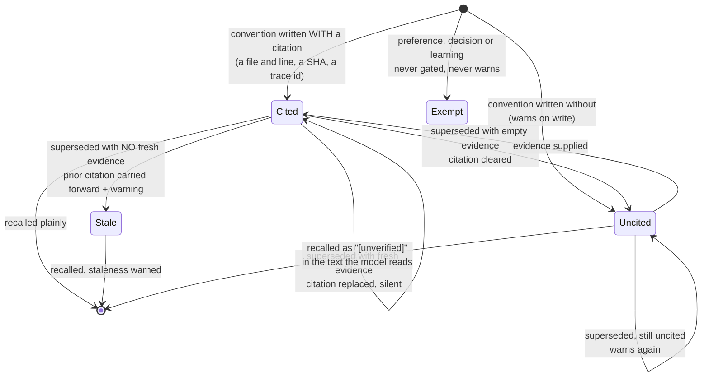

## 1. Executive Summary

agent-afk is an Apache-2.0 CLI coding agent whose memory is about 3,166 lines
under `src/agent/memory/` — a 945-line SQLite store, 558 lines of tools, and
129 committed test cases across the store, the tools, the loader and the gate.

**The mechanism worth the visit is the evidence gate, and its most important
property is where the verdict ends up.** A fact in the `convention` category —
a claim about the codebase — can carry an `evidence` citation: a `file:line`, a
commit SHA, a trace-event id. When one does not, recall renders it with an
`[unverified]` marker **in the text the model reads**, and the write warns.

That is the exact inverse of the failure this atlas records for
[Helm](../helm/), whose report ends on the observation that a system can compute
trust carefully and still ship it as an assertion: Helm caps a first observation
at 0.7 confidence, earns increases through corroboration, and then formats the
surviving facts as `- (kind) key: value` under *"use these, never contradict
them"*, with the number stripped off. agent-afk does the cheap version of the
same idea and does not drop it at the boundary. A model reading
`[unverified] the build uses Bazel` has been told something a confidence float
in a database never tells it.

The gate is **category-aware**, which is what makes it usable rather than
nagging. Committed tests assert that a `preference` never requires file evidence
and never warns, that a `learning` is not treated as factual codebase knowledge,
and that a `decision` is rationale rather than a gated claim. Only conventions —
assertions about how the code actually is — have to cite something.

And supersession is handled with more care than most: replacing an uncited
convention warns and stays `[unverified]`; replacing a cited one **without**
fresh evidence carries the prior citation forward *and warns it may be stale*;
supplying fresh evidence replaces it silently; supplying empty or whitespace
evidence clears it and drops back to `[unverified]`. Four distinct outcomes,
each with a test.

**The gate is the default.** `evidenceGateEnabled()` returns true when
`AFK_MEMORY_EVIDENCE_GATE` is unset and reads the variable only to be turned
*off* — `0`, `false`, `no` or `off` — and it is the single env read-point for the
subsystem, so there is one place the default lives. The env registry says the
same thing to a user: *"On by default. Set to 0 to disable."* The schema
migration is unconditional too, so an ordinary install has the column, populates
it, and consults it.

**What the gate does not do is withhold.** The comment on `requiresEvidence` is
explicit that a missing citation *"does NOT block the write — it downgrades the
recall verdict to 'unverified' and surfaces a warning. Never a hard reject."*
`verificationStatus` is three-valued — `not-applicable` for a non-codebase
category, `verified` for a cited codebase fact, `unverified` for an uncited one —
and `applyUnverifiedTag` prefixes the recalled content rather than dropping it or
ranking it down. So an uncited convention is returned beside a cited one,
distinguished only by a marker the reader has to act on, which is why the
distinction does not reach `trust_state`.

## 2. Mental Model

Two tiers with different rules. `HOT.md` is the working file, capped at roughly
1,500 tokens; the durable archive is a `facts` table whose categories are
CHECK-constrained to `preference`, `convention`, `decision`, `learning`. That
four-value taxonomy is doing real work — it is what lets the gate demand
citations from one category and exempt the others, and it is enforced by the
database rather than by convention.

A fact is true until something supersedes it. `superseded_by` is a self-
referencing foreign key, search appends `f.superseded_by IS NULL`
unconditionally, and `supersedeFact` runs
`UPDATE facts SET superseded_by = ? WHERE id = ? AND superseded_by IS NULL`, so
a second supersede of the same row is a silent no-op rather than a chain
rewrite. The old row stays readable; it stops being retrievable.

There is a `confidence REAL NOT NULL DEFAULT 1.0` column, and it is a float,
which is not a trust state — every fact starts fully confident. The
`[unverified]` marker is derived at render time from `evidence IS NULL` rather
than stored as a status, so the mark is withheld and the near-miss is that the
*presentation* layer carries an epistemic distinction the *schema* does not.

## 3. Architecture

One SQLite file and a Markdown file. `SCHEMA_VERSION = 4` is guarded in both
directions — the constructor refuses a database written by a newer build and
throws a clear error for an older schema — and the migration comments are the
best in this batch, explaining not only what changed but why each step was safe:
*"ALTER ADD COLUMN with no default → existing rows read back NULL, so the
migration cannot fail on stored data"*, and why the new columns are declared
last, *"to match the position ALTER TABLE ADD COLUMN appends it on migrated
databases, so fresh and migrated DBs share one column order"*. That second note
is a subtle correctness detail — `SELECT *` ordering differing between a fresh
and a migrated database — that almost nobody writes down.

`facts_fts` is an FTS5 external-content table over `facts` with a porter
tokenizer, kept in sync by triggers.

## 4. Essential Implementation Paths

- `src/agent/memory/memory-store.ts` (945) — schema, migrations, search,
  supersession, hot-file truncation.
- `src/agent/memory/memory-tools.ts` (558) — `memory_search`, `memory_update`,
  `procedure_write`.
- `src/agent/memory/memory-evidence.ts` (97) — the gate: `evidenceGateEnabled`,
  `requiresEvidence`, `verificationStatus`, `applyUnverifiedTag`.
- `src/agent/memory/types.ts` (122).
- `src/agent/memory/memory-evidence-gate.test.ts` (354) — seventeen cases.
- `src/agent/memory/memory-store.test.ts` (603), plus a second suite under
  `tests/agent/memory/`.

## 5. Memory Data Model

`facts`: `id`, `session_id`, `created_at`, `category` (CHECK-constrained),
`content`, `source_surface`, `superseded_by`, `confidence`, `access_count`,
`last_accessed`, `evidence`. `sessions` carries surface, timings, summary,
tools used, outcome, token count, cost, and a v3 `actor` column distinguishing
`main` from `subagent`.

Two things are missing and one is present that usually is not. No validity time
— `created_at` is record time and there is no second clock. No scope key on the
read path. But `cost_usd` and `token_count` per session, and `access_count` per
fact, mean the store knows what its own memory cost to produce and how often it
paid off, which is a measurement most systems here cannot make.

## 6. Retrieval Mechanics

`facts_fts MATCH ?` ordered by FTS rank, with optional `category` and `since`
filters and `superseded_by IS NULL` always appended, limit defaulting to 10.
Lexical only — no embeddings anywhere on the memory path — which for a
few-hundred-fact archive of conventions and preferences is proportionate, and
which means recall depends on the agent's choice of query terms.

**No scope filter, deliberately.** The archive is cross-session by design; a
convention learned in one session is meant to be available in the next. For a
single-user CLI that is the right call and the mark is withheld rather than the
absence criticised.

## 7. Write Mechanics

Writes block through three tools. `memory_update` targets either hot memory or
the fact archive; `procedure_write` stores reusable procedures that persist and
are searchable through the same tool.

**The hot-file truncation is auditable in-file**, which is the second-best
detail here. When `HOT.md` exceeds its cap the truncation appends a sentinel —
an HTML comment reading *"HOT TRUNCATED to fit the ~1,500-token cap; move
durable detail to the fact archive (memory_update target:"fact")"* — so the cut
is visible to anyone reading the file and the agent is told what to do about it.
A soft warning fires at 80% of the cap before that. Compaction that leaves a
note saying it happened is rare; compaction that tells the reader where the
detail should have gone is rarer.

**Every mutation is written to a sidecar journal first, and the journal is
deleted once it has been drained.** `storeFact`, `supersedeFact`, `startSession`
and `endSession` all `appendWAL` a JSONL entry before touching SQLite; the
constructor calls `replayWAL` and, at the end, `unlinkSync(walPath)`. Replay is
idempotent by fingerprint rather than by rowid — a fact is matched on content,
`created_at`, `session_id` and category, the four columns the v2 UNIQUE index
covers, with a two-field fallback for entries written by an older version and a
raw-rowid fallback below that. It is a crash-recovery device, not a record: the
file exists only between a write and the next successful open, so it cannot be
read back to reconstruct what a memory used to say.

Nothing runs in the background.

## 8. Agent Integration

Three tools and a hot file loaded into context. The `actor` column recording
`main` versus `subagent` means a session's memories are attributable to the
execution role that produced them, though nothing filters on it at read time.

## 9. Reliability, Safety, and Trust

**`negative_eval` is earned** on `it('excludes superseded facts from search')` —
a committed assertion that a replaced value must not be retrieved, on the same
basis as [Helm](../helm/) and [Agno](../agno/): the cheap kind, since the row is
present to be filtered rather than destroyed. It is paired correctly, which is
the part that matters: `results.every((r) => r.superseded_by === null)` would
pass vacuously against a search that returned nothing, and the next line asserts
the replacement *is* in the same result set.

**No tombstone.** Supersession is record-keyed; nothing prevents the same content
being written again as a new fact. In a system where writes are the agent's own
tool calls rather than a background extraction pass, the exposure is smaller than
in an extraction pipeline — but a model that concluded something wrong once will
conclude it again.

**No trust state**, for the reason in §2: `confidence` is a float that is never
moved, and `[unverified]` is computed at render.

**No audit log, no bi-temporality, no human review surface.** The write-ahead
journal in §7 is the nearest thing and is disqualified by its own lifecycle —
`replayWAL` ends in `unlinkSync`, so the record of a mutation survives exactly
until the next successful open. The hot file is Markdown a person can open,
which this atlas does not count on its own.

## 10. Tests, Evals, and Benchmarks

128 test cases on the memory path across eight files, none run here. The distribution is unusually well aimed: a
dedicated 354-line suite for the evidence gate covering all four supersession
outcomes and all four categories, a store suite covering the UNIQUE-collision
duplicate path and the `supersedeFact` not-found throw, and a renderer suite.

The tests are also where the design is *specified* — the gate's category rules
exist as assertions before they exist as documentation, which is why the four
outcomes above can be stated precisely at all.

No memory benchmark, no retrieval-quality measurement, no published numbers, and
none claimed.

## 11. For Your Own Build

### Steal

- **Put the verification status in the string the model reads.** `[unverified]`
  in the recalled text costs one render branch and is strictly more useful than
  a confidence column the prompt never sees. If you compute trust, ship it.
- **Gate by category, not globally.** Demanding a citation for a claim about the
  codebase and never demanding one for a user preference is what keeps the gate
  from becoming noise the agent routes around.
- **Carry a citation forward on supersede, and say it may be stale.** Replacing
  a cited fact without fresh evidence is the common case and the dangerous one;
  four distinct outcomes with four tests is the right amount of care.
- **Guard your schema version in both directions.** Refusing to open a newer
  database is the half everyone skips, and it prevents a downgrade silently
  writing garbage.
- **Declare migrated columns last.** So `SELECT *` returns the same order on a
  fresh database and a migrated one.
- **Leave a sentinel where you truncated.** An in-file marker naming the cap and
  telling the reader where durable detail belongs turns silent compaction into a
  visible, actionable one.

### Avoid

- **Shipping your best mechanism behind an off-by-default flag.** The schema
  migrates unconditionally, so the default build carries the cost of the column
  and none of its benefit; the gate is the reason to choose this system and most
  users will never see it.
- **A `confidence` column that is always 1.0.** It reads as a trust model from
  the schema and is a constant in practice.

### Fit

Take this if you are building a coding agent and want provenance without a graph
— the evidence gate is about two hundred lines of behaviour, it fits in SQLite,
and the category taxonomy is the part that makes it tolerable in daily use.

Look elsewhere for multi-tenant work: the archive is cross-session with no scope
filter, which is correct for one developer on one machine and wrong the moment
two of them share a database.

## 12. Open Questions

- **Will the verdict ever gate a read rather than tag one?** The value is
  computed at recall and the three states are already distinct; nothing consults
  them to withhold or reorder.
- **Does `[unverified]` change model behaviour?** Measurable — same archive,
  same queries, marker on and off — and not measured.
- **Is `confidence` ever written below 1.0?** It is declared with a default and
  nothing found in the store moves it.
- **What consumes `access_count` and `last_accessed`?** They are maintained and
  do not appear in the ranking, which is FTS rank only.

## Appendix: File Index

| Path | Lines | What it holds |
| --- | --- | --- |
| `src/agent/memory/memory-store.ts` | 945 | Schema v4, migrations, FTS search, supersession, hot truncation |
| `src/agent/memory/memory-tools.ts` | 558 | `memory_search`, `memory_update`, `procedure_write` |
| `src/agent/memory/memory-store.test.ts` | 603 | Store behaviour, duplicate and not-found paths |
| `src/agent/memory/memory-evidence-gate.test.ts` | 354 | Seventeen cases: categories, disable aliases, the migration, and the four supersede outcomes |
| `src/agent/memory/memory-evidence.ts` | 97 | The gate itself: default, requirement, verdict, tag |
| `src/agent/memory/memory-tool-renderers.test.ts` | 157 | Where `[unverified]` is applied |
| `src/agent/memory/types.ts` | 122 | The types |

## History

**2026-09-10** — [`9d8961035d6e4298db9bb37c9ffe03566dd594b6`](https://github.com/griffinwork40/agent-afk/commit/9d8961035d6e4298db9bb37c9ffe03566dd594b6) — read again, 953 commits and 1,625 files past the previous pin, most of it product surface rather than memory. **The report's central caveat is stale**: the evidence gate was opt-in at the previous pin, where `evidenceGateEnabled()` was `env.AFK_MEMORY_EVIDENCE_GATE === '1'`, and it is on by default here — the function returns true when the variable is unset and reads it only to be switched off, with the env registry documenting the same to a user. The section describing the default build as *a memory system with an unused provenance column* is replaced by what the gate does and does not do: it tags, never blocks, and `applyUnverifiedTag` prefixes recalled content rather than withholding or demoting it, which is why the three-valued verdict does not reach `trust_state`. The open question asking why the gate was off by default is answered and replaced. `negative_eval` holds, and the report's description of it is corrected in the system's favour: the test pairs `every((r) => r.superseded_by === null)` with a `some(...)` assertion that the replacement is in the same result set, so it cannot pass vacuously — both lines were present at the previous pin. Two first-reading omissions are filled: the sidecar write-ahead journal that fronts every fact, supersede and session mutation and is unlinked once drained, and the file that holds the gate itself. `git diff --stat` across the two pins restricted to `src/agent/memory` and `tests/agent/memory` is 103 insertions and 30 deletions over five files, eighteen of them in the store — the 1,625 changed files are elsewhere. Line counts re-verified: the gate suite is 354 lines and seventeen cases, the store suite 603. Screened before reading: a dependency surface changed inside the seven-day cooldown; nothing was installed, built or run.

**2026-07-30** — [`e3d15fe2389602c2761954baadd495d8ebe7a6a2`](https://github.com/griffinwork40/agent-afk/commit/e3d15fe2389602c2761954baadd495d8ebe7a6a2) — first reading.
