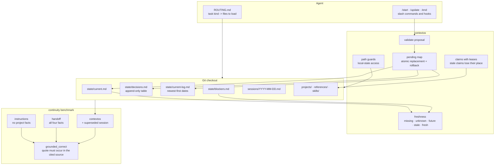

## 1. Executive Summary

Context OS is a convention with a kernel under it. The convention is a set of
Markdown files in known places — `state/current.md` for what is happening now,
`state/decisions.md` for what was decided and what was rejected,
`state/blockers.md`, `sessions/` for per-day notes, `projects/` and
`references/` for the rest — plus a `ROUTING.md` that tells an agent which of
them to read for which kind of task. The kernel is a Python package,
`contextos`, that reads and rewrites those files, validates a proposal before
applying it, and applies every changed file together.

It earns two marks. `audit_log`, because two of those files are genuinely
append-only in code rather than by instruction: the decisions table gains a row
and loses nothing, and the update log gains a date at the top when `current.md`
rolls over. `negative_eval`, because of the continuity benchmark, whose design is the
reason to read this repository at all.

That benchmark is the thing to take away. It scores four questions about a
synthetic project across three context profiles, and the comparison is
constructed to be hard on the system under test. The `handoff` baseline is
**information-equivalent** — a single note containing all four answers. The
`contextos` profile is made *harder*, not easier, by including an older session
full of superseded ideas. An answer scores only if the quote it cites actually
occurs in the file it cites. And the scorer has its own negative controls: a
right answer with an unsupported quote must fail, each wrong answer must cost
exactly one point, and the prompt must not leak the key.

## 2. Mental Model

Think of three layers that happen to be the same directory.

**The files** are what an agent reads: state, sessions, projects, references,
skills. They are Markdown with a `**Last Updated:**` line, and they are
templates in the shipped repository — `state/current.md` arrives with
`[Most important thing right now]` in it.

**The kernel** is what keeps them honest. It parses the dates, computes a
freshness status, guards the paths it will touch, validates a proposed change,
and applies all of the resulting file writes as one transaction with rollback.

**The harness adapters** are how an agent reaches both. Hooks in shell,
PowerShell and Python; bundles with a lockfile; first-class support for four
coding agents and experimental adapters for three more.

## 3. Architecture

## 4. Essential Implementation Paths

- **Kernel:** `contextos/kernel.py` — freshness, path guards, proposal
  validation, the pending-write transaction, the decisions and log writers.
- **Continuity views:** `contextos/continuity.py` — read-only,
  source-attributed views over the state files.
- **Coordination:** `contextos/coordination.py` — claims, leases, and the
  ordering that drops stale ones.
- **Benchmark:** `scripts/continuity-benchmark.py`,
  `tests/fixtures/continuity/scenario.json`,
  `tests/test_continuity_benchmark.py`, `docs/continuity-benchmark.md`.
- **Conventions:** `state/`, `sessions/README.md`, `ROUTING.md`.
- **Adapters and hooks:** `adapters/`, `scripts/context-os-hook.{sh,ps1,py}`.

## 5. Memory Data Model

There is no record type — the unit is a file in a known place, and the schema
is a heading convention. Two of them carry structure worth naming.

`state/decisions.md` is a table with four columns — Date, Decision, Context /
rationale, Rejected alternatives — and its header states both the append rule
and when to fill the fourth column: *"when there was a real branch point — what
else was considered and why it lost; leave it blank when there was one obvious
option."* That is a store that keeps the road not taken, which most decision
logs do not.

`state/current-log.md` holds dates under a required heading, newest first. It
does not hold the old content — only the date `current.md` last changed before
the one it now carries.

Every state file is expected to carry a `**Last Updated:**` line, and that line
is the only input to the freshness status.

## 6. Retrieval Mechanics

Retrieval is a routing table plus a convention. `ROUTING.md` maps a kind of
task to the files to load — writing tasks read a writing skill, project tasks
read that project's folder — and the session loop gives the agent a starting
point: `/start` looks for a file matching today's date and resumes it, or reads
the most recent one for continuity.

The kernel's contribution is `continuity.py`, described in its own first line
as *"read-only, source-attributed continuity views over existing kernel
evidence"* — the views carry where each fact came from, which is what the
benchmark then scores against.

## 7. Write Mechanics

A change is a proposal. The kernel validates it, then assembles every file it
will touch into a `pending` map and applies them together; the capability list
names `atomic-replacement-and-rollback`, and `test_agent_lifecycle_transactions.py`
covers the lifecycle.

Two writes in that map are append-only by construction:

- **Decisions.** The kernel reads the existing file, strips its trailing
  newline, and concatenates a new row. If the file does not exist it raises —
  *decision log does not exist* — rather than creating one, so a decision
  cannot be appended into a log that has lost its history.
- **The update log.** When `current.md` is advanced and its previous date is
  neither today nor the newest date already recorded, that date is spliced in
  directly beneath the required heading. A missing heading is an error, not
  something to recreate.

## 8. Agent Integration

Claude Code, Codex, OpenClaw and OpenCode are first-class; Cursor, Devin and
Hermes adapters are marked experimental in the README. Hooks ship in three
languages so the same layer attaches to a POSIX shell, PowerShell or a Python
harness. Bundles are installable with a lockfile and a component manifest, and
the repository carries a script that exercises its own single-source-of-truth
locators in disposable copies rather than in the working tree.

Coordination for multiple agents is a claim with a lease: `_claim_order` groups
live claims by task and drops the ones whose lease has expired, so a stale
holder loses its place rather than blocking the queue forever.

## 9. Reliability, Safety, and Trust

**Audit log — awarded.** Two append-only records, both with writers in the
kernel, both applied inside the transaction, and one of them refusing to create
the file it appends to. What they do not record is an actor: the row carries a
date and a decision, not who proposed it. In a Git-backed layer that answer
lives in the commit, which is a reasonable division — but a reader should know
the log alone does not carry it.

**Negative eval — awarded**, and the evidence record quotes the four tests. The
design decision that earns it is the information-equivalent baseline: the
`handoff` profile is a note containing all four answers, so the benchmark
cannot be won by comparing the layer against an agent that simply does not know
anything.

**Trust state — withheld.** The freshness status is five values —
`missing`, `unknown`, `future`, `stale`, `fresh` — and every one of them is
*derived* at read time from a `Last Updated` line rather than stored, which the
atlas does not award. Its only gate admits both `fresh` and `stale`, and the
docstring explains why: requiring a real date on `weekly-priorities.md` and
`blockers.md` as well *"would report an initialized workspace as needing setup
forever"*, because users legitimately leave those at the template. That is a
sensible narrowing of a diagnostic, and it is not a state that withholds a
memory.

**Tombstone — withheld.** A superseded decision stays as a row and the
replacement is a later row; nothing marks the first as retired, and the
benchmark scenario shows the intended reading is prose — *"The CSV export
replaces the earlier PDF export plan."*

**Scope enforced — withheld.** Directories partition content and the kernel
guards the paths it will write, but nothing filters a read by a scope key; the
claim leases are about two agents not taking the same task, not about what
either may see.

**Bitemporal, human review — withheld.** One date per file, and no approval
state.

## 10. Tests, Evals, and Benchmarks

**No paper.** Searched the README and `docs/` for `arxiv`, `@article`,
`@misc`, `doi.org` and `CITATION.cff`: none.

Thirty Python test files, plus shell suites for hooks and portability. The ones
that matter here are the benchmark's, and section 9's evidence record quotes
them; what belongs in this section is the benchmark's own honesty about its
limits.

The doc states the method plainly: *"It tests observable answers with
supporting sentences, rather than asking another model for a subjective
grade."* Every result object carries a `scope` field saying what the number is
not — *"Four constrained decisions with exact supporting sentences; not a
general semantic-quality or live handoff score"* — and a `context_characters`
count, so the cost of each profile sits beside its score.

**No result is committed.** The harness prepares three prompts and the doc asks
the reader to submit each to a fresh session of the same model with tools
disabled, keeping the answer key out of the transcript. So this is a
reproducible method with no reproduced number in the tree, which is the honest
state for an offline benchmark that needs a model the repository cannot ship —
and the doc also notes that selected release bundles omit the script and
fixtures, so the benchmark is a source-checkout activity.

## 11. For Your Own Build

- **Make your baseline information-equivalent.** A context layer that beats an
  agent with no facts has proved nothing. Give the baseline all the answers in
  one note and see whether the structure still helps.
- **Make the harder profile harder.** Putting a superseded idea in the full
  profile tests the thing that actually breaks in production — picking the
  current decision over the stale one.
- **Score the quote, not the answer.** Requiring the cited sentence to occur in
  the cited file turns a benchmark from a trivia check into a grounding check,
  and it is four lines of code.
- **Test your scorer.** Mutate each answer and require the score to drop by
  exactly one; keep a right answer with a wrong quote and require it to fail.
  A grader nobody grades is the same failure as a test that cannot fail.
- **Refuse to create the log you append to.** Raising when `decisions.md` is
  missing, instead of writing a fresh one, is the difference between a gap you
  notice and a history that quietly restarts.
- **Narrow a nag to what it can justify.** Gating readiness on one file, with
  the reason recorded, beats three files' worth of false positives.

## 12. Open Questions

- Freshness reads a self-reported `Last Updated` line. Is there a check that
  the line matches the file's actual last change, or is a stale line
  indistinguishable from a fresh file?
- The decisions table is append-only in the kernel's writer, and an agent with
  a text editor is not obliged to use it. Does any check compare the working
  tree against the Git history for rewritten rows?
- The continuity benchmark asks a reader to run three prompts by hand. Is there
  a recorded run anywhere — a blog post, a release note — whose numbers a reader
  could compare their own against?

## Appendix: File Index

- Kernel: `contextos/kernel.py`
- Continuity views: `contextos/continuity.py`
- Coordination and claims: `contextos/coordination.py`
- CLI: `contextos/cli.py`, `contextos/__main__.py`
- Benchmark: `scripts/continuity-benchmark.py`,
  `docs/continuity-benchmark.md`, `tests/fixtures/continuity/scenario.json`
- Conventions: `ROUTING.md`, `state/`, `sessions/README.md`
- Checks: `scripts/check-ssot-controls.py`, `scripts/check-doc-reachability.sh`,
  `scripts/check-links.sh`, `scripts/component-manifests.py`
- Adapters and hooks: `adapters/`, `scripts/context-os-hook.{sh,ps1,py}`

## History

**2026-09-19** — [`15b5acace6830e4cac58e56cf1a102ea6557e762`](https://github.com/conorbronsdon/agent-context-os/commit/15b5acace6830e4cac58e56cf1a102ea6557e762) — first reading, at the head of `main`. Screened with `scripts/screen_repo.py` before anything was read: three auto-run surfaces and an instruction file addressed to a reading agent, which was read as data; nothing was installed, built or run. Two marks. The reading covered the state-file conventions and their templates, the kernel's freshness computation and path guards, the proposal validation and the pending-write transaction, the decisions and update-log writers, the claim-and-lease coordination, the routing table and session loop, and the continuity benchmark together with the tests that guard its scorer; the bundle, component-manifest and adapter machinery was read as context rather than as subject. MIT. Four marks are withheld with reasons in section 9 — the freshness status is derived rather than stored, a superseded decision is a later row rather than a marked one, directories partition without a read predicate, and there is no approval state. The benchmark is the reason to read this repository: an information-equivalent baseline, a harder full profile seeded with superseded material, scoring that requires the cited quote to occur in the cited file, and four tests that keep the scorer honest.
