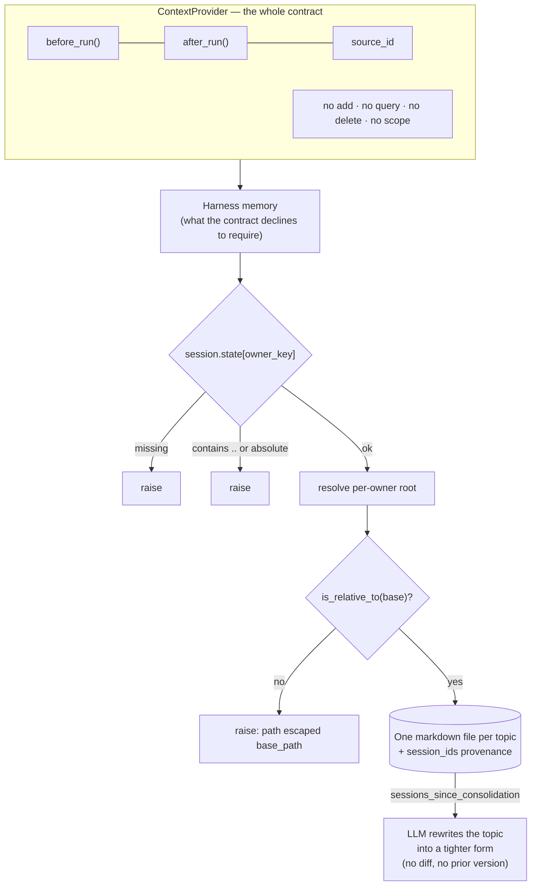

## 1. Executive Summary

Microsoft Agent Framework is the successor to both AutoGen and Semantic Kernel,
MIT-licensed, shipping .NET and Python. It matters to this atlas for a specific
reason: the [AutoGen report](../autogen/) records that its `Memory` protocol
carried `MemoryContent` with **no identifier**, so a targeted delete was not
merely absent but *inexpressible*, and `clear()` was the only removal verb. This
is what that team built next.

**The contract changed shape and kept the gap.** `ContextProvider`
(`python/packages/core/agent_framework/_sessions.py:750`) is `before_run` and
`after_run` plus a `source_id`, with provider-scoped state persisted inside
`AgentSession.state`. It is a *context engineering* interface rather than a
memory interface — a provider adds messages, instructions and tools before the
model runs, and processes the response after. There is no `add`, no `query`, no
`delete`, and no scope parameter. So the finding this atlas made about
[ADK](../adk-python/) and AutoGen holds for a third contract from the same two
vendors: **none of the three declares a removal method.** The difference is that MAF's contract does not
pretend to be a memory contract, which is a more honest position — and leaves
every provider to invent deletion and tenancy separately, in incompatible forms.

**Then the in-tree implementation is much better than the contract requires.**
The harness memory (`_harness/_memory.py`, 1,657 lines, plus `_file_memory.py`)
stores one Markdown file per *topic*: a `MemoryTopicRecord` with a summary, a
list of durable bullets, an `updated_at`, and — the good part —
`session_ids`, the sessions that contributed to it. Provenance is on the record
by default, which is rare in this corpus and free here because the consolidation
pass already knows which sessions it read.

Its scoping is the strongest thing in the report and one of the better examples
in the atlas. `MemoryFileStore._get_owner_id` reads the owner from
`session.state` and **raises if it is missing** — no default, no fallback, no
anonymous bucket. It then rejects an owner id that is absolute or contains `..`.
Owner and source are base64url-encoded into path components, and after resolving
the root the store asserts `memory_root.is_relative_to(self._base_root)` and
raises *"Memory storage path escaped base_path"* if not. That is fail-closed,
defence in depth, and a post-hoc containment check — the same instinct as the
[Pydantic AI Harness](../pydantic-ai-harness/)'s scope re-verification, arrived
at independently and applied to the filesystem rather than to a store's return
value.

## 2. Mental Model

There is no epistemic model. A topic memory is a bullet list that the model
wrote and the consolidation prompt later rewrote "into a tighter durable form".
Nothing carries a status, a confidence or a verification, and nothing marks a
bullet as disputed. What the design models instead is **topic hygiene**: memory
is organised by subject rather than by time, an index of one-line pointers keeps
the per-turn cost bounded, and a periodic pass rewrites a topic file when enough
sessions have touched it.

The lifecycle is therefore: write bullets into a topic, let consolidation
compress the topic, delete the topic if you no longer want it. Correction is
compression — a bullet stops being true by being rewritten out of the file by an
LLM, with no record that it was there.

## 3. Architecture

For the file-backed case, nothing to run: a base path and a model. The tree is
`{base}/{source}/{owner}/{kind}/` holding a topics directory, an index file, a
state file and a transcript archive. `agent-framework-azure-cosmos-memory` is a
separate package (505 lines) providing a Cosmos DB context provider with its own
extraction, and `agent_framework_foundry/_memory_provider.py` (279 lines) is a
client for the hosted Foundry memory service — which is closed, and therefore
reviewable here only as a client, exactly as
[Vertex Memory Bank is inside adk-python](../adk-python/).

That Foundry client requires a `scope` at construction and raises
`ValueError("scope is required")` on an empty one, then at three call sites
passes `self.scope or context.session_id`. The fallback cannot fire given the
constructor check; it reads as a defensive default that would silently
substitute a session id for a user id if the invariant ever moved.

## 4. Essential Implementation Paths

- `python/packages/core/agent_framework/_sessions.py` — `ContextProvider`,
  `AgentSession`, state registration.
- `python/packages/core/agent_framework/_harness/_memory.py` (1,657) — topic
  records, the index, the store ABC, the file store, consolidation.
- `python/packages/core/agent_framework/_harness/_file_memory.py` (531) — the
  file-level tools and their traversal handling.
- `python/packages/azure-cosmos-memory/.../_context_provider.py` (505) — the
  Cosmos provider.
- `python/packages/foundry/agent_framework_foundry/_memory_provider.py` (279) —
  the hosted client.

## 5. Memory Data Model

`MemoryTopicRecord`: `topic`, `slug`, `summary`, `memories: list[str]`,
`updated_at`, `session_ids`. Bullets are deduplicated on construction; the topic
is normalised and slugified for a stable filename; the record round-trips to
both a dict and Markdown, so the on-disk artifact is the source of truth and a
person can read it.

`MemoryIndexEntry` is the pointer form — topic, slug, summary, `updated_at` —
rendered as a length-capped line for the index that goes into the prompt.

Absences: no per-bullet id, so a single memory cannot be addressed, only the
topic containing it. No status, no confidence, no validity time. `updated_at` is
record time. The `session_ids` list is the one provenance field and it is
coarse — it says which sessions contributed to the topic, not which sentence
came from where.

## 6. Retrieval Mechanics

Two tiers, and the split is the design. The **index** — one pointer line per
topic — is injected every turn, so the model always knows what it knows about
without paying for the content. **Expansion** is driven by `_extract_keywords`
over the current messages, selecting topic files to read in full.

There is no embedding and no similarity ranking on this path: topic selection is
keyword overlap against topic names and summaries. For a store organised into
tens of topics that is proportionate, and it fails in the ordinary way — a
question phrased without the topic's vocabulary does not reach the file.

Scope applies underneath all of it: every path resolves through the owner-scoped
root described above, so retrieval cannot address another owner's topics.

## 7. Write Mechanics

Model tools write topic records; the consolidation pass rewrites them.
`DEFAULT_MEMORY_CONSOLIDATION_PROMPT` instructs a model to consolidate one topic
file "into a tighter durable form", and provider state tracks
`last_consolidated_at` and `sessions_since_consolidation`, so the pass is
scheduled by accumulated sessions rather than by a clock. The state validators
coerce malformed values back to a list and `None` rather than failing — a
deliberate tolerance for corrupted persisted state.

The consequence worth stating: **consolidation is a rewrite by a language model
over the durable copy.** A bullet that the model drops during compression is
gone, the file's `updated_at` moves, and nothing anywhere records what the
previous version said. The transcript archive holds the raw sessions, so the
material may be recoverable in principle from a different artifact; the memory
itself keeps no history.

## 8. Agent Integration

`ContextProvider` instances are attached to an `Agent` and participate per run.
`source_id` exists for attribution, so providers can filter messages and tool
calls that other providers contributed — a small, good idea in a framework that
expects several providers at once. DevUI provides an inspection surface, and the
.NET side carries a parallel set of abstractions.

## 9. Reliability, Safety, and Trust

`scope_enforced` is earned three times over: mandatory owner, traversal
rejection, and a post-resolve containment assertion. It is one of the few places
in this atlas where the *failure* of scoping is treated as a thing to detect
rather than as something that cannot happen.

Everything else is absent. **No tombstone** — `delete_topic` removes the file
and consolidation rewrites bullets away, with nothing keyed on the value, so a
later session that re-derives a deleted preference writes it back unopposed.
**No trust state, no confidence, no bi-temporality.** **No audit log**: the
transcript archive is the raw material, not a record of what changed in memory.
**No human review surface** beyond the fact that the artifacts are Markdown a
person can open — which this atlas does not count, on the same basis as
[Basic Memory](../basic-memory/).

## 10. Tests, Evals, and Benchmarks

1,357 lines across `test_harness_memory.py` and `test_harness_file_memory.py`,
none run here, and they are aimed at the right things: state round-trips,
Markdown parsing, consolidation scheduling, disk-full and misconfigured-client
failures, and the boundary.

**The boundary tests are the interesting near-miss on `negative_eval`.** One
sets `session.state["owner_id"] = "../escape"`, asserts `pytest.raises(ValueError,
match="path traversal")` on `write_topic`, and then asserts
`not (tmp_path.parent / "escape").exists()` — that the write did not land
outside the base. The file-memory suite does the same for `../escape.md` on
write and delete, checking that the refusal is reported as a tool message rather
than raised into the run.

That is an assertion that particular material must not be **written** outside
the boundary, which is the mirror of the column and arguably as valuable — but
the column is about retrieval, and nothing here asserts that one owner's query
cannot return another owner's topic. The mark is withheld and the near-miss is
the report's most useful sentence about the suite. No memory benchmark or
retrieval-quality measurement exists, and none is claimed.

## 11. For Your Own Build

### Steal

- **Make the scope key mandatory and check it three ways.** Raise when it is
  missing, reject traversal segments in it, and after resolving the path assert
  it is still inside your base. The third check is the one everyone skips, and
  it is the one that catches the encoding bug you have not written yet.
- **Split the index from the content.** A one-line pointer per topic in every
  prompt, with expansion on keyword match, gives the model an accurate map of
  what it knows for a fixed cost. This is the cheapest version of bounded
  injection in the atlas.
- **Put the contributing session ids on the record.** Coarse provenance costs
  nothing when the consolidation pass already knows them, and it is the
  difference between "where did this come from" being answerable and not.
- **Organise durable memory by topic, not by time.** Consolidation has a natural
  unit, deletion has a natural unit, and the index has natural rows.

### Avoid

- **A provider contract with no removal method — again.** ADK declared none,
  AutoGen could not express one, and `ContextProvider` declares none. Every
  third-party provider now invents deletion, or does not.
- **Compression as your only correction path.** An LLM rewriting the durable
  file "into a tighter durable form" is a lossy edit with no diff, no previous
  version and no record of the bullet it dropped.
- **A fallback that substitutes a session id for a tenant id.** `self.scope or
  context.session_id` cannot fire today because the constructor raises on an
  empty scope. It is one refactor away from silently changing what a memory is
  scoped to.

### Fit

This is the framework to build on if you are in the Microsoft stack and want the
context-provider seam — it is a cleaner abstraction than AutoGen's `Memory`
protocol was, and the harness memory is a genuinely competent default with the
best filesystem scoping in this atlas. It suits a per-user assistant whose
memory is topical and whose correction needs are "rewrite the topic".

Look elsewhere if you need to prove a deletion, hold a claim you are unsure
about, or answer what the system believed last month. There is no unit below the
topic file to attach any of that to, and the contract will not help a provider
that wants to.

## 12. Open Questions

- **What does consolidation drop?** The prompt asks for a tighter durable form
  and nothing measures fidelity. This is the same unmeasured-compression
  question the atlas records for Magic Context's verification precision.
- **Does the Cosmos provider enforce scope in the query, or by container?** The
  505-line provider was not traced in full here.
- **How does the hosted Foundry memory service handle deletion and tenancy?**
  Not reviewable — the client is in-tree and the service is not, which is the
  same limit this atlas records for Vertex Memory Bank.
- **Does the .NET side share these semantics?** Only the Python packages were
  read.

## Appendix: File Index

| Path | Lines | What it holds |
| --- | --- | --- |
| `python/packages/core/agent_framework/_harness/_memory.py` | 1,657 | Topic records, index, store ABC, file store, consolidation |
| `python/packages/core/agent_framework/_harness/_file_memory.py` | 531 | File-level tools and traversal handling |
| `python/packages/azure-cosmos-memory/.../_context_provider.py` | 505 | Cosmos DB context provider |
| `python/packages/foundry/agent_framework_foundry/_memory_provider.py` | 279 | Client for the hosted Foundry memory service |
| `python/packages/core/agent_framework/_sessions.py` | — | `ContextProvider`, `AgentSession`, state registration |
| `python/packages/core/tests/core/test_harness_memory.py` | 877 | State, parsing, consolidation, the traversal boundary |
| `python/packages/core/tests/core/test_harness_file_memory.py` | 480 | File tools, traversal reported as tool messages |

## History

**2026-07-30** — [`28389df805b97f846ca21d857e291602a7adc0a4`](https://github.com/microsoft/agent-framework/commit/28389df805b97f846ca21d857e291602a7adc0a4) — first reading.
