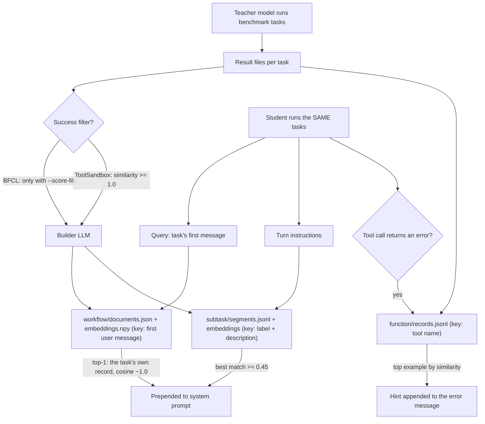

## 1. Executive Summary

This is the code release for *Agent Memory Distillation*
([arXiv:2608.07169](https://arxiv.org/abs/2608.07169), Kim, Kim and Hwang,
7 August 2026). A large teacher agent runs a tool-use benchmark, and an offline
builder turns its trajectories into three files of memory: a workflow insight
per task, subtask segments with example calls, and per-function call records. A
4–8B student agent reads them at inference. Workflow and subtask memory are
prepended to the system prompt once per task, and a function record is appended
to a tool error when one occurs. The retrieve-on-failure tier is the idea that
travels. What is weak is the evaluation loop the code wires: memory is built
from the benchmark tasks the student is then scored on, and nothing stops a task
retrieving its own record.

The tree is an overlay, not a package. The README tells the reader to clone
AppWorld, the Berkeley Function-Calling Leaderboard (BFCL) and Apple's
ToolSandbox, then copy directories from this repository over them. The paper's
three-tier method is present for BFCL (`bfcl/common/memory/`) and for
ToolSandbox (`toolsandbox/common/memory/`). For AppWorld, where the paper
reports its largest gain, the tree holds only the three baselines —
ReasoningBank, MemP and SASM, each as a copy of an ACE-derived experiment tree.
Six AppWorld configs name `running_memory_react`, an agent type no Python file
registers.

**The store is frozen by design, and the paper says so in its limitations.**
Nothing in the student path writes. That places this at the edge of what the
atlas compares: memory that survives across tasks, is retrieved by similarity,
and can be corrected only by editing JSON by hand or rebuilding the directory.

There is no licence file. The atlas reads such repositories read-only and says
so; nothing here grants a reader the right to reuse the code. The ToolSandbox
overlay files keep Apple's copyright header, which points at a `LICENSE` this
tree does not contain.

Three findings shape the rest of this report.

- **Self-retrieval is the default.** BFCL embeds each workflow record on the
  task's first user message and retrieves with the same message, filtered to
  the same category (`bfcl/common/memory/builder.py:705`,
  `bfcl/common/memory/injection.py:177-186`). ToolSandbox does the same with the
  scenario brief (`toolsandbox/common/memory/builder.py:325`). The paper's
  appendix B.3 reports a self-excluded protocol: BFCL falls from 38.50 to 31.00
  for Qwen3-4B. No code in the tree implements that protocol.
- **The success filter the paper describes is optional on BFCL.** The teacher
  script's `SCORE_FILE` defaults to empty, and with no score file every
  trajectory that did not force-quit becomes memory
  (`bfcl/common/scripts/teacher_build_memory_multi_turn.sh:21`,
  `bfcl/common/scripts/build_memory_from_results.py:124-153`).
- **The ToolSandbox builder can orphan its own index.** One embedding call that
  falls back to the local 256-dimension hash makes the builder save only the new
  row, discarding the stored matrix, while the documents file keeps growing
  (`toolsandbox/common/memory/builder.py:335-339`).

## 2. Mental Model

A memory is a claim a teacher LLM wrote about a trajectory, or an excerpt copied
from one. It has three granularities, and the paper's argument is that each is
needed at a different moment.

- **Workflow memory** is a two-to-four-sentence strategy, written by the builder
  LLM from the whole trajectory under a prompt demanding one validation cue and
  one failure pattern (`bfcl/common/memory/builder.py:34-55`). It is keyed on
  the task's first user message.
- **Subtask memory** is a labelled segment of the trajectory — the builder LLM
  names the boundaries, and the code attaches the calls in that range with
  argument values masked (`bfcl/common/memory/builder.py:388-479`). It is keyed
  on label plus description.
- **Function memory** is one successful call — tool name, masked arguments, a
  truncated result, the turn's instruction — with no LLM involved on BFCL
  (`bfcl/common/memory/builder.py:498-547`). It is keyed on the exact tool name.

There is no state machine. A record is born when a build runs and lives until
the directory is deleted. The student treats every retrieved record as reference
material under the instruction *"Adapt it to the current context rather than
copying values literally"* (`bfcl/common/memory/injection.py:214-218`). Nothing
records whether a retrieved memory helped, and nothing demotes one that misled.
The paper's limitations section states the boundary: memory *"remains frozen at
inference time"* and cannot absorb the student's own outcomes.

What decides whether a trajectory becomes memory is the only epistemic gate, and
it differs by benchmark. ToolSandbox builds only from scenarios whose milestone
similarity reaches the threshold, default 1.0
(`toolsandbox/common/utils/rebuild_memory_from_trajectories.py:52`). BFCL builds
from every non-force-quit result unless a score file is supplied, and function
records skip only calls whose result reads as an error
(`bfcl/common/memory/builder.py:524-525`).

## 3. Architecture

Everything is files and in-process NumPy. A build directory holds
`workflow/documents.json` and `workflow/embeddings.npy`,
`subtask/segments.jsonl` with its embedding file, and `function/records.jsonl`
(BFCL also saves `records_embeddings.npy`). The student loads all three stores
into a process-level cache keyed on the directory path
(`bfcl/common/memory/injection.py:52-65`,
`toolsandbox/common/memory/injection.py:34-41`) and scores by brute-force
cosine. There is no server, database or background process.

The runtime is three third-party harnesses with files copied in. On BFCL the
overlay is `bfcl/common/memory/` plus a replaced `base_handler.py` whose
constructor pops `memory_dir`, `memory_types`, `memory_retrieval`,
`decomposer_llm` and `subtask_source` from its keyword arguments
(`bfcl/common/model_handler/base_handler.py:87-106`). The command-line flags
that would carry them — `--memory-dir`, `--memory-types` in
`bfcl/common/scripts/exp_4_workflow_func_subtask.sh:62-71` — are parsed by BFCL
code this tree does not ship. On ToolSandbox the agent names the scripts pass,
such as `MemoryQwen3_4B_WF_FN_ST`, are likewise registered outside the tree.

Embeddings come from OpenAI `text-embedding-3-small` at build and query time.
Student models are served by vLLM. The builder LLM defaults to `gpt-5-mini`.

### Deployment and ergonomics

- **What has to be running:** a checkout of each benchmark, a vLLM server for the
  student, and OpenAI API access for embeddings at both build and query time.
- **Offline:** not as shipped. ToolSandbox falls back to a local hash embedding
  when the API call fails, and that fallback is not stable across processes
  (section 9).
- **API key to store anything:** yes; the builder calls an LLM per trajectory.
- **Install path:** clone three upstream benchmarks, copy overlay directories in,
  and supply the CLI wiring and the baseline packages the tree omits
  (`rb-memories/`, `memp-memories/`, `sasm-memories/` are in `.gitignore`).
- **Hand repair:** the JSON is readable and editable. BFCL embeds the workflow
  *query*, not the insight, so editing an insight's text takes effect without
  re-embedding; editing a subtask label or description leaves its stored vector
  describing the old text.

## 4. Essential Implementation Paths

**Capture (BFCL).** `teacher_build_memory_multi_turn.sh` runs
`bfcl_eval generate` with the teacher on `multi_turn_base`, then calls
`build_memory_from_results.py` (`bfcl/common/scripts/teacher_build_memory_multi_turn.sh:60-102`).
That script loads test entries, optionally subtracts failed ids read from a
score file, and calls `BFCLMemoryBuilder.build_from_result_file`
(`bfcl/common/scripts/build_memory_from_results.py:112-172`).

**Extraction.** `build_from_result_file` formats each trajectory, derives
`category` as the task id minus its numeric suffix, and calls
`build_workflow_memory`, `build_subtask_segments` and `build_function_records`
(`bfcl/common/memory/builder.py:609-673`). Argument values are replaced by typed
placeholders by key name, falling back to the upper-cased key itself
(`bfcl/common/memory/builder.py:282-318`).

**Persistence.** `_save_workflow` merges with the file on disk, keeping any
existing record for the same task id, and re-embeds every document's query
(`bfcl/common/memory/builder.py:684-707`). `_save_subtask` dedupes on
`(task_id, label)` (`:709-739`). `_save_function` appends and re-embeds all
records with no deduplication (`:741-769`).

**Retrieval and injection.** `inject_static_memory` retrieves the top workflow
record for the first user message, filtered by category and retried unfiltered
if empty, then one subtask segment per turn instruction; it truncates the block
at 6,000 characters and prepends it to the system message
(`bfcl/common/memory/injection.py:153-235`). The handler calls it before turn 1
(`bfcl/common/model_handler/base_handler.py:192-196`).

**Reactive path.** After each executed step the FC handler passes results to
`augment_with_function_hints`, which, for results starting `Error during
execution:`, looks up records for the failing function name and appends the
schema and one example (`bfcl/common/model_handler/base_handler.py:427-430`,
`bfcl/common/memory/injection.py:338-400`).

**ToolSandbox.** `MemoryAugmentedAgent.model_inference` builds the static block
once per scenario and re-applies it to every call, then appends a hint to the
most recent tool message matching `Error|Exception|Traceback|failed`
(`toolsandbox/common/roles/memory_augmented_agent.py:96-184`).

**Update, delete, forget.** No path. `rebuild_memory_from_trajectories.py --clear`
deletes the whole directory before a rebuild
(`toolsandbox/common/utils/rebuild_memory_from_trajectories.py:55-57`).

**Tests.** None.

## 5. Memory Data Model

The BFCL dataclasses are `WorkflowMemDoc` (task id, category, query, insight,
involved classes, `source="teacher"`, metadata), `SubtaskSegment` (label,
description, masked calls, sanitised observations, required tools, excerpt,
`generated_at`) and `FunctionStepRecord` (tool name, category, task id, step,
masked arguments, result truncated to 500 characters, task query, turn
instruction, `think`) (`bfcl/common/memory/data_model.py:12-81`). ToolSandbox's
versions carry `scenario_name` in place of task id and category, and a
`created_at` float (`toolsandbox/common/memory/data_model.py:13-79`).

The embeddings live in a separate `.npy` whose row *i* is assumed to be record
*i*. BFCL guards the assumption: a matrix whose row count differs is ignored,
and the subtask store re-embeds everything in that case
(`bfcl/common/memory/store.py:57-63`, `:133-144`). ToolSandbox checks only that
the array is two-dimensional (`toolsandbox/common/memory/store.py:82-85`).

Scope is the build directory. Each script picks a dated path such as
`data/memory/0516`, and two builds never share a file. BFCL's `category` field is
a benchmark subset name — `multi_turn_base` — stored on every record and used as
a retrieval filter with a widening fallback (section 6).

There are no status, validity or supersession fields. `generated_at` and
`created_at` are write times only. Provenance is the task id or scenario name
and the constant `source: "teacher"`; which teacher model or build run produced
a record is not stored on the record.

## 6. Retrieval Mechanics

**Workflow.** BFCL's `WorkflowMemoryStore.retrieve` embeds the query and returns
the top `k` by cosine, default 1 at the call site, with no similarity floor
(`bfcl/common/memory/store.py:65-94`). The paper says entries below a minimum
similarity are discarded; ToolSandbox applies 0.5
(`toolsandbox/common/memory/injection.py:85`), BFCL does not. When the
embedding file is missing, BFCL returns the first `k` documents in insertion
order (`bfcl/common/memory/store.py:94`).

**Category filter and fallback.** BFCL filters workflow and subtask candidates
to the task's category, and when that returns nothing it calls the same
retriever again with no category (`bfcl/common/memory/injection.py:184-186`,
`:199-202`). This is a relevance pre-filter, not a boundary.

**Subtask.** The paper has the student decompose the task into up to six subtask
labels. BFCL's default `subtask_source` is `"turns"`, which uses each turn's user
instruction as a query with no decomposition
(`bfcl/common/memory/injection.py:194-198`), and the experiment scripts keep that
default (`bfcl/common/scripts/exp_4_workflow_func_subtask.sh:7`). ToolSandbox
decomposes with the student model (`toolsandbox/common/memory/injection.py:90-98`).
Both keep the best segment per query above 0.45 and drop repeated labels.

**Function.** BFCL selects records whose `tool_name` equals the failing
function, ranks them by cosine between the current turn's instruction and each
record's stored turn instruction, and returns one
(`bfcl/common/memory/store.py:253-280`). The paper ranks against the stored
reasoning. ToolSandbox ranks by a character-n-gram hash of the call context
against the record's `think`, falls back to task query, and returns two
(`toolsandbox/common/memory/store.py:184-216`).

**Budget.** BFCL caps the static block at 6,000 characters and per-turn subtask
text at 2,000 (`bfcl/common/memory/injection.py:160`, `:242`). ToolSandbox has
no cap.

**Failure mode that matters.** When the store was built from the evaluation
tasks, the workflow query is the stored key verbatim. The top-1 is then the
task's own teacher insight, which names the tools and order that solved this
exact task.

## 7. Write Mechanics

Writes are an offline batch after a teacher run. Per trajectory the BFCL builder
makes one LLM call for the workflow insight and one for segmentation; function
records need none (`bfcl/common/memory/builder.py:639-673`). ToolSandbox adds
one `think` call per successful step when a think model is set, and the rebuild
script sets it (`toolsandbox/common/utils/rebuild_memory_from_trajectories.py:61-65`).

Deduplication is by identity, not content. BFCL keeps the existing workflow
record for a task id, so rebuilding into the same directory with a better prompt
does not replace it (`bfcl/common/memory/builder.py:696-698`). Function records
are never deduplicated, so a second build pass over the same results doubles
them (`:757`). ToolSandbox appends to every file on every call.

Sanitisation runs before storage: typed placeholders for argument values, and
regexes for e-mail, phone, amounts and long numbers in observations
(`bfcl/common/memory/data_model.py:83-91`). The workflow insight is not passed
through the sanitiser; placeholder use there is a request in the prompt
(`bfcl/common/memory/builder.py:46`).

Concurrency is handled on ToolSandbox by an `fcntl` lock around each
read-modify-write (`toolsandbox/common/memory/builder.py:308-317`). BFCL's
builder runs single-process.

### Operational cost

- **Synchronous?** The student never waits on a write. Building is a separate
  job whose cost scales with the number of teacher trajectories.
- **Lag before retrievable:** until the build finishes and the student process
  starts; the store cache never reloads within a process.
- **Whole-store passes:** every BFCL save re-embeds every record in that file,
  not only the new ones (`bfcl/common/memory/builder.py:703-706`, `:763-767`).
- **Read path:** one embedding call for the workflow query, one per subtask
  query, and on BFCL one per failing call. The block sits at the head of the
  system prompt and differs per task, so no provider prefix cache survives
  across tasks.

## 8. Agent Integration

The student has no memory tools. All retrieval is harness-driven: before the
first turn for workflow and subtask, and on a tool error for function memory.
BFCL offers two per-turn variants, `dynamic` (subtask memory prepended to each
user turn) and `system_replace` (the subtask section of the system prompt
swapped per turn) (`bfcl/common/model_handler/base_handler.py:1032-1127`).

On ToolSandbox the retrieval query is taken from the SYSTEM-to-USER message —
the scenario brief ToolSandbox addresses to its simulated user — and only falls
back to the first USER-to-AGENT message
(`toolsandbox/common/roles/memory_augmented_agent.py:59-78`). The student's own
visible conversation is the fallback. The builder keys workflow records on the
same brief (`toolsandbox/common/memory/trajectory.py:80-83`, `:118`), so the key
and the query are identical text drawn from a message the agent is not the
recipient of.

The ToolSandbox hint is appended to a copy of the message list on every model
call, to the most recent error, so it persists in the prompt until a newer
error supersedes it (`toolsandbox/common/roles/memory_augmented_agent.py:137-184`).

Adapting this to another agent means lifting `store.py` and the two injection
functions; they have no dependency on the benchmark beyond the record fields.

## 9. Reliability, Safety, and Trust

**Evaluation leakage by construction.** Teacher and student scripts both default
to BFCL's `multi_turn_base`
(`bfcl/common/scripts/teacher_build_memory_multi_turn.sh:18`,
`bfcl/common/scripts/exp_4_workflow_func_subtask.sh:8`). No retrieval path
excludes the current task id. The paper's appendix B.3 describes cross-split
and self-excluded protocols and reports, for Qwen3-4B with all three tiers,
BFCL at 30.65 and 31.00 against 38.50 in its main table. That gap is about a
third of the reported +23.00 BFCL gain. No code in the tree splits the tasks or
excludes self (Recorded searches).

**The ToolSandbox index can detach from its records.** `_persist_workflow` and
`_persist_subtasks` stack new embeddings onto the stored matrix only when the
widths match; otherwise they save the new rows alone
(`toolsandbox/common/memory/builder.py:335-339`, `:358-362`). A width mismatch
happens whenever `_embed` catches an API exception and returns the 256-wide local
vector (`:378-385`). The documents file keeps every record, and the store does
not compare lengths, so retrieval returns documents by row positions that
describe other records.

**The local fallback is not deterministic.** `_local_embed`'s docstring says
*"Deterministic character n-gram embedding"*, and it indexes with Python's
`hash()` (`toolsandbox/common/memory/builder.py:427-435`,
`toolsandbox/common/memory/store.py:50-57`). String hashing is salted per
process unless `PYTHONHASHSEED` is set, and nothing in the tree sets it. A
256-wide matrix written by the builder is not comparable with a query hashed in
the student process. Function ranking is unaffected: both sides are hashed in
one process.

**Prompt-injected memories.** Teacher trajectories include tool observations,
and subtask records store sanitised observations verbatim into later prompts.
Nothing filters instruction-like text.

**Marks.** None awarded.

- `tombstone` — no record of a rejected value; no deletion below the directory.
- `trust_state` — no status field; `source` is the constant `"teacher"` and no
  read filters on it.
- `bitemporal` — `generated_at`/`created_at` are write times only.
- `scope_enforced` — withheld. BFCL's `category` is stored on the row and
  applied as a predicate (`bfcl/common/memory/store.py:74-77`), but it names a
  benchmark subset rather than a principal, and every call site retries without
  it when it matches nothing (`bfcl/common/memory/injection.py:184-186`). The
  real boundary is the build directory, a physical partition.
- `audit_log` — no mutation record; builds overwrite files.
- `human_review` — no queue or approval state.
- `negative_eval` — no committed test of any kind.

## 10. Tests, Evals, and Benchmarks

No test file is committed. `toolsandbox/common/utils/eval_from_conversations.py`
and `summarize_results.py` compute benchmark scores from run output; they
assert nothing about memory.

The paper ([arXiv:2608.07169](https://arxiv.org/abs/2608.07169), v1 submitted
7 August 2026) reports average gains of 27.2, 11.2 and 3.4 points on AppWorld,
BFCL V3 and ToolSandbox over four students with GPT-5-mini as teacher. For
Qwen3-4B the AMD row reads 49.40, 38.50 and 20.16. No run output, memory
directory or result file is committed; `.gitignore` excludes `result/`,
`memories/`, `*.jsonl` and `*.npy`. None of the figures can be recomputed from
the tree.

Paper and code diverge in six places.

- AppWorld's AMD agent is absent; the configs name an unregistered
  `running_memory_react`.
- The paper builds from successful trajectories; BFCL does so only when a score
  file is passed.
- The paper discards retrievals below a similarity floor; BFCL workflow
  retrieval has none.
- The paper decomposes tasks into subtask labels; BFCL's default and scripts use
  turn instructions.
- The paper retrieves one function example; ToolSandbox returns two.
- The disjoint protocols of appendix B.3 have no code.

The baselines the paper compares against are present for AppWorld only. The BFCL
and ToolSandbox baseline scripts call `rb-memories/run_eval.sh`,
`memp-memories/run_student.sh` and `tool_sandbox.rb_memories.rb_builder`, all
under paths `.gitignore` excludes.

Tests to want before trusting a number: a retrieval test that a task's own id
never appears in its injected block, with a positive control from another task;
a builder test that one fallback embedding does not change the stored matrix's
row count.

## 11. For Your Own Build

### Steal

- **Retrieve convention on failure, not up front.** Function memory is looked up
  by the failing tool's exact name and appended to the error. It costs nothing
  on a successful call and arrives when the model is most likely to read it.
- **Key the strategy record on the task, and key examples on what they do.**
  Workflow records embed the task statement; subtask records embed a label and
  description. Two indexes over one trajectory answer two different queries.
- **Refuse an index that does not match its records.** BFCL's row-count check
  on load is one line and prevents silent misalignment.

### Avoid

- **Building memory from the evaluation set without excluding self.** If the
  key is the task text, the top hit is the task's own answer sketch.
- **Saving a partial index on a dimension mismatch.** Refuse the write, or
  re-embed everything, rather than replacing a matrix with one row.
- **Calling `hash()` a deterministic embedding.** Use a stable hash. BFCL's
  `local_embedding`, imported by the builder and never called, already uses
  `zlib.crc32` (`bfcl/common/memory/data_model.py:94-104`).
- **A filter that silently widens.** A category that falls back to all
  categories is a ranking hint, and should be named as one.

### Fit

This is paper code for three benchmarks, not a memory layer. It assumes a
researcher who will supply the missing CLI wiring, rebuild the store per
experiment, and discard it after. The idea it carries — three tiers split by
when the student needs them — fits a team distilling a large model's
procedures into a small deployed agent over a fixed tool set, and it is cheap to
reimplement from sections 4 and 6. Anyone who needs the store to change after
deployment, to take corrections, or to hold user-specific material should take
the tiering and nothing else.

## 12. Open Questions

- Which build directories produced the published numbers, and were they built
  with a score file on BFCL?
- Where is the AppWorld three-tier agent (`running_memory_react`), and does it
  retrieve with self-exclusion?
- How were the appendix B.3 protocols implemented, given no split or exclusion
  code in this tree?
- Did any ToolSandbox build hit the local embedding fallback, and if so, was its
  matrix detached from its documents?
- Why is the ToolSandbox retrieval key the simulated user's scenario brief
  rather than the agent's first visible message?

## Appendix: File Index

- Storage and schema: `bfcl/common/memory/data_model.py`,
  `bfcl/common/memory/store.py`, `toolsandbox/common/memory/data_model.py`,
  `toolsandbox/common/memory/store.py`.
- Write path: `bfcl/common/memory/builder.py`,
  `bfcl/common/scripts/build_memory_from_results.py`,
  `bfcl/common/scripts/teacher_build_memory_multi_turn.sh`,
  `toolsandbox/common/memory/builder.py`, `toolsandbox/common/memory/sanitize.py`,
  `toolsandbox/common/memory/trajectory.py`,
  `toolsandbox/common/utils/rebuild_memory_from_trajectories.py`.
- Retrieval and context assembly: `bfcl/common/memory/injection.py`,
  `toolsandbox/common/memory/injection.py`.
- Agent integration: `bfcl/common/model_handler/base_handler.py`,
  `toolsandbox/common/roles/memory_augmented_agent.py`,
  `bfcl/common/scripts/exp_2_workflow.sh`, `exp_3_workflow_func.sh`,
  `exp_4_workflow_func_subtask.sh`.
- Baselines (AppWorld only): `appworld/rb/experiments/code/ace/reasoning_bank.py`,
  `appworld/memp/experiments/code/ace/memp/`,
  `appworld/sasm/experiments/code/ace/sasm_memory.py`,
  `appworld/sasm/experiments/configs/0519/`.
- Tests and evals: none; `toolsandbox/common/utils/eval_from_conversations.py`
  scores runs.

### Recorded searches

Run once each at the tree root of the pinned checkout.

- `git ls-files | grep -iE 'test|spec|eval_'` — only `toolsandbox/common/utils/eval_from_conversations.py`, a scorer.
- `git ls-files | grep -iE 'licen[cs]e|copying|notice'` — no match.
- `git grep -nE 'exclude_(self|own|task)|self_exclu|cross.?split|held.?out|task_id ?!=' -- '*.py'` — no match.
- `git grep -nE 'running_memory_react' -- '*.py'` — no match; the name appears only in six `.jsonnet` configs.
- `git grep -nE 'rb_memories|memp_memories|sasm_memories|rb-memories/|memp-memories/|sasm-memories/' -- '*.py' '*.sh' .gitignore` — imports and script calls into those paths, and the three `.gitignore` lines excluding them; no file under them is tracked.
- `git grep -nE 'add_argument\("--memory-(dir|types|retrieval)"' -- '*.py'` — no match.
- `git grep -nE 'MemoryQwen3_4B|MemoryAugmentedAgent\(' -- '*.py'` — only the class definition.
- `git grep -nE 'PYTHONHASHSEED' .` — no match.
- `git grep -n 'local_embedding'` — the definition and one import in `bfcl/common/memory/builder.py:26`; no call.
- `git grep -nE 'status|verified|rejected|tombstone|deleted_at|valid_from|valid_to' -- bfcl/common/memory toolsandbox/common/memory` — only `only_ok_status` and a prompt example.
- `git grep -nE 'min_sim|min_similarity|threshold' -- bfcl/common/memory/store.py bfcl/common/memory/injection.py` — only the subtask floor at `store.py:152`.
- `git grep -nE 'unlink|rmtree|os\.remove|\.pop\(' -- bfcl/common toolsandbox/common` — one `shutil.rmtree` of the whole directory, `rebuild_memory_from_trajectories.py:56`.
- `git grep -niE 'anthropic|machine learning|not (be )?used (for|to)|prohibit' -- README.md '*.py'` — no match; no term restricts analysis.
- `pdftotext` of the paper, then `grep -n 'github.com'` — no match; the paper prints only the project page, which links the repository.

## History

**2026-09-28** — [`2895d10c07105432325b088f4803dc94a10003c9`](https://github.com/taeilkim2465/agentic_memory_distillation/commit/2895d10c07105432325b088f4803dc94a10003c9) — first reading, at the head of `main`, a commit dated 10 August 2026 that changed only the README. No mark awarded; section 9 names each. The paper was read from the arXiv v1 PDF. Screened before reading: no auto-run surface, three build-time execution points (the `setup.py` in each AppWorld tree), nothing inside the cooldown, six unpinned surfaces, and no agent instruction files in the tree. Nothing was installed, built or run.
