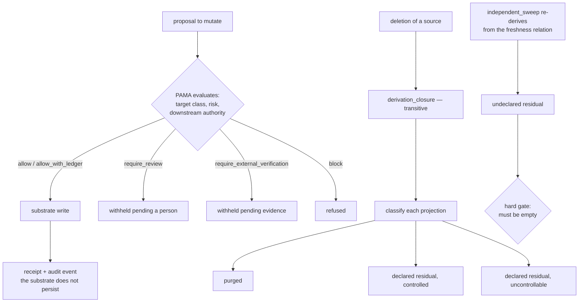

## 1. Executive Summary

Agent Memory is a reference architecture for governed memory, Apache-2.0, from MythologIQ Labs. It is 294 files: 134 Markdown documents totalling around 22,400 lines, 25 ADRs, JSON schemas, 36 conformance fixtures, and — the part this report is mostly about — a 10,400-line Python reference implementation under `reference/` with conformance runners, a Graphiti driver and an adversarial comparator that executes Mem0.

Its thesis is a sentence this atlas could have written: *"Probabilistic epistemics. Governed consequences. Uncertainty may propose. Authority constrains."* What makes it worth a report rather than a citation is that the interesting parts are executable.

**The deletion model is the most developed in this corpus.** `residue.py` treats deletion completeness not as a volume of removed bytes but as a four-way partition of everything derived from a purged source: `purged`, `declared_residual_controlled`, `declared_residual_uncontrollable`, `undeclared_residual` — with `undeclared_residual = 0` as a hard invariant, described in its own docstring as *"disqualifying and un-averageable"*. You are permitted to leave residue. You are not permitted to leave residue you did not report.

Two honesty constraints hold that up. *"Unknown is not a fourth bucket"* — state whose derivation cannot be enumerated is declared uncontrollable, never omitted because it was inconvenient to find. And *"traversal completeness is itself the measurement"*: `independent_sweep` does not ask the purge whether it finished, it re-derives residual status from the freshness relation over every retained declaration including superseded versions. I ran that path against their own modules with my own driver, and a purge that traversed one hop is caught rather than believed — the projection-of-a-projection comes back as `undeclared_residual` and the hard gate fails.

**The substrate stub is deliberately unsafe, and says so.** `InMemoryTemporalGraph` reproduces the *verified permissive* semantics of the mapped substrate: identity is not a content address, supersession marks validity fields rather than deleting, deletion is physical and leaves no tombstone, no operation checks actor identity, and partition filtering *"is an optional query argument that defaults to unfiltered"*. The comment explains why: *"A stub that were already safe would prove nothing about the governance layer under test: the negative paths need something real to escape through."*

That unfiltered default deserves its own sentence, because it is the most repeated scope defect in this corpus — a retrieval argument whose omission means *everything*, catalogued in four live systems on the [scope as a first-class key](../../patterns/scope-as-a-first-class-key/) page. Here somebody has built it on purpose, as a hazard for the governance layer to catch.

Where it is weakest is the ratio. Twenty-five ADRs and 22,000 lines of doctrine sit above a reference implementation whose substrate is a dictionary, and the repository is careful to say so itself: *"Passing fixture validation is not the same thing as proving a production memory system behaves correctly."* Nothing here is a deployable memory system, and it does not claim to be.

## 2. Mental Model

Two kinds of thing are stored, and the second is where the design departs from the corpus.

**Tier-1 canonical state** is a `Fact` in a temporal graph, carrying `valid_at` and `invalid_at` — when the claim was true — separately from `created_at` and `expired_at`, when the store learned and retired it. Correction is supersession, which ADR-023 states as a title: *corrections are supersession, not deletion*.

**Tier-3 derived state** — indices, embeddings, caches, materialized views — is the part the architecture argues everyone else drops. `projections.py` opens with the finding: those artifacts *"are not memory units, so nothing obliges them to declare what they were built from, and that is exactly where deletion residue hides."* A `Projection` therefore declares a `basis` mapping each source to the version read at build time, plus a `transform`, a `content_class`, a `rebuild` class and a `reachable` flag.

From that declaration a **freshness relation is computed rather than flagged**:

```text
current    basis versions match canonical
stale      a basis source moved      → a correctness problem recomputation may fix
residual   a basis source was tombstoned or purged → a governance problem only
           the deletion authority may resolve
```

Nothing sets a `stale` bit, which is the point: *"a substrate that never self-invalidates is still governable."* And stale and residual are kept apart deliberately — collapsing them would lose the distinction the architecture exists to protect.

Whether a memory may *change* is a separate axis entirely. Every mutation is a `Proposal` evaluated by PAMA into one of five outcomes ordered by strictness — `allow`, `allow_with_ledger`, `require_review`, `require_external_verification`, `block`. The load-bearing property is stated in `policy.py` and guarded by tests: *"Estimator confidence is an input to evidence quality only and has no path to the outcome."* A model that is very sure of itself cannot buy authority with confidence.



## 3. Architecture

There is no service. The repository is a doctrine plus a reference implementation you run.

- **`docs/`** — 134 Markdown files, including the layer model, lifecycle state machine, threat model, source trust, privacy classifier, retention and deletion, actor scope and tenancy, governed recall planner, and a research bibliography.
- **`docs/adr/`** — 25 architecture decision records. ADR-015 requires tombstones, ADR-016 requires actor scope and tenancy, ADR-017 requires audit events, ADR-023 makes corrections supersession, ADR-025 requires explicit authority to overwrite a durable decision.
- **`reference/agentmem_ref/`** — 27 modules: `substrate.py` (the port and its permissive stub), `adapter.py` (the governing layer), `policy.py` (PAMA), `projections.py` and `residue.py` (tier-3 and deletion), `receipts.py`, `scope_governance.py`, `shared_revocation.py`, `interchange.py`, `portable_evidence.py`, `mem0_comparator.py`, `graphiti_driver.py`.
- **`reference/tests/`** — 24 test modules.
- **`schemas/`, `fixtures/`** — JSON schemas for PAMA decisions, decision receipts and audit events; 36 scenario fixtures with names like `authority-laundering`, `cross-tenant-relevance-trap`, `same-agent-cross-project-isolation`, `confidently-wrong-memory`.
- **`scripts/`** — seven stdlib-only validators for fixtures, schemas, links, visual assets and doctrine boundaries.

### Deployment and ergonomics

Nothing to deploy. The cost is reading: 22,000 lines of doctrine is a substantial commitment, and the repository organises it with a "start here" table routing by role, which helps.

**There is no dependency manifest** — no `requirements.txt`, no `pyproject.toml` — which is why the screen returned `NOTHING SCANNED`. Dependencies are declared in CI instead: `jsonschema==4.26.0` pinned for the validation job, `graphiti-core` and `kuzu` unpinned for the substrate-conformance job, and `mem0ai` pinned in code at `2.0.18`. `CONTRIBUTING` states the policy the code follows — fixture and link validation stay standard-library, schema validation may use `jsonschema` — and the split is real: I ran the seven `scripts/` validators and the residue path with no installation at all.

## 4. Essential Implementation Paths

### Deletion — `residue.py`, and what I ran

`plan_purge` walks `store.derivation_closure(source_id)` and sorts each projection: reference-only state is purged because it carries no content past its source; unreachable content — *"exports, third-party copies, model weights"* — becomes declared uncontrollable; policy-retained state becomes declared controlled; everything else is purged.

`apply_purge` then does something most supersession designs would not:

> *"Deletion dominates correction: a superseded version retained for reconstructability is, once its basis is purged, exactly the recoverable residue the deletion was meant to eliminate."*

Nothing else in this corpus states that claim: the version history you keep for auditability is a deletion hazard, and the two goods are in direct conflict. Purged identifiers are recorded so that a projection built on a purged projection is *residual* rather than merely stale — *"without that, a partial purge would look like a correctness problem instead of a governance one."*

`independent_sweep` is the verification. It iterates `store.all_versions()`, keeps anything content-bearing whose freshness is `RESIDUAL`, subtracts what the receipt declared, and returns the remainder as undeclared.

I exercised this directly, importing `projections` and `residue` into a driver of my own on a scratch copy rather than running their tests, because the package `__init__` eagerly imports `receipts` and therefore `jsonschema`:

```text
derivation_closure(m1) = ('p1', 'p2')          # transitive, two hops
full plan_purge.purged = ['p1', 'p2']

--- a purge that traversed ONE hop only ---
undeclared_residual    = ['p2']                # re-derived, not reported by the purge
hard gate passed?       False
```

The mechanism does what the docstring says. A purge that stops at the first hop is caught by the sweep rather than believed.

### Authority — `policy.py`

Five outcomes with a strictness ordering, so composing constraints takes a maximum rather than a vote. The separation the module exists to hold is that estimator confidence feeds *evidence quality* and never the outcome — which is the executable form of "uncertainty may propose, authority constrains", and is what stops a confident model from laundering its confidence into permission. `fixtures/authority-laundering.json` is named for the attack.

### Scope — `adapter.py`

The adapter checks a fact against the requesting context and returns named refusals the substrate cannot produce: `out_of_scope`, `project_scope_mismatch`, and a task-level equivalent, against `domain_refs`, `required_domain_refs`, `project_ref` and `task_ref`. `scope_governance.py` adds a second idea — scope is *derived* from a memory's sources, and `scope_broadens` plus `evaluate_scope_promotion` route a widening through PAMA. Scope that can only narrow without authority is a stronger property than a scope key applied as a filter, and it is the answer to consolidation quietly producing a wider-scoped summary.

### The stub that is unsafe on purpose — `substrate.py`

`search()` takes `group_ids: list[str] | None = UNFILTERED`, and the docstring names the hazard rather than fixing it:

> *"`group_ids` defaults to unfiltered, so a caller that forgets the argument reads across every partition"*

Reproducing that is the design. It is also, precisely, the defect this atlas documented in three separate live systems in one round — [Memora](../memora/)'s `follow`, [tdai-memory-mcp](../tdai-memory-mcp/)'s `session_key`, and [OmniIntelligence](../omniintelligence/)'s `project_scope` — where an omitted retrieval argument means *everything*. Seeing it built deliberately, as a fixture for a governance layer to catch, is the strongest argument available that the pattern is a class rather than three coincidences.

### Evidence — `receipts.py` and `portable_evidence.py`

The adapter emits three artifacts against schemas already canonical in the repository: a PAMA decision record, a decision receipt, and audit events. The justification is one line: *"The substrate under evaluation persists none of this, which is precisely why the adapter must."*

`deletion_completeness.py` then composes the residue partition into portable evidence, and the seam is the interesting part: the public measurement carries *counts and cryptographic references, not projection identifiers or memory content*, so that *"a content-free third party can distinguish those lifecycle outcomes without receiving the deleted memory."* Proving a deletion happened without disclosing what was deleted is the problem an append-only or tamper-evident store makes harder, and this is the only design in the corpus that addresses it directly.

### The comparator — `mem0_comparator.py`

It executes Mem0's real `Memory` class with a Qdrant-backed local vector store and SQLite history at `mem0ai==2.0.18`, replacing only the model-construction seams with deterministic doubles so CI needs no credentials and does not measure model variance. Observations are classified `NATIVE | CONFIGURABLE | WRAPPER_REQUIRED | NOT_REPRESENTABLE | UNKNOWN_NEEDS_TEST`, and the module states the fairness constraint itself: *"A gap against Agent Memory is not automatically a Mem0 bug."*

That is a third-party, pinned, credential-free, executable governance evaluation of a system this atlas reports on — the shape the [benchmarks page](../../benchmarks/) keeps asking for. No output is committed, so what exists is the harness and the CI job, not a published result.

## 5. Memory Data Model

A `Fact` carries `uuid`, `fact_text`, `group_id`, and the four temporal fields; an `Episode` retains raw source material verbatim. A `Projection` carries `projection_id`, `basis`, `transform` (`deterministic` or `estimator_mediated`), `content_class` (`reference_only`, `derived_content`, `recoverable_content`), `rebuild` (`reproducible`, `approximable`, `irreproducible`), `scope`, `version`, `superseded_by`, `reachable`.

`requires_authority_to_rebuild` is a small, sharp piece of that model: a rebuild is categorically authorizable only when the transform is deterministic *and* reproducible, because *"everything else commits estimator-derived content and must pass through governance, or invalidation becomes a write channel."* Invalidating a cache as a way to smuggle a write is not a threat most designs here have considered.

What is absent: **no rejected-value tombstone.** The adapter keeps `self._tombstones[fact_uuid]` — keyed on the record, existing to give the substrate the delete marker it lacks — and neither the code nor `docs/28-retention-deletion-and-tombstones.md` uses the vocabulary of a value that must not be re-asserted. The residue machinery attacks the adjacent problem from the other end, ensuring a deleted value does not survive in derived state; nothing here stops the same value being written again from a new source. And there is **no discrete epistemic status on a memory** — the three-valued freshness relation describes derived state's relationship to canonical state, not whether a claim is believed.

## 6. Retrieval Mechanics

Lexical overlap in the reference substrate, scored by token intersection, with the two modelled hazards named above: unfiltered partition default, and event-invalid facts remaining retrievable, *"matching the conservative reading of an open question the source review could not settle"* — an honest way to encode uncertainty about somebody else's system.

The governing read happens in the adapter, where isolation domains, required domains, project and task are checked and a refusal is returned by name. Ranking quality is explicitly not the point.

## 7. Write Mechanics

Every write is a proposal through PAMA, then a substrate mutation, then a receipt and audit event. `shared_revocation.py` and `interchange_propagation.py` handle the harder cases — revoking a memory shared into another domain, and propagating that across an interchange boundary — and ADR-024 requires pre-write claims for shared memory, which is the lost-update problem this atlas has found answered in only a handful of systems.

### Operational cost

- **Nothing is asynchronous.** There is no background pass, no scheduler, and no consolidation job; the residue sweep runs when called.
- **The sweep is a full scan** over every retained version, which is the price of not trusting the purge's own traversal.
- **Evidence is emitted per decision**, so the audit volume scales with mutations rather than with the corpus.

## 8. Agent Integration

None ships. There is no MCP server, no plugin, no client library and no packaging — `reference/` is imported by its own tests and runners. The architecture is meant to be implemented rather than installed, and the repository is consistent about that.

## 9. Reliability, Safety, and Trust

Strengths:

- **Undeclared residue is a hard gate**, and the docstring refuses to let it be averaged into a score.
- **The sweep re-derives rather than asks**, catching a purge that traversed one hop.
- **The closure is transitive**, with the one-hop failure named in the comment.
- **Unknown is declared, not omitted** — uncontrollable is a reported bucket, not a silence.
- **Deletion dominates correction**, a conflict between auditability and erasure that is stated rather than finessed.
- **Bi-temporal facts** with validity and record time separated.
- **Scope narrows freely and widens only through authority.**
- **Confidence cannot reach an authority outcome**, guarded by negative-path tests.
- **Invalidation is treated as a potential write channel.**
- **Evidence is content-free by construction**, so a third party can verify a lifecycle without receiving the deleted memory.
- **The substrate stub is unsafe on purpose**, so the negative paths have something real to escape through.

Gaps:

- **No rejected-value tombstone**; the tombstone here is record-keyed.
- **No epistemic status on a memory unit.**
- **The reference substrate is a dictionary.** Every property above is demonstrated against an in-memory graph plus a Graphiti driver, not against a production store under load.
- **No committed run output** for the conformance suite, the Mem0 comparator or the deletion-completeness chain.
- **No dependency manifest**, so reproducing the full suite means reading CI to discover what to install, and two of those installs are unpinned.
- **The doctrine outruns the badges**: the README states 26 validated fixtures and 19 accepted plus 2 proposed ADRs; the tree holds 36 fixtures, all of which its own validator accepts, and 25 ADRs. The drift is in the harmless direction — the prose understates what ships — which is the rarer direction and still worth reconciling.

## 10. Tests, Evals, and Benchmarks

**What I ran, with nothing installed:** the seven `scripts/` validators, of which `validate_fixtures.py fixtures` reports `Validated 36 fixture(s)`; and the residue partition path, through a driver of my own over copied `projections.py` and `residue.py`, reproducing the transitive closure and the one-hop-purge catch quoted in section 4. **What I did not run:** the 24-module `reference/tests` suite, the conformance runner, the Mem0 comparator and the Graphiti substrate job, all of which need `jsonschema`, `cryptography`, `referencing`, `rfc8785`, `graphiti-core`, `kuzu` or `mem0ai`. With no manifest in the tree the screen could establish no dependency ages, so nothing was installed.

The test design is the part worth studying. Nineteen of the 24 modules are named for a negative path — `test_scope_reduction`, `test_isolation_domains`, `test_shared_revocation_propagation`, `test_boundary_crossing`, `test_stochastic_containment` — and the substrate they run against is deliberately permissive so those paths have something to catch. That is the inverse of the failure this atlas has repeatedly documented, where an integration test passes because the harness supplies the safe behaviour the shipped code omits.

The **negative retrieval assertions** are the isolation fixtures and their tests: `same-agent-cross-project-isolation`, `cross-tenant-relevance-trap`, and `test_isolation_domains` asserting that a fact outside the requesting context's domains is refused by name. These are the scope-boundary kind rather than the corrected-value kind, and the distinction is worth stating for a strict reader.

What is missing is any result. The conformance suite, the comparator and the evidence chain all produce artifacts, and `reports/` contains two files, both named `.example.`. A CI badge records that the doctrine-evidence workflow passes; a published run of the Mem0 comparator would be the more interesting artifact and does not exist here.

**A `CITATION.cff` is present** — *"Agent Memory: A Reference Architecture for Governed Agentic Memory"*, Kevin R. Knapp — but it cites the repository as software. No paper, arXiv reference or DOI appears.

## 11. For Your Own Build

### Steal

- **Make deletion completeness a partition, not a volume.** Purged, declared-controlled, declared-uncontrollable, undeclared — and make the last cell a hard gate. It converts "did the deletion work" from an unanswerable question into a checkable one, and it lets a system be honest about the residue it genuinely cannot reach.
- **Declare the unreachable rather than omitting it.** Exports, third-party copies and model weights are real residue; a design that only counts what it can delete is measuring its own reach.
- **Verify the deletion by re-deriving, never by asking the deleter.** A sweep that recomputes residual status from a basis relation catches a one-hop purge; a receipt that reports its own traversal cannot.
- **Give derived state a declaration surface.** Indices, caches and embeddings are where residue hides precisely because nothing obliges them to say what they were built from. A `basis` map is the whole mechanism.
- **Compute freshness, do not flag it.** A `stale` bit needs a writer that remembers; a relation derived at read time governs a substrate that never self-invalidates.
- **Keep stale and residual apart.** One is a correctness problem recomputation may fix; the other is a governance problem only the deletion authority may resolve.
- **Bar confidence from reaching authority.** Let estimator confidence inform evidence quality and nothing else, and write the negative test that holds the separation in place.
- **Treat invalidation as a write channel.** If rebuilding a projection commits estimator-derived content, the rebuild needs authority — otherwise cache invalidation is an ungoverned write.
- **Build the unsafe stub on purpose.** A test double that is already safe proves nothing about the layer under test. Reproduce the real substrate's permissive defaults and let the governance layer earn its keep.
- **Emit content-free evidence.** Counts and hashes let a third party verify a deletion lifecycle without receiving the deleted memory.

### Avoid

- **A one-hop purge.** Projections are built from projections; a closure that is not transitive measures its own optimism.
- **Retaining superseded versions without asking what deletion means for them.** Reconstructability and erasure are in direct conflict, and the conflict has to be resolved explicitly in favour of one.
- **Averaging a safety invariant into a score.** Undeclared residue is disqualifying; a system that mixes it with everything else can pass while failing the only cell that matters.
- **A retrieval argument whose omission means everything.** This repository builds that defect deliberately as a hazard; three live systems in this atlas ship it by accident.
- **Doctrine that outpaces its own badges.** Counts in prose drift; generate them or reconcile them.

### Fit

This is for someone designing a memory system rather than choosing one. There is nothing to install and nothing to run in production; what you get is a vocabulary, twenty-five decisions with their reasoning, a schema set, and about ten thousand lines of executable demonstration that the hard properties are implementable. If you are building governed memory for a regulated or multi-tenant setting, the deletion and scope material is the most developed treatment in this corpus and worth the reading time on its own.

Walk away if you want a store. The substrate is a dictionary, the retrieval is token overlap, and the repository says plainly that passing fixture validation is not evidence a production system behaves correctly. The risk in adopting the doctrine wholesale is the ratio it invites: 22,000 lines of prose is a lot of design to carry into a system that has not yet met production data, and the ADRs the repository itself marks Proposed are the ones whose acceptance criteria require exactly the runtime evidence that does not exist here yet.

## 12. Open Questions

- What does the Mem0 comparator actually report? The harness is committed, pinned and credential-free; the result is not in the repository.
- Has the residue sweep been run against a real substrate with derived state at scale, or only against the in-memory graph and the Graphiti driver?
- Why do the README's fixture and ADR counts understate the tree, and are the badges generated or hand-maintained?
- Is a rejected-value tombstone out of scope by decision or simply not reached yet? ADR-015 requires tombstones, and the implementation's are record-keyed.
- What would ADR-020 and ADR-021 need to move from Proposed to Accepted, and is that evidence expected to come from adopters?

## Appendix: File Index

- Deletion and derived state: `reference/agentmem_ref/residue.py`, `projections.py`, `deletion_completeness.py`, `portable_evidence.py`.
- Governance: `reference/agentmem_ref/policy.py`, `adapter.py`, `scope_governance.py`, `shared_revocation.py`, `receipts.py`.
- Substrate and comparators: `reference/agentmem_ref/substrate.py`, `graphiti_driver.py`, `mem0_comparator.py`, `systems_characterization.py`.
- Runners: `reference/run_conformance.py`, `run_deletion_completeness.py`, `run_mem0_comparator.py`, `run_concurrency_evidence.py`.
- Doctrine: `docs/28-retention-deletion-and-tombstones.md`, `docs/29-actor-scope-consent-and-tenancy.md`, `docs/04-governance-and-pama.md`, `docs/24-determinism-probability-and-governed-uncertainty.md`, `docs/adr/` (ADR-015, ADR-016, ADR-017, ADR-023, ADR-024, ADR-025).
- Schemas and fixtures: `schemas/pama-decision.schema.json`, `decision-receipt.schema.json`, `memory-audit-event.schema.json`; `fixtures/` (36 files).
- Validators: `scripts/validate_fixtures.py`, `validate_schemas.py`, `validate_doctrine_boundaries.py`.

## History

**2026-08-11** — [`bba0aa4cab8e04d11f5380b215b3eea6998fe119`](https://github.com/MythologIQ-Labs-LLC/agent-memory/commit/bba0aa4cab8e04d11f5380b215b3eea6998fe119) — first reading, on the `main` default branch, 331 commits from a repository created 6 July 2026. Screened before reading: `screen_repo.py` reported `NOTHING SCANNED` because the tree carries no dependency manifest at all, so the execution surface was established by hand — dependencies are declared in `.github/workflows/` and pinned in code. Nothing was installed. The seven `scripts/` validators were run as shipped, and the residue partition was exercised through a driver written for this review over copies of `projections.py` and `residue.py`, because the package `__init__` imports `jsonschema` transitively.
