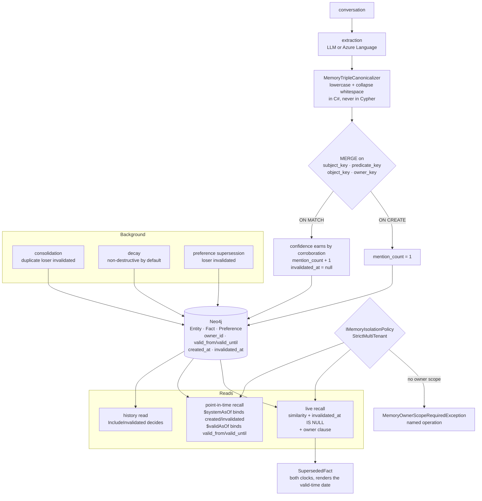

## 1. Executive Summary

This is a .NET library — sixteen projects, a NuGet meta-package, an MCP server,
Semantic Kernel and Agent Framework adapters — storing agent memory as a Neo4j
graph of entities, subject-predicate-object facts and preferences.

Four marks, and the through-line is that the interesting decisions are all
written down at the point they were made.

**Two clocks, in one query.** The point-in-time fact search binds a system
clock against `created_at`/`invalidated_at` and a valid-time clock against
`valid_from`/`valid_until`, applies both, and splices the owner clause in
beside them. Entities take only the transaction clock because they have no
validity window, and the docstring says so. The separation reaches the rendered
answer: a superseded fact comes back as its own small record carrying both
closing clocks, and rendering prefers the valid-time date, because *"a reader
asking 'since when?' means the world, not the database."*

**Facts merge on a canonical key computed outside the database.** Subject,
predicate, object and owner are each canonicalised in C# — lowercased *and*
whitespace-collapsed — and the write path merges on those four columns. The
lookup used to ask a different question, matching `toLower(f.subject)`, and the
comment explains why that was a correctness bug rather than a performance one:
the two disagree outright on U+0130, so the lookup *"could find a different
fact than a MERGE would collapse onto."*

**Salience counts assertions, not retrievals.** `mention_count` increments once
per ingestion that re-states a triple, and the comment names what it refuses to
be: ranking on the system's own retrievals *"is a rich-get-richer loop that
reinforces whatever already ranks highly and calls it learning."*

**The isolation tests assert all four outcomes in a row.** Two owners and a
shared row; each owner finds their own and the shared one, and nothing of the
other's.

What is not here is a rejection that survives. Re-asserting an invalidated fact
sets `invalidated_at` back to null, deliberately — *"a present-time positive
assertion restores live recall."*

## 2. Mental Model

Memory is a graph of three node families, and almost every mechanism is a
property on those nodes rather than a separate table.

A fact's identity is its canonical triple plus its owner. Everything else
follows from that: re-extraction collapses rather than duplicating, confidence
is earned by corroboration rather than overwritten by whichever extraction ran
last, and the mention count is a record of how often the world said the thing.

Time is two properties and two more: when the row was created and when the
system stopped believing it, alongside when the fact started and stopped
holding. A read either asks the live question — similarity, invalidation,
owner — or the as-of question, which is where both clocks come in.

Deletion is not part of the model. Consolidation, supersession and the
destructive decay mode all stamp `invalidated_at`; history reads can ask for
those rows back.

## 3. Architecture

## 4. Essential Implementation Paths

- **Scope and isolation:** `src/AgentMemory.Abstractions/Options/MemoryScope.cs`,
  `Options/MemoryIsolationMode.cs`,
  `Exceptions/MemoryOwnerScopeRequiredException.cs`.
- **Time:** `src/AgentMemory.Neo4j/Queries/TemporalQueries.cs`,
  `Abstractions/Options/ValidTimeMode.cs`,
  `Abstractions/Options/TemporalValidityMode.cs`.
- **Fact identity and upsert:** `src/AgentMemory.Neo4j/Queries/FactQueries.cs`.
- **Lifecycle:** `src/AgentMemory.Abstractions/Domain/History/MemoryHistory.cs`,
  `Domain/LongTerm/SupersededFact.cs`,
  `Neo4j/Queries/ConsolidationQueries.cs`, `Queries/DecayQueries.cs`.
- **Surfaces:** `src/AgentMemory.McpServer/`, `src/AgentMemory.SemanticKernel/`,
  `src/AgentMemory.AgentFramework/`.

## 5. Memory Data Model

Three node families share a shape: an embedding, a confidence, an owner id, a
created stamp, an updated stamp and a nullable invalidation stamp. Facts add
the canonical keys, a validity window, source message ids and the mention
count.

The canonical keys are the part worth copying. They exist because the
canonicaliser and Cypher's `toLower` are different functions, and the
difference is not theoretical — the comment names U+0130 and notes that the C#
form also collapses whitespace runs. Keeping the computation on one side of the
wire means the read and the write cannot drift apart, and the unit test asserts
exactly that: the lookup must filter the same four columns the merge uses, and
`toLower` must not appear in either shape.

The composite index wants every column, not a prefix, which is why the owner
clause in that one query filters `owner_key` rather than `owner_id` — and why
an unscoped lookup is documented as still planning a scan, *"deliberately so:
with no owner there is no fourth column to filter."*

## 6. Retrieval Mechanics

Live recall is vector similarity per family with an owner clause and an
invalidation clause. Point-in-time recall adds the second clock. GraphRAG
context assembly walks the graph and is covered by its own isolation test.

The honest gap is documented in the enum that exists to close it: live recall
does *not* filter on valid time by default, so a fact valid from six months
hence is returned today and a fact whose `valid_until` has passed is returned
*"forever"*. The remarks explain why that was inert until recently — no
extractor wrote validity bounds, so the clauses would have matched nothing —
and why shipping the writer made the defect reachable from configuration. Both
new modes default to off, and the reason given is that prompt bytes are a
measured variable fingerprinted into evaluation runs, so a default that shifted
them *"would invalidate sealed bases silently."*

That reasoning also produces the sharpest risk statement in the tree: because
live recall filters on these columns, a fabricated `valid_until` does not add
noise, it *"silently removes a memory from every future answer"* — which is why
the extraction instruction tells the model to omit validity rather than guess
it.

## 7. Write Mechanics

Extraction canonicalises, then merges. On create the mention count starts at
one; on match, confidence is increased by a configurable corroboration alpha
rather than replaced, validity bounds are coalesced so re-extraction never
clears a supersession window, the mention count increments, and
`invalidated_at` is reset.

The batch path merges on the same four keys as the single path, and the
docstring records why: it used to merge on `id`, *"which let a re-extracted
triple with a fresh id create a second node."*

## 8. Agent Integration

An MCP server exposing tools, resources and prompts; adapters for Semantic
Kernel and the Microsoft Agent Framework; a CLI; connectors; sample projects
and a package-consumer test matrix. MIT, version 1.5.0.

## 9. Reliability, Safety, and Trust

**Trust state — awarded**, on a narrow but real mechanism: a stored
invalidation stamp, surfaced as a two-value status, with a history read whose
flag decides whether invalidated rows are returned. The limit is vocabulary —
two states, and nothing distinguishing a dedup loser from a retraction.

**Bi-temporal — awarded.** Two clocks as separate parameters in one query, and
a predecessor type that keeps both and knows which one to render.

**Scope enforced — awarded**, with the opt-in caveat in the evidence. The
strict mode is the part worth naming: a missing owner scope becomes a dedicated
exception carrying the operation name, so the failure is visible at the call
rather than as a quietly broader result set.

**Negative eval — awarded**, on integration cases against a real Neo4j with
their positive controls in the same block.

**Tombstone — withheld, and the code makes the call for me.** Fact identity
*is* value-keyed — the canonical triple plus owner — and the lookup carries no
liveness filter, so a re-extracted triple does find the invalidated node rather
than creating a new one. Everything a tombstone needs is in place except the
refusal: `ON MATCH SET` includes `f.invalidated_at = null`, and the batch
path's docstring states the intent plainly — *"invalidated_at is reset on
re-assert (a present-time positive assertion restores live recall)."* So a
retraction lasts exactly until the next extraction that says the same thing.
That is a defensible product decision for a store whose invalidations mostly
come from deduplication, and it is the opposite of what this mark asks for.

**Audit log — withheld**, and the rubric's exclusion is the one that applies:
logs of retrieval do not count. The trail here is `:MemoryReadAudit`, one row
per surfacing, and the codebase is explicit that it is deliberately *not* the
salience signal. No append-only record of mutations exists; history is derived
from the nodes' own stamps and supersession edges.

**Human review — withheld.** There is a `memory-review` MCP prompt, and its
text is a numbered procedure addressed to the agent: call search, call
list-sessions, compile a summary, flag contradictions. No person adjudicates
anything, and nothing gates a write on approval.

## 10. Tests, Evals, and Benchmarks

**No paper** and no `CITATION.cff`.

Five test projects. The unit suite is large and much of it asserts the *text*
of emitted Cypher — that a clause is present, that `toLower` is absent, that
all four index columns are filtered. That is a reasonable way to pin a query
builder and a weak way to pin behaviour, which is why the marks rest on the
integration suite instead.

The evaluation apparatus is the unusual part. A dedicated LongMemEval harness
sits under `tools/`, with its own unit project of over a hundred files covering
ablations, answer-presence gates, prompt byte-identity, seed wiring, voting and
quote forcing, and abstention accuracy. That last one carries the most careful
distinction in the repository: the sufficiency metric's absent-count is a
ground-truth *input*, identical across arms by construction, while abstention
accuracy is an *outcome*, and reporting only the first *"invites reading a class
balance as a result."* It also records that across fifty-two runs before typed
sampling shipped, no abstention question had ever been drawn.

No benchmark result is committed, and the architecture document marks several
tiers **BUILT and WIRED but not MEASURED**, naming working memory as having had
no LongMemEval run at all. A repository that labels its own unmeasured surfaces
is doing something most do not.

## 11. For Your Own Build

- **Make the read ask the question the write answers.** Canonicalise on one
  side of the wire and filter the canonical columns; a lookup that lowercases
  in the database and a merge that canonicalises in the application are two
  different notions of the same key.
- **Count assertions, not retrievals.** A salience signal fed by your own
  recall reinforces whatever already ranks, which is a loop rather than
  learning.
- **Let corroboration increase confidence rather than replace it**, so the
  latest extraction's number is not automatically the stored one.
- **Turn a missing scope into a named exception.** Catching
  `OwnerScopeRequired` at the call is worth more than noticing a broad read
  later.
- **Say which clock you render.** A user asking "since when?" wants valid time;
  the transaction clock is the fallback, not the answer.
- **Decide explicitly whether a retraction survives re-assertion**, and put the
  decision in the query rather than leaving it to whichever branch the merge
  happens to take.

## 12. Open Questions

- Clearing `invalidated_at` on re-assert is right for a dedup loser and
  questionable for a user retraction, and both share the field. Would a reason
  on the invalidation — retracted versus deduplicated — let the merge treat
  them differently?
- Live recall ignores valid time unless the flag is set, and the writer for
  those columns now exists. What is the migration story for a store that
  enabled extraction before enabling the read gate?
- The architecture document marks several tiers as unmeasured. Which of them
  does the next LongMemEval run cover, and does the abstention sampling change
  the baseline enough that earlier numbers are not comparable?

## Appendix: File Index

- Scope, isolation and exceptions:
  `src/AgentMemory.Abstractions/Options/MemoryScope.cs`,
  `Options/MemoryIsolationMode.cs`, `Options/MemoryIsolationOptions.cs`,
  `Exceptions/MemoryOwnerScopeRequiredException.cs`
- Time: `src/AgentMemory.Neo4j/Queries/TemporalQueries.cs`,
  `src/AgentMemory.Abstractions/Options/ValidTimeMode.cs`,
  `Options/TemporalValidityMode.cs`, `Options/TemporalQueryClocks.cs`
- Fact identity and upsert: `src/AgentMemory.Neo4j/Queries/FactQueries.cs`
- Lifecycle and history:
  `src/AgentMemory.Abstractions/Domain/History/MemoryHistory.cs`,
  `Domain/LongTerm/SupersededFact.cs`,
  `src/AgentMemory.Neo4j/Queries/ConsolidationQueries.cs`,
  `Queries/DecayQueries.cs`, `Queries/PreferenceQueries.cs`,
  `Queries/HistoryQueries.cs`
- Surfaces: `src/AgentMemory.McpServer/`, `src/AgentMemory.SemanticKernel/`,
  `src/AgentMemory.AgentFramework/`
- Tests: `tests/AgentMemory.Tests.Integration/ShakedownEndToEndTests.cs`,
  `Integration/Compatibility/TckMirroredBehaviorTests.cs`,
  `Integration/GraphRag/GraphRagAdapterIntegrationTests.cs`,
  `tests/AgentMemory.Tests.Unit/Queries/FindByTripleMergeKeyTests.cs`,
  `tests/AgentMemory.Tests.Unit.LongMemEval/`

## History

**2026-09-19** — [`1fe5105ce9347ccc629d72a1f8560538a250fceb`](https://github.com/joslat/agent-memory-dotnet/commit/1fe5105ce9347ccc629d72a1f8560538a250fceb) — first reading, at the head of `main`, version 1.5.0. Screened with `scripts/screen_repo.py` before anything was read: three auto-run surfaces (a Copilot instructions file and two VS Code settings files), four unpinned MSBuild reference surfaces in the package-consumer projects, no build-time execution path, and an `AGENTS.md` addressed to a reading agent — read as data throughout. Nothing was installed, built or run. MIT. Four marks. The reading covered the node model and its canonical keys, the upsert's create and match branches, the point-in-time queries and both clocks, the scope record and the isolation policy, the history surface and its invalidation flag, the consolidation, decay and preference supersession writers, and the integration tests the marks rest on; the connectors, analytics, enrichment and NAMS trees were read as context rather than as subject. Three marks are withheld with reasons in section 9, and the one to read is `tombstone`: fact identity is genuinely value-keyed and the lookup carries no liveness filter, so everything the mark asks for is present except the refusal — the merge's match branch sets the invalidation stamp back to null, with the intent stated in the batch path's own docstring. Two reports in this corpus already carry the name `agentmemory`; both are different projects by different authors and neither is this one.
