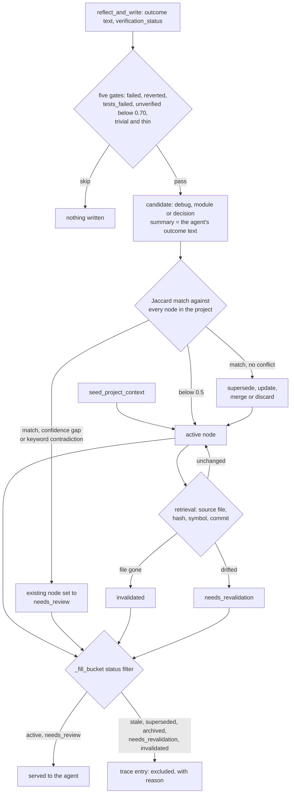

## 1. Executive Summary

Agent Memory Engine is a local stdio MCP server for coding agents. It keeps a
typed memory tree per repository: constraints, architecture, modules,
decisions, incidents and procedures, each a row with status, confidence, trust
and optional source evidence. Beside the tree it indexes the repository itself
into an FTS5 knowledge base. The agent calls `retrieve_agent_context` before
work and `reflect_and_write` after it; no model is called on either path.

What is notable is how much of the epistemics is enforced in code. A memory
derived from one file records that file's SHA-256, and every retrieval
re-checks it. A drifted or deleted source moves the memory to
`needs_revalidation` or `invalidated`, and the composer stops serving it. Trust
and verification levels are assigned from provenance, never from the text, and
the agent's tool schemas cannot raise either to its human-confirmed rung.

What is weak is the wiring between those layers. A conflict flags the existing
memory `needs_review`, the README says that status is excluded, and the
composer serves it. The branch the agent passes to `reflect_and_write` never
reaches the stored node. The human elevation verbs and `revalidate` have no
caller. Compaction writes a status value the domain enum does not define.

Three marks: `trust_state` on the status column the composer filters,
`scope_enforced` on `project_id`, and `negative_eval` on an end-to-end recall
case. Section 9 names the four withheld. The licence is MIT. The project
dogfoods itself: its own `CLAUDE.md` tells a coding agent to call both tools
while developing it.

## 2. Mental Model

A memory is a `MemoryNode`: a titled summary of a kind, placed in a tree under
a parent, with numbers for importance and confidence and three discrete axes
— lifecycle status, provenance trust, verification evidence. Nodes come from
two places. `reflect_and_write` derives them from an agent's account of a
finished task. `seed_project_context` takes constraints and decisions as typed
and writes them as active.

**Reflection is gated, then promoted at once.** `ReflectionSkill.analyze` drops
a task that failed, was reverted, failed tests, is unverified below 0.70
confidence, or is trivial and thin (`memory_engine/skills/reflection.py:188-262`).
The MCP tool passes 0.65 for an unverified task, so only a task the agent calls
`tests_passed`, `build_success` or `manual_check` produces candidates
(`memory_engine/mcp/tools.py:530`). A surviving task yields a `debug`,
`module` or `decision` candidate whose summary is the agent's own outcome text.

**Promotion decides by similarity and by keyword.** `PostTaskService` stages
each candidate and promotes it in the same call
(`memory_engine/services/post_task.py:85-120`). `DeduplicationService` scores
it against every node: 0.6 of title-and-summary Jaccard, 0.2 for same kind,
0.2 for module overlap. At 0.8 and above it is a near duplicate, at 0.5 a
partial one (`memory_engine/services/deduplication.py:25-26`, `:94-140`).
`ConflictService` then reports a conflict when the candidate's confidence is
more than 0.15 below the existing node's. It also reports one when the two
summaries straddle one of five keyword pairs, such as `must`/`may` or
`synchronous`/`async` (`memory_engine/services/conflict.py:40-123`).

The outcome table is `PromotionService._branch`
(`memory_engine/services/promotion.py:248-287`):

| Match | Conflict | Action |
| --- | --- | --- |
| none, or below 0.5 | — | create an active node |
| near duplicate | yes | flag the existing node `needs_review` |
| near duplicate | no, candidate at least as confident | supersede: new active node, old one `superseded`, a `supersedes` relation |
| near duplicate | no, candidate less confident | discard |
| partial | yes | flag the existing node `needs_review` |
| partial | no, candidate at least as confident | update the summary in place |
| partial | no, candidate less confident | merge: append up to 200 characters after `Additionally:` |

**A memory stops being served in five ways, and one flag does not stop it.**
Supersession and a human `stale` mark are explicit. Retention archives stale
and superseded nodes after 180 and 120 days. Source drift is automatic:
`RecallService` runs `SourceValidityService.check` over up to 50 nodes that
carry a `source_path`. A missing file sets `invalidated`. A changed hash, a
missing Python symbol or an unreachable commit sets `needs_revalidation`
(`memory_engine/skills/recall.py:274-298`;
`memory_engine/services/source_validity.py:264-341`). The composer skips all
five statuses (`memory_engine/skills/composer.py:221-243`). It does not skip
`needs_review`, so the node a conflict flagged keeps reaching the agent,
labelled `non-authoritative` in its trace provenance (`:108-115`, `:174-176`).

**Nothing leaves `needs_review` or `needs_revalidation`.** No writer moves
either back to `active`: `revalidate` exists and is called only from a test
(`source_validity.py:343-369`). The conflicting candidate is recorded with
status `needs_review` and never becomes a node.

## 3. Architecture

A Python 3.11 package, `memory_engine`, with three front ends over one service
layer: the MCP server `memory-engine-mcp` (`memory_engine/mcp/server.py`), the
Typer CLI `memory` (`memory_engine/cli.py`), and a FastAPI app
(`memory_engine/main.py`), which the Dockerfile runs on `0.0.0.0:8000`. Skills
(`recall`, `reflection`, `inspect`, `composer`, `ranker`) call services
(`promotion`, `retention`, `source_validity`, `source_trust`), which call
repositories over SQLAlchemy.

**The front ends open different databases by default.** The MCP server's
`ProjectContext` opens `<root>/.memory-engine/memory.db`
(`memory_engine/bootstrap/local_storage.py:78-83`;
`memory_engine/mcp/project_context.py:77-92`). The CLI and FastAPI app use
`settings.database_url`, `sqlite:///./memory_engine.db` relative to the working
directory, overridable as `ME_DATABASE_URL` (`memory_engine/config.py:63`;
`memory_engine/db/session.py:10-17`). `memory stale`, `memory retention run`
and `memory retention restore` therefore act on the MCP server's store only
when an operator points that variable at it.

The knowledge base shares the memory file: documents, chunks, paragraphs,
propositions and module summaries, each with an FTS5 table, built
deterministically from the repository at bootstrap and on
`refresh_project_knowledge`. An optional sqlite-vec `vector.db` adds an
embedding arm over knowledge records only. Embeddings come from
sentence-transformers, Ollama or FastEmbed, off by default
(`memory_engine/config.py:9-57`).

Nothing runs in the background. There is no thread or task scheduler in the
package; indexing, validity checks and promotion all run inside a tool call.

### Deployment and ergonomics

The documented path is `uv run memory-engine-mcp --project-root` with an
absolute path, from an MCP client config. Storage is a SQLite file; no
service, API key or network is needed, and the semantic extras are opt-in. On
first connection, bootstrap creates `.memory-engine/`, indexes the repository,
and writes a policy block into the project's `CLAUDE.md`
(`memory_engine/bootstrap/bootstrap_service.py:405-425`). That contradicts the
README's *"No writes outside `.memory-engine/`: guaranteed"* (`README.md:769`).

The store is SQLite and readable with any client. Repair by hand means SQL:
the CLI's lifecycle verbs open a different file by default, and no MCP tool
corrects or removes a node.

## 4. Essential Implementation Paths

**Capture.** `tool_reflect_and_write` (`memory_engine/mcp/tools.py:422-571`)
validates the optional workspace handshake, maps `verification_status` and
keyword-scans the outcome for failure words unless the status is verified. It
builds a `ReflectionInput` with the branch and commit (`:523-533`) and calls
`PostTaskService.reflect_and_write` with the server's project root (`:483`).
The schema accepts `task_summary`, `test_summary` and `evidence_refs`
(`memory_engine/mcp/schemas.py:82-89`), and the handler passes none of them on.

**Extraction.** `ReflectionSkill.analyze` (`memory_engine/skills/reflection.py:188-500`)
applies the gates, then emits candidates by intent. It binds a `source_path`
only for `debug` and `module` kinds and only when exactly one file was touched
(`:133-163`). `discovered_constraints` and `discovered_procedures` are fields
of `ReflectionInput`, and the MCP tool has no parameter that fills them.

**Promotion.** `PromotionService.promote` (`memory_engine/services/promotion.py:105-149`)
runs placement, deduplication against `list_by_project`, the branch table
above, and records the candidate's outcome. `_create_node` (`:482-547`) hashes
the source file, assigns trust with `assign_creation_trust`, carries the
evidence level, and writes `status="active"`. It passes no branch or commit,
and `MemoryNodeRepository.create` has no parameter for either
(`memory_engine/repositories/memory_node.py:14-61`).

**Consolidation.** `ConsolidationService.update_parent` rewrites a parent's
summary from its children's after each create or supersede.

**Retrieval.** `tool_retrieve_agent_context` (`memory_engine/mcp/tools.py:203-323`)
resolves git context and builds `UnifiedContextRetrievalService` with the
project root (`:246`). That service checks its cache, revalidating the memory
ids a cached pack referenced (`memory_engine/knowledge/fusion.py:140-158`). It
gives 60% of the budget to `RecallService.recall` and the rest to knowledge
search (`:80`, `:162-185`). Recall loads every node of the project
(`memory_engine/skills/recall.py:265`), runs validity checks, scores, applies
the relevance gate (`:332-339`) and calls `ContextComposer.compose`.
Conflict detection then annotates the selection without writing (`:359-384`).

**Correction.** `PromotionService.mark_stale` (`promotion.py:151-160`) is
reached from `memory stale` and `POST /memories/{node_id}/stale`. `set_trust`
and `set_evidence_level` (`:162-230`) are documented as *"callable from
CLI/API"*; neither the CLI nor any route calls them.
`MemoryService.delete_node` has no caller. `MemoryRetentionService`
(`memory_engine/services/retention.py`) expires pending candidates after 30
days, archives, compacts and restores.

**MCP surface.** Seven tools: `retrieve_agent_context`, `inspect_memory`,
`inspect_knowledge`, `reflect_and_write`, `memory_status`,
`refresh_project_knowledge`, `seed_project_context`
(`memory_engine/mcp/server.py:109-294`). Twelve read-only resources, whose
memory queries filter `status="active"` (`memory_engine/mcp/resources.py:25-40`).

**Tests.** `tests/`, run by CI with `uv run pytest` after `uv sync --extra dev`
(`.github/workflows/ci.yml`).

## 5. Memory Data Model

`MemoryNodeORM` (`memory_engine/models/orm.py:70-175`) carries, beyond title,
summary, kind, depth, parent and tags:

| Group | Fields | Written by |
| --- | --- | --- |
| lifecycle | `status`, `previous_status`, `validity_reason`, `validity_checked_at` | promotion, `mark_stale`, `set_validity`, retention |
| scores | `confidence`, `importance` | creation, update |
| source evidence | `source_path`, `source_hash`, `source_symbol` | `_create_node` for single-file `debug` and `module` candidates |
| constraint scope | `constraint_scope`, `constraint_scope_ref` | reflection's `infer_candidate_scope`, direct creation |
| trust | `trust_level`, `previous_trust`, `trust_elevated_by`, `_reason`, `_at` | `assign_creation_trust`; elevation has no caller |
| verification | `evidence_level`, `verification_evidence` JSON, elevation fields | reflection's `assign_creation_evidence_level` |
| branch | `branch_name`, `commit_sha`, `branch_scope`, `source_revision` | no write path; tests set them on fixtures |
| retention | `archived_at`, `archived_reason`, `compacted_into_id`, `last_retrieved_at`, `retrieval_count` | retention |

`evidence` rows hold content and a source per node. `memory_relations` hold
typed edges — `supersedes`, `derived_from`, `contradicts`,
`compaction_source` and branch relations — under a unique constraint.
`memory_candidates` hold every staged proposal with its outcome
(`:217-274`).

**Every axis keeps one previous value.** `set_validity`, `set_trust` and
`set_evidence_level` copy the current value into a `previous_` column before
overwriting (`memory_engine/repositories/memory_node.py:84-181`). A second
transition loses the first.

**Scope.** `project_id` is on nodes, candidates and every knowledge table.
`ConstraintScope` adds a radius to constraints: `global`, `repository`,
`branch`, `module`, `path`, `symbol`, `task_intent`, `needs_scope_review`
(`memory_engine/models/domain.py`). Reflection never infers `global`
(`memory_engine/services/constraint_scope.py:181-205`).

**Status values the code writes and the enum lacks.** `MemoryStatus` has seven
values (`domain.py:78-91`). `compact_memory_group` writes `status="compacted"`
(`memory_engine/services/retention.py:395-412`), and `MemoryNode.status` is
typed `MemoryStatus` with no validator. Recall and promotion both validate
every row of the project, so after `memory retention run --no-dry-run` compacts
a group, the next call should fail validation. This was read, not reproduced;
`tests/test_phase11_retention.py:289-317` checks the compacted row through the
ORM and never recalls afterwards.

## 6. Retrieval Mechanics

**Memory is ranked in Python over the whole project.** `DeterministicRanker`
(`memory_engine/skills/ranker.py`) combines nine signals. `semantic_similarity`
(0.20) is the same Jaccard value as `lexical_similarity` (0.15), *"placeholder
= lexical"* (`:236-238`), so word overlap carries 0.35 of the base score. With a
branch, a second formula mixes in branch affinity, scope priority, revision
validity and working-tree match. On memory nodes those read `branch_name` and
`branch_scope`, which no write path sets, and `valid_to_revision`, which the
node table does not have (`:375-396`).

**Gates and buckets decide what is served.** The relevance gate drops
`architecture` and `decision` nodes with no lexical, file, symbol or
semantic-at-0.4 signal. Constraints pass only when `constraint_is_eligible`
says their scope applies (`memory_engine/skills/recall.py:84-175`). A
`repository`-scoped constraint is always eligible, whatever its status
(`memory_engine/services/constraint_scope.py:156-159`); a `global` one must also
be `active`, at confidence 0.85 and at trust `reviewed_committed_design` or
higher (`:132-154`). The composer then fills five node buckets and an evidence
allowance — 800, 900, 1,800, 1,700, 500 and 300 tokens at the default 6,000,
scaled to the request — and estimates tokens as characters over four
(`memory_engine/skills/composer.py:49-68`).

**The trace is the strongest part of the read path.** Every scored node appears
in `retrieval_trace` as selected or excluded, with the score breakdown, the
reason, and a compact provenance object: branch, source, status, constraint
scope, trust label, verification label, which signals matched, and authority.
The MCP response returns the first 20 entries (`memory_engine/mcp/tools.py:308`).

**Knowledge is a separate hybrid.** FTS5 over chunks with `project_id` and
`index_status` predicates (`memory_engine/knowledge/fts_index.py:314-345`), an
optional sqlite-vec arm, RRF fusion, and a near-duplicate drop against the
selected memory summaries (`memory_engine/knowledge/fusion.py:240-275`). A
multigranular pass routes by intent between propositions, paragraphs and module
summaries.

**Failure modes.** Every retrieval loads and validates every node in the
project, so cost grows with the store. Topic gating on Jaccard misses
paraphrase unless embeddings are on, and they never cover memory nodes. A
`needs_review` node is served (section 2). The `UNTRUSTED_REPOSITORY_CONTENT`
marker for low-trust authoritative nodes is rendered only by
`EnrichedContextPack.as_text` (`memory_engine/models/domain.py:844-858`), whose
one caller is `memory debug recall` (`memory_engine/cli.py:507`). The MCP
response serialises nodes with `model_dump` and carries `trust_level` as a
field.

## 7. Write Mechanics

Writes are explicit, synchronous and deterministic. `reflect_and_write`
promotes inside the call, bumps `memory_revision` and invalidates the cache, so
the next retrieval sees the result (`memory_engine/mcp/tools.py:540-545`). No
model is called anywhere on the write path.

**The agent decides what is verified.** The gate that admits a reflection is
the agent's own `verification_status`. `tests_passed` yields confidence 0.85
after the clamp against the tool's fixed `agent_confidence`
(`memory_engine/skills/reflection.py:68-74`, `:266-270`). The
verification-evidence ladder records this as `agent_claimed`.
`engine_observed` and `external_observed` need a target or external reference.
`human_confirmed` passed at creation is not honoured
(`tests/test_verification_evidence.py:201`).

**`seed_project_context` bypasses all of it.** The tool writes a project
overview, up to 12 constraints, up to 8 decisions and a conventions node as
`active` at confidence 1.0 (`memory_engine/skills/seeding.py:131-232`). It
fills empty fields from README headings. The description says *"Call ONCE"*
and nothing enforces it. The reflection tool's description says agents
*"cannot force memory creation directly"* (`memory_engine/mcp/server.py:206`);
this tool is on the same surface. Seeded constraints carry no source path, so
they land at `generated_report` trust and `repository` scope, which is always
eligible.

**Conflict handling is keyword-shaped.** The five contradiction pairs fire on
common words: one summary with `must` and another with `may` conflict. A
reflection at 0.85 against a seeded node at 1.0 does not trip the 0.15
confidence rule. It is discarded as a near duplicate, merged as a partial one,
or flagged on a keyword pair. Merge appends `Additionally:` and the first 200
characters without changing confidence.

**Branch scope is dropped on the write.** The MCP handler computes
`branch_scope` and passes `branch_name` (`memory_engine/mcp/tools.py:471-475`,
`:531-533`). `ReflectionSkill` never reads either; its one branch argument is
the literal `branch_name=None` (`memory_engine/skills/reflection.py:301`). The
candidate repository and `_create_node` take no branch parameter. The tool
description promises the opposite: *"to scope the written memory to the
correct branch"* (`memory_engine/mcp/server.py:211`).

**Delete and forget.** There is no hard delete on any surface. Retention
archives; `restore_memory` sets any node it is given back to `active`
(`memory_engine/services/retention.py:444-453`).

### Operational cost

- Write: synchronous, no model call. One candidate insert, one Jaccard pass over
  every node in the project, one node write, plus a parent-summary rewrite.
- Lag: none; the cache generation is bumped in the same call.
- Background: none. Retention is an operator command.
- Read: every node loaded with its evidence, up to 50 file hashes, Python
  scoring. Injection is bounded by the token budget, 6,000 by default, 60% to
  memory. The response is a tool result, so it does not sit in a cached prompt
  prefix.

## 8. Agent Integration

The agent has seven MCP tools and holds both write verbs: `reflect_and_write`
and `seed_project_context`. It cannot mark a memory stale, correct one, delete
one, or resolve a review. Those verbs exist only in the CLI and HTTP app.

Bootstrap installs a block in the project's `CLAUDE.md`, and `memory policy
install --client cursor` writes `.cursor/rules/agent-memory-policy.mdc`
(`memory_engine/policy/installer.py:83-145`). The block tells the agent to
retrieve before editing production code and to reflect after `tests_passed` or
`build_success`. Recall is therefore prompted, not automatic: nothing injects
memory without a tool call.

Workspace isolation is a handshake. `workspace_root` and
`repository_fingerprint` are optional. When absent, the request proceeds with a
logged warning unless `MEMORY_ENGINE_STRICT_WORKSPACE=1`
(`memory_engine/mcp/tools.py:82-196`). The `isolated_task` and
`do_not_use_memory` flags skip retrieval.

Adapting it to another MCP host is configuration only. Adapting the policy
block to a host without `CLAUDE.md` or Cursor rules is manual.

## 9. Reliability, Safety, and Trust

**Source-drift invalidation is the mechanism to study.** A memory derived from
one file is withheld once that file changes, a recorded symbol disappears, or
its commit is no longer an ancestor of HEAD. The transition is persisted with
the previous status and the actor, and runs on the cache-hit path too
(`memory_engine/knowledge/fusion.py:348-397`). Its documented limit is coarse:
any edit to the file triggers it. Its undocumented limit is that nothing
reverses it.

**Provenance trust cannot be talked up through the agent's tools.**
`assign_creation_trust` looks only at whether a source path exists and matches
a seed-document pattern (`memory_engine/services/source_trust.py:148-180`).
Reflection-derived and seeded constraints sit at `generated_report`, below the
bar for a global constraint. The HTTP app is the exception: `MemoryNodeCreate`
accepts `trust_level` verbatim (`memory_engine/services/memory_service.py:53-62`),
and the app has no authentication.

**Conflict detection ends in a flag nobody clears.** `_action_needs_review`
marks the existing node and records the candidate (`promotion.py:454-476`).
No tool, CLI command or route lists, approves or rejects either. The node
stays in the composer's output, and repeated reflections keep matching it,
because `ConflictService` exempts only `stale`, `superseded` and `archived`
(`memory_engine/services/conflict.py:88-93`).

**Prompt injection.** Content becomes memory through the agent's outcome text
or seed lists, both agent-authored. Knowledge ingestion redacts eight secret
patterns before storage. Nothing filters memory content.

**Data loss.** No delete path exists, and retention dry-runs by default.
Compaction archives its sources and writes a row the domain model rejects
(section 5). A second lifecycle transition overwrites the first
`previous_status`.

**Uncertainty is representable** as a status the composer acts on, two ladders
it labels, and per-signal scores in the trace.

Capability marks:

- `trust_state` — awarded. The status column has states that withhold a node
  from being treated as current, written on a reachable path and filtered in
  `_fill_bucket`. `needs_review` is the state the README lists as excluded,
  and it is the one the composer serves.
- `scope_enforced` — awarded on `project_id`, with the by-id inspect gap and
  the unwritten branch columns stated in the record.
- `negative_eval` — awarded; evidence in section 10.
- `tombstone` — supersession keys on the old node's id, and a discarded
  candidate is a row nothing consults. `find_duplicates` reads nodes only, so
  the same text can return as a new candidate.
- `bitemporal` — `created_at` and `updated_at` only. `valid_from_revision` and
  `valid_to_revision` are knowledge-document columns with no writer, and the
  ranker reads `valid_to_revision` off nodes that lack it.
- `audit_log` — each axis keeps one `previous_` value, overwritten on the next
  transition. `memory_candidates` records reflected proposals and outcomes;
  seeding, direct creation, staleness, validity and retention bypass it.
- `human_review` — `needs_review` waits for nobody: no verb on any surface
  resolves it, and the composer serves the flagged node meanwhile. Human
  elevation of trust and verification is implemented in
  `PromotionService.set_trust` and `set_evidence_level`, stamps
  `trust_elevated_by`, and has no caller outside tests.

## 10. Tests, Evals, and Benchmarks

Nothing was installed or run for this report; everything below is from
reading the tests at the pin. The README states a count of 511 passing tests
(`README.md:921`); the checkout holds 717 test functions.

**The negative cases.** `test_s07_superseded_memory_excluded_from_recall`
(`tests/test_phase4.py:141-180`) creates a superseded and an active
architecture node, recalls, and asserts the first absent, the second present,
and the first excluded in the trace with a `superseded` reason.
`test_recall_excludes_invalidated_source_backed_memory`
(`tests/test_source_validity.py:240-262`) deletes a node's source, recalls,
and asserts it absent, persisted as `invalidated` with `previous_status ==
"active"`, and excluded in the trace. Composer unit tests do the same for
`stale` and `superseded` with a positive control
(`tests/test_context_composer.py:117-157`).

**Scope.** `test_evidence_is_scoped_to_the_owning_node_project`
(`tests/test_verification_evidence.py:240-261`) creates two projects in one
database and asserts the node lists under its own and not the other. The
sqlite-vec cases assert exact id sets for project and lifecycle filters
(`tests/test_phase13_sqlite_vec.py:97-113`). They start with
`pytest.importorskip("sqlite_vec")`, and CI installs only the `dev` extra,
which does not include it. `test_different_projects_isolated`
(`tests/test_phase10_slice3_retrieval.py:768-797`) asserts `results == []`
with no positive control.

**Tests that assert the mechanism rather than the outcome.** The branch tests
set `branch_name` on hand-built nodes and check the ranker
(`tests/test_phase9.py:86-106`); none reflects with a branch and reads the
stored node. One phase 9 case asserts only that the input model carries
`current_branch` (`:571`). The compaction tests read the compacted row through
the ORM and never recall afterwards. No test asserts that a `needs_review` node
is excluded or served.

**Not present.** No retrieval-quality benchmark, no latency measurement, and no
paper or citation block in the tree.

## 11. For Your Own Build

### Steal

- **Bind a derived memory to the file it came from, and withhold it when the
  file moves.** Hash at write time, re-check a bounded shortlist on read,
  persist the transition with the previous status, and re-check the ids a cached
  pack referenced before serving the cache.
- **Assign trust from provenance only.** Whether a memory has a committed
  source, and what kind, decides its authority; the words in it never do.
- **Make the top rung of each trust ladder unreachable from the agent's
  schema.** Accept the agent's claim, record it as a claim, and refuse the
  human-confirmed value at creation.
- **Give constraints a radius.** A constraint scoped to a path, symbol, module
  or intent surfaces when the task touches it, instead of on every task.
- **Return the exclusions.** A trace entry for every node not served, with the
  reason, makes a status filter auditable from the agent's side.

### Avoid

- **A status the docs call excluded and the filter omits.** Keep one exclusion
  set and import it everywhere; this tree has three, and they disagree.
- **A review state with no resolver.** If nothing clears a flag, it is a label,
  and the flagged memory is served while the queue grows.
- **Accepting a scoping parameter and dropping it before the write.** A test
  that the input carries the branch passes while no stored node has one.
- **Writing an enum value the reader's model does not define.** The writer
  used the ORM's string column; the reader validates against the enum.
- **Two default databases for one product.** An operator's CLI correction that
  lands in a file the agent never reads is silent.

### Fit

This suits one developer with one repository and an agent that will follow a
retrieve-then-reflect policy, who wants memory derived from code to expire when
the code changes. Everything is local and deterministic, and the source-drift
machinery is careful. A reader who needs the review and branch features the
README advertises must wire them: the states, columns and services exist, and
no reachable path completes them. A team should keep the FastAPI app off the
network; it has no authentication and accepts any trust level.

## 12. Open Questions

- Does recall fail after a non-dry-run compaction, as the enum reading
  predicts, or does a layer not read here coerce the value?
- Is the CLI meant to be used with `ME_DATABASE_URL` pointed at a project's
  `.memory-engine/memory.db`? No documentation read here says so.
- How often does the keyword contradiction check fire on real reflections, and
  how many nodes sit in `needs_review` after a month of use?
- Was `needs_review` left out of the composer's skipped set on purpose, given
  the provenance label it receives?

## Appendix: File Index

- **Storage and schema:** `memory_engine/models/orm.py`,
  `memory_engine/models/domain.py`, `memory_engine/models/knowledge_orm.py`,
  `memory_engine/db/init_db.py`, `memory_engine/db/session.py`,
  `memory_engine/config.py`, `memory_engine/bootstrap/local_storage.py`.
- **Write path:** `memory_engine/mcp/tools.py`,
  `memory_engine/skills/reflection.py`, `memory_engine/services/post_task.py`,
  `memory_engine/services/promotion.py`,
  `memory_engine/services/deduplication.py`,
  `memory_engine/services/conflict.py`, `memory_engine/skills/seeding.py`,
  `memory_engine/repositories/memory_node.py`,
  `memory_engine/repositories/candidate.py`.
- **Trust and validity:** `memory_engine/services/source_validity.py`,
  `memory_engine/services/source_trust.py`,
  `memory_engine/services/verification_evidence.py`,
  `memory_engine/services/constraint_scope.py`,
  `memory_engine/services/conflict_detection.py`.
- **Retrieval and context:** `memory_engine/skills/recall.py`,
  `memory_engine/skills/ranker.py`, `memory_engine/skills/composer.py`,
  `memory_engine/knowledge/fusion.py`, `memory_engine/knowledge/fts_index.py`,
  `memory_engine/knowledge/sqlite_vec_index.py`.
- **Lifecycle:** `memory_engine/services/retention.py`, `memory_engine/cli.py`.
- **MCP and HTTP:** `memory_engine/mcp/server.py`,
  `memory_engine/mcp/schemas.py`, `memory_engine/mcp/resources.py`,
  `memory_engine/api/routes/`, `memory_engine/main.py`.
- **Bootstrap and policy:** `memory_engine/bootstrap/bootstrap_service.py`,
  `memory_engine/policy/installer.py`.
- **Tests:** `tests/test_phase4.py`, `tests/test_source_validity.py`,
  `tests/test_context_composer.py`, `tests/test_verification_evidence.py`,
  `tests/test_phase13_sqlite_vec.py`, `tests/test_phase11_retention.py`,
  `tests/test_promotion.py`, `tests/test_phase9.py`.

### Recorded searches

Checked against the checkout at the pinned revision.

- `rg -n 'needs_review' --type py memory_engine` — written by `promotion.py:462-463` and the candidate outcome; read by `constraint_scope.py:70`, `composer.py:112`, `conflict_detection.py:112`; absent from `_fill_bucket`'s skipped set at `composer.py:225-231`.
- `rg -n 'needs_review' tests` — promotion outcomes and tool outcome strings only; no recall assertion.
- `rg -n '\.set_trust\(|\.set_evidence_level\(|apply_trust_transition|apply_verification_transition' --type py .` — definitions in `promotion.py`, `source_trust.py`, `verification_evidence.py`; callers only in `tests/test_source_trust.py` and `tests/test_verification_evidence.py`.
- `rg -n 'revalidate\(' --type py memory_engine` — the definition and its docstring only.
- `rg -n 'delete_node' --type py .` — the definition only.
- `rg -n 'branch' memory_engine/services/post_task.py memory_engine/repositories/candidate.py memory_engine/services/promotion.py memory_engine/services/memory_service.py memory_engine/skills/seeding.py` — `promotion.py:132`, `:245`, `:248`, all the `_branch` method name.
- `rg -n 'branch_name|head_commit|branch_scope' memory_engine/skills/reflection.py` — one hit, `:301`, `branch_name=None`.
- `rg -n 'valid_to_revision|valid_from_revision' --type py .` — the knowledge ORM and migration columns, and the ranker's `getattr`; no writer.
- `rg -n 'compacted' --type py memory_engine` — `retention.py` writes it; `MemoryStatus` does not define it.
- `rg -n 'field_validator|model_validator' memory_engine/models/domain.py` — no match.
- `rg -n 'threading|Thread\(|asyncio\.create_task|run_in_executor|BackgroundTasks' --type py memory_engine` — one match, a comment.
- `rg -n '__tablename__' memory_engine` — twelve tables; none is an event or audit log.
- `rg -n -i 'tombstone|rejected_value|deny_list|suppress' --type py memory_engine` — no match.
- `rg -n '\.as_text\(' --type py memory_engine` — one caller, `cli.py:507`.
- `rg -n 'database_url' --type py .` — `config.py:63` and `db/session.py`; the MCP context uses `local_storage.db_url`.
- `grep -n 'importorskip' tests/test_phase13_sqlite_vec.py` — line 13.
- `grep -rliE 'arxiv|bibtex|@article|@misc|doi\.org|CITATION' . --exclude-dir=.git` — no match.

## History

**2026-10-03** — [`6e345342051dea267e465fc24e3e88e326d9ac51`](https://github.com/uudam42/agent-memory-engine/commit/6e345342051dea267e465fc24e3e88e326d9ac51) — first reading, at the head of `main`, a merge commit dated 1 October 2026. Three marks: `trust_state`, `scope_enforced`, `negative_eval`. Screened before reading: no auto-run surface, one build-time execution point (`tests/conftest.py`), two dependency files inside the cooldown (`pyproject.toml`, `uv.lock`) — every file in the depth-1 clone dates to the tip — and no unpinned surface; `CLAUDE.md` was treated as data. Nothing installed, built or run.
