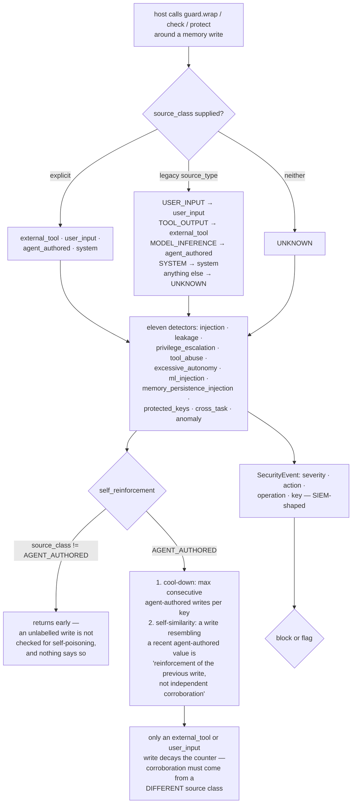

## 1. Executive Summary

OWASP Agent Memory Guard is Apache-2.0, Python, version 0.3.2 — a library that
wraps an agent's memory writes and reads, runs eleven detectors over them, and
emits SIEM-shaped security events. It ships with a LangChain adapter, an MCP
server, a GitHub Action, semgrep rules and a standalone scanner, and carries 168
tests across seventeen files.

It is not a memory system and holds no memories of its own, which is why it
carries no marks. It is in this atlas because it is the only subject here whose
whole purpose is to name what can go wrong with somebody else's memory, and its
taxonomy is worth reading against the failures the rest of this corpus
exhibits: `injection`, `leakage`, `privilege_escalation`, `tool_abuse`,
`excessive_autonomy`, `ml_injection`, `memory_persistence_injection`,
`protected_keys`, `cross_task`, `anomaly`, and `self_reinforcement`.

That last one is the reason to read it. Its docstring describes, in four lines,
a failure this atlas has found repeatedly and never seen stated so cleanly:

> "an agent reads its own prior `agent_authored` memory, mildly elaborates on
> it, writes it back, then reads the elaborated version on the next turn and
> elaborates again. Over a few iterations a hallucination or
> attacker-suggestion is reinforced into a durable 'fact' the agent now relies
> on."

The two rules it enforces per key are the right two. A **cool-down**: at most N
consecutive agent-authored writes within a window. And **self-similarity**: a
write resembling a recent agent-authored value on the same key "is treated as
reinforcement of the previous write, not independent corroboration."

The sentence that makes it a real defence rather than a rate limit is the decay
clause: "A separate `external_tool` or `user_input` write decays the counter
(independent evidence weakens the loop)." Corroboration only counts when it
comes from a different source class. Several systems in this corpus count an
agent's own restatement as a second sighting; this is the module that says why
they should not.

The source-class taxonomy behind it is explicit about which side of the trust
boundary each value sits on: `external_tool` and `user_input` are "external
inputs (untrusted by default)", `agent_authored` is "the self-poisoning
surface", `system` is "config/admin/runtime infrastructure".

And then there is where it stops. `source_class` is a parameter the integrating
code passes. There is no derivation, because there cannot be — a library
wrapping a dictionary write has no way to know whether the value came from a
model or a user. The default is `UNKNOWN`, and the detector's own docstring is
unambiguous: it "[o]nly fires on writes whose source_class is AGENT_AUTHORED",
returning early for anything else.

So an integration that calls the guard without labelling its writes gets the
injection and leakage detectors and *none* of the self-poisoning protection, and
nothing tells it so. The legacy fallback narrows it further: `source_type` maps
to a class automatically, and only `MODEL_INFERENCE` becomes `agent_authored`.

That is a fair design under the constraint, and it is the fact a reader needs
before assuming the headline defence is on.

## 2. Mental Model

A **source class** says which side of the trust boundary a write came from, and
the caller declares it.

A **detector** inspects one operation and returns a severity and an action —
block or flag.

**Self-reinforcement** is the loop where an agent's own elaboration becomes its
own corroboration, and only a different source class breaks it.

## 3. Architecture

| Area | Role |
| --- | --- |
| `src/agent_memory_guard/detectors/` | Eleven detectors, one file each |
| `src/agent_memory_guard/guard.py` | The wrapper, source-class resolution, classification |
| `src/agent_memory_guard/events.py` | `SourceClass`, `Severity`, the security-event record |
| `src/agent_memory_guard/classification.py`, `policies/` | Memory classes and policy |
| `src/agent_memory_guard/storage/` | In-process and Redis stores for guard state and snapshots |
| `src/agent_memory_guard/integrations/`, `mcp-server/` | LangChain and MCP surfaces |
| `scanner/`, `semgrep/`, `action.yml` | A standalone regex scanner emitting SARIF, semgrep rules, a CI action |
| `docs/`, `benchmarks/` | The written guidance and a benchmark tree |

## 4. Essential Implementation Paths

`src/agent_memory_guard/detectors/self_reinforcement.py:1-18`. The docstring is
the contribution — read it whether or not you use the library.

`src/agent_memory_guard/events.py:35-48` for the taxonomy and which values are
untrusted by default.

`src/agent_memory_guard/guard.py:303-317` for how a source class is resolved,
and what happens when none is given.

## 5. Memory Data Model

None. The guard carries a source class, an optional memory class and a policy
decision alongside a caller's key and value, and keeps its own state — sliding
write histories per key, snapshots — in an in-process or Redis store.

Memory classification is the one place it constrains the host's data: a key
assigned a class cannot be silently reclassified, and an attempt emits a HIGH
severity block. Protected keys have their own detector.

## 6. Retrieval Mechanics

Not a retrieval system. Reads pass through for leakage and cross-task
contamination checks.

## 7. Write Mechanics

The write is the host's; the guard inspects it. The detectors return a severity
and an action, and the host decides whether a block means anything — which is
the usual shape for a middleware and worth stating, because a library that
returns `Action.BLOCK` has not blocked anything by itself.

## 8. Agent Integration

A Python package with a LangChain adapter, an MCP server, and a GitHub Action
for CI. The breadth is the point for adoption and it is also where the labelling
problem bites hardest: the more drop-in the integration, the less likely the
calling code is passing `source_class` on every write.

## 9. Reliability, Safety, and Trust

Two things are worth separating, because the project's name will carry weight
with readers.

The library is real. Eleven detectors, 168 tests, a considered source-class
taxonomy, memory classification with protected keys, integrity checks, snapshots
and SIEM-shaped events. The self-reinforcement design in particular is better
thought through than most of the memory systems it exists to protect.

The standalone scanner is not the same thing. `scanner/rules.py` is sixty-three
lines of regular expressions with two rules. The unprotected-memory-write rule
matches an assignment to a variable literally named `memory` or `state` and
requires `guard.wrap`, `guard.check` or `guard.protect` to appear *on the same
line*; a guard call on the preceding line reads as a violation, a wrapper
function reads as a violation, and a store called anything else reads as safe.
The second rule looks for hardcoded secrets. Both are reasonable as a smoke
test and neither supports a conclusion about whether a codebase guards its
memory.

The README leads with PyPI download and repository clone counts. Under an OWASP
heading those numbers will be read as endorsement rather than traffic, and the
atlas's position is that adoption is not evidence about code.

## 10. Tests, Evals, and Benchmarks

168 test functions across seventeen files, plus a `benchmarks/` tree, a
`demo.py` and semgrep rule fixtures. The detectors each carry tests; what is not
present is an evaluation of detection rates against a labelled corpus of real
attacks, so precision and recall for any detector are not established from the
tree.

## 11. For Your Own Build

Take the self-reinforcement rule even if you take nothing else. If your system
extracts memories from its own output, an agent's restatement of its own claim
must not count as corroboration — and the only way to enforce that is to record
which source class each write came from and require a *different* one to
strengthen a belief.

Record provenance at the call site, not by inference. This library's limitation
is instructive: it cannot derive what it is not told, so if your store has a
defence keyed on provenance, make the provenance argument mandatory rather than
defaulted. A required parameter with no default is the difference between a
defence that is on and one that is off in every integration that forgot.

Say when a defence is inactive. An unlabelled write here silently skips the
self-poisoning check; a counter of skipped-for-unknown-source writes, surfaced
in the same events stream as the detections, would tell an operator their
headline control is not running.

And do not ship a regex linter as evidence about a codebase. Two same-line
patterns cannot establish that memory writes are guarded, and a SARIF file makes
the output look more authoritative than the rules are.

## 12. Open Questions

What the detectors' precision and recall are. The benchmark tree exists; no
labelled attack corpus or detection-rate result was found in it.

Whether `source_class` will become required. It is the parameter the headline
defence depends on and it currently defaults to `UNKNOWN`.

How the OWASP project designation relates to the code. The repository carries
the OWASP organisation and the www-project naming convention; what review that
implies was not established here.

## Appendix: File Index

| Path | What to read it for |
| --- | --- |
| `src/agent_memory_guard/detectors/self_reinforcement.py` | The clearest statement of the self-poisoning loop in this corpus |
| `src/agent_memory_guard/events.py:35-48` | A source taxonomy that says which values are untrusted |
| `src/agent_memory_guard/guard.py:303-317` | Source-class resolution, and the `UNKNOWN` default |
| `src/agent_memory_guard/detectors/` | Eleven named threats, one file each |
| `scanner/rules.py` | Two regex rules, and what they cannot establish |

## History

**2026-09-16** — [`a1f60687ea36bb836e21106c52e057a4d951b912`](https://github.com/OWASP/www-project-agent-memory-guard/commit/a1f60687ea36bb836e21106c52e057a4d951b912) — first reading, at a commit dated 16 September 2026. Apache-2.0. The subject is a defensive middleware rather than a memory store, so it holds no memories of its own and carries no marks; it is recorded for its threat taxonomy. Screened before opening, from a shallow clone: twelve files scanned, one auto-run surface, no build-time execution points, five unpinned surfaces and six dependency files inside the seven-day cooldown. Nothing was installed, built or run.
