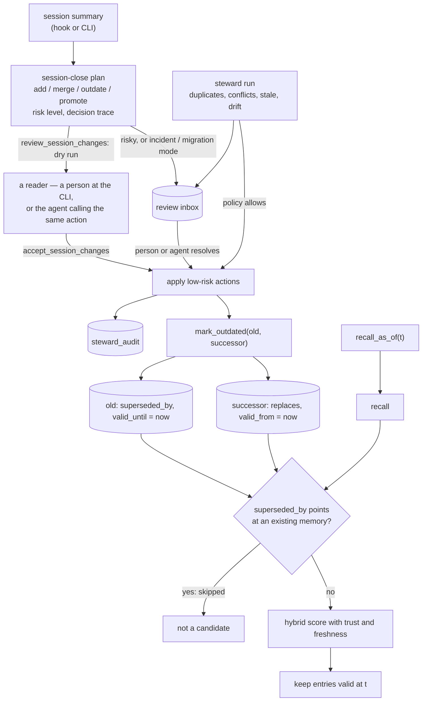

## 1. Executive Summary

agent-memory-mcp is a memory and context server for engineering agents, written
in Go: version 0.13.3, MIT, 220 commits since 20 February 2026, about 33,400 lines
of non-test Go and 670 test functions. It serves about 50 MCP tools over stdio or
HTTP/JSON-RPC, a CLI that mirrors them, and Claude Code hooks, with a Homebrew
formula and a Docker recipe for running it as a team service.

It is aimed at DevOps and platform work more than general chat memory. Memories
are typed as decisions, runbooks, incidents, postmortems, dead ends and similar
engineering artifacts. A RAG index covers project documents and classifies them
as ADRs, RFCs, changelogs, runbooks or infrastructure files. Allowlisted file
tools let the agent read and search the repository.

The maintenance layer is the part to study:

- **Session close as a plan.** A summary is classified and turned into proposed
  additions, merges, outdatings and promotions, each with a risk level and a
  decision trace. `review-session` prints the plan without applying it.
  Incident and migration sessions send risky changes to review.
- **A steward.** It finds duplicates, conflicts, stale entries and drift against
  the live repository, applies low-risk actions under a configurable policy,
  and puts the rest in an inbox a person resolves.
- **Honest changelogs.** The project records measured regressions in its own
  features and turned age decay off by default after measuring it.

The temporal model has a gap. `mark_outdated` with a successor stamps the old
entry `superseded_by`, closes its `valid_until` and opens the successor's
`valid_from`, both at the current time. Recall hides superseded entries.
`recall_as_of` is implemented as recall followed by a validity-window filter
(`internal/memory/temporal.go:13-37`). A question about what was true before a
supersession therefore cannot return the entry that was true then, and the
test for `recall_as_of` passes only because its fixture never sets
`superseded_by`.

One mark: `negative_eval`.

## 2. Mental Model

A memory has a **type**, from the four cognitive types, and in metadata an
**engineering type**, a **lifecycle** status and a **knowledge layer**.
Canonical knowledge is recalled and listed separately from raw memory.

Knowledge changes by lifecycle rather than by overwrite:

- `mark_outdated` without a successor caps importance at 0.25, marks the entry
  archived and outdated, and closes `valid_until`. It stays recallable,
  ranked lower.
- `mark_outdated` with a successor does the same, marks it superseded, links
  both directions and opens the successor's `valid_from`. The old entry leaves
  recall.
- Promotion makes an entry canonical. Merges fold duplicates while keeping
  history.

A **sediment layer** (surface, then deeper layers up to character) moves
memories by age and references. When the flag is on, surface memories are
visible only in their originating context.

## 3. Architecture

| Package | Role |
| --- | --- |
| `internal/memory` | Store, schema and migrations, read and write paths, trust metadata, temporal queries, triples, project bank views, sediment layers |
| `internal/rag`, `internal/vectorstore`, `internal/embedder`, `internal/reranker` | Document indexing, chunk storage, embedding providers, reranking |
| `internal/sessionclose` | Session classification and the consolidation plan |
| `internal/steward` | Scanners, policy, inbox, run reports, audit |
| `internal/lifecycle` | Archive sweep |
| `internal/review` | Review queue resolution |
| `internal/server` | MCP and HTTP servers, tool schemas and handlers, the retrieval console |
| `cmd/agent-memory-mcp` | CLI, setup, hooks configuration |

### Deployment and ergonomics

- **Local:** `brew install agent-memory-mcp` or `go install`, one embedding
  provider (Jina, OpenAI-compatible, or local Ollama), data under one directory,
  `.env` loaded from the project root.
- **Shared service:** HTTP binds to loopback by default, and non-loopback binds
  require authentication unless explicitly overridden; Docker Compose and nginx
  examples are provided.
- **Hand-repairable:** yes. SQLite, with export and import, backup and restore
  guides, and a `reembed` migration after changing models.

The screen of this checkout found one auto-run surface (`server.json`), one
build-time execution point (`Makefile`), nothing unpinned and nothing inside the
cooldown. Nothing was installed, built or run.

## 4. Essential Implementation Paths

- **Recall** — `internal/memory/read.go:181-430`: candidate snapshot, skip
  activity-log records, skip superseded entries whose successor exists
  (`:292-301`), confine surface memories to their context when enabled
  (`:303-316`), derive trust and freshness, hybrid score, optional age decay.
- **Recall as of** — `internal/memory/temporal.go:13-37`: `Recall` with a larger
  limit, then `isValidAt` (`:40-48`).
- **Mark outdated** — `internal/memory/write.go:250-330`: status, archived flag,
  importance cap, `ValidUntil = now`, `SupersededBy`; on the successor
  `ValidFrom = now` and `Replaces`.
- **Temporal field writer** — `SetTemporalFields`
  (`internal/memory/temporal.go:120-150`), which nothing calls.
- **Steward** — `internal/steward/steward.go`: scan, apply by policy, write
  `steward_audit` (`:245`), queue the rest in the inbox.
- **Session close** — `internal/sessionclose` and
  `cmd/agent-memory-mcp/session_close.go:26-44`.

## 5. Memory Data Model

`memories` (`internal/memory/memory.go:307-323`): `id`, `content`, `type`,
`title`, `tags`, `context`, `importance`, `metadata` (JSON), `embedding`,
`created_at`, `updated_at`, `accessed_at`, `access_count`,
`targeted_access_count`, `sediment_layer`. The temporal fields, lifecycle,
engineering type, owner, service and verification time live in metadata and are
lifted into the cached memory.

**Lifecycle is ranking, supersession is filtering.** Draft, outdated and
superseded lower a derived confidence and canonical raises it
(`internal/memory/trust.go:173-185`). Only a `superseded_by` pointer to an
existing memory removes an entry from recall. The statuses adjust a score rather
than withhold, and the one exclusion is supersession, so `trust_state` is
withheld.

**Time.** `valid_from` and `valid_until` are separate from `created_at`, and
`recall_as_of` reads them. No tool accepts either field, and `SetTemporalFields`
has no caller. The only writer is `MarkOutdated`, which stamps both ends with the
moment of supersession. The window therefore records when the system learned of
a change, and the as-of read cannot return a superseded entry (section 6), so
`bitemporal` is withheld.

**Audit.** `steward_audit` records actions the steward applied, with rationale,
evidence, confidence and actor. Stores, updates, deletes, merges and
`mark_outdated` calls from tools and the CLI leave no record there, so
`audit_log` is withheld.

**Scope.** `context` is a filter the caller may omit; without it recall spans
every context. Surface-layer confinement depends on a flag. `scope_enforced` is
withheld.

**Dead ends** are first-class engineering memories surfaced when a query looks
like an attempt to repeat one. Nothing checks new writes against them, so
`tombstone` is withheld.

## 6. Retrieval Mechanics

**Hybrid recall** combines embedding similarity with keyword matching, recency,
importance, source type and trust metadata, with explainable debug output of
every score component. Memories from a different embedding model are not
compared semantically.

**Age decay** is opt-in per type. The README records that the old 30-day setting
cut Hit@5 from 0.7217 to 0.1942, and that the type axis matters more than the
rate.

**Document retrieval** indexes allowlisted paths with default excludes and
secret redaction, classifies each file, and ranks with source-aware weights.

**Recall as of a date.** The recall loop skips any entry whose `superseded_by`
names an existing memory. `RecallAsOf` asks recall for up to 200 results and
keeps those valid at the requested instant. After the normal supersession path:

- The old entry is valid until time S and superseded.
- The successor is valid from S.
- A question as of any time before S receives no successor, because it is not
  yet valid, and no predecessor, because recall never returned it.

The tool built to answer "what was true at time T" returns nothing for exactly
the history supersession creates. `TestRecallAsOf`
(`internal/memory/temporal_test.go:52-140`) stores two versions with validity
windows and `Replaces` on the new one but never sets `superseded_by` on the old,
so it exercises a state `MarkOutdated` does not produce. `KnowledgeTimeline` has the same shape: its comment says it recalls matching memories *"including archived/superseded"*, and it calls the same `Recall` (`temporal.go:65-67`), so the timeline of a topic omits the entries that were superseded.

## 7. Write Mechanics

**Session close.** A summary, from the end-of-session hook or the CLI, is
classified by mode (coding, incident, migration, research, cleanup) and turned
into a plan. Coding sessions auto-apply low-risk updates. Incident and migration
sessions are review-first. A task finalisation folds the auto-captured session
summary into one record instead of two.

**The steward** runs duplicate, conflict, stale and drift scanners.
High-confidence near-identical duplicates can be merged automatically when a
similarity threshold is met and the policy allows. Contradictions and
lower-confidence findings go to the inbox. Canonical health reports stale,
unverified, conflicting and low-support entries.

**Write guards** refuse records that are only journals of actions, repair
byte-truncated UTF-8 once at startup, normalise tags and enforce content
limits.

## 8. Agent Integration

- **MCP tools** for recall, store per engineering type, canonical knowledge,
  project bank views, temporal recall and timelines, steward runs, inbox and
  policy, drift scans, verification, document search, file reading and session
  close.
- **Claude Code hooks** checkpoint before compaction, capture at session end and
  compile pending summaries at session start.
- **Workflow snippets** for CLAUDE.md and `.cursorrules`.
- **The retrieval console** shows hybrid ranking and trust for a query.

## 9. Reliability, Safety, and Trust

**Review is built into the risky paths, but not into the actor.** Session modes
and steward policy decide what applies automatically, and the rest waits in an
inbox with its evidence — a real backlog with a real audit trail, and worth
having. What it is not is a gate the producing agent stands outside of. The
`session` meta-tool's action enum (`internal/server/tools_grouped.go:107-120`)
publishes `accept` → `accept_session_changes`, `review` → `review_session_changes`,
`resolve_review_item` and `resolve_review_queue` to the model, so the queue is
drained by the same party that filled it. `resolve_review_item`
(`internal/server/tools_schemas_workflow.go:6-37`) makes the point twice over:
its `resolution` enum is `resolved` / `dismissed` / `deferred`, and its `owner`
parameter is described as *"Optional owner or reviewer that handled this item"* —
a string the caller supplies and the handler records. That is why this report no
longer carries `human_review`: the CLI's `review-session` and `accept-session`
are a second door onto the same actions, and a second door does not close the
first.

**The HTTP service fails closed on exposure,** refusing an unauthenticated
non-loopback bind unless the operator opts in.

**Temporal answers are not trustworthy after supersession,** as above, and the
validity window is record time.

**Injection.** Session summaries and documents are agent- or repository-supplied
text; secret redaction covers indexing, and instructions inside stored content
are not distinguished from facts.

## 10. Tests, Evals, and Benchmarks

670 Go test functions cover recall and filters, supersession, the temporal
queries, triples, sediment layers, the steward and inbox, session close, the CLI,
hooks, embedding migration, UTF-8 repair and a goroutine-leak check. None was run
for this report.

**Negative retrieval.** `internal/memory/superseded_recall_test.go:88` asserts
that a superseded entry is absent from recall while its successor is present and
the old entry remains listable, with companion cases for an outdated entry
without a successor and a dangling successor pointer. That earns `negative_eval`.

**Benchmarks.** The changelog and README report retrieval measurements such as
the Hit@5 regression; no benchmark harness results are committed as files.

## 11. For Your Own Build

### Steal

- **Session close as a reviewable plan,** with a dry run and a mode that makes
  incident sessions review-first.
- **A steward that queues what it is unsure of,** with evidence, instead of
  applying or dropping it.
- **Drift scans against the repository,** so memory that names a file notices
  when the file changes.
- **Measure a ranking feature before shipping it on,** and write the result down.

### Avoid

- **Building an as-of query on top of a filter that hides history.** Query the
  store directly, and test with the state the real write path produces.
- **Stamping a validity window with the time of the edit.**
- **An audit table that covers only the automated writer.**

### Fit

This suits a team running coding and operations agents against real
repositories who want decisions, runbooks and incidents remembered with document
context, and are willing to review a steward's inbox. For questions about what
was true at a past date, the temporal layer needs fixing first.

## 12. Open Questions

- **Should `RecallAsOf` bypass the superseded filter,** since superseded entries
  are its reason to exist?
- **Will a tool accept an explicit `valid_from`,** so the window can record when
  something became true rather than when it was edited?
- **Should tool and CLI writes join the steward audit?**

## Appendix: File Index

- `internal/memory/read.go`, `write.go`, `temporal.go`, `trust.go`, `memory.go`, `engineering.go`
- `internal/steward/steward.go`, `audit.go`, `inbox.go`, `scanner.go`
- `internal/sessionclose/`, `cmd/agent-memory-mcp/session_close.go`, `review_queue.go`
- `internal/memory/superseded_recall_test.go`, `temporal_test.go`

**Searches behind the absence claims**

- `grep -rn "SetTemporalFields(" internal cmd` — definition only
- `grep -rn "valid_from\|valid_until" internal/server` — the `recall_as_of` description only; no tool writes them
- `grep -rn "WriteAuditEntry" internal` — called from the steward only
- `grep -n "SupersededBy" internal/memory/temporal_test.go` — `TestRecallAsOf` never sets it
- `sed -n 65,67p internal/memory/temporal.go` — `KnowledgeTimeline` calls `Recall`

## History

**2026-09-19** — audited at the unchanged pin [`ceef5851c2012ec4e9500eb5e955ae3388b3add8`](https://github.com/ipiton/agent-memory-mcp/commit/ceef5851c2012ec4e9500eb5e955ae3388b3add8); nothing upstream moved, so the correction is ours. `human_review` is **withdrawn**. The record had been written from the CLI — `review-session`, `accept-session`, `resolve-review-item` — without checking the MCP tool surface beside it, and that surface carries the same verbs: the `session` meta-tool's action enum publishes `accept`, `review`, `resolve_review_item` and `resolve_review_queue` to the model, and `resolve_review_item` takes an `owner` string described as the reviewer that handled the item, which nothing verifies. The review inbox is real and the audit trail is real; what is absent is an actor the producing agent cannot be. `negative_eval` stands with every anchor re-verified: `TestSupersededMemoryExcludedFromRecall` at `:88` asserts the superseded entry is out of semantic recall and its successor is in, and `:131` and `:148` pin the two directions it must not over-apply. Screened again first; nothing was installed and no suite was run.

**2026-09-15** — [`ceef5851c2012ec4e9500eb5e955ae3388b3add8`](https://github.com/ipiton/agent-memory-mcp/commit/ceef5851c2012ec4e9500eb5e955ae3388b3add8) — first reading, at a commit dated 4 September 2026. Screened before opening: one auto-run surface (an MCP server manifest), one build-time execution point, nothing unpinned and nothing inside the cooldown. Nothing was installed, built or run.
