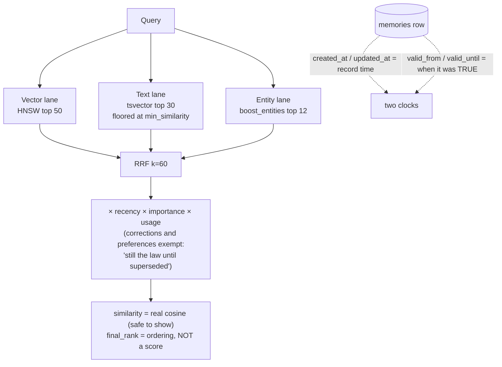

## 1. Executive Summary

This is the smallest system in the atlas that earns two marks: 898 lines total,
of which 551 are SQL and 257 are a JavaScript client. MIT-licensed. There is one
table, five functions, ten indexes, and a set of design decisions argued for in
comments at a density most large systems never reach.

**It has genuine bi-temporal validity**, which a small minority of the systems
here do. `created_at` and `updated_at` are record time; `valid_from` and `valid_until`
are when the fact was true; `expires_at` is a separate hard TTL for ephemeral
rows. `memory_history()` returns all three alongside `superseded_by` and computes
`is_current` as `active AND valid_until IS NULL`, so "what did we believe, and
when was it true" are answerable as different questions.

**The best small decision is a trigger that refuses to fire.** Retrieval stats
are stamped on read, and a naive `BEFORE UPDATE` trigger would let that bump
`updated_at`. The comment states the consequence exactly — *"those touches must
NOT bump updated_at, or 'content last changed' silently becomes 'last read'"* —
and the function returns early when only `access_count` and `last_accessed_at`
moved. A record clock that quietly becomes a usage clock is the kind of corruption
that is invisible until you need the column, and this schema is the only one in
the corpus that defends against it explicitly.

**The gap is the boundary.** `sql/rls.sql` offers two postures. Posture A is
`ALTER TABLE memories ENABLE ROW LEVEL SECURITY` with no policies, so anon and
authenticated roles see nothing and `service_role` bypasses — the enforced
default is "the server sees everything, the browser sees nothing". Posture B is
the per-user version, `owner uuid DEFAULT auth.uid()` with four policies scoped
to `auth.uid() = owner`, and **every line of it is commented out**. Multi-tenancy
is a suggestion in a file, and the `project` column that carries scope in the
functions defaults to `NULL`, which means all projects.

## 2. Mental Model

A memory is a typed row that is true until something supersedes it or its
validity window closes. The nine types — `fact`, `decision`, `event`,
`preference`, `correction`, `conversation`, `pattern`, `learning`, `transcript`
— are a `CHECK` constraint, so the taxonomy is enforced by the database rather
than by convention, and `correction` being a *type* rather than a *state* is the
central design choice. A correction is a new row of a particular kind, not a
change to the row it corrects.

That has a consequence the schema then acts on: corrections and preferences are
exempted from recency decay, with the comment *"still the law until superseded"*.
Everything else decays on a 180-day exponential floored at 0.75. A system that
lets a user's stated preference fall down the ranking for being old has lost the
plot, and this one says so in four words.

There is no trust state. `importance` is 1–10 and feeds ranking; `active` is a
soft-delete flag. Nothing withholds a row from being treated as true.

## 3. Architecture

Supabase, `pgvector` and `pg_trgm`. That is the whole bill, and the schema is
idempotent throughout — `IF NOT EXISTS` and `OR REPLACE` everywhere, documented
as safe to re-run. Embeddings are 1536-dimensional with the model named in a
comment and the two places to change it if you swap models.

Ten indexes: HNSW on the embedding with `m = 16, ef_construction = 64`, GIN on
the generated `content_tsv`, GIN on tags, GIN on `entities` with
`jsonb_path_ops` and a partial predicate, GIN trigram on content, plus B-trees
on project, type, created_at, importance, a partial index on `active`, and a
partial composite on the validity window. For one table that is a considered
index set rather than a reflexive one.

## 4. Essential Implementation Paths

- `sql/schema.sql` (551) — the table, the trigger, and five functions:
  `search_memories`, `find_similar_memory`, `find_snapshot_duplicate`,
  `memory_timeline`, `search_by_entity`, `list_entity_names`, `memory_history`.
- `sql/rls.sql` (36) — two postures, one of them commented out.
- `src/client.js` (257) — `MemoryStore` with `embed`, `extractEntities`,
  `store`, `recall`, `timeline`, `history`.

## 5. Memory Data Model

One row: `id`, `content`, `embedding`, `memory_type`, `project`, `tags`,
`importance`, `source`, `entities` (JSONB `[{name, type}]` extracted at write
time), `metadata`, the four timestamps, `expires_at`, `superseded_by`
(self-referencing FK), `access_count`, `last_accessed_at`, `active`, and a
`GENERATED ALWAYS AS ... STORED` tsvector so the full-text column cannot drift
from content.

`entities` extracted at write and indexed with `jsonb_path_ops` is what makes
the third retrieval lane possible, and `list_entity_names()` builds a vocabulary
of proper-noun-ish names by mention count — filtered to person, project, tool,
company and location, minimum three characters, minimum two mentions — to be fed
back as `boost_entities`. The query side and the write side share a vocabulary
that is derived from the data rather than configured.

## 6. Retrieval Mechanics

`search_memories` is the report's centrepiece and it is 150 lines of carefully
reasoned SQL.

Three lanes. **Vector**: HNSW nearest neighbours, top 50, gated by
`min_similarity`. **Text**: `tsvector` match, top 30, with the tsquery built by
replacing `&` with `|` in `plainto_tsquery` output — the comment explains that
ANDing terms is too strict for natural-language queries and ranking should handle
precision. **Entity**: rows whose extracted entities match the lowercased
`boost_entities`, ordered by importance, top 12, so identity facts surface when
the wording does not match.

They are fused by Reciprocal Rank Fusion with `k = 60`, and then the schema does
something almost nothing else here does — it distinguishes the *score it shows*
from the *score it ranks by*: `similarity` in the result is real cosine
similarity and documented as safe to display, while ordering uses an internal
`final_rank` documented as **not** a match score.

**The best comment in the file guards the text lane.** Rows the vector lane
missed must still clear `min_similarity` before entering, because — quoting the
reasoning — RRF is rank-based rather than score-based, so a lone weak lexical
match on one shared stop-ish word otherwise receives full text-lane credit and
can outrank a genuinely relevant memory. That is a specific, correct failure
mode of RRF, diagnosed and fenced.

Two switches complete it. `use_blended => false` forces every non-semantic
factor to 1.0 for a pure RRF baseline, *"useful for evals/AB"*. `track_access`
defaults to **false** so ad-hoc and eval queries do not pollute usage statistics
— measurement hygiene built into the signature, which no other system in this
atlas offers.

`project` is applied as a filter in every function. It is opt-in rather than
mandatory, which is weaker than the systems that make the scope key a required
argument, but it is genuinely applied on the read path and the mark follows.

## 7. Write Mechanics

The client embeds, extracts entities, then probes twice before inserting.
`find_similar_memory` catches near-identical paraphrases at cosine 0.95 —
**within the same type**, because, as the comment says, a `fact` must not
overwrite a `decision`. `find_snapshot_duplicate` catches what embeddings miss:
"same template, different values" tracker facts where the count changed but the
structure did not, using pg_trgm at 0.65, restricted to `fact` and `pattern`
types, rows over 50 characters, within 60 days.

That second probe is the transferable idea. A memory that says "the queue has
412 items" and one that says "the queue has 903 items" are 0.9-ish in embedding
space and will both persist forever; trigram similarity sees them as the same
sentence and collapses them.

**And when a probe hits, the row is overwritten in place.** The dedup branch is
`.update({content, importance, metadata, tags}).eq("id", dupe.id)` — no new row,
no `valid_until` on the old content, no `superseded_by`, no copy of what was
replaced. The whole bi-temporal apparatus described above is bypassed on the
path the system takes most often, and the replaced wording is gone. That is the
exact cost of the untested 0.95 threshold: a false positive is not a ranking
error, it is a silent destructive edit, and the row that would have recorded it
is the one the update overwrote.

**The supersession sequence is three statements and no transaction.** The client
first sets `active = false, valid_until = now()` on the superseded row, then
inserts the replacement, then sets `superseded_by` on the old row. Each is a
separate PostgREST call. If the insert fails — a bad embedding width, a check
constraint, a dropped connection — the old memory is already deactivated and no
replacement exists: the fact is gone from every read path, and the
`superseded_by` pointer that would let anyone find it was never written. The
schema has everything needed to do this in one statement; the client is where it
comes apart.

Nothing runs in the background. Decay is computed at query time from
`created_at`, expiry is a `WHERE` clause, and there is no sweeper — an expired
row stays on disk and is simply never returned.

## 8. Agent Integration

None. `MemoryStore` is a class with six methods and no framework binding, no
tool schema and no MCP surface. That is a deliberate position — the README's
framing is that you own the SQL and the data — and it means the write policy,
the extraction quality and the decision of when to remember are all the caller's.

## 9. Reliability, Safety, and Trust

**Bi-temporality is real and the mark is earned, with one limit that a second
reading found and the first did not.** `valid_from`/`valid_until` against
`created_at`/`updated_at`, a partial index on the validity window, and
`memory_history()` returning the pair alongside the supersession pointer — the
two axes are separate columns, separately indexed and separately queried.

But **nothing writes `valid_from`.** It is absent from the client's insert
payload and from every `UPDATE` in the repository, so it always holds its
`DEFAULT now()` — the insert time, which is also `created_at`. The one end of
the validity window the code does write is `valid_until`, set to `now()` when a
supersession closes it. So at this commit a fact that was true before it was
written cannot be recorded through the shipped client: you would have to write
the SQL yourself, which the README does tell you to do, but the distance between
"the schema supports it" and "the code that ships with it uses it" is worth
stating. Event time and record time are the same number on every row this client
creates.

**The `updated_at` trigger reaches its stated goal, but not by the route its
comment describes.** The intent — *"Only bump when a real field changed"* — is
delivered by the first branch, which bumps unconditionally whenever the access
counters did *not* change; the careful nine-field list in the second branch runs
only when they did. And the only writer that changes them is
`search_memories`'s `track_access` update, which sets those two columns and
nothing else. So the second branch is reached exactly when none of its nine
fields can have changed, and never fires. The read-touch protection is real; the
field list is decorative, and a genuine no-op `UPDATE` still bumps `updated_at`.

**`scope_enforced` is upheld, and the reason it survives its own default is
worth being precise about.** `filter_project` appears in every read function —
`search_memories`, `find_similar_memory`, `find_snapshot_duplicate`,
`memory_timeline`, `memory_history` — always as
`AND (filter_project IS NULL OR m.project = filter_project)`, and the client
passes it through on all four of its read methods. The key reaches the query on
every path, which is what the mark certifies. It defaults to `NULL`, meaning all
projects, and a caller who omits it gets the whole table — but that is a caller
widening its own scope by passing an argument, which the capability's definition
explicitly does not rule on. What would lose the mark is a read path with no
project parameter at all, or one that silently retries unscoped after an empty
scoped result. Neither happens here. The boundary that is *not* enforced is the
other one: with RLS commented out, nothing stops one caller from passing another
caller's project name.

**No tombstone.** `superseded_by` is a foreign key to the replacing row, so the
chain is keyed on the record. A later write of the same rejected content — from
a fresh extraction, or a different agent — passes the 0.95 dedup probe only if
the wording is nearly identical, and otherwise inserts cleanly with nothing to
consult.

**No audit log and no human review surface.** The `updated_at` trigger knows
which fields changed and could write a row saying so; it returns instead.

**The RLS situation is the risk worth stating plainly.** The file is honest —
it warns that the table *"holds whatever your agent remembers, which is often
sensitive"*, says never to expose it to anon or authenticated roles without
policies, and notes that `service_role` bypasses RLS by design. But a reader who
runs `rls.sql` as shipped gets Posture A, and the per-user isolation is 12
commented lines below it. For a schema whose distribution channel is "paste this
into the Supabase SQL editor", the default posture is the one that ships.

## 10. Tests, Evals, and Benchmarks

**There are none.** No test directory, no fixtures, no eval harness, no
benchmark, and no published numbers. For 898 lines that is defensible in a way
it would not be at ten times the size — but the `use_blended` and `track_access`
switches exist specifically to make evaluation clean, so the apparatus for
evaluation is present and the evaluation is not.

The absence is most costly at the two dedup thresholds. 0.95 cosine and 0.65
trigram are the numbers that decide whether a real distinction gets collapsed
into an existing row, and nothing measures either — and, as section 7 sets out,
a collapse overwrites the row in place, so a wrong threshold does not degrade a
result set, it deletes a memory.

The negative claim was re-checked at this revision: `git ls-files` returns nine
files, none of them a test, and `package.json` declares no test script and no
test dependency. The 898 lines are `sql/schema.sql` (551), `src/client.js`
(257), `examples/quickstart.js` (54) and `sql/rls.sql` (36).

## 11. For Your Own Build

### Steal

- **Keep validity time and record time in the same row.** Four columns and one
  partial index buys the answer to "what did we believe last March" that most of
  this atlas cannot give.
- **Make your `updated_at` trigger refuse to fire on reads.** If you stamp
  access statistics, a naive trigger converts your content clock into a usage
  clock silently and permanently.
- **Separate the score you show from the score you rank by.** Real cosine
  similarity in the result, RRF `final_rank` for ordering, both documented. A UI
  that displays a fusion rank as a confidence is lying.
- **Floor your rescue lane.** If you fuse by rank, a weak match in a secondary
  lane gets full credit for its rank. Require it to clear a semantic threshold
  before it enters the pool.
- **Dedup by structure as well as by embedding.** Trigram similarity catches the
  evolving-tracker duplicates that sit just under any embedding threshold.
- **Dedup within a type, never across.** A fact overwriting a decision is a
  category error your similarity function cannot see.
- **Exempt corrections and preferences from decay.** They are the law until
  superseded, and ranking them down by age is the wrong default.
- **Ship an eval switch.** `use_blended => false` and `track_access => false`
  cost nothing and make an A/B honest.

### Avoid

- **Shipping the multi-tenant policy commented out.** The posture that runs is
  the posture that ships, and "server sees everything" is a real choice that
  should be made rather than defaulted into.
- **A scope column that defaults to NULL.** `filter_project IS NULL OR ...`
  means an unscoped read is the easiest read to write.
- **Thresholds nobody measured.** 0.95 and 0.65 decide what gets collapsed, and
  a schema with no tests cannot tell you when they are wrong.

### Fit

This is the right starting point if you are on Supabase, you want to own the
SQL, and your memory is one project or one user. It is better reasoned per line
than most of the frameworks in this atlas, and a competent engineer can read all
of it in an hour — which is itself a governance property.

It is the wrong choice as a multi-tenant service without first uncommenting and
testing Posture B, and it is the wrong choice if you need to prove a deletion:
soft delete plus supersession means the content is still in the table, and there
is no record that a value was ever rejected.

## 12. Open Questions

- **How often does the 0.65 trigram probe collapse two things that differed?**
  It is restricted to `fact` and `pattern` and to 60 days, which suggests the
  author found it too aggressive somewhere and fenced it. Nothing records where.
- **Does anyone run Posture B?** The commented block adds a column with a
  default of `auth.uid()`, which will be NULL for existing rows written by the
  service role — so enabling it on a live table silently orphans everything
  already stored.
- **What does the entity extractor cost and how good is it?** It runs client
  side per write, and the third retrieval lane depends entirely on it.

## Appendix: File Index

| Path | Lines | What it holds |
| --- | --- | --- |
| `sql/schema.sql` | 551 | The table, ten indexes, the trigger, seven functions |
| `src/client.js` | 257 | `MemoryStore` — embed, extract, store, recall, timeline, history |
| `examples/quickstart.js` | 54 | The worked example |
| `sql/rls.sql` | 36 | Posture A enabled, Posture B commented out |

## Appendix: Recorded Searches

Checked against the repository tree at the pinned revision, without a clone.
The command is the check that was actually run, not a local equivalent.

| Claim | Check | Result at this pin |
| --- | --- | --- |
| No test file exists anywhere in the tree | `GET /repos/<owner>/<repo>/git/trees/<this revision>?recursive=1`, filtered for `tests?/`, `__tests__/`, `test_*`, `*_test.*` and `*.test.*` | Nothing. The whole repository is 9 blobs. |

## History

**2026-09-18** — [`b711e6d76009d0713c5d5c211c2ab5c83d01ca53`](https://github.com/reescalder/agent-memory-supabase/commit/b711e6d76009d0713c5d5c211c2ab5c83d01ca53) — re-read at the same commit. Nothing upstream had moved, so every finding here is the atlas's own, and the previous reading's code claims all held; what it had not done was trace each field to its writer. Doing that produced three findings. `valid_from` has no writer anywhere in the repository, so the validity axis the report praises collapses onto the record axis for every row the shipped client creates — the mark stands on the schema and the `memory_history()` reader, with that limit now in its evidence record. The dedup branch overwrites the matched row in place, with no supersession and no copy of the replaced content, so the untested 0.95 threshold is a data-loss knob rather than a ranking one. And the supersession sequence deactivates the old row before inserting its replacement across three untransacted calls, so a failed insert loses the memory with no pointer left to find it by. The `updated_at` trigger reaches its stated goal by its first branch; its nine-field list is only reached on access-counter updates, where none of those fields can have changed. Both marks now carry evidence records, and `scope_enforced` is upheld with its reasoning written down: the key reaches every read query, and the NULL default is a caller widening its own scope, which the capability does not rule on. `stack_source` goes from seeded to reviewed.

**2026-07-30** — [`b711e6d76009d0713c5d5c211c2ab5c83d01ca53`](https://github.com/reescalder/agent-memory-supabase/commit/b711e6d76009d0713c5d5c211c2ab5c83d01ca53) — first reading.
