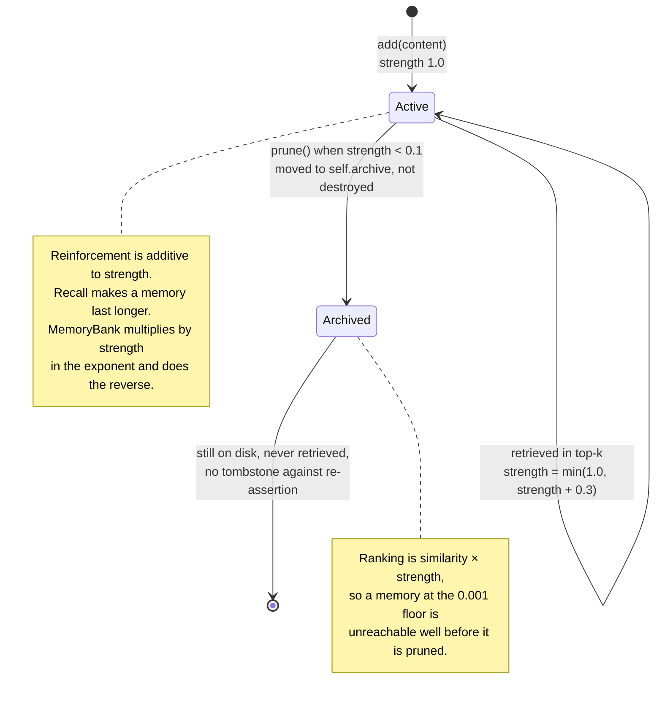

## 1. Executive Summary

This is a cookbook, not a product: thirty Jupyter notebooks, 14,277 lines of
runnable Python between them, each implementing one memory technique from
scratch and explaining it. Apache-2.0. It is the most-read teaching artifact for
agent memory, and its class names — buffer, sliding window, summary buffer,
entity, episodic, semantic, procedural — are the vocabulary most people bring to
the subject.

It qualifies for this atlas on the ordinary test rather than on influence.
Notebook 21 writes session state to SQLite and reloads it in a new process;
notebook 06 persists to Chroma; a dozen others `json.dump` a store to disk. What
is stored is retrieved later, scoped, corrected and forgotten, and the code that
does it is inspectable at a pinned commit. What it is not is deployable: there
is no package, no API, no tests, and the README says plainly that it "is not
production-ready software".

Three things make it worth reading against the production systems it teaches.

**Its forgetting curve is right, and the paper it teaches got it wrong.**
Notebook 19 sets `decay_rate = math.log(2) / half_life_hours` and computes
`strength * math.exp(-decay_rate * hours_idle)` with a floor — a parameterization
where the tunable is a half-life in hours, which is the number an operator can
actually reason about. [MemoryBank](../memorybank/), the paper that put the
Ebbinghaus curve into agent memory and which this repository cites, ships
`math.exp(-t / 5*S)`, which multiplies by strength instead of dividing and so
forgets reinforced memories fastest. The cookbook also archives what it prunes
instead of popping it out of the only copy. On the mechanism they share, the
teaching implementation is the better one.

**Its deletion is a fan-out with a receipt.** Notebook 30's `delete_user` calls
`delete_user` on the hot cache, the warm vector store, the cold archive and the
relationship graph, collects a count from each, appends four audit entries with
timestamps, and returns the totals. Deletion that names every store it has to
reach and reports what it removed from each is rarer in this atlas than in a
tutorial, and most of the production systems here do not do it.

**Its contradiction metric is broken in an instructive way.** Notebook 28's
`ContradictionDetector.scan` batches memories fifteen at a time to control cost,
finds contradictions only *within* each batch, and then divides by
`n * (n-1) / 2` — every pair in the corpus, including the overwhelming majority
it never looked at. For a hundred memories the denominator is 4,950 and roughly
735 pairs were examined, so the reported rate is understated about sevenfold, and
the understatement grows with the corpus. A metric that structurally trends to
zero as you store more is the specific failure a memory dashboard cannot afford.

The other consistent weakness is that thirty notebooks written independently
disagree with each other. Only the production notebook enforces a user scope on
the read path; the teaching stores mostly have no tenant concept at all, and a
reader lifting notebook 06 into a multi-user product inherits that.

## 2. Mental Model

There is no single memory unit here, and that is the design. Each notebook picks
the unit its technique needs — a raw turn, an extracted fact, an entity summary
maintained by an LLM, a typed graph edge, a timestamped episode, a
strength-weighted decaying record, a tiered `MemoryRecord` with an access count.
The corpus is a survey of units rather than a system with one.

What the notebooks do share is a lifecycle, and it is most completely expressed
in notebook 19, which is where the epistemics live:

```text
add(content)          -> strength 1.0, created_at = last_accessed = now
search(query)         -> decay_all() first: strength *= exp(-ln2/half_life * idle_hours)
                      -> rank by similarity * strength
                      -> reinforce top-k: strength = min(1.0, strength + 0.3)
prune()               -> strength < 0.1  ->  archived = True, moved to self.archive
                                             (kept, not destroyed)
```

Two properties of that follow from the maths and are worth stating because they
are what most decay implementations get wrong. Exponential decay is memoryless,
so applying it in increments on every search gives the same strength as applying
it once over the whole idle interval — the result does not depend on how often
you sweep. And reinforcement is *additive to strength*, capped at 1.0, so
recalling something makes it survive longer. Both are the opposite of
[MemoryBank](../memorybank/)'s behaviour.

The system treats memory as ground truth with a weight. Nothing here has a
status: no candidate, no verified, no rejected. Strength is a float that decides
ranking and survival, not a claim about whether the content is true. Notebook 28
adds the only epistemic judgement anywhere in the corpus, and it is *post hoc* —
a `FaithfulnessJudge` scoring whether a response was supported by the memories
it was given, and a `ContradictionDetector` scanning the store for incompatible
pairs. Neither writes anything back. Contradictions are reported, never resolved.

The one field worth flagging as overloaded: `apply_decay` sets
`memory.last_accessed = now`, so after any sweep the field named "last accessed"
means "last decayed". `idle_hours()` still documents itself as hours since last
access. The arithmetic is unaffected, but the field cannot be read as an access
timestamp by anything downstream.



## 3. Architecture

Thirty directories under `all_techniques/`, each holding one notebook and one
`readme.md`, plus:

- `utils/helpers.py` — environment loading, LLM clients, cosine similarity,
  token counting. The only shared code.
- `utils/validate_cells.py` and `validate_style.py` — a notebook cell-structure
  validator and a prose-style validator, run in CI.
- `tests/` — pytest smoke tests.
- `docs/` — `architecture.md`, `comparison.md` (a 30-row side-by-side),
  `glossary.md`, `topics.md`, `FAQ.md`, `CONTENT_STANDARDS.md`.
- `data/` — small sample datasets.

There is no package and nothing importable. Every notebook is self-contained by
design, which is right for teaching and means the corpus contains, for instance,
four separate cosine-similarity implementations and several incompatible
`MemoryRecord` dataclasses.

Runtime shapes vary by notebook. Most are in-process: dicts, lists, dataclasses.
The durable ones are notebook 21 (`sqlite3` behind an abstract `StorageBackend`
with `save`/`load`/`delete`/`list_users`, plus a pickle backend), notebook 06
(Chroma), and the dozen that `json.dump` to a file. Notebook 30 builds the
largest single structure: a `TieredMemorySystem` composing a `HotTierCache`
(LRU with TTL), a `WarmTierStore` (a pgvector stand-in with a per-user index), a
`ColdTierArchive` (compressed), a `GraphRelationshipStore` (adjacency list with
BFS), a `PIIHandler` and a cost tracker.

Notebooks 24 through 27 are the only ones that talk to a real external system —
Graphiti against Neo4j, Mem0, Letta and Zep Cloud — and each of those four is a
client walkthrough rather than an implementation.

### Deployment and ergonomics

- **What has to be running:** nothing, plus an API key. Every notebook asserts
  `OPENAI_API_KEY` or `ANTHROPIC_API_KEY` at the top; notebook 24 additionally
  needs Neo4j, and 25 through 27 need vendor accounts.
- **Everything else is local and in-process.** Chroma and FAISS run embedded;
  SQLite is a file.
- **The stores are human-readable** — JSON files and a two-column SQLite table.
- Install is `pip install -r requirements.txt` and `jupyter notebook`. The
  requirements file pins nothing: nineteen packages at any version, including
  `langchain`, `openai`, `anthropic` and `chromadb`.
- **The dependency surface is the real cost.** A tutorial whose install is
  nineteen floating requirements is a tutorial that will break, and this one
  spans LangChain, LlamaIndex, Chroma, FAISS, sentence-transformers, `mem0ai`
  and `letta-client`.

The screen of this checkout found no auto-run surfaces, one build-time execution
point (`tests/conftest.py`, which runs on pytest collection) and nineteen
unpinned requirements across three scanned files. Nothing was installed and
nothing was run; the notebooks were read as source.

## 4. Essential Implementation Paths

Notebook numbers are directory prefixes under `all_techniques/`.

- **Decay and reinforcement** — `19_forgetting_and_decay`: `DecayableMemory`,
  `DecayEngine.compute_decay`, `apply_decay`, `reinforce`,
  `ForgettingMemoryStore.search`, `decay_all`, `prune`,
  `apply_storage_pressure`.
- **Cross-session persistence** — `21_cross_session_memory`: `SessionState`,
  the abstract `StorageBackend`, `SQLiteBackend` with its `session_state` table,
  `CrossSessionManager.resume_session` / `end_session` / `_cold_start` /
  `_apply_loading_strategy`, and `extract_facts` / `summarize_conversation`.
- **Tiered storage and lifecycle** — `30_production_memory_patterns`:
  `MemoryTier`, `MemoryRecord.is_expired` / `touch`, `HotTierCache`,
  `WarmTierStore.search`, `ColdTierArchive`, `TieredMemorySystem.run_maintenance`.
- **Deletion fan-out** — `30_production_memory_patterns`:
  `TieredMemorySystem.delete_user`, with `delete_user` on each of the four
  stores and `PIIHandler.log_deletion` writing the audit entries.
- **Evaluation** — `28_memory_evaluation`: `recall_at_k`, `precision_at_k`,
  `mean_reciprocal_rank`, `FaithfulnessJudge.score`, `temporal_accuracy_score`,
  `ContradictionDetector.scan`, and `MemoryEvalHarness.run` which assembles the
  report.
- **Entity extraction and summary maintenance** — `07_entity_memory`.
- **Graph memory** — `08_knowledge_graph_memory` (NetworkX) and the
  `GraphRelationshipStore` in notebook 30 (adjacency list plus BFS).
- **Retrieval strategy comparison** — `20_memory_retrieval_patterns`: semantic,
  recency, hybrid scoring, diversity and re-ranking, side by side.
- **Memory as tools** — `23_memory_with_tools`: save, search and forget exposed
  as model-callable tools.
- **Benchmark harness** — `29_memory_benchmarks_LoCoMo`, against LoCoMo and
  LongMemEval.
- **Framework walkthroughs** — `24_graph_memory_graphiti`, `25_mem0_patterns`,
  `26_letta_memgpt_patterns`, `27_zep_memory`.

## 5. Memory Data Model

There are as many schemas as notebooks. Two are load-bearing.

`DecayableMemory` (notebook 19): `content`, `embedding`, `strength`,
`access_count`, `created_at`, `last_accessed`, `memory_id` (a UUID), `archived`.
This is the cleanest unit in the corpus — a stable id, two timestamps, a
usage counter and an explicit archived flag — and the one most worth copying.

`MemoryRecord` (notebook 30) adds `user_id`, a `tier` enum, `ttl`,
`compressed_bytes` and an access count, with `is_expired()` and `touch()` on it.

`SessionState` (notebook 21) is the durable one: persisted as JSON in a SQLite
`session_state` table keyed by `user_id`, holding facts, a summary and session
metadata, behind an abstract backend with SQLite and pickle implementations.

**Scoping is the corpus's least consistent dimension, and the inconsistency is
worth naming because a reader copies one notebook at a time.** Notebook 30
carries `user_id` on every record, maintains a `user_index: dict[str, set[str]]`,
and `WarmTierStore.search(user_id, query_embedding, k)` takes the scope as a
required first argument and iterates only that user's ids — a real filter on the
read path, which is what earns `scope_enforced`. Notebook 21 keys everything by
`user_id` in SQL. Most of the rest — the decay store, the episodic store, the
semantic store, the vector store — have no tenant concept at all, and their
`search` is over everything they hold. That is the correct simplification for a
lesson about decay and a silent bug in a product.

Temporal fields are `created_at` and `last_accessed`, both record time. Nothing
tracks when a fact was true of the world, so `bitemporal` is withheld. There is
no version, no correction chain and no supersession link; notebook 28 can
*detect* that two memories contradict and there is nowhere to write the
resolution.

## 6. Retrieval Mechanics

Cosine similarity is the default everywhere, over OpenAI embeddings or
sentence-transformers. Notebook 20 is the exception and the one to read: it
implements and compares five strategies on the same data — pure semantic,
recency-ordered, hybrid scoring, diversity (MMR-style), and re-ranking — which
is a side-by-side almost no production repository in this atlas offers, because
production repositories ship the one they chose.

Two ranking ideas recur and both are good.

`combined = similarity * strength` in notebook 19 makes decay a *retrieval*
mechanism rather than only a storage one: a memory at the 0.001 floor is
effectively unreachable long before `prune()` archives it. The consequence worth
seeing is that the prune threshold is not the forgetting boundary — the ranking
is. A memory can be present, unarchived and permanently invisible.

The tiered read in notebook 30 checks the hot cache, falls through to the warm
vector store, and promotes what it finds — a cache hierarchy with a hit rate
counter, which makes cost legible in a way the other notebooks do not attempt.

Graph retrieval appears twice: NetworkX traversal in notebook 08 and a
hand-rolled `get_neighbors` BFS over an adjacency dict in notebook 30. The
latter has a small asymmetry worth noting for anyone lifting it — `add_edge`
indexes only `edge.source`, so traversal follows edges forwards only, and an
entity that is never a source is unreachable.

Token budgeting appears in notebooks 05, 12 and 15 and is the honest part of the
window-management group: `estimate_tokens`, eviction by priority, and pinning.

## 7. Write Mechanics

Every write in the corpus is synchronous and explicit. Nothing is queued,
nothing is deferred, and nothing runs in a background thread — the "background"
technique, notebook 14's consolidation, is a function you call. Lag before a
memory is retrievable is zero everywhere.

Extraction is a direct LLM call per write in the notebooks that do it — notebook
07 extracts entities and rewrites each entity's summary, notebook 21's
`extract_facts` pulls facts from a session at its end, notebook 10 derives
semantic facts from episodes. Costs are therefore per-turn and unbatched, which
is correct for a lesson and would not survive a product.

Consolidation (notebook 14) and compaction (notebook 15) are full-store passes:
merge, deduplicate, summarize, distil. Both re-read everything they are given,
so the token bill scales with the corpus rather than with the day's activity —
stated here because the notebooks demonstrate the pattern without pricing it.

**Deletion is the strongest part of the corpus.** Three distinct semantics
appear, and the distinction between them is exactly the one this atlas keeps
asking systems to draw:

- *Archival* (notebook 19): `prune()` sets `archived = True` and moves the record
  to `self.archive`. Nothing is destroyed, and a mistaken prune is recoverable.
- *Expiry* (notebook 30): a TTL on the hot tier, checked by `is_expired()` and
  swept by `run_maintenance`.
- *Erasure* (notebook 30): `TieredMemorySystem.delete_user` calls `delete_user`
  on the hot cache, the warm store, the cold archive **and** the relationship
  graph, sums the counts, and writes one audit entry per tier.

That fan-out is the pattern to steal. The graph store rebuilds its adjacency
index after filtering rather than leaving stale entries, and it filters on
`e.user_id`, so an edge is removed whether the erased user is its source or its
target — the direction asymmetry that catches most graph deletions is not
present here.

What none of the three has is a tombstone. An archived or erased memory leaves
no record that the value was rejected, so the extraction path can re-derive it
from the same source on the next run. `tombstone` is withheld.

## 8. Agent Integration

There is none, and there is not meant to be. No package, no API, no MCP server,
no framework adapter — thirty notebooks and a helpers module.

Notebook 23 is the closest thing to an integration pattern, exposing `save`,
`search` and `forget` as model-callable tools, which is where the model gets the
most agency in the corpus. Everywhere else memory is application-driven: the
notebook retrieves, formats and injects, and the model is handed a context block.

The value for an adopter is per-notebook lift, and the corpus is structured for
it — each is self-contained, each has a README, and `docs/comparison.md`
tabulates all thirty by persistence, retrieval style, token cost and best-for
use case, which is the right index for someone deciding what to copy.

The one thing a reader should not lift wholesale is the taxonomy. Six of the
thirty — the five short-term techniques and notebook 12's working memory — are
conversation-window management: they decide which messages stay in the current
context and nothing survives the process. They are filed under "memory" in the
family table, and that naming is where a good deal of this field's confusion
about the word comes from.

## 9. Reliability, Safety, and Trust

Provenance is thin. Records carry a UUID and timestamps; nothing links an
extracted fact back to the turn it came from, so a wrong fact cannot be traced
to its source. Notebook 09's episodes are the exception, keeping the interaction
whole with its when-and-where context.

There is no trust state anywhere, and no way to mark a memory unverified. The
faithfulness judge in notebook 28 scores a *response* against the memories it
was given — a grounding check, not a check on whether the memory is true — and
writes nothing back.

**The contradiction metric is the reliability finding.** `ContradictionDetector.scan`
splits the store into batches of fifteen, asks a model to find contradicting
pairs within each batch, and computes:

```python
n_pairs = len(memories) * (len(memories) - 1) // 2
return {"contradiction_rate": len(all_contradictions) / max(n_pairs, 1), ...}
```

Contradictions can only be found within a batch — roughly `ceil(n/15) × 105`
pairs — while the denominator is every pair in the corpus. At a hundred
memories that is 735 pairs examined against 4,950 counted. The rate is therefore
not a rate of anything: it falls linearly as the store grows even if the true
contradiction density is constant, so a dashboard built on it reports
*improving* consistency as the memory fills with conflicts. Nothing sorts or
clusters before batching either, so which pairs get compared is an accident of
insertion order. The docstring is candid that batching is a cost control; the
denominator is the part that does not follow.

The PII handling in notebook 30 is regex-based — email, phone, SSN, credit card,
IP — with `redact()` substituting placeholders, and it names Presidio as the
production replacement rather than pretending five patterns are sufficient.

The deletion audit log is real: append-only, one entry per tier per erasure,
with an ISO timestamp and a count, which is what earns `audit_log`. Two
qualifications. It records deletions only, not writes or updates, so it is a
compliance record rather than a full mutation history. And it stores the erased
`user_id` in a log that outlives the erasure — defensible, since a right-to-be-forgotten
record has to identify what was forgotten, but a reader copying it should decide
that on purpose rather than inherit it.

No auth, no multi-tenancy enforcement outside notebook 30, no concurrency
control anywhere, and no injection defence: whatever the conversation contains
becomes memory.

## 10. Tests, Evals, and Benchmarks

`tests/` holds pytest smoke tests, and CI runs `utils/validate_cells.py` (a
notebook cell-structure validator) and `utils/validate_style.py` (a prose-style
validator). **There are no tests of any memory behaviour.** Nothing asserts that
decay is monotonic in idle time, that reinforcement raises strength, that
`delete_user` empties every tier, or that a resumed session sees what the
previous one wrote — all of which are one-line assertions against code that is
already written.

That absence is worth measuring against what the corpus itself teaches. Notebook
28 is an evaluation harness with `recall_at_k`, `precision_at_k`, MRR, a
faithfulness judge, a temporal-accuracy score and the contradiction scan,
assembled by `MemoryEvalHarness.run` into a report — and it is never pointed at
the twenty-nine other notebooks. The measuring apparatus and the things to
measure are in the same repository and are not connected.

`temporal_accuracy_score` deserves specific credit and a specific withholding.
It takes eval cases carrying a `temporal_preferred` id and checks that the
superseding fact outranks the fact it supersedes — a committed assertion about
what retrieval must *not* put first, which is closer to a negative evaluation
than almost anything in this atlas. It is not the `negative_eval` mark, because
it asserts a relative rank rather than an absence: a superseded fact may still
be retrieved, just not ahead of its replacement. That is a weaker and arguably
more useful test, and it is withheld from the mark and named here instead.

Notebook 29 runs LoCoMo and LongMemEval. No results are committed — no run
output, no scores, no `experiments/` directory — so the harness is a template
rather than evidence. Compare [Zep](../zep/), which commits fifty runs of the
same benchmark with per-run variance.

Before trusting any of this in a product, the tests to write are the ones the
notebooks make cheap: a monotonicity assertion on `compute_decay`, a
round-trip assertion on `SQLiteBackend`, and a fan-out assertion that after
`delete_user` every tier returns zero for that user.

## 11. For Your Own Build

### Steal

**Parameterize decay by half-life, not by a rate constant.**
`decay_rate = math.log(2) / half_life_hours` makes the tunable a number an
operator can defend — "a memory nobody touches is half as findable after a
week". A raw lambda is a number nobody can argue about, and it is how decay
implementations end up pointing the wrong way.

**Archive what you prune.** `archived = True` plus a move to a separate list
costs nothing and turns an irreversible policy decision into a reversible one.
Compare the alternative in [MemoryBank](../memorybank/), where the same
threshold pops the record out of the only copy.

**Multiply relevance by strength at rank time.** Decay that only governs
eventual deletion leaves stale memories fully retrievable until the sweep runs.
`similarity * strength` makes forgetting gradual and continuous, and the prune
threshold becomes garbage collection rather than policy.

**Make deletion a fan-out that names every store, and have it return counts per
store.** Four stores, four `delete_user` calls, four numbers, four audit
entries. The counts are what make an erasure claim checkable, and enumerating
the stores in one function is what stops a new store from being quietly missed.

**Grade retrieval order against supersession, not just retrieval membership.**
An eval case that says "this newer fact must rank above the older one it
replaces" catches the failure that recall@k cannot see, and costs one extra
field on the case.

**Ship the strategy comparison you did not choose.** Notebook 20 implements five
retrieval strategies side by side on one dataset. Keeping the rejected options
runnable is how a later reader — including a later you — can re-decide.

### Avoid

**Do not divide by pairs you did not compare.** If cost forces you to sample,
the denominator is the sample, not the population. A rate whose denominator
grows faster than its measurement window reports improvement as the problem gets
worse, which is worse than reporting nothing.

**Do not let one field mean two things.** `last_accessed` updated by the decay
sweep is no longer an access timestamp, and anything downstream that reads it as
one — a recency ranker, an idle-session report — is now wrong in a way no test
will catch.

**Do not index a graph edge only by its source.** Forward-only adjacency makes
half your relationships invisible to traversal, and the symptom is missing
recall rather than an error.

**Do not call conversation-window management memory.** Buffers, sliding windows
and token trimming decide what is in the prompt right now; none of it survives
the process, and filing them under the same word as a durable store is how a
reader ends up believing their agent remembers.

**Do not ship an eval harness you never point at your own system.** Having the
metrics and not running them is more misleading than not having them, because
the repository looks measured.

### Fit

Read this if you are about to build a memory layer and want thirty
implementations of the decisions you are facing, each small enough to read in
one sitting and licensed to copy. It is the best orientation material in this
atlas, and notebooks 19, 20, 28 and 30 are worth reading even if you have
already built something.

Do not deploy any of it. Nineteen unpinned dependencies, no tests of memory
behaviour, no scoping outside two notebooks, and no packaging — the repository
says so itself, and the honest use is as a source of patterns rather than code.

The reader who should be most careful is the one lifting a single notebook into
a product. The corpus is internally inconsistent by construction: notebook 30
enforces a user scope and notebook 06 has no tenant concept, and nothing in
either warns you which one you picked.

## 12. Open Questions

- Was the `n_pairs` denominator in `ContradictionDetector.scan` intended as an
  upper bound on possible pairs rather than as the divisor for a rate? The
  docstring explains the batching and not the arithmetic.
- Does `apply_decay` overwrite `last_accessed` deliberately, to make the
  incremental sweep self-contained, or is the field's dual meaning accidental?
- Is the forward-only adjacency in `GraphRelationshipStore.add_edge` a
  simplification for the lesson? `get_neighbors` reads as though it expects a
  full traversal.
- Were the LoCoMo and LongMemEval harnesses in notebook 29 ever run? No output
  is committed, and the README does not report a score.
- Does the CI style validator check the notebooks' claims about each other —
  for instance, that a notebook citing MemoryBank's forgetting curve implements
  a different one? The two are both correct choices and the divergence is
  unremarked.

## Appendix: File Index

**Decay and forgetting**

- `all_techniques/19_forgetting_and_decay/forgetting_and_decay.ipynb` — `DecayableMemory`, `DecayEngine`, `ForgettingMemoryStore`, `prune`, `apply_storage_pressure`.

**Durable storage**

- `all_techniques/21_cross_session_memory/cross_session_memory.ipynb` — `SessionState`, `StorageBackend`, `SQLiteBackend`, `CrossSessionManager`.
- `all_techniques/06_vector_store_memory/vector_store_memory.ipynb` — Chroma and FAISS persistence.

**Production patterns**

- `all_techniques/30_production_memory_patterns/production_memory_patterns.ipynb` — `MemoryTier`, `HotTierCache`, `WarmTierStore`, `ColdTierArchive`, `GraphRelationshipStore`, `PIIHandler`, `TieredMemorySystem.delete_user`, `run_maintenance`.

**Evaluation**

- `all_techniques/28_memory_evaluation/memory_evaluation.ipynb` — `recall_at_k`, `precision_at_k`, `mean_reciprocal_rank`, `FaithfulnessJudge`, `temporal_accuracy_score`, `ContradictionDetector`, `MemoryEvalHarness`.
- `all_techniques/29_memory_benchmarks_LoCoMo/memory_benchmarks_locomo.ipynb` — LoCoMo and LongMemEval runners, no committed results.

**Extraction and structure**

- `all_techniques/07_entity_memory/`, `08_knowledge_graph_memory/`, `09_episodic_memory/`, `10_semantic_memory/`, `11_procedural_memory/`, `14_memory_consolidation/`.

**Retrieval**

- `all_techniques/20_memory_retrieval_patterns/memory_retrieval_patterns.ipynb` — five strategies compared.
- `all_techniques/17_memory_routing/`, `18_temporal_memory/`.

**Window management (out of scope, listed for the boundary)**

- `all_techniques/01_conversation_buffer_memory/` through `05_token_buffer_memory/`, and `12_working_memory_context_window/`.

**Framework walkthroughs**

- `all_techniques/24_graph_memory_graphiti/`, `25_mem0_patterns/`, `26_letta_memgpt_patterns/`, `27_zep_memory/`.

**Shared and meta**

- `utils/helpers.py`, `utils/validate_cells.py`, `utils/validate_style.py`.
- `docs/comparison.md` — all thirty techniques by persistence, retrieval style and token cost.
- `tests/` — smoke tests; no memory-behaviour assertions.

## History

**2026-08-14** — [`b4b277097cf83ae56021c14eab6f7a3d63dc905f`](https://github.com/NirDiamant/Agent_Memory_Techniques/commit/b4b277097cf83ae56021c14eab6f7a3d63dc905f) — first reading. Screened before opening: no auto-run surfaces, one build-time execution point (`tests/conftest.py`), nineteen unpinned requirements. Nothing was installed and no notebook was executed; the code was read by extracting the cells as source.
