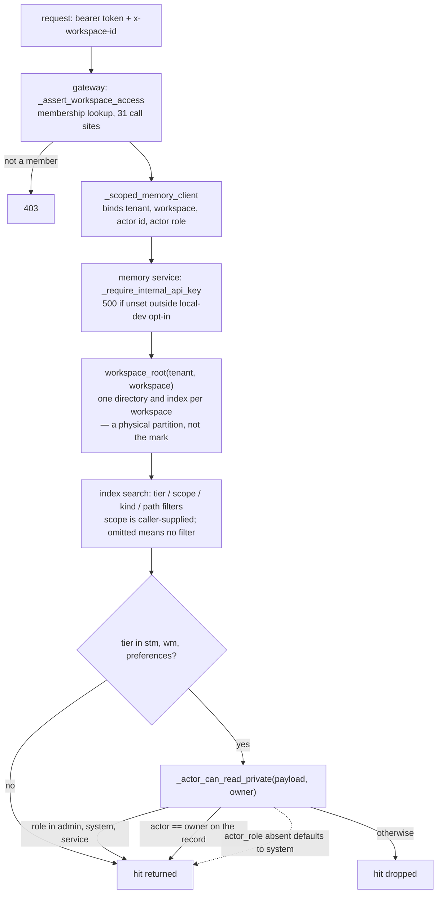

## 1. Executive Summary

Agent-MemoryForge is a memory plane rather than an agent framework — MIT, about
42,300 lines of Python — that sits under LangChain, LangGraph, AutoGen, CrewAI
or a custom loop and gives them tenant-isolated, tiered, searchable memory
behind an authenticated REST API. The README is unusually clear about what it is
not trying to be, and the code matches that framing: there is a gateway, a
memory service, an SDK, an MCP server, an operator portal, quota accounting and
a distillation worker, and no agent runtime anyone is obliged to adopt.

The storage design is the part worth copying. Memory is files first — Markdown
in a per-workspace directory tree — with SQLite as a rebuildable index carrying
FTS5 and a vector table, and `_rebuild_index_from_workspace` to reconstruct it
from the files. That inverts the usual arrangement, where the database is
authoritative and the export is a convenience, and it means an operator can read
the memory with `cat`.

Three boundaries stack, and the report's value is in separating them, because
only one is this atlas's `scope_enforced` mark. The tenant and workspace
boundary is a *physical partition*: `workspace_root(tenant_id, workspace_id)`
gives each workspace its own directory and its own index. The `scope` column on
the index — `project`, `user`, `session` — is a *caller-supplied facet* that
applies no filter at all when the request omits it. The mark is earned by the
third: `_PRIVATE_TIERS` (`stm`, `wm`, `preferences`) are filtered per hit against
an owner id read off the record, at six separate read sites.

That third boundary is also where the finding is. The predicate is:

```python
def _actor_role(payload): return str(payload.get("actor_role") or "system").strip().lower() or "system"
_PRIVILEGED_ACTOR_ROLES = {"admin", "system", "service"}
```

An absent `actor_role` becomes `system`, and `system` is privileged. A request
that simply omits the field passes every private-tier check and reads every
user's short-term memory, working memory and preferences in the workspace. The
default is the permissive one, which is the inverse of how the rest of this
repository is built — the same service refuses to start without an internal API
key unless an explicit local-dev variable is set, and compares that key with
`hmac.compare_digest`.

Three marks: `scope_enforced`, `audit_log` and `negative_eval`. `audit_log` is
earned with its durability stated, because the durable backend is off by
default. `trust_state`, `tombstone`, `bitemporal` and `human_review` are
withheld on searches recorded in the appendix.

## 2. Mental Model

Memory here is tiered by how long it should live and who it belongs to, not by
how confident anyone is that it is true. A conversation produces a short-term
summary (`stm`). A task carries working-memory state (`wm`). A user accumulates
preferences. A distillation worker turns conversations into semantic facts and
business decisions that outlive both.

Nothing in that pipeline records an epistemic judgement. A distilled fact is
written as a file and indexed; if it is wrong, the correction is another write,
and the two sit beside each other ranked by relevance. Working memory has a
lifecycle — items move to done or cancelled and the context builder stops
injecting them, with the comment that they are "preserved for audit but not"
injected — but that is task state, not a claim about truth.

What the system does model carefully is *who may see what*, and it models it
three times at three different levels. Understanding which level catches which
threat is the whole of using this safely.



## 3. Architecture

Two services and a portal. The gateway (`agent_runtime/product/gateway`) holds
authentication, workspace membership, quota accounting and the chat path; the
memory service (`agent_memory_service`) holds the store and the index and is
reachable only with an internal API key. The portal is a React app over
gateway routes, and `agent_memory_lib` is the SDK both the gateway and external
callers use.

The store is the `file_first` backend. Each tenant and workspace gets a
directory under `~/.agent_memory_service/workspaces`, and inside it the tiers are
directories of Markdown. `index_sqlite.py` keeps `docs` — path, entry id, tier,
scope, memory kind, created_at, content, metadata JSON and a preference key —
with an FTS5 virtual table kept in sync by three triggers, plus a `vecs` table
for embeddings. `index_pgvector.py` is the alternate backend with the same
filters expressed as `scope = ANY(%s)`.

Two operational details are done well. `safe_workspace_path` raises "Path
escapes workspace root" rather than normalising a traversal away, and the search
path refuses `path_prefixes` that leave the workspace with a 422. And the
internal key check fails closed: no key configured means a 500 unless
`AGENT_MEMORY_SERVICE_ALLOW_UNAUTHENTICATED_LOCAL_DEV` is explicitly set and the
environment is not production.

## 4. Essential Implementation Paths

- **Gateway search** — `core_routes.py:855` resolves the workspace, calls
  `_assert_workspace_access(me, workspace_id)`, builds a client bound to
  tenant, workspace, actor id and actor role, then proxies.
- **Workspace membership** — `portal_helpers.py:392` `_assert_workspace_access`
  looks the user's role up in the portal config and admits admins.
- **Service auth** — `agent_memory_service/app.py:95` `_require_internal_api_key`.
- **Store root** — `file_first/paths.py:29` `workspace_root`, `:35`
  `safe_workspace_path`.
- **Index search** — `file_first/index_sqlite.py:397` builds the `WHERE` from
  tiers, scopes, memory kinds and path prefixes; `:306` is the vector arm.
- **Private-tier gate** — `backends/file_first.py:107` `_actor_can_read_private`,
  applied at `:1147`, `:1173`, `:1195`, `:1476`, `:1499` and `:1527`.
- **Audit** — `observability.py:77` and `:174` `record_audit`; call sites in
  `core_routes.py` including `memory.write` at `:794`.
- **Distillation** — `scripts/memory_distill_worker.py`, enqueued at
  `core_routes.py:1983`.

## 5. Memory Data Model

The index row is the interesting artifact, because it carries four independent
narrowing keys: `tier` (lifetime), `scope` (`project` / `user` / `session`),
`memory_kind`, and `pref_key`, each with its own index. Owner is not one of
them. It is recovered at read time — `_owner_from_hit_path` parses it out of the
stored path for preferences, and the other call sites take
`metadata['user_id']` out of the row's JSON.

That is a defensible choice for a file-first design, where the path is the
identity, and it is worth noticing because it means the owner check costs a
metadata parse per hit rather than a `WHERE` clause. A row whose metadata lacks
`user_id` yields an empty owner, and `_actor_can_read_private` returns false for
an empty owner unless the role is privileged — so the failure direction there is
closed, which is right.

The `scope` column is the one to be careful about. It is indexed, it is applied
as `scope IN (...)` on both the FTS and the vector arm in the SQLite backend and
as `scope = ANY(%s)` in pgvector, and it comes from the request body:
`scopes=list(req.scopes) if req.scopes else None`. The builder only appends the
clause `if scopes:`, so omitting it searches every scope in the workspace. It is
a facet for the caller's convenience, not a boundary, and nothing in the gateway
constrains it.

There is no validity time and no record time beyond `created_at`; a search for
`valid_from`, `valid_at`, `as_of` and `effective_` across the service and the
gateway returns nothing.

## 6. Retrieval Mechanics

FTS5 with a porter tokenizer over `docs.content`, and cosine over the `vecs`
table, both narrowed by the same four key filters and then merged by the
backend. The vector arm carries its own `scopes` parameter and the file-first
backend passes a separate `vector_scopes` at two of the call sites, so the two
arms can be narrowed differently.

Private-tier filtering happens after retrieval, per hit. That is the correct
place for it given the owner is not a column — but it means a private row is
read out of the index, its metadata parsed, and then dropped, so the filter
protects the response rather than the query. For a workspace where one user's
private memories dominate the corpus, `top_k` is spent before filtering; the
code does not over-fetch to compensate.

The context builder above this (`agent_memory_framework/memory_runtime`) does
the assembly, and it is where the hardcoded facets live: it searches
`scopes=["project"]` at two sites, which is a deliberate narrowing for the
framework's own agent rather than a general default.

## 7. Write Mechanics

A write is a file write plus an index upsert, synchronous, through the
authenticated service. Preferences carry a `pref_key` so a later write to the
same key can be found and replaced; the index has a dedicated
`idx_docs_pref_key` for it.

Distillation is the asynchronous half. `conversation_value_filter.py` (651
lines) decides whether a conversation is worth distilling at all before the
worker spends a model call on it, which is the right order and is not always
how this is built. The worker then writes semantic facts and decisions as new
memories. A comment in the worker draws a line worth quoting for anyone building
the same thing: durable claims "should come from durable evidence
(audit/trace/commits), not distillation."

Nothing rewrites the whole store, and nothing decays. Working-memory items reach
`done` or `cancelled` and stop being injected while remaining on disk.

## 8. Agent Integration

Four ways in, and the design goal is that none of them owns the agent. The REST
API and the Python SDK are the primary path; `agent_memory_mcp_server.py`
exposes memory as MCP tools; the `agent_memory_framework` adapters plug into
LangChain and LangGraph while leaving those frameworks as the agent owner; and
the portal is for operators rather than agents.

The MCP surface has a per-workspace tool policy with an allowlist and a
denylist, which is about which *tools* an agent may call rather than which
memories it may read — worth separating from the memory scoping, because the
word denylist appears in both conversations.

Workspace secrets are encrypted at rest in the portal config, and the gateway
refuses a caller-supplied `memory_url` override with "memory_url override is not
allowed" — a small hardening that a test pins, and exactly the kind of parameter
that turns a proxy into an SSRF.

## 9. Reliability, Safety, and Trust

**Scope — earned on the owner check, and the three levels should not be
conflated.** Section 1 separates them. The one that protects two users of the
same workspace from each other is `_actor_can_read_private`, and it is the only
one of the three that is a predicate over a stored key on the record.

**The permissive default is the finding.** `_actor_role` returns `system` for a
missing field and `system` is in `_PRIVILEGED_ACTOR_ROLES`, so a payload without
`actor_role` reads every private tier. Three things scope how bad this is, and
all three are worth stating rather than one. The memory service is not
end-user-reachable: it requires an internal API key, compared in constant time,
and refuses to start without one outside an explicit local-dev flag. The gateway
always supplies the role — `actor_role=str(ctx.get("role") or "user")` — so the
shipped path never omits it. And `actor_role` is an optional field on the
request model (`actor_role: str | None = None`), so any other holder of the
internal key that forgets it is silently privileged rather than refused. It is a
defence-in-depth defect rather than a live hole, and the fix is one line: default
to the least privilege and require the caller to claim more.

**Audit — earned, with durability off by default.** The event carries the actor,
the action, the resource and the outcome, and memory mutations are among the
actions. The durable path is Redis with an `rpush`/`ltrim` transaction; it is
enabled only by `AGENT_OBSERVABILITY_REDIS_ENABLED`, which defaults to `0`, and
the fallback keeps 5,000 events in a Python list that a restart erases. A
deployment that has not set that variable has an audit surface in the portal and
no audit record after a redeploy.

**Negative eval — earned.** Section 10.

**Trust state — withheld.** A search for a confidence or verification field
across the file-first backend returns nothing. Working memory's `active` /
`done` / `cancelled` is a task lifecycle: it answers whether the task is
finished, not whether the content is true, and the context builder uses it to
decide what to inject rather than what to believe.

**Tombstone — withheld.** The only denylist in the tree is the MCP tool policy.
Nothing records a rejected memory value, so a distillation pass can re-assert
something a user corrected.

**Bitemporal — withheld.** One `created_at`, no validity axis, no as-of read.

**Human review — withheld.** The portal is an operator surface for workspaces,
members, quotas, secrets and audit. A search for `approve`, `adjudicat`,
`review_queue` and `pending_review` across the gateway and the memory service
returns nothing: no one approves a memory before it is stored or after.

## 10. Tests, Evals, and Benchmarks

The unit suite is broad — roughly sixty files covering the gateway, the
file-first backend, distillation parsing, the conversation value filter, context
assembly, quotas and the MCP server — plus an integration directory and a
top-level `e2e_suite.py`.

`test_file_first_memory.py:371-449` is the one that carries a mark. It writes
Alice a preference, an `stm` entry whose content is the literal string "Alice
private conversation summary", and a `wm` task state. It then searches as Bob
for "Alice private" restricted to the `stm` tier and asserts
`bob_search["hits"] == []`, and asserts that Bob's direct reads of the
preference and the working memory raise, one of them a 403.

That negative assertion is not vacuous, and the reason is the fixture rather
than a second assertion: the stored row contains the query terms, so the FTS arm
matches it, and removing `_actor_can_read_private` returns the row to Bob. The
owner-side control is in the same test — Alice reads the same `stm["path"]` and
asserts truthy content, and reads her task state back as `{"a": 1}`. The limit
worth stating is that Alice's control is a direct read rather than the same
search, so nothing asserts the search arm returns her row to her.

Two more tests are worth naming. `test_file_first_search_returns_503_when_index_corrupt`
pins that a corrupt index is an error rather than an empty result, which is the
failure mode that turns a broken store into a confident "nothing found".
`test_agent_gateway.py:185` asserts `"do not log this memory text" not in
str(summary)` — a redaction check, and worth distinguishing from the retrieval
exclusion above: it is about leakage into logs, not about what recall returns.

No paper, no `CITATION.cff`, and no benchmark or retrieval evaluation. The
README's Verification section describes end-to-end runs against live providers
rather than a scored harness, and nothing committed reports a retrieval number.

The suite was not run: two `conftest.py` files execute on pytest collection,
`pyproject.toml` declares dependencies with no lockfile, and `portal-ui`
carries fifteen floating ranges.

## 11. Patterns Worth Stealing

### Steal

- **Files first, index rebuildable.** The Markdown is authoritative and SQLite
  is derived, with `_rebuild_index_from_workspace` to prove it. An operator can
  read and diff the memory without the service running.
- **Filter a value-worth check before the model call.** `conversation_value_filter`
  decides whether a conversation deserves distillation before a token is spent.
- **Refuse a caller-supplied service URL.** "memory_url override is not allowed",
  pinned by a test, on a proxy that would otherwise fetch what it is told to.
- **Fail closed on a missing service key, and say which variable to set.**
  A 500 with the variable name beats a silent open port, and the local-dev
  escape hatch is explicit, named and refused in production.
- **Raise on a path that escapes the workspace** rather than normalising it.
- **Keep the internal key comparison constant-time.** `hmac.compare_digest` on a
  header is a small habit that costs nothing.

### Avoid

- **Defaulting an authorization input to the privileged value.** `actor_role or
  "system"` with `system` privileged means every caller that forgets the field
  is an administrator. Default to the least privilege; make the caller claim
  more.
- **Shipping the durable audit behind a default-off flag.** The portal shows an
  audit view either way, so the surface does not tell an operator whether the
  record survives a restart.
- **Letting an omitted filter mean no filter on a key named `scope`.** The name
  reads like a boundary and behaves like a facet.
- **Filtering private rows after `top_k`.** The gate is correct and the ranking
  budget is spent on rows that will be dropped.

### Fit

Take this if you are building a multi-tenant product on top of an agent
framework you have already chosen, and you want the memory plane to be somebody
else's code. That is the stated purpose and the shape of the repository matches
it: the gateway, quotas, portal, MCP config and encrypted workspace secrets are
the things a team discovers it needs three months after the demo, and they are
here.

It fits badly where memory needs to be right rather than present. There is no
verification state, no correction record, and no evaluation of retrieval, so
the quality of what comes back is whatever FTS5 and the embedder produce over
whatever distillation wrote.

Before deploying it with more than one user per workspace, set `actor_role` on
every internal caller and consider inverting the default. That is the single
change between a careful isolation model and one that is bypassed by omission.

## 12. Antipatterns / Risks

- **`actor_role` defaults to a privileged role.** The report's finding, scoped
  in section 9.
- **Audit durability is opt-in.** `AGENT_OBSERVABILITY_REDIS_ENABLED` defaults
  to off; the fallback is a 5,000-entry in-process list.
- **`get_tenant_context` trusts `X-Tenant-ID`.** It defaults the tenant to
  `tenant_{user_id}` and performs no membership check. No route uses it — it is
  exported from the gateway package and nothing more — but it is exported, and
  an adopter wiring it into a new route would get header-asserted tenancy.
- **`scope` is not a boundary.** Omitting it searches every scope in the
  workspace.
- **Nothing records a correction**, so distillation can re-assert what a user
  fixed.
- **Two `conftest.py` execute on collection**, so a reviewer who runs the suite
  to evaluate the project is executing repository code before any test runs.

## 13. Build-vs-Borrow Takeaways

Borrow the file-first arrangement. Authoritative Markdown with a rebuildable
SQLite index is a good default for memory that humans will eventually need to
audit, and the rebuild path is what makes the claim true rather than aspirational.

Borrow the product scaffolding if you are shipping this as a service. Quotas,
usage accounting, workspace membership, encrypted secrets and an operator portal
are weeks of unglamorous work and they are complete enough here to study.

Do not borrow the authorization defaults. The direction of every default in
`_actor_role` and `_make_observability_store` is toward permissive and
non-durable, and both are one line from the opposite.

Build your own if the memory needs epistemic state. Adding verification to this
means adding a column, a writer and a read-path filter through six call sites —
tractable, but it is a change to the retrieval contract rather than an addition
beside it.

## 14. Open Questions

- Is the `system` default on `_actor_role` deliberate — a convenience for
  service-to-service calls that predates the private tiers — or an oversight?
- Why is Redis audit durability off by default when the portal exposes an audit
  view unconditionally?
- Is `get_tenant_context` a leftover from a single-tenant mode, and is anything
  outside this repository importing it?
- Should private-tier filtering move into the query, given the owner is
  recoverable from the path for preferences and could be a column for the rest?

## 15. Appendix: File Index

**Store and index**

- `agent_memory_service/file_first/paths.py` (`:29` `workspace_root`, `:35`
  `safe_workspace_path`)
- `agent_memory_service/file_first/index_sqlite.py` (`:10` schema, `:306` the
  vector arm, `:397` `search`), `index_pgvector.py:251`
- `agent_memory_service/backends/file_first.py` (`:95` `_PRIVATE_TIERS`, `:107`
  `_actor_can_read_private`, `:117` `_owner_from_hit_path`, `:180` the
  path-prefix refusal, `:492` `_ws_root`, `:608` the rebuild)

**Service and gateway**

- `agent_memory_service/app.py` (`:82` the key lookup, `:95` the dependency)
- `agent_runtime/product/gateway/core_routes.py` (`:855` search, `:794`
  `memory.write` audit, `:1983` distill enqueue)
- `agent_runtime/product/gateway/portal_helpers.py` (`:392`
  `_assert_workspace_access`, `:534` `_scoped_memory_client`, `:62`
  `_make_observability_store`)
- `agent_runtime/product/gateway/deps.py:78` — `get_tenant_context`
- `agent_runtime/product/observability.py` (`:48` `AuditEvent`, `:70` in-memory,
  `:146` Redis)
- `agent_runtime/product/usage_store.py:141`, `auth_store.py:273`

**Memory logic**

- `conversation_value_filter.py`, `scripts/memory_distill_worker.py:340`
- `agent_memory_framework/memory_runtime/context_builder.py:409`, `:478`
- `agent_memory_lib/client.py:126` — `with_scope`

**Tests**

- `tests/unit/test_file_first_memory.py:371-449`, and the corrupt-index case
  at `:452`
- `tests/unit/test_agent_gateway.py:185`, `:421`

### Commands behind the absence claims

```sh
grep -rn 'scopes=' --include='*.py' . | grep -v tests/
grep -rn 'get_tenant_context' --include='*.py' . | grep -v 'def get_tenant_context'
grep -rn '_actor_can_read_private(' --include='*.py' . | grep -v 'def '
grep -rni 'tombstone\|rejected_value\|do_not_store\|blocklist\|denylist' \
  --include='*.py' agent_memory_service/ agent_runtime/ agent_memory_framework/ | grep -v tests/
grep -rni '"verified"\|"pending"\|"candidate"\|confidence\|trust' \
  --include='*.py' agent_memory_service/backends/file_first.py
grep -rni 'valid_from\|valid_at\|as_of\|effective_' --include='*.py' \
  agent_memory_service/ agent_runtime/ | grep -v tests/
grep -rni 'approve\|adjudicat\|review_queue\|pending_review' --include='*.py' \
  agent_runtime/ agent_memory_service/ | grep -v tests/
grep -rn 'ObservabilityStore\|record_audit' --include='*.py' . | grep -v tests/
grep -rn -i 'arxiv\|bibtex\|@article\|citation\|doi' README.md docs/
```

## History

**2026-09-13** — [`770b4eefe9882fff4b590ce9fac307faf2566b8d`](https://github.com/hellangleZ/Agent-MemoryForge/commit/770b4eefe9882fff4b590ce9fac307faf2566b8d) — first reading. Screened first: two `conftest.py` files that execute on pytest collection, a `pyproject.toml` with no lockfile beside it, and fifteen floating ranges in `portal-ui/package.json`. Nothing was installed and no suite was run. Three marks. `scope_enforced` is earned on the private-tier owner check applied per hit at six read sites, deliberately separated in the report from the two boundaries beside it that do not qualify: the per-workspace directory partition, and the caller-supplied `scope` facet that applies no filter when omitted. `audit_log` is earned on gateway audit events naming the actor for memory mutations, with the limit stated that the durable Redis backend is opt-in and the default keeps 5,000 events in a process-local list. `negative_eval` is earned on a test where one user's search for another's stored text returns no hits over a fixture containing the exact query terms, with the owner-side read control in the same test. The finding is that `_actor_role` defaults to `system`, which is on the privileged list, so a caller omitting the field passes every private-tier check — scoped by the fact that the memory service requires an internal API key and the gateway always sets the role. `trust_state`, `tombstone`, `bitemporal` and `human_review` are withheld on searches recorded in the appendix.
