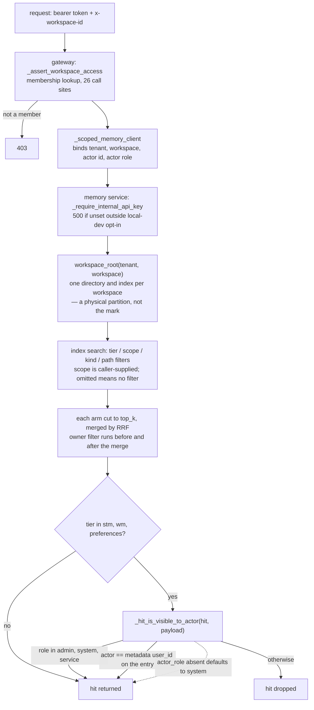

## 1. Executive Summary

Agent-MemoryForge is a memory plane for an agent framework the adopter already
runs: tenant-isolated, tiered, searchable memory behind an authenticated REST
API and a Python SDK. Memory is Markdown first and SQLite second, and the
private tiers are filtered per entry against the owner id stored on it. The
weakness is authorization by default and by address: an absent `actor_role` is
the privileged `system`, and a private file is addressed by a conversation or
task id that no write checks against the file's existing owner.

The README is clear about what it is not trying to be, and the code matches that
framing: a gateway, a key-guarded memory service, an SDK, a reference agent
runtime, an operator portal, quota accounting and a distillation worker, and no
agent runtime anyone is obliged to adopt. The in-tree MCP server
(`agent_memory_mcp_server.py`) registers five legacy skill tools — budgets,
itineraries, Gantt charts — and no memory tool; the README's "MCP facade mode"
is an integration the adopter writes.

The storage design is the part to copy. Memory is files first — Markdown in a
per-workspace directory tree — with SQLite as a derived index carrying FTS5 and
a vector table, and `_rebuild_index_from_workspace` to reconstruct it from the
files. That inverts the usual arrangement, where the database is authoritative
and the export is a convenience, and it means an operator can read the memory
with `cat`.

Three boundaries stack, and only one is this atlas's `scope_enforced` mark. The
tenant and workspace boundary is a *physical partition* on disk and in SQLite:
`workspace_root(tenant_id, workspace_id)` gives each workspace its own directory
and index. The optional pgvector arm keeps every workspace in one table filtered
on `tenant_id` and `workspace_id`. The `scope` column — `project`, `user`,
`session` — is a *caller-supplied facet* that applies no filter when the request
omits it. The mark is earned by the third: `_PRIVATE_TIERS` (`stm`, `wm`,
`preferences`) are filtered per entry against an owner id read off the record,
on the search path and on every direct read.

That third boundary is also where the first finding is. The predicate is:

```python
def _actor_role(payload): return str(payload.get("actor_role") or "system").strip().lower() or "system"
_PRIVILEGED_ACTOR_ROLES = {"admin", "system", "service"}
```

An absent `actor_role` becomes `system`, and `system` is privileged. A request
that omits the field passes every private-tier check and reads every user's
short-term memory, working memory and preferences in the workspace. The default
is the permissive one, which is the inverse of how the rest of this repository
is built: the same service answers every memory route with a 500 when no
internal API key is configured, and compares the key with `hmac.compare_digest`.

The second finding is on the write side. A working-memory write lands at
`wm/{task_id}.md` with `overwrite=True`, and the guard compares the claimed
owner with the actor rather than with the owner of the file already there. A
workspace member who knows another user's task id replaces that user's working
memory, and the owner's next read of it returns 403
([section 9](#9-reliability-safety-and-trust)).

Three marks: `scope_enforced`, `audit_log` and `negative_eval`. `audit_log` is
earned with its limits stated: the durable backend is off by default and the
distillation worker's writes are not audited. `trust_state`, `tombstone`,
`bitemporal` and `human_review` are withheld, the last on a preference
confirmation step whose pending state nothing writes.

## 2. Mental Model

Memory here is tiered by how long it should live and who it belongs to, not by
how confident anyone is that it is true. A conversation produces a short-term
summary (`stm`). A task carries working-memory state (`wm`). A user accumulates
preferences. A distillation worker turns conversations into semantic facts,
preferences and graph relations that outlive both.

What stands in for epistemic judgement is an admission filter on the worker.
`should_persist_distilled_memory` drops a distilled claim that hedges — an
English and Chinese lexicon of "probably", "seems", "可能", "大概" — and one whose
specific tokens do not appear in the user's own messages
(`agent_memory_framework/memory_runtime/memory_safety.py:208-281`). Past that
gate a fact is a file and an index row. If it is wrong, the correction is
another write, and the two sit beside each other ranked by relevance.

Working memory has a lifecycle — items move to done or cancelled and the context
builder stops injecting them, with the comment that they are "preserved for
audit but not" injected — but that is task state, not a claim about truth. A
working-memory entry written with `ttl_s` is deleted from disk on the first read
after it expires (`agent_memory_service/backends/file_first.py:1503-1519`).

The privacy line runs between tiers, not between claims. A semantic fact
distilled from one user's private conversation is written with
`scope="project"` to a tier every workspace member searches, and the
integration test that checks the private tiers is named for that split:
`test_private_tiers_are_user_scoped_but_semantic_and_graph_are_workspace_shared`.

What the system does model carefully is *who may see what*, at three levels.
Which level catches which threat is the whole of using this safely.



## 3. Architecture

Two services and a portal. The gateway (`agent_runtime/product/gateway`) holds
authentication, workspace membership, quota accounting and the chat path of a
reference agent runtime. The memory service (`agent_memory_service`) holds the
store and the index and is reachable only with an internal API key. The portal
is a React app over gateway routes, and `agent_memory_lib` is the SDK both the
gateway and external callers use.

The store is the `file_first` backend. Each tenant and workspace gets a
directory under `~/.agent_memory_service/workspaces`, named from a sanitised id
plus a 12-character SHA-256 prefix so two ids that sanitise alike do not
collide. Inside it the tiers are directories of Markdown. `index_sqlite.py`
keeps `docs` — path, entry id, tier, scope, memory kind, created_at, content,
metadata JSON and a preference key — with an FTS5 virtual table kept in sync by
three triggers, plus a `vecs` table for embeddings.

The vector arm is off unless `AGENT_MEMORY_VECTOR_ENABLED` is set. In SQLite it
loads every candidate embedding that passes the filters and computes cosine in
Python with numpy, a full scan per query (`index_sqlite.py:288-395`).
`index_pgvector.py` replaces only that arm: one table for every tenant, an HNSW
cosine index, and `tenant_id`, `workspace_id`, `tier`, `scope` and
`memory_kind` as predicates; FTS stays in SQLite.

The index is derived and treated that way. An index upsert that fails after the
file write logs and returns success (`file_first.py:816-823`). A rebuild from
the Markdown runs from an explicit route behind
`AGENT_MEMORY_INDEX_REBUILD_ENABLED`, and automatic rebuilds on a corrupt index
or on files edited by hand are separate flags; all three default to off.

Two operational details are done well. `safe_workspace_path` raises "Path
escapes workspace root" rather than normalising a traversal away, and the search
path refuses `path_prefixes` that leave the workspace with a 422. And the
internal key check fails closed: no key configured means a 500 on every memory
route unless `AGENT_MEMORY_SERVICE_ALLOW_UNAUTHENTICATED_LOCAL_DEV` is set and
the environment is not production. The production launcher,
`scripts/services.sh`, refuses to start the compose stack without the key.

Chat history is a separate Redis store with a 24-hour TTL, keyed on
`tenant:workspace:conversation_id`
(`agent_runtime/product/conversation_store.py:16-28`). It is the reference
runtime's context window rather than memory in this atlas's sense, and section 9
covers the one property of it that matters here.

## 4. Essential Implementation Paths

- **Gateway search** — `core_routes.py:858` resolves the workspace, calls
  `_assert_workspace_access(me, workspace_id)`, builds a client bound to
  tenant, workspace, actor id and actor role, then proxies.
- **Gateway write** — `core_routes.py:805`; `_write_metadata_for_gateway` at
  `:710` refuses a private-tier `user_id` other than the caller's unless the
  caller is an admin.
- **Workspace membership** — `portal_helpers.py:392` `_assert_workspace_access`
  looks the user's role up in the portal config, admits admins, and admits any
  user of the tenant to the default workspace.
- **Service auth** — `agent_memory_service/app.py:95` `_require_internal_api_key`.
- **Store root** — `file_first/paths.py:29` `workspace_root`, `:35`
  `safe_workspace_path`.
- **Index search** — `file_first/index_sqlite.py:397` builds the FTS `WHERE`
  from tiers, scopes, memory kinds and path prefixes; `:288` is the vector arm;
  `index_pgvector.py:232` is its Postgres twin.
- **Private-tier gate** — `backends/file_first.py:124` `_hit_is_visible_to_actor`
  on search at `:1366` and `:1403`; `:107` `_actor_can_read_private` on reads at
  `:1476`, `:1499`, `:1527` and on writes at `:1147`, `:1173`, `:1195`; `:144`
  `_entries_visible_to_actor` at `:1617`.
- **Private-tier addressing** — `stm/{conversation_id}.md` appended at `:1186`,
  `wm/{task_id}.md` overwritten at `:1211-1212`, `preferences/{user}/{key}.md`
  overwritten at `:905-924`.
- **Audit** — `observability.py:77` and `:174` `record_audit`; call sites in
  `core_routes.py` including `memory.write` at `:794`.
- **Distillation** — enqueued at `core_routes.py:1956` through
  `_enqueue_success_chat_distill` (`:209`); the worker's
  `_store_distilled_memories` at `scripts/memory_distill_worker.py:210`, gated by
  `memory_safety.py:267` `should_persist_distilled_memory`.

## 5. Memory Data Model

The index row carries three narrowing columns the search applies — `tier`
(lifetime), `scope` (`project` / `user` / `session`) and `memory_kind` — plus
`path` for prefix filters, each with its own index. `pref_key` is indexed as
well and nothing queries it: a preference is replaced by overwriting
`preferences/{user}/{key}.md`, so the path does the lookup.

Owner is not a column. `_hit_is_visible_to_actor` reads `metadata['user_id']`
out of the row's JSON and, when that is empty on a preference, parses the owner
segment out of the stored path with `_owner_from_hit_path`
(`backends/file_first.py:116`). The direct reads take `user_id` from each
entry's metadata block in the file. The memory service stamps the actor's id
into a private-tier entry that arrives without one (`:1130-1131`).

That is a defensible choice for a file-first design, where the path is the
identity, and it means the owner check costs a metadata parse per hit rather
than a `WHERE` clause. A row with no owner is hidden unless the role is
privileged: `_hit_is_visible_to_actor` returns false for a non-preference
private hit without `user_id`, and `_actor_can_read_private` returns false for
an empty owner. The failure direction there is closed, which is right.

The `scope` column is the one to be careful about. It is indexed, it is applied
as `scope IN (...)` on both the FTS and the vector arm in the SQLite backend and
as `scope = ANY(%s)` in pgvector, and it comes from the request body:
`scopes=list(req.scopes) if req.scopes else None`. The builder only appends the
clause `if scopes:`, so omitting it searches every scope in the workspace. It is
a facet for the caller's convenience, not a boundary, and nothing in the gateway
constrains it.

There is no validity time and no record time beyond `created_at`. The working
memory's `expires_at_s` is a deletion deadline, not a validity interval: nothing
reads a past value as of a date.

## 6. Retrieval Mechanics

FTS5 with a porter tokenizer over `docs.content`, and cosine over the vector
store when the arm is enabled. `_search_index_with_fallback` tries up to eight
query candidates in turn until it has `top_k` hits (`file_first.py:296`, `:337`).
Both arms receive the same four filters — `vector_scopes` and `vector_tiers` are
assigned `scopes` and `tiers` unchanged at `:1372-1373` — and `_rrf_merge`
combines them by reciprocal rank and truncates to `top_k` (`:431`).

Private-tier filtering happens after retrieval, per hit: once on the FTS hits
and once after the merge. That is the correct place for it given the owner is
not a column, but it means a private row is read out of the index, its metadata
parsed, and then dropped, so the filter protects the response rather than the
query. Both arms are asked for exactly `top_k`, so in a workspace where another
user's private memories dominate a query, the budget is spent before filtering
and the caller receives fewer hits.

The framework above this (`agent_memory_framework/memory_runtime`) does the
assembly, and it is where the hardcoded facets live: `context_builder.py:409`
and `memory_manager.py:434` each search `scopes=["project"]`, a deliberate
narrowing for the framework's own agent rather than a general default. The SDK's
`build_context` (`agent_memory_lib/client.py:446`) reads preferences and STM
directly by user and conversation id, and searches only the semantic and graph
tiers.

## 7. Write Mechanics

A write is a file write plus an index upsert, synchronous, through the
authenticated service, under a per-file lock. Preferences and working memory
overwrite their file; short-term summaries, semantic facts and graph relations
append to a per-conversation or per-day file. An entry is searchable by FTS
when the call returns; its embedding is inserted in the same call or, with the
async vector flag, scheduled after it. The index upsert is best-effort, so a
write can succeed and be unsearchable until a rebuild (`file_first.py:816-823`).

Distillation is the asynchronous half. After a successful chat round the
gateway enqueues a job when distillation is enabled and the round falls on an
every-N cadence (`core_routes.py:223-235`), and the worker calls the model for
every job it pops (`scripts/memory_distill_worker.py:603`). `conversation_value_filter.py` (651
lines) scores a conversation's worth for distillation, and its only callers are
two unit-test files and `examples/project_management_demo_real.py`: nothing on
the gateway or worker path imports it.

The gate that runs is after the model call. The worker writes a semantic fact
only above an importance of 0.6, a preference only above a confidence of 0.8,
and either only when `should_persist_distilled_memory` finds it grounded and
unhedged. A comment in the worker draws the line for anyone building the same
thing: durable claims "should come from durable evidence
(audit/trace/commits), not distillation."

Nothing rewrites the whole store, and nothing decays. Working-memory items reach
`done` or `cancelled` and stop being injected while remaining on disk, unless
written with a TTL. There is no delete route on the memory service: its
endpoints are stats, write, search, read, get, index rebuild and status.

## 8. Agent Integration

The design goal is that nothing here owns the agent. The REST API and the
Python SDK are the primary path, and the SDK's `build_context` returns a list of
messages that the docstring says a LangChain, LangGraph or custom loop can
prepend; `examples/langchain_memory_layer_agent.py` is that shape end to end. No
LangChain or LangGraph adapter class ships in the package.
`agent_memory_framework/adapters/memory_service.py` adapts the framework's own
`MemoryStore` interface to the service.

The portal is for operators rather than agents. MCP appears as a client: the
reference runtime calls workspace-configured MCP servers through a per-workspace
tool policy with an allowlist and a denylist. That policy governs which *tools*
an agent may call rather than which memories it may read, and the word
denylist appears in both conversations.

Workspace secrets are encrypted at rest in the portal config with Fernet, and
the gateway refuses a caller-supplied `memory_url` unless it equals the
configured URL or appears on an exact-match allowlist, with "memory_url override
is not allowed". A test pins it with the cloud metadata address, and it is
exactly the kind of parameter that turns a proxy into an SSRF.

## 9. Reliability, Safety, and Trust

**Scope — earned on the owner check, and the three levels should not be
conflated.** Section 1 separates them. The one that protects two users of the
same workspace from each other is the owner predicate on private-tier entries,
and it is the only one of the three that is a predicate over a stored key on the
record. On pgvector the workspace boundary becomes a keyed predicate too; on the
default SQLite store it stays a directory.

**The permissive default is the first finding.** `_actor_role` returns `system`
for a missing field and `system` is in `_PRIVILEGED_ACTOR_ROLES`, so a payload
without `actor_role` reads every private tier. The memory service is not
end-user-reachable: it requires an internal API key, compared in constant time.
The gateway always supplies the role — `actor_role=str(ctx.get("role") or
"user")`, and `_role_for_me` only ever returns `admin` or `user` — so the
shipped request path never omits it.

Three in-tree callers do omit it and rely on the default: the distillation
worker's client (`scripts/memory_distill_worker.py:211`), the framework's local
factory (`agent_memory_framework/factory.py:113`), and the unit fixture that
seeds Alice's private entries. And `actor_role` is optional on every request
model (`actor_role: str | None = None`), so any other holder of the internal key
that forgets it is silently privileged rather than refused. It is a
defence-in-depth defect rather than a live hole on the gateway path. The fix is
one line plus a service role for the worker: default to the least privilege and
require the caller to claim more.

**The owner check guards reads, and the private files are addressed by id — the
second finding.** A gateway write to `wm` passes `task_id` from the request and
binds `user_id` to the caller. The service then checks that the claimed owner
is the actor (`:1195`) and overwrites `wm/{task_id}.md` (`:1211-1212`) without
reading who owns the file already there. Knowing another member's task id is
enough to replace that user's working memory, after which the owner's read
raises 403 because the latest entry names the writer. For `stm` the same write
appends, the owner's per-entry read skips it, and a whole-file `get` returns 403
to the owner. The only cross-user write test refuses a claimed `user_id` of
another user (`tests/unit/test_agent_gateway.py:572`). This is read, not run.

The chat path has the same shape one layer up. The reference runtime loads
recent history by `tenant:workspace:conversation_id` and merges it into the
prompt without comparing the stored `user_id` with the caller
(`core_routes.py:1025-1051`). A server-generated id is a `uuid4`, so the id is
the whole guard. Both are the id-as-capability pattern; the private tiers'
owner predicate is the stricter design and is not applied at either point.

**Audit — earned, with durability off by default and coverage partial.** The
event carries the actor, the action, the resource and the outcome, and the REST
write proxy records `memory.write` with a content hash. The durable path is
Redis with an `rpush`/`ltrim` transaction, enabled only by
`AGENT_OBSERVABILITY_REDIS_ENABLED`, which defaults to `0`. The fallback keeps
5,000 events in a Python list that a restart erases, and the Redis list keeps
50,000 across every tenant in one key.

The durable facts are the unaudited ones. The distillation worker writes
semantic facts, preferences, graph relations and STM directly to the memory
service, which has no audit call, so the gateway records only that a job was
enqueued (`distill.enqueue`), not what it wrote. A deployment that has not set
the Redis flag has an audit surface in the portal and no audit record after a
redeploy.

**Negative eval — earned.** Section 10.

**Trust state — withheld.** A search for a verification or status field across
the service, the gateway, the framework and the worker finds confidence floats
and task statuses. The distillation gate drops hedged and ungrounded claims
before write, which is admission rather than a state: a stored fact carries no
status that could withhold it. Working memory's `active` / `done` / `cancelled`
answers whether the task is finished, and the context builder uses it to decide
what to inject rather than what to believe.

**Tombstone — withheld.** The only denylist in the tree is the MCP tool policy.
Nothing records a rejected memory value, and there is no delete route to hang
one on, so a distillation pass can re-assert something a user corrected.

**Bitemporal — withheld.** One `created_at`, no validity axis, no as-of read.

**Human review — withheld, on a queue nothing fills.** The chat path has a
preference confirmation step behind `PREFERENCE_REQUIRE_CONFIRMATION`, default
off. When the conversation's metadata holds `preference_confirmation` with
status `awaiting_confirmation`, the user's next "yes" stores the listed
preferences with `confirmed: True` in the audit detail, and "no" discards them
(`core_routes.py:1429-1520`). No code writes `preference_confirmation` into
that metadata, and with its own flag set the worker skips preferences as
`preferences.confirmation_required` rather than queueing them
(`scripts/memory_distill_worker.py:344`, `:390`). The portal displays memory
and does not approve it.

**Two exported surfaces go unused.** `get_tenant_context` in
`agent_runtime/product/gateway/deps.py:78` trusts `X-Tenant-ID`, defaults the
tenant to `tenant_{user_id}` and performs no membership check; no route uses it,
and the gateway package exports it. And two `conftest.py` execute on pytest
collection, so a reviewer who runs the suite executes repository code before any
test runs.

## 10. Tests, Evals, and Benchmarks

The suite is 507 pytest functions in 81 unit files and five integration files,
covering the gateway, the file-first backend, distillation parsing, the memory
safety gate, context assembly, quotas and the MCP clients, plus a top-level
`e2e_suite.py`. The tree carries no CI workflow.

`test_private_memory_is_filtered_by_actor`
(`tests/unit/test_file_first_memory.py:348-449`) carries the mark. It writes
Alice a preference, an `stm` entry whose content is the literal string "Alice
private conversation summary", and a `wm` task state. It then searches as Bob
for "Alice private" restricted to the `stm` tier and asserts
`bob_search["hits"] == []`, and asserts a 403 on each of Bob's three direct
reads: the preference and the STM file by path, and the task state by id.

That negative assertion is not vacuous, and the reason is the fixture rather
than a second assertion: the stored row contains the query terms, so the FTS arm
matches it, and removing the filter at `file_first.py:1366` returns the row to
Bob. The owner-side control is in the same test: Alice reads the same
`stm["path"]` and asserts truthy content, and reads her task state back as
`{"a": 1}`. Alice's control is a direct read rather than the same search, so
nothing in this file asserts the search returns her row to her.

`tests/integration/test_memory_recall_e2e.py` carries the stronger pair. One
seed holds Alice's and Bob's preferences and Alice's STM and task state, each
written with actor fields, plus shared semantic and graph facts. At `:207` Alice's
`build_context` must contain her STM line and preferences. At `:239` Bob's, with
the same `conversation_id`, must contain his own `language: en-US` and the
shared SLA fact and must not contain Alice's STM line or answer style, and his
direct read of her task state must raise 403. At `:277` a second workspace must
not see the first's facts. Bob's context asks for his own preferences, so the
answer-style exclusion rests on the request rather than the owner check; the
STM exclusion rests on the per-entry check at `file_first.py:1476`.

Two more tests are useful. `test_file_first_search_returns_503_when_index_corrupt`
(`test_file_first_memory.py:452`) pins that a corrupt index is an error rather
than an empty result, which is the failure mode that turns a broken store into
a confident "nothing found". `test_agent_gateway.py:185` asserts `"do not log
this memory text" not in str(summary)`, a redaction check about leakage into
logs rather than about what recall returns.

No paper and no `CITATION.cff`. The README's Verification section lists the
pytest suites, a provider smoke check and
`examples/langchain_memory_layer_agent.py`. That example uses a deterministic
stand-in model by default, requires four expected facts in the answer, and
reports p50 and p95 latency under concurrent load. It is a pass/fail recall
check over a fixed seed; no committed file reports a retrieval score.

The suite was not run: two `conftest.py` files execute on pytest collection,
`pyproject.toml` declares dependencies with no lockfile, and `portal-ui`
carries fifteen floating ranges behind a lockfile.

## 11. For Your Own Build

### Steal

- **Files first, index rebuildable.** Keep the Markdown authoritative and the
  index derived, with a rebuild path to prove it. An operator can read and diff
  the memory without the service running, and a failed index write degrades to
  a stale index rather than a lost memory.
- **Admit a distilled claim only when the user's own words ground it.** Require
  the claim's specific tokens to appear in the user's messages and drop hedged
  phrasing before write; it costs a regex and a token set, not a model call.
- **Refuse a caller-supplied service URL** unless it matches an exact allowlist,
  on any proxy that would otherwise fetch what it is told to.
- **Fail closed on a missing service key, and say which variable to set.**
  A 500 with the variable name beats a silent open port, and the local-dev
  escape hatch is explicit, named and refused in production.
- **Raise on a path that escapes the workspace** rather than normalising it.
- **Suffix a sanitised directory name with a hash of the raw id**, so two
  tenants whose ids sanitise alike cannot share a directory.

### Avoid

- **Defaulting an authorization input to the privileged value.** `actor_role or
  "system"` with `system` privileged means every caller that forgets the field
  is an administrator. Default to the least privilege; make the caller claim
  more, and give background workers a named service role.
- **Addressing a private record by an id the caller chooses, and checking only
  the claimed owner on write.** Put the owner in the path or check the existing
  record's owner before an overwrite; an owner predicate on reads does not
  protect the write.
- **Shipping the durable audit behind a default-off flag, and auditing only the
  front door.** The portal shows an audit view either way, and the writes a
  background worker makes are the ones a reviewer most needs to see.
- **Letting an omitted filter mean no filter on a key named `scope`.** The name
  reads like a boundary and behaves like a facet.
- **Filtering private rows after `top_k`.** The gate is correct and the ranking
  budget is spent on rows that will be dropped.

### Fit

Take this if you are building a multi-tenant product on top of an agent
framework you have already chosen, and you want the memory plane to be somebody
else's code. The gateway, quotas, portal, MCP tool policy and encrypted
workspace secrets are the things a team discovers it needs three months after
the demo, and they are here and complete enough to study.

It fits badly where memory needs to be right rather than present. There is no
verification state, no correction record, no delete route and no evaluation of
retrieval quality, so what comes back is whatever FTS5 and the embedder produce
over whatever passed the distillation gate. Adding verification means a column,
a writer and a filter through the search and read paths — a change to the
retrieval contract rather than an addition beside it.

Before deploying it with more than one user per workspace, set `actor_role` on
every internal caller, invert the default, and bind working-memory task ids to
their owner. Those are the changes between a careful isolation model and one
that is bypassed by omission or by a known id.

## 12. Open Questions

- Is the `system` default on `_actor_role` deliberate — a convenience for the
  distillation worker and other service-to-service calls — or an oversight that
  predates the private tiers?
- Why is Redis audit durability off by default when the portal exposes an audit
  view unconditionally?
- Is `get_tenant_context` a leftover from a single-tenant mode, and is anything
  outside this repository importing it?
- Is a producer for `preference_confirmation` planned, or is the chat-side
  consumer a remnant of an earlier confirmation design?
- Should private-tier filtering move into the query, given the owner is
  recoverable from the path for preferences and could be a column for the rest?

## Appendix: File Index

**Store and index**

- `agent_memory_service/file_first/paths.py` (`:29` `workspace_root`, `:35`
  `safe_workspace_path`)
- `agent_memory_service/file_first/index_sqlite.py` (`:11` schema, `:288` the
  vector arm, `:397` `search`), `index_pgvector.py` (`:119` shared table, `:232`
  `vector_search`, `:245` tenant and workspace predicate)
- `agent_memory_service/backends/file_first.py` (`:95` `_PRIVATE_TIERS`, `:107`
  `_actor_can_read_private`, `:116` `_owner_from_hit_path`, `:124`
  `_hit_is_visible_to_actor`, `:144` `_entries_visible_to_actor`, `:180` the
  path-prefix refusal, `:431` `_rrf_merge`, `:492` `_ws_root`, `:608` the
  rebuild, `:1186` and `:1211` the private-tier paths, `:1366` and `:1403` the
  search filter, `:1503` the TTL delete)

**Service and gateway**

- `agent_memory_service/app.py` (`:82` the key lookup, `:95` the dependency)
- `agent_runtime/product/gateway/core_routes.py` (`:710`
  `_write_metadata_for_gateway`, `:794` `memory.write` audit, `:858` search,
  `:1025` chat history key, `:1429` preference confirmation, `:1983` distill
  enqueue audit)
- `agent_runtime/product/gateway/portal_helpers.py` (`:62`
  `_make_observability_store`, `:200` `_resolve_memory_service_url`, `:311`
  `_role_for_me`, `:392` `_assert_workspace_access`, `:534`
  `_scoped_memory_client`)
- `agent_runtime/product/gateway/deps.py:78` — `get_tenant_context`
- `agent_runtime/product/observability.py` (`:48` `AuditEvent`, `:70` in-memory,
  `:146` Redis)
- `agent_runtime/product/conversation_store.py:16` — chat history

**Memory logic**

- `scripts/memory_distill_worker.py` (`:210` `_store_distilled_memories`, `:340`
  the durable-evidence comment, `:344` and `:390` the confirmation branch)
- `agent_memory_framework/memory_runtime/memory_safety.py` (`:27` the hedge
  lexicon, `:224` `is_user_grounded`, `:267` `should_persist_distilled_memory`)
- `agent_memory_framework/memory_runtime/context_builder.py:409`, `:478`;
  `memory_manager.py:434`
- `agent_memory_lib/client.py` (`:126` `with_scope`, `:446` `build_context`)
- `agent_memory_mcp_server.py:38` — five skill tools, no memory tool
- `conversation_value_filter.py` — callers only in tests and `examples/`

**Tests**

- `tests/unit/test_file_first_memory.py:348-449`, and the corrupt-index case
  at `:452`
- `tests/integration/test_memory_recall_e2e.py:207`, `:239`, `:277`
- `tests/unit/test_agent_gateway.py:185`, `:421`, `:572`

### Recorded searches

```sh
grep -rn 'scopes=' --include='*.py' . | grep -v tests/
grep -rn 'vector_scopes\|vector_tiers' --include='*.py' .
grep -rn 'get_tenant_context' --include='*.py' . | grep -v 'def get_tenant_context'
grep -rn '_actor_can_read_private\|_hit_is_visible_to_actor\|_entries_visible_to_actor' --include='*.py' . | grep -v tests/
grep -rn 'actor_role' --include='*.py' . | grep -v tests/
grep -rn 'MemoryClient(' --include='*.py' . | grep -v tests/
grep -rn 'persisted.user_id\|getattr(persisted' agent_runtime/product/gateway/core_routes.py
grep -rn '"bob"\|bob' tests --include='*.py'
grep -rni 'tombstone\|rejected_value\|do_not_store\|blocklist\|denylist' \
  --include='*.py' agent_memory_service/ agent_runtime/ agent_memory_framework/ | grep -v tests/
grep -rniE '"(verified|unverified|pending|candidate|rejected|approved|confirmed|disputed)"|confidence|verification_status|trust_level' \
  --include='*.py' . | grep -v tests/
grep -rni 'valid_from\|valid_at\|as_of\|effective_' --include='*.py' \
  agent_memory_service/ agent_runtime/ | grep -v tests/
grep -rni 'approve\|adjudicat\|review_queue\|pending_review' --include='*.py' \
  agent_runtime/ agent_memory_service/ | grep -v tests/
grep -rn 'preference_confirmation\|awaiting_confirmation' --include='*.py' .
grep -rn 'ObservabilityStore\|record_audit\|AuditEvent' --include='*.py' . | grep -v tests/
grep -rn 'conversation_value_filter\|ConversationValueFilter' --include='*.py' . | grep -v '^./conversation_value_filter.py'
grep -rln 'FastMCP\|@mcp.tool' --include='*.py' .
grep -rn '@fastapi_app\.' agent_memory_service/app.py
grep -rn 'pref_key' agent_memory_service/ | grep -i 'where\|select'
grep -n 'overwrite' agent_memory_service/backends/file_first.py
grep -rni 'decay\|half_life\|forget' --include='*.py' agent_memory_service agent_runtime \
  agent_memory_framework scripts | grep -v tests/
grep -n 'name=' agent_memory_mcp_server.py
grep -rln -i 'langgraph\|langchain' --include='*.py' . | grep -v tests/
git ls-files | grep -iE 'bench|result|score|leaderboard'
grep -rn -i 'arxiv\|bibtex\|@article\|citation\|doi' README.md docs/
ls CITATION* .github 2>&1
```

## History

**2026-09-26** — [`770b4eefe9882fff4b590ce9fac307faf2566b8d`](https://github.com/hellangleZ/Agent-MemoryForge/commit/770b4eefe9882fff4b590ce9fac307faf2566b8d) — an audit at an unchanged pin: `main` has not moved. Screened again from a full clone: two `conftest.py` that execute on collection, two unpinned surfaces, nothing inside the cooldown. Nothing installed, built or run. No mark moved. Corrected: search filters through `_hit_is_visible_to_actor`, and three of the six cited sites guard writes; `conversation_value_filter.py` has no caller outside tests and `examples/`; the MCP server exposes no memory tool; no LangChain or LangGraph adapter ships; both vector arms take identical filters; the key check fails per request, not at start; the unit suite is 81 files. Added: any member who knows a task id can overwrite that user's working memory, and distilled writes are unaudited ([section 9](#9-reliability-safety-and-trust)); human review is withheld on a confirmation queue nothing fills; a second negative case ([section 10](#10-tests-evals-and-benchmarks)).

**2026-09-13** — [`770b4eefe9882fff4b590ce9fac307faf2566b8d`](https://github.com/hellangleZ/Agent-MemoryForge/commit/770b4eefe9882fff4b590ce9fac307faf2566b8d) — first reading. Screened first: two `conftest.py` files that execute on pytest collection, a `pyproject.toml` with no lockfile beside it, and fifteen floating ranges in `portal-ui/package.json`. Nothing was installed and no suite was run. Three marks. `scope_enforced` is earned on the private-tier owner check applied per hit at six read sites, deliberately separated in the report from the two boundaries beside it that do not qualify: the per-workspace directory partition, and the caller-supplied `scope` facet that applies no filter when omitted. `audit_log` is earned on gateway audit events naming the actor for memory mutations, with the limit stated that the durable Redis backend is opt-in and the default keeps 5,000 events in a process-local list. `negative_eval` is earned on a test where one user's search for another's stored text returns no hits over a fixture containing the exact query terms, with the owner-side read control in the same test. The finding is that `_actor_role` defaults to `system`, which is on the privileged list, so a caller omitting the field passes every private-tier check — scoped by the fact that the memory service requires an internal API key and the gateway always sets the role. `trust_state`, `tombstone`, `bitemporal` and `human_review` are withheld on searches recorded in the appendix.
