## 1. Executive Summary

Agent Mesh is a project-local coordination substrate for human-plus-agent teams:
24,653 lines of Python across `src/agent_mesh/`, MIT, release v0.3.0 (PyPI
`my-agent-mesh`), eight commits on a repository whose first commit is
`chore: publish clean agent-mesh surface` — a curated publish of work developed
elsewhere, which is why the history says nothing about how the design arrived.
It has **no third-party dependencies**: `pyproject.toml` declares an empty
`dependencies` list under the comment *"Stdlib-only by design for core."* That
is rare enough in this corpus to state first, and it means the supply-chain
surface of adopting it is the Python standard library and nothing else.

The substrate is a hash-chained append-only `events.jsonl` with SQLite as a
declared projection of it. Most of what flows through it — requests, responses,
backlog items, dispatch runs and leases — is coordination state rather than
memory: a request is an act, not a claim that can turn out false. **The memory is
the decision log**, and it is a serious one. A decision carries a human ID with
aliases, a tier, an externalized Markdown body addressed by SHA, an owner, a
status, an enforcement mode, affected-code globs, exemptions, required checks,
assumptions, evidence references, tags, and a list of verification commands with
expected signals. Supersession detects cycles and refuses a target that was never
accepted. Three tiers skip `accepted` and go straight to `in_force`.

**The best thing here is the revision rule, and it is a mechanism rather than a
convention.** Editing a decision that is `accepted` or `in_force` through the
Workbench requires a reason, emits a `decision_revisited` event, and sets
`fields_changed["status"] = [status, "proposed"]` — the projection then clears
`accepted_utc` and the record has to be accepted again. A revised decision cannot
inherit the approval of the thing it replaced. Very little in this atlas closes
that loop.

**Seven fields of the decision payload have no producer, and the collections
that do have one are the collections that execute.** `cmd_decision_propose`
(`cli/mail.py`) and `create_decision`
(`workbench.py`) both fill `verification`, `required_checks`,
`affected_code_globs` and `tags` from their arguments, `decision amend` edits
those four after the fact, and `agent-q decisions verify` executes what they
hold: authoring parses each command into argv and rejects shell operators and
env-assignments (`core/decision_schema.py`, `reject_unsafe=True`), execution is
`subprocess.Popen(argv, …, shell=False)` (`q.py:1324`), and a verification on a
decision that is not `accepted`/`in_force` is refused. Both propose payloads then
hardcode seven further fields to an empty value — `rejected_alternatives`,
`consequences`, `exemptions`, `generated_artifact_paths`, `assumptions`,
`evidence` and `review_policy` — and no `amend` flag, Workbench form field or
other event reaches any of them. Five have a projection waiting: `exemptions` and
`generated_artifact_paths` are two of the three kinds in `decision_globs`,
`assumptions` and `evidence` have tables of their own, and `review_policy` has a
gate.

**The reviewer quorum is one of the seven, which makes it decoration.**
`_decision_quorum_reached` reads `review_policy.required_reviewers`, computes an
`approval_quorum`, and counts distinct accepting actors against it — and returns
`True` immediately when the required list is empty, which it always is, because
`review_policy` arrives `{}` from both write paths and the string `quorum` does
not appear in the README or `docs/` at all. Every `decision_accepted` event in a
store built by shipped commands passes a check that never had anything to
enforce.

Two further findings follow from reading the read path rather than the schema.
The dispatch grounding packet that an agent actually receives has a section
called `prior-decisions`, and it is not the decision store: `prior_decisions_text`
regex-matches `APPROVE|REJECT|GO|NO-GO` and friends against the bodies of
`res_posted` messages in the same thread. **No decision record reaches an agent's
context through any automatic path**; the contract installed into `AGENTS.md`
tells the model to go and look. And every `agent-q` read calls
`rebuild_all`, which does `reset_schema` and replays the entire log —
`projection_is_current` exists and is called from exactly one place, the
Workbench refresh.

The published tree ships one test file: `tests/public/test_public_contract.py`, a
four-test behaviour contract, with CI.

## 2. Mental Model

A memory here is a **decision**: a durable, human-identified record (`D001`,
`D038-S1`, `D076-E`) of something the project settled, with the argument in an
externalized Markdown body addressed by `body_sha` and the structure in the event
payload. Everything else the log carries is a different kind of thing. A request
is a speech act; a backlog item is workflow state; a dispatch lease is a
concurrency primitive. None of them can be wrong in the way a decision can, and
the design is right not to treat them alike.

Nothing extracts a decision. There is no model anywhere in the package — an agent
or a human names the decision, and the substrate's job is to make the naming
durable, ordered and hash-linked. Capture is therefore a deliberate act with a
form, which puts Agent Mesh at the far explicit end of
[zero-LLM capture](../../patterns/zero-llm-capture/).

The state machine is a `status` column and it is real. `decision_proposed`
inserts at `proposed`. `decision_accepted` first checks a reviewer quorum
(`_decision_quorum_reached`, which returns `True` when `required_reviewers` is
empty — and it is empty in every store the shipped verbs can build), then promotes to
`in_force` if the tier is `architecture_contract`, `production_invariant` or
`compliance_security`, and to `accepted` otherwise. `decision_rejected` and
`decision_retired` are terminal marks; `decision_superseded` points the old
record at a successor and the successor back at the old one, after
`_ensure_supersede_target_valid` refuses a target that is not `accepted` or
`in_force` and `_ensure_no_supersede_cycle` walks the chain.

**The transition worth studying is the reverse one.** Editing an accepted or
in-force decision in the Workbench is refused without a `revision_reason`, then
emits `decision_revisited` and folds `status: [old, "proposed"]` into the
metadata update. `_project_decision_metadata_updated` reads that and sets
`accepted_utc = NULL`. Approval is attached to a version of the content, not to
the record, and the code enforces the difference.

Two states in the vocabulary have no producer either, and they are the two that
would police the fields nothing fills. `decision_assumption_violated` would flip
a `decision_assumptions` row to `violated` and stamp the invalidating event;
`decision_check_failed` would append to the decision's log. Both appear in the
accepted-kinds set and in the projection's `elif` chain, and neither is emitted
by any code path in the package. `decision_drift_detected` is emitted, by one
command.

Nothing forgets. There is no delete, no redaction, no expiry and no retention
policy over decisions or messages — the only `DELETE` statements in the tree
clear derived SQLite rows before reprojection. `body_fidelity` admits the value
`redacted`, and it is a label a caller may pass to `agent-mesh request
--body-fidelity`; no code path produces it, and nothing removes the bytes it
would describe.

```mermaid
%% caption: the decision lifecycle, with rejection keyed on the record rather than the value, a quorum check that passes on a hardcoded empty review policy, and an enforcement mode no read path consults
stateDiagram-v2
    [*] --> Proposed: "decision_proposed — verification, checks and globs from arguments; assumptions, evidence and review_policy hardcoded empty"
    Proposed --> Accepted: "decision_accepted, ordinary tier — the quorum check passes on an empty review_policy"
    Proposed --> InForce: "decision_accepted — architecture_contract, production_invariant or compliance_security"
    Proposed --> Rejected: "decision_rejected"
    Accepted --> InForce: "status set through decision_metadata_updated"
    Accepted --> Proposed: "Workbench edit — reason required, emits decision_revisited, clears accepted_utc"
    InForce --> Proposed: "same rule — approval belongs to the content, not the record"
    Accepted --> Superseded: "decision_superseded — target must be accepted or in_force, cycles refused"
    InForce --> Superseded
    Accepted --> Retired: "decision_retired"
    InForce --> Retired

    note right of Rejected
        Keyed on the record, not the value.
        Nothing stops the same content
        being proposed again as D-next.
    end note

    note right of InForce
        enforcement_mode is computed from
        the tier, stored, and printed in a
        rendered Markdown view. No read path
        consults it.
    end note
```



## 3. Architecture

Nothing has to be running to store or read anything. A project is a
`.agent-mesh/` directory holding `config.toml`, `events.jsonl`, externalized
bodies, a SQLite file, generated Markdown views and a lock.

**The log is the store.** `core/events.py` defines a frozen `Event` envelope —
`event_id`, `schema_version`, `occurred_utc`, `event_seq`, `actor`, `kind`,
`entity_id`, `thread_id`, `prev_event_hash`, `payload` — serialized through
`canonical_json` with sorted keys and no whitespace, hashed with SHA-256 over the
exact newline-terminated bytes. `core/chain.py` verifies the chain in two modes
and its docstring states the limit of the cheap one precisely: an anchored walk
*"does NOT prove that an arbitrary earlier prefix line was not rewritten in place
at the same byte length; that requires the full walk"*. The chain is unkeyed, so
it is tamper-evident against accident and against an editor who does not
recompute, and not against anyone who does.

**SQLite is a projection and says so.** `store/sqlite.py` creates roughly thirty
tables; `store/rebuild.py` replays the log into them. `reset_schema` wipes,
`apply_record` refuses a gap in `event_seq`, and `table_hashes_for` canonically
dumps and hashes every table so two machines can compare projections. This is the
cleanest instance in the corpus of the log-and-projection split the atlas records
in [its own notes](https://github.com/neoneye/agent-memory-atlas/blob/main/notes/2026-08-03-the-log-and-the-projection.md):
the derived store is disposable by construction, and the code treats it that way.

**Concurrency** is an owner-aware file lock (`core/lock.py`) carrying a PID, a
boot ID and a hostname, with `OwnerStatus` distinguishing `live`,
`stale_pid_dead`, `stale_age_exceeded` and `cannot_verify`, and a 600-second
staleness bound. Interrupted writes are recovered idempotently
(`core/recovery.py`), and `dispatch/atomic.py` journals a set of replace and
delete operations so a crash rolls forward rather than leaving a half-applied
unit.

**The Workbench** (`workbench.py`, 4,411 lines) is a loopback HTTP server plus a
single-file HTML page, with a per-server access token carried in a URL fragment,
restricted browser origins, a `0600` machine-local bookmark stored outside any
repository, and retry-safe receipts so an uncertain feedback retry returns the
original request instead of creating a second one.
`workbench_service.py` installs it as a user-level service under launchd,
`systemd --user` or Task Scheduler, serving every repository in a machine-local
registry from one process.

### Deployment and ergonomics

`pip install agent-mesh`, then `agent-mesh init` in a repository. No database
server, no key, no network, no model. Python 3.11+ and the standard library.

The store is repairable by hand in the ordinary sense — `events.jsonl` is one
canonical JSON object per line and the bodies are Markdown files — but with a
sharp caveat the design creates: editing a line invalidates every
`prev_event_hash` after it, so hand-repair means rewriting the chain, and there
is no tool for that. The delete-free, redaction-free design means the recovery
story for a mistaken write is *append a corrective event*, and for a decision
that is `decision_revisited` or `decision_superseded`. For anything the schema
cannot express, there is no story.

Privacy is the part of the operator experience that has had the most thought.
New projects default to `local-only`, whose generated `.agent-mesh/.gitignore` is
deny-all and ignores itself, so a plain `git add -A` selects nothing.
`git-shared` is an explicit opt-in allowlisting exactly the config, the event log
and externalized bodies — and `docs/privacy.md` refuses to oversell it: *"This is
an allowlist of canonical state, not a promise that the allowed files are
public."* It also states that configs predating the setting are read as
`git-shared` rather than silently made private, and that changing `.gitignore`
*"does not erase prior commits, forks, caches, or clones."*

## 4. Essential Implementation Paths

- **Append.** `core/events.py:append_event` — assigns `event_seq` and
  `prev_event_hash` from the tail, validates provenance
  (`core/provenance.py:validate_event_provenance`), dispatch payloads
  (`core/dispatch_schema.py`) and decision stop lines
  (`_validate_stateful_event_before_append` → `validate_decision_event`, `:150`,
  `:428`–`:468`), then writes the canonical line. **An invalid decision event
  fails before it is journalled.**
- **Project.** `store/rebuild.py:rebuild_all` → `reset_schema` → `apply_record`
  per event → `_project_record`. Decision handling is `_project_decision_event`
  around `:1099` and `_project_decision_proposed` at `:1179`.
- **Decision write surfaces.** `cli/mail.py:cmd_decision_propose` (`:838`),
  `cmd_decision_accept`, `cmd_decision_revisit`, `supersede`, `retire`; and
  `workbench.py:create_decision` (`:500`) and the edit path (`:680`).
- **Decision read surfaces.** `cli/q.py:cmd_decisions_list/show/log/search/at/verify`
  (`:733`–`:914`) and the Workbench Decisions tab.
- **Verification runner.** `cli/q.py:cmd_decisions_verify` — `subprocess.Popen(argv, …, shell=False)` (`:1324`), emitting
  `decision_drift_detected` on non-zero exit; refuses a verification on a non-accepted decision.
- **Grounding.** `dispatch/grounding.py` — sections for referenced rows, git
  state, `prior-decisions` (`prior_decisions_text`, `:57`) and the full thread,
  each tagged `stable` or `volatile` and hashed.
- **Packet.** `cli/q.py:cmd_packet` → `message_packet.py:build_message_packet`;
  the word *decision* does not occur in that module.
- **Chain integrity.** `core/chain.py`, exposed as `agent-q verify-chain`.
- **Locking and recovery.** `core/lock.py`, `core/recovery.py`,
  `dispatch/atomic.py`.
- **Agent contract.** `skill/render.py:CANONICAL_SKILL_BODY`, installed by
  `adoption.py` into `AGENTS.md` and, when the repository shows signs of it,
  `CLAUDE.md`.
- **Tests.** `tests/public/test_public_contract.py`, four cases, plus a CI
  workflow. Nothing else in the tree is a test.

## 5. Memory Data Model

`decisions` is the table that matters: `dec_ulid` primary key, `human_id`,
`parent_human_id`, `title`, `tier`, `status`, `enforcement_mode`, `owner`,
`body_sha`, `body_path`, `body_bytes`, `body_media_type`, `superseded_by`,
`supersedes`, `proposed_utc`, `accepted_utc`, `in_force_utc`, `retired_utc`,
`last_verified_utc`, `drift_risk`, `event_seq`, `meta_json`. Around it sit
`decision_aliases` (a renamed decision keeps its old ID resolvable, with one
primary), `decision_globs` (kinds `affected`, `exempt`, `generated`),
`decision_checks`, `decision_verifications`, `decision_assumptions`,
`decision_evidence`, `decision_references_in_code` and `decision_tags`.

Separating the body from the record by SHA is the right call and it pays off
twice: `body_sha` is a field `decision_metadata_updated` can change, so a
revision is a content-hash change with an event behind it, and the alias table
means the identifier a human uses is decoupled from the identity the projection
keys on.

**Temporal fields are all record time.** `occurred_utc` on the event,
`event_seq` for order, and four transition stamps on the decision. There is
nothing recording when a decision was true *of the world* as distinct from when
the project wrote it down, and no as-of query — `agent-q decisions at` takes a
file path, not a date. Single axis, so not
[bi-temporal](../../patterns/bi-temporal-fact-validity/), though the log makes
the history reconstructible by replay in a way most single-axis stores cannot
manage.

**There is no scope key.** The boundary is `.agent-mesh/` in a directory, the
same filesystem-boundary answer as [Graphify](../graphify/) and
[Klypix MCP](../klypix-mcp/). The near-miss is worth naming because it looks like
more: the multi-repo Workbench server *"resolves its opaque repo ID before
feedback, request-status, backlog, attachment, or decision operations"*, which is
a real access-control indirection over a machine-local registry. But it selects
which store to open rather than filtering rows inside one, and no record carries
a tenant, user or workspace key. `config.participants` is the closest thing to an
identity list, and it gates who may act, not what may be read.

Provenance is the model's other strength, and it is on the message side rather
than the decision side. `core/provenance.py` defines closed vocabularies for
`body_authority` (`human_chat`, `agent_mail`, `tool_payload`, `agent_summary`,
`recovery_artifact`, `unknown`), `body_fidelity` (`full`, `metadata_only`,
`reconstructed`, `inferred`, `redacted`, `missing`), source-selection modes and
eight causal-edge relations. **Distinguishing what a human said from what an
agent summarised, as a validated enum on the record, is a thing this atlas asks
about constantly and finds rarely** — and the grounding path uses it, refusing to
call a packet complete when a thread event's fidelity is not `full`.

## 6. Retrieval Mechanics

Retrieval is deliberate and thin. `agent-q decisions search` selects every row
from `decisions`, builds a haystack from `human_id`, `title`, and the `context`
and `decision` strings inside `meta_json`, and prints rows whose lowercased
haystack contains the lowercased query. No index, no ranking, no scoring, no
limit, and the body — the file where the actual argument lives — is not searched
at all. `agent-q decisions at <path>` is the more interesting query: it joins
`decision_globs` where `kind='affected'` and `fnmatch`es the relative path, which
answers *which decisions govern this file*. That is the right question, and both
write paths can supply the globs it needs — `--affects` on the CLI, the
`affected_code_globs` argument in `create_decision`. The `exempt` and `generated`
glob kinds the same table carries have no producer, so the join is populated in
one of its three kinds.

Neither query filters on status. A retired, rejected or superseded decision
prints alongside a live one with its status in the second column, which is the
recall-first-and-label choice and is defensible on a surface a human reads.

**The automatic path does not retrieve decisions at all.**
`dispatch/grounding.py` assembles a packet with a stable prefix and volatile
suffix — a cache-shaped design, and it hashes every section so a caller can see
what changed — but its `prior-decisions` section comes from
`prior_decisions_text`, which scans `res_posted` events in the current thread for
the regex `\b(APPROVE_WITH_CHANGES|APPROVE|REQUEST_CHANGES|REJECT|NO-GO|GO)\b` in
the summary and the first 200 characters of the body. Those are review verdicts
inside messages, not records in the decision store. `build_message_packet`, which
backs `agent-q packet`, contains no reference to decisions either.

So the substrate's durable, tiered, supersession-aware memory is reachable by an
agent only if the agent runs a query, and the thing that tells it to is prose:
the contract installed in `AGENTS.md` says *"Run `agent-q status` and targeted
`agent-q list/locate/body` before responding."* This is the shape the atlas
records as [the guidance was already in
context](https://github.com/neoneye/agent-memory-atlas/blob/main/notes/2026-08-08-the-guidance-was-already-in-context.md)
— an instruction to consult standing in for a mechanism that consults.

The other retrieval cost is structural. Twenty-one `agent-q` commands begin with
`_rebuild_all_locked`, which calls `rebuild_all` unconditionally: wipe the
schema, read the whole log, replay every event. `projection_is_current` compares
the log's SHA-256 against the value stamped in the projection's `meta` table and
would let a reader skip all of that; it is called from one line in
`workbench.py`. The optimisation exists, is correct, and was applied to one of
the two readers — the interactive one, in the commit titled `perf: reduce
Workbench refresh work`. Every command-line read still pays for the full history.

## 7. Write Mechanics

Writes are synchronous, deterministic, and cheap in model terms because no model
is involved. The path is: acquire the project lock, read the tail line for
`event_seq` and `prev_event_hash`, validate, append the canonical line, project.
A new decision is retrievable immediately — the next reader replays the log and
sees it.

Idempotence and crash safety got real attention. `AGENT_MESH_FAULT_AFTER` is a
fault-injection hook in the append protocol, `core/recovery.py` handles
interrupted writes, `dispatch/atomic.py` journals its file operations for
roll-forward, and the Workbench's feedback receipts make an uncertain retry
return the original request ID.

**Decision invariants are checked at both boundaries.** A superseded target must
be accepted or in force, supersession may not cycle, a human ID may not collide,
an alias may not fork, a parent may not be missing — and `apply_record` raises
`DecisionStopLine` at *projection* time when one is broken, which alone would
make a bad event permanent poison in a log with no delete: appended durably, then
aborting every subsequent replay. `append_event` therefore runs the same check
first, through `_validate_stateful_event_before_append` → `validate_decision_event`
(`events.py:150,428-468`), so an invalid decision event fails before it is
journalled. The public-contract test asserts the bad event never lands and
`events.jsonl` stays byte-identical, and `agent-q decisions diagnose` reports
replay health. Validating at the write boundary as well as the replay boundary is
the standard defence, and it is a defence a store this shape needs, because the
replay-only version of it is a durable denial of service against yourself.

The other write-side finding is the one in this report's title. Both propose
paths hardcode the same seven values:

```python
"rejected_alternatives": [],
"consequences": [],
"exemptions": [],
"generated_artifact_paths": [],
"assumptions": [],
"evidence": {},
"review_policy": {},
```

The one later mutation event covers title, owner, tier, body, human ID, status,
tags and the four collections `amend` exposes; five of the seven above sit in its
`meta_fields` set and no caller ever puts them in `fields_changed`, and the
remaining two are reachable only from `decision_proposed`, which hardcodes them.
The tables, the projection code, the assumption-violation transition, the quorum
gate and the drift event all exist for data no shipped command can create. The
honest framing is that the substrate is a library — the README says
*"Project-specific importers should live in the consumer repository"* — so a
consumer can import `append_event` and construct a fuller payload. But a reader
who installs the package and follows the documented flow gets a decision whose
argument, alternatives, assumptions and evidence are all empty, and an acceptance
that no reviewer policy can gate.

Input handling on the fields that *are* writable is careful, and the shape of the
residual risk is worth keeping in view. `agent-q decisions verify` parses each
stored command into argv at authoring time, rejecting shell operators and
env-assignments (`core/decision_schema.py`, `reject_unsafe=True`), executes via
`shell=False` (`q.py:1324`), and refuses both a legacy shell-dependent string and
any verification on a non-accepted decision. The command is still memory — it
arrives in an event payload written by a participant, and the participant set
includes agents — so a store whose records feed a later executor stays a path
worth watching. What the argv boundary buys is that the executor takes a vector,
not a string, so the field can hold a command and cannot hold a shell.

## 8. Agent Integration

There is no MCP server and no SDK. The integration is two CLIs and a contract.

`agent-mesh` writes: `init`, `request`, `reply`, `respond`, `resolve`, `reopen`,
`decision propose|accept|revisit|supersede|retire`, `backlog upsert|link`,
`skill render|install`, `adopt`, `workbench`. `agent-q` reads: `list`, `locate`,
`body`, `packet`, `thread`, `trace`, `render`, `rebuild`, `recover`,
`verify-chain`, `status`, `events`, `backlog`, `decisions
list|show|log|search|at|verify`, `dispatches`.

`adoption.py` installs a versioned managed block into `AGENTS.md`, and into
`CLAUDE.md` when the repository already has one or a `.claude/` directory.
`agent-mesh adopt --check` detects a stale contract *and conflicting legacy
decision-write guidance*, and the contract text tells the agent that finding one
*"is an adoption defect; report it instead of silently choosing a second source
of truth."* Treating a second writable surface for the same facts as a defect the
tool detects, rather than a documentation problem, is the right instinct.

The contract itself is the best-written agent-facing prose in this part of the
corpus, and one passage is worth copying outright. Under *Quality Discipline* it
names event kinds that do not exist yet and instructs against inventing them:

> Until quality/investigation events exist, treat this as advisory procedure.
> Future event names (do not invent today): `quality_bar_declared`,
> `quality_bar_updated`, `quality_gate_evaluated`, `investigation_opened`, …

A model asked to record something for which no verb exists will invent one. Naming
the reserved vocabulary in advance is a cheap defence against a schema being
polluted by plausible guesses, and nothing else in this atlas does it.

Against that, the contract also carries the system's weakest guarantee: *"Run
`agent-mesh decision accept` only after explicit human approval and name the
approving human with `--by`."* `cmd_decision_accept` takes `--by` as a free
string and appends the event. The Workbench is stricter — `_decision_actor`
rejects an actor outside `config.participants` — but participants routinely
include the agents. Human acceptance is a mechanism in the UI and an honour
system at the command line, and the same event kind serves both.

## 9. Reliability, Safety, and Trust

**Integrity.** The hash chain is the strongest property and its own docstrings
scope it correctly: full walks catch a same-length rewrite of an earlier line,
anchored walks do not, and the anchored mode is offered as an incremental gate
rather than as the audit. `table_hashes_for` extends the idea to the projection
so two replicas can compare derived state. What none of it provides is
authenticity: SHA-256 with no key means the chain proves the log has not been
*carelessly* edited, and anyone who can write the file can produce a consistent
forgery. For a project-local file that is a reasonable place to stop, but
"tamper-evident" in the README is doing work that a signature would do properly.

**Trust states** are genuine and applied. `status` gates supersession
(`_ensure_supersede_target_valid`), drives the tier promotion, and is reset by the
revision path. What is absent is any gate on *reading*: an agent that queries
`decisions search` gets proposed records beside in-force ones, and
`enforcement_mode` — computed per tier, stored on every row, and non-null by
schema — is consulted by no code path in the package. It is printed in a rendered
Markdown view. A field named for enforcement that enforces nothing is worth
saying plainly, and it is one of a pair: `enforcement_mode` is read by nothing,
`review_policy` is written by nothing, and between them the two fields that would
make acceptance mean something are each disconnected at a different end.

**Audit** is the capability this system has most completely. The event log is not
a sidecar record of mutations; it *is* the store, append-only, ordered,
hash-linked and schema-versioned, with the queryable form defined as derived from
it. `_append_decision_log` additionally keeps a per-decision event trail, and
`agent-q decisions log` prints it. Nothing in this corpus makes the mutation
record more load-bearing.

**Human review** exists as a place: the Workbench Decisions tab creates proposals,
appends revisions with a required reason, and records acceptance, with the
re-approval rule enforced in code. The caveats are real and they compound — an
agent in the participant list can accept, the CLI does not check even that, and
the quorum that would require a second acceptance cannot be configured — but a
person inspecting and adjudicating memory content has somewhere to do it.

**The reference scanner checks the inverse of what the schema suggests.**
`agent-mesh decision refs` walks the tree for `D001`-shaped tokens and reports
the ones that resolve to nothing — a *dangling* reference, a citation of a
decision that does not exist — recording the list in a
`decision_scanner_run_completed` payload with `--record-scan`. It never writes
`decision_references_in_code`; that table is filled by
`decision_reference_resolved` events, which no code path emits, so the join
between a decision and the lines of code that cite it stays empty. The check
that ships is the cheap and useful half, and no other system here checks that a
memory's *identifier* is citable at all — but it runs the opposite direction to
[verify memory against its subject](../../compare/#verify-memory-against-its-subject),
which asks whether the cited code moved rather than whether the citation
resolves. Both would be worth having; one is here.

**Failure modes worth naming.** Full-replay-per-read is the standing one:
correctness is excellent — the projection cannot drift, because it is rebuilt —
and the cost is linear in total history on every query. Behind it sits the
failure the write-time validator exists to prevent, which is worth understanding
even though the validator stands in front of it: a log that can hold a state
the projection will refuse is a store that can be bricked by one append, and
`append_event` is the only thing standing between a caller and that. A consumer
importing `append_event` gets the check; a consumer writing a line to
`events.jsonl` by hand does not, and there is no repair tool, because repairing
means rewriting every `prev_event_hash` after the bad line.

**Privacy and deletion.** Local-only by default, deny-all `.gitignore` including
itself, an explicit allowlist for the shared mode, and a publish checklist that
tells the reader to inspect commit authors, screenshots and package artifacts.
Against that: there is no delete and no redaction. If a request body captured a
secret or a personal detail, the substrate's answer is the same one
`docs/privacy.md` gives for Git — rotate it, because the record is not coming
out. For a design that stores human chat verbatim under a `human_chat` authority
label, an intentional redaction path is the obvious next mechanism, and the
`redacted` fidelity value is already sitting in the enum waiting for it.

## 10. Tests, Evals, and Benchmarks

The published tree ships a curated public verification pack:
`tests/public/test_public_contract.py`, four tests, with a CI workflow. The only
test-related line in `.gitignore` is `.pytest_cache/`, which is an artifact path
and not evidence of a suite kept elsewhere. The four are behaviour contracts and
they are pointed:
request→respond→packet round-trips and the packet carries the bodies; a
hash-chain tamper is detected (`prev_event_hash mismatch`); an invalid decision
transition raises `DecisionStopLine` **at append** and leaves `events.jsonl`
byte-identical (the poison-event fix, asserted); and the git-shared allowlist
tracks exactly config/events/gitignore and not a private attachment. They assert
must-detect and must-not-write, not must-not-*retrieve*, so they do not earn
`negative_eval`, but they turn "what a reader can check is nothing" into a real,
if small, checkable surface.

That matters more here than in most reports, because the design's claims are
exactly the kind that only a test can support, and four cases reach one of them.
Idempotent crash recovery, a fault-injection hook (`AGENT_MESH_FAULT_AFTER`,
`core/events.py:29`) that exists specifically to be driven by a test,
roll-forward of a journaled atomic apply, owner-aware lock staleness across a
reboot, a projection that must exactly reproduce the log, and the re-approval
rule that is the best thing in the design — every one of these is asserted by a
docstring and by no executable. The fault-injection environment variable is the
clearest signal: somebody wrote a seam for a test harness, the seam is exported
from `core/events.py`, and nothing in the tree drives it.

What ships instead is two runnable examples, `examples/solo-project/run.sh` and a
parameterized `N=3 examples/n-agent/run.sh`, which exercise the flow and check
nothing. `agent-q verify-chain`, `agent-q audit-recovered-sources` and
`agent-mesh adopt --check` are operator-facing verification commands and a
reasonable substitute for *runtime* assurance, but they verify a live store, not
the code's behaviour.

There is no paper, no benchmark, and no performance claim — grepping the README,
`docs/` and the source for `arxiv`, `bibtex`, `@article`, `@misc`, `Citation` and
`doi` returns nothing, and there is no `CITATION.cff`. The README makes no
quantitative claim at all, which given how thin the suite is makes for correct
restraint: nothing here is asserted that a reader is invited to trust on
numbers.

Before relying on this I would want, in order: a test asserting that a revised
decision loses its `accepted_utc`, because that is the mechanism the design is
best at and nothing protects it from a refactor; a test that the projection of a
fixed log hashes to a fixed value; and a test driving `AGENT_MESH_FAULT_AFTER`
through the recovery path.

## 11. For Your Own Build

### Steal

- **Make approval belong to the content, not the record.** Requiring a reason to
  edit an approved record, emitting a distinct revision event, and clearing the
  approval stamp so it must be granted again is a handful of lines and closes the
  hole where a memory keeps its blessing through a rewrite.
- **Name your reserved vocabulary to the model before you implement it.** A
  contract that lists the event names a future version will use, under *do not
  invent today*, costs one paragraph and prevents a schema being polluted by
  plausible invented verbs.
- **Treat a second writable surface for the same facts as a detectable defect.**
  `adopt --check` looks for conflicting legacy decision-write guidance and reports
  it. Most projects document the migration and hope; a check that fails is better.
- **Put provenance in a closed enum and validate it on append.** Separating *who
  authored this* from *how faithful is this copy* — `human_chat` versus
  `agent_summary`, `full` versus `reconstructed` — and rejecting values outside
  the set makes the difference queryable instead of conventional.
- **Hash the projection, not just the log.** A canonical per-table dump hashed
  after replay turns "did these two machines derive the same state" into a
  comparison rather than an argument.
- **State the limit of the cheap integrity check in the code.** The anchored-walk
  docstring explains exactly what it does not prove and keeps the full walk as
  the audit. Every incremental verifier should carry that paragraph.

### Avoid

- **Do not enforce invariants only at replay.** If a record can be durably
  accepted at write time and rejected at read time, you have built a store that
  can hold a state your reader will never accept — and in an append-only log with
  no delete, that state is permanent. Validate at both boundaries, or make the
  replay skip and quarantine rather than abort.
- **Do not ship a consumer with no producer.** Seven payload fields here have
  projections, side-tables, a status transition and a gate, and no write surface
  — `review_policy` is the one that stings, because the code that reads it is a
  quorum check that therefore always passes. A reader inspecting the schema
  concludes acceptance can require reviewers; a reader tracing the write path
  finds nothing that can name one. If a field is not writable yet, the honest
  shapes are to leave the reader out or to make it fail loudly, not to have it
  return the permissive answer on empty input.
- **Do not execute memory through a shell.** A stored field a maintenance command
  runs is a memory store with a code-execution path, and the writer of that field
  is whoever can append an event. The defence here is worth copying in both
  halves: parse to argv at *authoring* time so an unsafe command cannot be
  stored, and execute with `shell=False` so a stored string cannot become a shell
  line. Rejecting at authoring is the half most designs skip, and it is the half
  that keeps a bad value out of an append-only log.
- **Do not let the derived index be rebuilt from scratch on every read.** The
  correctness argument for full replay is good and the cost is unbounded in
  history. The skip check here is written and correct; it is simply not called
  from the reader that runs most often.
- **Do not write an enforcement field nothing reads.** `enforcement_mode` is
  computed, stored, non-null and printed. Either a read path consults it or the
  column is documentation with a schema constraint.

### Fit

This suits a small team that wants coordination between humans and several coding
agents to leave a record it can audit, in a repository it controls, with no
service and no vendor. The install cost is genuinely near zero — standard library
only, one directory, and a privacy default that errs toward not committing
anything — and the log-and-projection architecture means the parts most likely to
be wrong are the disposable ones. If what you want is an inspectable history of
who asked for what and what the project decided, this is a more careful
foundation than most.

It is not a memory layer for an agent's working knowledge, and reading it as one
will disappoint. Nothing is retrieved automatically, nothing is ranked, nothing
is summarised, and the only thing standing between a decision and the model that
should honour it is an instruction to go and query. Walk away entirely if you
need multi-user or multi-tenant boundaries, if you need to delete or redact
anything you have stored, or if you need an approval that more than one person
has to give — the quorum is schema and projection, with no way to configure it.
At v0.3.0, with an eight-commit published history and four tests against a
24,653-line surface, the right posture is to read the design for its ideas —
several of which are better than what surrounds them — rather than to adopt it
for guarantees that are mostly asserted by docstrings.

## 12. Open Questions

- Does the upstream development repository hold the suite `AGENT_MESH_FAULT_AFTER`
  implies? The seam is exported for a harness that is not in the published tree,
  whose history is eight commits beginning with a curated publish, so this cannot
  be settled from what is here.
- What was the intended producer for `review_policy`, `assumptions` and
  `evidence` — a richer Workbench form, a consumer-side importer, or a command
  that was not part of the published surface? The quorum check is the one that
  matters, because a reviewer requirement that cannot be set is a security
  property a reader will assume is available.
- What happens to a project whose log already contains a stop-line-violating
  event written before `append_event` checked for one, or written by a consumer
  that bypassed it? `agent-q decisions diagnose` reports replay health; whether
  an operator has a route back needs the tool run against a constructed log,
  which this reading did not do.
- `_decision_quorum_reached` counts distinct accepting actors and the
  participant list routinely includes agents. If the quorum were configurable,
  would two agents accepting satisfy it?

## Appendix: File Index

- **Log and integrity** — `core/events.py`, `core/hashing.py`, `core/chain.py`,
  `core/ids.py`, `core/lock.py`, `core/recovery.py`,
  `core/source_recovery*.py`, `core/external_recovery_plan.py`.
- **Schema and projection** — `store/sqlite.py`, `store/rebuild.py`.
- **Decision model** — `_project_decision_proposed` and
  `_project_decision_metadata_updated` in `store/rebuild.py`;
  `enforcement_for_tier`, `_decision_quorum_reached`,
  `_ensure_supersede_target_valid`, `_ensure_no_supersede_cycle`.
- **Provenance** — `core/provenance.py`.
- **Write surface** — `cli/mail.py`, `workbench.py`.
- **Read surface** — `cli/q.py`, `message_packet.py`, `views/rendering.py`,
  `views/inbox.py`, `views/outbox.py`, `views/archive.py`, `views/log.py`.
- **Grounding and dispatch** — `dispatch/grounding.py`, `dispatch/dispatch.py`,
  `dispatch/atomic.py`, `dispatch/guard.py`, `dispatch/runtime.py`,
  `core/dispatch_schema.py`.
- **Agent integration** — `skill/render.py`, `adoption.py`,
  `project_registry.py`, `workbench_service.py`.
- **Docs** — `README.md`, `docs/adoption.md`, `docs/configuration.md`,
  `docs/migration.md`, `docs/privacy.md`.

## History

**2026-08-17** — [`43bfe5cc376c71754c4a627286401825f4599062`](https://github.com/cbalgeman/agent-mesh/commit/43bfe5cc376c71754c4a627286401825f4599062) — read again at the same commit: upstream `main` has not moved, there are no other branches, and `v0.3.0` is still the only tag. Screened again before reading — `pyproject.toml` inside the seven-day cooldown, no auto-run surface, nothing installed or run; the dependency list it declares is empty, so the cooldown has nothing to hold back. Two published claims were wrong and are corrected in the body. **The reviewer quorum has no producer**: `review_policy` is hardcoded `{}` by `cmd_decision_propose` (`cli/mail.py:1568`) and `create_decision` (`workbench.py:655`), `decision amend` has no flag for it, no Workbench field sets it, and `_decision_quorum_reached` returns `True` on an empty `required_reviewers` — so acceptance is single-actor in every store the shipped verbs can build, and the previous entry's "optional reviewer quorum" overstated a gate that cannot be switched on. The same check applied to the whole payload puts the count of fields with a projection and no write surface at seven, not four. Second: `.gitignore` was read as evidence of a suite held back in an internal repository; its only test-related line is `.pytest_cache/`, an artifact path, at this commit and at the first reading's. Three sections still carried the pre-v0.3.0 state beside the corrected summary — `Tests. None.` in the path list, "decision stop lines are not checked here" on `append_event`, a code block listing `verification` and `required_checks` among the hardcoded-empty fields, and "the Workbench cannot create the globs it needs" — all four are rewritten to the current tree. Marks unchanged and now carrying evidence records. Verified afresh at this pin: `enforcement_mode` is stored, projected and rendered by `views/rendering.py:169` and read by nothing; `assumptions` and `evidence` reach `decision_assumptions`/`decision_evidence` only from `decision_proposed`, which hardcodes both; `events.py:150,428-468` and `q.py:1324` are still the validator and the `shell=False` executor. No paper, no `CITATION.cff`.

**2026-08-15** — [`43bfe5cc376c71754c4a627286401825f4599062`](https://github.com/cbalgeman/agent-mesh/commit/43bfe5cc376c71754c4a627286401825f4599062) — re-pinned at release v0.3.0 (24,653 lines, eight commits, PyPI distribution `my-agent-mesh`). Screened again; a manifest inside the cooldown, nothing installed or run. The release fixed all three of this report's central negative findings: the verification apparatus, which both write paths hardcoded empty, is now writable through `--verification`, the Workbench and a new `decision amend` verb (three of the five fields — `verification`, `required_checks`, `affected_code_globs` — now populate; `assumptions` and `evidence` still have no producer); the poison-event hazard is closed by `_validate_stateful_event_before_append` → `validate_decision_event` in `append_event` (`events.py:150,428-468`), so an invalid decision event fails before it is journalled; and the `shell=True` verification runner is now argv/`shell=False` with authoring-time rejection of shell operators (`core/decision_schema.py`, `q.py:1324`). A public-contract test suite ships (`tests/public/test_public_contract.py`, four tests, plus CI) where there were none. The eyebrow and description are rewritten accordingly. Marks are unchanged — `trust_state`, `audit_log` and `human_review` all hold and are lightly strengthened (a completeness gate on acceptance, receipt↔decision binding, direct human approval of revisions); no new mark is earned (the contract tests are must-detect/must-not-write, not must-not-retrieve). What still holds: the grounding packet never auto-reads the decision store (it regexes posted result bodies), `enforcement_mode` is printed and gates nothing, and there is no scope key, no validity-time axis and no delete. No paper.

**2026-08-10** — [`258a1eed288513e24953a633c44b397e91ea9886`](https://github.com/cbalgeman/agent-mesh/commit/258a1eed288513e24953a633c44b397e91ea9886) —
first reading, at 5 commits. Screened before reading: 0 auto-run surfaces, 0
dependency surfaces inside the seven-day cooldown, 1 unpinned manifest with no
lockfile — which is a declared-but-empty `dependencies` list, so there is no
third-party surface to pin. Nothing was installed and nothing was executed; the
two shipped examples were read rather than run.
