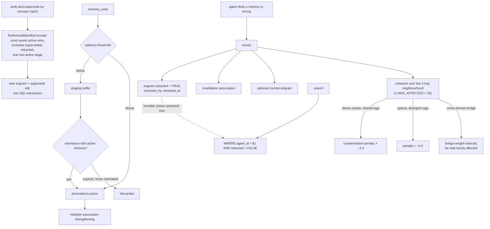

## 1. Executive Summary

AgentWorkingMemory is a 45,000-line Apache-2.0 TypeScript memory service for
coding agents — local SQLite or PGlite, local ONNX embedding models, an MCP
server with 16 tools, no cloud and no API keys.

**The mechanism worth the report is in `src/engine/retraction.ts`**, and it
starts from a critique the file quotes against itself:

> "You need explicit anti-salience for wrong info. Otherwise wrong memories
> persist and compound mistakes."

The retraction path does four things: marks the engram retracted "(not deleted —
audit trail)", creates an invalidation association, optionally writes a
counter-engram with the correct information, and reduces the confidence of
associated engrams — a contamination check.

**The fourth step is where it gets interesting.** Version 0.8.5 weights that
contamination penalty by how coherent the retracted memory's neighbourhood is,
and the docstring gives the reasoning and the citation:

> "The Continued Influence Effect (Carrillo et al., ICCM 2025) shows that
> misinformation persists in human cognition because it lives inside a *coherent
> narrative*, not as an isolated fact. Correcting one chunk doesn't displace the
> narrative unless the correction also propagates through the connected
> structure."

So it computes a cohesion score over the 2-hop neighbourhood:

- **Dense narrative cluster** (high internal-edge density, shared tags) →
  penalty amplified ~1.5×. "The whole cluster shares the wrong story."
- **Isolated engram** (sparse edges, divergent tags) → penalty dampened ~0.5×.
  "No narrative to disrupt."
- **Cross-domain bridge** (low cohesion across an edge) → the bridge weight is
  reduced but far-side neighbours are barely affected.

And it bounds the cost in the same comment: "Cohesion is computed at retract time
(no schema/consolidation changes). Cost: bounded by MAX_AFFECTED (20 nodes) × one
batched `getAssociationsForBatch` call — typically 10-25ms."

A published cognitive-science finding, an explicit translation into a graph
operation, three named regimes with their multipliers, and a stated cost with a
hard cap. Most systems in this atlas correct a fact and leave everything that was
inferred from it untouched.

**The second thing worth taking is a metric** — section 10's `discardRegret`.

## 2. Mental Model

Not everything written becomes memory. A write is scored for salience; weak
signals go to a **staging buffer** — "modeled on hippocampal consolidation —
provisional encoding that only persists if reactivated" — which periodically
checks staged engrams for resonance with active memory, promotes the ones that
resonate and discards the ones that never did.

Active engrams accumulate Hebbian associations, decay, and can be superseded by
concept match or retracted as wrong.



## 3. Architecture

`src/core` holds the write-side machinery — `salience`, `write-pipeline`,
`auto-tagger`, `entity-extract`, `embeddings`, `hebbian`, `decay`,
`query-expander`, `reranker`, `lite-compress`, plus an ML worker so model
inference does not block.

`src/engine` holds the epistemic machinery — `activation`, `confidence`,
`connections`, `consolidation` and its scheduler, `eviction`, `staging`,
`retraction`, `eval`.

`src/storage` implements one `IEngramStore` interface over PGlite, SQLite and
Postgres, with tables for `engrams`, `associations`, `agents`,
`activation_events`, `staging_events`, `retrieval_feedback`, `episodes`,
`conscious_state`, `entity_mentions` and `entity_aliases`.

49 test files.

## 4. Essential Implementation Paths

**Retract** — `src/engine/retraction.ts` (the critique and the four steps
`:4-14`, the Continued Influence Effect derivation `:16-37`,
`NeighborhoodCohesion` `:42`).

**Stage** — `src/engine/staging.ts` (`StagingBuffer`, the periodic resonance
check).

**Supersede** — the Form B atomic write-and-supersede path exercised by
`tests/core/supersede-form-b.test.ts`.

**Exclude** — `src/storage/pglite.ts` (`AND retracted = FALSE` at `:326`,
`:344`, `:367`, `:396`, `:506`, `:558`, `:577`; `retractEngram` `:475`).

**Measure** — `src/engine/eval.ts` (the four dimensions `:4-12`, `discardRegret`
`:93-94`).

## 5. Memory Data Model

An engram carries a `concept` and `content` separately — the concept is what
supersession matches on — plus `salience`, `confidence`, `tags`, an
`accessCount`, a stage, and the retraction trio `retracted`, `retracted_by`,
`retracted_at`.

Associations are first-class rows strengthened by Hebbian co-activation, and
retraction adds an **invalidation** association rather than removing edges, so
the graph records that one engram contradicts another.

`v0.7.x` added optional metadata on writes — `project`, `topic`, `session_id` —
and the release note is honest about what that costs: re-running
`awm setup --global` "updates your CLAUDE.md with instructions for the agent to
use them", i.e. the metadata is only as good as the agent's compliance with a
prompt.

## 6. Retrieval Mechanics

Activation-weighted search with query expansion, a reranker, and FTS5 BM25 as the
lexical arm. `agent_id = $1` is the first condition on every read, and separate
memory pools per folder are documented, so a stored scope key reaches the query —
the `scope_enforced` mark.

`retracted = FALSE` is the second condition, appended at seven query sites, with
`includeRetracted` as the opt-in. A retracted engram is therefore invisible to
normal recall and still recoverable by an explicit query, which is the right
default pair.

## 7. Write Mechanics

The salience filter is the gate: below threshold goes to staging, which is
periodically checked for resonance and either promoted or discarded. That is a
genuinely different answer to "should I store this" than a confidence score —
the decision is *deferred* and resolved by whether the rest of memory turns out
to relate to it.

Correction has two shapes. **Supersession** — Form B — finds "the most recent
active engram with matching concept, write new engram, supersede old, all in one
SQL transaction", with the match explicitly excluding "superseded + retracted +
non-active stage". **Retraction** is for wrongness rather than obsolescence, and
carries the contamination propagation.

Nothing is keyed on the retracted *value*: `retracted` marks a row, and a later
write of the same content is a new engram. The retraction records who and when,
not what-must-never-return.

## 8. Agent Integration

`npm install -g agent-working-memory && awm setup --global`, then 16 MCP tools
appear in Claude Code. Models download once (~200 MB) and everything runs
locally. There are hooks, a CLI, recipes, and an onboarding pass —
`awm onboard ./docs --repo . --project <name>` — that warm-starts the store from
a project's existing documentation and produces a pack for review before it
lands.

The upgrade note is a small courtesy worth naming: "Your existing memory database
is preserved — all upgrades are backward compatible. New features … are opt-in."

## 9. Reliability, Safety, and Trust

**Trust state — awarded.** `retracted` is a discrete field, set with
`retracted_by` and `retracted_at`, read on every search path, and it withholds a
memory from being treated as true without destroying it.

**Scope enforced — awarded**, per section 6.

**Negative eval — awarded**, per section 10.

**Audit log — withheld, and the gap is specific.** There are three event tables —
`activation_events`, `staging_events` and `retrieval_feedback` — but two of them
are the retrieval half the mark excludes, and the mutation that matters most
writes to the engram row: `UPDATE engrams SET retracted = TRUE, retracted_by =
$1, retracted_at = $2`. So the store knows a memory is retracted and by whom, and
there is no append-only record of the sequence of retractions, supersessions and
confidence adjustments. Given how much of this system's design is about
correcting wrong beliefs, an event log of exactly those corrections is the
missing half.

**Tombstone, bitemporal, human review — no.** The onboarding pack is reviewed by
a person before it lands, which is close, but it is an import-time step rather
than a standing adjudication surface for memory content.

**The contamination penalty is the risk to watch.** Amplifying a confidence
penalty across a dense cluster is the right *direction* and the multipliers —
1.5× and 0.5× — are asserted, not derived. Nothing in the tree measures whether
a cluster penalised at 1.5× was in fact wrong, and a false retraction propagates
further precisely where memory is most interconnected.

## 10. Tests, Evals, and Benchmarks

**No paper of its own**, but a cited one driving a mechanism, which is rarer.
49 test files.

**`tests/integration/memory-lifecycle.test.ts` earns the `negative_eval`
mark** with both polarities in one case:

```typescript
it('excludes retracted by default in search', () => {
  const e = store.createEngram({ … content: 'wrong info' … });
  store.retractEngram(e.id, null);
  const without = store.search({ agentId: AGENT_ID, retracted: false });
  expect(without.length).toBe(0);
  const with_ = store.search({ agentId: AGENT_ID, retracted: true });
  expect(with_.length).toBe(1);
});
```

Retracted material must not be retrieved by default, *and* must still be
retrievable when asked for. Testing both directions is what stops a future
implementation satisfying the first assertion by deleting the row.

**`src/engine/eval.ts` measures the system on four dimensions** — retrieval
quality, connection quality, staging accuracy, memory health — and one of them is
worth stealing outright:

```typescript
discardRegret: activeEngrams.filter(e =>
  e.tags.includes('low-salience') && e.accessCount > 0).length,
```

**Discard regret counts the memories the salience filter nearly threw away that
turned out to be used.** Every system in this atlas that filters on write has a
false-negative rate and almost none of them measure it, because the discarded
material is gone and unmeasurable. Tagging the near-misses instead of dropping
them silently makes the filter's cost observable.

And the honesty beside it: "Task impact (with/without memory) is measured
externally via TaskTrial records" — the one thing the engine cannot measure about
itself, stated rather than implied.

No LoCoMo, LongMemEval or other public benchmark, and no committed results.

**I ran nothing.**

## 11. For Your Own Build

### Steal

- **Propagate a retraction through the narrative, not just the fact.** If your
  memories are connected, correcting one leaves everything inferred from it
  intact. Weighting the contamination penalty by neighbourhood cohesion — up
  where the cluster shares a story, down where the engram is isolated — is the
  right shape, and the Continued Influence Effect is the reason.
- **Bound the propagation and say so.** `MAX_AFFECTED = 20`, one batched
  association fetch, 10–25 ms, computed at retract time with no schema change.
  A correction mechanism that can cascade is one you will disable in production
  unless it is capped.
- **Measure discard regret.** Tag what your salience filter nearly rejected and
  count how often it is later accessed. It is the only way to see the cost of the
  filter you cannot otherwise observe.
- **Defer the keep/drop decision instead of making it at write time.** A staging
  buffer that promotes on resonance and discards on expiry resolves "is this
  important" with evidence that did not exist when the write arrived.
- **Test the exclusion in both directions.** Retracted must not appear by
  default, and must appear when explicitly requested. One assertion alone can be
  satisfied by deleting the row.
- **Separate concept from content.** Supersession matching on a concept, with the
  write and the supersede in one SQL transaction, avoids the two-step that leaves
  both versions live under a crash.
- **Exclude superseded, retracted *and* non-active-stage from the match.** All
  three are "not the current belief" for different reasons, and forgetting one
  makes supersession attach to the wrong row.
- **Quote the critique that motivated the module.** "You need explicit
  anti-salience for wrong info" at the top of `retraction.ts` tells the next
  reader what the file is defending against.

### Avoid

- **Do not record a retraction only on the row.** `retracted_by` and
  `retracted_at` say who and when; they do not give you the sequence of
  corrections, which is what you need when the question is "how did memory get
  into this state".
- **Do not ship asserted multipliers as if derived.** 1.5× and 0.5× are plausible
  and unmeasured, and they amplify the blast radius of a wrong retraction exactly
  where the graph is densest.
- **Do not rely on the agent to supply your scoping metadata.** `project` and
  `topic` arrive because CLAUDE.md asks for them; recall quality then depends on
  prompt compliance.

### Fit

A good fit for a local-first coding agent where you want the memory to *narrow*
over time rather than accumulate — salience filtering, staging, decay, eviction
and retraction are a coherent set of forgetting mechanisms, which is unusual;
most systems in this atlas implement one of the five.

`retraction.ts` is 366 lines and worth reading whatever you build. It is the
clearest example in this corpus of taking a specific published finding about
human memory and turning it into a bounded graph operation with the reasoning
written down.

## 12. Open Questions

- **Were the cohesion multipliers tuned?** 1.5× and 0.5× are stated with a
  rationale and no measurement.
- **What happens to associations of a retracted engram?** An invalidation
  association is added; whether the original edges are also weakened beyond the
  bridge case was not traced.
- **Does `discardRegret` feed back into the salience threshold?** It is computed;
  whether anything acts on it was not established.
- **Are `TaskTrial` records produced anywhere?** The eval header defers task
  impact to them and no producer was located.

## Appendix: File Index

**Retraction** — `src/engine/retraction.ts` (the quoted critique `:5-7`, the four
steps `:9-14`, the Continued Influence Effect derivation and the three regimes
`:16-33`, the cost bound `:34-37`, `NeighborhoodCohesion` `:42-44`)

**Staging** — `src/engine/staging.ts` (the hippocampal framing `:4-14`,
`StagingBuffer` `:19`)

**Evaluation** — `src/engine/eval.ts` (the four dimensions and the external-task
caveat `:3-13`, `discardRegret` `:93-94`, the health counters `:96-100`)

**Storage and exclusion** — `src/storage/pglite.ts` (`AND retracted = FALSE`
`:326`, `:344`, `:367`, `:396`, `:506`, `:558`, `:577`; `retractEngram` `:475`),
`src/storage/pglite-schema.ts` (`engrams` `:26`, `associations` `:98`,
`activation_events` `:121`, `staging_events` `:132`, `retrieval_feedback` `:141`,
`episodes` `:150`, `conscious_state` `:164`), `src/storage/sqlite.ts`,
`src/storage/postgres.ts`

**Write side** — `src/core/salience.ts`, `src/core/write-pipeline.ts`,
`src/core/hebbian.ts`, `src/core/decay.ts`, `src/core/auto-tagger.ts`,
`src/core/query-expander.ts`, `src/core/reranker.ts`

**Tests** — `tests/integration/memory-lifecycle.test.ts` (the retraction
exclusion case `:343-356`), `tests/core/supersede-form-b.test.ts` (the Form B
contract `:3-17`), `tests/storage/pglite-engine-integration.test.ts`,
`tests/integration/mcp-smoke.test.ts`

## History

**2026-08-09** — [`f129a697982c81efd6d488152408a586d7f5f4b0`](https://github.com/CompleteIdeas/agent-working-memory/commit/f129a697982c81efd6d488152408a586d7f5f4b0) — first reading. Screened before reading; the tree was read, never installed, and no test was run.
