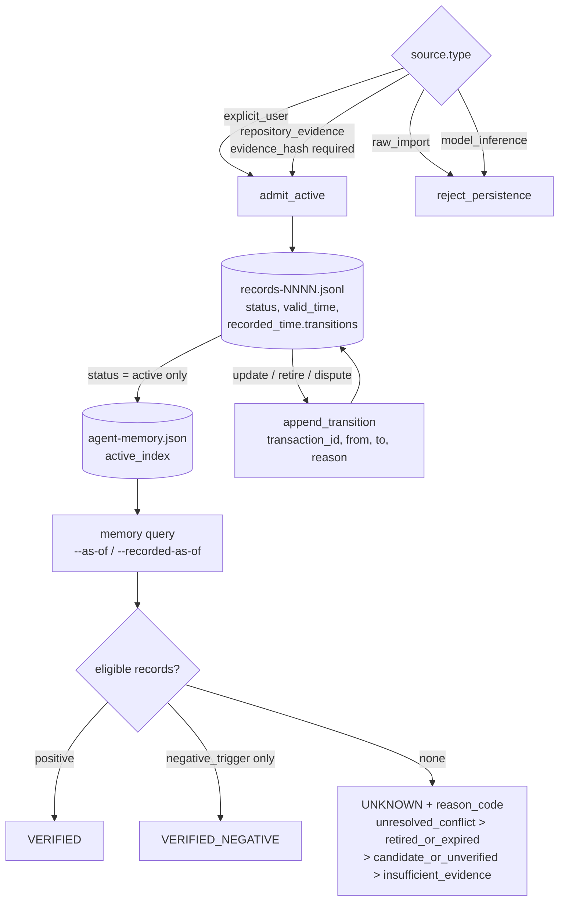

## 1. Executive Summary

AgentDatabase is one person's data warehouse for their own agents, and the part
that matters here is `OpenAIDatabase/` — a canonical memory store built out of
sharded JSONL, a CLI, and an unusual number of machine-readable policies. The
repository is public and **carries no licence file at all**, so the default is
all rights reserved; the README says so obliquely by declaring what may not be
committed rather than what may be reused. Documentation is largely in Chinese.
236 Python files under `OpenAIDatabase/`, 198 live memory records, and a live
`data/` directory the README repeatedly warns is *"活运行态"* — running state, not
a fixture.

**The record schema is among the most complete in this corpus.** One memory
carries `statement`, `kind`, `status`, `scope {type, key}`, `valid_time
{from, to}`, `recorded_time {recorded_at, recorded_by}`, `source {type, ref,
observed_at, evidence_hash}`, `sensitivity {classification, credential_present,
handling, public_repository_allowed}`, `conflict {state, with, resolution}`,
`supersession {supersedes, superseded_by, reason}`, `verification
{evidence_refs}`, a `memory_key`, `negative_triggers`, and a content `hash` with
its canonicalization named — `openai-memory-json-v1` — rather than assumed.

**Three mechanisms are worth the report.** The first is that **abstention is a
first-class answer with a machine-readable reason.** `retrieval_decision`
returns a knowledge state of `VERIFIED`, `VERIFIED_HISTORICAL`,
`VERIFIED_NEGATIVE`, `VERIFIED_WITH_NEGATIVE_BOUNDARY` or `UNKNOWN`, and when it
returns `UNKNOWN` it also returns *why*, chosen from a priority order the policy
file fixes: `unresolved_conflict`, then `retired_or_expired`, then
`candidate_or_unverified`, then `insufficient_evidence` — with the list of
`missing_conditions` that would have made an answer possible. Most stores in this
atlas return fewer results when they should abstain. This one returns a refusal
with a diagnosis.

The second is that **a model's inference can never become a durable memory.**
`memory-mutation-policy.json` maps every operation to an admission decision per
source type, and both `raw_import` and `model_inference` map to
`reject_persistence` for `add`, `update`, `retire` and `dispute` alike. Only
`explicit_user` — a user speaking through an agent — and `repository_evidence`
— automation with a required evidence hash — may write. That is the strictest
provenance gate read in this corpus, and it is a policy file, not a comment.

The third is the **160-case gold benchmark**, generated deterministically and
committed with its schema, its cases, and its run reports. Eight categories of
twenty: extraction, cross-session, temporal, update, abstention, forgetting,
conflict, cross-agent. Every case names `expected_ids`, `forbidden_ids`,
`hard_negative_ids`, `should_abstain` and `stale_or_retired_trap`, and the `as_of`
object carries **both** a `valid_time` and a `recorded_time`. Twenty cases whose
correct answer is "I don't know" and twenty built on retired records are two
things this atlas has said repeatedly that nobody benchmarks.

**And then two findings that cut the other way, both from the repository's own
committed data.**

Every one of the 198 live records has `source.type: "raw_import"` and
`recorded_time.recorded_by: "importer"` — a source the shipped mutation policy
refuses to persist. The entire live store therefore consists of records the
current policy would not admit, because it predates the policy. Nothing has
superseded anything (`superseded_by` is null on all 198), no conflict has ever
been raised (`conflict.state` is `none` on all 198), and not one record carries a
transition. The lifecycle machinery is built, reachable through
`memory mutate`, and has never run on this data.

And the committed evaluation reports show **1.0 accuracy on all eight
categories**, with every hard gate passing, for an algorithm named
`deterministic_eligible_scope_alias_ranker.v1` and `llm_judge: null`. A
deterministic filter, scoring perfectly on a synthetic set generated by the same
repository, against distractors constructed from the same topic tuples along the
dimensions that filter checks. The report itself declares
`gold_provenance.human_approval_claimed: false`. This is the clearest instance in
the atlas of a benchmark that measures whether a pipeline is connected, presented
in the vocabulary of one that measures whether recall is good.

## 2. Mental Model

A claim becomes a durable memory here only by passing an admission matrix, and
the matrix is indexed by *where the claim came from* rather than by what it says.
`explicit_user` and `repository_evidence` may add; `raw_import` and
`model_inference` may not, for any operation. An admitted record enters at a
`status`, and status is what decides whether the agent ever sees it: the
forgetting policy's `eligible_statuses` is the single-element list `["active"]`,
`inactive_default` is `exclude`, and the boot file the agent reads carries an
index of the active records only — six of the hundred and ninety-eight.

A memory stops being a belief by transition, never by deletion. `retire` sets
the status, closes `valid_time.to`, and appends a transition row; the policy names
the semantics outright — `"retirement_semantics":
"retrieval_exclusion_not_history_deletion"`. `dispute` moves a record to
`disputed` with an unresolved conflict, which the eligibility filter also
excludes, so a contested claim stops being answerable *without* anyone deciding
who was right. That is the rarest state in this design and the most useful: most
systems in this atlas can only mark a winner.

And when nothing survives eligibility, the system says so. The abstention path is
not an empty result set — it is `UNKNOWN` plus the reason the candidates failed,
in a fixed priority so that "there was a conflict" outranks "it had expired"
outranks "it was never verified" outranks "there was nothing".

## 3. Architecture

Nothing runs as a service. The store is files: `data/memory/records/records-0001.jsonl`
plus a manifest, `data/memory/active/` as a rendered active view in both JSONL and
Markdown, `data/memory/candidates/` as one file per extraction run,
`data/memory/curation/core_profile_review.json` as the human layer, and
`data/memory/agent-memory.json` as the boot index. `secret_refs/` holds
references rather than secrets.

Operating it means running Python scripts: `memory.py` for validate, build,
query, import, export, doctor, benchmark, mutate and apply; a family of
`build_memory_atlas_*` scripts for the derived public view; and an
`atlasctl build-atlas` CI entry point the README says reads the live directory on
every run. Automation C is the write path for machine-authored changes and it is
described as a settlement protocol rather than a job: a branch prefix, exactly one
non-draft PR, zero issue mutations, no direct write to the default branch, a
required CI check, and a terminal state of `PR=0/Issue=0/non-main=0`.

The operator cost worth naming is that the live data directory is
simultaneously the runtime state and a mirrored artifact. `WHERE_IS_THE_DATA.md`
exists because that ambiguity bit somebody: it warns future agents in bold not to
re-upload or re-sync the mirror, records that 691 files matched by git blob sha
on 2026-07-23, explains the two-file difference as expected, and points at a
machine-readable `MIRROR_STATUS.json` carrying
`status: MIRRORED_DO_NOT_REUPLOAD`. A signpost written for the next agent, with a
machine-readable twin, is a good pattern for any repository an agent is expected
to act on.

## 4. Essential Implementation Paths

**Admission** — `scripts/memory_mutation.py` against
`config/memory-mutation-policy.json`. An envelope carries the operation, the
source, an authorization block, `valid_time`, a reason and a transaction id.
Source type selects the admission verdict and the requirements: `explicit_user`
needs no evidence hash and may write any scope; `repository_evidence` requires
one and is limited to `project` and `task`.

**Transition** — `scripts/memory_lifecycle.py:360`. `append_transition` records
the before and after of both the status and the validity bound, with the actor
and the reason, then mutates the record and revalidates the history. An `update`
does three things atomically: retire the target with a transition, point its
`superseded_by` at the new id, and write the new record with `supersedes`
naming the old — then rehash both.

**Projection** — `scripts/memory_lifecycle.py`, `project_record_at` and
`projection_is_effective`. The first reconstructs a record's status and validity
bound as of a *record* time by replaying transitions backwards; the second tests
the validity interval against a *valid* time. Two functions, two axes, and the
CLI exposes both.

**Eligibility and abstention** — `scripts/memory_forgetting.py` against
`config/memory-forgetting-policy.json`. `retrieval_decision` counts eligible
positives, eligible negatives and audit-only records, then returns one of five
knowledge states, with the abstention branch selecting its reason from the
policy's priority list.

**Measurement** — `scripts/build_memory_gold_benchmark.py` generates the 160
cases from a fixed seed and a config; `scripts/evaluate_memory_fault_reliability.py`
and the evaluation runner produce the reports under
`data/derived/evaluation/memory_gold/reports/`.

## 5. Memory Data Model

The interesting fields are the ones most stores lack.

`sensitivity` is a four-field object: a `classification` — 134 live records are
`sensitive`, 64 are `private`, and none are public — a `credential_present`
boolean, a `handling` instruction such as `redacted_summary`, and
`public_repository_allowed`. A record therefore carries its own publication
decision, which is what lets a derived public view be built from a private store
without a second policy.

`negative_triggers` is on every live record and holds sentences about when *not*
to use it — the first record's reads *"Do not overgeneralize beyond the cited
source and validity period."* This is not the same thing as a negative memory
(below); it is a per-record usage boundary carried with the record and rendered
into the agent's context by `memory.py`.

`source` carries `type`, a `ref` precise enough to locate the original inside a
zip inside an export — conversation id and all — an `observed_at`, and an
`evidence_hash`. `verification.evidence_refs` holds hashes of the candidate
history and the evidence.

`hash` names its `canonicalization` alongside its `algorithm` and `value`. A
content hash whose canonicalization is unnamed cannot be recomputed by anyone
else; this one can.

`kind` is enumerated in policy as `answering_rule`, `preference`, `decision`,
`project_context`, `workflow`, `security_boundary`, `fact` and
`negative_trigger`. The live store holds the first seven and **zero** of the
eighth.

## 6. Retrieval Mechanics

The read path is a scan over the shards with filters, not a search engine. There
is no embedding, no index beyond the active view, and no ranker in the shipped
CLI: `memory query` accepts `--id`, `--key`, `--kind`, `--scope`, `--tag`,
`--keyword`, `--as-of`, `--recorded-as-of`, `--include-inactive` and `--limit`,
and is *"active-only by default"*. For a store this size that is the
right amount of machinery.

**Scope is stored, filterable, and not enforced, which is why `scope_enforced` is
withheld.** `scope {type, key}` is on every record over four types, the mutation
policy limits which scopes each source may write, and `parse_scope` accepts
`TYPE` or `TYPE:KEY` — but the filter applies only when the caller passes it, and
nothing binds a caller to its own scope. Ninety-six percent of the live records
are `conversation`-scoped and the boot index mixes scopes freely. The rubric's
line is that a scope stored as a tag and not applied on the read path is not the
mark, and this is a well-designed tag.

What *is* enforced on the read path is status and validity. Inactive records are
excluded by default and reachable only through `--include-inactive`, which the
policy classifies as `audit_only` — a mode name that says what the result may be
used for. The `--as-of` and `--recorded-as-of` pair is the atlas's canonical
bi-temporal read, and it is one of very few in the corpus where the record-time
axis is genuinely queryable rather than merely stored.

## 7. Write Mechanics

**Writes are explicit, transactional and idempotent.** Nothing is extracted in the
background: a mutation is a CLI invocation carrying an envelope with a
`transaction_id`, and replaying the same envelope is detected by comparing the
last transition's transaction id, which returns idempotent rather than
double-applying. Envelope size, statement size and list length are all capped in
policy.

**An update must actually change something.** `normalize_statement(expected) ==
normalize_statement(target)` raises `mutation_update_has_no_new_fact`. An update
whose target is not `active` is refused. A retire whose target is already retired
is refused. A dispute whose target is retired is refused. Each refusal is a
stable error code with no record content in it — the exception class documents
that as its purpose.

**Correction is supersession, not overwriting.** The old record is retired with a
transition, its `superseded_by` points forward, the new record's `supersedes`
points back, and both are rehashed. The history stays queryable through
`--recorded-as-of`.

**And none of it has run.** Zero of the 198 live records carry a transition, a
supersession, or a conflict; every one was written by `importer` from
`raw_import`. This is not the declared-and-unwired defect — the producers are
real and sit on a documented CLI subcommand — but a reader should know that the
lifecycle's correctness is attested by tests and a synthetic benchmark rather
than by any record in the store.

## 8. Agent Integration

The agent's entry point is a file. `data/memory/agent-memory.json` holds an
`active_index` of six records, each with the id, kind, confidence, importance,
scope, validity window, the shard it lives in, and `record_sha256` — so the index
pins the content of the record it points at, and a shard edited underneath it is
detectable.

`build_agent_context_pack.py` assembles what an agent is handed;
`memory.py` renders records with their `negative_triggers` attached, so the usage
boundary travels with the claim into the prompt. There is no MCP server and no
tool: an agent reads files and runs the CLI.

The Codex skills registry under `CodexSkills/` is a separate concern — a mirror
and governance ledger for local skills — and is procedural rather than
declarative memory. It is also where most of the repository's 15,000-odd files
live, almost all of them vendored reference material for individual skills.

## 9. Reliability, Safety, and Trust

**Trust state, bi-temporal, audit log, human review, negative eval — awarded**,
each on the evidence in the frontmatter records.

**Tombstone — withheld, and this is the most interesting near-miss in the
report.** The design has a first-class *negative memory*: `kind:
negative_trigger`, governed by a policy block requiring `verification_state:
verified`, at least one trigger, a validity interval, an authority source of
`explicit_user` or `repository_evidence`, and carrying two rules that most
systems never state — `"infer_from_absence": false` and
`"positive_assertion_allowed": false`. `retrieval_decision` gives it its own
knowledge state, `VERIFIED_NEGATIVE`, and a mixed result gets
`VERIFIED_WITH_NEGATIVE_BOUNDARY` rather than collapsing to the positive.

That is a negative *belief* — "X is not the case, verified, during this interval"
— and the rubric asks for something else: a record of a *rejected value*, keyed
on the value, that stops later extraction re-asserting it. Nothing here is keyed
on a refused value, and no refusal is recorded when an admission fails. The
adjacent guard is stronger in one way and unrelated in another: `model_inference`
and `raw_import` are refused persistence outright, so extraction cannot
re-assert anything at all — but that is a blanket ban on a source, not a memory
of what was refused. And the live store contains zero `negative_trigger` records,
so even the negative-belief half is a specification with a reachable producer and
no instance.

**Scope enforced — withheld**, per section 6.

**The provenance gate is the safety mechanism and it is the right shape.** A
policy file, validated on load with duplicate-key detection, mapping source type
to admission verdict, with per-source requirements for evidence hashes and
allowed scopes. Compare it against the corpus's usual arrangement, where
extraction writes and a reviewer is offered afterwards: here the model's own
output is inadmissible by construction and no review surface is needed for it.

**What that gate cannot do is retro-apply.** Every live record entered as
`raw_import` before the policy existed. A store whose entire content would be
refused by its own current admission rules is in an honest and awkward position,
and the repository does not currently mark those records as grandfathered — their
`status` distribution is the only thing separating them.

**Sensitivity is carried per record and the publication boundary is derived from
it**, with `public_repository_allowed` deciding what may reach the public view.
The README reinforces it in prose — distillations of external commercial products
are `private-only`, *"一个字节都不进本仓"*, not one byte enters this repository —
and `MIRROR_STATUS.json` gives the migration state a machine-readable form. The
weak point is that the whole arrangement depends on a private sibling repository
that cannot be inspected, so the claims about what lives there are unverifiable
from here and are reported as claims.

## 10. Tests, Evals, and Benchmarks

No paper and no citation file. I ran nothing; every figure below is read from
committed artifacts.

The `OpenAIDatabase/tests/` directory holds a test per mechanism —
`test_memory_lifecycle.py`, `test_memory_mutation.py`, `test_memory_forgetting.py`,
`test_memory_gold_evaluation.py`, `test_live_snapshot_store_v31.py`,
`test_memory_atlas_independent_verifier_v32.py`, `test_memory_atlas_r7_raw_integrity.py`
and about thirty more.

**The gold benchmark is the artifact.** 160 cases, eight categories of twenty,
generated by `build_memory_gold_benchmark.py` from a fixed seed
(`PAM1-GOLD-20260716-v1`) and a config, committed as JSONL with a schema
alongside. The category list is what makes it unusual: **abstention** and
**forgetting** are twenty cases each, and both are things this atlas's benchmarks
page has said are absent from the field's public sets. Each case carries
`expected_ids`, `forbidden_ids`, `hard_negative_ids`, `should_abstain`,
`abstain_conditions`, `stale_or_retired_trap`, an `as_of` naming both time axes,
and `source_definition_refs` crediting the public benchmarks each category's
shape was taken from — LongMemEval, LoCoMo and FAMA.

The committed reports carry hard gates rather than a single score:
`abstention_precision` and `abstention_recall` at 0.9, `current_state_accuracy`
at 0.92, `critical_stale_use_count` at exactly 0, a cross-profile pass count, and
a dataset-size floor. Gating a release on *zero* uses of a stale record is a
better contract than any accuracy threshold.

**And the result is 1.0 on all eight categories, with every gate passing.** That
is the number to think about. The evaluated algorithm is
`deterministic_eligible_scope_alias_ranker.v1` — a filter on eligibility, scope
and alias — with `llm_judge: null` and `gold_label_dependency_count: 0`. The
cases are generated by the same repository, from a table of twenty topics, where
each case's target and its hard negative are built from the same tuple and differ
along scope, validity or status: exactly the three dimensions the ranker filters
on. A deterministic filter tested against distractors constructed to differ only
on what it filters is being asked whether it is wired up.

The repository is not hiding this. `gold_provenance` records
`human_approval_claimed: false`, names the curator role, the validator role and
the tested algorithm role separately, and the config's own
`algorithm_dependency_count: 0` is an attempt to state that the gold labels do
not depend on the algorithm. What is missing is the other independence: the
*cases* depend on the algorithm's own axes. A second grader, a real retrieval
implementation, or one category of cases written by someone who had not read
`retrieval_decision` would separate "the filter works" from "the design is
right".

The honest summary: **the scaffolding is better than almost anything in this
atlas and the discriminating power is unmeasured.** Every structural piece a
memory benchmark needs is here — forbidden ids, hard negatives, required
abstentions, a stale trap, two time axes, hard gates, committed reports, a fixed
seed. The corpus is the part that a single author cannot easily make adversarial
to themselves.

## 11. Patterns Worth Stealing

### Steal

**Make abstention an answer with a reason code.** `UNKNOWN` plus one of
`unresolved_conflict`, `retired_or_expired`, `candidate_or_unverified`,
`insufficient_evidence`, plus the `missing_conditions` that would have permitted
an answer. An empty result set tells a caller nothing; this tells them whether to
resolve a conflict, refresh a fact, or verify a candidate.

**Fix the abstention reason priority in policy rather than in code order.** The
list is a config key, so the diagnosis a user sees does not depend on which
branch a maintainer happened to write first.

**Decide admission by source type, in a table.** `explicit_user` and
`repository_evidence` may write; `raw_import` and `model_inference` may not, for
any operation. A single table, validated on load, that a reviewer can read
without following a call graph.

**Give a record its own publication decision.** `sensitivity.public_repository_allowed`
alongside a classification, a credential flag and a handling instruction means
the derived public view needs no second policy and cannot drift from the first.

**Name the canonicalization beside the hash.** `openai-memory-json-v1` is what
makes `sha256:…` reproducible by someone else.

**Have the index pin the content it points at.** `active_index` entries carry
`record_sha256`, so an edited shard is detectable from the boot file alone.

**Write the transition before mutating the record.** `append_transition` captures
`from_status`, `to_status`, `valid_to_before`, `valid_to_after`, the actor and the
reason, and only then changes the record — with the transaction id doubling as
the idempotency key.

**Let a claim be disputed without being adjudicated.** `disputed` plus
`conflict.state: unresolved` removes a contested record from answers while
deciding nothing. Most systems here can only pick a winner, which forces a
judgement at the worst moment.

**Leave a signpost for the next agent, with a machine-readable twin.**
`WHERE_IS_THE_DATA.md` and `MIRROR_STATUS.json` say the same thing to a human and
to a program, and the file exists because an agent nearly did the wrong thing.

**Gate a release on zero stale uses.** `critical_stale_use_count == 0` is a
better contract than an accuracy threshold, because it names the failure rather
than averaging it away.

### Avoid

**Do not read 1.0 across every category as a result.** When the same repository
generates the cases, builds the distractors along the axes the algorithm
filters, and reports perfect scores with no LLM judge, the number measures
wiring. The categories are the contribution; the accuracy is not.

**Do not let the store predate its own admission policy silently.** Every live
record was written by a source the policy now refuses, and nothing marks them as
grandfathered.

**Do not ship a schema whose optional halves are never populated.** `conflict`,
`supersession` and `recorded_time.transitions` are present on all 198 records and
empty on all 198. The machinery is real; a reader cannot tell that from the data.

**Do not treat an optional scope filter as scoping.** The key is on every record
and no read path defaults it to the caller.

### Fit

This suits someone building a personal memory substrate they intend to reason
about formally — who wants provenance, validity intervals, an audit trail and a
refusal semantics, and is willing to drive it from a CLI over two hundred records
rather than query a database over millions. The policy-as-artifact discipline
is the transferable part and it does not depend on the scale.

It fits badly as a component. There is no licence, the documentation is largely
in Chinese, the store's read path is a file scan, and a private sibling
repository holds material the public one only points at. What a reader should
take is not the system but four artifacts — the mutation policy, the forgetting
policy, the transition function and the gold-case schema — each of which is
readable in isolation and better than the corresponding thing in most projects
here.

## 12. Antipatterns / Risks

- **A perfect benchmark score on a self-generated corpus.** 1.0 on all eight
  categories for a deterministic filter, with the hard negatives differing from
  the targets on precisely the dimensions the filter checks.
- **The live store has exercised none of the lifecycle.** No transitions, no
  supersessions, no conflicts, no negative-trigger records. Correctness rests on
  tests and synthetic cases.
- **The admission policy cannot see its own history.** All 198 records came in as
  `raw_import`, which the policy now rejects for every operation.
- **No licence.** A public repository with no `LICENSE` file is all rights
  reserved by default, whatever the README implies about reuse.
- **Scope is a tag.** Four scope types, a filter that must be asked for, and a
  boot index that mixes them.
- **The public/private split cannot be verified from here.** The claims about
  what lives in the private sibling — and about the mirror being byte-identical —
  are stated in a Markdown file and a JSON status blob, and no check in this
  repository can confirm them.
- **Two hundred records is not a scale test.** A file scan per query is correct
  today and the benchmark's `performance_v1.json` is measuring a corpus small
  enough that any implementation passes.

## 13. Build-vs-Borrow Takeaways

Borrow the two policy files. `memory-mutation-policy.json` and
`memory-forgetting-policy.json` are each under a hundred lines, are validated on
load, and encode decisions most projects leave implicit: who may write, what
happens to an inactive record, when to abstain and in what order to explain why.

Borrow `append_transition` verbatim if you have a status field. It is thirty
lines, it makes the audit trail a property of the record rather than a side
table, and the transaction id gives idempotency for free.

Borrow the gold-case schema — `expected_ids`, `forbidden_ids`,
`hard_negative_ids`, `should_abstain`, `abstain_conditions`,
`stale_or_retired_trap`, a two-axis `as_of` — and then have someone who has not
read your retrieval code write the cases.

Do not borrow the store itself. Sharded JSONL with a CLI scan is right for two
hundred records and nothing here addresses what happens three orders of magnitude up.

## 14. Open Questions

- What does the gold benchmark score against a retriever that was not built from
  the same eligibility axes? The scaffolding supports the experiment and no run
  in the tree performs it.
- Will the 198 imported records ever be re-admitted under the current policy, or
  are they permanently a grandfathered layer the rules do not describe?
- What produces a `negative_trigger` record in practice? The kind is enumerated,
  the policy is written, the retrieval path handles it, and no instance exists.
- The curation overrides are consumed by the analysis pipeline. Does the
  canonical `memory query` path see them, or can the human-corrected statement
  and the stored statement diverge for a reader who uses the CLI?

## 15. Appendix: File Index

| Path | What it holds |
| --- | --- |
| `OpenAIDatabase/data/memory/records/records-0001.jsonl` | The 198 live records, one JSON object per line |
| `OpenAIDatabase/data/memory/agent-memory.json` | The boot index of six active records, each pinned by `record_sha256` |
| `OpenAIDatabase/data/memory/curation/core_profile_review.json` | The human review layer, with a stated review policy and per-record overrides |
| `OpenAIDatabase/config/memory-mutation-policy.json` | The source-to-operation admission matrix and the per-source requirements |
| `OpenAIDatabase/config/memory-forgetting-policy.json` | Eligibility, abstention with its reason priority, negative memory, retirement semantics, FAMA |
| `OpenAIDatabase/scripts/memory_lifecycle.py` | `append_transition`, `project_record_at`, `projection_is_effective` |
| `OpenAIDatabase/scripts/memory_mutation.py` | Add, update, retire, dispute; idempotency by transaction id; the no-new-fact check |
| `OpenAIDatabase/scripts/memory_forgetting.py` | `retrieval_decision`, the five knowledge states, FAMA scoring |
| `OpenAIDatabase/scripts/memory.py` | The CLI: validate, build, query, import, export, doctor, benchmark, mutate, apply |
| `OpenAIDatabase/scripts/build_memory_gold_benchmark.py` | Deterministic generation of the 160 cases from a fixed seed |
| `OpenAIDatabase/data/derived/evaluation/memory_gold/benchmark_v1.jsonl` | The cases, with forbidden ids, hard negatives and abstention conditions |
| `OpenAIDatabase/data/derived/evaluation/memory_gold/reports/` | Committed run reports with hard gates and per-category accuracy |
| `OpenAIDatabase/data/WHERE_IS_THE_DATA.md`, `MIRROR_STATUS.json` | The signpost for the next agent, and its machine-readable twin |

## History

**2026-08-20** — [`031939e5af4db5724f8eda129e63d4ef2463fb61`](https://github.com/LinzeColin/AgentDatabase/commit/031939e5af4db5724f8eda129e63d4ef2463fb61) — first reading. Screened before anything was read: one auto-run surface (`.githooks/`) and a long tail of build-time execution points inside vendored skill reference material under `CodexSkills/`; nothing was installed and no script was run. The record schema, both policy files and the full 198-record shard were read before any absence claim was written, which is how the empty `conflict` and `supersession` fields and the all-`raw_import` provenance were established. Marks: `trust_state`, `bitemporal`, `audit_log`, `human_review`, `negative_eval`. `tombstone` withheld — the `negative_trigger` kind is a verified negative belief rather than a value-keyed refusal record, and no instance exists in the store. `scope_enforced` withheld — the scope key is stored on every record and applied only when a caller passes `--scope`.
