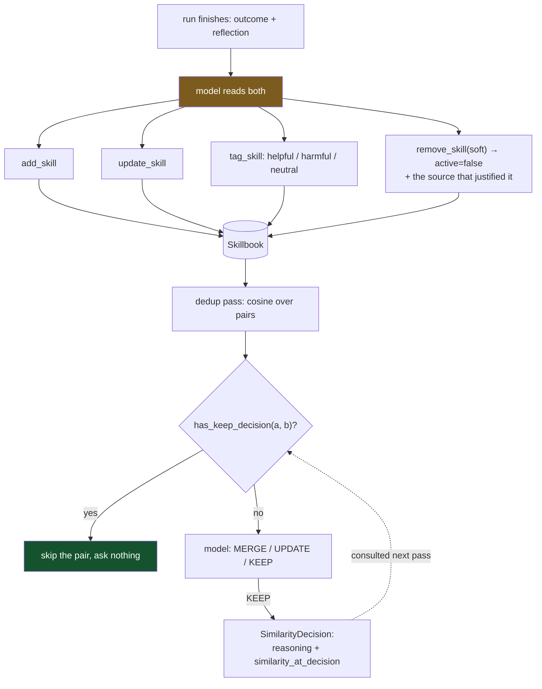

## 1. Executive Summary

ACE is a library for agents that learn from their own runs: 31,500 lines of
Python, Apache-2.0, 788 commits since 1 November 2025. The memory is a
**skillbook** — a set of `Skill` records, each an `issue` (the situation) and an
optional `insight` (what to do about it), tagged into sections and retrieved by
embedding similarity. After a run, a model reads the outcome and the reflection
and calls `add_skill`, `update_skill`, `tag_skill` or `remove_skill`. It is the
procedural-memory shape [TigrimOSR](../tigrimosr/) has, without the staging step.

**The mechanism worth taking is the record of a decision *not* to act.** ACE runs
a deduplication pass: pair every skill with every other, keep the pairs above a
cosine threshold, and ask a model whether to merge them, update one, or keep both.
When the answer is keep, it stores this:

```python
@dataclass
class SimilarityDecision:
    """Record of a SkillManager decision to KEEP two skills separate."""
    decision: Literal["KEEP"]
    reasoning: str
    decided_at: str
    similarity_at_decision: float
```

Keyed on `frozenset([id_a, id_b])`, serialised into the skillbook JSON, and — the
part that matters — consulted before the pair is ever offered again
(`ace/deduplication/detector.py:234`):

```python
if skillbook.has_keep_decision(skill_a.id, skill_b.id):
    continue
```

Two skills that look alike and are not will look alike forever. Without this,
every consolidation pass re-proposes them, spends a model call, and re-derives
the same answer — or, worse, re-derives a different one and merges two records
that a previous pass correctly kept apart. This atlas is full of systems that
record what they did and none that record what they decided not to do. **A "no"
with its reasoning and the similarity that provoked it, consulted before the
question is asked again, is the cheapest correction mechanism on this page.**

It is not a `tombstone` under the atlas's definition, which asks for a durable
record of a rejected *value* keyed on the value. This is a rejected *merge*,
keyed on a pair of ids. But it is the same instinct applied one level up, and it
is enforced where several better-known mechanisms in this corpus are not — see
[MemLedger](../memledger/), whose delete is durable and whose dedup lookup skips
it.

**The counterweight is what the counters are allowed to do.** Every skill carries
`used_count`, `helpful_count`, `harmful_count` and `neutral_count`, moved by
explicit `tag_skill` calls from a model that judges each injected skill against
the run's outcome. And the prompt governing that model forbids acting on them
mechanically:

> *"Use them as one input among several when judging a skill — never as a hard
> removal trigger. A heavily-used skill can legitimately accumulate
> `harmful_count` while still being net-positive. REMOVE only when the
> reflection's evidence shows the skill is consistently misleading or
> unsalvageable."*

That is a correct observation about the metric — usage and harm correlate, so a
threshold on harm selects for popularity — and it is worth reading beside
[AgentRecall-X](../agentrecall-x/), which reaches the opposite conclusion and
lets a measured precision automatically strip a rule's authority. Two systems,
the same problem, opposite answers, both reasoned. ACE's costs it the
automation; AgentRecall-X's costs it a dependency on a self-reported signal.

## 2. Mental Model

A skill is **a situation and what to do about it**, with a record of how it has
gone:

| Field | Role |
| --- | --- |
| `section`, `keywords` | where it files and what it matches |
| `issue` | the situation, and the primary embedding text |
| `insight` | the actionable guidance, optional |
| `occurrences` | `InsightSource` records — where this came from |
| `active` | false hides it from every listing |
| `used_count`, `helpful_count`, `harmful_count`, `neutral_count` | outcomes |

`active` is the epistemic state and it earns `trust_state` narrowly: it is a
discrete field, and `skills()` excludes inactive records unless a caller passes
`include_invalid=True`, so a deactivated skill is genuinely withheld from use
rather than merely flagged. The three outcome counters are scores rather than
states, and by explicit instruction they gate nothing.

Removal has two levels and the distinction is the good part.
`remove_skill(soft=True)` — the default — sets `active = False` **and appends the
insight source that justified the removal** to the skill's own `occurrences`, so
the record carries the evidence for its own retirement. `purge` drops it from the
dictionary entirely.



Green is the loop that closes. Amber is everything else: a model following a
prompt.

## 3. Architecture

A library, not a service. `Skillbook` is an in-process object with a lock,
serialised through `to_dict`/`from_dict` to JSON — and embeddings are excluded
from the file (*"JSON never carries embeddings in v2"*) and recomputed, which
keeps the artifact readable and diffable at the cost of an embedding pass on
load.

The packages divide cleanly: `ace/core` (skillbook, contexts, environments,
`insight_source`, a `metered_model`), `ace/deduplication` (detector, manager,
operations, prompts), `ace/implementations` (the skill manager and its prompts),
`ace/integrations` (an MCP server), `ace/providers`, `ace/observability`. There
is also `benchmarks/` with task loaders and a base harness, and an `ace-eval`
directory.

Embeddings come from LiteLLM or sentence-transformers, both behind `_has(module)`
availability checks, so the dedup pass degrades rather than failing when neither
is installed — worth knowing, because a skillbook with no embeddings has no
similar pairs and consolidation silently does nothing.

## 4. Essential Implementation Paths

| Path | Location |
| --- | --- |
| `SimilarityDecision` and its fields | `ace/core/skillbook.py:291` |
| KEEP decisions consulted before pairing | `ace/deduplication/detector.py:234` |
| `has_keep_decision`, `set_similarity_decision` | `ace/core/skillbook.py:538`, `:548` |
| Decisions serialised with the skillbook | `ace/core/skillbook.py:558`, `:638` |
| Soft removal records its own justification | `ace/core/skillbook.py:485` |
| Inactive skills excluded from listings | `ace/core/skillbook.py:523` |
| The counter-usage instruction | `ace/implementations/prompts.py:480` |
| Pair detection, section-scoped by config | `ace/deduplication/detector.py:190` |

## 5. Memory Data Model

`Skill` is described in section 2. Two details are worth separating.

**`occurrences` is a list, not a count.** Each entry is an `InsightSource`
recording where the skill came from, and `_append_unique_sources` keeps them
distinct. A skill that recurs across five runs carries five sources rather than a
`seen: 5`, so the evidence for a rule survives beside it and — through the soft
removal path — the evidence for retiring it lands in the same list. That is
provenance at the granularity the reasoning actually happens at.

**`embedding_text()` is `issue`, then `insight`, then keywords.** The similarity
that drives consolidation is computed over the situation first and the guidance
second, so two skills about the same problem with different remedies score as
near-duplicates. That is the right default for finding merge candidates and it is
also exactly the case a KEEP decision exists to settle — the prompt names it:
*"KEEP when they serve different contexts (batch vs real-time, different APIs)."*

There is no supersession pointer, no validity time and no rejected-value record,
so `tombstone` and `bitemporal` are both withheld. There is also no scope key of
any kind: one skillbook belongs to one agent, so `scope_enforced` is withheld
too.

## 6. Retrieval Mechanics

Skills are retrieved by embedding similarity over `embedding_text()` and injected
into the agent's context; `mark_used` bumps `used_count` for each injected skill
that is still active. Inactive skills are excluded at the `skills()` boundary
rather than at each call site, which is the right place for that filter.

The interesting read path is the deduplication one. `detect_similar_pairs`
compares every pair above a configured threshold, optionally restricted to within
a section (`within_section_only`), sorts descending by similarity, and hands the
list to a model. The KEEP filter sits inside the inner loop of `_find_similar`,
so a settled pair costs one dictionary lookup rather than a cosine computation
and a model call.

One consequence of keying on ids: `update_skill` rewrites a skill in place and
keeps its id, so a KEEP decision survives an edit to either side. That is
probably right — the pair was judged on meaning, and an edit that changes the
meaning enough to warrant re-litigating is indistinguishable from one that does
not. But `similarity_at_decision` is stored and never compared against the
current similarity, so a pair that has drifted much closer since the decision is
still skipped. The field that would let the system notice is recorded and unused.

## 7. Write Mechanics

Writes are a model's tool calls, made after a run, from the outcome and the
reflection. There is no extraction on the hot path and no background scheduler;
consolidation is a pass someone invokes.

The workflow prompt is the specification, and it is specific in the ways that
matter: tag every injected skill helpful, harmful or neutral from the outcome;
update an existing skill rather than adding a near-duplicate; remove only on
evidence of being *"consistently misleading or unsalvageable"*, never on
`harmful_count` alone. `UpdateOperation` and `UpdateBatch` give the model a
structured shape to return, so the calls are validated rather than parsed out of
prose.

That places ACE in the same category as several systems reviewed here recently:
the storage layer is careful and the policy layer is a prompt. The difference is
that ACE's one automated decision — skip a settled pair — is the one that needed
to be automatic, because it is the one that would otherwise be re-asked forever.

## 8. Agent Integration

A Python SDK, an MCP server under `ace/integrations/mcp`, LiteLLM-backed
providers, and a `benchmarks/` package with task loaders and a base harness. The
MCP handlers expose the counters (`harmful=getattr(s, "harmful_count", None)`),
so an agent driving ACE over MCP can see a skill's track record.

`human_review` is withheld. There is no surface where a person inspects,
approves or adjudicates a skill; the reviewer in this design is a model reading a
reflection, and `export_markdown.py` renders the skillbook for a human to read
rather than to act on.

## 9. Reliability, Safety, and Trust

The trust model is one flag and three counters, and the design is honest that the
counters are advisory. What holds the quality line is the removal criterion —
evidence of being consistently misleading — evaluated by a model against the
reflection. Whether that holds depends entirely on the reflection being accurate,
and nothing here measures that.

The soft-removal path is the strongest reliability property: a retired skill
keeps its id, its counters, its sources and the source that justified retiring
it, and is excluded from every listing. Recovering from a wrong removal is
setting a boolean. `purge` is available and is not the default.

Prompt injection reaches the skillbook the ordinary way — content in a run
becomes a reflection becomes a skill — and there is no trust state to mark a
skill whose provenance is untrusted. `InsightSource` records where a skill came
from without grading it.

The embedding-availability check is a quiet failure mode worth flagging: with
neither LiteLLM nor sentence-transformers present, `compute_embedding` returns
`None`, skills have no embeddings, `_find_similar` skips them, and consolidation
reports nothing to do. A skillbook can therefore accumulate duplicates with the
dedup pass running clean.

## 10. Tests, Evals, and Benchmarks

31 test files, plus `benchmarks/` with a base harness and task loaders and four
top-level live-test scripts (`test_rr_live.py`, `test_sm_live.py`,
`test_sm_e2e.py`, `test_sm_tau_retail.py`). The naming suggests the intended
comparison — a τ-bench retail run — is set up as a live test rather than a
committed result.

I did not run them, and no committed benchmark result artifact was found, so the
harness is present and the numbers are not. For a project with 788 commits and an
explicit "agents that learn from experience" claim, a committed before-and-after
on any of its own benchmark tasks is the measurement a reader most wants and the
one the repository does not contain.

`negative_eval` is withheld: no committed case asserts that particular material
must not be retrieved.

## 11. For Your Own Build

### Steal

**Record the decision not to merge, and check it before asking again.** Four
fields — the pair, the verdict, the reasoning, the similarity at the time — a
dictionary keyed on the pair, and one `continue` in the detector's inner loop.
It turns a recurring judgement into a settled one, saves the model call, and
prevents a later pass reaching the opposite conclusion on the same evidence. This
is the single most transferable idea in the report and it applies to any system
that repeatedly proposes the same merge, link or match.

**Make soft removal record its own justification.** `remove_skill(soft=True)`
appends the insight source that motivated it to the skill's own `occurrences`, so
the record carries the argument for its retirement. Most systems that soft-delete
store a boolean and a timestamp.

**Keep the occurrences, not a count.** Five sources beat `seen: 5`, because the
evidence stays inspectable and the retirement evidence lands in the same list.

**Say what a counter may not decide.** *"Never as a hard removal trigger. A
heavily-used skill can legitimately accumulate `harmful_count` while still being
net-positive."* Writing the metric's failure mode into the prompt that consumes
it is cheaper than discovering it in production.

### Avoid

**Do not store a comparison value you never compare.** `similarity_at_decision`
is exactly the field needed to notice that a settled pair has drifted closer, and
nothing reads it. Either use it — re-open the question when similarity moves by
more than some margin — or drop it.

**Do not let a missing optional dependency turn a maintenance pass into a
no-op.** Without an embedding backend, consolidation finds nothing and says so
cheerfully. A pass that cannot do its job should say that, not report success.

**Do not ship a benchmark harness without a committed result.** Four live-test
scripts and a task loader package, and no numbers in the tree. The claim the
project leads with — agents that improve over runs — is the one it has built the
apparatus to check and has not published.

### Fit

Take ACE if you want procedural memory that a model curates from its own runs and
you are comfortable that the curation is a prompt. The skillbook is a plain JSON
artifact, the removal path is reversible, and the KEEP mechanism is worth copying
into anything that does repeated pairwise matching, memory system or not.

Do not take it if you need the quality of the skillbook to be measurable. The
counters are advisory by design, nothing gates on them, and the benchmark that
would show whether skills accumulate value is unrun in the repository.

## 12. Antipatterns / Risks

- **`similarity_at_decision` is recorded and never compared**, so a drifted pair
  stays settled.
- **KEEP is keyed on ids**, so a rewritten skill keeps a decision made about
  different text.
- **No embedding backend means no consolidation**, reported as nothing to do.
- **The counters gate nothing** by explicit instruction; removal quality rests on
  the reflection.
- **No committed benchmark result** despite a benchmark package and four live
  test scripts.
- **No scope key of any kind** — one skillbook per agent.

## 13. Build-vs-Borrow Takeaways

Borrow the KEEP record. It is under thirty lines including the dataclass, the two
accessors and the detector's `continue`, and it generalises past memory entirely
— any pipeline that proposes the same merge to a human or a model on every pass
should be storing the refusals.

Build the measurement. ACE has the harness, the task loaders and the counters,
and the missing piece is a committed run showing a skillbook improving. Until
that exists, "agents that learn from experience" is the design's intent rather
than its demonstrated behaviour, which is the same gap this atlas records for
most of the field.

## 14. Open Questions

- **Why is `similarity_at_decision` stored?** It has exactly one obvious use and
  no reader.
- **Should a KEEP survive an `update_skill`?** The decision is keyed on ids and
  the text can change underneath it.
- **What do the live test scripts produce?** `test_sm_tau_retail.py` names a
  known benchmark; no result is committed.
- **Is `purge` ever reached from the model's tool surface?** The default is soft
  and the hard path exists; which one the skill manager actually calls was not
  established.

## 15. Appendix: File Index

| File | Role |
| --- | --- |
| `ace/core/skillbook.py` | `Skill`, `Skillbook`, `SimilarityDecision`, removal, serialisation |
| `ace/deduplication/detector.py` | Embeddings, pair detection, the KEEP filter |
| `ace/deduplication/manager.py`, `operations.py`, `prompts.py` | The consolidation pass and its verdicts |
| `ace/implementations/prompts.py` | The workflow prompt, including the counter-usage rule |
| `ace/core/insight_source.py` | Provenance records attached to skills |
| `ace/integrations/mcp/` | MCP handlers exposing skills and counters |
| `benchmarks/`, `test_sm_tau_retail.py` | Harness, loaders and live scripts; no committed results |
