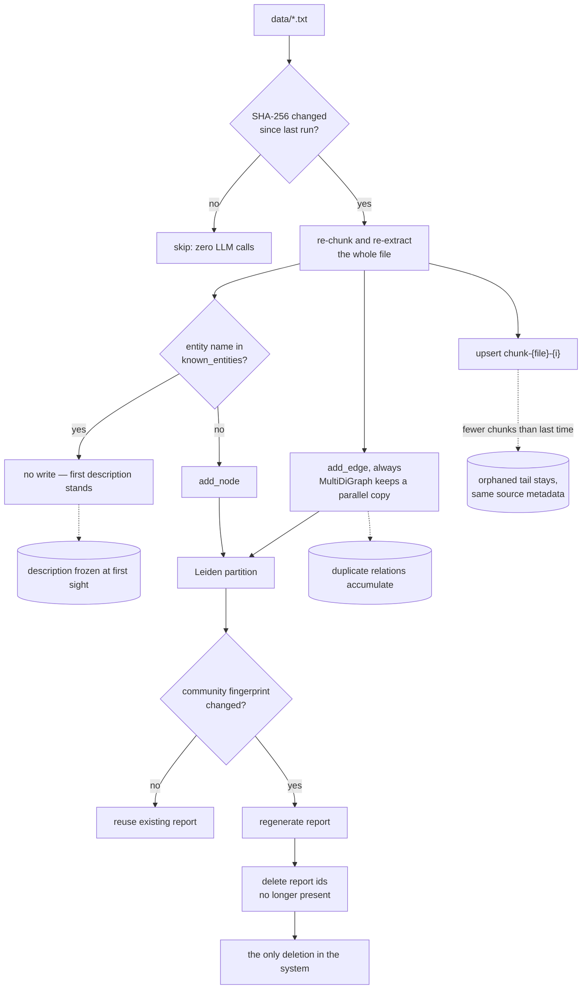

## 1. Executive Summary

A reference architecture for GraphRAG on Azure: FastAPI extracting an
entity-relation graph from a text corpus with an LLM, Leiden communities over
that graph, LLM-written reports per community, Chroma for embeddings, a React
graph viewer, and Terraform standing the whole thing up on Container Apps behind
Entra ID. 1,241 lines of Python under `backend/src` plus `app.py`, 656 lines of
tests across 38 cases, MIT.

It is in this atlas because a GraphRAG index is a store of things that can turn
out to be false — an entity an LLM invented, a relation it misread, a community
report summarising both — and because the interesting question about any such
store is what happens on the *second* ingestion.

**The incremental machinery is the good part, and it is measured rather than
asserted.** A file is re-processed only when its SHA-256 changes. A community
report is regenerated only when the fingerprint of its membership and internal
edges moves, or when one of its members changed. Reports whose fingerprint no
longer exists are deleted from the vector store. And
`test_run_ingestion_incremental_skips_unchanged_files` asserts `fake.calls ==
calls_after_first` on a re-run over unchanged content — zero LLM calls, which is
the right way to test a cost claim — then asserts exactly two calls on an edited
file: one extraction, one report.

**Deletion happens in exactly one place, and four things accumulate around it.**
Chunk ids are positional — `chunk-{basename}-{index}` — so an edited document
that produces *fewer* chunks leaves the tail of its previous version in the
vector store, carrying the same `source` metadata and indistinguishable from
current content. A document deleted from the corpus is never noticed: the
file-hash state is merged, never pruned. Entities are added under `if name not in
known_entities`, so the first description an LLM writes for an entity is
permanent and the graph store's own update-on-exists branch is unreachable from
production. And relations are appended to a `MultiDiGraph` with no dedup, so
re-ingesting an edited file adds a parallel copy of every relation its unchanged
paragraphs still contain.

**The deployment guarantees the one invariant the code checks for.**
`run_ingestion` opens with a genuinely thoughtful guard — if the vector store is
empty while the graph has nodes, force a full rebuild — and the Terraform mounts
`/app/data` from an Azure File share while leaving `CHROMA_DIR=/app/.chroma_db`
on the container's ephemeral filesystem. So every restart loses Chroma, keeps the
graph pickle, and the next ingestion re-extracts the entire corpus: exactly the
token cost the README's incremental claim exists to avoid.

**Two claims do not survive the code.** There is no agentic routing — `mode` is a
field on the request body and a dropdown in the React panel, and `app.py` is `if
request.mode == "global": … else local`. And the graph is persisted with
`pickle`, in the same directory `/upload` writes into, which is a chain worth
stating precisely because the deployment mitigates it well and the code does not.

No capability marks. The store has no status field, no timestamp, no scope key on
the read path, no append-only record and no committed case asserting anything
must stay out.

MIT, 37 commits, **first commit 28 August 2026**, pinned here at
[`e33f5f690e3b22efbf4f89d5c273a575699dd6ec`](https://github.com/sebastianbrzustowicz/Agentic-GraphRAG-Blueprint/commit/e33f5f690e3b22efbf4f89d5c273a575699dd6ec)
(29 August 2026) — a two-day-old repository, which is the frame for everything
above.

## 2. Mental Model

Four things are stored and they have different lifecycles.

An **entity** is a node id (its name), a `type` and a `description`. It is
written once, on first sight, and never revised. A **relation** is a directed
edge with a `relation` string and a description; it is appended every time an
extractor emits it, so multiplicity in the store is a record of how often a
relation was extracted rather than of anything about the world. A **chunk** is
text with `kind`, `source` and `chunk_index`. A **community report** is LLM prose
over a Leiden partition, keyed by `report-{sha1(members + internal edges)[:12]}`.

**Only the report has a real state machine**, and it is the one the design gets
right. A community's fingerprint changes when its membership or its internal
edges change; that produces a new report id, the report is regenerated, and the
id that no longer appears is deleted. So a summary that stopped being true about
the graph stops being retrievable. That is a correction mechanism, keyed on
content, and it is the only one this system has.

Everything underneath it is append-only by omission rather than by design.
Nothing marks a node doubtful, nothing supersedes an edge, nothing notices that a
chunk's source document was rewritten or removed. The graph is treated as ground
truth by the search prompts, and there is no field in which its being wrong could
be recorded.

The one place the two stores are compared is a guard the author clearly thought
about, and it is worth quoting because the report returns to it in section 3:

```python
if vector_store.count() == 0 and graph_store.node_count() > 0:
    logger.warning("vector store is empty but the graph has data; forcing a full rebuild")
```



## 3. Architecture

Two containers and two local stores.

- **`backend/app.py`** — FastAPI with `/health`, `/stats`, `/upload`, `/ingest`,
  `/progress`, `/query`. `graph_store` and `vector_store` are module-level
  globals, constructed at import, with the graph unpickled at import if the file
  exists.
- **`backend/src/ingestion.py`** (549 lines) — chunking, extraction, Leiden
  partitioning, report generation, state.
- **`backend/src/search.py`** — `local_search` and `global_search`.
- **`backend/src/storage/`** — `AbstractGraphStore` and `AbstractVectorStore`
  with one implementation each: `NetworkXGraphStore` and `ChromaVectorStore`.
- **`frontend/`** — React + Vite + MUI Joy, with a Cytoscape-style graph view.
- **`infrastructure/terraform/`** — the Azure deployment.

### Deployment and ergonomics

Local: Docker Compose, an OpenAI-compatible key, and `data/*.txt`. Chroma is a
`PersistentClient` on disk and the graph is a pickle on disk, so a local run
survives a restart with no external service. Nothing but the model provider has
to be running, which is the right floor for a prototype.

**The Azure shape is where the store's behaviour changes, and the mismatch is
two lines apart in the same Terraform file.** `azurerm_container_app.api` mounts
an Azure File share at `/app/data` and sets `GRAPH_PATH=/app/data/graph.gpickle`
— so the graph is durable and shared. It also sets `CHROMA_DIR=/app/.chroma_db`,
which is not under the mount, so the vector store is container-local and dies
with the revision. That is the exact condition the rebuild guard in section 2
tests for, which means the guard fires on the first ingestion after every restart
and the pipeline re-extracts everything. The README's claim — *"Ingestion is
incremental, so the corpus can grow without reprocessing everything from scratch
and without exploding token costs"* — holds locally and is defeated by the
deployment that ships with it. Moving `CHROMA_DIR` under `/app/data` is the whole
fix.

`min_replicas = 1` with no maximum, so Container Apps may scale out. Each replica
unpickles the graph once at import and never reloads it, and each has its own
empty Chroma. An `/ingest` served by one replica is invisible to the others until
they restart.

**Five provisioned resources the application never connects to.** Terraform
creates `azurerm_search_service`, a Cosmos SQL account with a `chat_history`
container, a Cosmos Gremlin account with a graph, a Blob `docs` container, and a
Key Vault holding nine secrets — and `grep -rn -i "cosmos\|gremlin\|azure.search\|blob\|key_vault" backend/`
returns nothing. The API's secrets come from container-app secrets set by
Terraform directly, not from Key Vault. The README's own container diagram
asserts several of these edges as facts, including *"API -.->|Fetches secrets on
startup| KV"* and a Cosmos SQL box labelled *"Sessions & History"*; there is no
session or history code anywhere in the repository. A blueprint may reasonably
provision the target state ahead of the code, and saying so in the diagram would
cost one word.

## 4. Essential Implementation Paths

**Capture.** `POST /upload` writes `os.path.basename(filename)` into
`config.data_dir`. `POST /ingest` starts `run_ingestion` on a daemon thread and
returns immediately, guarded by a 409 if one is already running.

**Chunking.** `chunk_text` (`ingestion.py:63-79`) splits on sentence punctuation
and newlines, then packs sentences to a `chunk_tokens` budget estimated as
`len(sentence) // CHARS_PER_TOKEN`, carrying `_take_overlap` sentences forward. A
sentence larger than the budget is never split — the `if current and ...` guard
means it becomes its own oversized chunk, which is the right failure for prose
and the wrong one for a table.

**Extraction.** `_extract_file` batches chunks into `extract_batch_size` LLM calls
across `max_concurrency` threads, with `_extract_batch_with_fallback` retrying a
failed batch one chunk at a time — a good degradation path.

**Community detection.** `_community_partition` (`:242-272`) builds an igraph
graph, drops self-loops, and calls `la.find_partition(graph, la.ModularityVertexPartition, seed=0)`.
That is Leiden optimising modularity, and the seed makes it reproducible. Both the
README's container diagram and `CITATION.cff` call it *Louvain*; the function's
own docstring says Leiden, and the docstring is right.

**Report regeneration.** `_community_fingerprint` (`:275-284`) is a SHA-1 over
sorted members and sorted internal edge pairs. `report_id` is its first twelve
hex characters, so the id *is* the content hash — which is why the regeneration
condition works and why stale ids are computable by set difference.

**Retrieval, local.** `local_search` runs two filtered vector searches —
`where={"kind": "entity"}` at `local_top_k`, `where={"kind": "chunk"}` at `top_k`
— seeds `get_subgraph` with the entity names, and hands the model a JSON subgraph
plus entity descriptions plus chunk text.

**Retrieval, global.** `global_search` pulls `global_top_k` reports, maps each
through an LLM, reduces the summaries, and returns a radius-0 subgraph of the
entities named in report metadata. On a map failure it appends the raw report
text in place of a summary, so a partially degraded run silently mixes mapped and
unmapped material into the reduce step.

**Update / delete.** `vector_store.delete` is called from exactly one line in the
codebase — `ingestion.py:543`, the stale-report sweep. There is no other deletion
anywhere.

## 5. Memory Data Model

There is no schema file; the shape is whatever the write path passes.

```python
graph_store.add_node(name, type=entity.get("type", ""), description=entity.get("description", ""))
graph_store.add_edge(source, target, relation=relation_type, description=relation.get("description", ""))
```

Chunk metadata is `{"kind", "source", "chunk_index", "entities"}` — the entity
list flattened to a `;`-joined string because Chroma metadata values must be
scalars. Report metadata is `{"kind", "community", "node_count", "entities"}`,
with `entities` truncated to the first 30 members.

**No temporal field exists anywhere.** Not on a node, not on an edge, not on a
chunk, not on a report. `.ingest_state.json` records file hashes and report
fingerprints, which is content identity rather than time. Neither validity time
nor record time is available, so `bitemporal` is not a near miss — the axis is
absent.

**No trust field exists either.** A node has a type and a description; an edge has
a relation and a description. Nothing separates a relation the model read from one
it inferred, and nothing can be marked doubtful. `trust_state` is withheld on an
absence rather than on an unwired field.

**Scoping is the record kind, not a principal.** The `where` clauses on the read
path filter `kind` — entity, chunk or report — which is a type discriminator that
keeps the three searches from contaminating each other, and is doing real work.
What is not there is any user, project or tenant key. `source` is stored on every
chunk and is never used as a filter, which is the sharpest version of the
near-miss: the field a per-document scope would need already exists and no query
consults it. Chroma is a single collection named `graphrag`. `scope_enforced` is
withheld on exactly that.

**The one identity decision that shapes everything is positional.** A chunk's id
is `f"chunk-{basename}-{chunk_index}"`. Re-ingesting a document upserts indices
`0..n-1`; if the new version produces fewer chunks than the old, indices `n..m-1`
survive with the old text and the same `source`. The behaviour therefore differs
by whether an edit grew or shrank the file, and only the shrink case leaks. A
content hash in the id plus a delete-by-source sweep is the standard fix and
neither is present.

## 6. Retrieval Mechanics

Dense only, with a graph expansion on top. `ChromaVectorStore` is created with
`metadata={"hnsw:space": "cosine"}` and `similarity_search` converts distance to
`score = 1.0 - distance`. There is no lexical arm, no reranker, no score
threshold, and no fusion — `k` is the only knob, and `limit = min(k, size)`
correctly avoids asking Chroma for more than it holds.

The graph half is `get_subgraph(seed_ids, radius=config.subgraph_radius)`, default
radius 1, expanding over both successors and predecessors and returning nodes and
edges as JSON that goes verbatim into the prompt. On a corpus where a few entities
are highly connected, a radius-1 expansion around eight entity hits can be most of
the graph, and nothing bounds the serialized size.

**Global search is map-reduce over community reports** and it is the part of the
GraphRAG shape most systems skip. Its empty-store path returns *"No community
reports found. Run the ingestion pipeline first."* rather than an empty answer,
which is the correct behaviour and is committed as a test.

**The failure mode worth naming is under-recall from orphaned content.** Because a
shrunk document's tail chunks remain with a valid `kind` and `source`, they are
retrievable forever and read as current. There is no timestamp to sort them out
by and no delete-by-source to remove them, so the only remedy is `FORCE_RESET`.

## 7. Write Mechanics

Writes are background — `/ingest` returns immediately and a daemon thread does the
work, with `progress.py` holding a lock-guarded snapshot the UI polls. So the lag
between adding a document and being able to retrieve it is one full ingestion
pass over every changed file, plus report regeneration for every affected
community. Nothing is retrievable partway: chunks are added per file as it
completes, but the reports that global search reads are written at the end.

**Entity descriptions are frozen at first sight.** The store's own `add_node`
handles the update case:

```python
def add_node(self, node_id: str, **attributes) -> None:
    if node_id in self._graph:
        self._graph.nodes[node_id].update(attributes)
    else:
        self._graph.add_node(node_id, **attributes)
```

and the only production caller is inside `if name not in known_entities`, so the
update branch is unreachable outside the tests. The consequence is not
theoretical: an entity first extracted from a passing mention in one document
keeps that thin description while a later document describes it properly, and the
thin description is what the vector index embeds and what every community report
is written from.

**Relations are never deduplicated.** `add_edge` on a `MultiDiGraph` appends. So
an edited file re-contributes every relation its unchanged paragraphs still
support, and `community_edges` — which is both the fingerprint input and the
relation list handed to the report LLM — grows with each edit. The fingerprint
uses `sorted((edge["source"], edge["target"]))`, so duplicates change it, which
means a purely cosmetic edit to one paragraph can invalidate the reports of every
community the file touches.

**Cross-document entity linking is the alphabetically-first 150 names.**
`_extraction_system` appends *"Already-known entity names: …"* to the extraction
prompt, capped at `sorted(known_entities)[:150]`. Capping is right; sorting
alphabetically means that past 150 entities the hint covers only the head of the
alphabet, and an entity named late in it can never be offered back to the
extractor. Since this prompt hint *is* the entity-resolution mechanism — there is
no alias table, no embedding-based merge, no normalisation beyond `.strip()` —
the README's central promise of connecting facts across documents degrades in
alphabetical order as the corpus grows.

### Operational cost

The extraction pass is the bill: one LLM call per `extract_batch_size` chunks
across every changed file, plus one embedding call per `embed_batch_size`
documents, plus one call per regenerated community report, plus one map call per
report at query time in global mode. Nothing re-reads the whole store on a
schedule. Incrementality is at *file* granularity — a one-word edit re-extracts
every chunk of that file — which is a reasonable place to draw the line and is
worth knowing before pointing this at a corpus of large documents.

## 8. Agent Integration

A REST API and a React client. There is no MCP server, no SDK, no tool schema and
no agent loop. An "agent" here is the LLM call inside `local_search` or
`global_search`.

**There is no agentic routing.** The README says *"The agentic local/global search
routing adapts to the complexity of each question"* and `CITATION.cff` repeats
*"local and global search routing"*. `QueryRequest.mode` defaults to `"local"`,
`app.py` branches on it, and `QueryPanel.tsx` holds `useState<SearchMode>("local")`
behind a select. The mode is chosen by the person typing the question. The
mechanism the claim describes — a classifier, a complexity heuristic, anything
that reads the query — does not exist at this commit. The two search functions it
would route between are both built and good, which is what makes the gap worth
naming rather than dismissing: the missing piece is a small one and the claim is
already in the citation metadata.

## 9. Reliability, Safety, and Trust

**Provenance is partial and one-directional.** A chunk carries its `source`
filename and a report carries its member entities, so an answer's chunk citations
can be traced to a document. A node and an edge carry nothing — there is no record
of which chunk produced a relation, so a wrong edge cannot be traced back to the
text that caused it, and could not be removed even if it were.

**Prompt-injected facts have a clean path in.** `/upload` accepts a document,
extraction turns its assertions into nodes and edges, and the local search prompt
presents the subgraph as knowledge. Nothing filters, and nothing marks an
extracted claim as coming from user-supplied text rather than a curated corpus.
This is the standard GraphRAG exposure; the aggravating factor here is that
nothing can be deleted afterwards except by `FORCE_RESET`.

**The persistence format is `pickle`, and the upload directory holds it.**
`NetworkXGraphStore.save`/`load` use `pickle.dump`/`pickle.load`; `app.py` calls
`load` at module import when the file exists; `config.graph_path` defaults to
`data/graph.gpickle` and the Azure deployment sets it to `/app/data/graph.gpickle`,
which is the directory `/upload` writes into. `os.path.basename` blocks traversal
— and `test_upload_sanitizes_path_traversal` proves the author considered this —
but it does not stop an upload named `graph.gpickle` from replacing the store,
after which the next container start deserializes it. `pickle.load` on
attacker-chosen bytes is code execution.

The deployment mitigates this properly and should be credited for it: the API
container app sets `external_enabled = false`, and the UI sits behind an Entra ID
auth config with `unauthenticatedClientAction = "RedirectToLoginPage"` and
`app_role_assignment_required = true`. So reaching `/upload` means being inside
the Container Apps environment or being an assigned user. The residual issue is
that an authenticated user of a document Q&A tool should not be one filename away
from code execution in the API. Two independent fixes, either sufficient: serialize
the graph as JSON or GraphML instead of pickle, and write uploads to a directory
that does not contain the store.

**Concurrency is unguarded.** `graph_store` and `vector_store` are module globals;
the ingestion thread may call `graph_store.reset()` while a `/query` is walking
the same object. `progress.py` is carefully locked and the stores are not.

**Two failure paths that swallow information.** `_load_state` returns `{}` on a
corrupt state file, which triggers `force_reset` — a safe choice, and logged.
`RETRYABLE` includes `NotFoundError`, deliberately, with a comment about transient
Azure OpenAI 404s; the cost is that a permanently wrong deployment name is retried
six times with exponential backoff before surfacing.

**No append-only record, no review surface.** `progress.py` is a live snapshot
that `start()` overwrites; `.ingest_state.json` is rewritten each run. The UI
displays the graph and the answer and offers no way to correct either.
`audit_log` and `human_review` are both withheld on absence.

## 10. Tests, Evals, and Benchmarks

**38 cases over 656 lines, against 1,241 lines of source — a good ratio, and the
cases are mostly real.** `backend/tests/fakes.py` provides in-memory graph and
vector stores plus a `FakeOpenAI`, so the ingestion pipeline is exercised
end to end without a key.

The best test in the repository is
`test_run_ingestion_incremental_skips_unchanged_files`. It runs ingestion, records
`fake.calls`, re-runs against pre-populated stores and asserts `second["entities"]
== 0` **and `fake.calls == calls_after_first`** — zero LLM calls, which is the
claim itself rather than a proxy for it. Then it edits the file and asserts
`third["entities"] == 1`, `third["relations"] == 0`, `third["reports"] == 1` and
`gamma_fake.calls == 2`: one extraction, one report. Exact counts on a cost claim
are the right instrument and most repositories in this atlas do not reach for it.

`test_extract_graph_batch_one_call_per_batch` asserts `fake.calls == 2` for three
chunks at batch size two, and `test_extract_graph_batch_raises_when_batch_is_unparseable`
asserts the raise *and* that only one call was made. `test_upload_sanitizes_path_traversal`
covers the guard discussed in section 9. `test_query_local_works_offline` and
`test_local_search_end_to_end` run the search path against the fakes.

**What is not tested is the whole of the correction story.** `FakeVectorStore.delete`
exists and no test calls it, so the stale-report sweep — the single deletion in
the system — has no coverage. Nothing covers a document that shrinks, a document
removed from the corpus, a repeated relation, or an entity seen twice with
different descriptions. Each of those is the defect described in sections 5 and 7,
and each is one fake-store assertion away from being caught.

**One test to read carefully.** `test_global_search_returns_message_without_reports`
asserts the empty-store message, which is correct behaviour worth pinning — but it
is an assertion about an empty result, not a negative retrieval assertion. Nothing
here establishes that particular material stays out of a populated result set, so
`negative_eval` is withheld.

**No benchmark, no eval harness, and no committed run of any kind.** There is no
paper: `CITATION.cff` is the citation artifact and points at the repository
itself. So every claim about retrieval quality in the README is a design claim,
and the report says so rather than treating the absence as a verdict — the project
is two days old and the tests it does have are aimed at mechanism rather than
at scores, which is the correct order.

**`.github/workflows/infra.yml` is the only workflow**, and it is infrastructure
CI. The Python tests are not run by any workflow at this commit.

## 11. For Your Own Build

### Steal

- **Key a derived artifact by a fingerprint of its inputs.** `report-{sha1(members
  + internal edges)[:12]}` makes three things fall out for free: whether to
  regenerate is a set membership test, which old artifacts are stale is a set
  difference, and an unchanged community is provably unchanged. Any pipeline that
  summarises a mutable substructure should key the summary this way.
- **Test a cost claim by asserting the call count.** "Incremental" is a claim about
  spend, and `assert fake.calls == calls_after_first` is the assertion that
  matches it. A test that only checks the output is the same would have passed
  against a full rebuild.
- **Check that two stores agree, and rebuild when they do not.** The
  `vector_store.count() == 0 and graph_store.node_count() > 0` guard is the kind
  of invariant that turns a silent half-broken index into a loud expensive one.
  Write the guard — and then make sure your deployment is not the thing that
  trips it.
- **Retry the batch, then retry its members.** `_extract_batch_with_fallback`
  degrades a failed multi-chunk extraction into per-chunk calls rather than losing
  the batch, which recovers the common case where one chunk broke the JSON.

### Avoid

- **Positional ids for content that can be re-derived.** `chunk-{file}-{index}`
  makes an upsert correct when a document grows and silently wrong when it
  shrinks, which is the worst combination: the failure is invisible and depends on
  the direction of an edit. Hash the content into the id, and sweep by source
  before writing.
- **Write-once-if-absent as a substitute for merge.** `if name not in
  known_entities` looks like deduplication and is actually a rule that the first
  observation wins forever. If the store has an update path — this one does — the
  write path should be able to reach it.
- **Selecting a bounded prompt hint alphabetically.** Capping the known-entity
  list at 150 is right; `sorted(...)[:150]` makes the cap bite the same names
  every time. Rank by frequency, by recency, or by relevance to the chunk in hand.
- **`pickle` as a persistence format for anything a user can influence the
  filename of.** The store format and the upload directory are separate decisions
  and both were made the easy way; either one changed would break the chain.
- **Provisioning infrastructure the code does not use, and drawing it as
  connected.** A blueprint may legitimately provision its target state early. The
  diagram should then say *planned*, because the version that asserts *"Fetches
  secrets on startup"* about a Key Vault nothing reads is a claim a reader will
  check.

### Fit

This is a two-day-old prototype presented as a reference architecture, and those
two descriptions pull in different directions. As a prototype it is
better-organised than most: real abstractions, real tests, a real incremental
path, a deployment that gets ingress and identity right, and honest degradation
paths in the extraction code.

As something to deploy, the blocker is not any single defect but the shape they
share. Every one of them — orphaned chunks, frozen descriptions, duplicate edges,
an unpruned file state — is about the *second* ingestion, and a document corpus
that never changes is not the use case the README describes. A reader whose corpus
is append-only and periodically rebuilt from scratch can take this as it stands. A
reader whose documents get edited should treat the delete path as the work
remaining, and should expect that work to touch the chunk id scheme, the entity
write, the edge write and the state file — which is to say most of
`run_ingestion`.

## 12. Open Questions

- **Is `CHROMA_DIR` outside the volume mount deliberate?** If the intent is that
  each replica rebuilds its own index, the rebuild guard is doing exactly what it
  should and the README's cost claim needs a caveat; if it is an oversight, it is
  a one-line Terraform change.
- **What is the intended entity-resolution story past 150 names?** The prompt hint
  is the only mechanism at this commit, and the cap is reached quickly on any real
  corpus.
- **Are the Cosmos, Search, Blob and Key Vault resources a roadmap or a leftover?**
  Nothing in the repository connects to them, and the C4 diagram describes them as
  live.
- **Louvain or Leiden?** The code says Leiden, the README diagram and
  `CITATION.cff` say Louvain, and the citation file is the one that ends up in
  other people's bibliographies.
- **Is a graph pickle on a shared Azure File mount intended to be written by more
  than one replica?** `min_replicas = 1` with no maximum permits scale-out, and
  `save()` truncates and rewrites the file with no lock.

## Appendix: File Index

**Storage**
- `backend/src/storage/base.py` — `AbstractGraphStore` (no per-item delete),
  `AbstractVectorStore` (`delete(ids)`).
- `backend/src/storage/graph_store.py` — `NetworkXGraphStore`, the unreachable
  update branch in `add_node`, `save`/`load` via `pickle`.
- `backend/src/storage/vector_store.py` — `ChromaVectorStore`, `_retry_call` and
  its `NotFoundError` inclusion, the single `graphrag` collection.

**Write path**
- `backend/src/ingestion.py:46-79` — sentence splitting, overlap, `chunk_text`.
- `:114-126` — `_extraction_system` and the `[:150]` alphabetical hint.
- `:242-284` — `_community_partition` (Leiden, `seed=0`) and
  `_community_fingerprint`.
- `:287-314` — file hashing and `.ingest_state.json`.
- `:333-549` — `run_ingestion`: the rebuild guard, the write-once entity branch,
  the unconditional `add_edge`, the positional chunk id, the stale-report sweep,
  the merged file state.

**Read path**
- `backend/src/search.py` — `local_search`, `global_search`, the `kind` filters,
  the raw-report fallback in the map step.
- `backend/src/prompts.py` — the four bundled system prompts and the override
  path.

**API and UI**
- `backend/app.py` — module-level stores, the import-time `pickle.load`, `/upload`,
  `/ingest`, `/query`, the wildcard CORS middleware.
- `frontend/src/components/QueryPanel.tsx` — the mode dropdown.

**Infrastructure**
- `infrastructure/terraform/main.tf:106-220` — Search, Cosmos SQL + `chat_history`,
  Cosmos Gremlin, Storage, the Azure File share.
- `:223-318` — the API container app: secrets, env, the `/app/data` mount and
  `CHROMA_DIR` outside it.
- `:309-311` — `external_enabled = false`.
- `:320-372` — the Entra ID application and auth config.

**Tests**
- `backend/tests/test_ingestion.py:120-188` — the incremental test with exact call
  counts.
- `backend/tests/fakes.py` — `FakeGraphStore`, `FakeVectorStore`, `FakeOpenAI`.
- `backend/tests/test_api.py` — upload, traversal sanitisation, the 409 on
  concurrent ingest.

## History

**2026-08-30** — [`e33f5f690e3b22efbf4f89d5c273a575699dd6ec`](https://github.com/sebastianbrzustowicz/Agentic-GraphRAG-Blueprint/commit/e33f5f690e3b22efbf4f89d5c273a575699dd6ec) — first reading, at the 37th commit of a repository whose first commit is dated 28 August 2026. Screened before reading: no auto-run surfaces, two build-time execution surfaces (a `Makefile` and `backend/conftest.py`), four unpinned surfaces, and **every dependency manifest inside the seven-day freshness cooldown** — nothing was installed and nothing was run, and no claim in this report depends on executing the tree. No marks. The report is organised around what happens on the second ingestion, because that is where a GraphRAG index either corrects itself or accumulates, and this one does one of each.
