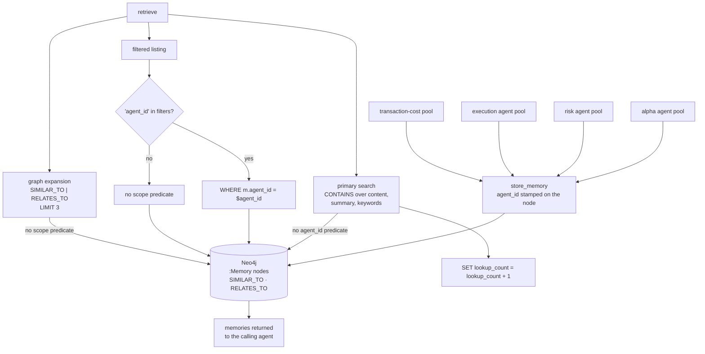

## 1. Executive Summary

AgenticTrading is a multi-agent trading research stack from Open-Finance-Lab —
roughly 258,000 lines of Python, 1,419 commits since 20 May 2025, under the
**OpenMDW-1.0** licence, a model-and-data licence rather than one of the usual
software licences, which is worth knowing before reusing anything here.

Inside it is a genuine memory service: `orchestration/FinAgents/memory/` is
7,784 lines across sixteen modules, with an MCP server, an A2A server and health
checker, a unified database manager, a configuration manager, an intelligent
indexer, a real-time stream processor and an LLM research service, all over
Neo4j. This is not a memory package bolted to a trading demo; it is the largest
component in the tree that is about remembering.

**No marks.** The reason is one query. The service stores `agent_id` on every
memory node, and the search path that agents actually call does not use it:

```cypher
MATCH (m:Memory)
WHERE m.content_text CONTAINS $search_text
   OR m.summary CONTAINS $search_text
   OR ANY(keyword IN m.keywords WHERE keyword CONTAINS $search_text)
SET m.lookup_count = m.lookup_count + 1
```

There is an `agent_id` predicate elsewhere in the same file, and it is optional —
`if "agent_id" in filters` — so scope holds exactly when a caller thinks to ask
for it. In a design where separate alpha, risk, execution and cost agents write
into one graph, that is the boundary doing no work by default.

Nothing else in the schema carries a mark either: a memory node has no status,
no confidence, no validity interval and no supersession pointer, deletion leaves
no record, and the memory package contains no audit surface. The two committed
files named for testing it do not exercise it.

## 2. Mental Model

The unit is a `Memory` node, created with a fixed shape:

```cypher
CREATE (m:Memory {
    memory_id: $memory_id,
    query: $query,
    keywords: $keywords,
    summary: $summary,
    agent_id: $agent_id,
    event_type: $event_type,
    timestamp: datetime(),
    lookup_count: 0
})
```

Read the fields for what they assume. A memory is *a query someone asked and a
summary of what came back*, attributed to an agent and typed by event. There is
no field for whether the summary turned out to be right, no second timestamp for
when the thing described happened, and no way to mark one memory as superseding
another. `lookup_count` is the only field the system revises, and it counts
retrievals rather than confirmations — a popularity signal, not evidence.

For a trading system this matters more than it would elsewhere. A memory
recording *what the market did* and a memory recording *what an agent concluded*
are the same node type with the same absence of provenance, and nothing in the
schema lets a later read tell them apart beyond a free-text `event_type`.

## 3. Architecture



Three read paths reach the same nodes and one of them can be scoped.

## 4. Essential Implementation Paths

**Initialization is explicit, and this is the part done well.**
`database_initializer.py` creates full-text indexes, property indexes and both
uniqueness and existence constraints by name rather than letting a schema emerge
from whatever the first write happened to contain. For a graph store that is the
difference between a database and a pile of nodes, and it is a discipline several
Neo4j-backed systems in this corpus skip.

**Retrieval is substring matching.** The primary search is three `CONTAINS`
clauses over content, summary and keywords. There is no vector similarity on this
path and no ranking beyond what Neo4j returns; the full-text indexes created at
initialization are not what this query uses. `SET m.lookup_count = m.lookup_count
+ 1` fires as a side effect of reading, so a search mutates every row it matches.

**Expansion is one hop, unscoped.** A related-memory query walks
`SIMILAR_TO|RELATES_TO` from a given `memory_id` and returns up to three
neighbours with their `agent_id` in the projection — the field is selected and
returned, and not compared against anything.

## 5. Memory Data Model

`Memory` nodes as above, joined by `SIMILAR_TO` and `RELATES_TO` edges, with an
`Agent` label present in the statistics query. There is no separate table or
label for a decision, a correction, an audit event or a deletion.

The absences decide most of this report's marks and are worth listing once:

- No status or lifecycle field, so nothing can be marked disputed, superseded or
  retired. `trust_state` is absent.
- One `timestamp`, set to `datetime()` at write. There is no event-time axis, so
  *what did this agent believe on 3 March* is unanswerable. `bitemporal` is absent.
- No deletion record of any kind, and nothing keyed on the value of a removed
  memory. `tombstone` is absent.
- No audit or event label in the memory package, and no append-only record of
  mutations. `audit_log` is absent.
- No review, approval or verdict surface on a stored memory. `human_review` is
  absent.

## 6. Retrieval Mechanics

Covered in section 4; the mechanism is substring matching with a usage counter.
What belongs here is the scope question, because it is the whole finding.

`agent_id` is written on every node. It is read in exactly two places: an
optional key in a `filters` dictionary, and a `WHERE m.agent_id IS NOT NULL`
guard in a statistics query. The primary search has no `agent_id` clause, and
neither does the graph expansion.

This is the shape the atlas calls an optional scope: the key exists, the
predicate exists, and whether the boundary holds is decided by each caller
independently. It is not awarded `scope_enforced`, which asks for the key to be
applied as a filter on *the* read path rather than on a read path. The
distinction is not pedantic in a system whose own architecture puts four
differently-privileged agent pools behind one graph.

## 7. Write Mechanics

Writes go through the MCP server or the A2A server into the unified database
manager. A memory is created with the fields above and never revised except for
`lookup_count`. There is no update path that supersedes, no invalidation stamp
and no delete that records what it deleted.

One detail belongs in any reading of this tree. `database.py` opens with:

```python
URI = "bolt://localhost:7687"
AUTH = ("neo4j", "FinOrchestration")
```

A database password as a literal in source. It addresses `localhost` and is
plainly a development default rather than a deployment secret, and the atlas
records it for the same reason it records the equivalent elsewhere: a credential
in a public repository is one that everyone reading the repository has, and a
default that works is a default that ships.

## 8. Agent Integration

The memory service is addressable over two protocols — an MCP server for tool
calls and an A2A server for agent-to-agent traffic, with a dedicated health
checker for the latter. Agent pools for alpha, risk, execution and transaction
cost sit above it, each with its own demo package.

Making memory a separate networked component that several agents reach through a
declared protocol is a reasonable architecture and the right place to enforce a
boundary, since a service that owns the store can refuse a query the client did
not scope. That enforcement is where it is missing.

## 9. Reliability, Safety, and Trust

The operational engineering around the store is more developed than the store's
own semantics: a configuration manager, a health checker, a database initializer
that asserts its schema, a real-time stream processor, and a `verify_health`
path.

What is absent is any notion of a memory being wrong. There is no confidence, no
provenance beyond `agent_id`, no contradiction detection, no expiry and no
correction. In a trading context a stale memory is not a neutral cost — a summary
of market conditions from an earlier regime reads identically to a current one,
and `lookup_count` will rank it higher the more often it has been retrieved,
which is a reinforcement loop pointing the wrong way.

## 10. Tests, Evals, and Benchmarks

`orchestration/FinAgents/memory_testing/` is the directory named for measuring
this system, and neither of its two scripts touches the memory package.

`accuracy_testing.py` is 44 lines. It reads a 1.5 MB CSV of S&P 500 headlines,
formats about 120,000 tokens of them into one prompt, sends it to `gpt-4o-mini`
with `max_tokens=100`, and prints the reply. It contains **zero assertions**, no
ground truth, no metric and no comparison arm, and its success line is:

```python
print("SUCCESS: The model processed the request.")
```

Success is defined as the API call not raising. A file named for accuracy testing
that measures whether an HTTP request returned is the purest instance this atlas
has recorded of an assertion that cannot fail — there is no assertion at all, only
a filename making a claim about one.

`latency_test.py` is the better of the two and measures the wrong subject: it
times `gpt-4o-mini` across increasing input sizes with repeated runs per size,
computes throughput and plots it. That is a real measurement of a model's
long-context latency. It never imports or calls anything in
`FinAgents/memory/`, so it says nothing about the store's latency, which is the
number its filename implies.

Elsewhere, `orchestration/tests/` holds integration tests and a committed
`test_results_20250724_193603.json`. A grep across those files for a negative
assertion — `assert ... not in`, `assert not`, an empty-collection comparison —
returns nothing, so no committed case asserts that particular material must not
be retrieved. `negative_eval` is absent.

Nothing was executed from this checkout.

## 11. For Your Own Build

**If several agents share one graph, put the scope in the query the agents
call.** An `agent_id` column and an optional filter key give a reader every
impression of isolation and provide none. The version that works is either a
predicate the search path cannot omit or, better, a key the caller cannot
construct without their identity.

**Do not let a read mutate the ranking signal by default.** `SET m.lookup_count
= m.lookup_count + 1` inside the search means retrieval feeds popularity and
popularity feeds retrieval, with nothing in the loop asking whether the memory
was any good. If you keep a usage counter, keep it out of the ranking or pair it
with an outcome.

**Name a test file for what it asserts.** A directory called `memory_testing`
whose scripts never import the memory package, and a script called
`accuracy_testing.py` with no assertions, will be read as coverage by everyone
who does not open them — including the people who wrote them, six months later.

## 12. Open Questions

**Is there a caller that does pass `agent_id`?** The filter exists and the
grep for callers across a 258,000-line tree was not exhaustive. If the agent
pools construct their `filters` dicts consistently, the boundary may hold in
practice even though the store does not enforce it — which would be worth
knowing, and would still be a property of the callers rather than of the memory
service.

**What does the intelligent indexer index?** `intelligent_memory_indexer.py` is
506 lines and `realtime_stream_processor.py` another 541. Whether either
maintains a retrieval path other than the `CONTAINS` search read here, and
whether that path is scoped, was not traced.

**Are the full-text indexes used?** The initializer creates them by name; the
primary search uses `CONTAINS`. Something else may call them, or they may be
maintained and unread.

## Appendix: File Index

| Path | What it holds |
| --- | --- |
| `orchestration/FinAgents/memory/database_initializer.py` | The `Memory` node shape, indexes and constraints |
| `orchestration/FinAgents/memory/unified_database_manager.py` | The search, the optional `agent_id` filter, and the graph expansion |
| `orchestration/FinAgents/memory/database.py` | The Neo4j driver and the credential literals |
| `orchestration/FinAgents/memory/memory_server.py` | The MCP server over the store |
| `orchestration/FinAgents/memory/a2a_server.py` | The agent-to-agent surface |
| `orchestration/FinAgents/memory/intelligent_memory_indexer.py` | Indexing not traced at this pin |
| `orchestration/FinAgents/memory_testing/accuracy_testing.py` | 44 lines, no assertions |
| `orchestration/FinAgents/memory_testing/latency_test.py` | A real latency measurement of the model, not the store |

## History

**2026-08-25** — [`9966c3dfc0f4fd41978f63a36caeb111ac807601`](https://github.com/Open-Finance-Lab/AgenticTrading/commit/9966c3dfc0f4fd41978f63a36caeb111ac807601) — first reading, roughly 258,000 lines of Python, 1,419 commits since 20 May 2025, OpenMDW-1.0. Screened before anything was read: one auto-run surface, five build-time execution surfaces, seven unpinned surfaces; `CLAUDE.md` at the root is addressed to a reading agent and was treated as data. Nothing was installed and nothing was run. No marks. `scope_enforced` is withheld on the producer check: `agent_id` is written on every `Memory` node and the primary search applies no predicate for it, while the one place it is compared sits behind `if "agent_id" in filters`, and the graph expansion selects it into the projection without comparing it. `trust_state`, `bitemporal`, `tombstone`, `audit_log` and `human_review` are absent from the schema — no status, one timestamp, no deletion record, no event label, no review surface. `negative_eval` is withheld because a grep across the committed tests for a negative assertion returns nothing, and because the directory named `memory_testing` contains one script with zero assertions whose success criterion is that an API call returned, and one that measures a model's long-context latency without importing the memory package. The reading covers the memory service, its schema and its query paths; the indexer, the stream processor and the four agent pools were not traced.
