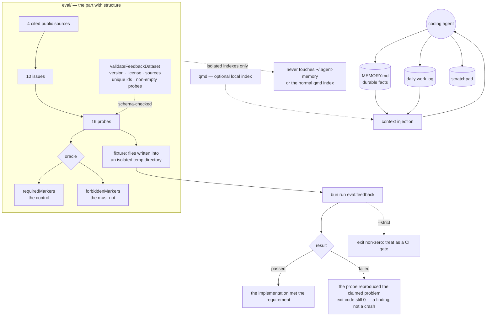

## 1. Executive Summary

AgentMemory is a local-first memory layer for coding agents: durable memory as
plain Markdown files, a daily work log, a scratchpad, and optional local search
through [qmd](https://github.com/tobi/qmd). MIT, TypeScript, 48 files, four
source modules. The README states its own boundary — *"The public project is
intentionally standalone. It does not require an account, remote service,
payment flow, or proprietary runtime."*

**One mark: `negative_eval`**, and it is the hardest form the mark takes.

The memory itself is small enough to read in a sitting; `eval/` is where the
thinking is. The suite *"converts public AgentMemory feedback into falsifiable
probes before product fixes are proposed"*, and each probe is a data record
naming the issue it came from, the requirement it tests, the fixture it runs
against, and an oracle with two halves:

```json
"oracle": {
  "requiredMarkers": ["https://albatross.invalid/v3"],
  "forbiddenMarkers": ["https://old-gull.invalid/v1"]
}
```

That is the probe called `current-fact-excludes-superseded-fact`, over a fixture
holding an endpoint and its correction. Both halves are declared, which is the
distinction this atlas draws between a real must-not test and one a filter
excluding everything would pass.

The second idea is in the README, and it is about what a failing run means:
*"The default command exits successfully even when a product issue is
reproduced: failures are evaluation findings, not harness crashes."*

## 2. Mental Model

Memory is files the user can read. `MEMORY.md` holds durable facts; a daily log
and a scratchpad hold the rest. Retrieval is reading, optionally helped by a
local index. There is no database, no status column and no server.

Everything that would make the other marks possible — a rejected-value record,
an epistemic state, a scope key — is absent by design at this size. What exists
instead is a suite that states, in data, what the system is supposed to do and
which complaints it has not yet answered.

## 3. Architecture



## 4. Essential Implementation Paths

**The probe record** — `eval/datasets/external-feedback-v1.json`. Sixteen
probes across ten issues from four cited sources. Each carries an `issueId`, a
`title`, an `evaluator`, a prose `requirement`, a `fixture` of files to write,
and the `oracle`. The one quoted above pairs a superseded endpoint with its
replacement and requires the new one present *and* the old one absent.

**The dataset is validated, not just parsed** — `eval/dataset.ts`.
`validateFeedbackDataset` asserts a version, a description, a **license**, a
non-empty source list with unique ids and titles, non-empty issues, fixtures,
and non-empty probes. An eval dataset that carries its own licence field and
refuses to load without one is unusual, and it is the field that makes the
probes redistributable.

**The exit code** — `eval/README.md`. A reproduced product issue leaves the
command at zero; `--strict` is what turns the suite into a gate. The
interpretation is spelled out — *"`failed`: the probe reproduced the claimed
problem or missing capability"* — so a failing probe is a documented open issue
rather than a broken build.

**What is excluded, and why** — the same file separates three kinds of evidence
and keeps the third out of scoring: *"Qualitative observations cover maturity
and custom-skill substitution. These require longitudinal adoption or interview
evidence and are excluded from automated scoring."* Naming the evidence you
cannot automate, and then not scoring it, is the rarer half of that sentence.

**Isolation** — live retrieval probes *"build an isolated qmd index... They use
synthetic documents only and do not touch `~/.agent-memory` or the normal qmd
index."* An eval that can corrupt the thing it measures is a hazard; this one
says it does not.

## 5. Memory Data Model

Markdown. `MEMORY.md` for durable facts, a dated work log, a scratchpad. A
superseded fact is marked in prose — the fixture above writes
`Status: superseded` and a sentence saying what supersedes it — which is a
convention the probe tests rather than a field the code enforces.

## 6. Retrieval Mechanics

Reading files, with `qmd` as an optional local lexical index. The probes cover
routing, hard context caps, priority under saturation, and cross-language
lexical controls in Japanese, Chinese and English.

## 7. Write Mechanics

The agent writes markdown. There is no write gate, no extraction pipeline and no
consolidation pass.

## 8. Agent Integration

An npm CLI, a Homebrew formula, skills, and committed git hooks. Distribution
is deliberately plain.

## 9. Reliability, Safety, and Trust

**`negative_eval`** — section 10.

**The other six marks are absent, and the report of that is the honest
finding.** A superseded fact is superseded because a line of prose says so;
nothing keys a rejection on the old value, nothing filters on a status, there is
one clock and one user. The probe set knows this: `temporal-correctness` is an
*issue id* in the dataset, which is to say a problem the project has written
down and is measuring itself against rather than a mechanism it claims.

That is worth separating from the usual version of the same sentence. Most
systems with no trust state have not noticed; this one has a probe named for the
gap.

**One caution for a reader installing it.** The screen found an auto-run
surface — committed git hooks under `.githooks/`, inert until something points
`core.hooksPath` at them — plus two build-time execution points from the npm
lifecycle.

## 10. Tests, Evals, and Benchmarks

A `test/` directory and the `eval/` suite. Nothing was installed and nothing was
run; the probe outcomes below are read from the dataset rather than from a run.

The mark rests on the oracle shape. Two probes are must-nots by name:

- **`current-fact-excludes-superseded-fact`** — *"Injected context must include
  the current endpoint and exclude the retired endpoint."* Required marker:
  the new URL. Forbidden marker: the old one. This is the rubric's harder
  version — a corrected value asserted absent, with the control that stops an
  over-broad filter passing.
- **`expired-instruction-is-not-injected`** — an instruction past its life must
  not reach the model's context.

Both are declared in JSON rather than written in code, which has a consequence
worth naming: a new probe is a data record with a cited source and an oracle,
not a function someone has to remember to call. The runner enforces the shape
through `validateFeedbackDataset`, so a probe without a source or without an
oracle cannot enter the set.

The remaining fourteen cover prompt routing, advertised context caps, priority
under saturation, decision survival across session loads, provenance, synthetic
secrets, untrusted content, explicit cross-agent handoff, transcript import,
README boundaries, and cross-language lexical retrieval.

No paper.

## 11. For Your Own Build

### Steal

- **Give every probe a required marker and a forbidden marker.** One without the
  other is half a test: forbidden alone passes when you return nothing, required
  alone passes when you return everything.
- **Turn complaints into probes before fixing them.** *"converts public feedback
  into falsifiable probes before product fixes are proposed"* — the probe
  outlives the fix and catches the regression.
- **Make a reproduced issue exit zero.** A suite that cannot distinguish "the
  product has a known gap" from "the harness broke" teaches people to ignore it.
  Keep `--strict` for the gate.
- **Carry a licence field in the dataset and refuse to load without one.** It is
  what makes a probe set something others can reuse.
- **Say which evidence you cannot automate, and then do not score it.**
- **Isolate the probes from the user's real store and index, and say so in the
  README.**

### Avoid

- **Prose as a status field.** `Status: superseded` in a markdown line is
  readable by a person and by a model, and it is not a predicate: nothing can
  filter on it, so the probe that checks the outcome is the only thing standing
  between a correction and its ghost.

### Fit

Take it if you want agent memory you can read in a text editor and are content
for supersession to be a convention. Take `eval/` whatever else you use — the
dataset shape transfers to any memory system, and it is about a hundred and
thirty lines of validator around a JSON file.

## 12. Open Questions

- `temporal-correctness` is an issue id with probes attached. Is a status field
  planned, or is the prose convention plus the probe considered sufficient?
- Probes are declared in JSON and validated on load. Is the dataset intended to
  accept third-party probes, and what would vouch for a source then?
- The default run exits zero on a reproduced issue. Is any published artifact
  produced from it — a scoreboard, a badge — so the open findings are visible
  without running it?
- Live retrieval probes are opt-in behind `--live-qmd`. What does the default
  report for those, and can a reader tell a deferred probe from a passing one?

## Appendix: File Index

| Path | What it holds |
| --- | --- |
| `eval/datasets/external-feedback-v1.json` | sixteen probes, ten issues, four cited sources, and every oracle |
| `eval/dataset.ts` | `validateFeedbackDataset` — the schema the probe set must satisfy |
| `eval/README.md` | the three evidence kinds, the exit-code decision, and the isolation guarantee |
| `eval/run.ts`, `eval/types.ts` | the runner and the evaluator vocabulary |
| `src/core.ts` | the memory itself: file paths, the log and the scratchpad |
| `src/external-command.ts` | the qmd integration |
| `.githooks/` | committed hooks, inert until `core.hooksPath` points at them |

## Appendix: Recorded Searches

Run from the root of the checkout at the pinned commit.

| Claim | Command | Result at this pin |
| --- | --- | --- |
| Both halves of the oracle are declared | read `eval/datasets/external-feedback-v1.json`, probe `current-fact-excludes-superseded-fact` | `requiredMarkers` holds the current endpoint and `forbiddenMarkers` the retired one |
| The dataset is schema-validated on load | read `eval/dataset.ts:11-21` | version, description, **license**, non-empty sources with unique ids, issues, fixtures and probes all asserted |
| A reproduced issue does not fail the command | read `eval/README.md`, the Run and Interpretation sections | *"exits successfully even when a product issue is reproduced"*; `--strict` is the opt-in gate |
| No epistemic field exists in the source | `grep -rl "tombstone\|confidence\|scope\|audit\|approve" --include='*.ts' src` | Nothing for any of them; `supersede` appears once and `review` once |
| The probe set is small and countable | `python3 -c "import json;d=json.load(open('eval/datasets/external-feedback-v1.json'));print(len(d['sources']),len(d['issues']),len(d['probes']))"` | 4 sources, 10 issues, 16 probes |
| The licence carries no rider | `head -3 LICENSE`; `grep -n -i 'anthropic\|may not' LICENSE` | Stock MIT, no match |

## History

**2026-09-20** — [`901b60dd8f3ab1bd9eec4578aa9fcd4eed6a06d5`](https://github.com/jayzeng/agentmemory/commit/901b60dd8f3ab1bd9eec4578aa9fcd4eed6a06d5) — first reading, at 48 files. Screened before reading: one auto-run surface (committed git hooks, inert until `core.hooksPath` points at them), two build-time execution points and one unpinned surface, nothing inside the cooldown; nothing was installed and nothing was run, so the probe outcomes are read from the dataset rather than from a run. MIT. One mark, `negative_eval`, on an oracle that declares both the markers that must appear and the markers that must not. The remaining marks are absent rather than withheld on a technicality — supersession here is a line of prose, and the project has a probe named for that gap rather than a mechanism that closes it. The slug carries a suffix because the atlas already holds a report for a different `agentmemory`, at [rohitg00/agentmemory](../agentmemory/).
