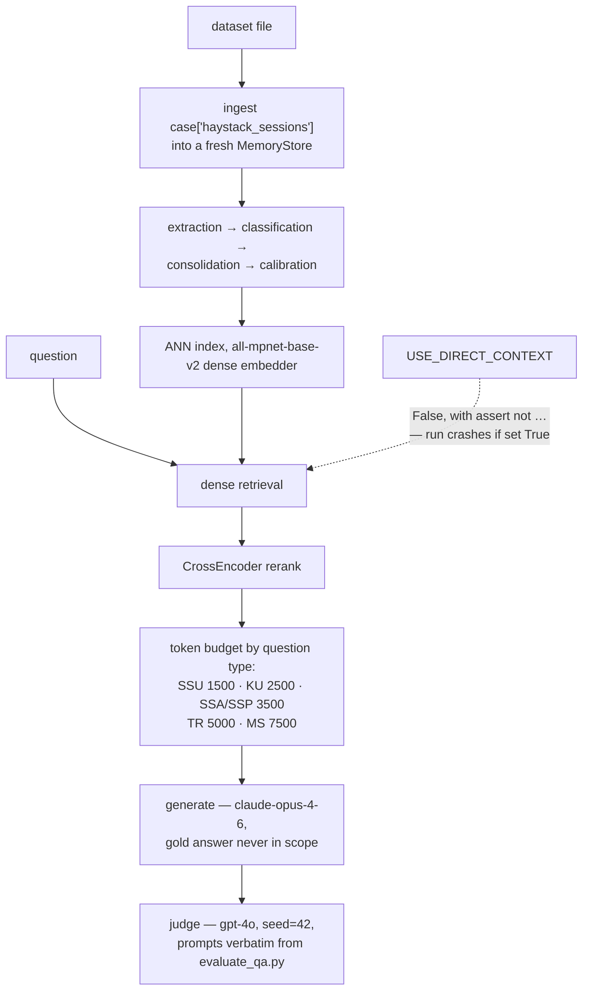

## 1. Executive Summary

agentmemory V4 claims a world record: **96.20% on LongMemEval — 481 correct, 500 cases**,
"the highest score ever achieved on this benchmark under real-retrieval
conditions… Single deterministic run. No oracle access. No ensemble."

**The claim is unusually well-supported in every respect except one, and the
exception is decisive.**

What is right, and rare: the repository commits the **full result file**
(`longmemeval_results_opus6.json`, 878 KB, 500 per-case records), the **complete
run log** (`fullrun_opus6.log`), a **`LEGITIMACY.md` self-audit**, and a
deterministic configuration (`PYTHONHASHSEED=42`, judge `seed=42`). Recounting
the per-case records gives 481 correct out of 500 — **the headline number is
reproducible from the committed file, not merely asserted.**

The comparability notes are better than most academic related-work sections. The
README excludes oracle and ensemble scores from the comparison table on the
stated grounds that they "do not reflect real-world retrieval capability", and
then **restates three rivals' numbers into like-for-like form**: OMEGA's 95.4%
is "a task-weighted average across question types, not raw accuracy. Raw:
466/500 = 93.2%"; Supermemory's "~99% is an 8-variant ensemble result… The
85.86% above is their single-pass comparable score"; Hindsight "uses
`GPT-OSS-120B` as both generator and judge — a non-standard judge that is not
directly comparable".

**And then the committed artifacts name a different dataset from the claim.**

- `run_longmemeval_full.py:713` —
  `DATASET_PATH = …/LongMemEval/data/longmemeval_oracle.json`
- `fullrun_opus6.log:2` —
  `Loading dataset from C:/Agentmemory V4/LongMemEval/data/longmemeval_oracle.json ...`
- `longmemeval_results_opus6.json`, summary —
  `"dataset": "C:/Agentmemory V4/LongMemEval/data/longmemeval_oracle.json"`

The README says the scores are "on **LongMemEval_S** (500 questions),
single-pass real-retrieval" and that agentmemory V4 has "**no oracle access**".

Section 10 works through what this does and does not mean, what the project's own
self-audit says about it, and the single flag that would settle it.

## 2. Mental Model

Sessions are ingested into a fresh store per case, passed through extraction,
classification and consolidation, indexed for dense retrieval, and answered under
a per-question-type token budget.

## 3. Architecture

`agentmemory/` is about 12,000 lines: `core`, `extraction`, `classification`,
`consolidation`, `calibration`, `importance`, `embeddings`, `ann_index`,
`graph`, `events`, `lineage`, `federation`, `migration`, `health`, `gdpr`,
`mcp`, `benchmark`, plus integrations.

A `lineage.py` and a `gdpr.py` in a 12,000-line personal project are worth
noting — the first suggests provenance tracking, the second an erasure path, and
neither is the kind of module that appears by accident.

The harness itself (`run_longmemeval_full.py`, 2,800 lines) has `--limit`,
`--offset`, `--resume`, `--dataset`, `--progress` and `--results` flags, so the
evaluation is restartable and its inputs are parameterised.

## 4. Essential Implementation Paths

**Run** — `run_longmemeval_full.py` (the ingest contract `:5`,
`USE_DIRECT_CONTEXT` and its assert `:706-707`, `MAX_CONTEXT_CHARS` `:711`,
`DATASET_PATH` `:713`, the dataset load `:1594-1595`, the summary write `:2784`,
the argument parser `:2811-2822`, `convert_sessions_to_messages` `:883-895`).

**Audit** — `LEGITIMACY.md`.

**Evidence** — `longmemeval_results_opus6.json`, `fullrun_opus6.log`,
`FINAL_REPORT_OPUS6_WORLDRECORD.md`.

## 5. Memory Data Model

Extracted memories with importance and calibration scores, a graph, an events
layer and a lineage module. No status field, no supersession pointer and no
tombstone were found; consolidation merges and a GDPR module handles erasure.

The benchmark harness builds a **fresh store per case**, so nothing in the
evaluation exercises long-lived correction — which is consistent with what
LongMemEval tests, and means this report can say nothing about how the system
ages.

## 6. Retrieval Mechanics

`all-mpnet-base-v2` dense retrieval with a CrossEncoder reranker, both preloaded
once, under **per-question-type token budgets** — 1,500 for single-session-user
up to 7,500 for multi-session — with `MAX_CONTEXT_CHARS = 96_000` chosen against
a stated 30,000 TPM limit.

Budgeting context by question type is a real optimisation and the comments record
it being tuned against specific failures ("Iter9b: increased from 3500 to fix
5-event ordering truncation"). It is also a form of per-category fitting, which
matters when the categories are the benchmark's own.

## 7. Write Mechanics

Extraction, classification, consolidation and calibration over ingested sessions.
Nothing here is exercised beyond a single case's lifetime in the benchmark.

## 8. Agent Integration

An MCP module and integrations exist; the repository's centre of gravity is the
benchmark harness and its evidence, not a deployment story.

## 9. Reliability, Safety, and Trust

**No marks.** The repository is organised around a benchmark result rather than
around the seven mechanisms, and none of them was found in a form the rubric
recognises.

**What deserves credit before the criticism**, because it is unusual: this is a
project that committed the log and the result file that let a reader check it.
A project trying to conceal the dataset would not commit a run log whose second
line names it. The `LEGITIMACY.md` self-audit is written in the register of
someone expecting scrutiny and inviting it, and its harness-level claims —
`USE_DIRECT_CONTEXT` false behind an `assert`, `answer_session_ids` never
referenced, `has_answer` stripped at ingestion, gold isolated to the judge — are
checkable in the source and, as far as this reading went, hold.

## 10. Tests, Evals, and Benchmarks

**The dataset discrepancy, stated precisely.**

Three committed artifacts agree on the input:

| artifact | says |
|---|---|
| `run_longmemeval_full.py:713` | `DATASET_PATH = …/longmemeval_oracle.json` |
| `fullrun_opus6.log:2` | `Loading dataset from …/longmemeval_oracle.json ...` |
| `longmemeval_results_opus6.json` summary | `"dataset": "…/longmemeval_oracle.json"` |

The README says: "All scores are on **LongMemEval_S (500 questions), single-pass
real-retrieval**", "Direct-context / oracle-access scores are excluded — they do
not reflect real-world retrieval capability", and "**No oracle access.**"

A `--dataset` flag exists (`:2818`), so the constant is overridable — but the
committed log records the run that produced the committed result, and it loaded
the oracle file.

**What `LEGITIMACY.md` says about it.** The self-audit does not hide the file; it
lists it in the first row of its Dataset Integrity table as "official LongMemEval
oracle set", and argues the run is nonetheless real retrieval because no oracle
*metadata* is consulted: `answer_session_ids` has "zero grep hits", `has_answer`
is "stripped during ingestion, never used for filtering", `haystack_session_ids`
is "never referenced", and "code iterates `case["haystack_sessions"]` directly —
every session ingested, no oracle pre-selection".

**Every one of those statements is about the harness, and they appear to be
true.** The question they do not address is what `haystack_sessions` *contains*
in that file. In upstream LongMemEval the oracle variant exists precisely because
its haystack has already been reduced to the evidence sessions — the
pre-selection is done by the dataset, not by the harness. LongMemEval_S, by
contrast, backs each question with roughly fifty haystack sessions; two other
reports in this atlas record that figure independently from their own runs
([total-agent-memory](../claude-total-memory/) and
[YourMemory](../yourmemory/), the latter stating "500 questions each backed by
~53 haystack sessions").

If that holds for this copy of the file, then retrieval ran over a corpus a
fraction of the size the comparison assumes, and **96.20% is not comparable to
the `_S` numbers it is set against** — including the 95.60% record it claims to
surpass. The harness would still be doing real retrieval; it would be doing real
retrieval over a haystack somebody else already filtered.

**What this report can and cannot conclude.** The dataset file is not committed,
so this reading did not open it and cannot state what its `haystack_sessions`
contain. What is established is that three committed artifacts name the oracle
variant, the README claims `_S` and disclaims oracle access, and the self-audit's
reasoning covers the harness but not the corpus.

**One flag settles it.** The harness already takes `--dataset`. A re-run against
`longmemeval_s.json`, with the log and result file committed the same way, would
either confirm the record or replace it with a number that means what it says.
Given how much of this repository is built to be checked, that seems worth doing
before the claim is repeated.

**The comparability notes remain worth reading regardless.** Restating a rival's
task-weighted 95.4% as raw 93.2%, an 8-variant ensemble's ~99% as its
single-pass 85.86%, and flagging a self-judged score as not comparable, is the
discipline this atlas has asked for repeatedly — and it is the same discipline
that, turned inward on the dataset line, would have caught this.

**I ran nothing.** Every statement above is read from the repository's own
committed files, and the recount of 481 correct from 500 per-case records is the
only arithmetic performed.

## 11. For Your Own Build

### Steal

- **Commit the result file and the run log, not the number.** This claim is
  checkable at all because both are in the repository — and the recount matches
  the summary.
- **Make the run deterministic and say how.** `PYTHONHASHSEED=42` and judge
  `seed=42`, named in the README.
- **Restate rivals' numbers into like-for-like form.** Task-weighted average →
  raw accuracy; ensemble → single-pass; self-judged → flagged as not comparable.
  Doing this for three competitors is more work than most papers do.
- **Guard the shortcut you were tempted by with an assert.**
  `assert not USE_DIRECT_CONTEXT, "INVALID: … must be False for legitimate
  evaluation"` means the configuration that would invalidate the run crashes it
  instead.
- **Write the self-audit as a table of checks with their results**, naming the
  file and line for each. `LEGITIMACY.md` is a good template.
- **Budget context per question type** and record what each change fixed.
- **Give the harness `--resume`, `--offset` and `--dataset`.** A 500-case
  evaluation that cannot restart will be run less often.

### Avoid

- **Do not let the dataset path be a constant you stop reading.** The single most
  consequential input to the claim is a hard-coded default at line 713, and the
  self-audit table that lists it does not ask whether it matches the README.
- **Do not audit the harness and call it auditing the evaluation.** Every
  harness-level check here is sound; the corpus the harness ran over is the
  unexamined variable.
- **Do not compare against numbers from a different dataset variant**, having
  correctly excluded other people's oracle scores as incomparable two paragraphs
  earlier.

### Fit

Not a system to adopt — there is no deployment story here, and the memory library
exists to serve the benchmark harness. Its value to a reader is as a worked
example of evidence discipline, and as a cautionary one about where that
discipline stopped.

Read `LEGITIMACY.md` alongside line 713 of the harness. The two together are a
better lesson about self-auditing than either alone.

## 12. Open Questions

- **What does this copy of `longmemeval_oracle.json` contain?** The file is not
  committed; its `haystack_sessions` composition decides the claim.
- **Has the run been repeated on `longmemeval_s.json`?** The flag exists.
- **Were the 46 iteration cycles tuned against the full 500?** The README
  describes "targeted test runs before any full evaluation", which is the right
  shape; whether category-level prompt rules were fitted to the benchmark's own
  categories was not traced.
- **What do `lineage.py` and `gdpr.py` do?** Both suggest mechanisms the
  benchmark does not exercise.

## Appendix: File Index

**Harness** — `run_longmemeval_full.py` (the ingest contract `:5`,
`build_direct_context` `:62`, `USE_DIRECT_CONTEXT` and its assert `:704-707`,
`MAX_CONTEXT_CHARS` `:711`, **`DATASET_PATH` `:713`**, the dataset load
`:1594-1595`, `convert_sessions_to_messages` `:883-895`, the summary's `dataset`
field `:2784`, the argument parser including `--dataset` `:2811-2822`)

**Evidence** — `longmemeval_results_opus6.json` (summary: `j_score` 96.2,
`total_correct` 481, `total_evaluated` 500, `evaluator_model` gpt-4o,
`gen_model` claude-opus-4-6, per-type breakdown, **`dataset`**), 500 `per_case`
records with `question_id`, `gold_answer`, `hypothesis`, `judge_response`,
`correct`; `fullrun_opus6.log` (**`:2`** the dataset line, `:30` the token
budgets); `FINAL_REPORT_OPUS6_WORLDRECORD.md`

**Self-audit** — `LEGITIMACY.md` (Dataset Integrity `:9-17`, Retrieval Mode
`:19-30`, Gold Answer Isolation `:32-40`, Judge Prompt Fidelity `:42-52`)

**Library** — `agentmemory/` (`core`, `extraction`, `classification`,
`consolidation`, `calibration`, `importance`, `embeddings`, `ann_index`,
`graph`, `events`, `lineage`, `federation`, `migration`, `health`, `gdpr`,
`mcp`, `benchmark`)

**Claims** — `README.md` (the world-record headline, the comparability notes, the
per-category results, the 16-day story)

## History

**2026-08-09** — [`3aa3b8389896f81dd813fdf9176ef3ca122d809e`](https://github.com/jordanmccann/agentmemory/commit/3aa3b8389896f81dd813fdf9176ef3ca122d809e) — first reading. Screened before reading; the tree was read, nothing was installed and no evaluation was run. The 481-of-500 figure was recounted from the committed per-case records and matches. The dataset file itself is not committed and was not obtained.
