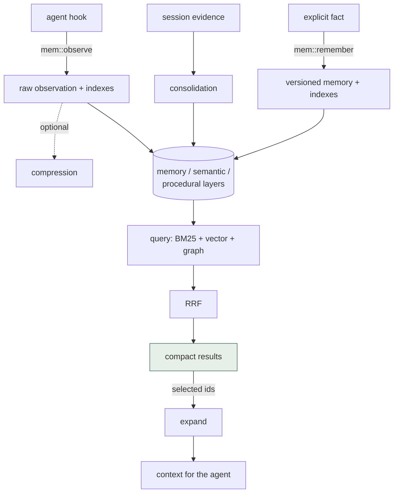
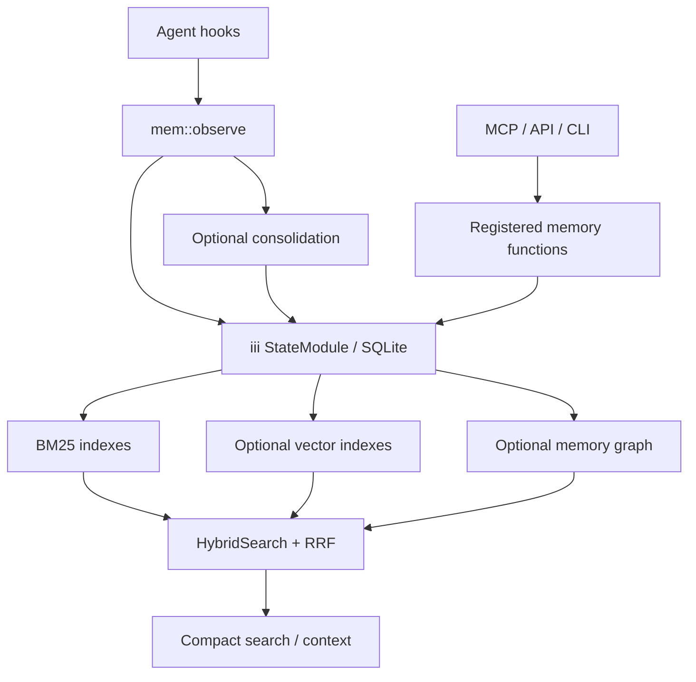

## 1. Executive Summary

`agentmemory` is a local-first memory runtime for coding agents. It accepts agent
hooks and explicit writes, stores observations and derived memory in the iii
engine's state module, and exposes search, context, consolidation, governance,
graph, team, and diagnostic functions.

Its strongest path is narrower than its feature list suggests:

- Capture raw hook events without requiring an LLM call.
- Index them lexically and, when configured, semantically.
- Retrieve compact results first and expand selected items on demand.
- Consolidate observations into longer-lived memories in a separate pass.

The implementation is unusually broad: BM25, vectors, graph expansion, memory
versioning, semantic and procedural stores, lessons, profiles, retention,
auditing, and multi-agent scopes all coexist. That breadth makes it useful as a
reference architecture, but also raises configuration and policy risk. Several
features are optional, shared agent scope is the default, and a similarity
heuristic can silently supersede an existing memory.

This is an operational memory system, not a verified knowledge system. Memories
have provenance and version fields, but no first-class candidate, rejected, or
verified state.

The inspected package version is `0.9.29` (2026-08-16), at a commit of 23 August 2026.

## 2. Mental Model

The central distinction is between captured evidence and synthesized memory:

- `RawObservation`: an agent hook, tool event, prompt, or modality payload.
- `CompressedObservation`: a structured account of facts, concepts, files,
  importance, and confidence.
- `Memory`: a longer-lived fact, pattern, preference, architecture decision,
  bug, or workflow.
- `Summary`, `SemanticMemory`, `ProceduralMemory`, `Lesson`, graph nodes, and
  profiles: additional projections over the same activity.

Typical lifecycle:

Retrieval returns *compact* results and expands only the ids the caller selects,
so the cost of reading a memory in full is paid on demand rather than for every
hit.

Most hook capture is deliberately cheap. Unless automatic compression is
enabled, `mem::observe` creates a synthetic structured observation rather than
calling an LLM for every event.

## 3. Architecture

The runtime uses the iii engine's Worker/Function/Trigger model. `StateKV`
adapts its state functions into a scoped key-value interface; higher-level
modules build retrieval and lifecycle behavior on top.

The state schema has separate scopes for sessions, observations, memories,
summaries, embeddings, relations, profiles, graph data, semantic and procedural
memory, teams, lessons, audit events, and maintenance state.

The viewer and HTTP surfaces are local by default. MCP, hooks, and registered
iii functions are the principal agent-facing paths.

## 4. Essential Implementation Paths

Capture:

- `src/functions/observe.ts`: validates, deduplicates, strips private data,
  persists the raw observation, updates the session, and indexes the result.
- `src/hooks/session-start.ts`, `pre-tool-use.ts`, and `pre-compact.ts`: hook
  behavior and context injection policy.
- `src/functions/compress.ts`: structured observation compression.

Explicit memory:

- `src/functions/remember.ts`: creates a versioned memory and supersedes a
  sufficiently similar latest memory.
- `src/functions/forget.ts`: removes entities and their search projections.
- `src/functions/governance.ts`: filtered deletion and administrative policy.

Retrieval:

- `src/functions/search.ts`: lexical search and scope filtering.
- `src/state/hybrid-search.ts`: BM25, vector, and graph fusion with weighted RRF.
- `src/functions/smart-search.ts`: compact-first search and ID expansion.
- `src/functions/context.ts`: token-budgeted context assembly.

Derivation and maintenance:

- `src/functions/consolidate.ts`: LLM synthesis of memories from observations.
- `src/functions/consolidation-pipeline.ts`: optional semantic/procedural
  extraction, reflection, and decay.
- `src/functions/privacy.ts`: private-block and secret-pattern redaction.
- `src/functions/audit.ts`: structural-change audit records.

## 5. Memory Data Model

`src/types.ts` defines the main records.

`RawObservation` retains:

- Session, hook, prompt, tool input/output, raw text, and modality fields.
- Optional agent identity.
- Creation time and capture metadata.

`CompressedObservation` adds:

- Type, title, facts, narrative, concepts, files.
- Importance and confidence.
- Links back to the source event.

`Memory` adds:

- A typed category: pattern, preference, architecture, bug, workflow, or fact.
- Content, concepts, files, session IDs, and source observation IDs.
- Strength, version, parent, supersedes, and `isLatest`.
- Optional TTL, project, and agent scope.

Graph nodes and edges, summaries, project profiles, semantic facts, procedures,
lessons, teams, and audit records form adjacent memory layers. The schema
supports provenance, but the runtime does not assign a trust verdict to each
claim.

## 6. Retrieval Mechanics

The basic `mem::search` path is BM25. Results are filtered by project, working
directory, and agent scope after retrieval, and each filter is the caller's to
set. `project` and `cwd` apply only when passed. Agent scope applies only when
`AGENTMEMORY_AGENT_SCOPE=isolated`; even then an explicit `agentId` in the call
pins the filter to that agent and `agentId: "*"` removes it
(`src/functions/search.ts:397-430`), and only a call with neither and no
`AGENT_ID` in the environment fails closed. That is a real boundary against an
agent that does not know to widen it, and not one against a caller that does, so
`scope_enforced` is not carried.

The graph carries a second clock in one module. `temporal-graph.ts` stamps
edges with `tcommit`, `tvalid` and `tvalidEnd`, closes a superseded edge's
validity, keeps the old version in an edge-history keyspace, and
`mem::temporal-query` answers an entity's relations `asOf` an instant by
filtering on both commit and validity time, with a test for it. Neither
`mem::temporal-graph-extract` nor `mem::temporal-query` has a caller, an HTTP
route or an MCP tool; the production extractor is `mem::graph-extract` in
`graph.ts`, which writes no validity time. `bitemporal` is withheld on that.

`HybridSearch` adds:

- BM25, vector, and graph retrieval arms.
- Weighted reciprocal-rank fusion.
- Query expansion and optional reranking.
- A maximum of three results per session to improve source diversity.
- Best-effort graph expansion when graph data is available.

`mem::smart-search` returns compact matches first, then expands only requested
IDs. It can fetch lessons in parallel and supports follow-up diagnostics. This
is a strong progressive-disclosure interface for agents.

`mem::context` is a separate token-budgeted assembler. It reserves slots for
pinned content and a project profile, then adds lessons, summaries, and
important observations. It is mostly recency/importance driven rather than a
query-specific hybrid search.

## 7. Write Mechanics

`mem::observe`:

- Validates the hook payload and deduplicates repeated events.
- Applies private-data stripping.
- Writes the observation while holding a session lock.
- Creates or updates the session.
- Uses zero-LLM synthetic compression by default.
- Optionally calls `mem::compress` when automatic compression is enabled.
- Updates lexical and vector indexes best-effort.

`mem::remember`:

- Validates the proposed memory and acquires a keyed lock.
- Compares it with current memories using content-token Jaccard similarity.
- At similarity above `0.7`, marks an old memory non-latest.
- Creates the new version with parent, supersedes, and source-observation links.
- Updates search indexes and triggers downstream work.

This is convenient versioning, but the threshold is not evidence that two
claims are semantically equivalent. A paraphrase, exception, or contradictory
claim can be treated as a replacement without an explicit judgment step.

`mem::forget` deletes memories, observations, or sessions and updates persisted
indexes. TTL and retention mechanisms provide additional expiry paths.

## 8. Agent Integration

The repository supplies hooks for session start, prompt submission, tool events,
compaction, stop, and session end. Context injection on session start and
pre-tool use is disabled by default to avoid token cost; pre-compaction context
is always requested with a bounded budget.

Agent access is available through MCP, HTTP, CLI, and the iii function registry.
The project documents 53 MCP tools and a much larger REST/function surface.
That breadth covers capture, retrieval, graph, reflection, governance, teams,
and diagnostics, but makes tool selection and policy review more demanding.

Agent scope defaults to shared. Setting `AGENTMEMORY_AGENT_SCOPE=isolated` with
an agent identity filters recall to that agent unless the call names another
agent or the wildcard.

The viewer is the person's surface. Its memories tab lists every stored memory
with title, type, strength, version and last update, a row expands to the full
record, and a delete button asks for confirmation before calling
`DELETE /agentmemory/governance/memories` with the reason *"Deleted via
viewer"*; the audit tab lists what governance operations removed. Review here
means deletion — there is no approve, reject or pending state, which is why this
report no longer carries `human_review`. The mark asks whether a memory waits in
a state until an actor the producing agent cannot be resolves it; every memory
here is live from the moment it is written, and the viewer lets a person remove
one afterwards. The nearest waiting state in the tree is a `Checkpoint`
(`src/types.ts:761-773`), which has a `type` of `approval`, a status of
`pending`/`passed`/`failed`/`expired` and a `resolvedBy` — but it gates
`linkedActionIds` rather than memory content, `memory_checkpoint`
(`src/mcp/tools-registry.ts:536-538`) is described as creating *or resolving*
one, and `resolvedBy` is assigned straight from the request
(`src/functions/checkpoints.ts:120`). Deletion through an audited path is a real
correction surface and the report credits it as one.

## 9. Reliability, Safety, and Trust

Strengths:

- Session and keyed locks protect key write paths.
- Private-tag and common-secret redaction occurs before persistence.
- Search indexes can be rebuilt and are dimension-checked.
- Deletion is propagated to persisted indexes.
- **Structural deletion emits audit records, under a written policy.**
  `src/functions/audit.ts` opens with a coverage rule: *"Every structural
  deletion of a memory, observation, session, or semantic row MUST call
  recordAudit"*, in one of two shapes — one row per scoped call with
  `targetIds`, or one batched row per bulk sweep carrying every removed id and
  an evicted count, because *"per-item audit rows would flood the audit log
  during routine sweeps"*. The rule ends *"Either shape is required; silent
  deletes are not acceptable"*, and it instructs future contributors to add the
  `recordAudit` call **before** the `kv.delete`. `recordAudit` writes an
  `AuditEntry` — id, timestamp, operation, user, function, target ids, details,
  quality score — into its own `KV.audit` keyspace under a freshly generated id,
  so the log is insert-only.
- Non-loopback viewer access requires an API secret and allowed hosts.
- Isolated-agent retrieval fails closed when identity is absent, and
  `test/agent-isolation-search.test.ts` asserts another agent's observation is
  absent from an isolated search beside a wildcard call that returns both.

Limitations:

- API authentication is optional when no secret is configured.
- Shared agent scope is the default, and a caller can widen an isolated one.
- Redaction is regex-based and cannot guarantee secret removal.
- Similarity-based supersession lacks a candidate/rejected review state.
- Retrieved memory is wrapped for context, but remembered content is still
  untrusted text and should not be interpreted as privileged instructions.
- Operational correctness depends on the iii engine and a large set of optional
  subsystems remaining mutually consistent.

## 10. Tests, Evals, and Benchmarks

The repository contains a large test tree — 163 files under `test/` — covering
functions, state, hooks, search, graph behavior, privacy, and maintenance. Two
carry exclusion cases with a present control: isolated search omits another
agent's observation while a wildcard call returns it, and a project-scoped mesh
export omits another project's memories (`test/mesh-export-project-scope.test.ts`,
added 15 August 2026). `test/remember-supersede-recall.test.ts` asserts a
superseded memory leaves the search index. Project documentation reports
more than 1,400 tests. The source test suite was not run for this atlas review.

The published LongMemEval-S figures are retrieval-only: the documented setup
uses 500 questions, a fresh index per question, and `all-MiniLM-L6-v2`. It does
not evaluate end-to-end answer correctness. The repository documents R@5,
R@10, and MRR results, but does not commit the per-question result artifact.

The coding-agent-life benchmark is transparent about its small size: 15
synthetic sessions and 15 queries. Its perfect R@5 result is useful as a smoke
test, not broad evidence of production recall quality. `ROADMAP.md` still lists
benchmark-harness CI as future work.

## 11. For Your Own Build

### Steal

- Zero-LLM capture in the synchronous hook path.
- Compact search results with explicit expansion by ID.
- Independent lexical, vector, and graph arms fused with RRF.
- Per-session result caps for source diversity.
- Source observation IDs on synthesized memories.
- Separate immediate capture from optional consolidation.
- Fail-closed identity behavior in isolated scope — and do not let the caller
  override it.
- Audited structural deletion and rebuildable projections.

### Avoid

- Treating fuzzy content similarity as authority to supersede a memory.
- Shipping a very large tool surface without a correspondingly small default
  policy surface.
- Defaulting multi-agent installations to shared memory, and letting a call
  argument lift the isolation that replaces it.
- Presenting retrieval metrics as if they measured end-to-end memory quality.
- Accumulating many derived stores without explicit consistency contracts.
- Encoding confidence without a first-class verification or rejection state.

### Fit

Borrow it when the integration target is a coding agent, local event capture is
important, and a team is prepared to operate the iii runtime and choose among
many optional capabilities.

Build a smaller subset when the real requirement is only session capture plus
search. The most reusable core is: raw observations, provenance, BM25/vector
fusion, compact-first results, bounded context, and asynchronous consolidation.

Add an explicit review state before using remembered claims for consequential
automation. In multi-agent deployments, turn isolated scope on deliberately
rather than relying on the shared default.

## 12. Open Questions

- Should supersession require contradiction/equivalence judgment instead of a
  Jaccard threshold?
- Which state store is authoritative when a derived graph or vector index
  diverges?
- How are untrusted recalled instructions neutralized before agent execution?
- Which of the documented functions form the supported compatibility surface?
- Can benchmark runs and per-question outputs be published in CI?
- What migration guarantees exist across the broad state schema?

## Appendix: File Index

- `src/types.ts`: primary memory and observation types.
- `src/state/schema.ts`: state scopes and persistent layout.
- `src/state/kv.ts`: iii state adapter.
- `src/functions/observe.ts`: hook capture.
- `src/functions/remember.ts`: explicit memory and supersession.
- `src/functions/search.ts`: lexical search.
- `src/state/hybrid-search.ts`: BM25/vector/graph fusion.
- `src/functions/smart-search.ts`: compact search and expansion.
- `src/functions/context.ts`: token-budgeted context.
- `src/functions/consolidate.ts`: observation-to-memory synthesis.
- `src/functions/consolidation-pipeline.ts`: optional derived-memory pipeline.
- `src/functions/privacy.ts`: redaction.
- `src/functions/governance.ts`: deletion and administration.
- `src/functions/audit.ts`: audit behavior.
- `src/functions/temporal-graph.ts`: the as-of edge query, registered with no caller.
- `src/viewer/index.html`: the memories table and the delete confirmation.
- `test/agent-isolation-search.test.ts`, `test/mesh-export-project-scope.test.ts`: exclusion cases.
- `src/hooks/`: coding-agent lifecycle hooks.
- `benchmark/LONGMEMEVAL.md`: retrieval benchmark methodology.
- `docs/benchmarks/2026-05-20-coding-agent-life-v1.md`: small synthetic eval.

## History

**2026-09-19** — audited at the unchanged pin [`e04ba88819c365c9acf9d6661ea802143e728bd6`](https://github.com/rohitg00/agentmemory/commit/e04ba88819c365c9acf9d6661ea802143e728bd6); nothing upstream moved. `human_review` is **withdrawn**, one reading after it was added, and the record itself contained the reason: *"the surface adjudicates by removal only, with no approve or reject state."* Under the question the mark now asks — does a memory wait in a state until an actor the producing agent cannot be resolves it — a delete button over live rows is a correction surface, not a gate. The `Checkpoint` type was tested as the alternative and fails on three counts at once: it gates actions rather than memory content, `memory_checkpoint` is declared to the model as creating *or resolving* one, and `resolvedBy` is copied from the request without verification. `audit_log` and `negative_eval` both stand with their anchors re-verified — the written policy at `src/functions/audit.ts:5-12` that every structural deletion calls `recordAudit` before `kv.delete`, and the isolated-search exclusion at `test/agent-isolation-search.test.ts:149` with its wildcard positive control at `:165`. Screened again first; nothing was installed and no suite was run.

**2026-09-15** — [`e04ba88819c365c9acf9d6661ea802143e728bd6`](https://github.com/rohitg00/agentmemory/commit/e04ba88819c365c9acf9d6661ea802143e728bd6) — 8 commits on, 2026-08-23, at 0.9.29. Screened before reading: one auto-run surface, three unpinned surfaces and an `AGENTS.md` addressed to a reading agent, read as data; nothing was installed or run. The commits add Devin and Cursor adapters, content-hashed dedup for hook events that had collapsed onto one key, a single summarize per stop, a viewer that expands memory rows, a WebSocket frame guard, and project-scope parity across capture surfaces with a project-scoped export test. Four mark decisions changed on code that predates the first reading. `scope_enforced` withdrawn: project and cwd filters are optional, agent isolation is opt-in, and a call's explicit or wildcard `agentId` overrides it. `negative_eval` added on the isolated-search exclusion test (7 June 2026) and the project-scoped export test. `human_review` added on the viewer's memories table, where a person deletes through the audited governance path. `bitemporal` withheld with the reason now written in section 6: the as-of edge query and its validity stamps sit in a registered module nothing calls. Three marks.

**2026-08-06** — [`d60652a7058773fa9428fa720eda38942f12f014`](https://github.com/rohitg00/agentmemory/commit/d60652a7058773fa9428fa720eda38942f12f014) — 8 commits on, and one published position was wrong at the previous pin rather than overtaken by it.

`audit_log` is earned and was earned before. `src/functions/audit.ts` was present at `d8b5267c` carrying the coverage policy quoted in section 9, and `recordAudit` writes an insert-only `AuditEntry` into its own `KV.audit` keyspace. The mark was not claimed, and the report described the mechanism as something deletion *"is designed to"* do — language that describes an intention rather than deciding whether the artifact exists. It exists.

`5023cf3` fixes a deletion that reported success without deleting: calling `mem::forget` with a lesson id (`lsn_*`) removed a nonexistent key from the memories keyspace, counted it, and returned success. The delete, the index cleanup and the counter are now guarded on the `kv.get` result, matching the `mem::governance-delete` pattern, and a separate `mem::lesson-delete` path soft-deletes the lesson and records an audit row. Worth naming beyond the fix: a forget that reports success without acting is the failure underneath every deletion claim in this atlas, and it is invisible to any test that only asserts the call returned.

Also in this range: `@xenova/transformers` migrated to `@huggingface/transformers` v4, embedding-dimension handling extracted to `_dimensions.ts`, native hook adapters for two more CLIs, and a project-name override for the OpenCode integration.

Screened again: 0 auto-run surfaces, 2 build-time exec paths, and an `AGENTS.md` addressed to a reading agent, read as data. Nothing was installed or run.

**2026-07-26** — [`d8b5267c367a5da07ad3619363520b7f1a506c6b`](https://github.com/rohitg00/agentmemory/commit/d8b5267c367a5da07ad3619363520b7f1a506c6b) — first reading.
