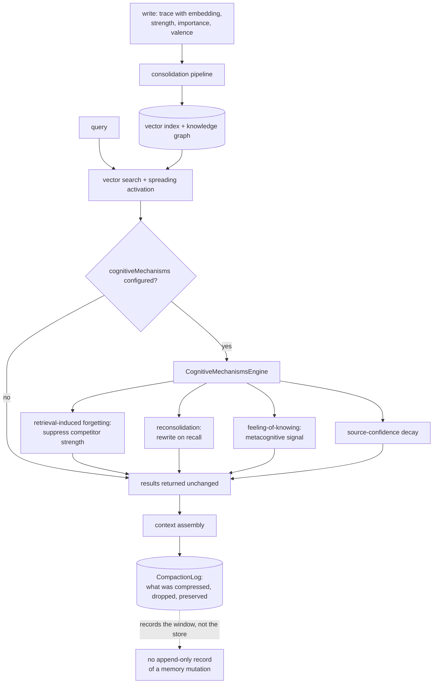

## 1. Executive Summary

AgentOS is a TypeScript agent framework whose `src/cognition/memory` runs to about
64,200 lines across retrieval, consolidation, a knowledge graph in both SQL and
Neo4j, a GraphRAG engine and a context pipeline. It is the largest memory
subsystem this atlas has read inside a general agent framework rather than a
memory product.

**Its distinctive contribution is a mechanisms layer drawn from the cognitive
literature**, with the papers cited in the source. Ten are implemented:
retrieval-induced forgetting, reconsolidation, involuntary recall, a metacognitive
feeling-of-knowing detector, temporal gist, schema encoding, source-confidence
decay, emotion regulation, persona drift, and spreading activation beside them.
`RetrievalInducedForgetting.ts` opens by naming its source — *"Inhibition account
(Anderson & Spellman, 1995)"* — and implements competitor suppression as a
strength effect on similar traces.

That layer is **opt-in and wired**, which is worth separating carefully because
ten named mechanisms is the exact shape that usually hides an unwired one. All
eight of the imported mechanism functions are called inside
`CognitiveMechanismsEngine`, the engine is constructed at
`CognitiveMemoryManager.ts:360-362` behind `if (config.cognitiveMechanisms)`, and
`cognitiveMechanisms` is a documented option on the public agent API. The producer
is the adopter. The project also handles the one misconfiguration that would
silently disable everything: passing `cognitiveMechanisms` while memory is off
logs a warning that *"the cognitiveMechanisms config will be ignored"*
(`src/api/agent.ts:749-757`) rather than failing quietly.

**One mark of the seven.** `scope_enforced` is earned on the agency layer, where
`const metadataFilter: MetadataFilter = { agencyId }` is built unconditionally and
passed as the vector provider's filter (`AgencyMemoryManager.ts:455-471`). A
per-agency collection exists beside it, which is a physical partition and not what
earns the mark; the predicate is.

The other six are withheld, and the pattern in the refusals is the finding.

## 2. Mental Model

A memory is a trace with a strength, and the epistemics are continuous
throughout — nothing here is ever *rejected*, only weakened.



The dotted edge is the distinction section 9 turns on.

## 3. Architecture

A library, not a service. The store is an in-process vector index with optional
write-through to a durable `Brain`, plus a knowledge graph behind an interface
with SQL and Neo4j implementations, and a vector provider the adopter binds. What
has to be running is whatever the adopter chose; the default is in-process only.

`GraphRAGEngine.ts` at 2,162 lines is the largest single file, with a Neo4j
variant beside it.

## 4. Essential Implementation Paths

- **Mechanisms** — `src/cognition/memory/mechanisms/`: `CognitiveMechanismsEngine.ts`
  (imports at 36-43, construction gate at `CognitiveMemoryManager.ts:360-362`),
  `retrieval/RetrievalInducedForgetting.ts`, `retrieval/Reconsolidation.ts`,
  `retrieval/InvoluntaryRecall.ts`, `retrieval/MetacognitiveFOK.ts`,
  `consolidation/TemporalGist.ts`, `consolidation/SchemaEncoding.ts`,
  `consolidation/SourceConfidenceDecay.ts`, `consolidation/EmotionRegulation.ts`,
  `PersonaDriftMechanism.ts`, `defaults.ts`.
- **Public option** — `src/api/agent.ts:749-757`, `src/api/types.ts:1437`.
- **Store** — `src/cognition/memory/retrieval/store/MemoryStore.ts`, `Brain.ts`,
  `SqlKnowledgeGraph.ts`.
- **Graph retrieval** — `retrieval/graph/graphrag/GraphRAGEngine.ts`,
  `Neo4jGraphRAGEngine.ts`, `graph/knowledge/IKnowledgeGraph.ts`.
- **Scope** — `src/agents/agency/AgencyMemoryManager.ts:455-471`.
- **Compaction transparency** — `src/cognition/memory/pipeline/context/CompactionLog.ts`.

## 5. Memory Data Model

A trace carries an embedding, a strength, an importance score, emotional valence
and tags. `IKnowledgeGraph.ts:110` declares an optional `validFrom`, and there is
no `validUntil` and no record-time field anywhere:

```sh
grep -rn "validUntil\|valid_until\|recordedAt\|transactionTime" src/cognition/memory --include="*.ts"
```

Nothing at the pinned commit. **`bitemporal` is withheld** — one optional
timestamp is a creation date, not a second axis.

There is no status enum on a trace. Confidence is a number, `SourceConfidenceDecay`
reduces it over time, and `MetacognitiveFOK` computes a feeling-of-knowing signal —
all continuous. **`trust_state` is withheld**: the rubric asks for a discrete
status including one that withholds a memory, and a decaying float never withholds,
it only ranks lower.

## 6. Retrieval Mechanics

Vector search over the in-process index, spreading activation over the knowledge
graph, and a GraphRAG engine for community-level questions. When the mechanisms
engine is configured, results pass through it before returning: competitors are
suppressed, a feeling-of-knowing signal is attached, and an involuntary recall may
be injected.

Scope is applied at the agency layer rather than per trace. Inside one agency,
retrieval does not filter by contributing agent unless the caller passes
`fromRoles`, which is a narrowing convenience rather than a boundary.

## 7. Write Mechanics

Writes go through a consolidation pipeline and are synchronous from the caller's
view; decay and the mechanisms run over the store afterwards. There is no queue
between writing and retrievability.

**Forgetting is entirely a strength effect.** Retrieval-induced forgetting reduces
competitor strength with a floor so it does not *"kick dead traces"*;
source-confidence decay lowers a number. Nothing is recorded as having been wrong.
**`tombstone` is withheld**, and the shape of the near-miss is unusual: most
systems in this corpus lack a tombstone because they lack any correction
mechanism, while this one has four and none of them writes down what was
corrected.

## 8. Agent Integration

A framework API — `createAgent` with a memory option and an optional
`cognitiveMechanisms` config, an agency layer for multi-agent sharing, and a
memory facade at `io/facade/Memory.ts`. No MCP server and no HTTP surface: the
integration is that you are writing TypeScript against it.

## 9. Reliability, Safety, and Trust

`CompactionLog` is the piece most likely to be mistaken for an audit log, and the
distinction matters enough to state. Its header is accurate about what it does:
*"Transparency audit trail for context window compaction. Every compaction event is
logged with full provenance: what was compressed, the summary produced, entities
preserved, content dropped, traces created."* That is a careful, queryable record —
and it records **what reached the model in one run**, which cannot later turn out
to be false. It happened.

**`audit_log` is withheld** because no append-only record of mutations to the
memory store exists:

```sh
grep -rn -iE "append.?only|mutationLog|auditTrail" src/cognition/memory --include="*.ts"
```

Nothing outside tests at the pinned commit. The engineering effort here sits on
the context window, and the store beside it has no ledger.

**`human_review` is withheld** for absence: the `review` matches in this tree are
`MemoryReflector` and `Reconsolidation`, both automatic passes. There is no
surface where a person inspects or adjudicates a memory.

## 10. Tests, Evals, and Benchmarks

Substantial: `tests/memory/` plus `__tests__` directories throughout, including a
1,558-line `MemoryStore.brainhydration.test.ts` and a 997-line
`SqlKnowledgeGraph.test.ts`. `CITATION.cff` is a software citation; there is no
paper of the project's own, and the citations that matter are the psychology
papers named in the mechanism sources.

**`negative_eval` is withheld, and the reason is worth stating precisely** because
the tests do contain negative assertions. `SpreadingActivation.spec.ts:37` asserts
`expect(ids).not.toContain('A')` under the title *"excludes seed nodes from
results"*, and it is paired with a populated control two lines above
(`toContain('B')`, `toContain('C')`), so it is not vacuous. It is simply about a
different thing: that a graph walk does not return its own seed is an algorithm
invariant, and `not.toContain('D')` for a node two hops away is a depth-limit
check. Neither asserts that particular material must be withheld from a reader.
The mark asks whether what the mechanism holds could turn out to be false; a
spreading-activation seed exclusion could not.

Nothing was run. The screen reports an npm `prepare` lifecycle that builds on
install, a `prepublishOnly` chain, and both `package.json` and `pnpm-lock.yaml`
changed the day before the pin, inside the seven-day cooldown.

## 11. For Your Own Build

### Steal

**Cite the paper in the file that implements it.** `RetrievalInducedForgetting.ts`
names Anderson & Spellman 1995 and states which account of the effect it
implements, so a reader can check whether the code matches the claim. Most
cognitive-sounding memory code in this corpus cites nothing.

**Warn when a config is set that cannot take effect.** Passing
`cognitiveMechanisms` with memory disabled logs that the config will be ignored.
The alternative — silently doing nothing — is how a feature comes to be believed
in for months.

**Give the expensive layer a dynamic import behind its own config key.** The
mechanisms engine is imported only when configured, so an adopter who does not
want it does not pay for it, and the gate is one legible line.

**Log what compaction dropped, not just what it kept.** `CompactionLog` records
content dropped and entities preserved, which is the half that lets someone ask
why an agent forgot something mid-conversation.

### Avoid

**Correcting only by weight.** Four mechanisms here make a wrong memory less
retrievable and none records that it was wrong. A trace suppressed by
retrieval-induced forgetting and a trace nobody has needed lately are
indistinguishable afterwards, so the system cannot answer *why* something stopped
surfacing.

**Auditing the window and calling it memory.** The compaction log is genuinely
good and it is a record of one run's context assembly. A reader who wants to know
what happened to a *memory* — when it changed, who changed it — has nothing to
read.

**Letting a boundary be a collection.** The per-agency collection is a real
separation, and the predicate beside it is what survives a refactor that moves two
agencies into one store.

### Fit

This suits a team building on AgentOS that wants memory to behave like human
memory — recency and salience effects, gist over detail, retrieval that reshapes
what is retrieved. The mechanisms are the reason to choose it and they are
implemented with more care than the framing usually gets.

It is the wrong fit where a memory has to be *governed*: there is no review
surface, no epistemic status, no record of a correction, and no audit of the
store. A system that must answer "who changed this and why" needs a different
store beside this one, and at that point the cognitive layer is the thing worth
keeping rather than the memory.

## 12. Open Questions

- **Would a discrete status fit the mechanisms, or fight them?** The design is
  continuous on purpose, and a `rejected` state is a different theory of memory
  from decay.
- **What happens to a suppressed trace over time?** Retrieval-induced forgetting
  has a floor so it does not kill dead traces; whether suppression accumulates
  across many retrievals is not traced here.
- **Is the compaction log ever reconciled against the store?** It records traces
  created during compaction, which is the one place the two could be joined.
- **How many adopters pass `cognitiveMechanisms`?** The whole distinctive layer is
  off by default, and the examples in the tree do not set it.

## Appendix: File Index

**Mechanisms**

- `src/cognition/memory/mechanisms/CognitiveMechanismsEngine.ts` — imports (36-43)
- `mechanisms/retrieval/` — `RetrievalInducedForgetting.ts` (source cited at 2-9,
  floor at 25), `Reconsolidation.ts`, `InvoluntaryRecall.ts`, `MetacognitiveFOK.ts`
- `mechanisms/consolidation/` — `TemporalGist.ts`, `SchemaEncoding.ts`,
  `SourceConfidenceDecay.ts`, `EmotionRegulation.ts`
- `mechanisms/PersonaDriftMechanism.ts`, `mechanisms/defaults.ts`,
  `mechanisms/types.ts` (the undefined default, 5)

**Wiring**

- `src/cognition/memory/CognitiveMemoryManager.ts` — construction gate (360-362)
- `src/api/agent.ts` — the ignored-config warning (749-757); `src/api/types.ts:1437`

**Store and retrieval**

- `retrieval/store/MemoryStore.ts`, `Brain.ts`, `SqlKnowledgeGraph.ts`
- `retrieval/graph/graphrag/GraphRAGEngine.ts`, `Neo4jGraphRAGEngine.ts`
- `retrieval/graph/knowledge/IKnowledgeGraph.ts` — `validFrom` (110)

**Scope and transparency**

- `src/agents/agency/AgencyMemoryManager.ts` — metadata filter (455-471)
- `src/cognition/memory/pipeline/context/CompactionLog.ts`

**Tests**

- `tests/memory/SpreadingActivation.spec.ts` (37, 84), `tests/memory/` generally,
  `retrieval/store/__tests__/MemoryStore.brainhydration.test.ts`

### Commands behind the absence claims

```sh
grep -rn "validUntil\|valid_until\|recordedAt\|transactionTime" src/cognition/memory --include="*.ts"
grep -rn -iE "append.?only|mutationLog|auditTrail" src/cognition/memory --include="*.ts"
grep -rn "cognitiveMechanisms" src examples docs | grep -v "__tests__\|\.spec\."
```

## History

**2026-09-13** — [`f66718d6e18460b45c45dc4a476745dd7c00e319`](https://github.com/framerslab/agentos/commit/f66718d6e18460b45c45dc4a476745dd7c00e319) — first reading. Screened first: an npm `prepare` lifecycle that builds on install, a `prepublishOnly` chain, and both `package.json` and `pnpm-lock.yaml` changed the day before the pin, inside the cooldown. Nothing was installed and no test was run. One mark. The producer test was run on all ten cognitive mechanisms because ten named components is the shape that usually hides an unwired one; all are called, the engine is constructed behind an optional config key, and that key is a documented option on the public agent API, so the producer is the adopter rather than nothing. `audit_log` is withheld on a deliberate distinction: `CompactionLog` is a careful provenance record of what reached the model in one run, which cannot turn out to be false, and no append-only record of store mutations exists. `negative_eval` is withheld although negative assertions exist and are non-vacuous — they assert a graph walk excludes its own seed, which is an algorithm invariant rather than a claim that material must be withheld.
