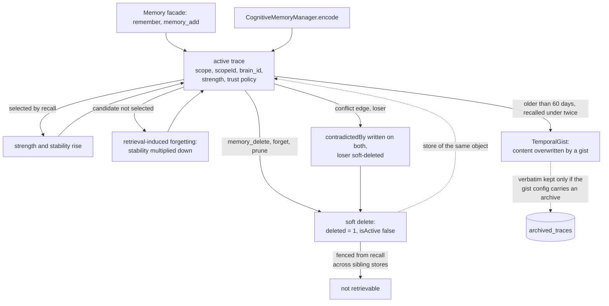

## 1. Executive Summary

AgentOS is a TypeScript agent framework with two memory stacks that share a SQL
schema and little else. The `Memory` facade, which `souledAgent()` wires into an
agent, is SQLite or Postgres with full-text search and an HNSW sidecar.
`CognitiveMemoryManager` carries a mechanisms layer drawn from the cognitive
literature. The documented high-level path, `souledAgent()`, never reaches that
layer, and the facade's recall omits the `brain_id` its own schema is keyed on.

**The mechanisms layer cites its papers in the source.** Ten are implemented:
retrieval-induced forgetting, reconsolidation, involuntary recall, a metacognitive
feeling-of-knowing detector, temporal gist, schema encoding, source-confidence
decay, emotion regulation, persona drift, and spreading activation beside them.
`RetrievalInducedForgetting.ts` opens by naming its sources, among them the
*"Inhibition account (Anderson & Spellman, 1995)"*, and implements competitor
suppression by multiplying down the stability of candidates a query did not
select.

**The layer is wired on one path and not on the one the API names.** All eight
imported mechanism functions are called inside `CognitiveMechanismsEngine`, and
`CognitiveMemoryManager` constructs the engine behind `if
(config.cognitiveMechanisms)` (`CognitiveMemoryManager.ts:360-362`). An adopter
reaches it through `AgentMemory.initialize` or by constructing the manager.
`agent()` also accepts `cognitiveMechanisms`, and reads it only to warn when
memory is off (`src/api/agent.ts:743-757`). It forwards the key nowhere, and its
memory is a `memoryProvider` hook that `souledAgent()` fills with the facade.

**Two marks of the seven.** `scope_enforced` is earned on the agency layer, where
`const metadataFilter: MetadataFilter = { agencyId }` is built unconditionally and
passed as the vector provider's filter (`AgencyMemoryManager.ts:455-471`).
`negative_eval` is earned on the cognitive store: a committed case asserts that a
soft-deleted trace leaves a sibling store's recall after the same query returned
it (`MemoryStore.brainhydration.test.ts:306-343`).

The other five are withheld, each on a near-miss: a trust policy fixed at the
write, validity dates nothing reads, soft deletes keyed on the row, logs of
counts and reads rather than mutations, and an approval gate on tool calls rather
than on memory.

## 2. Mental Model

A memory is a trace with a scope, a strength and a trust policy. It becomes one
when the facade's `remember`, an agent's `memory_add` tool or
`CognitiveMemoryManager.encode` writes it, and by default nothing screens it
first. Most corrections adjust a weight or rewrite the text. The one durable exit
from recall is a soft delete keyed on the trace id.



The state that survives a correction is the loser's id in the winner's
`contradictedBy`. A later write of the same value is a new trace with a new id,
and nothing compares it with what lost.

## 3. Architecture

A library with two memory stacks and a third for multi-agent sharing.

- **The `Memory` facade** (`io/facade/Memory.ts`, 1,972 lines) sits on a `Brain`
  over `@framers/sql-storage-adapter`. `Memory.createSqlite` opens one file;
  `Memory.createPostgres` requires a `brainId` because Postgres mode is
  multi-tenant (`Memory.ts:376-381`, `Brain.ts:713-717`). Retrieval is FTS5 or
  tsvector plus an HNSW sidecar. `createTools()` hands the agent five memory
  tools, and a sixth when a consolidation loop exists (`Memory.ts:1453-1468`).
- **`CognitiveMemoryManager`** (1,690 lines) runs `MemoryStore`: an in-process
  vector index over a provider the adopter binds, one collection per scope, with
  optional write-through to a `Brain`. Beside it sit a SQL or Neo4j knowledge
  graph, GraphRAG, a consolidation pipeline, the mechanisms engine and a
  typed-network observer whose store holds *"the working set of typed facts and
  their edges for a single retrieval session"* (`TypedNetworkStore.ts:5-7`).
- **`AgencyMemoryManager`** gives each agency a vector collection and a filter.
  It is exported for the adopter to construct.

`souledAgent()` makes markdown under a soul workspace's `memory/` the source of
truth and the facade's SQLite a rebuildable index (`souledAgent.ts:66-72`). The
wiki compiler under `src/substrate/memory/wiki/` was not traced.

**What has to run.** Nothing beyond a SQLite file for the facade. An API key is
needed only for LLM passes and embeddings, and the store is a SQLite file a
person can query. `GraphRAGEngine.ts` at 2,162 lines is the longest file in the
memory tree.

## 4. Essential Implementation Paths

- **Facade write and recall** — `io/facade/Memory.ts`: `recall` (616), its WHERE
  (632-661), HNSW candidates and full-row fetch (566, 733), `forget` (815),
  `addRelation` (1110-1131), `createTools` (1453).
- **Agent tools** — `io/tools/MemoryAddTool.ts`, `MemorySearchTool.ts` (scope
  predicate 210-219), `MemoryDeleteTool.ts` (126), `scopeContext.ts`.
- **High-level wiring** — `src/api/agent.ts` (`AgentMemoryProvider` 69-97, the
  warning 743-757), `src/api/souledAgent.ts` (the provider 77-85).
- **Cognitive manager** — `CognitiveMemoryManager.ts`: engine gate (360-362),
  encode and the policy stamp (655), the `usableFor` filter (788-806), the archive
  handle (518-519).
- **Cognitive store** — `retrieval/store/MemoryStore.ts`: `query` (1218), scope
  fallback (1247), metadata filter (1270-1279), tombstone fence (1329-1345,
  1441-1446), `softDelete` (1741).
- **Mechanisms** — `mechanisms/CognitiveMechanismsEngine.ts` (imports 36-43),
  `retrieval/RetrievalInducedForgetting.ts`, `consolidation/TemporalGist.ts`
  (archive 103-120, overwrite 146), and the other seven files beside them.
- **Correction** — `pipeline/consolidation/ConsolidationPipeline.ts`
  `resolveConflicts` (416-485); `pipeline/consolidation/ConsolidationLoop.ts`
  prune and merge.
- **Scope** — `src/agents/agency/AgencyMemoryManager.ts:455-471`.
- **Compaction transparency** — `pipeline/context/CompactionLog.ts`.

## 5. Memory Data Model

A `MemoryTrace` carries a type, a `scope` of `thread`, `user`, `persona` or
`organization`, and a `scopeId` (`core/types.ts:290-346`). It also carries
provenance with a source type, a confidence, a verification count and a
`contradictedBy` list, plus emotional context, Ebbinghaus strength and
stability, a trust policy and `isActive`. A `Brain` row keys the same trace on
`(brain_id, id)` with a `scope` column, a JSON `metadata` holding `scopeId`, and
a `deleted` flag (`Brain.ts:392-409`).

**The trust policy is discrete and fixed at the write.** `MemoryTrustPolicy`
holds `usableForAuthorization`, `usableForPersonalization`, `usableForFactClaim`
and an optional re-verification window (`core/types.ts:114-139`). Encode copies
it from `DEFAULT_TRUST_POLICY_BY_SOURCE` (`CognitiveMemoryManager.ts:655`), and
`retrieve` drops traces that fail it when the caller passes `usableFor`
(`CognitiveMemoryManager.ts:788-806`). That encode stamp is its only writer.
**`trust_state` is withheld**: the flags are a genre derived from the source
type, and no event moves a trace between them.

**Relations carry a validity interval and a record time.** `KnowledgeRelation`
has `createdAt`, `validFrom` and `validTo` (`IKnowledgeGraph.ts:108-111`),
persisted in SQL metadata and as Neo4j properties (`SqlKnowledgeGraph.ts:391-417`,
`Neo4jKnowledgeGraph.ts:264-290`). The facade's `addRelation` passes both dates
through from the caller (`Memory.ts:1110-1131`). No read in `src/` filters on
either. Episodic graph memories carry `occurredAt` beside `createdAt`, and the one
writer in `src/` sets it from the trace's `createdAt` (`MemoryStore.ts:1184`).
Typed facts carry an occurrence interval and a mention time
(`typed-network/types.ts:75-82`) in the in-process store. **`bitemporal` is
withheld**: the second axis is stored and never queried, or written from the
first clock.

## 6. Retrieval Mechanics

**The facade reads without `brain_id`.** `recall` builds its WHERE from
`t.deleted = 0` plus optional type, scope, `scopeId`, strength and time filters
(`Memory.ts:632-661`). The HNSW sidecar loads every row's embedding with no
`brain_id` term (`Memory.ts:566`), and the fused candidates are fetched by id
alone (`Memory.ts:733`). The `Brain` docstring promises `brain_id` *"into every
WHERE clause on SELECT"* (`Brain.ts:713-714`). On one SQLite file per agent,
which is what `souledAgent()` opens, the omission is harmless. On a shared
Postgres database the SQL this file composes reads across brains. The join
helper comes from `@framers/sql-storage-adapter` and was not read.

**The agent's search tool lets the model choose the axis, not the id.**
`memory_search` takes an optional `scope`; when present, the handler resolves the
`scopeId` from the execution context's user, persona, conversation or
organisation rather than from the model (`MemorySearchTool.ts:210-219`,
`scopeContext.ts`). When the model omits `scope`, no scope predicate is added, so
every user's traces in the brain are candidates.

**The cognitive store partitions by collection.** `MemoryStore.query` searches
the collections named by `options.scopes`, or every known scope when none is
passed (`MemoryStore.ts:1247`). Its metadata filter holds `isActive`, type,
confidence and `timeRange.after`; `timeRange.before` is declared on the options
and not applied there (`MemoryStore.ts:1270-1279`). Results pass the tombstone
fence, then scoring, then retrieval-induced forgetting and feeling-of-knowing,
then the optional `usableFor` filter after the top-K cut.

**The agency query embeds with a placeholder.** `querySharedMemory` always
embeds the query with `generateSimpleEmbedding`, a character-code hash whose
comment reads *"This is a placeholder - in production, use a proper embedding
model"* (`AgencyMemoryManager.ts:126-140`, `:464`). Ingest uses a supplied
embedding when given one (`:346`), so a query and its documents can sit in
different vector spaces.

## 7. Write Mechanics

**Writes are synchronous.** The facade's `remember` and the `memory_add` tool
insert a row in one transaction; the tool writes a NULL embedding
(`MemoryAddTool.ts:180-187`) and its docstring leaves embedding to a background
encoder, not traced. `CognitiveMemoryManager.encode` runs feature detection,
stores, focuses working memory and registers a graph node before returning. The
cognitive consolidation pipeline runs on a timer when enabled; the facade's
`ConsolidationLoop` runs when called.

**Correction is keyed on the row.** `memory_delete`, the facade's `forget` and
the loop's prune set `deleted = 1` on `(brain_id, id)` (`MemoryDeleteTool.ts:126`,
`Memory.ts:815-821`). `resolveConflicts` picks a winner by recency or confidence,
appends each id to the other's `contradictedBy`, re-upserts both, and
soft-deletes the loser (`ConsolidationPipeline.ts:416-485`). Its comment notes
the SQL schema has no column for `contradictedBy`, so the SQL row gains only
`deleted = 1`, and no code reads `contradictedBy` beyond serialising it.
**`tombstone` is withheld**: every record here is keyed on a trace id, and the
same value re-encoded arrives as a new trace.

**The soft delete is fenced.** `MemoryStore` keeps a local tombstone set,
reconciles vector hits against the durable `deleted` column before scoring, and
returns nothing when that check cannot run (`MemoryStore.ts:1329-1345`). A
vector delete that fails leaves the document in the provider and out of recall.

**The gist overwrites without the archive the reader expects.** `TemporalGist`
replaces a trace's content with an LLM gist (`TemporalGist.ts:146`). It writes
the verbatim text to `archived_traces` first only when its resolved config
carries `archive` (`:103-120`). The public `TemporalGistConfig` declares no such
field (`mechanisms/types.ts:65-76`), and the manager keeps `config.archive` for
rehydration without handing it to the engine (`CognitiveMemoryManager.ts:360-362`,
`:518-519`). On a typed configuration a gisted trace's original text is written
nowhere.

## 8. Agent Integration

`agent()` takes a `memoryProvider` whose `getContext` runs before each LLM call
and whose `observe` runs after it, fire-and-forget (`agent.ts:69-97`,
`:207-215`). `souledAgent()` fills that provider with the facade: `observe`
writes a `persona`-scoped episodic trace and `getContext` recalls eight traces
with no scope (`souledAgent.ts:77-85`). The memory tools reach a registry through
`createMemoryToolsPack`. `AgentMemory` wraps either stack.

`AgentOSServer` serves `/health`, `/api/agentos/personas` and
`/api/agentos/chat` and no memory route (`src/api/server/AgentOSServer.ts:51-62`).
There is no MCP server.

## 9. Reliability, Safety, and Trust

**Tenant isolation depends on the file.** Every facade write stamps `brain_id`,
and the facade's recall, sidecar build and search tool read without it. The
Postgres suite's isolation case writes two brains and reads each back with a
`WHERE brain_id = $1` the test supplies itself (`Brain.postgres.test.ts:102-132`),
so the facade's own read never meets a second brain in a test, and no test opens
the facade with `Memory.createPostgres`.

**The agency layer's metadata can be overwritten by the caller.**
`ingestToSharedMemory` spreads `input.metadata` after `agencyId` and
`contributorRoleId` (`AgencyMemoryManager.ts:353-359`). A caller can store a
document under another agency id, where its own agency's filter does not find
it, or under another role, which the `fromRoles` filter then trusts.

`CompactionLog` is a record of context compaction, and its header says so:
*"Every compaction event is logged with full provenance: what was compressed, the
summary produced, entities preserved, content dropped, traces created."* It is an
in-process array capped at 100 entries, and at the default `summary` level it
empties `droppedContent` before storing (`CompactionLog.ts:17-43`,
`pipeline/context/types.ts:44`). It records what reached the model in one run,
which cannot turn out to be false.

**`audit_log` is withheld.** `consolidation_log` stores counts per run, not the
mutations (`Brain.ts:554-567`). `retrieval_feedback` and `archive_access_log`
record reads. `archived_traces` holds one row per trace and has a delete
(`SqlStorageMemoryArchive.ts:53`, `:270`). The audit tables under
`src/cognition/emergent/` cover forged tools and personality traits, not the
memory store.

**`human_review` is withheld.** No trace waits in a state for a person, and no
code in `src/` writes the `human_approval` source type. With `hitl.enabled`, the
tool orchestrator holds any side-effecting tool, `memory_add` included, until a
HITL manager approves (`ToolOrchestrator.ts:762-829`). That gate is off by
default, holds a tool call rather than a memory, and the provider's `observe`
and the manager's `encode` never pass through it.

## 10. Tests, Evals, and Benchmarks

**The delete fence is tested against races.** `MemoryStore.brainhydration.test.ts`
(1,558 lines) races soft deletes against in-flight stores, metadata refreshes
and revivals across sibling stores and coordination namespaces. It asserts
recall fails closed when durable validation is unavailable (`:883`, `:914`).
`negative_eval` rests on its case at `:306-343`, whose pre-delete assertion on
the same store and query is the control.

The facade's forget case and the tool suite's soft-delete case can pass on an
empty result: each stores one trace, deletes it and asserts its absence
(`Memory.test.ts:306-316`, `tools.test.ts:853-875`).
`SpreadingActivation.spec.ts:37` pairs `not.toContain('A')` with present
controls and asserts a graph walk's seed exclusion, an algorithm invariant. The
facade's `scopeId` case asserts exactly one result for an OR query that matches
both users' traces, an implicit scope exclusion (`Memory.test.ts:184-209`). The
agency spec pins the role arm and not the agency arm
(`tests/core/AgencyMemoryManager.spec.ts:243`).

**The benchmark lives in another repository.** The README reports
LongMemEval-S 85.6% and LongMemEval-M 70.2% with a `gpt-4o` reader and links a
leaderboard in `framerslab/agentos-bench`. Read on 2026-09-26, its headline row
recomputes as 428 correct in 500 cases at $3.84, or $0.0090 per correct answer.
That row dispatches each case to `gpt-4o` or `gpt-5-mini` by question category, so it
measures a reader router as well as memory. No result file is committed here.

`CITATION.cff` is a software citation. The typed network cites the Hindsight
paper for its fact schema (`typed-network/types.ts:8-9`). I ran nothing. The
screen reports an npm `prepare` lifecycle that builds on install and a
`prepublishOnly` chain; `pnpm-lock.yaml` last changed on 20 July 2026.

## 11. For Your Own Build

### Steal

**Cite the paper in the file that implements it.** `RetrievalInducedForgetting.ts`
names Anderson, Bjork & Bjork 1994 and Anderson & Spellman 1995 and says which
account it implements, so a reader can check the code against the claim.

**Fence recall on the durable delete, not on the vector delete.** A vector
provider's delete can fail and leave a document behind. `MemoryStore` checks
every hit against the durable `deleted` column and returns nothing when it
cannot, which turns a partial delete into a retry rather than a resurrection.

**Let the model choose the scope axis and the runtime supply the id.**
`resolveMemoryToolScopeId` maps `user`, `persona`, `thread` or `organization` to
an id from the execution context, so a model cannot name another user's scope.
The missing half is a default: a call that omits `scope` carries no predicate.

**Import the expensive layer behind its own config key.** The mechanisms engine
is loaded by dynamic import only when configured.

### Avoid

**A config accepted at one door and consumed at another.** `agent()` accepts
`cognitiveMechanisms` and never forwards it; the gist mechanism reads an archive
from a field its public type does not declare. Each looks configured from the
caller's side and does nothing.

**A tenant key the writer stamps and the reader forgets.** Every facade write
carries `brain_id`, and the recall beside it drops the term. A test that types
the predicate itself cannot see the read that omits it.

**Keying every correction on the row.** Soft delete and `contradictedBy` record
which trace lost, and a re-extraction of the same value walks past both.

### Fit

This suits a team building on AgentOS that wants memory to behave like human
memory and will drive `CognitiveMemoryManager` directly. The mechanisms are
implemented with more care than the framing usually gets, and the delete path
beneath them is engineered against races.

It is the wrong fit for a multi-tenant Postgres deployment through the facade
until recall carries `brain_id`, and for memory that has to be governed. There is
no review state, no status that moves, and no mutation log. A team that adopts
`souledAgent()` for the cognitive mechanisms would be adopting the other stack.

## 12. Open Questions

- **Would a status that moves fit the mechanisms, or fight them?** The design is
  continuous on purpose, and a `rejected` state is a different theory of memory
  from decay.
- **Does suppression outrun reinforcement?** Retrieval-induced forgetting
  multiplies stability down each time a trace is an unselected candidate;
  retrieval multiplies it up. The balance over many queries is not traced here.
- **Does `@framers/sql-storage-adapter`'s FTS join add a `brain_id` term?** The
  SQL composed in `Memory.ts` has none; the helper was not read.
- **How many adopters drive `CognitiveMemoryManager` directly?** The documented
  high-level path is the facade, and the examples in the tree do not set
  `cognitiveMechanisms`.

## Appendix: File Index

**Facade and tools**

- `src/cognition/memory/io/facade/Memory.ts` — `recall` (616-661), sidecar
  (566), full-row fetch (733), `forget` (815), `addRelation` (1110), `createTools`
  (1453)
- `io/tools/MemorySearchTool.ts` (210-219), `MemoryAddTool.ts` (180-187),
  `MemoryDeleteTool.ts` (126), `scopeContext.ts`
- `src/api/agent.ts` (69-97, 207-215, 743-757), `src/api/souledAgent.ts` (66-85)

**Cognitive manager and store**

- `src/cognition/memory/CognitiveMemoryManager.ts` — engine gate (360-362),
  archive (518-519), policy stamp (655), `usableFor` (788-806)
- `retrieval/store/MemoryStore.ts` — `query` (1218, 1247, 1270-1279), fence
  (1329-1345, 1441-1446), `softDelete` (1741)
- `retrieval/store/Brain.ts` — `memory_traces` (392-409), `consolidation_log`
  (554-567), the `brain_id` contract (713-717)
- `core/types.ts` — `MemoryTrustPolicy` (114-139), `MemoryTrace` (290-346)

**Mechanisms and correction**

- `mechanisms/CognitiveMechanismsEngine.ts` (36-43), `mechanisms/types.ts`
  (65-76, 224-227), `retrieval/RetrievalInducedForgetting.ts` (sources 5-10,
  guard 25-26), `consolidation/TemporalGist.ts` (103-120, 146)
- `pipeline/consolidation/ConsolidationPipeline.ts` (416-485)
- `archive/SqlStorageMemoryArchive.ts` (53, 270)

**Graph, scope and transparency**

- `retrieval/graph/knowledge/IKnowledgeGraph.ts` (108-111),
  `retrieval/store/SqlKnowledgeGraph.ts` (391-417)
- `src/agents/agency/AgencyMemoryManager.ts` (126-140, 346, 353-359, 455-471)
- `pipeline/context/CompactionLog.ts` (17-43)
- `src/core/tools/ToolOrchestrator.ts` (762-829)

**Tests**

- `retrieval/store/__tests__/MemoryStore.brainhydration.test.ts` (306-343, 883,
  914), `retrieval/store/__tests__/Brain.postgres.test.ts` (102-132)
- `io/facade/__tests__/Memory.test.ts` (184-209, 306-316),
  `io/tools/__tests__/tools.test.ts` (853-875)
- `tests/memory/SpreadingActivation.spec.ts` (37, 84),
  `tests/core/AgencyMemoryManager.spec.ts` (243)

### Commands behind the absence claims

```sh
grep -rn -E "validFrom|validTo\b" src --include='*.ts' | grep -v -E '__tests__|\.test\.|\.spec\.'
grep -rn -E "occurredAt:" src --include='*.ts' | grep -v -E '__tests__|\.test\.|\.spec\.|graph/knowledge/'
grep -rn -E "CREATE TABLE IF NOT EXISTS [a-z_]+" src --include='*.ts' | grep -v -E '__tests__|\.test\.'
grep -rn -E "lastVerifiedAt\s*=|\.policy\s*=|policy:\s*\{" src --include='*.ts' | grep -v -E '__tests__|\.test\.|\.spec\.'
grep -rn "'human_approval'" src --include='*.ts' | grep -v -E '__tests__|\.test\.|\.spec\.'
grep -rn "cognitiveMechanisms" src examples docs | grep -v "__tests__\|\.spec\."
grep -rn -E "archiveAgentId|temporalGist" src tests --include='*.ts'
grep -rn -E "FROM memory_traces|JOIN memory_traces" src/cognition/memory/io --include='*.ts' | grep -v -E '__tests__|\.test\.' | grep -v brain_id
grep -rn -E "new AgencyMemoryManager" src --include='*.ts' | grep -v -E '__tests__|\.test\.|\.spec\.'
grep -rln -E "McpServer|@modelcontextprotocol/sdk/server" src --include='*.ts'
grep -n -E "pathname ===" src/api/server/AgentOSServer.ts
grep -c -i "mechanism" src/cognition/memory/io/facade/Memory.ts
grep -rn "contradictedBy" src --include='*.ts' | grep -v -E '__tests__|\.test\.|\.spec\.'
grep -rn -E "createPostgres" src tests --include='*.ts' | grep -E 'test|spec'
git ls-files | grep -i -E "longmem|leaderboard|bench"
```

## History

**2026-09-26** — [`1e9921837385b8218774955b699d949c233e52ea`](https://github.com/framerslab/agentos/commit/1e9921837385b8218774955b699d949c233e52ea) — one commit on, changing only `src/cognition/emergent/SandboxedToolForge.ts`; the memory tree is byte-identical, so every correction here is to the first reading. `negative_eval` is added on a soft-delete case with a pre-delete control that existed at the first pin ([section 10](#10-tests-evals-and-benchmarks)). Published claims were wrong: `agent()` never forwards `cognitiveMechanisms`; the facade stack was missing, with its `brain_id`-less recall ([section 6](#6-retrieval-mechanics)); traces carry a scope key and a discrete trust policy; conflict resolution records `contradictedBy`; relations carry `validTo`; `CompactionLog` keeps dropped content only at the verbose level; `pnpm-lock.yaml` last changed on 20 July 2026. Screened: an npm `prepare` lifecycle and a `prepublishOnly` chain, nothing inside the cooldown. Nothing installed, built or run.

**2026-09-13** — [`f66718d6e18460b45c45dc4a476745dd7c00e319`](https://github.com/framerslab/agentos/commit/f66718d6e18460b45c45dc4a476745dd7c00e319) — first reading. Screened first: an npm `prepare` lifecycle that builds on install, a `prepublishOnly` chain, and both `package.json` and `pnpm-lock.yaml` changed the day before the pin, inside the cooldown. Nothing was installed and no test was run. One mark. The producer test was run on all ten cognitive mechanisms because ten named components is the shape that usually hides an unwired one; all are called, the engine is constructed behind an optional config key, and that key is a documented option on the public agent API, so the producer is the adopter rather than nothing. `audit_log` is withheld on a deliberate distinction: `CompactionLog` is a careful provenance record of what reached the model in one run, which cannot turn out to be false, and no append-only record of store mutations exists. `negative_eval` is withheld although negative assertions exist and are non-vacuous — they assert a graph walk excludes its own seed, which is an algorithm invariant rather than a claim that material must be withheld.
