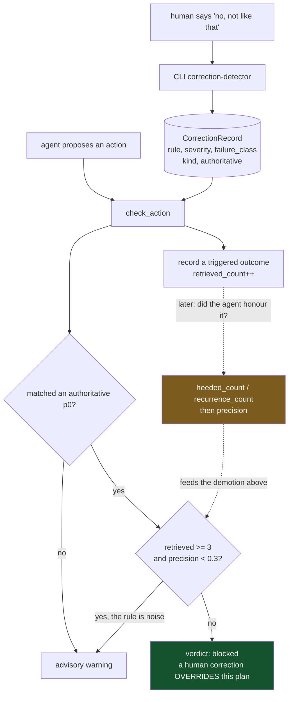

## 1. Executive Summary

AgentRecall-X is a memory layer for coding agents: about 36,900 lines of
TypeScript across four packages (`core`, `cli`, `mcp-server`, `sdk`), MIT
licensed, 267 commits since 25 April 2026 with HEAD on the day of this review.
Storage is JSON files under `~/.agent-recall/`, with an optional Supabase mirror
adding pgvector and Postgres full-text search.

It belongs in this atlas because it is built around the question this atlas keeps
asking. The type's own comment states it — *"the only KPI that matters is 'does
the same bug recur after this correction was retrieved?'"* — and the
`CorrectionRecord` carries the counters to answer it: `retrieved_count`,
`heeded_count`, `recurrence_count`, and a cached `precision` of heeded over
retrieved.

**The mechanism worth taking is what those counters are wired to.** A correction
marked `authoritative` at severity `p0` does not merely advise. It produces
`verdict: "blocked"` and a banner reading *"⛔ CONFLICT: a human correction
OVERRIDES this plan — reconcile before proceeding"*
(`packages/core/src/tools-logic/check-action.ts:452`, `:469`). Human corrections
outrank the model by construction. And then:

```ts
const isNoiseCandidate = (rec: CorrectionRecord): boolean => {
  const ret = rec.retrieved_count ?? 0;
  const p = rec.precision;
  return p !== undefined && p !== null && ret >= 3 && p < 0.3;
};
```

A p0 surfaced at least three times and honoured less than a third of the time is
excluded from the veto — *"gating on noise prevents stale P0s from vetoing
legitimate plans"* (`check-action.ts:442`). **A rule's authority decays according
to whether the agent actually followed it.** Every other trust mechanism in this
atlas sets standing from provenance, corroboration or a person's judgement and
leaves it there. This one lets a record's own track record take its veto away,
at a threshold of three retrievals and 30% — numbers a reader can argue with,
which is the point of writing them down.

The second thing worth reading is the discipline in the type itself. `kind` is
`correction | insight | hunch | fact`, and only `correction` defaults to
`authoritative`, so a hunch cannot block a plan. `failure_class` is a nine-value
taxonomy derived at capture, with a comment explaining why it is deliberately
*not* defaulted at read time: a default there *"would be persisted to disk by
recordOutcome's read-modify-write and silently rewrite old files"*.
`proof_confidence` is named that rather than `confidence` because the latter
*"collides with the export's documented `confidence_basis`"*. The comments carry
dated decisions and the reasoning behind them, and they are the best
documentation in the repository.

**The load-bearing weakness is where `heeded_count` comes from.** Precision is
heeded over retrieved, the veto demotion keys on precision, and heeded is
recorded when the loop judges whether the agent's next action honoured the rule —
a judgement made by the same system whose compliance is being scored. The
measurement that makes the mechanism trustworthy is not independent of the thing
it measures, and the committed evidence that would settle it is twelve cases.

## 2. Mental Model

Three stores with different lifetimes, stated in the corrections module's own
header: *"Corrections store — behavioral rules that persist forever, never roll
up. Separate from journal (ephemeral) and palace (semantic)."*

A correction is **a sentence about what not to do again**, plus the machinery to
find out whether it worked:

| Field group | Purpose |
| --- | --- |
| `rule`, `context`, `tags`, `failure_class` | what the mistake was |
| `severity` (`p0`/`p1`), `kind`, `authoritative` | how much power it has |
| `retrieved_count`, `heeded_count`, `recurrence_count`, `precision` | whether it is working |
| `predicted_count`, `predict_hits`, `predict_precision` | whether it could have been anticipated |
| `active`, `retracted_at`, `superseded_by`, `merged_from` | how it ended |
| `proof_count`, `proof_confidence` | how much independent evidence backs it |

`severity` decides loading rather than importance: p0 is always loaded at session
start, p1 only when the context matches. That is a retrieval budget expressed as
a trust level, and it is cleaner than a relevance score because a reader can
predict exactly what the agent will see.



Green is the override. Amber is the loop that can take the override away — and
the dotted edge into it is the one the system cannot observe independently.

## 3. Architecture

Local files first, cloud optional. `~/.agent-recall/projects/<project>/` holds
corrections as one JSON file per record (`{date}-{slug}.json`), with a journal
and a "palace" of semantic notes beside them. Writes go through a file lock, and
the project name *is* the directory, so a read is scoped by the path it is given
rather than by a filter someone remembered to apply.

`migration.sql` adds the optional Supabase tier: `ar_entries` with a
`vector(1536)` column, a GIN index over `to_tsvector('english', title || body)`
and `UNIQUE(project, store, slug)`; `ar_insights` with a `confirmed` counter and
a `severity`; and `ar_sync_state` keyed by file path with a hash, for reconciling
local files against the remote. The ivfflat vector indexes are commented out with
an instruction to create them after backfill — an operational courtesy most
schemas here omit.

Two things follow from the split. The Supabase schema has **no corrections
table**: the mechanism this report is about is local-file-only, so the cloud tier
carries content and insights while the trust machinery stays on the machine that
produced it. And the local records are plain JSON, so the whole trust state is
greppable and repairable in an editor.

The MCP surface is thirteen tools: `session_start`, `session_end`, `remember`,
`recall`, `check`, `check_action`, `register_rule`, `digest`, and five
`pipeline_*` tools. Notably absent is any way to retract a correction. The model
can create memories and consult them; it cannot revoke a rule that constrains it.

## 4. Essential Implementation Paths

| Path | Location |
| --- | --- |
| A rule's veto decays with its own precision | `packages/core/src/tools-logic/check-action.ts:442` |
| The blocking verdict and its banner | `packages/core/src/tools-logic/check-action.ts:452`, `:469` |
| `CorrectionRecord`, all fields and their reasoning | `packages/core/src/storage/corrections.ts:46` |
| Nine-value failure taxonomy, derived at capture | `packages/core/src/storage/corrections.ts:35` |
| Project scope as the directory path | `packages/core/src/storage/corrections.ts:217`, `:934` |
| Contradiction to supersession, older records retracted | `packages/core/src/tools-logic/supersession.ts:116` |
| Corrections detected from the human's words | `packages/cli/src/utils/correction-detector.ts` |
| Optional cloud schema, no corrections table | `migration.sql` |

## 5. Memory Data Model

The `CorrectionRecord` is the most elaborated correction type in this atlas and
section 2 lists its field groups. Three decisions inside it are worth separating.

**Ending a correction is always soft and always leaves the reason.** `active:
false` hides a record from surfacing; `retracted_at` and `retract_reason` record
a manual retraction with free text — *"triage-2026-06-12: capture noise"* is the
example in the type; `superseded_by` points at the replacement with the comment
*"Record stays on disk for audit"*; and `merged_from` lists the ids folded in by
on-write consolidation. Nothing is deleted, and every ending is distinguishable
from every other: retracted as noise, superseded by a better rule, and merged
into a stronger one are three different facts, and most systems here can express
at most one.

**The lifecycle fields are credited.** The block introducing `proof_count` and
`proof_confidence` says they are *"Borrowed from Hindsight's REAL mechanisms —
proof-count evidence grounding, refine-not-overwrite consolidation,
contradiction→supersession, staleness — implemented AR-native."*
[Hindsight](../hindsight/) is in this atlas, and a project that names where a
mechanism came from and what changed in porting it is doing something the field
mostly does not.

**Migration is by defaulting on read, deliberately and with one exception.**
Every lifecycle field is optional and normalised in `applyCorrectionDefaults`, so
records written before the fields existed load without a migration step — except
`failure_class`, excluded from that treatment precisely because defaulting it
would let a later read-modify-write persist a guess into an old file. That is the
distinction between *normalising a value for this read* and *writing a value you
inferred*, and it is the kind of thing that shows up only after it has bitten
someone.

**No tombstone, and the near-miss is the most interesting in the corpus.** The
atlas requires a durable record of a rejected *value*, keyed on the value, so
later extraction cannot silently re-assert it. A correction is durable, consulted
before the agent acts, and able to veto — stronger than a tombstone in the
direction that matters most. But it is keyed on a rule and matched to a *proposed
action* by keyword overlap, not to a value being written. Nothing stops a
retracted correction being captured again from the same words, and nothing stops
a memory whose claim was corrected being re-stored: `UNIQUE(project, store,
slug)` is dedup. The mechanism guards behaviour, not content, so the mark stays
withheld — see [rejected-value tombstone](../../patterns/rejected-value-tombstone/)
for what the content half would take.

## 6. Retrieval Mechanics

There is no ranked semantic recall on the correction path, by design. p0
corrections load at session start unconditionally; p1 corrections and insights
are matched against the current action by keyword and token overlap in
`check-action.ts`. The Supabase tier adds pgvector and FTS for `ar_entries`, the
content store, not for corrections.

That is a defensible choice and worth naming as one: a rule you must never break
is worthless if a similarity score can bury it, so the system spends its budget
on guaranteeing the most severe rules are always present rather than on ranking
them well. The cost is the usual one for keyword matching — a correction phrased
differently from the action it should catch will not fire — and the nine-value
`failure_class` taxonomy exists partly to give the recurrence join something
coarser and more reliable to group on.

`scope_enforced` is granted, and the reason is structural.
`readCorrections(project)` resolves to `projectSubPath(project, "corrections")`
(`corrections.ts:217`, `:934`), so the scope key *is* the directory being read.
There is no query for a caller to forget to filter and no cross-project read
without naming another project. The Supabase tier carries `project` as an indexed
column, so the same key reaches both tiers.

## 7. Write Mechanics

**Corrections originate with the human.** `packages/cli/src/utils/correction-detector.ts`
watches the user's own messages, and the MCP tool list contains no `correct` or
`retract`. The model can `remember` a memory and `register_rule`; it cannot
author the records that override it or revoke the ones that already do. That
separation is the best structural decision in the system: the thing with veto
power is written by the party the veto protects.

Writes are synchronous file writes under a lock, with on-write consolidation. A
new correction that contradicts an existing one triggers `supersession.ts`, which
finds active corrections contradicting the candidate on a version, status or
key-value fact and retracts them with `superseded_by` set to the new record's id
(`supersession.ts:116`). Consolidation folds duplicates and records the ids in
`merged_from`. There is no scheduler; everything happens on the write that caused
it.

The outcome loop is the part to read carefully. `check_action` records a
*triggered* outcome for every matched correction, incrementing `retrieved_count`
— the comment calls this *"the authoritative trigger signal — the agent consulted
this correction"*, which is precise, because consulting is all that can be
observed at that moment. `heeded_count` and `recurrence_count` are recorded
later, when the loop judges whether the next action honoured the rule.

That judgement is the load-bearing dependency and it is not independent. If the
agent is poor at recognising that it ignored a rule, `precision` is overstated,
the `isNoiseCandidate` demotion never fires, and stale p0s keep their veto. If it
is over-eager, good rules are demoted out of authority they earned. The mechanism
is well built on top of a signal the system generates about itself, and no
committed test or benchmark measures that signal against an external judgement.

## 8. Agent Integration

Thirteen MCP tools plus a CLI, aimed at coding agents. `session_start` loads the
p0 corrections, `check_action` is the gate a well-behaved agent calls before
acting, `session_end` closes the loop. `SKILL.md`, `AGENTS.md` and
`ORCHESTRATOR-PROTOCOL.md` supply the operating instructions.

The gate is advisory in the mechanical sense — `check_action` returns a verdict
and cannot stop an agent that never calls it, the limit every MCP-side guard in
this atlas shares. What distinguishes this one is that the `blocked` verdict is
unambiguous in its wording and that the block is not the model's own judgement
fed back to it: the record producing it came from a person, and `authoritative`
is the field that says so.

`human_review` is withheld. Corrections are authored by a person and outrank the
model, which is the input side of that relationship; the mark asks for a surface
where a person inspects, approves or adjudicates memory content, and no CLI
command or MCP tool exposes the retraction, triage or supersession queue that
would be it. The strings in `retract_reason` imply a human triage process. The
process is not in the tree.

## 9. Reliability, Safety, and Trust

The trust model has three separable pieces that interact well. `kind` separates a
correction from a hunch, so speculation cannot acquire veto power.
`authoritative` is a per-record opt-out from the override gate, defaulting true
only for corrections. And `precision` demotes a rule that is not working. A
system where high standing is granted, exercised, measured and then withdrawn is
rare here; most stop after the second step.

Two risks follow from the design rather than from defects.

**The veto is only as good as the matcher.** `check_action` matches by keyword
overlap, so a correction can fail to fire on a plan it should block, and a
coincidental overlap can block a plan it should not. The noise demotion mitigates
the second case. Nothing mitigates the first, which is the more dangerous
direction because a missed match is silent.

**The measurement is self-reported**, as section 7 sets out. This is the finding
to carry away: the design's most attractive property depends on a number the
system computes about its own obedience.

Data-loss risk is low by construction — nothing is hard-deleted, records survive
retraction and supersession, and the trail of what merged into what is preserved.
A misfiring rule is a JSON file you can edit.

## 10. Tests, Evals, and Benchmarks

124 test files outside `node_modules` and roughly 3,000 cases and assertions by a
crude count, of which ten files are named for this mechanism specifically:
`corrections.test.mjs`, `corrections-supersede`, `corrections-lifecycle`,
`corrections-consolidate`, `corrections-confidence`, `corrections-rank`,
`corrections-e2e`, `corrections-preloaded-equivalence`, `export-corrections` and
`recurrence-class-join`. The mechanism is tested, not only the pieces.

**I did not run them.** They import from `packages/core/dist/`, so the suite
needs an install and a TypeScript build first, and I did not install this
project's dependency tree. What can be said from reading is that the coverage is
aimed at the right places, including supersession and the recurrence join.

`benchmark/replay-results.json` is committed, dated 18 June 2026 against version
3.4.30:

| Axis | Score |
| --- | --- |
| recall | 3/3 |
| **precision** | **2/6 (33%)** |
| staleness | 1/1 |
| correction_correctness | 2/2 |

Twelve cases in total, six for precision. As a measurement it is far too small to
support a conclusion. As a disclosure it makes this the second system in the
atlas to commit a number that undercuts itself, after [Palazzo](../palazzo/) —
and the axis they published a losing score for is the one the whole design turns
on. The harness ships beside it (`ab-comparison.mjs`, `funnel.mjs`,
`heeded-guard.mjs`, `replay-benchmark.mjs`), so the run is reproducible in a way
the number alone is not.

`negative_eval` is withheld: no committed case asserts that particular material
must not be retrieved. The nearest thing, `heeded-guard.mjs`, is about the
outcome signal rather than retrieval exclusion.

## 11. For Your Own Build

### Steal

**Let a rule's authority decay with its own measured precision.** Six lines. A
high-severity rule surfaced three times and honoured less than a third of the
time stops being allowed to veto. This is the answer to the failure mode every
alerting system eventually has — the rule nobody can turn off and everybody
ignores — and this atlas has no other instance of standing being *withdrawn* by
evidence.

**Separate who may write the rule from who must obey it.** Corrections come from
the human's own words via a CLI detector; the model's thirteen tools include no
way to author or retract one. A guard the guarded party can edit is not a guard.

**Give an ending a reason and keep the record.** Retracted, superseded and merged
are three different endings with three different fields, and the record stays on
disk for all of them. Most systems here cannot distinguish any of these from
deletion.

**Name where you borrowed a mechanism and what changed in porting it.** The
lifecycle block credits Hindsight explicitly and says the local version is
file-backed with no LLM on the storage path. It costs one comment and tells a
reader which prior art to compare against.

**Do not default a derived field at read time if a later write will persist it.**
The `failure_class` comment is the clearest statement of this hazard in the
corpus: normalising for a read is safe; normalising into a variable a
read-modify-write will later save is a silent rewrite of history.

### Avoid

**Do not let a system grade its own obedience unaided.** `precision` is heeded
over retrieved, the veto demotion keys on it, and heeded is judged by the loop
watching the agent. Build the metric, then get an independent signal — a human
spot-check, a held-out replay — before letting it strip a safety rule's
authority.

**Do not match a veto by keyword overlap alone.** A correction that fails to fire
is silent, and silence is the failure direction that costs something. A failure
taxonomy is a partial answer; a missed match still looks exactly like no
applicable rule.

**Do not ship the trust mechanism only on the local tier.** The Supabase schema
carries entries and insights and no corrections table, so a deployment leaning on
the cloud tier has the content without the guardrails.

**Do not publish a four-axis benchmark of twelve cases without saying so.** The
33% precision figure is honest and it is six trials; someone will quote it
without its denominator.

### Fit

Take this if you run coding agents that keep making the same mistake and you want
the correction to have teeth. The override, the p0/p1 loading split and the
decay-on-noise rule are a coherent answer to that specific problem, and the local
JSON storage means everything is readable and repairable by hand.

Do not take it as a general memory system: semantic recall lives on a separate
content store, the interesting machinery is corrections-only, and the cloud tier
does not carry it. And weigh the self-reported metric — the design's headline
property is measured by the system being measured, which is fine while a person
is still reading the corrections and less fine as a fully autonomous loop.

## 12. Antipatterns / Risks

- **`heeded_count` is self-reported**, and the veto demotion depends on it.
- **Keyword matching can silently fail to fire** a correction that should block.
- **No corrections table in the Supabase schema** — the trust machinery is local
  only.
- **The committed benchmark is twelve cases**, six of them on the decisive axis.
- **No retraction or triage surface** in the CLI or the thirteen MCP tools,
  despite `retract_reason` implying a human process.
- **No tombstone on the content side** — `UNIQUE(project, store, slug)` is dedup,
  and nothing prevents a corrected claim being re-stored.

## 13. Build-vs-Borrow Takeaways

Borrow `isNoiseCandidate` and the field design under it. The demotion rule is
small, its reasoning is in the comment beside it, and the idea transfers to
anything with rules that fire — a lint config, an alerting policy, a guardrail
layer. What makes it work is not the six lines but the three counters
underneath, and those are worth building before you need them.

Build the measurement differently. The gap between this and a system whose
authority decay you could rely on is one independent signal: a periodic replay
against held-out cases, or a person confirming a sample of heeded judgements. The
harness in `benchmark/` is most of the way there and is running at a scale that
cannot support the conclusion.

## 14. Open Questions

- **How accurate is the heeded judgement?** Nothing in the tree measures the
  measurement, and everything downstream depends on it.
- **Why do corrections stop at the local tier?** The Supabase schema has entries
  and insights; a team sharing corrections is the obvious next step and the table
  is not there.
- **Is retraction meant to have a command?** `retractCorrection` exists,
  `retract_reason` carries triage strings implying a human workflow, and no CLI
  command or MCP tool for it was found.
- **What is the false-negative rate on the keyword veto?** The benchmark measures
  precision, which is the other direction.
- **What did the taxonomy validation find?** A comment dates it to 14 July 2026
  and says `naming_violation` was *"the highest-phantom class"*; the validation
  itself is not in the repository.

## 15. Appendix: File Index

| File | Role |
| --- | --- |
| `packages/core/src/storage/corrections.ts` | `CorrectionRecord`, read/write, retraction, defaults |
| `packages/core/src/tools-logic/check-action.ts` | Matching, the blocked verdict, the noise demotion |
| `packages/core/src/tools-logic/supersession.ts` | Contradiction detection and retraction with `superseded_by` |
| `packages/cli/src/utils/correction-detector.ts` | Detects corrections in the human's own messages |
| `packages/mcp-server/src/` | The thirteen tools |
| `migration.sql` | Optional Supabase tier: entries, insights, sync state |
| `benchmark/replay-results.json` | Committed four-axis result, 18 June 2026 |
| `benchmark/*.mjs` | The harness behind it |
| `packages/*/test/` | 124 test files, ten named for the corrections mechanism |

## History

**2026-07-31** — [`a113cf692a08bed85d7c6eb35d1086dbd9a7a1fd`](https://github.com/Goldentrii/AgentRecall-X/commit/a113cf692a08bed85d7c6eb35d1086dbd9a7a1fd) — first reading.
