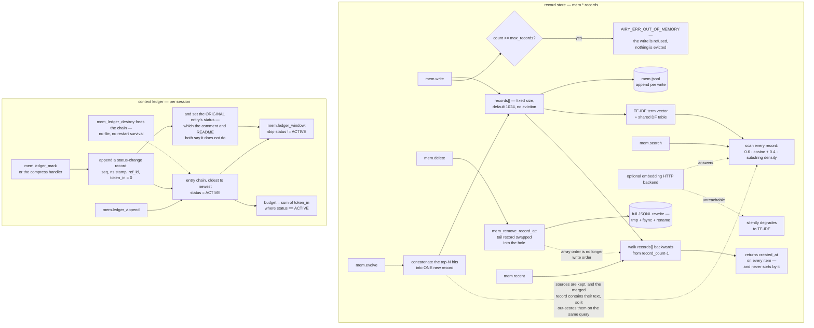

## 1. Executive Summary

AgentRT — full name AirymaxAgentRT — is pitched as "[a]n OS-grade runtime
substrate for AI agent teams", a C11 platform at version 0.1.16 whose primary
home is atomgit.com and whose GitHub tree is a superproject of seven
submodules. Memory lives in `mem_d`, a standalone daemon in the `daemons`
submodule: 8,927 lines of C serving a `mem.*` JSON-RPC namespace over a Unix
socket, with its own hash table, its own TF-IDF implementation, its own
JSONL persistence and no database.

Getting to it takes a step. The superproject's seven runtime directories are
submodules with relative URLs (`../atoms.git`) and recorded pins, so a shallow
clone of the superproject leaves all seven empty; the README's component table
names `atoms` as the home of `memory`, and `openairymax/atoms` returns 404 on
GitHub while atomgit.com returns 403 to a non-browser fetch. That is a false
lead. The memory service is in `daemons`, which is published, and it was read
here at the exact pin the superproject records. It is **dual-licensed**: `LICENSE` offers `AGPL-3.0-or-later OR Apache-2.0` at the adopter's option, and says Apache 2.0 is the recommended choice for proprietary derivatives — so the copyleft is available rather than imposed.

Two things in it are worth the visit and one is worth avoiding.

The context ledger is the good part. Every entry that enters a session's
window — system prompt, tool definition, user message, tool result, assistant
message, compression block, cache hit — is appended to a per-session chain with
its token cost and a status. Marking an entry COMPRESSED or EVICTED appends a
record carrying a sequence number, a nanosecond timestamp and a `ref_id`
pointing at the entry it describes, and the window read skips anything not
ACTIVE. The budget recomputes from the surviving ACTIVE entries. That is a
stored discrete status genuinely filtering a read path, with a producer in the
repo and a test that asserts the window shrinks.

The retrieval is the part to read carefully rather than copy. And the recency
listing is the part that is simply wrong.

`mem.recent` is documented as returning the newest records first, and it does
so by walking the record array backwards from the end — "按写入顺序取数组尾部"
(take the tail of the array in write order). But `mem_remove_record_at`
compacts the array by moving the last record into the deleted slot. After a
single `mem.delete`, the array is no longer in write order, and `mem.recent`
returns whichever record happened to get swapped forward as though it were
among the oldest. Each returned item carries a `created_at` that the handler
faithfully serialises into the response — and that nothing ever sorts by. The
fix is four lines; the fact that it has not happened is explained by
`mem_service_recent` having no test at all.

## 2. Mental Model

A **record** is bytes plus a metadata string. It has no owner, no session, no
status, and no scope key. It lives at an index in a fixed-size array.

The **array** is compacted on delete by swapping the tail into the hole. The
hash index is repaired; the ordering is not.

A **knowledge base** is not a container. It is the string `kb_id` inside a
record's metadata JSON, re-parsed on every candidate during a filtered search.

A **ledger entry** is the other kind of memory: one item of one session's
context window, with a token cost and a status. Marking appends a record and
also migrates the original's status — and the comment sitting over the append
says otherwise. `mem_ledger_mark` introduces the appended record with
*"append-only: the original entry is not modified, a status-change record is
appended"* (`ledger.c:421`), and thirty lines later, in the same loop body,
writes `e->status = status;` (`:451`) with its own comment explaining the
migration. Both halves are wanted: the appended record preserves the transition
and the migration is what makes the window filter work. It is the first comment
that is wrong, and it is the one a reader reaches first.

Two smaller details in the same function are worth having. A mark to a status an
entry already holds is skipped (`:419-420`), so a repeated compression cannot
stack duplicate transition records; and the appended record carries
`token_in = 0` (`:437`), so recording a transition never consumes session
budget.

The **semantic cache** is a third thing living in the same daemon — LLM
responses reused across sessions, keyed on canonical text and model id.

## 3. Architecture

| Area | Role |
| --- | --- |
| `daemons/mem_d/src/core/service.c` | The record store: lifecycle, write, search, get, delete, recent |
| `daemons/mem_d/src/engine/mem_persist.c` | JSONL append, full rewrite, startup load, UTF-8 repair of older bad rows |
| `daemons/mem_d/src/engine/vector.c` | TF-IDF term vectors, the shared document-frequency table, cosine |
| `daemons/mem_d/src/engine/emb_client.c` | The optional HTTP embedding backend and its degrade path |
| `daemons/mem_d/src/engine/kb.c` | Chunked document ingest and per-KB listing and deletion |
| `daemons/mem_d/src/engine/ledger.c` | The per-session context ledger, its statuses and its budget |
| `daemons/mem_d/src/engine/compress.c` | Rule-based L1 trimming and extractive L2 summarisation |
| `daemons/mem_d/src/engine/cache.c` | The cross-session semantic response cache |
| `daemons/mem_d/src/handlers/` | One file of JSON-RPC handlers per surface |
| `heapstore/` | The runtime's SQL store — sessions, turns, checkpoints, tool calls; no memory table |

## 4. Essential Implementation Paths

Read `service.c:514-533` and `service.c:574-627` together, in that order. The
first is `mem_remove_record_at`, which compacts by swap. The second is
`mem_service_recent`, which reads order from position. Neither is wrong on its
own and the pair is.

Then `ledger.c:372-428` for the status transition, and `ledger.c:303-336` for
the window read that consumes it.

Then `mem_handlers.c:212-378` for `mem.evolve`, which is where the store's
growth model lives.

## 5. Memory Data Model

A record is `{record_id, data, len, metadata, created_at}` plus derived
retrieval state — a TF-IDF vector and an optional embedding — that is rebuilt
on load and never persisted. Ids are 32 hex characters: a truncated timestamp,
a process counter and an xorshift value, generated without libuuid so the
daemon can run standalone.

There is no status, no version, no supersession pointer, no source, no owner
and no scope key. Everything a caller wants to express beyond the bytes goes
into `metadata`, an opaque JSON string that the store parses only to read
`kb_id`.

The JSONL is one global file. Two agents, two users or two projects sharing a
runtime share a store, and nothing in the record distinguishes them.

## 6. Retrieval Mechanics

Search scores every record and sorts the survivors with a bubble sort. At the
default ceiling of 1,024 records that is fine; it is O(n²) in hits and worth
knowing before raising `AIRY_MEM_MAX_RECORDS`.

The score is `w · vec_score + (1 - w) · sub_score`, with `w` defaulting to 0.6
and settable through `AIRY_MEM_TFIDF_WEIGHT`. The substring half,
`mem_compute_score`, counts literal occurrences of the query string in the
record and normalises by length — so it is a whole-query substring match, not a
term match, and a two-word query scores zero on a record containing both words
apart. The vector half is a real TF-IDF cosine against a shared DF table
maintained incrementally on write and delete.

When `AIRY_MEM_EMBEDDING_URL` is set, an HTTP call replaces the TF-IDF half for
records that have an embedding. Records written before the backend was
configured have none, and fall back to the vector or substring path — so a
single store can score different records by different methods in the same
query, with the fused scores compared as though commensurable. The degrade on
an unreachable endpoint is deliberate and logged in design notes; the mixed
population it leaves behind is not addressed.

Embeddings are fetched outside the lock, which is the right call, and the code
copies the record's bytes before releasing the lock with an explicit comment
about the concurrent-delete use-after-free it is avoiding. That is careful
work.

The KB filter re-parses each candidate's metadata JSON inside the scan loop,
with an inline comment explaining that the `kb.c` helper could not be reused
because it returns a static buffer. It is correct and it is quadratic in
parsing cost.

## 7. Write Mechanics

A write appends to the array, builds the term vector, inserts into the hash
index, and appends a line to the JSONL. At capacity it returns
`AIRY_ERR_OUT_OF_MEMORY` and logs "Memory service full". There is no eviction,
no decay, no LRU — a full store is a store that stops accepting memories.

`mem.evolve` is the consolidation surface, and it is strictly additive. Given a
query it searches, concatenates the hit contents into one buffer, and writes
that as a new record whose metadata lists the source ids and scores. The
sources stay. Because the merged record contains all their text, it scores at
least as well as any of them on the query that produced it, and a second
`evolve` on the same query merges the merged record along with its sources
again. Against a hard ceiling that refuses writes, repeated evolution is the
fastest way to reach a store that cannot be written to.

The single-record branch has a smaller version of the same issue: it writes an
enhanced copy carrying `evolved_from`, `evolved_at` and `access_count: 1` —
always 1, never incremented — and the new metadata replaces the source's
entirely. Evolving a KB chunk therefore produces a record with no `kb_id`,
which vanishes from `kb_search` and from `kb_delete`'s sweep while remaining in
the global search and in the JSONL.

Persistence is the best-engineered part of the file. Full rewrites go to a temp
file in the same directory, fsync, then rename. The path resolver carries a
comment recording a real prior bug — creating only the `data` directory left
`agentrt/memory` missing, append failed with `ENOENT`, and memories were
silently not written — and now does a recursive mkdir of the full parent.

The load path has a quieter version of the same failure mode. It iterates lines
and admits a record only while `svc->record_count < svc->max_records`, without
breaking the loop and without logging the skip. Since `max_records` is settable
per run through `AIRY_MEM_MAX_RECORDS` or the daemon config, a store grown
under a high ceiling and restarted under a lower one keeps the oldest records
in the file and silently discards every newer one. The `loaded` count is
logged; the dropped count is not computed.

## 8. Agent Integration

One daemon, one Unix socket, JSON-RPC. The gateway's capability registry test
lists `mem.ledger_append`, `mem.ledger_window`, `mem.ledger_budget` and
`mem.ledger_mark` among the registered capabilities, so the ledger is addressed
as a first-class runtime surface rather than an internal detail.

There is no authentication, no caller identity and no per-caller partition on
the socket. Whatever can connect can read and delete every record.

## 9. Reliability, Safety, and Trust

The ledger's append-only claim is stated three times and is not quite what the
code does. `ledger.h` says a status change appends a record rather than
modifying the original; `ledger.c:393` repeats it as an inline comment
immediately above the code; the mem_d README repeats it in the method table as
"追加状态变更记录，原条目不改" (append a status-change record, the original entry
unchanged). Thirty lines later, `ledger.c:423` writes `e->status = status` on
the original entry.

The mutation is not a bug — the window read depends on it, and the repo's own
test at `test_ledger.c:147-150` asserts the window shrinks after a mark, which
only passes because the original is mutated. The transition history stays
replayable through the appended records' sequence numbers. What is wrong is the
invariant as documented: a reader who builds on "原条目不改" and expects the
original entry to still read ACTIVE in `ledger_history` will find it does not.

The ledger is also process-lifetime only. There is no `fopen` in `ledger.c`;
`mem_ledger_destroy` frees the chains on shutdown. Records survive a restart
through the JSONL and the context ledger does not, so the audit of what entered
and left a session's window is gone the moment the daemon stops. It also covers
only ledger entries — `mem.write` and `mem.delete` append nothing to it.

The semantic cache is worth flagging separately because it is a different trust
question sharing an address space. Its own header describes it as "跨会话、跨时刻
的 LLM 响应复用" — cross-session, cross-time reuse of LLM responses — keyed on
`SHA-256(canonical_text + model_id)` for exact hits and normalised Jaccard token
overlap at a default 0.85 threshold for approximate ones. There is no tenant,
user or session component in either key. On a multi-user runtime, an
approximate hit returns another user's model response to a merely similar
prompt. The exact-key test asserts that a different `model_id` misses; nothing
asserts anything about a different caller, because the cache has no notion of
one.

## 10. Tests, Evals, and Benchmarks

Five test binaries, 2,006 lines, covering the service, cache, compressor,
ledger and stats JSON. They are assertion-based C with no framework, and they
are better than the median for a project this young — the KB isolation test
asserts both directions, the ledger tests cover idempotent marking and invalid
status values, and `test_service.c` exercises malformed JSONL lines and the
UTF-8 repair path.

The gaps are specific. `mem_service_recent` has no test, which is why its
ordering bug survives. Nothing writes past `max_records` and reloads under a
lower ceiling. Nothing calls `mem.evolve` twice on the same query. The
compressor's `is_instruction_word` list is English-only — "please, ensure,
must, always, never" — in a project whose documentation, comments and likely
transcripts are Chinese, and no test covers a non-English window.

## 11. For Your Own Build

Steal the persistence discipline. Temp file, fsync, rename, and a comment in
the path resolver recording the exact bug that a shallower mkdir caused. That
comment is worth more than the code it sits above, because it stops the fix
from being undone.

Steal the ledger's shape: a per-session append-only chain where every window
item carries its token cost, transitions append a record with a sequence number
and a back-reference, and the budget is recomputed from the surviving ACTIVE
entries rather than incrementally adjusted. `session_recalc_active` after every
mark is O(n) and obviously correct, which is the right trade at window scale.

Do not derive recency from physical position. This is the report's one
transferable warning: if a listing means "newest first", sort by the timestamp
you already store. `mem.recent` returns `created_at` on every item and orders by
array index, and the compaction that breaks the correspondence lives in a
different file. Any structure that compacts — swap-delete, tombstone-free
vectors, free lists — turns position into a lie the moment it is used.

Decide what a full store does before you ship one. Refusing writes at a ceiling
is a legitimate choice; it is only a choice if something else evicts, expires
or summarises. Here nothing does, and `mem.evolve` actively consumes the
remaining headroom.

If consolidation writes a merged record, retire the sources in the same
operation, or exclude the merged record from the retrieval that feeds the next
consolidation. Otherwise the merge is an amplifier.

## 12. Open Questions

Whether `atoms/memory`, named in the superproject README's component table, is
a separate memory implementation or the syscall shim that `service.c`'s header
says this code was extracted from ("[e]xtracted from `g_runtime.records[]`
logic in `gateway/src/utils/syscall/syscall_router.c`"). `openairymax/atoms`
404s on GitHub at the time of reading and atomgit.com returns 403 to a
non-browser fetch, so the question stands open; the superproject records its
pin as `0ea4061d`.

Whether `heapstore` is intended to hold memory records. Its README says it
persists "memory records", and its `V001_initial_schema.sql` defines `agents`,
`sessions`, `turns`, `checkpoints`, `llm_calls`, `tool_calls`, `events` and
`cost_tracking` with no memory table. Either the README is ahead of the schema
or the word is being used for turns.

Whether the embedding backend's mixed population is considered. A store holding
both embedded and unembedded records fuses scores from different metrics into
one ranking, and nothing backfills.

## Appendix: File Index

| Path | What to read it for |
| --- | --- |
| `daemons/mem_d/src/core/service.c` | The swap-delete and the position-derived recency, together |
| `daemons/mem_d/src/engine/ledger.c` | The status transition, and the line that contradicts its own comment |
| `daemons/mem_d/src/engine/mem_persist.c` | Crash-safe rewrite, and the load ceiling that drops the newest |
| `daemons/mem_d/src/handlers/mem_handlers.c` | `mem.evolve`, the additive consolidation |
| `daemons/mem_d/include/cache.h` | A cross-session response cache with no caller in its key |
| `daemons/mem_d/tests/test_service.c` | The KB isolation assertions, negative with positive control |
| `.gitmodules` | Why a shallow clone of the superproject shows nothing |

## History

**2026-09-19** — [`2682bfc6e45fed79195f11014b6ceebd8fb7976e`](https://github.com/openairymax/agentrt/commit/2682bfc6e45fed79195f11014b6ceebd8fb7976e) — `trust_state` re-tested. The superproject moved and so did the `daemons` submodule it pins, `db4962addaa73e78cce79b8fd4723c34d5299eb3` to `817d651602217fbb510441336c21f3ec32170586`, which is where the memory daemon actually lives — a shallow clone of the superproject leaves the directory empty, so the second sha is now recorded in the evidence beside the first. The mark stands and every mechanism re-checked in source at that sha: four statuses at `mem_d/include/ledger.h:46-49`, the window skip at `mem_d/src/engine/ledger.c:349-351`, the marking path at `:400-455`. Anchors shifted by roughly forty-five lines and are re-mapped. The re-read turned up a contradiction inside `mem_ledger_mark`. The comment introducing the appended record says *append-only: the original entry is not modified* (`:421`); thirty lines on, in the same loop body, `:451` writes `e->status = status;` under a comment describing the migration. Both halves are intended — the appended record preserves the transition, the migration is what makes the window filter work — so the defect is the first comment, which is the one a reader meets first. Two details are added beside it: a mark to a status the entry already holds is skipped (`:419-420`), so a repeated compression cannot stack duplicate transition records, and the appended record carries `token_in = 0` (`:437`), so recording a transition never consumes session budget. The negative half of the record was re-checked and holds: `mem_record_entry_t` (`mem_d/src/core/service.h:25-35`) carries record_id, data, metadata, score, created_at and the vectors and no status field, so `mem.search` has no equivalent gate. Screened again first; nothing was installed and no suite was run.

**2026-09-16** — [`2682bfc6e45fed79195f11014b6ceebd8fb7976e`](https://github.com/openairymax/agentrt/commit/2682bfc6e45fed79195f11014b6ceebd8fb7976e) — first reading, at a superproject commit dated 16 September 2026. The seven runtime directories are submodules with relative URLs and a shallow clone leaves them empty; recorded pins are `atoms 0ea4061d`, `commons e0ca18a3`, `cupolas ad068db2`, `daemons db4962ad`, `gateway 9b36d117`, `heapstore d3130dde`, `protocols 38689aff`. `daemons` and `heapstore` were fetched by full sha and checked out at those exact pins and are the basis of this reading; `openairymax/atoms` returned 404 on GitHub and atomgit.com returned 403 to a non-browser fetch. Screened before opening, from shallow clones. Nothing was installed, built or run.
