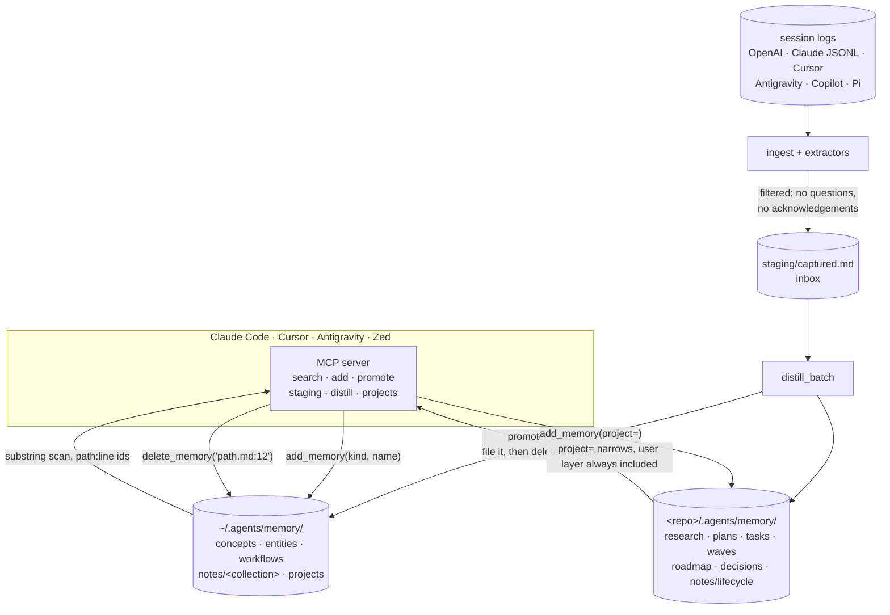

## 1. Executive Summary

`agents-memory` is a local markdown memory shared across Claude Code, Cursor,
Antigravity and Zed through one MCP server. MIT, Python 3.10+, 6,450 lines, at
version 1.0.0 — the repository is one commit, `.agents/memory v1`.

Its claim is a **storage standard** rather than a store: `~/.agents/memory/` for
the person and `<repo>/.agents/memory/` for the repository, described in an
`abi/` directory of eight specification files that a conforming implementation
is meant to follow. The layout spec states the design in two sentences: *"One
home per fact. Path encodes where it belongs. No dump files (`facts.md`,
`MEMORY.md`)."* That is a direct rejection of the single-file memory most of the
local coding-agent family ships, and the whole system follows from it.

**What is genuinely interesting:** the taxonomy is the schema. Sixteen kinds map
to sixteen paths — `concept`, `entity`, `workflow` and `note` in the user store;
`research`, `plans`, `tasks`, `waves`, `roadmap`, `decision`, and
`proposed`/`implemented`/`rejected` note lifecycles in the project store — and
`abi/KINDS.md` publishes a **mutability hint per kind**: inbox (append, distill,
delete), a new sequential file per tranche, revise in place, or frozen. Decisions
carry the sharpest rule: *"Revise present tense when the contract changes; new
number when superseding."*

**Strongest mechanism:** search and delete share an address. `search_memory`
returns `{"id": "user/notes/programming/chat-stores.md:12", …}` and
`delete_memory` takes exactly that id, refusing anything that does not look like
it. A recalled line is a thing the agent can then remove — a round trip most
systems in this corpus cannot make.

**Weakest:** the address is a line number. `delete_memory` pops a line by
position, so removing line 5 silently renumbers every id below it in that file,
and any id a previous search returned is now off by one. And the mutability
contract is not enforced: `add_memory` appends first and then *returns a
sentence* telling the model it should have revised in place.

## 2. Mental Model

A memory is a bullet line in a file whose path says what kind of thing it is.

```text
kind + name ──► memory_file_for() ──► ~/.agents/memory/concepts/<name>.md
                                      <repo>/.agents/memory/decisions/001-<name>.md
                                      <repo>/.agents/memory/staging/captured.md
                     │
                     ▼
              _append_bullet(path, fact)          ← always appends
                     │
        kind ∈ REVISE_IN_PLACE_KINDS and file existed?
                     │
                     ▼
   returns "… — revise this file in place when facts change;
             do not only append bullets"          ← a request, not a refusal

staging/captured.md ──promote_bullet──► typed file  + bullet deleted from staging
any line             ──delete_memory("path.md:12")──► line removed
```

**There are no epistemic states.** `proposed`, `implemented` and `rejected` look
like a lifecycle and are directories: a note is *in* one of them, and moving it
is moving a file. Nothing marks a fact doubtful, nothing records that a value was
rejected in a way a later write would consult, and `rejected` being *"frozen
after reject"* is a documented convention rather than a check. What the system
models instead is **where a fact belongs and how it may change**, which is a
different axis from truth and is unusually well specified.

Control is **hybrid and explicitly staged**: an agent files facts through MCP
tools, session logs are ingested into a staging inbox, and distillation promotes
bullets out of staging into typed files. The person owns the store in the most
literal sense — it is markdown in their home directory and their repository, and
`abi/WHY.md` argues that as the point.

## 3. Architecture



**Runtime shape.** A Python package with an MCP server (`mcp_server.py`), a CLI
(`__main__.py`, `cli_help.py`), an ingest pipeline over five vendors' session
logs, and a `store.py` of roughly two thousand lines that owns the layout. No
server process beyond MCP, no database, no index, no network.

**Persistence.** Markdown files, read and written whole (`_read`, `_write`),
with a line cache (`_read_cached_lines`) keyed by mtime for search.

**Search stack.** A substring scan. There is no embedding anywhere in the tree
and no lexical index — `search_memory` lowercases the query and walks every line
of every file in scope until it hits `limit`.

**Housekeeping.** `consolidate_repo_leaks`, `migrate_legacy_store`,
`purge_engine_repo_injection` and `ensure_staging_inbox` are repair operations
for a store that a person also edits by hand — an acknowledgement that the layout
will drift and needs a way back.

### Deployment and ergonomics

`pip install agents-memory`, an `mcp.json` entry per host, and the store is two
directories of markdown. Fully local and offline; no API key is needed to store
anything. The store is diffable and committable, and `abi/LAYOUT.md` is explicit
that the repo store belongs in the repository. Repairable by hand is not a
caveat here — it is the design.

## 4. Essential Implementation Paths

**Write.** `mcp_server.add_memory` → `store.add_memory` (`store.py:1872`):
strips the fact, refuses an empty one, resolves a path through
`memory_file_for(kind, name, project, collection)`, and appends a bullet.
`memory_file_for` is where the real rules live — `proposed`/`implemented`/
`rejected` raise without a `project=`, an unregistered project slug raises
*"unknown project '…' — register it first"*, and `SEQUENTIAL_FOLDERS` routes
`plans`, `tasks`, `roadmap`, `waves` and `decisions` through `sequential_path`
so each tranche is a new `001-`, `002-` file.

**The mutability contract.** `store.py:1888-1893` — when the kind is in
`REVISE_IN_PLACE_KINDS` and the file already existed, the return value becomes
`"{loc} — revise this file in place when facts change; do not only append
bullets"`. The bullet has already been appended. This is
[tool descriptions as policy](../../compare/#tool-descriptions-as-policy) moved
one step later: not a description the model reads before acting, but a sentence
it reads after the write it should not have made.

**Ingest.** `ingest.py`, `ingest_chats.py`, `ingest_catalog.py`,
`ingest_extractors.py` and `extract_openai.py` read exported session logs from
five vendors into staging, filtering aggressively — the committed tests assert
that a user's question, an assistant acknowledgement and an example hostname do
not survive into what gets stored.

**Distillation.** `get_staging_inbox(project, limit)` returns un-distilled
bullets grouped by source file, each with a `source_path`; `distill_batch`
processes them; `promote_bullet(bullet, kind, name, …)` files one into a typed
path and deletes it from staging, reporting `"and removed from staging"` or
`"(staging bullet not found to delete)"` — a receipt that distinguishes a
completed move from a partial one.

**Retrieval.** `search_memory(query, project, limit)` (`store.py:1640`) walks
`iter_memory_files(project)` and yields `{"id": f"{file_id(path)}:{i}", "file",
"line", "text"}` for every matching line.

**Scope.** `iter_memory_files` unions `iter_user_memory_files()` with
`iter_project_memory_files(slug)`, where `if slug and p.slug != slug: continue`
drops other projects. With no slug, **every** registered project's store is in
scope. The user layer is never excluded, under a literal no-op:

```python
if project:
    # still include user layer so cross-cutting facts remain findable
    pass
```

A branch that does nothing, kept to say that nothing happens, is a clearer
statement of intent than most comments manage.

**Delete.** `delete_memory(memory_id)` requires an id containing `:`, resolves
the path, bounds-checks the line, pops it and rewrites the file.

**Tests.** Fifteen files including `test_extract_filters.py`,
`test_ingest_pipeline.py`, `test_distill_benchmark.py`,
`test_cli_comprehensive.py` and `test_auto_triggering.py`, with a
`run_all_tests.py` runner.

## 5. Memory Data Model

There is no schema object. The model is the filesystem, and `abi/` publishes it:

| Store | Folders |
| --- | --- |
| `~/.agents/memory/` | `concepts/`, `entities/`, `workflows/`, `projects/<slug>/`, `notes/<collection>/` |
| `<repo>/.agents/memory/` | `staging/`, `research/`, `plans/`, `tasks/`, `waves/`, `roadmap/`, `decisions/`, `notes/{proposed,implemented,rejected}/<class>/` |

Note collections are *guides, not a closed set* — `programming/`, `finance/`,
`family/`, `preferences/` and others — with an instruction to add a folder when a
fact does not fit, which is the right posture for a store a person also edits.

**Identity** is `path:line`, and that is the model's weak point. A line number is
a position, not an identity: `delete_memory` pops by index, so every id below the
removed line shifts, and an id returned by an earlier search silently addresses a
different fact. The atlas's own antipattern —
[ranking positions used as identities](../../compare/#ranking-positions-used-as-identities)
— is about retrieval order rather than file position, and this is the same class
one layer down.

**Provenance** exists only for ingested material, as `source_path` on a staging
bullet, and it is consumed by the promotion that deletes the bullet.
**Temporal:** none in the record; the filesystem's mtime is all there is.
**Correction:** revise the file, or delete a line. There is no supersession
record, no rejected-value registry, and `rejected` freezes a note rather than
blocking its content from being re-filed elsewhere.

## 6. Retrieval Mechanics

A substring scan, in file order, stopping at `limit` (default 20). No ranking,
no scoring, no recency weighting, no fusion — the first twenty lines containing
the query string, in whatever order `iter_memory_files` produced. Files are
line-cached by mtime, so repeated searches over an unchanged store are cheap.

**Failure modes.** A query is matched literally, so a fact stored as *"prefer
pnpm"* is not found by *"package manager"*, and the taxonomy is doing the work
that ranking usually does: you find things because you know which folder they are
in. That is coherent for a store a person browses and thin for an agent issuing
one query. The `limit` truncates by scan order rather than relevance, so a store
with many incidental matches can hide the good one behind twenty poor ones.

**No injection path.** Nothing assembles a context block; the memory reaches the
model only when the model calls `search_memory` or `get_project_memories`. The
`skills/` directory carries prompt guidance that tells it to.

## 7. Write Mechanics

Every write is a bullet appended to a resolved path, synchronous, with no model
call inside the primitive. Extraction happens only in the ingest pipeline, over
exported logs, offline.

**Deduplication:** none. The same fact filed twice is two bullets, in the same
file if the kind and name match.

**Conflict handling:** none. Two contradictory bullets coexist, and the
resolution mechanism is a person opening the file — which the ABI states
plainly for `implemented` notes: *"revise in place when code/paths change (facts
track reality)"*.

**Filtering of noisy input** is the strong part, and it is on the ingest side:
questions, acknowledgements and placeholder hostnames are dropped before
anything durable is written, with committed cases for each.

### Operational cost

No model call, no network, no background pass. A write is a file append; a
search is a scan over the store, bounded by the line cache. The cost that will
bite first is the scan: every search reads every markdown file in the union of
the user store and one or all project stores, and nothing bounds the store's
size except the person's discipline and the ABI's instruction not to dump
transcripts into it. Write-to-readable lag is zero.

## 8. Agent Integration

One MCP server, four documented hosts, and a tool surface that matches the
model's vocabulary: `search_memory`, `add_memory`, `promote_bullet`,
`get_staging_inbox`, `distill_batch`, `get_project_memories`, `delete_memory`,
`register_project`. `abi/MCP.md` specifies the surface for a conforming
implementation, which is the part that makes this a standard proposal rather
than a tool.

Agency is high and unsupervised — the model chooses what to file and where, and
the only refusals are structural (unknown project, missing `project=` for a
lifecycle note, empty fact). `abi/KINDS.md` closes with a policy the code does
not enforce: *"Do not store transcripts, emails, phones, tokens, or one-shot
how-tos as durable memory."*

## 9. Reliability, Safety, and Trust

**No trust model.** No status, no confidence, no provenance on a filed fact, and
no way to record that something is doubted. The store cannot distinguish a fact
the user stated from one the model inferred, which for a store whose
distillation runs over session logs is the gap that matters most.

**Privacy** is handled where it can be: ingest filters drop question text and
placeholder hosts, and the ABI tells the agent not to store contact details or
tokens. Nothing scans a fact for secrets at write time.

**Injection.** A memory is markdown filed by a model from a session log, and
recalled as plain text with no fence. A hostile string in an ingested transcript
can become a durable bullet in `notes/` and come back on a later search.

**Data loss.** `_write` replaces a file whole. There is no lock, no atomic
temp-and-rename visible in `store.py`'s writer, and the repair functions
(`consolidate_repo_leaks`, `migrate_legacy_store`) exist because the layout does
drift. Two agents filing into the same file concurrently is last-write-wins over
the whole file rather than the line.

**Deletion is real** — a line is removed from a file the user owns, with no
copies, no index and no export to chase. That is the upside of the design and it
is a large one.

## 10. Tests, Evals, and Benchmarks

Fifteen test files with a plain runner. The ingest and extraction path is the
best covered: `test_extract_filters.py` asserts across three fixtures that the
user's question, the assistant's acknowledgement and an example hostname do not
appear in extracted output, which is what earns `negative_eval` — material kept
out of a *write* rather than out of a read, the weaker of the two strengths the
rubric distinguishes, and unambiguous within it.

`test_distill_benchmark.py` is the nearest thing to an eval and measures
distillation throughput rather than quality; no result artifact is committed.

**What I would want before trusting it:** a case asserting that
`search_memory(project="a")` never returns a line from project b's store, and a
case for the id contract — that an id returned by search still addresses the same
text after an unrelated line is deleted. The second would fail, and that is the
point of writing it.

## 11. For Your Own Build

### Steal

- **Let the path be the schema, and publish it.** Sixteen kinds, sixteen
  destinations, one home per fact, and an explicit *"no dump files"* rule. A
  reader can tell where a fact lives without reading any code, and a second
  implementation could conform.
- **Publish a mutability hint per kind.** Inbox, sequential, revise-in-place,
  frozen — four behaviours attached to the type of thing rather than to the
  store, and the decision rule (*"revise present tense when the contract changes;
  new number when superseding"*) is the clearest statement of supersession
  semantics in this corpus's markdown family.
- **Make the search result an address the delete accepts.** Returning
  `file.md:12` and taking the same string back is what turns recall into
  something an agent can act on.
- **Give the inbox a drain with a receipt.** `promote_bullet` files the bullet
  and reports whether it also removed it, so a partial move is visible.
- **Filter the ingest, and test the filter negatively.** Dropping the user's own
  question and the assistant's *"[ok]"* before anything is stored is the cheapest
  quality mechanism available, and the tests assert the absence.

### Avoid

- **Do not address a memory by line number.** Any deletion above it renumbers
  every id below, so an id handed to an agent decays as soon as the file changes.
  A stable id — a hash of the bullet, a per-line uuid in a comment — costs little
  and makes the address survivable.
- **Do not enforce a contract by returning a sentence after doing the wrong
  thing.** If revise-in-place is the rule for a kind, refuse the append and say
  what to call instead; a string appended to a success message is advice attached
  to the failure it describes.
- **Do not let an unqualified search span every project.** `search_memory()` with
  no project reads every registered store; a default that widens is the opposite
  of the one you want.
- **Do not rely on a folder to freeze a record.** `rejected` is frozen by
  convention, and nothing stops the same content being filed again under another
  kind.

### Fit

This suits one developer who works across several editors, keeps their own notes,
and wants the agent's memory to be files they can read, diff and commit. Within
that shape it is the most carefully specified markdown store this atlas has read
— the `abi/` directory is a genuine standards proposal, and the taxonomy is
better thought through than the systems that ship a database. Walk away if more
than one person writes to the same store, if you need memory that can be wrong
in a way the system records, or if you expect recall to find things you cannot
name — the search is a substring scan and the taxonomy is doing all the work.

## 12. Open Questions

- Does anything consume `abi/`? The specification describes a conforming
  implementation, and whether a second one exists decides whether this is a
  standard or a well-documented tool.
- What does `distill_batch` actually do with a bullet — is there a model in that
  path, and where does its prompt live?
- How large does a store get before the full scan is felt? Nothing in the
  repository reports a store size or a search latency.
- The repository is one commit at v1.0.0 with a PyPI release; whether the history
  was squashed or the project began here is not visible from the tree.

## Appendix: File Index

- **Specification:** `abi/LAYOUT.md`, `abi/KINDS.md`, `abi/MCP.md`, `abi/INGEST.md`, `abi/INJECTION.md`, `abi/WHY.md`
- **Store and layout:** `src/agents_memory/store.py` (`memory_file_for`, `add_memory` at `:1872`, `search_memory` at `:1640`, `iter_memory_files`, `delete_memory`)
- **Agent surface:** `src/agents_memory/mcp_server.py`, `skills/`
- **Ingest and distillation:** `src/agents_memory/ingest.py`, `ingest_chats.py`, `ingest_catalog.py`, `ingest_extractors.py`, `extract_openai.py`, `consolidate.py`
- **Repair:** `store.consolidate_repo_leaks`, `migrate_legacy_store`, `purge_engine_repo_injection`
- **Tests:** `tests/test_extract_filters.py`, `test_ingest_pipeline.py`, `test_cli_comprehensive.py`, `test_distill_benchmark.py`

## History

**2026-08-20** — [`a2c7812a667a46792a26ea719ad7ea83f875b202`](https://github.com/Lolaplex/agents-memory/commit/a2c7812a667a46792a26ea719ad7ea83f875b202) — first reading, at version 1.0.0, on a repository whose history is a single commit titled `.agents/memory v1`. Screened before anything was read: no auto-executing surface, no build-time execution, `pyproject.toml` and `requirements.txt` both inside the seven-day cooldown, one unpinned surface, and `AGENTS.md` and `CLAUDE.md` addressed to a reading agent and recorded as data; nothing was installed and no test was run. The line-numbered id and the revise-in-place return string were established by reading `store.py` against the ABI it implements.
