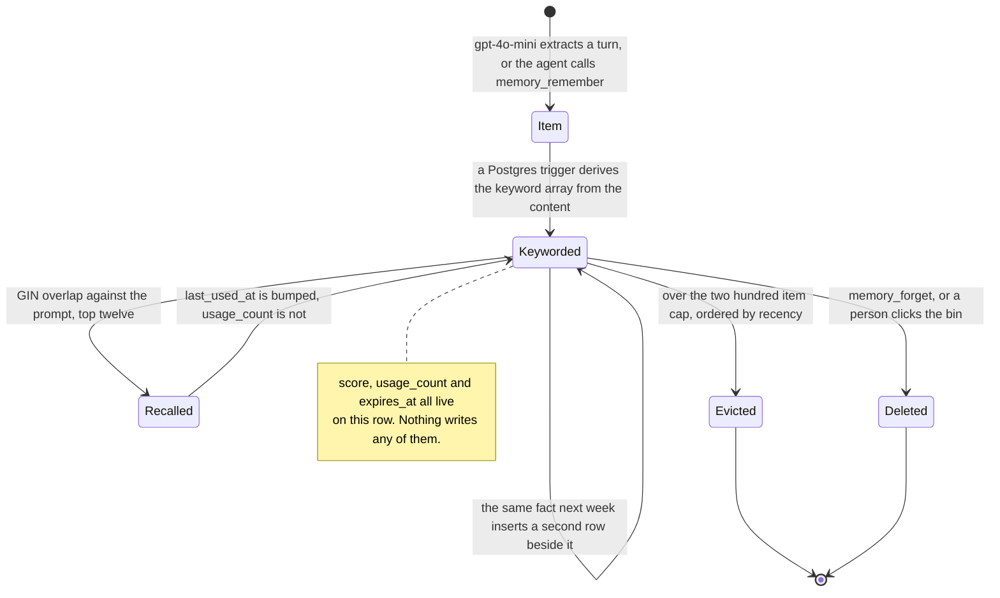

## 1. Executive Summary

AgentSwarms is a self-hostable agent and business-intelligence platform — agent
chat, a multi-agent swarm canvas, knowledge bases, dashboards, traces — of which
the part this atlas cares about is 812 lines under `src/utils/memory/`, against
roughly 172,000 lines of TypeScript overall.

**Licensing note, because it decides what you can do with what you read.** The
repository is under the **Elastic License 2.0**, which is not an OSI-approved
open-source licence: it forbids providing the software to third parties as a
hosted or managed service, and forbids circumventing licence-key functionality.
The project describes itself as *"source-available"* and is accurate to do so.
Read it for the design; check with counsel before vendoring it. That is the same
position this atlas records for [ByteRover](../byterover/).

The design is the simplest complete long-term memory in the corpus that is not a
file. `gpt-4o-mini` reads each user/assistant turn and returns items typed
`fact`, `preference`, `episodic` or `instruction`. They are inserted into
`agent_memory_items`. **A Postgres trigger then derives the retrieval index from
the content itself** — lowercase, strip everything that is not alphanumeric,
drop tokens under four characters and a stop-list — into a `keywords` array with
a GIN index over it. Recall tokenizes the incoming prompt with the same rules,
runs a `&&` overlap query, and ranks the candidates by
`overlap × 2 + score + recency × 0.5`.

Deriving the index inside the database is the thing worth taking. There is no
embedding call on the write path, no vector column, no model in the loop between
storing a fact and being able to find it again, and the tokenizer exists twice —
once in PL/pgSQL, once in TypeScript — with the same stop-list in both. For a
platform that already runs pgvector for its knowledge bases, choosing *not* to
use it for agent memory is a deliberate and defensible narrowing.

Two things undercut it, and they are unusually easy to state.

**Nothing dedups.** `extractMemoriesFromTurn` builds its rows and calls
`.insert(rows)`. Not an upsert, no content hash, no similarity check, no
`dedup_key`. A user who mentions their timezone in ten conversations gets ten
rows, all carrying the same keywords, all competing for the same top-twelve slots.
The only thing standing between this and unbounded duplication is a 200-item cap
enforced by a prune RPC.

**Three columns look like a lifecycle and are inert.** `score` is read by the
ranker and by the prune ordering, is shown in the settings UI, and is written by
no code path — it holds its `1.0` default forever, so it adds a constant to every
candidate and orders nothing. `usage_count` is documented in the recall comment
as *"this item helped"* feedback and displayed beside each item; the only writer
passes `usage_count: undefined`, which the client drops from the request body,
and the read-then-write its comment promises instead is the statement `void ids;`.
`expires_at` exists on the table and is set and swept by nothing. The settings
page tells the user that *"oldest low-score items"* are pruned on overflow; since
no item ever has a low score, the prune is ordering by recency alone.

## 2. Mental Model

A memory is **a sentence with a category and a bag of words**. Not a claim with a
status, not an observation with evidence — a row whose retrievability is entirely
a function of which words survived the tokenizer.

The four `kind` values are a taxonomy, not a trust ladder. `fact`, `preference`,
`episodic` and `instruction` are enforced by a CHECK constraint, are shown to the
model in the injected block as `(kind)` prefixes, and carry no differential
weight in ranking, retention or eviction. A hallucinated `fact` and a stated
`preference` are the same kind of object to every part of the system.

### How a thing becomes a belief

Two doors, and neither has a gate worth the name.

**Extraction.** After the assistant's reply has finished streaming,
`extractMemoriesFromTurn` sends the user message and the reply to
`gpt-4o-mini` under a prompt that asks for durable items and explicitly excludes
greetings, restatements of the assistant's own answer, ephemeral context and
*"redacted PII placeholders ([EMAIL], [PHONE], [SSN], [CARD])"*. Whatever comes
back is inserted.

**The tool.** `memory_remember(content, kind)` is available to the model. It
bounds content to 3–500 characters and refuses anything matching
`/\[(EMAIL|PHONE|SSN|CARD|IP|ADDRESS)\]/i` — a real guard, and the only content
check in the system. Then it inserts.

Both paths write directly to the durable table. There is no candidate state, no
review queue, no confidence, and nothing that could later say *this one is
doubtful*.

### How a belief stops being one

Three exits, all destructive, none recorded.

*Forget.* `memory_forget(id)` deletes the row. The agent can call it; the id
comes from a prior `memory_recall`.

*A person deletes it.* The agent settings page lists up to 200 items with a bin
on each and a "clear all" behind a confirm. This is the atlas's `human_review`
mark: a surface where a person inspects memory content and removes it.

*Eviction.* On every extraction the `prune_agent_memory_items` RPC keeps the top
`ltm_max_items` rows ordered by `score DESC, COALESCE(last_used_at, created_at)
DESC` and deletes the rest. With `score` constant this is least-recently-used
eviction, and because nothing dedups, the rows most likely to be evicted are the
oldest copies of facts that are still true.

Nothing supersedes. Nothing records that a value was rejected. A memory a user
deleted through the UI is one conversation away from being extracted again, and
the system has no way to know it ever existed.



## 3. Architecture

One Supabase project and one Docker container. There is no separate memory
service, no queue and no worker — the whole subsystem is server functions in a
TanStack Start application talking to Postgres.

**Three tables.** `agent_memory_config` holds per-agent switches (short-term
window size, whether to summarize, whether long-term memory is on at all,
`ltm_max_items`, `ltm_recall_top_k`, `chat_retention_days`).
`conversation_memory` holds one row per conversation: a rolling `summary`, a
token estimate, the id of the last message folded in, and a JSONB `scratchpad`.
`agent_memory_items` is the durable store.

**Row-level security on all three**, with the same shape: `auth.uid() = user_id`
for both `USING` and `WITH CHECK`. The boundary is enforced by the database, not
by a `WHERE` clause the application must remember — the stronger version of what
`scope_enforced` certifies.

**Long-term memory is off by default.** `ltm_enabled` defaults to `false`; short-term
summarization defaults to on. So the shipped configuration is a rolling summary
per conversation and nothing durable, and a user opts in per agent.

**Background work is one hourly pass**, `chatRetention.server.ts`, and it does
not touch long-term memory. It deletes chat messages older than the owning
agent's `chat_retention_days` and the generated `.pptx`/`.docx`/`.xlsx` files
those turns parked in a private storage bucket — **removing the storage objects
before the rows that reference them**, on the stated reasoning that a crash
mid-purge should leave recoverable orphaned rows rather than orphaned blobs.
That ordering is the most careful thing in the memory area of this repository.

### Deployment and ergonomics

One Supabase project, one `docker compose up`, bring your own model keys. The
memory subsystem needs nothing beyond the database that the rest of the platform
already requires — no vector extension on this path, no embedding provider, no
additional service.

The store is a Postgres table you can query, and the settings UI exposes it
directly. Repair is SQL or the bin icon.

The one hard requirement is an LLM for both extraction and summarization, and
the model is not yours to choose: `EXTRACT_MODEL` is the literal string
`openai/gpt-4o-mini`, and the summarizer falls back to the same. In a platform
whose headline is bring-your-own-everything across fifteen providers, the memory
path is pinned to one model at one gateway.

## 4. Essential Implementation Paths

**Schema** — `supabase/migrations/20260421221517_*.sql`: the three tables, the
RLS policies, the `derive_memory_keywords()` trigger function, and the
`prune_agent_memory_items` RPC.

**Write** — `src/utils/memory/extract.server.ts`:
`callOpenRouterForExtraction` (the prompt and the JSON contract) then
`extractMemoriesFromTurn` (insert, then prune).

**Agent-invoked write** — `src/utils/memory/tools.server.ts`:
`runMemoryRemember` with the length bounds and the redaction-placeholder refusal.

**Index** — the `derive_memory_keywords()` trigger. The TypeScript twin is
`tokenize()` in `recall.server.ts`, which must agree with it for overlap to
work.

**Read** — `recallMemoryItems` in `recall.server.ts`: tokenize, `.overlaps()`,
50-row candidate window ordered by `last_used_at`, score, slice to at most
twelve, then the intended usage bump.

**Injection** — `buildLtmBlock` renders `=== WHAT YOU REMEMBER ABOUT THIS USER
===` with numbered `(kind) content` lines, and `composeSystemPrompt`
(`memory.server.ts`) orders base prompt → long-term block → summary, on the
comment's reasoning that the long-term block should sit higher in attention.

**Short-term** — `summarize.server.ts`: fold the messages that fell out of the
window into the rolling summary, prepending the existing summary so it
accumulates.

**Orchestration** — `loadMemoryContext` once per request; the post-turn work at
`src/routes/api/chat.ts:552-580`.

**Correction surface** — `deleteMemoryItem` and `clearAllMemoryItems` in
`src/components/agents/AgentForm.tsx`.

**Retention** — `src/utils/chatRetention.server.ts`.

## 5. Memory Data Model

`agent_memory_items` carries `id`, `user_id`, `agent_id`, `conversation_id`,
`kind`, `content`, `keywords[]`, `score`, `usage_count`, `last_used_at`,
`created_at` and `expires_at`, with two indexes: GIN over `keywords`, and
`(user_id, agent_id, last_used_at DESC NULLS LAST)`.

**Scoping is two keys and a policy.** Every query filters `user_id` and
`agent_id`; RLS enforces the first independently of the application. Memory does
not cross agents — two agents owned by the same person share nothing — which is
a stronger default than most of this atlas and is the right one for a platform
where an agent is a configured persona.

The swarm case adds a third option. `MemoryOverrides.ltm_scope` takes
`agent`, `swarm` or `none`: under `swarm` the run id is used as the conversation
id so short-term memory persists across nodes of one execution, and under `none`
long-term memory is forced off for the run regardless of the agent's setting.
A per-run switch that can disable durable memory is the same instinct as
[CLIO](../clio/)'s `--incognito`.

**Provenance is one nullable column.** `conversation_id` records which
conversation produced an item and is never read back on any path — not in
recall, not in the UI, not in prune. There is no source message id, no model id,
no timestamp of the turn as distinct from the row, and no way to answer "where
did this come from" beyond the conversation it was born in.

**Temporal fields are record time.** `created_at` and `last_used_at` describe the
row. `expires_at` would have been the one lifecycle field with real semantics and
is never set.

## 6. Retrieval Mechanics

One lane, and it is lexical.

`tokenize()` lowercases, replaces every non-alphanumeric run with a space,
splits, drops tokens shorter than four characters and drops a 34-word stop-list.
The surviving set is matched against `keywords` with PostgREST's `.overlaps()`,
which compiles to the array `&&` operator and uses the GIN index. The 50 most
recently used matches come back and are scored in TypeScript:

```text
matchScore = overlap × 2 + score + recencyBoost × 0.5
```

where `recencyBoost` decays linearly to zero over 30 days from `last_used_at`,
and `score` is the constant described above. Ties are broken by the sort. The
result is sliced to `min(topK, 12)`.

The failure modes follow directly from the tokenizer:

- **Nothing under four characters is searchable.** A memory about SQL, Go, Vue,
  npm, an API or a KPI cannot be retrieved by that word, because the trigger
  never stored it and `tokenize` would drop it from the query anyway.
- **No stemming and no synonyms.** "deploying" does not match "deployment", and
  "invoice" does not match "billing". This is an exact-token intersection.
- **The 50-row candidate window is ordered by recency, not by relevance.** On an
  agent at its 200-item cap, a memory that matches four query terms but has not
  been used in months can fall outside the window entirely and never be scored.
- **Duplicates crowd the result.** With no dedup, the ten rows recording one fact
  all match, all score identically, and can occupy the whole top-twelve.

Against that, the design is honest about what it is: cheap, deterministic, and
free of the failure modes of a bad embedding. There is nothing to tune wrong.

## 7. Write Mechanics

Writes are **synchronous within the request, after the answer**. The post-turn
block at `chat.ts:552` is explicit about why: fire-and-forget promises would be
killed by Worker runtimes once the response stream closes, so summarization and
extraction are `await`ed before `controller.close()`.

The consequence is worth stating plainly, because it is the cost this design
actually charges. With both features on, a turn ends with the user's answer fully
streamed and then up to **two further `gpt-4o-mini` round trips** — one to fold
the summary, one to extract — before the connection closes. The answer is
readable throughout; the request is not finished. Nothing in the repository
measures that tail.

Deduplication does not exist at any layer: not a unique index, not an upsert
arbiter, not a content hash, not a similarity threshold. `memory_remember` does
not check whether the same sentence is already stored, and the extractor does not
either.

Conflict handling does not exist. Two contradictory `preference` rows coexist,
both match, and both are injected under a header that tells the model these are
things it remembers about the user.

The one real write gate is the redaction-placeholder refusal, and it is aimed
well: it stops the system storing `[EMAIL]` as if it were a fact, which is what
happens when a redaction layer runs upstream of an extractor that does not know
about it.

## 8. Agent Integration

Five tools: `memory_remember`, `memory_recall`, `memory_forget`, and
`memory_set` / `memory_get` over the conversation scratchpad — a JSONB blob on
`conversation_memory` keyed by an alphanumeric string, which is working memory
for one conversation rather than anything durable.

Injection is automatic and unbudgeted. The long-term block is built from at most
twelve items and prepended to the system prompt on every request where recall
returned anything; there is no character or token ceiling on the block, only the
item count and the 500-character bound on tool-written content. Extracted content
has no length bound at all.

The header the model receives is worth quoting because it is doing trust work
that the data model does not:

> These items were recalled from your long-term memory based on the current
> request. Use them when relevant; do not parrot them back unless asked.

That is the only place the system expresses reservation about a memory, and it
applies the same reservation to all of them.

## 9. Reliability, Safety, and Trust

**The tenancy boundary is real and enforced at the right layer.** RLS on all
three tables, `auth.uid() = user_id` on read and write, and agent-level
partitioning above it.

**The prune RPC is the shape this atlas has been asking for.**
`prune_agent_memory_items` is `SECURITY DEFINER` and opens with:

```sql
IF auth.uid() IS NULL OR auth.uid() <> _user_id THEN
  RAISE EXCEPTION 'not authorized';
END IF;
```

— a caller-supplied user id checked against the session *inside the function
body*, before anything is deleted. A later migration then revokes execute from
`anon`, `authenticated` and `PUBLIC` entirely. Set that beside
[LoreKit](../lorekit/), whose archive and purge RPCs are the same construct with
the same caller-supplied parameter and no such check, and the pair is the
clearest before-and-after of a `SECURITY DEFINER` hazard in the corpus.

**There is no trust model.** No status, no confidence that varies, no provenance
that is read, no audit of any mutation. An item extracted by a small model from
one ambiguous sentence and an item a person typed are indistinguishable
downstream.

**Prompt-injection exposure is direct and unfenced.** The extractor reads the
assistant's own reply as well as the user's message, so content the agent
repeated from a tool result, a fetched page or a knowledge-base document can
become a durable memory, and the injected block presents all of it as things the
agent remembers about the user. The extraction prompt's instruction not to
extract *"restatements of the assistant's own answer"* is the only barrier, and
it is a sentence in a prompt.

**Retention has a floor, not a ceiling.** `chat_retention_days` defaults to 7 and
`MIN_CHAT_RETENTION_DAYS` is 7, enforced in the type, in the purge job and by a
database CHECK — the comment states that the setting *"only ever lengthens
retention"*. A user who wants their chat history gone in 24 hours cannot ask for
it. That is a defensible product decision and an unusual one to encode as a
minimum.

**And long-term memory is outside retention entirely.** The hourly pass deletes
chat; `agent_memory_items` is untouched by it and has no sweeper of its own. So
the durable extraction of a conversation outlives the conversation, by design and
without a stated lifetime.

## 10. Tests, Evals, and Benchmarks

**There are none.** No test file matching `*.test.ts` or `*.spec.ts` exists
anywhere in the repository, for the memory subsystem or for anything else. No
eval harness, no benchmark directory, no committed results.

For this subsystem specifically the missing tests are unusually cheap and
unusually pointed, because almost everything here is a pure function over
strings or a single SQL statement:

- `tokenize()` and `derive_memory_keywords()` must agree. They are two
  implementations of one tokenizer in two languages, and nothing checks that they
  produce the same set. A divergence would silently reduce recall to zero for the
  affected terms.
- `usage_count` increments. One assertion would have caught the `undefined`.
- An archived-or-expired item does not surface. There is nothing to assert,
  because nothing expires.
- A memory written under one agent does not surface under another.

The absence is not a judgement about the rest of the platform, which is large
and evidently shipped. It does mean every behavioural claim in this report was
read from source and none of it was executed.

## 11. For Your Own Build

### Steal

**Derive the retrieval index in the database, in a trigger, from the content.**
`derive_memory_keywords()` means an application cannot insert a row that is
unfindable, cannot forget to update the index, and cannot drift from it. A GIN
array overlap is a legitimate retrieval mechanism for small per-agent stores, and
it costs no model call and no vector extension.

**Refuse to store a redaction placeholder.** If anything upstream replaces PII
with `[EMAIL]` or `[SSN]`, an extractor downstream will happily store the
placeholder as a fact. Six characters of regex prevents a memory that is worse
than useless.

**Check the caller inside a `SECURITY DEFINER` function.** Comparing the
caller-supplied id against `auth.uid()` in the body, then revoking execute from
every client role, is two lines and closes the hole the same construct opens
elsewhere in this atlas.

**Delete generated artifacts before the rows that point at them.** The retention
pass removes storage objects first so a crash leaves recoverable orphaned rows
rather than unreferenced blobs. That ordering generalises to any purge that spans
two stores.

**Give a multi-agent run a memory scope selector.** `agent | swarm | none` lets
one execution share short-term state across nodes and lets an operator run a pass
with durable memory switched off, without touching the agent's configuration.

### Avoid

**Do not ship a column your code never writes.** Three here — `score`,
`usage_count`, `expires_at` — and each is worse than absent, because each is
*surfaced*. The ranker reads `score`, the settings page displays `usage_count`,
and the UI tells the user that low-score items are pruned first. A reader
auditing the schema would conclude this system has reinforcement, decay and
expiry. It has none of them. If a field is not wired, delete it or comment that
it is reserved.

**Do not insert where you mean upsert.** Extraction with no dedup turns a
frequently-mentioned fact into a block of identical rows that crowd out
everything else in a top-twelve, and turns a memory cap into a duplicate cap.
Content hashing is the cheapest fix and a unique index the most durable.

**Do not let a tokenizer's floor decide what is memorable.** Dropping tokens
under four characters removes SQL, Go, npm, API, KPI and every other short
identifier from the searchable vocabulary — in a developer-facing product. The
rule is reasonable for prose and wrong for the domain.

**Do not pin the model in a bring-your-own-model product.** Fifteen providers are
configurable everywhere else; memory extraction is a hardcoded string.

**Do not implement a retention floor without asking whether a user might want
less.** A minimum retention prevents the request "delete my history tomorrow"
from being expressible at all.

### Fit

This suits someone self-hosting the platform who wants their agents to remember a
modest number of stable facts about them, and who will turn long-term memory on
per agent and glance at the list occasionally. Within that brief the design is
proportionate: 200 items, keyword recall, a bin next to each row, and no
infrastructure beyond the Postgres the platform already needs.

It is not a memory layer to build on, and not because of the dead columns —
those are a morning's work. It is that the data model has no place to put the
things that make memory hard. There is no unit below the row to attach a status,
a source or a correction to, so adding trust or provenance means changing the
schema and everything that reads it. The one existing near-miss makes the point:
`conversation_id` is stored on every item and read by nothing, so even the
provenance the schema already collects has no consumer.

And the licence decides the rest. Under ELv2 you may run it and modify it, and
you may not offer it as a hosted service. If your interest is the design — the
trigger-derived index, the `SECURITY DEFINER` check, the purge ordering — those
travel as ideas without the code, and this report is written so they can.

## 12. Open Questions

- **Do the two tokenizers actually agree?** PL/pgSQL and TypeScript implement the
  same rules against different regex engines, and nothing tests the equivalence.
  A single divergence in how a Unicode character or a digit run is handled would
  make a class of memories permanently unfindable, silently.
- **How large does an agent's item table get in practice, and how often does the
  cap bind?** With no dedup, the cap is doing more work than a cap normally does,
  and whether it evicts useful rows depends on a duplication rate nobody measures.
- **How long is the post-answer tail?** Two `gpt-4o-mini` calls are awaited before
  the connection closes. That is a user-visible latency in a streaming product,
  and nothing records it.
- **Were `score`, `usage_count` and `expires_at` intended for a design that was
  cut, or reserved for one not yet built?** The prune ordering and the UI copy
  both assume `score` varies, which suggests a mechanism that existed or was
  planned.

## Appendix: File Index

**Schema** — `supabase/migrations/20260421221517_322b810d-b410-4523-a6ea-3189b21c4810.sql`
(three tables, RLS, `derive_memory_keywords()`, `prune_agent_memory_items`);
`supabase/migrations/20260523112408_*.sql` (the execute revocations).

**Write** — `src/utils/memory/extract.server.ts`,
`src/utils/memory/tools.server.ts`.

**Read** — `src/utils/memory/recall.server.ts`,
`src/utils/memory/memory.server.ts`.

**Short-term** — `src/utils/memory/summarize.server.ts`.

**Types and defaults** — `src/utils/memory/types.ts`.

**Orchestration** — `src/routes/api/chat.ts` (`loadMemoryContext` on the way in,
the awaited post-turn block on the way out).

**Human surface** — `src/components/agents/AgentForm.tsx`
(`refreshMemoryItems`, `deleteMemoryItem`, `clearAllMemoryItems`).

**Retention** — `src/utils/chatRetention.server.ts`.

**Licence** — `LICENSE` (Elastic License 2.0).

## History

**2026-07-31** — [`cfde9169ede6128f3cf149e0b3748859e1a2f4e4`](https://github.com/AgentSwarms-fyi/agentswarms/commit/cfde9169ede6128f3cf149e0b3748859e1a2f4e4) — first reading.
