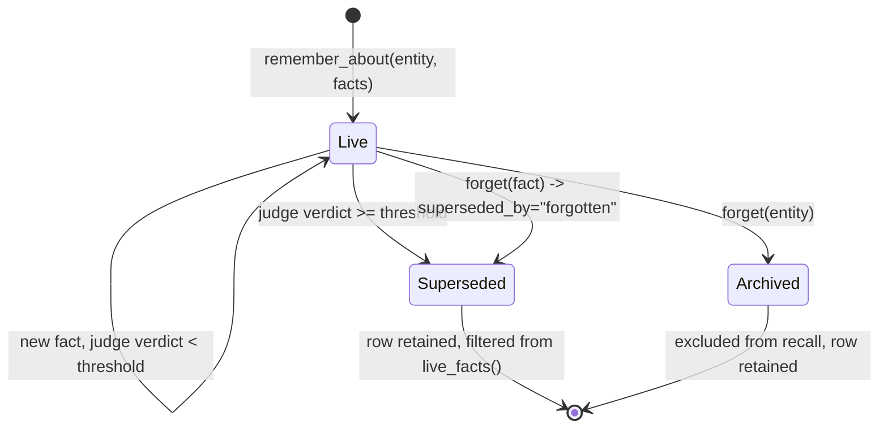

## 1. Executive Summary

Agno is a framework and runtime for building agent platforms, and it ships
**two memory subsystems that do not know about each other**. `agno/memory/` is
the older one: a 1,580-line `MemoryManager` that extracts free-text memories
about a user with an LLM and stores them in a `user_memories` table.
`agno/learn/` is the newer and much larger one — 13,911 lines across six stores
(`user_profile`, `user_memory`, `session_context`, `learned_knowledge`,
`entity_memory`, `decision_log`), a `LearningMachine` that coordinates them, a
`LearningStore` protocol third parties can implement, and a `Curator`.

The two overlap. Both define a user memory; `agno/learn/stores/user_memory.py`
and `agno/memory/manager.py` are separate implementations of nearly the same
idea, and the AgentOS HTTP routes serve the *older* one. A reader adopting Agno
has to work out which of the two they are configuring, and the repository does
not say.

**The best thing in it is entity fact supersession**
(`agno/learn/schemas.py:797-811` with the judge in
`agno/learn/stores/entity_memory.py`). When a new fact arrives about an entity
that already has facts, an LLM judge is asked whether the two can both be true;
a verdict above a configurable threshold calls `retire_fact`, which stamps
`superseded_at` and `superseded_by` and **leaves the row in place**.
`live_facts()` filters retired facts out of everything that renders, so the old
value stops reaching the prompt while remaining in the record. `superseded_by`
holds the new fact's id, or the literal `"forgotten"`, or `"superseded"` when
several new facts jointly replaced one — so the reason is recoverable, not just
the fact of replacement. The threshold is configurable and tested at 0.5 and
0.99, and the judge is skipped entirely when the entity is new. This is a
careful piece of work.

**The worst thing in it is one HTTP route.** `POST /memory/optimize`
(`agno/os/routers/memory/memory.py:668`) runs `SummarizeStrategy`, which takes
every memory a user has and asks a model to write **one** paragraph containing
all of them (`agno/memory/strategies/summarize.py:15-21`). The manager then
calls `clear_user_memories(user_id=user_id)` and inserts that single row
(`agno/memory/manager.py`, the `if apply:` branch). `apply` defaults to `True`.
Nothing records what was collapsed, the surviving memory carries a fresh id and
timestamp, and the route's response is a token count and a
`reduction_percentage` — the API reports how much was compressed and has no
field for how much was kept.

Between those two facts sits the finding this report exists for. Agno's
`LearningMode` enum offers `PROPOSE` — "Agent proposes, human confirms". What
`PROPOSE` actually changes is the return value of `instructions()`
(`agno/learn/stores/learned_knowledge.py:252`): the model is handed a prompt
that says *"**RULE 3: Only save after explicit approval.** Call `save_learning`
ONLY after the user says 'yes' to your proposal."* The `save_learning` tool it
is handed in that same mode calls `self.save(...)` with **no approval check of
any kind**. The
gate is a sentence in a system prompt, addressed to the one component in the
system that cannot be relied on to follow it.

## 2. Mental Model

Agno's memory has no epistemic states. A written thing is true, and it stays
true until something replaces it. There is a `confidence` float, but only on
`DecisionLog` entries (`agno/learn/schemas.py:1097`), where it records how sure
the agent was when it acted — not whether the record should be believed.

What Agno has instead of trust states is a **lifecycle for facts**, and it is
the only place in the corpus where supersession is decided by a judged
comparison rather than by a key collision:

Two properties of that machine are worth naming. It is **conservative under
uncertainty** — a verdict below the threshold keeps both facts live, so the
default failure is a contradictory store rather than a destroyed value, which is
the right way round. And it is **reversible in principle**, because the
superseded row is still there with its replacement's id on it — though nothing
in the repository exposes an un-supersede.

The rest of the system does not work this way. `SessionContext` is documented as
REPLACED on each update. `UserProfile` accumulates and the `Curator` prunes it
by age and count. The old `MemoryManager` has `optimize_memories`. Three
different answers to "what happens to the previous value", in one framework, and
only one of them keeps it.

## 3. Architecture

There is one storage abstraction — `agno.db.base.BaseDb` and its async twin —
and eighteen implementations behind it: fourteen subclass `BaseDb` (Postgres,
MySQL, SQLite, SingleStore, MongoDB, Redis, Valkey, DynamoDB, Firestore,
ClickHouse, SurrealDB, GCS-backed JSON, plain JSON files, and an in-memory
dict) and four subclass `AsyncBaseDb` (async Postgres, async MySQL, async
SQLite, async MongoDB). `BaseDb.__init__` names twenty-three tables
(`agno/db/base.py:38-60`), of which memory uses `memory_table` and
`learnings_table`.

To stand this up you need a database and a model provider. That is the whole
operational bill for the memory path, and it is a genuinely low one — the JSON
and SQLite backends make a local install a file. **There is no vector store
anywhere in the memory path**, which is worth pausing on: Agno advertises
integrations with more than twenty vector databases, and uses none of them to
retrieve a memory. Vectors are for `Knowledge`, which is document RAG. Memory
retrieval is recency, or an LLM call (§6).

The operator-facing surface is **AgentOS**, a FastAPI control plane. Its memory
router (`agno/os/routers/memory/memory.py`) exposes nine routes: create, get,
list, patch, delete, bulk delete, topics, per-user stats, and optimize. This is
the layer a person actually touches, and it is also — see §9 — the only reason
this report carries a `human_review` mark.

## 4. Essential Implementation Paths

- `agno/learn/machine.py` — `LearningMachine`, the coordinator. Holds the store
  registry, builds the post-run capture hooks, aggregates tools, and dispatches
  to stores with signature-aware kwargs filtering (`_filter_store_kwargs`,
  line 44) so a third-party store written without `**kwargs` does not break when
  the framework adds context.
- `agno/learn/stores/protocol.py` — the `LearningStore` Protocol: `recall`,
  `process`, `build_context`, `instructions`, `get_tools`, each with an async
  twin. A clean six-method contract, and the reason a custom store is a small
  amount of work.
- `agno/learn/stores/entity_memory.py` (3,686 lines) — the largest store and the
  most interesting one.
- `agno/learn/schemas.py` (1,163 lines) — every learning type's dataclass, plus
  `retire_fact` and `live_facts`.
- `agno/memory/manager.py` (1,580 lines) — the older path: extraction,
  `search_user_memories`, and `optimize_memories`.
- `agno/os/routers/memory/memory.py` (796 lines) — the HTTP surface.
- `agno/learn/curate.py` (185 lines) — `prune` and `deduplicate`.

## 5. Memory Data Model

Six units, and the differences between them are the design:

| Store | Unit | Update semantics |
| --- | --- | --- |
| `user_profile` | Typed fields (name, preferred_name, custom schema) | Accumulates; curator prunes |
| `user_memory` | `{id, content, created_at, updated_at}` in a list | Update in place, delete by id |
| `session_context` | A summary and state for one session | Replaced wholesale |
| `learned_knowledge` | `{title, learning, context, tags}` | Append; dedupe by search-before-save, instructed not enforced |
| `entity_memory` | An entity with facts, events, aliases, links | `retire_fact`, `forget`, archive |
| `decision_log` | A decision with `confidence` and an outcome | Append |

`Memories.add_memory` (`agno/learn/schemas.py`) carries a comment that is the
right instinct written down: *"`created_at` and `updated_at` are stamped by the
framework here — the model decides what to remember, we decide when it was
recorded."* Time is not left to the extractor. What is missing is the other
clock: every timestamp in the model is a **record** time. Nothing tracks when a
fact was *true*, so a corrected address and a moved address are the same event,
and `superseded_at` tells you when the system found out, never when the world
changed. No `bitemporal` mark.

The older `UserMemory` dataclass (`agno/db/schemas/memory.py`) carries a
`feedback: Optional[str]` column. No code path in the inspected tree writes it.
It is a slot where a correction signal was going to go.

## 6. Retrieval Mechanics

`MemoryManager.search_user_memories` (`agno/memory/manager.py:597-647`) offers
three retrieval methods and no fourth:

- `last_n` — the most recent memories. The default.
- `first_n` — the oldest.
- `agentic` — send the memories to a model with the query and take back a list
  of `memory_ids` (`MemorySearchResponse`, line 36).

So relevance ranking, where it exists at all, costs a model call per search and
is only as good as that model's id-copying. There is no embedding, no BM25, no
hybrid fusion, and no re-ranking. For a framework whose pitch includes hybrid
search and reranking over twenty vector stores, memory retrieval is recency by
default.

The `learn` stores mostly do not rank either. `UserMemoryStore.recall(user_id)`
returns *everything* for that user and lets the prompt budget sort it out.
`EntityMemoryStore.recall(message=...)` is the exception and the one place with
real retrieval logic: it matches entity names in the incoming message on **word
boundaries**, expands the named entities first, and only falls back to term
search if the name path has not filled `k`. The test at
`tests/unit/learn/test_relevance_recall.py:102` monkeypatches `store.search` to
raise if the fallback runs — asserting a code path *must not execute*, which is
an unusually precise thing to assert about a retriever.

**Scope is enforced and fails closed.** `recall()` returns `None` when `user_id`
is falsy rather than falling back to a default or scanning
(`agno/learn/stores/user_memory.py`). Entity memory adds a `namespace` —
`"user"` for private, `"global"` for shared, or a custom group string — applied
on the read path. `scope_enforced` is earned. Note the default is `"global"`:
an entity is shared unless someone says otherwise, which is the opposite of the
fail-closed instinct in `recall`.

## 7. Write Mechanics

Two paths in.

**`ALWAYS` mode** fires from a post-run hook. `LearningMachine.capture_hook()`
(`agno/learn/machine.py:608`) returns a callable that collects the run's
messages and then does one of two things: if the agent has a
`background_executor`, it submits `machine.process` to it; **otherwise it calls
`machine.process(...)` inline**. Inline means an LLM extraction call on the
response path, after the user has their answer but before the run completes.
Whether writes block therefore depends on a runtime setting most readers will
not know they have. `acapture_hook()` (line 647) is unambiguous:
`asyncio.create_task` at line 662,
strong-referenced so it is not garbage collected mid-flight, with failures
logged and never raised into the run. Memory extraction cannot fail a request —
and cannot tell you that it failed, either.

**`AGENTIC` mode** hands the model tools: `update_profile`,
`update_user_memory`, `remember_about`, `link_entities`, `search_entities`,
`forget`, `search_learnings`, `save_learning`. These are synchronous and write
immediately.

Lag before a memory is retrievable is therefore either zero (tool call) or one
background task (extraction). Nothing rewrites the whole store on a schedule —
with one exception, and it is not scheduled but manual: `optimize_memories`,
which rewrites all of it at once (§9).

The `Curator` (`agno/learn/curate.py`) offers `prune(user_id, max_age_days,
max_count)` and `deduplicate(user_id)`. Its docstring describes maintenance for
the machine; its code reads `self.machine.stores.get("user_profile")` and
returns `0` for everything else. The class comment says so — *"Currently
supports user_profile store only"* — but the module docstring above it does not.

## 8. Agent Integration

`LearningMachine.get_tools()` assembles the tool list from whichever stores are
enabled, warning when `user_id` or a model is missing rather than failing. There
is a separate `MemoryTools` toolkit (`agno/tools/memory.py`, 420 lines) for the
older manager, an MCP surface, and the AgentOS routes.

The per-store `instructions()` method is a good idea: each store owns the prose
that tells the model how to use its own tools, and `build_context()` owns the
data, with the split documented in the protocol. `tests/unit/learn/
test_guidance_split.py` asserts the two do not leak into each other — that a
tool name does not appear in the data context, and that guidance for a disabled
tool is absent. Prompt assembly is not usually tested at all; here it is.

## 9. Reliability, Safety, and Trust

**The PROPOSE finding.** Set out in §1 and worth stating once more precisely,
because it is the sort of thing that reads as implemented from the outside:
`LearningMode.PROPOSE` changes one thing — which string `instructions()`
returns. In `_build_propose_mode_context` the model is told to print a
"**Proposed Learning**" block, ask *"Save this to the knowledge base?
(yes/no)"*, and call `save_learning` only after a yes. The tool has no
`approved` parameter, consults no approval record, and is registered in exactly
the same way as in `AGENTIC` mode. A model that skips the question saves
anyway; nothing observes the difference. The `db/schemas/approval.py` table with
its `pending | approved | rejected | expired | cancelled` status exists in this
repository, for tool-call approvals, and the memory path does not use it.

`LearningMode.HITL` is worse off: it is in the enum, and three stores respond to
it by logging a warning and continuing without it
(`learned_knowledge.py:81-82`, `user_profile.py:91-92`,
`user_memory.py:81-82`). The config docstring says it is "unsupported by every
store; removed in 3.0", which is honest, and leaves a configuration value that
silently degrades to no gate at all.

**`human_review` is earned, and not from the mode named after it.** The AgentOS
router exposes `PATCH /memory/{id}` and `DELETE /memory/{id}` alongside list and
get. A person can read a memory, correct its text, and delete it, against a
running system. That is adjudication after the fact, which the rubric counts.
The mark comes from a REST API; the feature called human-in-the-loop earns
nothing.

**The destructive default.** `optimize_memories(user_id, strategy, apply=True)`
is the single most dangerous call in this report. `SummarizeStrategy.optimize`
returns a list of exactly one `UserMemory`, and the manager then clears the
user's table and writes it. To its credit the model call happens *before*
`clear_user_memories`, so a provider failure raises without destroying anything.
Everything else about it is a trap: the parameter that would make it a preview
is opt-out rather than opt-in, the HTTP route passes `request.apply` straight
through, and the response schema counts `tokens_saved` and
`reduction_percentage`. A user who clicks Optimize twice gets a summary of a
summary.

There is **no audit log**. `decision_log` sounds like one and is not — it
records decisions the agent made and their outcomes, which is a memory *type*,
not a record of memory mutations. Nothing anywhere records that a memory was
changed, by whom, or from what. Combined with the paragraph above: after an
optimize, the previous state of a user's memory exists nowhere.

**No tombstone.** `forget` sets `superseded_by = "forgotten"` on a fact, or
archives an entity (`agno/learn/schemas.py:616`). Both are keyed on the record.
The next `remember_about` carrying the same content writes it again — a comment
at `schemas.py:730` shows the author reasoning about exactly this adjacency
("forget lists byte-identical candidates") for a *duplicate* problem, without
the step across to blocking re-assertion.

## 10. Tests, Evals, and Benchmarks

304 test functions across 17 files under `tests/unit/learn` and
`tests/unit/memory`, plus integration suites for the manager, agent memory, team
storage, and the OS routes. None were run here.

The suite is behavioural where it matters. `test_entity_supersession.py` drives
a stubbed judge model at chosen verdict strengths and asserts what survives:
that a retired fact is absent from `live_facts()` while both rows remain in
`entity.facts`, that a 0.5 verdict below threshold retires nothing, that raising
the threshold to 0.99 keeps both facts, and that the judge is not called at all
for a new entity. `test_relevance_recall.py` asserts a two-letter entity named
`Al` is **not** recalled for "always check the radar dashboard" while `radar`
is, and *is* recalled for "ask Al about the budget".

**`negative_eval` is earned on the same basis as [Helm](../helm/)**: the
supersession cases assert that a corrected value no longer appears in what
renders, and the relevance cases assert that particular stored material must not
be retrieved for a given message. It is the weaker half of the column — nothing
asserts that a *boundary* holds, so there is no committed test proving user A's
memories cannot reach user B's prompt, which is the assertion the
`scope_enforced` mark most wants behind it.

No memory benchmark exists in the repository. No LoCoMo, no LongMemEval, no
retrieval-quality measurement of any kind, and no published numbers to check —
which, given how many of this atlas's benchmark findings are about untraceable
claims, is at least a claim not made.

## 11. For Your Own Build

### Steal

- **Judge supersession instead of inferring it from a key collision.** Ask
  whether two facts can both be true, put a configurable threshold on the
  answer, and keep both when the answer is weak. Most systems here overwrite on
  key match and cannot tell a correction from an addition.
- **Keep the superseded row and name what replaced it.** `superseded_by` holding
  a new fact's id — or `"forgotten"`, or `"superseded"` for a many-to-one
  replacement — makes "why did this stop being true" answerable with a lookup
  instead of a guess.
- **Let the framework stamp time, not the model.** The comment at
  `schemas.py` is the whole argument: the model decides what to remember, the
  framework decides when it was recorded.
- **Split the guidance from the data, and test the split.** `instructions()`
  returns how-to-use, `build_context()` returns what-is-known, and a test asserts
  neither leaks into the other. Prompt assembly is code and rots like code.
- **Write down the corruption that produced the line.** `_slugify` documents that
  collapsing non-word characters once merged C, C++ and C# into one entity
  holding all three's facts, "with the discarded names written nowhere", and
  that there is no unmerge. Accent folding carries the same treatment. This is a
  repository that records its own scars where the next reader will hit them.
- **Filter scope by returning nothing.** `recall()` answers `None` when `user_id`
  is missing. A retriever that cannot name its scope should not guess one.

### Avoid

- **A destructive maintenance operation whose preview flag defaults to off.**
  `apply=True` is the wrong default for anything that calls `clear_*`. Invert
  it and make the caller opt into destruction.
- **Measuring a compaction by what it removed.** `tokens_saved` and
  `reduction_percentage` are the only numbers `POST /memory/optimize` returns.
  A compaction's real metric is what survived, and nothing here can compute it.
- **An enforcement mode implemented as an instruction.** If a mode's name
  promises a gate, the gate belongs in the tool — an `approved` argument, a
  pending record, a callback — not in a prompt addressed to the model whose
  behaviour it is supposed to constrain.
- **Two memory subsystems in one package.** `agno/memory/` and `agno/learn/`
  both define user memories, the HTTP API serves one of them, and nothing tells
  a reader which they are configuring.
- **A maintenance class whose module docstring is broader than its code.** The
  `Curator` handles one store of six.

### Fit

Agno suits a team that wants an agent platform and will accept its memory as
part of the bargain — the AgentOS control plane, eighteen database backends and a
model-agnostic runtime are the product, and the learning stores are a good
default that comes with them. Take it if your memory needs are *typed and
modest*: facts about entities, some profile fields, session summaries, with
correction handled by supersession and a human occasionally fixing a row through
the API.

Do not take it as a memory layer to build on if you need retrieval quality —
there is no ranking to tune, and reaching for relevance means an LLM call per
search. Do not take it where deletion has to be provable, because there is no
audit and no tombstone. And whatever else, if you deploy AgentOS, decide who can
reach `POST /memory/optimize` before someone finds the button.

## 12. Open Questions

- **Does the supersession judge fire in production configurations?** It requires
  a model on the entity store; nothing measured how often verdicts land above
  threshold, and the threshold's default was not traced to any calibration.
- **How often does `PROPOSE` mode's instruction actually hold?** That is a
  measurable number — the fraction of `save_learning` calls preceded by a user
  "yes" — and nothing in the repository measures it. It is also the number that
  decides whether the mode means anything.
- **What is `feedback` on `UserMemory` for?** Declared, never written.
- **Is the inline `machine.process` path common?** Whether a typical Agno
  deployment blocks its response path on extraction depends on whether apps set
  `background_executor`, which was not established here.
- **Are the two subsystems converging or diverging?** `agno/learn/` looks like
  the successor, and `agno/memory/` is what the HTTP API and the `MemoryTools`
  toolkit serve.

## Appendix: File Index

| Path | Lines | What it holds |
| --- | --- | --- |
| `libs/agno/agno/learn/stores/entity_memory.py` | 3,686 | Entities, facts, links, the supersession judge, `forget` |
| `libs/agno/agno/learn/stores/learned_knowledge.py` | 1,581 | Titled learnings, `search_learnings`, `save_learning`, PROPOSE prompts |
| `libs/agno/agno/memory/manager.py` | 1,580 | The older extractor, `search_user_memories`, `optimize_memories` |
| `libs/agno/agno/learn/stores/user_memory.py` | 1,529 | Free-text user memories, fail-closed `recall` |
| `libs/agno/agno/learn/stores/session_context.py` | 1,244 | Per-session summary and state, replaced each update |
| `libs/agno/agno/learn/stores/user_profile.py` | 1,223 | Typed profile fields |
| `libs/agno/agno/learn/machine.py` | 1,183 | Store registry, capture hooks, tool aggregation |
| `libs/agno/agno/learn/schemas.py` | 1,163 | Every unit's dataclass, `retire_fact`, `live_facts` |
| `libs/agno/agno/learn/stores/decision_log.py` | 1,097 | Decisions, outcomes, a `confidence` float |
| `libs/agno/agno/os/routers/memory/memory.py` | 796 | Nine HTTP routes including `optimize` |
| `libs/agno/agno/learn/config.py` | 449 | `LearningMode`, per-store configuration |
| `libs/agno/agno/tools/memory.py` | 420 | `MemoryTools` toolkit for the older manager |
| `libs/agno/agno/memory/strategies/summarize.py` | 196 | All memories into one |
| `libs/agno/agno/learn/curate.py` | 185 | `prune`, `deduplicate` — user profile only |
| `libs/agno/agno/learn/stores/protocol.py` | 127 | The six-method `LearningStore` Protocol |

## History

**2026-08-31** — [`7c68873c1357321a5152397c8ab4fb8b3f587bba`](https://github.com/agno-agi/agno/commit/7c68873c1357321a5152397c8ab4fb8b3f587bba) — count and citation audit at the same pin. `BaseDb.__init__` names 23 table parameters, not nineteen, and they run to line 60 rather than 57. The storage abstraction has 18 implementations, not twenty — 14 subclassing `BaseDb` and 4 subclassing `AsyncBaseDb`; §3's own list named only 15. Four line references had drifted: `capture_hook` 624→608, `MemorySearchResponse` 38→36, `_filter_store_kwargs` 43→44. The RULE 3 quote was truncated mid-sentence and is quoted whole. No finding or capability mark changed.

**2026-07-30** — [`7c68873c1357321a5152397c8ab4fb8b3f587bba`](https://github.com/agno-agi/agno/commit/7c68873c1357321a5152397c8ab4fb8b3f587bba) — first reading.
