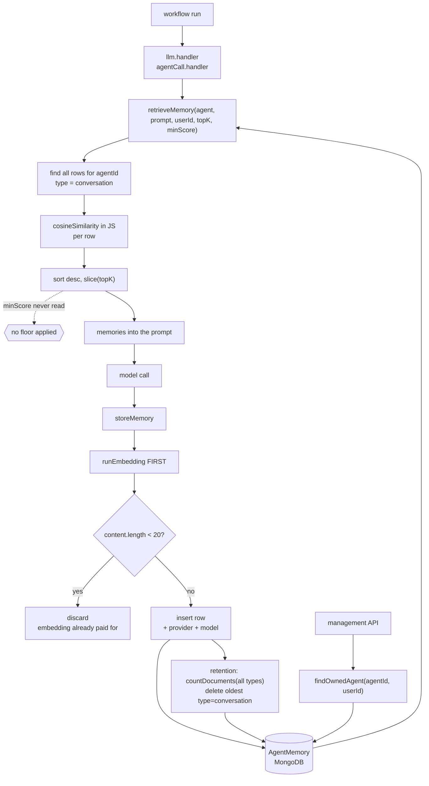

## 1. Executive Summary

AI Agent Automation is a local-first workflow platform — a Node/Express backend
with a MongoDB store, a React frontend, Docker deployment, and a workflow engine
whose handlers cover LLM calls, HTTP, browser automation, email, files and MCP.
Apache 2.0, 517 commits since 28 December 2025, at release v0.11.0.

The memory surface inside it is small and self-contained: one Mongoose model, a
94-line service, a 208-line management controller and four routes. Two workflow
handlers use it — `llm.handler.js` and `agentCall.handler.js` both retrieve
before the model call and store after it — so an agent accumulates conversational
memory across workflow runs and recalls it by embedding similarity. That is
agent memory on this atlas's terms, and it earns `scope_enforced` on a clean
`agentId` predicate.

**Three findings, and the first is the kind this atlas exists to catch.**

`retrieveMemory(agent, queryText, userId, topK = 5, minScore = 0.45)` declares a
similarity floor. The body scores, sorts and slices, and **never reads
`minScore`**. A grep of the whole backend finds the identifier on exactly one
line — the signature. The function was rewritten around it: a `userId` parameter
was inserted before it, an ownership assertion added above it, a fail-closed
guard added for stale callers, and 126 lines changed in the file. The dead
parameter came through untouched, which is the ordinary way a declaration
outlives the intent behind it. So the fifth-best match in a five-hundred-row cap
reaches the prompt at whatever cosine it happened to score.

**The retention pass counts one set and deletes from another.** It calls
`countDocuments({agentId})` across every memory type, computes
`excess = count - 500`, and then deletes `excess` of the oldest rows *restricted
to* `metadata.type: "conversation"`. Both directions are wrong: if non-conversation
memories exist the cap deletes more conversation history than the overflow
justifies, and if fewer conversation rows exist than the excess it silently
under-deletes and the cap never holds.

**Every retrieval prints its results.** `retrieveMemory` ends with a
`console.log` of each hit's score and a sixty-character content preview — in a
platform whose README leads with local-first privacy and ships a `docs/privacy.md`.

**Also worth naming, in the other direction:** the row stores
`embeddingProvider` and `embeddingModel` beside the vector. That is a small
field most stores in this corpus omit, and it is the one that stops a store from
comparing a vector made by `ollama` against one made by `openai` as though the
numbers meant the same thing.

## 2. Mental Model

```text
workflow run ──► llm.handler / agentCall.handler
                        │
        retrieveMemory(agent, prompt, topK)
                        │
        find({agentId, type: "conversation"})   ← every row for this agent
                        │
        cosine in JS ──► sort ──► slice(topK)   ← no floor, minScore unread
                        │
                   into the prompt
                        │
                   model call
                        │
        storeMemory(agent, content, metadata)
             ├── embed FIRST
             ├── then drop if content.length < 20   ← paid for, discarded
             ├── insert
             └── retention: count ALL types, delete oldest "conversation"
```

The memory is per agent and per type, and the type is where the design goes
sideways: it is written with a default of `conversation`, both read paths filter
to `conversation`, and the retention counter ignores the filter. A memory stored
under any other type would be durable, unreachable and still counted against the
cap.

## 3. Architecture



**Runtime.** An Express backend under `backend/src` with controllers, routes,
models, services and an `agents/` tree holding the workflow runner and its
handlers; a React frontend; Docker and infra directories; a Postman collection;
husky hooks that the screen correctly notes are inert until installed.

**Persistence.** MongoDB through Mongoose. `AgentMemorySchema` has `agentId`
required and indexed, `content` and `embedding` required, a `metadata` subdocument
with `taskId`, `workflowId` and `type`, an `embeddingProvider` enumerated over
`ollama | openai | gemini | huggingface | groq`, an `embeddingModel`, and
Mongoose timestamps. **There is no vector index** — similarity is computed in
application code over every row the query returns, which the 500-row cap keeps
tractable and which is a reasonable trade at that size.

## 4. Essential Implementation Paths

**`cosineSimilarity(vecA, vecB)`** returns `0` when the lengths differ rather
than throwing. That is a defensible guard against a stored vector from a
different model — and it means such a row scores zero and sorts last rather than
surfacing an error, so a whole population of mismatched embeddings would degrade
recall silently. The `embeddingProvider` and `embeddingModel` columns are what
would let something detect that; nothing reads them.

**`storeMemory(agent, content, metadata)`** calls `runEmbedding` on line one and
checks `content.length < 20` on line three. The guard is real and the ordering
wastes the call it was meant to avoid — a one-line move.

**`retrieveMemory`** is quoted in full in section 1. Beyond the unread floor, note
that it loads with `.lean()` and maps every document into a new object with a
`score` field, so the working set is the agent's entire conversation memory in
memory per call.

**The management API is the careful part.** `memory.controller.js` derives the
user from `req.user`, and `findOwnedAgent(agentId, userId)` validates the object
id and resolves the agent against that owner. `listMemories` uses it when an
agent is named and falls back to `agentId: {$in: ownedAgentIds}` when one is not;
`deleteMemory` looks the memory up, then re-resolves ownership of its agent
before deleting; `clearAgentMemory` resolves ownership first. Four routes, all
behind `auth`. Every path checks; none of them is the one that forgot.

## 5. Memory Data Model

One document type, no status, no confidence, no supersession, no soft delete.
`createdAt` and `updatedAt` from Mongoose timestamps, and nothing that records
when a fact held as distinct from when it was written.

The interesting field is the pair `embeddingProvider` / `embeddingModel`. Storing
the identity of the model that produced a vector is the cheap defence against the
failure where a config change re-points the embedder and every subsequent
comparison is meaningless. This schema records it. Nothing checks it — the guard
that would use it is the length comparison in `cosineSimilarity`, which catches
only a dimension change and not a same-dimension model swap.

## 6. Retrieval Mechanics

Full scan of the agent's conversation memories, cosine in JavaScript, sort, take
*k*. Callers pass `config.memoryTopK || 5`.

**The floor is the finding.** With no threshold, the number of memories injected
is exactly `min(topK, available)` regardless of relevance: on an agent with three
memories and an unrelated prompt, all three go into the prompt. The atlas records
the same shape elsewhere as a *dead threshold*; what makes this instance sharp is
that a caller supplies the value, so the intent is documented in the call and
defeated in the callee.

**The `type` filter is the second.** Both `retrieveMemory` and the retention
delete filter to `metadata.type: "conversation"`, while the schema's default is
the only thing that puts that value there. Any caller that sets another type
writes a row that is stored, counted, never retrieved and never pruned.

## 7. Write Mechanics

Two handlers write after their model call, and the controller writes a third
time. Retention runs inline on every insert — a `countDocuments` and, on
overflow, a `find` plus a `deleteMany`, on the request path.

**The retention bug in full.** `count` is over `{agentId}`. `excess` is
`count - 500`. The `find` that selects victims adds
`"metadata.type": "conversation"` and `.limit(excess)`. So the numerator and the
denominator disagree. With only conversation rows the pass behaves correctly,
which is why it works today: nothing in the tree writes another type. It is a
bug waiting on a feature, and the feature is one metadata field away.

## 8. Agent Integration

Memory is an option on two node types rather than a service of its own:
`llm.handler.js` retrieves with `config.memoryTopK || 5` before its call and
stores after, and `agentCall.handler.js` does the same around a nested agent
invocation. There is no memory node, no explicit remember tool, and no way for a
workflow author to inspect what will be injected before a run — the management UI
shows what was stored afterwards.

## 9. Reliability, Safety, and Trust

**Ownership is enforced consistently on the management surface** and the agent
key is enforced on recall, which together are the mark.

**No audit, no provenance, no trust state.** A memory is content and a vector; it
cannot be marked wrong, superseded, or held back, and the only removal is a
delete.

**Retrieval logs content to stdout.** The `console.log` in `retrieveMemory`
prints a score and a sixty-character preview of every returned memory on every
recall. In a deployment where the backend's stdout goes to a container log
shipper, memory content leaves the machine that the product's positioning says it
stays on. It is three lines to remove and it is the first thing to remove.

## 10. Tests, Evals, and Benchmarks

Test files under `backend/src/tests` cover handlers — browser, condition, delay,
document, email, file, HTTP, MCP, tool, switch, resume, run partial — plus the
workflow API, versioning, the strategy selector, a retrieval manager, and three
added since the previous pin for SSRF protection, webhook payload size and
workflow validation. I did not run them; a dependency surface was inside the
seven-day cooldown.

**One of them covers memory, and it covers the boundary rather than the
mechanics.** `memoryService.handler.test.js` is ten cases named
*"cross-user isolation (H-P1-7)"*: one positive control, then a cross-user call
that must reject with `FORBIDDEN` **and** must not issue the memory query at all
— `expect(AgentMemory.find).not.toHaveBeenCalled()` — then a forged agent, a
non-existent one, undefined, null and empty user contexts, a stringified id, and
a stale positional call. It earns `negative_eval`, and it is the right shape: the
must-not assertion is paired with a control, and it pins that the data was never
read rather than that it was filtered after reading. The Mongoose layer is
mocked, so what it pins is the service's control flow.

What it does not cover is the arithmetic. The unread `minScore`, the retention
count-versus-delete mismatch and the type filter remain untested, which is
consistent with how they got this way — each is invisible to anything that does
not read the function, and the suite that arrived reads the boundary instead.

No benchmark and no retrieval-quality measurement.

## 11. For Your Own Build

### Steal

- **Store the embedding provider and model beside the vector.** Two string
  columns, and they are the difference between detecting a silent embedder swap
  and comparing numbers from two different models forever.
- **Resolve ownership before every read and every delete, and make the
  no-argument case a scoped fallback.** `listMemories` without an agent id
  returns `{$in: ownedAgentIds}` rather than everything — that default is where
  most implementations leak.
- **Return zero from your similarity function on a dimension mismatch rather
  than throwing** — but pair it with something that notices, or a bad population
  is invisible.

### Avoid

- **Do not declare a threshold you do not apply.** `minScore = 0.45` sits in the
  signature, a caller passes it, and the body never reads it. A parameter is a
  claim; an unread one is a false claim that survives review because the call
  site looks right.
- **Do not count one population and delete from another.** The retention pass
  counts every memory type and prunes only conversations; it is correct only
  because nothing writes another type yet.
- **Do not pay for the embedding before the guard that discards the input.**
- **Do not log memory content.** Especially not in a product whose first claim
  is that data stays local.

### Fit

Take the workflow engine on its own terms; the memory layer is a small feature
inside it and is best read as a worked example of how a per-agent vector store
gets wired into a handler. The ownership checks are worth copying. The recall is
worth copying only after the floor is applied.

## 12. Open Questions

- **Was `minScore` ever applied?** The parameter, the default and a call site
  passing `0.45` all exist. Whether it was removed or never written is not
  visible from this commit, and either way one `filter` restores the intent.
- **What other memory types are planned?** `metadata.type` defaults to
  `conversation` and both read paths and the retention delete assume it. The
  field is the seam the retention arithmetic breaks along.
- **Does the 500-row cap have a basis?** It is a constant inside the service
  with no configuration and no measurement behind it, and it is also what keeps
  the full-scan cosine affordable.
- **Would a mismatch ever be noticed?** `embeddingProvider` and `embeddingModel`
  are recorded and unread; a same-dimension model change would score every old
  memory as noise and nothing would report it.

## Appendix: File Index

- **Store:** `backend/src/models/agentMemory.model.js`
- **Service:** `backend/src/services/memoryService.js` (`cosineSimilarity`,
  `storeMemory` with the retention pass, `retrieveMemory` with the unread
  `minScore`)
- **Management API:** `backend/src/controllers/memory.controller.js`
  (`findOwnedAgent`, `listMemories`, `listAgents`, `deleteMemory`,
  `clearAgentMemory`), `backend/src/routes/memory.routes.js`
- **Callers:** `backend/src/agents/handlers/llm.handler.js`,
  `backend/src/agents/handlers/agentCall.handler.js`,
  `backend/src/controllers/agent.controller.js` (the call that passes `0.45`)
- **Embedding:** `backend/src/agents/embeddingAdapter.js`
- **Tests:** `backend/src/tests/` — twenty files, none covering memory

## History

**2026-09-14** — [`86b6072dd4c9bf6abe68c26c4265b3296a368737`](https://github.com/vmDeshpande/ai-agent-automation/commit/86b6072dd4c9bf6abe68c26c4265b3296a368737) — second reading, 18 commits on. Screened again: a dependency surface changed inside the seven-day cooldown, so nothing was installed and nothing was run. One memory file moved — `memoryService.js`, 126 lines changed — and the change is a hardening of the read path. `retrieveMemory` takes a `userId` and calls `assertAgentOwnership` before issuing any query, resolving the agent against the caller and throwing `FORBIDDEN` on a mismatch or `USER_CONTEXT_REQUIRED` on a missing one; a stale positional call, where the `userId` slot receives a number, is detected and fails closed rather than being coerced. `scope_enforced` is re-tested and strengthened accordingly. `negative_eval` is added: `memoryService.handler.test.js` is ten committed cases over cross-user isolation, whose must-not assertion pins that `AgentMemory.find` is never called once ownership fails, paired with a positive control in the same suite — which also fills the evidence record's `none` test field. The three published criticisms were each re-run against the new file and all three stand: `minScore` is still declared on the signature and read nowhere in the backend, the retention pass still counts every memory type and deletes only `conversation`, and every retrieval still writes scores and a sixty-character content preview to stdout.

**2026-08-23** — [`984893ca0645b885717157eb8815c4caaa648bee`](https://github.com/vmDeshpande/ai-agent-automation/commit/984893ca0645b885717157eb8815c4caaa648bee) — first reading, at release v0.11.0, 517 commits since 28 December 2025, Apache 2.0. Screened before anything was read: no auto-run surface, one build-time execution point, three unpinned surfaces, two husky hook payloads that are inert until something installs them, and an `AGENTS.md` addressed to a reading agent; nothing was installed and no test was run. One mark. `scope_enforced` is earned on `agentId` as a predicate on the recall query and on `findOwnedAgent` guarding every path of the management API. The three defects recorded here — a `minScore` parameter no code reads while a caller passes `0.45` to it, a retention pass that counts every memory type and deletes only conversations, and a `console.log` of retrieved content — are each invisible to the test suite, which has no memory coverage at all.
