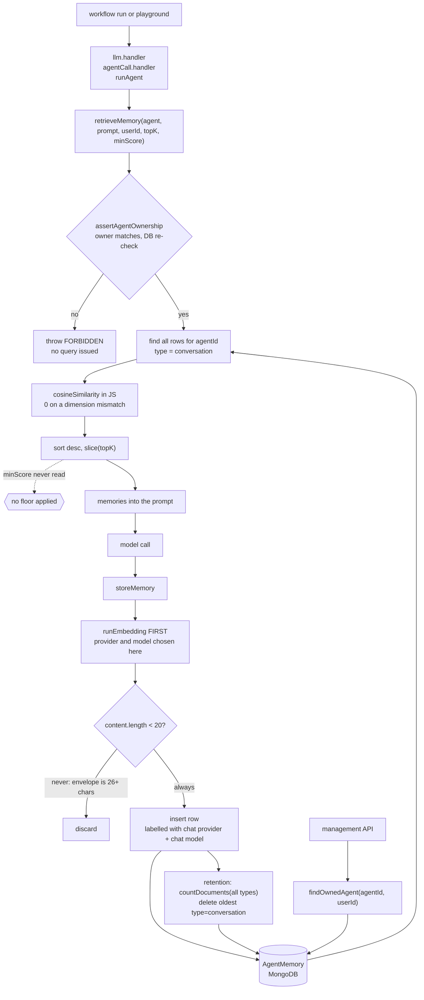

## 1. Executive Summary

AI Agent Automation is a local-first workflow platform whose agents carry a
per-agent vector memory in MongoDB, recalled by cosine in JavaScript around two
workflow handlers and a playground. The recall boundary is well built: ownership
is asserted in the service, re-checked against the database, and pinned by a
cross-user suite. The recall itself is not: a declared similarity floor is never
applied, and a committed test asserts the unfloored result.

The memory surface is one Mongoose model, a service, a management controller
and four routes. `llm.handler.js` and `agentCall.handler.js` both retrieve before
the model call and store after it, and so does the agent playground in
`agent.controller.js`. That is agent memory on this atlas's terms, and it earns
`scope_enforced` on an `agentId` predicate and `negative_eval` on the isolation
suite.

**The floor is declared and unread.** `retrieveMemory(agent, queryText, userId,
topK = 5, minScore = 0.45)` scores, sorts and slices, and `minScore` appears on
one line of the backend, the signature, while the playground passes `0.45`
explicitly. The filter that read it existed: it was deleted on 11 March 2026 in
[`a39545994abfbc82d7fcfa7802969a25a241f397`](https://github.com/vmDeshpande/ai-agent-automation/commit/a39545994abfbc82d7fcfa7802969a25a241f397),
a commit titled for the memory inspector, which also lowered the default from
0.75. The fifth-best row reaches the prompt at whatever cosine it scored.

**The test suite locks the missing floor in.** The case *"Successful retrieval
still returns scored memories"* mocks two rows, one scoring 1 and one scoring 0
against the query, passes `minScore` 0.45, and asserts both come back
(`memoryService.handler.test.js:132-159`). Restoring the filter fails a
committed test.

**The provenance fields name the wrong model.** The row's `embeddingProvider`
and `embeddingModel` are copied from the agent's chat provider and chat model,
while `runEmbedding` picks its own provider and a per-provider default model. On
the schema's default agent, `groq` with `llama-3.1-8b-instant`, the vector comes
from Ollama's `nomic-embed-text` and the row says neither.

**The retention pass counts one set and deletes from another,** and **every
retrieval prints a sixty-character content preview to stdout** in a product that
leads with local-first privacy.

## 2. Mental Model

```text
workflow run / playground ──► llm.handler, agentCall.handler, runAgent
                        │
        retrieveMemory(agent, prompt, userId, topK)
             ├── assertAgentOwnership ── FORBIDDEN / USER_CONTEXT_REQUIRED
             │
        find({agentId, type: "conversation"})   ← every row for this agent
                        │
        cosine in JS ──► sort ──► slice(topK)   ← no floor, minScore unread
                        │
                   into the prompt               ← playground: "MEMORY is factual"
                        │
                   model call
                        │
        storeMemory(agent, JSON {user, assistant}, {type: "conversation"})
             ├── embed FIRST
             ├── drop if content.length < 20    ← envelope is ≥ 26 chars; never fires
             ├── insert, labelled with the CHAT provider and model
             └── retention: count ALL types, delete oldest "conversation"
```

A memory is one exchange, stored as a JSON envelope of the prompt and the reply
and embedded as that string. It becomes recallable the moment the insert
returns, and it stops being one only by deletion: the retention pass, a
delete-one, or a clear-per-agent. Nothing marks a memory wrong, stale or
superseded. The playground injects it under the line *"The following MEMORY is
factual and must be used when relevant"*, so whatever the unfloored top-*k*
returns is presented to the model as ground truth
(`agent.controller.js:165`).

The `type` field is the seam. Every writer sets `conversation`, both read paths
filter to it, and the retention counter ignores it. A memory stored under any
other type would be durable, unreachable and still counted against the cap.



## 3. Architecture

**Runtime.** An Express backend under `backend/src` with controllers, routes,
models, services and an `agents/` tree holding the workflow runner and its
handlers; a React frontend with a memory inspector page; Docker and infra
directories; a Postman collection; husky hooks that are inert until installed.
Document retrieval under `backend/src/retrieval/` is a separate subsystem over
uploaded document chunks and is not agent memory.

**Persistence.** MongoDB through Mongoose. `AgentMemorySchema` has `agentId`
required and indexed, `content` and `embedding` required, a `metadata` object
with `taskId`, `workflowId` and `type`, an `embeddingProvider` enumerated over
`ollama | openai | gemini | huggingface | groq`, an `embeddingModel`, and
Mongoose timestamps. **There is no vector index**: similarity is computed in
application code over every row the query returns, which the 500-row cap keeps
tractable.

**Embedding.** `runEmbedding` calls Ollama at `OLLAMA_HOST`, OpenAI, or Gemini.
An agent on `groq`, the schema default, embeds through Ollama, so a default
deployment needs a local Ollama with `nomic-embed-text` for memory to work at
all. `huggingface` passes `supportsEmbedding` and then reaches no branch, so a
memory-enabled Hugging Face agent throws on its first recall
(`embeddingAdapter.js:7-9`, `:98`).

## 4. Essential Implementation Paths

**`retrieveMemory`** rejects a numeric `userId` as a stale positional call,
asserts ownership, embeds the query, loads every conversation row for the agent
with `.lean()`, maps each into a new object with a `score`, sorts, slices and
logs (`memoryService.js:111-145`). The working set is the agent's entire
conversation memory, in process memory, per call.

**`assertAgentOwnership`** throws `AGENT_REQUIRED` on a missing agent,
`USER_CONTEXT_REQUIRED` on an absent user, `FORBIDDEN` when the in-memory
agent's owner differs from the caller, and `FORBIDDEN` again when
`Agent.findOne({_id, userId})` finds no row, so an in-memory agent carrying a
forged `userId` does not pass (`memoryService.js:28-60`).

**`storeMemory`** calls `runEmbedding` on its first line and checks
`content.length < 20` after. Every in-tree caller passes
`JSON.stringify({user, assistant})`, which is at least 26 characters with both
fields empty, so the guard cannot fire from any of them and an empty exchange is
stored (`memoryService.js:63-78`). It performs no ownership check. The project's
`hardening_plan.md` accepts that as a remaining risk, and each writer is guarded
by call order instead: both handlers call `retrieveMemory` in the same
`useMemory` branch before storing, and it throws first, while the playground
checks ownership itself (`agent.controller.js:135-138`).

**`cosineSimilarity(vecA, vecB)`** returns `0` when the lengths differ rather
than throwing. With no floor, those zero-scored rows are returned whenever
the agent holds no more rows than `topK`.

**The management API** derives the user from `req.user`, and
`findOwnedAgent(agentId, userId)` validates the object id and resolves the agent
against that owner. `listMemories` uses it when an agent is named and falls back
to `agentId: {$in: ownedAgentIds}` when one is not; `deleteMemory` looks the
memory up, then re-resolves ownership of its agent before deleting;
`clearAgentMemory` resolves ownership first. Four routes, all behind `auth`
(`memory.controller.js`, `memory.routes.js`).

## 5. Memory Data Model

One document type, no status, no confidence, no supersession, no soft delete.
`createdAt` and `updatedAt` come from Mongoose timestamps, and nothing records
when a fact held as distinct from when it was written.

**The provenance pair records configuration, not the embedder.** `storeMemory`
writes `embeddingProvider: agent.config.provider` and
`embeddingModel: agent.config.embeddingModel || agent.config.model`
(`memoryService.js:76-77`). The `Agent` schema's `config` declares `provider`,
`model`, `temperature`, `tools` and `metadata` and no `embeddingModel`, so
Mongoose's strict mode drops that key and the fallback always wins
(`agent.model.js:17-27`). The field therefore holds the chat model.

`runEmbedding` chooses independently: the chat provider when it is one of
`ollama | openai | gemini | huggingface`, otherwise Ollama, with a per-provider
default model (`embeddingAdapter.js:26-44`). The provider field is right for
OpenAI, Gemini and Ollama agents and wrong for Groq; the model field is wrong
for all of them. The memory inspector displays both as recorded
(`frontend/src/app/memory/page.tsx:403-407`), and no backend code reads them.

The playground adds `source: 'playground'` to the metadata. `metadata` declares
no `source`, so strict mode drops it too, and a playground memory is
indistinguishable from a workflow one once stored (`agent.controller.js:181`).

## 6. Retrieval Mechanics

Full scan of the agent's conversation memories, cosine in JavaScript, sort, take
*k*. The handlers pass `config.memoryTopK || 5` and no floor; the playground
passes `5, 0.45`. The handlers cap the joined memory text at 4,000 characters
(`llm.handler.js:42`, `agentCall.handler.js:89`); the playground does not.

**The floor is the finding.** With no threshold, the number of memories injected
is exactly `min(topK, available)` regardless of relevance: on an agent with three
memories and an unrelated prompt, all three go into the prompt. A caller
supplies the value, so the intent is documented in the call and defeated in the
callee. The first version applied it, as `.filter(m => m.score >= minScore)`
with a default of 0.75, in
[`1ddd0d00d551324d2d03e2c9fbdbc89af6d2d1a6`](https://github.com/vmDeshpande/ai-agent-automation/commit/1ddd0d00d551324d2d03e2c9fbdbc89af6d2d1a6)
on 2 March 2026.

**The `type` filter is the second.** Both `retrieveMemory` and the retention
delete filter to `metadata.type: "conversation"`. All three writers set that
value explicitly (`llm.handler.js:66`, `agentCall.handler.js:160`,
`agent.controller.js:180`), so every stored row is reachable at this commit. A
caller that set another type would write a row that is stored, counted, never
retrieved and never pruned.

## 7. Write Mechanics

Two handlers and the playground write after their model call, awaited on the
request path: an embedding call, an insert, a `countDocuments`, and on overflow
a `find` plus a `deleteMany`. A memory is retrievable as soon as the insert
returns. No background pass touches the store.

**The retention bug in full.** `count` is over `{agentId}`. `excess` is
`count - 500`. The `find` that selects victims adds
`"metadata.type": "conversation"` and `.limit(excess)`
(`memoryService.js:83-102`). The numerator and the denominator disagree. With
only conversation rows the pass behaves correctly, which is the state at this
commit because every writer sets that type. It is a bug waiting on a feature,
and the feature is one metadata field away.

## 8. Agent Integration

Memory is an option on two node types and on the playground rather than a
service of its own: a step with `config.useMemory` retrieves before its call and
stores after it, and `POST /api/agents/:id/run` does the same when the body sets
`useMemory`. There is no memory node, no explicit remember tool, and no way for
a workflow author to inspect what will be injected before a run. The memory
inspector shows what was stored afterwards, and the playground response returns
the retrieved rows with their scores.

## 9. Reliability, Safety, and Trust

**Ownership is enforced on both surfaces.** Recall asserts it in the service
against the database, and the management API resolves it on every route. A
workflow's default agent is loaded by `Agent.findById` with no owner filter
(`runner.js:278`), and the recall assertion is what stops a foreign agent's
memory from being read there.

**No audit, no trust state, and provenance that misleads.** A memory is content
and a vector; it cannot be marked wrong, superseded or held back, and the only
removal is a delete. The provider and model fields read as provenance and
record the chat configuration (section 5).

**Retrieval logs content to stdout.** The `console.log` in `retrieveMemory`
prints a score and a sixty-character preview of every returned memory on every
recall (`memoryService.js:137-142`). Where the backend's stdout goes to a
container log shipper, memory content leaves the machine the product's
positioning says it stays on.

**The inspector's search is an unescaped regular expression.** `listMemories`
passes the `search` query parameter to `$regex` as given
(`memory.controller.js:54-58`). The filter is scoped to the caller's own agents,
so it leaks nothing, and a pathological pattern costs the database a
full evaluation per row.

## 10. Tests, Evals, and Benchmarks

The backend suite under `backend/src/tests` covers handlers — browser,
condition, delay, document, email, file, HTTP, LLM, agent call, MCP, tool,
switch, resume, run partial — plus the workflow API, versioning, validation,
SSRF protection, webhook payload size, rate limiting, socket auth, the document
retrieval manager and the strategy selector. I did not run it.

**One file covers memory, and it covers the boundary.**
`memoryService.handler.test.js` holds ten cases named *"cross-user isolation
(H-P1-7)"*. The cross-user case must reject with `FORBIDDEN` **and** must not
issue the memory query — `expect(AgentMemory.find).not.toHaveBeenCalled()`
(`:60-71`). The others cover a forged agent, a non-existent one, undefined,
null and empty user contexts in one case, a stale positional call, a missing
agent, and a stringified user id. The Mongoose layer is mocked, so what the
suite pins is the service's control flow.

**It earns `negative_eval`, and the control is the populated case.** *"User A
can retrieve memory belonging to User A agent"* mocks an empty collection and
asserts only that an array came back (`:50-58`). *"Successful retrieval still
returns scored memories"* returns both of the owner's mocked rows (`:132-159`),
and that is the case that shows the retriever can return what the cross-user
case keeps out.

**That control also asserts the missing floor.** Its rows embed as `[1,0,0]`
and `[0,1,0]` against a query of `[1,0,0]`, so the second scores 0; the call
passes `minScore` 0.45, and the case asserts `result.length` is 2. A last case
asserts that `storeMemory` succeeds with no user context (`:161-171`).

Nothing exercises the retention pass, whose count the store case mocks to 0,
or the length guard, which that case clears with a plain string. No benchmark
and no retrieval-quality measurement.

## 11. For Your Own Build

### Steal

- **Make a changed signature fail closed on its old call shape.** Inserting
  `userId` before `topK` would silently shift a stale caller's `5` into the user
  slot; `retrieveMemory` detects a numeric `userId` and throws instead.
- **Re-check ownership against the store, not against the object you were
  handed.** The in-memory comparison is cheap; the `findOne({_id, userId})`
  after it is what defeats a forged agent.
- **Make the no-argument case a scoped fallback.** `listMemories` without an
  agent id returns `{$in: ownedAgentIds}` rather than everything, and that
  default is where most implementations leak.

### Avoid

- **Do not declare a threshold you do not apply.** `minScore = 0.45` sits in the
  signature, a caller passes it, and the body never reads it. A parameter is a
  claim; an unread one survives review because the call site looks right.
- **Do not let a test assert a defect as behaviour preserved.** A fixture row
  scoring 0 against a 0.45 floor, expected in the result, turns the missing
  filter into a regression guard against its own repair.
- **Record provenance from the value's producer.** Returning `{vector, provider,
  model}` from the embedder and storing that is the only way the label matches
  the vector; copying the fields from configuration beside it records intent.
- **Do not count one population and delete from another.**
- **Guard the content, not its envelope,** and before paying for the embedding.
- **Do not log memory content.**

### Fit

Take the workflow engine on its own terms; the memory layer is a small feature
inside it, and reads best as a worked example of wiring a per-agent vector store
into handlers with the ownership boundary done carefully. The recall is usable
only after the floor is applied and its test corrected, and the provenance
fields should be treated as unset until the embedder writes them.

## 12. Open Questions

- **Why was the floor removed?** The filter and the 0.75 default were replaced
  in a commit about the memory inspector, with the parameter and a 0.45 default
  left behind. Whether 0.75 was filtering everything out on some embedder is not
  visible from the code.
- **What other memory types are planned?** `metadata.type` is set to
  `conversation` by every writer and assumed by both read paths and the
  retention delete. The field is the seam the retention arithmetic breaks along.
- **Does the 500-row cap have a basis?** It is a constant inside the service
  with no configuration and no measurement behind it, and it is also what keeps
  the full-scan cosine affordable.
- **Was `config.embeddingModel` meant to exist?** Both the adapter and the store
  read it, and the `Agent` schema has no path for it, so neither ever receives
  a value.

## Appendix: File Index

- **Store:** `backend/src/models/agentMemory.model.js`
- **Service:** `backend/src/services/memoryService.js` (`cosineSimilarity`,
  `assertAgentOwnership`, `storeMemory` with the retention pass,
  `retrieveMemory` with the unread `minScore`)
- **Management API:** `backend/src/controllers/memory.controller.js`
  (`findOwnedAgent`, `listMemories`, `listAgents`, `deleteMemory`,
  `clearAgentMemory`), `backend/src/routes/memory.routes.js`
- **Callers:** `backend/src/agents/handlers/llm.handler.js`,
  `backend/src/agents/handlers/agentCall.handler.js`,
  `backend/src/controllers/agent.controller.js` (`runAgent`, the call that
  passes `0.45`)
- **Agent loading:** `backend/src/agents/runner.js`,
  `backend/src/agents/executor.js`, `backend/src/models/agent.model.js`
- **Embedding:** `backend/src/agents/embeddingAdapter.js`
- **Inspector:** `frontend/src/app/memory/page.tsx`
- **Tests:** `backend/src/tests/memoryService.handler.test.js`, the one memory
  file among 42 under `backend/src/tests/`

### Recorded searches

Run from the repository root at the pinned commit.

```sh
rg -n 'minScore' --glob '!node_modules'                  # signature, plus hardening_plan.md
git log -S minScore --format='%H %ad %s' --date=short   # 1ddd0d0 adds, a395459 drops the filter
rg -n 'embeddingProvider|embeddingModel' backend/src frontend/src   # no backend reader
rg -n 'embeddingModel' backend/src/models/agent.model.js           # nothing: no schema path
rg -n 'AgentMemory\.(update|updateOne|updateMany|findOneAndUpdate|findByIdAndUpdate|replaceOne|insertMany|bulkWrite)' backend/src   # no update path
rg -n 'AgentMemory\.create|storeMemory\(' backend/src --glob '!**/tests/**'   # one create, three callers
rg -n "type: 'conversation'" backend/src   # every writer sets it
rg -n 'vectorSearch|knnBeta|createIndex' backend/src     # no vector index
rg -ln 'useMemory|memoryService|retrieveMemory|storeMemory|AgentMemory' backend/src/tests   # one file
rg -n -i 'arxiv|bibtex|@article|@misc|citation|doi\.org' README.md docs   # no paper
```

## History

**2026-09-26** — [`86b6072dd4c9bf6abe68c26c4265b3296a368737`](https://github.com/vmDeshpande/ai-agent-automation/commit/86b6072dd4c9bf6abe68c26c4265b3296a368737) — audit at an unchanged pin (HEAD is the v0.12.0 release). Screened again: nothing inside the cooldown; nothing installed, built or run. Marks hold; `negative_eval`'s control is re-anchored to the populated case, since the one cited returns an empty mock. Four published claims were wrong. The provenance fields, credited as the best idea, record the chat provider and model, not the embedder ([section 5](#5-memory-data-model)). `minScore` was called untested; a committed case asserts the unfloored result ([section 10](#10-tests-evals-and-benchmarks)). The length guard was said to waste an embedding; it cannot fire from any caller. The schema default was said to be the only writer of `conversation`; all three writers set it. The floor's removal commit is identified ([section 6](#6-retrieval-mechanics)).

**2026-09-14** — [`86b6072dd4c9bf6abe68c26c4265b3296a368737`](https://github.com/vmDeshpande/ai-agent-automation/commit/86b6072dd4c9bf6abe68c26c4265b3296a368737) — second reading, 18 commits on. Screened again: a dependency surface changed inside the seven-day cooldown, so nothing was installed and nothing was run. One memory file moved — `memoryService.js`, 126 lines changed — and the change is a hardening of the read path. `retrieveMemory` takes a `userId` and calls `assertAgentOwnership` before issuing any query, resolving the agent against the caller and throwing `FORBIDDEN` on a mismatch or `USER_CONTEXT_REQUIRED` on a missing one; a stale positional call, where the `userId` slot receives a number, is detected and fails closed rather than being coerced. `scope_enforced` is re-tested and strengthened accordingly. `negative_eval` is added: `memoryService.handler.test.js` is ten committed cases over cross-user isolation, whose must-not assertion pins that `AgentMemory.find` is never called once ownership fails, paired with a positive control in the same suite — which also fills the evidence record's `none` test field. The three published criticisms were each re-run against the new file and all three stand: `minScore` is still declared on the signature and read nowhere in the backend, the retention pass still counts every memory type and deletes only `conversation`, and every retrieval still writes scores and a sixty-character content preview to stdout.

**2026-08-23** — [`984893ca0645b885717157eb8815c4caaa648bee`](https://github.com/vmDeshpande/ai-agent-automation/commit/984893ca0645b885717157eb8815c4caaa648bee) — first reading, at release v0.11.0, 517 commits since 28 December 2025, Apache 2.0. Screened before anything was read: no auto-run surface, one build-time execution point, three unpinned surfaces, two husky hook payloads that are inert until something installs them, and an `AGENTS.md` addressed to a reading agent; nothing was installed and no test was run. One mark. `scope_enforced` is earned on `agentId` as a predicate on the recall query and on `findOwnedAgent` guarding every path of the management API. The three defects recorded here — a `minScore` parameter no code reads while a caller passes `0.45` to it, a retention pass that counts every memory type and deletes only conversations, and a `console.log` of retrieved content — are each invisible to the test suite, which has no memory coverage at all.
