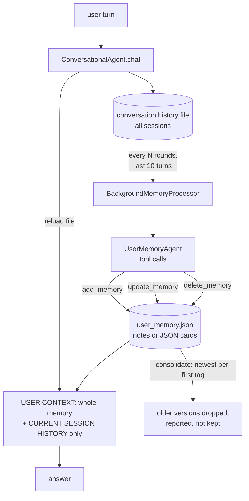

## 1. Executive Summary

This is the companion repository for *AI Agents in Depth* (《深入理解 AI Agent》),
Apache-2.0, 1,752 commits since 9 September 2025, most by the author Bojie Li,
with the book text in fifteen language editions beside ten chapters of runnable
projects.
The atlas reads Chapter 3, "User Memory and Knowledge Bases", where the memory
code lives: `user-memory`, its evaluation framework, and two variants that apply
agentic RAG and contextual retrieval to conversation history.

The memory implementation is deliberately simple and deliberately comparable.
One interface, four representations — plain notes, enhanced notes, JSON cards,
advanced JSON cards — written by a background LLM agent that reads recent turns
and calls `add_memory`, `update_memory` or `delete_memory`, and read by injecting
the whole memory file into the prompt. Nothing here is novel as a mechanism.

What is unusual is the evidence. `chapter3/EXPERIMENT_LEDGER.md` treats the book
text as an acceptance specification and refuses to call an experiment done
without a canonical `validation/latest.json` whose artifact and input hashes can
be checked, raw provider receipts with no credentials, and a `blocked` or
`partial` status whenever a gate was not actually exercised. For the memory
experiments those files are committed:

| Arm (60 cases, external judge) | Pass rate | Mean reward | Hallucination rate |
| --- | --- | --- | --- |
| Notes | 0.800 | 0.803 | 0.033 |
| Enhanced notes | **0.867** | 0.857 | 0.033 |
| JSON cards | 0.850 | 0.829 | 0.067 |
| Advanced JSON cards | 0.817 | 0.816 | 0.033 |
| Fixed-window RAG, plain | 0.783 | 0.775 | 0.083 |
| Contextual RAG | 0.867 | 0.814 | 0.067 |
| Dual layer: contextual RAG + advanced cards | **0.950** | 0.917 | 0.033 |

Two readings follow. Among the memory representations, **the richest structure
did not win**: enhanced notes beat advanced JSON cards by three cases in sixty
while the cards used 1.4 times the tokens of any other mode and averaged 64.9
seconds per call against 32.2 for enhanced notes. And the combination of a retrieval layer over raw
conversation with a structured card layer beat either alone, most sharply on
disambiguation, where the dual layer passed all twenty cases against 0.75 for
contextual retrieval and 0.60 for advanced cards.

The evaluation README's worked example tells a different story. Its table,
computed from a fixture of example responses on eight cases, shows notes at 0.323
and cards at 1.000. The live campaign on sixty cases does not reproduce that gap.

No capability mark. Memory is a per-user file with no status, history, review
surface or retrieval-exclusion test.

## 2. Mental Model

Two actors share one file.

The **conversational agent** answers. Before each turn it reloads the memory file,
renders it with `get_context_string()`, and adds the current session's raw turns
(`conversational_agent.py:163-203`). It never writes memory. Earlier sessions reach
it only through what the processor extracted — raw turns from other sessions are
excluded by design, a fix for a cross-session leak recorded as issue #493.

The **background memory processor** remembers. After `conversation_interval`
rounds (default 1) it hands the last ten turns to a `UserMemoryAgent` whose tools
add, update or delete entries (`background_memory_processor.py:35-43`, `agent.py`
tools at `:336`, `:358`, `:384`). What the model decides is what the file holds.

A memory is present or gone. There is no candidate, no confirmation and no
retraction record. The offline `consolidate_memories` pass
(`memory_manager.py:269-363`) merges notes with identical normalized text and,
among notes sharing a first tag, keeps the most recently updated one and drops
the rest — the docstring calls this "version-based conflict detection", and the
superseded versions are returned in a report and not kept.

## 3. Architecture

`chapter3/` holds twelve experiments; five concern user memory.

| Project | Role |
| --- | --- |
| `user-memory` | The four-mode memory system: `memory_manager.py` (799 lines), `background_memory_processor.py` (649), `agent.py` (969), `conversational_agent.py` (305), `run_evaluation.py` (557) |
| `user-memory-evaluation` | Sixty YAML cases in three layers, a structured rubric, metrics and a comparison mode |
| `agentic-rag-for-user-memory` | Conversation history indexed in fixed windows of eight rounds with two of overlap; a ReAct agent searches up to three times |
| `contextual-retrieval-for-user-memory` | The same with LLM-generated context prefixes per chunk, plus a dual layer with advanced JSON cards |
| `mem0`, `memobase` | Implementations of the same agent on those two frameworks, described as comparators for experiment 3-2 |

Storage is JSON on disk: `Config.MEMORY_STORAGE_DIR`, default `data/memories`,
one `<user_id>_memory.json` per user, saved through a temporary file and
`os.replace` so a crash cannot truncate the only copy.

### Deployment and ergonomics

- **What has to run:** Python 3.12 with the root `ch3` extra (`uv sync --extra ch3`),
  and an API key for one of DashScope, Moonshot/Kimi, SiliconFlow, Doubao or
  OpenRouter.
- **Offline paths exist:** `memory_cli.py` adds, queries, updates, consolidates
  and shows memory without a model; the RAG variants fall back to an in-process
  BM25 index when the external retrieval pipeline on port 4242 is absent.
- **Hand-repairable:** yes — it is a readable JSON file.
- **It is teaching code.** The README's code map tells a reader what to run first,
  where to start, and what to skip on a first pass.

The screen of this checkout found no auto-running configuration, 27 build-time
execution points and 98 unpinned surfaces across the ten chapters' projects, and
two manifests inside the seven-day cooldown, over 250 scanned files. Nothing was
installed or run.

## 4. Essential Implementation Paths

- **Memory interface** — `BaseMemoryManager` (`memory_manager.py:68`) with
  `add_memory`, `update_memory`, `delete_memory`, `get_context_string`,
  `search_memories`; `NotesMemoryManager` (`:120`), `JSONMemoryManager` (`:365`),
  `AdvancedJSONMemoryManager` (`:544`); `create_memory_manager` (`:737`).
- **Advanced card write** — `AdvancedJSONMemoryManager.add_memory` (`:589`) stores
  a card under `category.card_key` and stamps `_metadata` with created and updated
  times and the source session, filling `backstory`, `person` and `relationship`
  when absent.
- **Consolidation** — `NotesMemoryManager.consolidate_memories` (`:269`).
- **Background extraction** — `BackgroundMemoryProcessor.process_recent_conversations`
  (`background_memory_processor.py:364`), `should_process` (`:476`).
- **Read** — `ConversationalAgent._get_memory_context` (`conversational_agent.py:163`).
- **Evaluation** — `run_evaluation.py`: sequential per-session memory updates, a
  fresh answer, and a judge; pass requires no hallucination veto and precision,
  recall and reasoning each at least 3 of 4, and the reward is the mean of four
  scores over 4, zeroed by a hallucination (`:186-188`).
- **Evidence** — `validation/latest.json` and `validation/runs/<id>/{evidence,receipts,manifest}.json`
  in each project.

## 5. Memory Data Model

A **note** is `content`, `tags`, `created_at`, `updated_at` and a source session.
An **advanced JSON card** is arbitrary JSON under a category and key, with a
`_metadata` block and required `backstory`, `person` and `relationship`; the
committed memory states show the writer model adding its own fields such as
`status: "active"` and a `facts` object, which nothing in the manager reads.

The design argument for cards is disambiguation. A layer-2 case gives the user a
Honda Accord with a confirmed service appointment and a Tesla with none, then asks
to "schedule service for my car"; a card keyed by person and relationship can hold
both without collapsing them. The committed results do not show the cards winning
that layer: notes 0.65, enhanced notes 0.80, JSON cards 0.70, advanced cards 0.60.

**Scope** is one file per user id — a physical partition — and the prompt's raw
history is limited to the current session. There is no scope key on a record, so
`scope_enforced` is withheld.

**Time** is record time only. **Provenance** is a session id.

## 6. Retrieval Mechanics

In `user-memory`, retrieval is inclusion: every turn renders the entire memory
into the system context.
A `search_memories` tool exists for the extraction agent.

The RAG variants retrieve instead. `agentic-rag-for-user-memory` chunks each
conversation into windows of eight rounds overlapping by two, indexes them in
BM25 or the external pipeline, and lets a ReAct planner search up to three times
with a top-k of four. `contextual-retrieval-for-user-memory` prepends an
LLM-written context prefix to each chunk, replays the planner's exact queries
against the plain and contextual indexes so the arms differ only in the index,
and adds a dual arm that combines contextual retrieval with advanced cards.

The replay design has a consequence for the evidence. Experiment 3-9's sixty
results are identical — the same search queries and the same judged answers — to
the plain arm of experiment 3-11 in the run captured the same second. Its row in
the table above is the control arm of 3-11, not an independent run.

## 7. Write Mechanics

Writes are an LLM agent's tool calls, run after every conversation round by
default, on the last ten turns, at temperature 0.3. In the interactive loop the
processor can run in a background thread; in the evaluation it runs after each
session, and the campaign asserts that later calls see only the memory state, not
prior raw history (`sequential_memory_only: true`).

The cost is visible in the receipts. Across 60 cases the four modes made about
260 calls each; advanced JSON cards used 1.55 million tokens against 0.99 to 1.13
million for the others, and the per-call latency is dominated by the writer model
(`doubao-seed-1-6-250615` through Volcano Engine Ark).

Conflict handling is the model's judgement at write time and the tag rule at
consolidation. A superseded fact is deleted; nothing prevents the extractor from
writing it again from a later mention.

## 8. Agent Integration

There is no integration surface in the sense this atlas usually means: no MCP
server, no framework adapter. The agent and the memory are in one process,
driven by `main.py` in `interactive`, `demo` or `evaluation` mode, or by
`memory_cli.py`. The `mem0` and `memobase` directories rebuild the agent on those
frameworks for comparison; no validation evidence is committed for either, and
the ledger's 3-2 row names only `user-memory`.

## 9. Reliability, Safety, and Trust

**The evidence discipline is the reliability story.** Each campaign records the
git revision, platform, which provider credentials were present (as booleans),
the exact writer, answerer and judge models and endpoints, a seed, token counts,
per-call latency and every raw request and response, and hashes the lot into a
manifest. The judge (`moonshot-v1-32k`) is a different provider from the writer,
and a hallucination vetoes a pass regardless of the other scores.

**What the evidence cannot tell you.** Every arm ran once with one seed and one
judge. The largest difference among the four memory modes is three cases in
sixty; nothing here distinguishes that from noise, and the book's ranking of
representations should not be read out of it.

**Safety.** Memory extraction sees raw conversation, including account numbers
and policy numbers in the synthetic cases. Experiment 3-3 builds a PII sanitizer
with a local model, but the memory path does not use it.

No trust state, tombstone, audit history, review surface or validity time.

## 10. Tests, Evals, and Benchmarks

**Evaluation.** Sixty synthetic cases in three layers of twenty — basic recall,
contextual reasoning and disambiguation, cross-session synthesis and proactive
assistance — each with multi-session customer-service transcripts, a fresh
question, written evaluation criteria and an expected behaviour. Results are in
section 1 and the committed evidence files.

**The README table and the campaign disagree.** `user-memory-evaluation/README.md`
shows a keyword-recall comparison computed from
`fixtures/system_responses.example.json` over eight annotated cases: full context
and JSON cards at 1.000, simple notes at 0.323. The sentence under it concludes
that notes "drop on L2/L3" while cards hold. On the live sixty-case campaign notes
score 0.65 and 0.85 on layers 2 and 3 and advanced cards 0.60 and 0.95.

**Unit tests.** 69 `test_*.py` files across Chapter 3. In `user-memory` they are
regression tests for specific fixes — consolidation keeping the earliest
`created_at`, zero limits, empty streaming choices, bare filenames.
`test_session_scoped_history.py` asserts that a detail from an earlier session's
raw turns is absent from the prompt while the current session's turns and the
memory context are present. That is a test of the assembled context window
rather than of retrieval from the memory store, so `negative_eval` is withheld.

**Benchmarks.** `locomo_benchmark.py` exists in `user-memory` and `memobase`; no
LoCoMo result is committed.

## 11. For Your Own Build

### Steal

- **Treat the spec as an acceptance gate and commit receipts.** A ledger row per
  experiment, a manifest of hashes, raw credential-free calls, and a status that
  must say `blocked` or `partial` when a gate was not exercised is a standard any
  memory project could adopt.
- **Replay identical queries across retrieval arms.** Holding the planner's
  queries fixed isolates the index as the only variable.
- **Separate the answering agent from the remembering agent.** The reader never
  writes, so a bad extraction is a background problem rather than a turn-level one.
- **Keep other sessions' raw turns out of the prompt** and let them arrive only
  through extracted memory.
- **Veto a pass on hallucination** instead of averaging it away.

### Avoid

- **Illustrating a comparison with a fixture that disagrees with your own live
  numbers.** Readers remember the table.
- **Calling newest-wins deletion "versioning".** Keep the superseded value or
  name the operation for what it does.
- **Reading a ranking into single-seed differences of a few cases.**

### Fit

This suits a reader learning how to build and, more usefully, how to *measure* a
user-memory system: the four modes are small enough to read in an afternoon, and
the evidence shows how to make a comparison checkable. It is not a memory library
to adopt — a JSON file per user, whole-file injection and model-decided writes do
not scale past the conversation lengths the cases use. Take the evaluation
discipline and the dual-layer result; build the store elsewhere.

## 12. Open Questions

- **Would the ranking of the four modes survive more seeds or a second judge?**
- **Why does the dual layer lift disambiguation to 1.0 when cards alone score
  0.60 there?** Per-case receipts are committed and would answer it.
- **Do the `mem0` and `memobase` comparators have results anywhere?**
- **What does Chapter 10's `generative-agents` campaign measure about memory?** It
  was not read for this report.

## Appendix: File Index

**Memory**

- `chapter3/user-memory/memory_manager.py`, `background_memory_processor.py`, `agent.py`, `conversational_agent.py`, `conversation_history.py`, `config.py`, `memory_cli.py`

**Evaluation and evidence**

- `chapter3/EXPERIMENT_LEDGER.md`
- `chapter3/user-memory/run_evaluation.py`, `validation/latest.json`, `validation/runs/20260730T043652Z-3_1_and_3_2-16200e94/`
- `chapter3/user-memory-evaluation/` — `test_cases/layer{1,2,3}/`, `README.md`, `fixtures/`
- `chapter3/agentic-rag-for-user-memory/validation/runs/20260729T214519Z-3_9-1bbf4623/`
- `chapter3/contextual-retrieval-for-user-memory/validation/runs/20260729T214519Z-3_11-9b99feb4/`

**Retrieval variants**

- `chapter3/agentic-rag-for-user-memory/indexer.py`, `agent.py`, `campaign.py`
- `chapter3/contextual-retrieval-for-user-memory/contextual_chunking.py`, `contextual_agent.py`, `campaign.py`

**Tests**

- `chapter3/user-memory/test_session_scoped_history.py`, `test_consolidate_created_at.py`

**Checks behind the claims**

- Arm identity: compare `results[i].agent_search_queries` and `results[i].arms.plain` between the 3-9 and 3-11 `evidence.json` files — identical in every one of the sixty cases.
- `ls chapter3/mem0/validation chapter3/memobase/validation` — neither exists.

## History

**2026-09-15** — [`cf7f7a8e16b234ac303034e4ec8f75bf2d61ac2c`](https://github.com/bojieli/ai-agent-book/commit/cf7f7a8e16b234ac303034e4ec8f75bf2d61ac2c) — first reading, at a commit dated 15 September 2026, scoped to the Chapter 3 user-memory projects. Screened before opening: no auto-running configuration, 27 build-time execution points, 98 unpinned surfaces and two manifests inside the cooldown across the whole repository. Nothing was installed or run; every number above was read from the committed evidence files.
