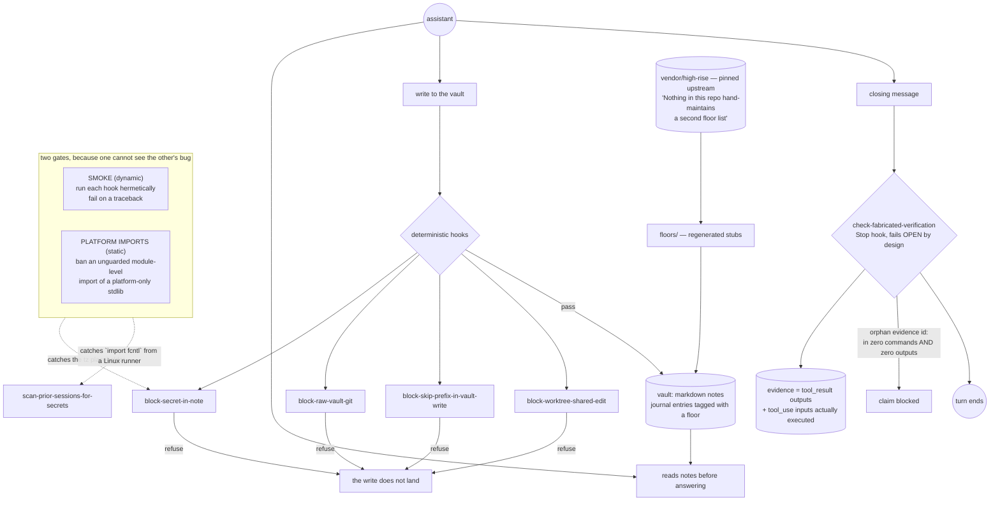

## 1. Executive Summary

AI Brain Starter is a harness rather than a store. Memory is Markdown notes on
disk that an assistant reads before answering; what the repository supplies is
the machinery around them — deterministic hooks that block a bad write before it
lands, a session-end ritual that files what mattered, and a vendored emotional
taxonomy the journal tags entries with. MIT, Python, 1,050 files, twenty human
contributors.

**One mark: `negative_eval`**, and the suite behind it is the reason to read
this page.

The finding that matters is one the project made about itself.
`hooks/test_hook_smoke.py` opens:

> Every hook must actually RUN. Nothing asserted that, and two never did.
>
> A hook that raises at module import is the maximally silent failure. There is
> no partial run, no half-written file, no wrong answer — the hook is simply not
> there, while the install continues to report it as present.

The two it found had been dead for their entire lives. One carried
`ZoneInfo("America/user-local-tz")` — an unsubstituted template placeholder,
crashing on every platform. The other was **the secret scanner**: `import fcntl`
at module scope, POSIX-only, so it crashed at import on every Windows install,
*"and the file's own docstring says it supports Windows."*

For an atlas that spends its time asking whether a declared mechanism has a
producer, this is the same question asked from the inside, and answered with a
gate.

## 2. Mental Model

Notes are the memory. Hooks are the immune system. A write to the vault passes
a set of deterministic checks — no secret in a note, no raw git in the vault, no
skip-prefix, no shared-worktree edit — and the session ends with a ritual that
files what happened.

Nothing here scores, ranks or supersedes a memory. The bet is that memory
compounds if you stop bad material entering it, rather than by grading material
after it has.

## 3. Architecture

## 4. Essential Implementation Paths

**The two gates, and why there must be two** — `hooks/test_hook_smoke.py:22-29`.
The dynamic gate runs each hook hermetically and fails on a traceback. The
static gate bans an unguarded module-level import of a platform-only stdlib
module, and the header explains the necessity precisely: *"CI runs Linux, so the
smoke pass CANNOT see a Windows-only import crash; `import fcntl` is invisible
to it and sailed through every green build. The static half is what makes the
Windows class visible from a Linux runner, and vice versa."*

The same header is careful about what these gates do *not* do: *"Neither gate
asserts behaviour — that belongs in each hook's own suite. These two only assert
that the hook EXISTS as a running program."*

**The fabrication check** — `hooks/check-fabricated-verification.py:1-13`. A
Stop hook that blocks a closing message asserting *"a state it never confirmed
with a tool call."* Its evidence is defined by exclusion: *"NON-assistant
transcript records (tool_result outputs) + the commands actually executed
(tool_use inputs). **The model cannot self-verify from its own prose.**"*

Detector A is the sharp one — an orphan evidence id: a commit-SHA- or
run-ID-shaped token, in backticks, in a verification context, appearing in
*"ZERO executed commands AND ZERO tool outputs this session."*

Each detector *"fails OPEN (a guard that crash-blocks Stop is worse than the bug
it catches)"* — the trade named at the point it is made.

**The vendored vocabulary** — `floors.md`. The 34-floor taxonomy is consumed
from an upstream project, pinned under `vendor/high-rise/`, and the document is
explicit that this repository *"**consumes** the framework as a downstream
dependency. It does not keep its own copy of the list."* Changing it means
changing it upstream, cutting a release, and running a sync script:
*"Nothing in this repo hand-maintains a second floor list."*

## 5. Memory Data Model

Markdown. A journal entry carries a `floor:` frontmatter field naming the state
the writer was in, and wikilinks like `[[Fear]]` resolve to generated stub notes
under `floors/`, each with elevator edges and a shadow-twin link. There is no
status, no confidence, no validity window and no supersession — the word
`tombstone` does not appear in the Python at all.

## 6. Retrieval Mechanics

The assistant reads the notes. There is no index of the atlas's usual kind here;
retrieval is the agent's own file reading, shaped by the session-start context
the hooks assemble.

## 7. Write Mechanics

A write passes the block hooks or it does not happen. That is the whole write
policy, and it is a deliberate one: the project's bet is on admission rather
than on grading.

## 8. Agent Integration

Hooks, slash commands, skills, git hooks, bootstrap scripts for two shells, a
health MCP service and a memory API service, plus Spanish-language
documentation (`para-equipos` beside `for-teams`).

## 9. Reliability, Safety, and Trust

**`negative_eval`** — section 10.

**`audit_log` is withheld.** `audit` appears in sixty-seven files, and what it
names is coverage reporting — `scripts/graphify_coverage_audit.py` produces a
report rather than appending a ledger. No append-only record of memory mutations
exists.

**`tombstone`, `trust_state`, `bitemporal`, `scope_enforced` and `human_review`
are withheld**, and together rather than individually: this harness holds no
memory object with fields to carry them. A note has a floor and a body. The
guarantees are about what may enter the vault, not about what a memory is once
it is there.

**Three auto-run surfaces**, which is what a hook harness is: hooks, git hooks
and bootstrap scripts for two shells. Nothing was installed or run for this
reading, which for this repository means the guards are read rather than
exercised — the same limitation the project's own smoke gate exists to close.

## 10. Tests, Evals, and Benchmarks

Thirty-eight test files inside `hooks/` alone, beside a `tests/` tree with
fixtures, an integration directory and an `eval/` directory. Nothing was
installed and nothing was run.

The mark rests on what the per-hook suites assert. Three names carry the
pattern this atlas keeps asking for:

- `test_secret_patterns_anthropic.py` and `test_secret_patterns_nvidia.py`
  beside **`test_secret_patterns_fp_filter.py`** — coverage for what must be
  caught, and a separate file for what must *not* be flagged. A secret detector
  tested only on true positives is a detector nobody will keep enabled.
- `test_close_catchall_not_silent.py` — a catch-all must not swallow its error,
  which is the failure mode that produced both dead hooks.
- `test_bypass_reachability_watchdog.py` — a bypass must remain reachable, so
  the escape hatch is asserted to exist rather than assumed.

And `test_check_fabricated_verification.py` covers the Stop hook above.

The smoke file's closing line about its own history is the one worth carrying
out of this report: *"the assertion below now enforces what the comment only
asserted."*

No benchmark and no paper.

## 11. For Your Own Build

### Steal

- **Assert that your guard runs at all.** Behaviour tests assume the module
  imports. Two hooks here were absent for their whole lives while the installer
  reported them present, and the cheapest possible assertion — run it, check the
  exit code — was the one nobody was making.
- **Pair a dynamic gate with a static one.** A Linux CI run cannot see a
  Windows-only import crash. Banning unguarded platform-only imports at the AST
  level is what makes the other platform's failure visible from this one.
- **Test the false positives separately from the true ones.** A file named for
  the FP filter is a commitment that the detector stays usable.
- **Define evidence by exclusion.** *"NON-assistant transcript records"* plus
  the commands actually executed is a definition a model cannot satisfy by
  writing more prose.
- **Name the fail-open trade where you make it.** *"a guard that crash-blocks
  Stop is worse than the bug it catches"* is the sentence that stops someone
  tightening it later without thinking.
- **Consume a vocabulary, don't copy it.** *"Nothing in this repo hand-maintains
  a second floor list."*

### Avoid

- **Trusting an installer's report that a hook is present.** Presence on disk
  and presence in the run are different facts.

### Fit

Take the hook harness if an agent writes into a store you care about and you
want admission control rather than after-the-fact grading. Take
`hooks/test_hook_smoke.py` and `check-fabricated-verification.py` regardless of
what else you use; both are about two hundred lines and neither depends on the
rest of the project.

## 12. Open Questions

- Both dead hooks were found by adding a gate. Is the gate wired into CI on
  every platform the project claims to install on, or only on Linux?
- The fabrication check fails open by design. Is there a record of how often it
  would have blocked, so the trade can be revisited with evidence?
- A note has a floor and a body and no status. Is correcting a journal entry
  meant to be an edit, and does anything notice the edit?
- Sixty-seven files mention audit and none appends a ledger. Is a mutation
  record intended, given how much of this project is about what entered the
  vault?

## Appendix: File Index

| Path | What it holds |
| --- | --- |
| `hooks/test_hook_smoke.py` | the two gates, the two dead hooks, and why one gate cannot see the other's bug |
| `hooks/check-fabricated-verification.py` | the Stop hook blocking unverified closing claims, and its definition of evidence |
| `hooks/block-secret-in-note.py` | the write refusal closest to the memory itself |
| `hooks/test_secret_patterns_fp_filter.py` | the false-positive half of the detector's coverage |
| `hooks/test_bypass_reachability_watchdog.py` | the assertion that the escape hatch still exists |
| `floors.md`, `vendor/high-rise/` | the vendored taxonomy and the refusal to keep a second copy |
| `scripts/graphify_coverage_audit.py` | what "audit" means here — a report, not a ledger |

## Appendix: Recorded Searches

Run from the root of the checkout at the pinned commit.

| Claim | Command | Result at this pin |
| --- | --- | --- |
| Two hooks were dead on arrival | read `hooks/test_hook_smoke.py:11-20` | `auto-capture-public-ships.py` on an unsubstituted `America/user-local-tz` placeholder, and `scan-prior-sessions-for-secrets.py` on a module-scope `import fcntl` |
| The static gate exists because the dynamic one cannot see the class | read `hooks/test_hook_smoke.py:22-29` | *"`import fcntl` is invisible to it and sailed through every green build"* |
| No append-only mutation record exists | `grep -rn "append\|jsonl" --include='*.py' hooks/_lib scripts \| grep -iE "audit\|ledger\|log_"` | Only `graphify_coverage_audit.py`, which builds a report |
| No epistemic vocabulary in the Python | `grep -rl "tombstone" --include='*.py' .` | Nothing |
| The false-positive filter is tested separately | `ls hooks \| grep secret_patterns` | `test_secret_patterns_anthropic.py`, `test_secret_patterns_nvidia.py`, `test_secret_patterns_fp_filter.py` |
| The floor list is not duplicated here | read `floors.md` | *"It does not keep its own copy of the list"*; the canonical table is pinned under `vendor/high-rise/` |
| The licence carries no rider | `head -3 LICENSE`; `grep -n -i 'anthropic\|may not' LICENSE` | Stock MIT; the only Anthropic mentions in the tree are secret-pattern names |

## History

**2026-09-20** — [`f22c46e4b061349a06bc23df0658fb2455b6c14f`](https://github.com/mycelium-hq/ai-brain-starter/commit/f22c46e4b061349a06bc23df0658fb2455b6c14f) — first reading, at 1,050 files. Screened before reading: three auto-run surfaces — hooks, git hooks and bootstrap scripts for two shells — four unpinned surfaces and nothing inside the cooldown; nothing was installed and nothing was run, which for a hook harness means the guards were read rather than exercised. MIT. One mark, `negative_eval`. The rest are withheld together: this is admission control around Markdown notes, and a note carries a floor and a body rather than a status, a scope or a clock. The material worth the page is the project's own account of two hooks that had never run, and the two-gate design added because a dynamic run on one platform cannot see another platform's import crash.
