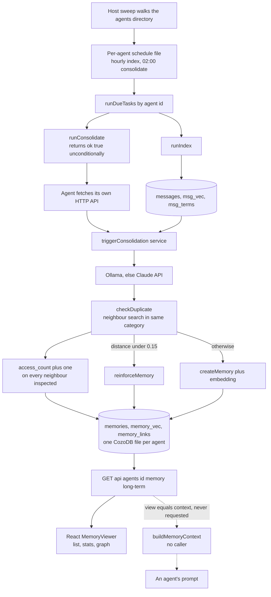

## 1. Executive Summary

AI Maestro is an MIT-licensed multi-agent orchestrator — a Next.js desktop
application, 133,039 lines of TypeScript across 526 files, 1,103 commits since
October 2025 — that runs a fleet of coding agents on one host and gives each of
them a database. `lib/memory/` is 2,238 lines of long-term memory over the
CozoDB schema in `lib/cozo-schema-memory.ts`, and it is a complete biological-tier
design: raw conversation messages are short-term memory, a nightly LLM pass
distils them into categorised long-term memories, near-duplicates reinforce
rather than multiply, and memories that have been reinforced enough times and
lived long enough are promoted from `warm` to `long`.

One mark is earned. `scope_enforced` holds because `agent_id` is stored on every
row and bound as a predicate on every long-term read — though the separation that
does the work is that each agent gets its own file, and the column is a second
copy of that boundary rather than the boundary itself.

**The pass that writes these memories runs every night at two. The function that
would put them in front of an agent has no caller.** `buildMemoryContext`
(`lib/memory/search.ts:297-358`) does exactly what the name says: it searches the
memories for a query, adds the top preferences and patterns, and returns a
markdown block for an LLM prompt. Its only invocation in the repository is the
`view === 'context'` branch of the long-term memory endpoint
(`services/agents-memory-service.ts:682-688`), and a search of the tree for a
caller that requests that view returns the branch itself and nothing else. The
React viewer asks for `limit=100`, `view=stats` and `view=graph`; nothing asks
for `view=context`, and no prompt-assembly path imports the function. The write
side is wired end to end and automatic; the read side terminates in a viewer.

That asymmetry is the frame for the rest of the reading, because the defects
below are all on paths that no consumer currently exercises — which is precisely
why they are still there.

## 2. Mental Model

An agent here is a directory. `AgentDatabase`'s constructor builds
`~/.aimaestro/agents/<agentId>/agent.db` and creates the directory if it is
missing (`lib/cozo-db.ts:27-38`); initialisation then auto-migrates four schemas
into it — metadata, RAG, memory, and a fifth-phase tracking schema. Everything an
agent remembers is in that one SQLite file, and nothing in the memory code opens
two of them at once.

Memory is two-tier by relation rather than by column. Short-term is `messages`,
`msg_vec` and `msg_terms` — raw conversation text, its embeddings, its term
scores. Long-term is `memories` and `memory_vec`, populated only by the
consolidation pass. The bridge between them is `consolidated_conversations`, a
marker keyed on the conversation file that stops a conversation being extracted
twice.

The schema header states the lineage plainly: HOT/WARM/COLD tiers from
Claude-Cognitive, System 1/2 separation from Cipher, graph relationships from
Cognee (`lib/cozo-schema-memory.ts:9-12`). Two of the three arrived. The System
1/2 split is real and load-bearing — `MemorySystem = 1 | 2` with `fact`,
`decision` and `preference` on one side and `pattern`, `insight` and `reasoning`
on the other. The graph is real: `memory_links` carries a typed relationship and
`getRelatedMemories` traverses it recursively. The tiers are the one that shrank.
`MemoryTier = 'warm' | 'long'` (`:29`) has two values, not three, and the word
HOT appears exactly once in `lib/`, in that header comment.

## 3. Architecture



## 4. Essential Implementation Paths

- **Schedule.** `defaultSchedule` seeds every agent with two tasks: `memory-index`
  every hour and `memory-consolidate` at 02:00, both enabled
  (`lib/agent-schedule.ts:92-101`).
- **Sweep.** `sweepAgentMemory` lists `~/.aimaestro/agents`, filters to
  directories that have a database, and calls `runDueTasks(agentId)` for each —
  deliberately without hydrating an `Agent` object, because those live in a
  ten-slot LRU (`lib/memory/sweep.ts`, and the test file's header records the
  measurement that forced it: eight of 125 databases written in seven days).
- **Consolidate.** `runConsolidate` resolves the agent, takes its subconscious and
  calls `triggerConsolidation`, which issues an HTTP POST from the process to its
  own API (`lib/agent.ts:318-363`). The service prepares conversations and calls
  `consolidateMemories` (`services/agents-memory-service.ts:547`).
- **Extract.** A provider is chosen by preference with `auto` trying Ollama first
  and falling back to the Claude API (`lib/memory/consolidate.ts:44-77`). Each
  extracted memory is embedded, checked against its nearest neighbours in the
  same category, and either reinforces one or becomes a row
  (`consolidate.ts:84-122`, `:253-262`).
- **Read.** `searchMemoriesByEmbedding` runs an HNSW query over `memory_vec` with
  `k` at twice the limit, joins `*memories`, binds `agent_id`, applies a
  confidence floor and the optional category and tier filters
  (`lib/cozo-schema-memory.ts:344-356`).

## 5. Memory Data Model

`memories` is keyed on `memory_id` alone; everything else, `agent_id` included,
is a value column (`lib/cozo-schema-memory.ts:88-108`):

| Field | Note |
|---|---|
| `agent_id` | the scope predicate — a value column, so the filter is a scan, not a key prefix |
| `tier` | `warm` or `long`; `long` is set by promotion, never at creation |
| `system` | 1 for knowledge, 2 for reasoning, derived from the category |
| `category` | `fact`, `decision`, `preference`, `pattern`, `insight`, `reasoning` |
| `content`, `context` | the extracted sentence and its free-text surroundings |
| `source_conversations`, `source_message_ids` | provenance, stored as strings |
| `confidence` | a float from the extracting model |
| `created_at`, `last_reinforced_at`, `promoted_at`, `last_accessed_at` | four record-axis timestamps and no validity axis |
| `reinforcement_count`, `access_count` | the two counters that decide promotion and rank |

There is no status column. Nothing on the row says a memory was rejected,
retracted, superseded or reviewed; `status` exists in this schema only on
`consolidation_runs`, where it describes a job. That is the reason `trust_state`
is withheld: `confidence` is a continuous score the ranking uses, not a discrete
stored state that withholds a row from a read, and `tier` — the only stored
discrete value that does filter the read path — is a lifecycle position computed
from reinforcement count and age, not a statement about whether the memory is
believed.

## 6. Retrieval Mechanics

The semantic path is a single Datalog rule: an HNSW probe over `memory_vec`
binding a distance, joined to `*memories`, then `agent_id` equality, then
`confidence >= minConfidence`, then optional category membership and tier
equality, ordered by distance and limited
(`lib/cozo-schema-memory.ts:344-356`). The probe asks for `k = limit * 2`
candidates before any of those filters apply, so a tightly filtered query can
come back short of its limit while matching rows exist — the usual cost of
filtering after an approximate-nearest-neighbour probe rather than inside it.

Two details in that rule are worth stating exactly.

**The confidence floor cannot be turned off.** `const minConfidence =
options.minConfidence || 0.5` (`:330`). The long-term endpoint documents
`minConfidence` with a default of 0 and passes exactly that:
`parseFloat(searchParams.get('minConfidence') || '0')`
(`app/api/agents/[id]/memory/long-term/route.ts:19`, `:37`). Zero is falsy, so the
documented "no threshold" request applies a 0.5 floor, and any memory the
extracting model scored below 0.5 is unreachable through the query path. It is
still visible in the unfiltered list view, which is why the discrepancy is easy
to miss: the viewer's default listing shows a memory that its own search will not
return.

**The graph expansion drops the scope predicate.** `getRelatedMemories` walks
`memory_links` recursively and resolves each hit with `*memories{memory_id,
content}` — no `agent_id` clause (`:450`). Inside a per-agent database that
excludes nothing, since every row belongs to the same agent. It matters as a
shape rather than as a leak today: `includeRelatedByDefault` is `true`
(`lib/memory/types.ts`), so the default search path is the one that lost the
predicate, and the day these files are merged or a shared store is introduced,
that is the path that will not notice.

The graph *view* in the service keeps the predicate on both ends, scoping the
link query through `*memories{memory_id: from_memory_id, agent_id}` before
returning nodes and links (`services/agents-memory-service.ts:655-662`).

## 7. Write Mechanics

One function writes the `memories` relation: `createMemory`, called once, from
`consolidate.ts:253-262`, with `agent_id` set to the agent whose database was
opened. A single writer is worth saying plainly, because it is what makes the
scope claim checkable at all — there is no second path that could stamp a row
with a different agent.

Before that call, `checkDuplicate` embeds the candidate and searches its own
store for near neighbours in the same category, treating a distance under 0.15 as
a duplicate and reinforcing the match instead of creating a row
(`consolidate.ts:84-122`).

It performs that search through `searchMemoriesByEmbedding`, which — as its last
act before returning — issues one `:update memories` per returned row,
incrementing `access_count` and setting `last_accessed_at`
(`lib/cozo-schema-memory.ts:360-371`). So the nightly write pass marks up to five
existing memories as *accessed* for every candidate it considers, whether or not
anything read them. `access_count` is reported in the stats rollup and shown in
the viewer as a measure of how often a memory has been used. On a store whose
only reader is a human opening a panel, the dominant contributor to that number
is the consolidator checking whether it was about to write the same thing again.

Promotion is the other write, and it exists twice. `promoteMemory` in the schema
module sets `tier: 'long'` and `promoted_at` for one id
(`lib/cozo-schema-memory.ts:668-682`); `promoteMemories` in the consolidation
module scans for eligible rows and then issues the identical `:update memories`
inline in its own loop rather than calling it (`consolidate.ts:397-414`). Both
are exported from `lib/memory/index.ts`. Two copies of one rule, and the copy
that runs is the inline one — the pattern this atlas has [collected
elsewhere][second-copy], arriving here in its mildest form: today the copies
agree.

## 8. Agent Integration

The HTTP surface is per-agent and complete: GET for status and history, POST to
trigger consolidation, PATCH to promote or prune, and a separate long-term route
with GET, DELETE and PATCH for querying, deleting and editing individual
memories. `components/MemoryViewer.tsx` drives all of it.

What is absent is the loop back into an agent's own context. The application
knows how to wake an agent with a prompt — `runPrompt` sends scheduled
instructions through the same wake chain as any other message, with a comment
explaining that a schedule firing into the void would be worse than no schedule
(`lib/agent-schedule-runner.ts:56-67`). No equivalent exists for memory. An
agent's consolidated facts, preferences and patterns are assembled on demand only
if an HTTP caller asks for a view that nothing asks for.

## 9. Reliability, Safety, and Trust

**A scheduled consolidation cannot report failure.** The chain is traceable end
to end. `runConsolidation` catches its own errors and records them on
`lastConsolidationResult` — `{ success: false, error: 'HTTP 500' }` on a bad
response, an error object on a throw — and returns normally either way
(`lib/agent.ts:325-359`). `triggerConsolidation` returns that object
(`:368-371`). And `runConsolidate` ends `return { ok: true, detail:
JSON.stringify(result ?? {}).slice(0, 200) }` (`lib/agent-schedule-runner.ts:53`)
— `ok: true`, unconditionally, with the failure serialised into a 200-character
string in the detail field.

The sharp part is that the repository already knows this failure. `tests/memory-sweep.test.ts:70-92`
is a committed case named for it — *counts a returned `{success:false}` as
failed, not indexed* — whose comment records the consequence: `runIndexDelta`
reports failure by returning rather than throwing, and catching only exceptions
made a host with a misconfigured embedding provider report "17 indexed, 0 failed,
0 messages" for months. The lesson was applied to the `index` branch and the
`consolidate` branch beside it still returns a literal.

**Two documented zero-valued switches are swallowed by falsy defaults.** The
confidence floor is one (section 6). The other deletes.
`pruneShortTermMemory` opens with `const retentionDays = options.retentionDays ||
DEFAULT_MEMORY_SETTINGS.retention.shortTermDays`, and the very next statement is
`if (retentionDays === 0) { console.log('Pruning disabled (retentionDays = 0)') ;
return { pruned: 0 } }` (`consolidate.ts:433-438`). The default is 30
(`types.ts`), so the guard can never fire from a caller: `0 || 30` is 30. The
PATCH route passes `body.retentionDays` straight through
(`app/api/agents/[id]/memory/consolidate/route.ts:67`), which makes
`{"action":"prune","retentionDays":0}` — the documented way to ask for no pruning
— a request that hard-deletes every message older than thirty days in
consolidated conversations. The off switch is the delete switch.

**Deletion is unconditional.** `dedupe.ts` removes duplicate message rows and
their dependents by key, dependents first so a half-finished run leaves
recoverable orphans rather than invisible garbage — a careful ordering, and the
module header records the measured sizes that motivated it (1.8 GB at 6.8×
duplication, 3.1 GB at 9.5×). Nothing keyed on what was removed is retained, and
no write path consults a record of a previously rejected value, which is why
`tombstone` is withheld. `consolidated_conversations` is the nearest thing, and
it is an idempotency marker keyed on the conversation file — a record that work
was done on a resource, not that a value was refused.

**Every query is assembled by string interpolation.** `escapeForCozo` handles
backslashes, single quotes, newlines, carriage returns and tabs, in that order,
and is used consistently for the string values in this subsystem. Numbers are not
escaped, but the routes parse them with `parseInt`/`parseFloat` before they
arrive. One edge: `escapeForCozo` returns the bare token `null` for any falsy
input, so an empty string becomes a null literal rather than an empty quoted
string — in the scope predicate that fails closed, matching nothing.

**`cozo-node` is a floating range.** `"cozo-node": "^0.7.6"` — the storage engine
under every agent's memory arrives from whatever the caret resolves to at install
time.

## 10. Tests, Evals, and Benchmarks

56 test files, 9,771 lines, run by `vitest run`. Exactly one covers this
subsystem: `tests/memory-sweep.test.ts`, eight cases over `lib/memory/sweep.ts`.
They are good tests — each one is named for the property it protects rather than
the function it calls, and three of them carry a comment recording the production
failure that produced them. They assert that the sweep indexes all 125 agents
rather than the ten a registry could hold, that it works from an agent id without
hydrating an object, that a returned `{success:false}` counts as failed, that one
corrupt database does not strand the others, and that `limit`, `only` and
`minAgeMs` are honoured.

Nothing tests the consolidation, the deduplication threshold, the promotion rule,
the prune window, the scope predicate or the search. There is no retrieval
assertion of any kind over `memories`, positive or negative, so `negative_eval`
is withheld — not on a vacuous exclusion, but on the absence of any committed
case that reads the relation back.

No benchmark, no eval harness, no measured retrieval quality. The numbers the
repository does record are operational and honest about their provenance: the
duplication factors in the dedupe header, the eight-of-125 measurement in the
sweep test header.

## 11. For Your Own Build

- **A memory that nothing reads back is a write-amplification feature.** The
  expensive half of this design — nightly LLM extraction, embedding, near-neighbour
  deduplication — is built, scheduled and running. Wire the cheap half first: a
  system that injects memories with no consolidation beats one that consolidates
  with no injection, and it tells you immediately whether the memories are worth
  extracting.
- **`x || default` is wrong for any option whose zero means something.** Both
  defects in section 9 are that one operator. `??` costs one character and turns
  "disable pruning" back into disabling pruning.
- **A maintenance task that returns a literal reports nothing.** If a runner
  wraps work that signals failure by returning, the wrapper has to read the
  return value. This repository proved that in a test and then shipped the
  sibling branch without it — which is the general case, not a lapse: the fix
  goes where the incident was, and the identical code beside it is not part of
  the incident.
- **Do not let a write-path lookup touch read statistics.** Reusing the search
  function for deduplication was the obvious economy and it corrupted
  `access_count`, the one signal that would tell you which memories matter. Give
  the write path a search that does not record an access.
- **One store per tenant is a real boundary; the column beside it is a
  convention.** Per-agent database files make cross-agent leakage impossible by
  construction, which is stronger than any predicate. But then the predicate
  stops being tested by anything, and a path that drops it — as the graph
  expansion here has — is invisible until the day the stores merge.

## 12. Open Questions

- Was `view=context` ever called from a client that has since been removed, or
  has the read-back path never been connected? The git history would answer it;
  this reading is at one pin.
- The header cites HOT/WARM/COLD and the type has two values. Was a third tier
  removed, or did the lineage note outrun the implementation?
- `related_memories` is a column on `memories` *and* `memory_links` is a
  relation. Only the relation is written. What was the column for?

## Appendix: File Index

- Schema and queries: `lib/cozo-schema-memory.ts` — the `memories` relation
  (88-108), `createMemory` (180-223), the semantic search (310-384) with its
  confidence floor (330) and access bump (360-371), the by-category read
  (389-421), `getRelatedMemories` (425-461) with the unscoped join at 450, the
  stats rollup (607-663), `promoteMemory` (668-682).
- Consolidation: `lib/memory/consolidate.ts` — provider selection (44-77),
  `checkDuplicate` (84-122), the single `createMemory` call (253-262),
  `promoteMemories` (370-423), `pruneShortTermMemory` (425-464).
- Search and context: `lib/memory/search.ts` — `searchMemories` (35-82), the
  recent-memories read (229-258), `buildMemoryContext` (297-358).
- Dedupe: `lib/memory/dedupe.ts`, whole file, header included.
- Sweep: `lib/memory/sweep.ts`, `tests/memory-sweep.test.ts`.
- Scheduling: `lib/agent-schedule.ts:90-101`, `lib/agent-schedule-runner.ts:45-54`
  (`runConsolidate`) and `:56-67` (`runPrompt`, for contrast).
- Agent side: `lib/cozo-db.ts:22-72`, `lib/agent.ts:318-371`.
- Service and routes: `services/agents-memory-service.ts:608-720`,
  `app/api/agents/[id]/memory/consolidate/route.ts`,
  `app/api/agents/[id]/memory/long-term/route.ts`, `app/api/memory/sweep/route.ts`.
- Escaping: `lib/cozo-utils.ts`.
- Plan document: `docs/LONG-TERM-MEMORY.md`.

**Searches recorded for the negative claims**

```sh
grep -rn "buildMemoryContext" --include='*.ts' --include='*.tsx' . | grep -v node_modules   # 3: definition, re-export, one caller
grep -rn "view=context\|view: 'context'\|'context'" app components lib/memory services | grep -i view   # 1 hit, the branch itself
grep -rn "createMemory(" lib app services            # 2: the definition and one call site
grep -rn "'hot'\|'cold'\|HOT\|COLD" lib              # 1 hit, the lineage comment
grep -rn "status" lib/cozo-schema-memory.ts | grep -v consolidation_runs   # 0 on the memories relation
ls tests | grep -i "memor\|consolidat\|dedupe\|cozo"  # 1 file
```

## History

**2026-09-17** — [`e68294a42824a08e761c338b1ce77d0d44e4fbed`](https://github.com/23blocks-OS/ai-maestro/commit/e68294a42824a08e761c338b1ce77d0d44e4fbed)
— first reading, at the head of `main`, 1,103 commits and eleven months in.
Screened with `scripts/screen_repo.py` first: two auto-run surfaces both verified
benign — `.gitmodules` points at an uninitialised plugins submodule, and `hooks/`
is React hooks in TypeScript rather than git hooks — one manifest inside the
seven-day cooldown, one build-time execution path, two floating dependency
surfaces, and `CLAUDE.md` read as data. Nothing was installed, built or run: no
npm, no vitest, no database opened. One mark. `trust_state` is withheld because
the `memories` relation has no status column and the only stored discrete value
that filters a read — `tier` — is a lifecycle position computed from a counter
and an age. `tombstone` is withheld because both deletion paths are unconditional
and nothing keyed on a removed value is consulted on write;
`consolidated_conversations` is keyed on the resource, not the value.
`human_review` is withheld on a producer test: the viewer can edit and delete a
memory, but no field records an approver and no surface writes one. `audit_log`
is withheld because `consolidation_runs` is a mutable job record, not an
append-only account of what changed in the store. `bitemporal` is withheld
because all four timestamps on the row are record-axis. `negative_eval` is
withheld because no committed test reads the `memories` relation at all.

[second-copy]: https://github.com/neoneye/agent-memory-atlas/blob/main/notes/2026-09-16-the-second-copy-of-the-rule.md
