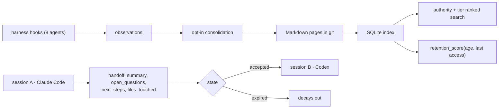

## 1. Executive Summary

ai-memory is an MIT-licensed Rust workspace of about 140,000 lines across ten
crates, aimed at one scenario stated in its own opening line:

> "Quit Claude Code mid-task, start OpenAI Codex in the same directory, continue
> without re-explaining the architecture, the failed approaches, or the open
> questions."

Most of the design is familiar and well executed: Markdown in git as the human
source of truth with SQLite as a derived index, harness lifecycle hooks for
capture, opt-in LLM consolidation, a retention score. That combination is
[Basic Memory](../basic-memory/)'s position with
[agentmemory](../agentmemory/)'s decay, and the repository says so — it carries
`docs/research-basic-memory.md`, `research-agentmemory.md`, `research-cognee.md`
and `research-karpathy-llm-wiki.md`, plus a `prior-art-implementation-findings.md`
comparing those analyses against its own implementation. A system that has
explicitly read the same prior art this atlas reviews is unusual, and the
findings document is candid about what it took and what it did not.

The novel part is the **handoff**, and it is worth the review on its own:

```rust
pub enum HandoffState { Open, Accepted, Expired }

pub struct NewHandoff {
    pub workspace_id: WorkspaceId,
    pub project_id: ProjectId,
    pub from_session_id: Option<SessionId>,
    pub from_agent: AgentKind,
    pub to_agent: Option<AgentKind>,
    pub cwd: Option<PathBuf>,
    pub summary: String,
    pub open_questions: Vec<String>,
    pub next_steps: Vec<String>,
    pub files_touched: Vec<String>,
}
```

Three things about that type are absent from every other system in this atlas.

**It is addressed.** `from_agent` and `to_agent` are typed harness kinds, so a
handoff is a message from Claude Code to Codex rather than an undirected note
left in a store. Memory here has a sender and a recipient.

**It carries open questions.** Every other system in this atlas stores
conclusions — facts, lessons, decisions, skills. `open_questions: Vec<String>`
is memory of *what is not known*, which is the state a half-finished task
actually leaves behind and the thing a fresh agent most needs.

**It expires.** `Open → Accepted → Expired` means an unclaimed handoff decays
out rather than lingering as authoritative-looking stale context. The atlas has
found decay applied to facts many times and never to a work item, where it is
more obviously correct: nobody picked this up for a week, so it is probably no
longer the state of the world.

Reservations. There is no trust state and no tombstone; supersession is
page-keyed, and the hooks re-capture on every session, so a corrected page can be
re-derived. And the surface is large — 39,000 lines of CLI and 23,000 of MCP —
for a system whose distinctive idea is a few hundred lines.

## 2. Mental Model

```text
harness lifecycle hooks
  SessionStart · UserPrompt · PreToolUse · PostToolUse
  PreCompact · PostCompaction · Notification · Stop · SessionEnd
        │
        ▼
  observations (raw, captured without an LLM call)
        │  opt-in consolidation
        ▼
  Markdown pages in git  ── human source of truth, editable, diffable
        │  derived
        ▼
  SQLite index + state ── tiers, authority ranking, retention score

  handoff ── open ──▶ accepted        (a later session picks it up)
              └────▶ expired          (nobody did)
```

## 3. Architecture

Crates, in lines of Rust:

- `ai-memory-cli` (39,508), `ai-memory-mcp` (23,708), `ai-memory-store` (23,752),
  `ai-memory-hooks` (13,074), `ai-memory-consolidate` (11,198),
  `ai-memory-llm` (7,687), `ai-memory-wiki` (7,320), `ai-memory-web` (5,731),
  `ai-memory-workstream` (4,447), `ai-memory-core` (4,237).
- `ai-memory-core` holds the model: `handoff.rs`, `observation.rs`, `actor.rs`,
  `workstream.rs`, `page.rs`, `active_project.rs`, `routing_skills.rs`,
  `sanitize.rs`.



## 4. Essential Implementation Paths

### The handoff as a memory type

Continuity across an interrupted task is a problem every coding-agent memory in
this atlas gestures at and none models. The usual approach is to make session
history retrievable and hope the next agent's query finds the right part of it.
That fails in a specific way: the most important thing about an abandoned task
is not what was *concluded* but what was *still open*, and open questions are
exactly what a similarity search over prior conversation surfaces worst.

Making the handoff a record with `open_questions`, `next_steps` and
`files_touched` moves that from a retrieval problem to a schema one. And the
state machine is what keeps it honest — a handoff that nobody accepted for long
enough becomes `Expired`, so the store does not accumulate confident-sounding
descriptions of work whose context has moved on.

`from_agent` / `to_agent` being typed `AgentKind` values is the part that serves
the stated goal. The handoff knows it came from a different harness, which means
the receiving agent can be told so rather than inferring it.

### Capture without a model call

`ObservationKind` maps the harness lifecycle directly — `SessionStart`,
`UserPrompt`, `PreToolUse`, `PostToolUse`, `PreCompact`, `PostCompaction`,
`Notification`, `Stop`, `SessionEnd` — and observations are recorded as they
arrive. Consolidation into pages is opt-in and happens later.

This is [zero-LLM capture](../../patterns/zero-llm-capture/) with an unusually
complete event vocabulary. `PreCompact` and `PostCompaction` are worth noting:
capturing around the harness's own compaction boundary means the material the
harness is about to discard is preserved on the way past, which is the moment
most systems lose it.

Capturing the assistant's final turn is **double opt-in** — the hook must be
installed with `--capture-assistant` *and* the server must enable
`capture_assistant`, off by default. Requiring both sides to agree before
recording model output is a defensible default for a system whose store is a git
repository the user reads.

### Generation-based supersession of pending work

```sql
SET state = 'superseded', completed_at = ?1, claim_id = …
    last_error = 'superseded by a newer observation generation'
```

with a test named `newer_generation_supersedes_older_pending_work` asserting
"the superseded first generation must not run".

This is supersession applied to *queued consolidation jobs* rather than to
memories: when newer observations arrive, older pending work for the same target
is cancelled instead of racing to write a stale page. Several systems in this
atlas have background consolidation and none visibly handles the case where two
generations of work are in flight at once.

### Retention as a scored decision

`decay.rs` computes a `retention_score` — "Higher = keep this page" — from
tunable coefficients with **separate per-day exponential decay for age since
`updated_at` and for days since last access**.

Splitting those two is right and rare: a page nobody has touched in a month is a
different case from a page nobody has *read* in a month, and collapsing them into
one recency term makes an actively-consulted reference look stale. The
[decay and reinforcement](../../patterns/decay-and-reinforcement/) pattern asks
for exactly this separation.

### An actor model with capabilities

`AuthLevel` is `Anonymous | Root | User`; `Capability` is `Admin`,
`UserManagement`, `NormalRead`, `NormalWrite`, `SkipAdmissionChain`. Combined
with workspace and project ids and per-project UUID isolation, that gives a
real authorization surface, which most local coding-agent memories in this atlas
do not have at all.

`SkipAdmissionChain` is the interesting entry: an explicit, named capability for
bypassing the write-admission path, rather than an implicit trusted-caller
assumption. A bypass that has a name can be audited.

## 5. Memory Data Model

Markdown pages in git are canonical; SQLite holds the index, tiers, and state.
Pages carry frontmatter, a tier (`Episodic` and others), and an authority that
participates in ranking. Observations, handoffs and workstream events are their
own record types.

What is absent:

- **No trust state.** Nothing marks a page candidate, verified, or rejected.
- **No value-level tombstone.** Supersession is page-keyed, and the hooks
  re-capture every session, so material a user deleted can return through the
  same path that first produced it.
- **A `do_not_answer_from` tag exists only in a test fixture.** A fixture in
  `ai-memory-store` builds a page tagged `["superseded", "do_not_answer_from"]`
  and asserts that authority ranking puts the canonical decision first. That is
  a test of *ranking*, not of the tag: no read-path filter on
  `do_not_answer_from` was found in the crates. The name describes the mechanism
  the atlas keeps asking for; the mechanism itself was not located.

## 6. Retrieval Mechanics

Search over pages scoped to workspace and project, ranked with authority and
tier participating, plus the retention score for lifecycle decisions. The
prior-art findings document lists "first-class graph/link retrieval" and
"bounded raw/verbatim fallback recall" among improvements it identified, which
suggests the retrieval layer is the newer part of the system.

## 7. Write Mechanics

Hooks capture observations; consolidation turns them into pages under an
explicit opt-in; the wiki crate manages migrations of the Markdown corpus. Git
is the durability and audit story, which the atlas treats as a real mechanism
distinct from an event table.

Single-writer durability is named in the prior-art document as a lesson already
taken, and the generation-supersession logic above is the concurrency guard on
the consolidation path.

## 8. Agent Integration

MCP plus lifecycle hooks for Claude Code, Codex, Cursor, Gemini CLI, opencode,
Devin, Grok and Kimi — the broadest harness coverage in this atlas, and the
reason the handoff type can be addressed between harnesses at all. Native
packaging (AUR, systemd units), Docker images, and per-platform binaries.

`install-mcp --session-aware` optionally isolates scope per session through a
local stdio bridge.

## 9. Reliability, Safety, and Trust

Strengths:

- **A handoff with a lifecycle**, carrying open questions and next steps.
- **Expiry on unclaimed work**, so stale context decays rather than accumulating.
- **Typed sender and recipient**, making cross-harness continuity explicit.
- **Zero-LLM capture** over a complete lifecycle vocabulary, including around
  the harness's own compaction.
- **Double opt-in** for capturing assistant output.
- **Generation-based cancellation** of superseded pending consolidation.
- **Separate decay terms** for modification age and access age.
- **A named `SkipAdmissionChain` capability** rather than an implicit bypass.
- **Markdown in git canonical**, SQLite derived and rebuildable.
- **Committed prior-art analyses** of four systems in this atlas, with an honest
  gap list.

Gaps:

- **No trust state.**
- **No tombstone**, and hooks re-capture, so deletion is undone by the next
  session.
- **`do_not_answer_from` is fixture-only**; the read path does not appear to
  honour it.
- **A large surface** relative to the distinctive idea.
- **Handoff expiry is time-based**, so a genuinely still-relevant handoff expires
  on the same schedule as an abandoned one.

## 10. Tests, Evals, and Benchmarks

Tests are present throughout, including targeted concurrency tests such as
`newer_generation_supersedes_older_pending_work`, and an `e2e` tree with hook
fixtures. Nothing was run for this review, and no retrieval-quality benchmark
was found.

The claim worth measuring is the product claim: does a session resumed from a
handoff in a *different* harness actually avoid re-explaining the architecture?
That is testable with a fixed task and a scripted interruption, and no such
evaluation was located.

## 11. For Your Own Build

### Steal

- **Model the handoff, do not retrieve it.** What an interrupted task leaves
  behind is open questions and next steps, and those are the worst possible
  target for similarity search over transcript history.
- **Store open questions as memory.** Every system here records conclusions; the
  unresolved parts are what a fresh agent most needs and nothing else keeps them.
- **Give work items an expiry state.** Decay applied to a task is more obviously
  correct than decay applied to a fact.
- **Address memory between harnesses.** Typed `from_agent`/`to_agent` turns a
  note in a store into a message with a recipient.
- **Capture around the harness's compaction boundary**, where the material is
  about to be discarded.
- **Cancel superseded pending work by generation**, so two consolidation runs
  cannot race to write the same page.
- **Split decay into modification age and access age.**
- **Name the bypass.** `SkipAdmissionChain` as an explicit capability is
  auditable in a way an implicit trusted path is not.
- **Require both sides to opt in** before recording model output into a store the
  user reads.

### Avoid

- **Supersession undone by re-capture**, in a system whose hooks fire every
  session.
- **A tag that names the right mechanism without implementing it** — the read
  path decides whether `do_not_answer_from` means anything, and here it does not
  appear to.
- **Time-based expiry** as the only signal for handoff relevance.

### Fit

Borrow:

- The `Handoff` type more or less wholesale, including the state machine and the
  open-questions list. It is small, independent of the rest of the system, and
  solves a problem the atlas has otherwise seen only gestured at.
- Generation-based cancellation of pending background work.
- The two-term decay split.

Do not copy:

- Page-keyed supersession as the correction story where hooks re-capture.
- The assumption that a `do_not_answer_from` tag does anything unless the read
  path enforces it.

## 12. Open Questions

- Does any read path filter `do_not_answer_from`, or is it only a fixture tag?
- What expires a handoff, and can an accepted-then-abandoned handoff be
  reopened?
- What stops a consolidated page returning after a user deletes it, given that
  hooks re-capture every session?
- Has the cross-harness continuity claim been measured end to end?
- Does `SkipAdmissionChain` get logged when exercised?

## Appendix: File Index

- Handoff: `crates/ai-memory-core/src/handoff.rs` (`HandoffState`, `NewHandoff`,
  `Handoff`).
- Capture vocabulary: `crates/ai-memory-core/src/observation.rs`
  (`ObservationKind`).
- Actors and capabilities: `crates/ai-memory-core/src/actor.rs` (`AuthLevel`,
  `Capability`, `AuthzError`).
- Retention: `crates/ai-memory-store/src/decay.rs` (`retention_score`).
- Consolidation concurrency:
  `crates/ai-memory-store/src/session_consolidation.rs`.
- Prior-art analyses: `docs/research-agentmemory.md`,
  `docs/research-basic-memory.md`, `docs/research-cognee.md`,
  `docs/research-karpathy-llm-wiki.md`,
  `docs/prior-art-implementation-findings.md`.
- Harness adapters: `hooks/` and `crates/ai-memory-hooks/`.
