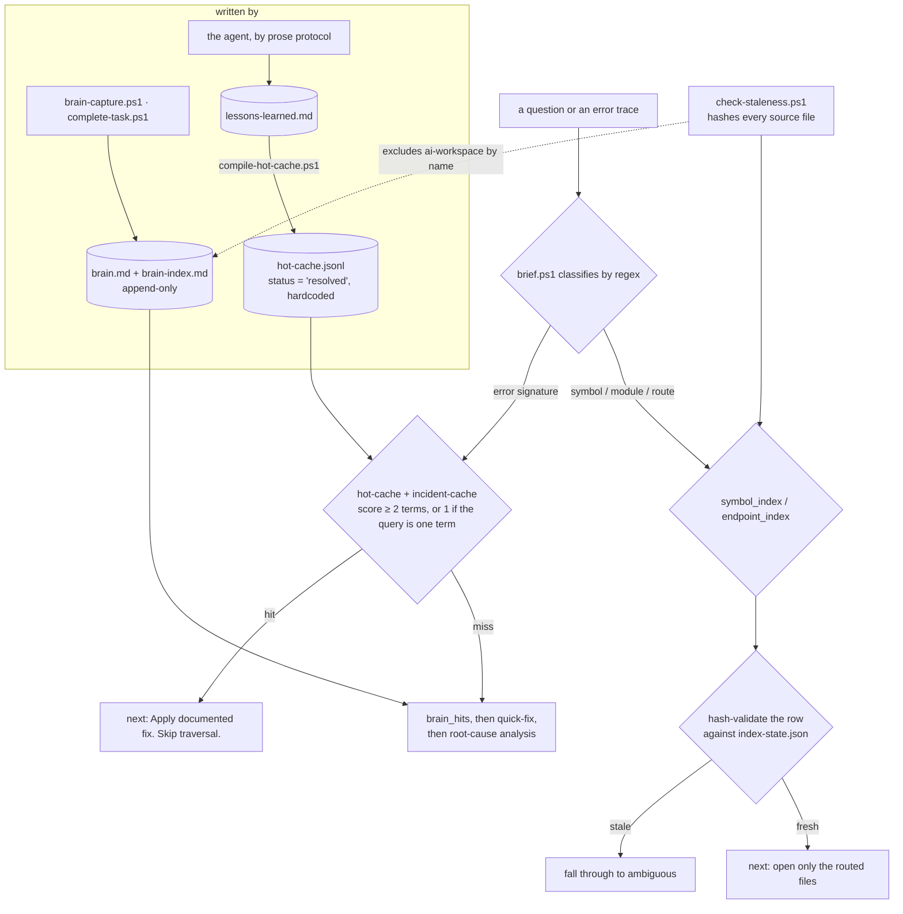

## 1. Executive Summary

A file-based agent workflow built around one idea: move codebase mapping off the
model and into deterministic local scripts, so a turn spends tokens on reasoning
rather than on searching. Fourteen PowerShell scripts, a Markdown workspace, four
lane prompts and an `AGENTS.md` that is declared the single source of truth.
6 commits since 20 August 2026, and **no licence file** — no `LICENSE`, and no
licence claim in the README — so a reader has no grant to rely on.

Three things make it worth reading.

**One router over three stores, and it returns an instruction rather than
results.** There is a brain (`brain-capture.ps1` writes, `brain-recall.ps1`
reads), a lessons file compiled into an error-signature cache, and an Obsidian
incident vault compiled into a second cache. `brief.ps1` classifies the query by
regex — error signature, module, route, symbol, ambiguous — consults the caches
and the brain in a fixed order, and ends with a line addressed to the agent:
*"next: hot-cache hit found. Apply documented fix. Skip traversal."* Most memory
systems in this atlas return a ranked list and leave the decision to the model;
this one spends the decision itself, deterministically, for free.

**And that is the least guarded read in the system.** The hot-cache gate is
`$score -ge 2 -or ($score -ge 1 -and $terms.Count -eq 1)` — two matching keywords,
or one if the query is a single term. Nothing checks that the matched fix is still
correct, and the recommendation on a hit is to apply it and stop looking. A false
positive there does not degrade a ranking; it ends the investigation.

**The system has two clocks and checks one of them.** `check-staleness.ps1`
hashes every source file against `index-state.json` and reports fresh, modified,
missing and new; `brief.ps1` hash-validates an index row before it will classify
on it, under a comment saying *"brief must not trust stale index rows"*. That
machinery is genuinely careful and it excludes `ai-workspace` by name — so the
derived code index has a freshness contract and the memories have none. The field
that would carry one exists: every compiled cache row is written with
`status = 'resolved'`, hardcoded at the single write site, and no script anywhere
reads it.

**Nothing is stored yet.** `brain.md` says *"(No entries yet)"*, `brain-index.md`
is an empty table, `hot-cache.jsonl` is one byte, `incident-cache.jsonl` is three,
and `last-session.md` still carries its `YYYY-MM-DD` placeholders. There are no
tests, no sample corpus and no probes, so no retrieval claim here can be checked
against anything — which is the honest frame for everything above: this is a
design read from its scripts, not a system observed working.

No capability marks. Every write is an append, nothing revises or removes, and
the one status field is unreachable.

## 2. Mental Model

A memory is an episode of debugging. The capture signature says so directly:
`-Type` from `bug-fix | feature | pattern | decision | optimization | refactor`,
then `-Problem`, `-Solution`, and optionally `-RootCause`, `-FailedApproaches`,
`-FilesChanged` and `-Lesson`.

`-FailedApproaches` is the field worth noticing — *"Failed approaches (skip next
time)"* — because it is the one place in the design that records what did **not**
work. It is keyed on the episode rather than on the value, and nothing consults it
as a gate: it is prose inside an entry a keyword search may or may not surface. So
it is a near miss for the [rejected-value tombstone](../../patterns/rejected-value-tombstone/)
rather than an instance of it, and it is the field a tombstone would be built from.

**A memory has one state: written.** There is no candidate, no verified, no
superseded, no archived. Both brain files are append-only in practice — every
write is `Add-Content` — and no script updates or deletes an entry, so correcting
a memory means opening the Markdown and editing it, and the design has no opinion
about that happening.

The interesting epistemic event is therefore not how a thing becomes a belief but
**what the router does with one**. `brief.ps1` decides, before the model sees
anything, whether the workspace already knows the answer — and its highest
confidence verdict, the hot-cache hit, instructs the agent to stop investigating.
That is the decision the rest of this report is about.



## 3. Architecture

Files and PowerShell. Nothing runs as a service, nothing is indexed into a
database, and there are no dependencies beyond a shell.

- **`ai-workspace/agents/brain/`** — `brain.md` (full entries, newest at the
  bottom) and `brain-index.md` (a Markdown table of id, date, type, keywords).
- **`ai-workspace/agents/lessons-learned.md`** — a protocol plus an entry
  template, appended by the agent, compiled by `compile-hot-cache.ps1`.
- **`ai-workspace/Obsidian/`** — a vault with an incident template, compiled by
  `compile-incident-cache.ps1`.
- **`ai-workspace/generated/`** — `hot-cache.jsonl`, `incident-cache.jsonl`,
  `last-session.md`.
- **`ai-workspace/agents/references/`** — `symbol_index.md`, `endpoint_index.md`,
  built by `generate-index.ps1` and hash-tracked by `index-state.ps1`.
- **`ai-workspace/scripts/`** — fourteen scripts, 2,411 lines. `brief.ps1` is the
  largest at 375 and is the entry point.
- **`.agents/workflows/`** — four lane prompts (plan, build, review, small);
  `AGENTS.md` at the root is the canonical rulebook.

### Deployment and ergonomics

Copy the directory and run `setup.ps1`. The store is Markdown a person reads and
edits, which is the right shape for a workspace whose whole argument is that a
human and an agent share it.

**The platform assumption is not stated and it is total.** Every script is
PowerShell with Windows path separators — `Join-Path $workspace 'ai-workspace\agents\brain'`
throughout — so this runs on Windows, or on a machine with PowerShell Core and a
tolerance for backslash joins. The README describes the workflow as
agent-agnostic; it is not host-agnostic, and nothing says so.

**The screen saw one file.** No package manifest, no lockfile and no hook file
exist, so `screen_repo.py` scanned only `AGENTS.md` and flagged it as
agent-directed. The execution surface is the fourteen `.ps1` files, which the
screen does not parse. Read by hand: they append to Markdown, write JSONL into
`generated/`, shell out to `git` for HEADs and dirty state, and hash files with
`SHA256`. Nothing reaches the network. They were not run — this report reads them.

## 4. Essential Implementation Paths

**Capture** — `brain-capture.ps1`. Six required parameters behind a
`ValidateSet` on type, an id of `YYYYMMDD-NNN` derived from the highest existing
sequence, an index row appended, then the full entry appended to `brain.md`. Two
comments record real defects handled rather than assumed away: the sequence is
taken from the maximum because *"Historical files may contain duplicate IDs;
counting rows would keep generating collisions"*, and the single-writer
assumption is stated rather than implied — *"workflow has one writer; add a file
lock only if concurrent capture is introduced."*

**Recall** — `brain-recall.ps1`. Query split on whitespace, terms of three
characters or more, each index row scored by how many terms it contains, top *N*
by score. The full entry is then pulled out of `brain.md` by reconstructing the
header from the index row's own cells and matching it as a regex — again for a
stated reason: *"Historical entries reused IDs. Match the full indexed header so
each duplicate ID still recalls its own lesson without rewriting history."*
Output carries `relevance_score: N/M`, so the caller sees how much of the query
matched.

**Compilation** — `compile-hot-cache.ps1` parses the lessons file into JSONL rows
carrying `error_signature`, an `error_signature_hash` of `sha256(lowercased
symptom)[:16]`, a keyword array, root cause, fix summary, and `status =
'resolved'`.

**The router** — `brief.ps1`. Classification is a regex cascade: stack-trace
markers, exception names, HTTP 4xx/5xx, `file.go:123` patterns, `nil pointer`,
Postgres SQLSTATEs like `42P01` and `23502`. An error signature goes to the
caches; a capitalised token or a `useSomething` goes to the symbol index; a path
goes to the endpoint index; everything else is ambiguous.

**Write-back at task end** — `complete-task.ps1` reads `.ai/HANDOFF.md`, throws
if it exceeds thirty lines, throws if any required field is missing, and only then
captures to the brain. A task cannot be completed on an incomplete handoff, which
is a real gate and the only one in the system.

**Freshness** — `index-state.ps1` stores a `sha256` per indexed file plus backend
and frontend git HEADs; `check-staleness.ps1` recomputes and reports counts;
`validate-handoff.ps1` compares stored HEADs against current ones and emits
`INDEX_WARN: … is stale -- run generate-index.ps1 before traversal`.

## 5. Memory Data Model

Two shapes, and neither carries a field about belief.

A **brain entry** is a Markdown section headed `## [id] date | type | keywords`
with `**Problem**`, `**Solution**` and four optional blocks. Its index row is
`| id | date | type | keywords |`. The keywords are the entire searchable
surface, and the script says so — *"keywords are the searchable surface - keep
them dense"* — which makes findability a write-time property decided by whoever
types the capture command.

A **hot-cache row** is JSON with `id`, `kind`, `status`, `title`, `severity`,
`repo`, `error_signature`, `error_signature_hash`, `keywords`, `root_cause`,
`fix_summary`, `source`.

**`status` is the near miss, and it is unwired in both directions.** It is written
as the literal `'resolved'` at the one construction site, so no other value can
occur; and grepping the read scripts for `status` returns git status and HTTP
status codes and nothing else. A memory whose fix stopped working has a field to
say so and no way to say it, and no reader if it could. `trust_state` is withheld
on exactly that.

**`error_signature_hash` is a content key with no gate behind it.** A SHA-256 of
the normalised symptom is precisely the key a rejected-value tombstone needs, and
it is used as an identifier rather than consulted before a write. `tombstone` is
withheld with the mechanism already half-built.

**One temporal field.** An entry has a date; the index row has a date. Nothing
records when a fact was true as distinct from when it was written, so `bitemporal`
is an absence rather than a near miss. **No scope key of any kind** — one
workspace, one brain, and `--root`-style directory selection is not offered —
so `scope_enforced` is withheld.

## 6. Retrieval Mechanics

Keyword overlap, twice, with different thresholds and very different
consequences.

`brain-recall.ps1` scores every index row by how many query terms appear in it and
returns the top five with their scores. It searches the **index only** — the full
entries in `brain.md` are fetched by id after ranking, never scanned — so a term
that appears in an entry's body but not in its keyword row cannot be found. That
is a deliberate and defensible design for a token budget, and it means the
keyword line is the whole retrieval surface.

`brief.ps1`'s hot-cache lookup is the same scoring with an admission rule:

```powershell
if ($score -ge 2 -or ($score -ge 1 -and $terms.Count -eq 1)) { $hotCacheHit = $line; break }
```

Two properties follow. It takes the **first** row over threshold rather than the
best, since it breaks immediately — so ordering in the cache file decides ties.
And two shared keywords is the entire evidence for a verdict whose stated action
is *"Apply documented fix. Skip traversal."* On a cache compiled from bug
write-ups, common terms like `null`, `timeout`, `user` or `500` will co-occur
across unrelated incidents.

**The symbol path is guarded and the memory path is not**, in the same file. The
symbol branch resolves candidates against the index and then hash-validates the
row before classifying on it, under the comment *"brief must not trust stale
index rows (Req 5)"*. The cache branch does no equivalent check: it does not ask
whether the lesson still applies, whether the files it names still exist, or
whether the index it was written against has moved. The system's care is
concentrated on the store that can be regenerated and absent from the store that
cannot.

## 7. Write Mechanics

Every write is an append and the write path is synchronous with no model in it —
capture is a command, so a memory is retrievable the moment the script returns.
Nothing runs in the background; compilation is something a person or an agent
invokes.

**There is no update or delete anywhere.** No script rewrites an entry, marks one
superseded, or removes one, so the brain grows monotonically and the same bug
captured twice produces two entries that both match the same query. The
duplicate-id handling in capture and recall shows the author has already met the
consequence of an append-only history; the missing half is a way to say that an
earlier entry has been replaced.

**The one write gate is at task completion**, and it is real: `complete-task.ps1`
throws when the handoff exceeds thirty lines or is missing a required field,
before anything reaches the brain. A gate that refuses to record an
under-specified episode is worth more than most confidence thresholds in this
corpus, because it acts on the property that actually determines whether the
entry will be usable later.

**The lessons path has no gate at all.** `AGENTS.md` instructs the agent to append
novel bug cause and fix to `lessons-learned.md`, and the file's own protocol says
*"DO NOT skip this step — this is permanent AI memory"* — enforcement by
instruction, with a compiler downstream that will parse whatever shape it finds.

### Operational cost

Close to zero, which is the point: no embeddings, no model calls on either path,
and the token cost of a recall is the size of the returned entries. The cost that
is not counted is the compile step — hot cache and incident cache are only as
current as the last time someone ran the compiler, and nothing in `brief.ps1`
checks when that was, though the same file checks index freshness two branches
earlier.

## 8. Agent Integration

`AGENTS.md` is declared the single source of truth and the README asks vendor
files to stay thin *"to prevent rule drift"* — the right instinct, and the
repository follows it: there is one `AGENTS.md`, not a family of near-copies.

The integration is shelling out. An agent runs `brief.ps1` at the start of a task
and reads a compact capsule; runs `traverse.ps1` for an error or a symbol; runs
`complete-task.ps1` at the end. The four lane prompts under `.agents/workflows/`
tell it which path to take.

**Agency over memory is total and unassisted.** The agent chooses the keywords
that become the entire retrieval surface, chooses whether to log a lesson at all,
and chooses whether to believe a hot-cache hit. There is no tool it must call and
no policy that refuses a write, apart from the handoff gate.

## 9. Reliability, Safety, and Trust

**No provenance beyond a source filename, no verification, no uncertainty.** A
compiled row records that it came from `lessons-learned.md`; nothing records who
wrote the lesson, against which commit, or whether it was ever confirmed to work
a second time.

**Prompt injection is unaddressed.** The brain and the lessons file are Markdown
an agent writes and later reads back into its own context, and nothing fences or
neutralises recalled text. For a single-developer workspace that is a reasonable
posture; the design does not say where it stops being one.

**Concurrency is stated rather than handled**, which is the honest form: *"workflow
has one writer; add a file lock only if concurrent capture is introduced."* Two
agents capturing at once would race on the index sequence, and the comment says
what to do about it.

**The failure mode that matters is a confident wrong recall.** Every other read
path here degrades gracefully — a missed symbol falls through to ambiguous, a
stale index warns — but a hot-cache hit terminates the search with an
instruction. Nothing in the system can express that a stored fix has expired, and
`check-staleness.ps1` excludes the directory the fixes live in.

**Marks, and why each is refused.** `trust_state` — `status` is hardcoded and
unread. `tombstone` — the content hash exists as an id and gates nothing.
`bitemporal` — one date. `scope_enforced` — no key. `audit_log` — the brain is
append-only, but it is the memory itself rather than a record of mutations to it,
which is a different property. `human_review` — no surface presents a memory to a
person for a decision. `negative_eval` — there are no tests in the repository at
all.

## 10. Tests, Evals, and Benchmarks

**There are none.** No test file, no probe set, no fixture, no acceptance script,
and no committed output from any run. `check-workflow.ps1` (174 lines) validates
that the workspace's own files are present and well-formed — a structural
self-check, not a test of retrieval.

That leaves nothing in this repository that could come back red, and it means
none of the design's claims can be checked here. The README's central argument is
about token cost — that deterministic scripts replace *"thousands of tokens per
turn"* of file searching — and no measurement of that appears anywhere: no
before-and-after token count, no comparison against a grep-based baseline, no
record of a session where the hot cache hit.

**The store is empty**, which compounds it. Every artifact that would carry
evidence is scaffolding: `brain.md` and `brain-index.md` announce that entries
are added by the scripts, `hot-cache.jsonl` is a single byte, `incident-cache.jsonl`
is three, and `last-session.md` still reads `generated: YYYY-MM-DD HH:MM:SS`. So
the recall path has never been exercised against content in anything committed
here.

**What I would want before trusting it.** A corpus of ten real brain entries and
ten questions with known answers, so the two-keyword hot-cache threshold can be
measured against false positives — that threshold is the one number in the design
whose error is expensive. A case where a lesson names a file that no longer
exists. And a token comparison against the baseline the README argues with,
since that is the claim the whole workflow is built on.

## 11. For Your Own Build

### Steal

- **Return a next step, not a result set.** `brief.ps1` ends with a line addressed
  to the agent — apply the documented fix and skip traversal, or check the brain
  hits and then do root-cause analysis. Spending the routing decision
  deterministically is cheaper than spending it in the model, and it makes the
  decision reviewable.
- **Gate task completion on the handoff, not on the memory.** Refusing to close a
  task whose handoff is missing a field or runs past thirty lines acts on the
  property that decides whether the record is usable later, and it is enforceable
  without judgement.
- **Hash-validate a derived index row before you route on it.** *"brief must not
  trust stale index rows"* is the right rule, and the same file shows what it is
  worth by not applying it one branch over.
- **Write the assumption down where it will bite.** *"workflow has one writer;
  add a file lock only if concurrent capture is introduced"* tells the next
  reader exactly what changes when the assumption does.

### Avoid

- **Concentrating your freshness machinery on the store you can rebuild.** Source
  files are hashed, HEADs are compared, an index row is validated before use —
  and `ai-workspace` is on the exclusion list, so the memories that cannot be
  regenerated are the ones with no freshness contract at all.
- **A status field with one producer and no reader.** `status = 'resolved'` is
  written as a literal at the only construction site and consulted nowhere. Either
  a memory can expire, in which case something must write and read the field, or
  it cannot, in which case the field is a promise the schema does not keep.
- **A confident verdict on a cheap threshold.** Two shared keywords is a
  reasonable bar for *"here are some entries you might want"* and a thin one for
  *"apply this fix and stop looking."* Match the evidence to the consequence of
  the action the answer triggers.
- **Taking the first match over threshold and breaking.** The hot-cache loop stops
  at the first row that scores, so the order of a generated file decides which fix
  the agent applies. Score them all and take the best, or say that ties are
  resolved by file order.

### Fit

This suits one developer, on Windows, working across a backend and a frontend
they own, who wants an agent to stop grepping. Read that way the design is
coherent and several pieces of it are better than their equivalents elsewhere in
this atlas — the router that answers with an action, the handoff gate, the
duplicate-id handling that survives a history it did not control.

Who should walk away: anyone whose memories will outlive the code they describe.
There is no correction path, no expiry, and no way to mark an entry wrong, so the
store's value decays with the codebase while the router's confidence in it does
not. And anyone not on PowerShell, since every script assumes it and the README
does not.

The honest summary is that this is a design rather than a result. Nothing here has
been measured, nothing has been stored, and the token-efficiency argument the
whole workflow rests on is asserted rather than shown — which is worth saying
plainly about a repository whose ideas are otherwise worth borrowing.

## 12. Open Questions

- **Has the hot-cache threshold been tried against a real cache?** Two shared
  keywords on a corpus of bug write-ups is the number most likely to misfire, and
  the store is empty.
- **What was meant to write a `status` other than `'resolved'`?** The field is
  shaped for a lifecycle nothing implements.
- **Is the PowerShell dependency intentional or incidental?** The workflow is
  presented as agent-agnostic and is host-specific.
- **What refreshes the compiled caches?** `complete-task.ps1` invokes the incident
  compiler; nothing in `brief.ps1` checks how old either cache is, though it checks
  index freshness in the same pass.
- **What happens to a lesson whose files no longer exist?** `check-staleness.ps1`
  would answer it for source files and is scoped away from the workspace.

## Appendix: File Index

**Store**
- `ai-workspace/agents/brain/brain.md`, `brain-index.md` — the two-file brain,
  both empty at this commit.
- `ai-workspace/agents/lessons-learned.md` — protocol and template.
- `ai-workspace/generated/hot-cache.jsonl`, `incident-cache.jsonl`,
  `last-session.md` — 1, 3 and 172 bytes.

**Write path**
- `ai-workspace/scripts/brain-capture.ps1` — the id rule, the two appends, the
  single-writer comment.
- `ai-workspace/scripts/complete-task.ps1:18-27` — the handoff gate.
- `ai-workspace/scripts/compile-hot-cache.ps1:55-80` — the signature hash and the
  hardcoded `status`.

**Read path**
- `ai-workspace/scripts/brain-recall.ps1` — index scoring, header reconstruction.
- `ai-workspace/scripts/brief.ps1:95-135` — classification and the hot-cache
  admission rule; `:311-330` — the routing advice.
- `ai-workspace/scripts/traverse.ps1` — the error and symbol lookups.

**Freshness**
- `ai-workspace/scripts/check-staleness.ps1` — the hash comparison and the
  `ai-workspace` exclusion.
- `ai-workspace/scripts/index-state.ps1`, `generate-index.ps1`,
  `validate-handoff.ps1`.

**Instructions**
- `AGENTS.md`, `.agents/workflows/{plan,build,review,small}.md`,
  `ai-workspace/agents/conventions.md`, `navigation.md`.

## History

**2026-08-30** — [`c1686a372398fd58d2abd77372d8638af8212ab2`](https://github.com/Taki7980/Ai-workflow/commit/c1686a372398fd58d2abd77372d8638af8212ab2) — first reading, at the sixth commit. The screen scanned one file: there is no manifest, lockfile or hook in the tree, so it saw only `AGENTS.md` and flagged it as agent-directed, which was read as data. The execution surface is fourteen PowerShell scripts the screen does not parse; they were read by hand — appends to Markdown, JSONL writes under `generated/`, `git` invocations for HEADs and dirty state, SHA-256 hashing, no network — and not run, so every claim in this report comes from reading them rather than from executing them. No marks. The report is organised around the router in `brief.ps1`, because that is where the design's care and its gap sit two branches apart: an index row is hash-validated before it is trusted, and a cached fix is admitted on two keyword matches and answered with an instruction to stop investigating.
