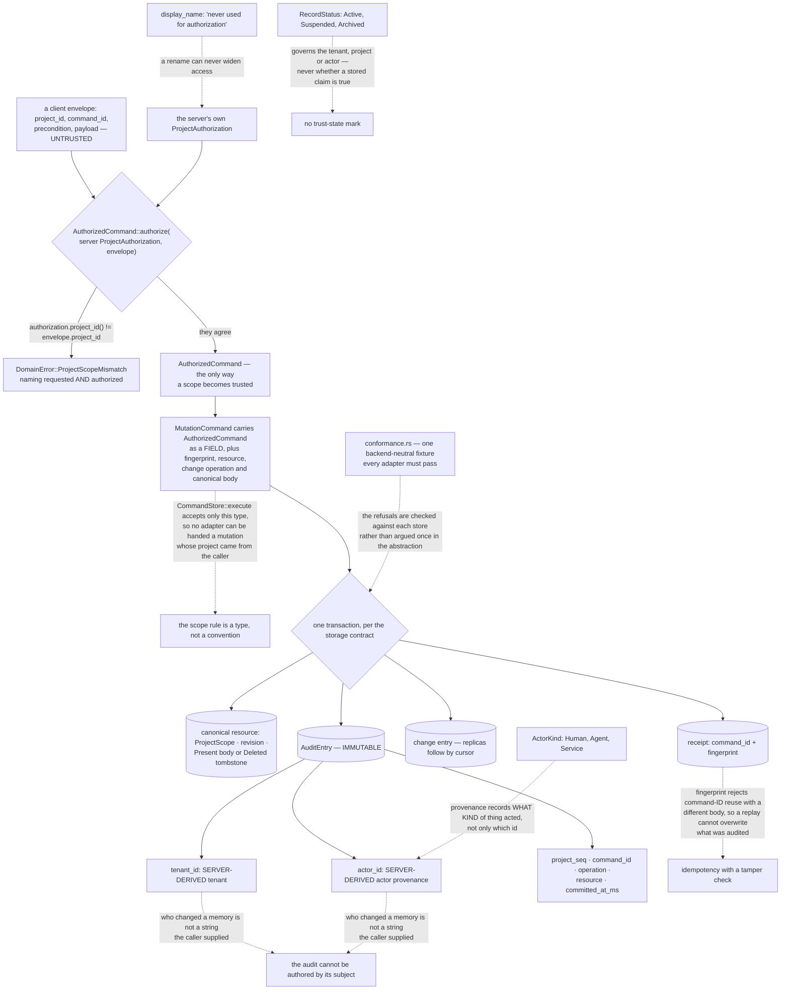

## 1. Executive Summary

AideMemo is "[p]ortable working memory for coding agents and orchestrators" —
MIT or Apache-2.0, Rust, version 0.1.0, 95,480 lines across 135 files in
thirteen crates, shipping "[o]ne Rust binary. One embedded store. A code-first
SDK, MCP tools, CLI, and native bindings."

**The mechanism to take away is where the project id comes from.** Almost every
multi-tenant store in this corpus accepts the caller's word for which tenant or
project a write belongs to, and then relies on a predicate somebody remembered
to add. AideMemo makes that impossible to express:

> "Command paired with server-owned authorization context."
>
> "Returns `DomainError::ProjectScopeMismatch` when the untrusted envelope
> selects a different project."

`AuthorizedCommand::authorize` is the only constructor, and it compares the
server's `ProjectAuthorization` against the envelope's `project_id` before
producing anything. The enforcement then rides the type: `MutationCommand` —
the single argument `CommandStore::execute` accepts — holds an
`AuthorizedCommand<()>` as a field, so a backend adapter cannot be handed a
mutation whose scope came from the request. There is no unscoped path to
forget, because there is no unscoped value to pass.

**The audit row follows the same rule, and it is transactional.** The storage
contract is stated on `MutationCommand` itself: adapters "persist its canonical
fingerprint, resource mutation, receipt, change entry, and audit entry in one
transaction." An `AuditEntry` is "[i]mmutable audit record committed with a
mutation and its receipt", and the two fields a reader should check are
annotated with their provenance rather than their contents — `tenant_id` is the
"[s]erver-derived tenant", `actor_id` the "[s]erver-derived actor provenance".
What is recorded is who the server determined acted, not who the request said
did.

**Two smaller lines carry the same instinct.** `ActorKind` distinguishes `Human`
— "[i]nteractive person" — from `Agent`, "[n]amed coding or reasoning agent
profile", and `Service`, so the audit can say what kind of thing made a change
and not only which identifier. And on the tenant record, `display_name` carries
the annotation `"Human-readable label; never used for authorization"`, which
closes the rename-widens-access bug in advance.

**What is absent is any judgement about the memories themselves.**
`RecordStatus` is `Active`, `Suspended`, `Archived`, and it governs accounts
rather than claims: a suspended record "does not grant access or accept
mutations", an archived project is "read-only and retained for export or audit".
Nothing in the model says a stored fact is doubtful, superseded or wrong, and
the only time fields are `created_at_ms`, `updated_at_ms` and a revision — a
version chain over write time with no second axis.

## 2. Mental Model

A **command** is authorized before it is a command.

A **scope** is what the server decided, never what the envelope asked for.

An **audit row** commits with the mutation or the mutation does not commit.

A **deletion** is a tombstone replicas receive, not a row that vanishes.

A **status** describes the account, not the claim.

## 3. Architecture

| Area | Role |
| --- | --- |
| `crates/aidememo-domain/command.rs` | Authorization binding, the mutation type, the audit record |
| `crates/aidememo-domain/conformance.rs` | The fixture every storage adapter must satisfy |
| `crates/aidememo-domain/record.rs` | Tenants, projects, actors, and what their statuses mean |
| `crates/aidememo-store-local`, `-store-postgres` | Two adapters behind one trait |
| `crates/aidememo-client` | The replica cache and its change cursor |
| `docs/MEASUREMENTS.md`, `benchmarks/` | The public measurement ledger and its evidence |

## 4. Essential Implementation Paths

`crates/aidememo-domain/src/command.rs:190-213` — the only way a scope becomes
trusted, and the error when it does not.

`:244-250` — the field that makes the rule unavoidable for every backend.

`:239-243` — the one-transaction storage contract, stated on the type it
governs.

`:306-325` — an audit record whose tenant and actor are server-derived.

`crates/aidememo-domain/src/record.rs:18-28`, `:36` — actor kinds, and a display
name barred from authorization.

## 5. Memory Data Model

A canonical resource keyed by tenant, project and resource reference, with a
revision and a state that is either recursively key-sorted JSON or a durable
deletion tombstone. Around it: commands with idempotency keys and canonical
fingerprints, receipts, change entries with a project sequence, and immutable
audit rows.

## 6. Retrieval Mechanics

Facts, graph traversal and history over canonical state, with replicas following
a change feed by cursor and a local cache materialising it. Cursor epoch and
range mismatches are refused with named errors rather than silently reset.

## 7. Write Mechanics

Every mutation carries an idempotency key and a fingerprint over "the real
project, precondition, operation, and payload". A retry with the same id and the
same body replays the stored receipt; a retry with the same id and a different
body is rejected. The mutation, its receipt, its change entry and its audit row
commit together.

## 8. Agent Integration

One binary serving a CLI and an MCP surface over both stdio and HTTP, a Python
agent SDK, and native bindings for Python, Node, Elixir and C — with a
`COMPARE.md` that sets itself against mem0, Graphiti and Letta by name.

## 9. Reliability, Safety, and Trust

The strong parts are the type-enforced scope, the transactional and
server-derived audit, the idempotency fingerprint, and a conformance fixture
that holds every backend to the same observable outcomes. The absent part is any
statement about the content: nothing marks a memory as stale, disputed or
corrected, and there is no second time axis to ask what was true rather than
what was written.

## 10. Tests, Evals, and Benchmarks

A backend-neutral conformance fixture that "describes outcomes, not I/O" and is
run by each adapter, an identity conformance suite beside it, a benchmarks tree,
and a public measurement ledger that states where durable numbers live and
deliberately ignores raw scenario output "because it contains temporary paths
and run-specific identifiers".

## 11. For Your Own Build

Make the authorized scope a different type from the requested one. A predicate
can be forgotten on one read path; a constructor that refuses a mismatched
envelope cannot, and a store that only accepts the authorized type has no
unscoped path left to audit.

Derive the audit's actor on the server. An audit row whose actor field is filled
in by the actor is a record of a claim, not of an act.

Put the transactional requirement on the type the adapters implement. "Persist
… in one transaction" written on the command struct is a contract every backend
author reads; the same sentence in a README is one they may not.

Annotate the fields that must never be used for authorization. `display_name:
"never used for authorization"` costs nothing and forecloses a whole class of
bug.

## 12. Open Questions

Whether a memory will ever carry a status of its own. Every guarantee here is
about who may write and what was written; none is about whether what was written
is still true, and a working memory for long-running agents eventually needs
that vocabulary.

Whether the conformance fixture will grow retrieval assertions. It is the right
instrument, already run against every backend, and it currently checks that bad
commands are refused rather than that withdrawn material stops coming back.

## Appendix: File Index

| Path | What to read it for |
| --- | --- |
| `crates/aidememo-domain/src/command.rs:190-213` | A scope the caller cannot assert |
| `:244-250` | Why no backend can be handed an unscoped mutation |
| `:306-325` | An audit row whose actor is derived, not declared |
| `crates/aidememo-domain/src/record.rs:36` | One annotation that forecloses a class of bug |
| `crates/aidememo-domain/src/conformance.rs:1-6` | One fixture, every storage backend |

## History

**2026-09-16** — [`58b803cc6b717fbf6559303e0d3f08e8b75673d4`](https://github.com/taeyun16/aidememo/commit/58b803cc6b717fbf6559303e0d3f08e8b75673d4) — first reading, at a commit dated 16 September 2026. Screened before opening, from a shallow clone: two auto-run surfaces, five build-time execution points, five unpinned dependency surfaces and twenty-seven dependency files inside the seven-day cooldown, with `Cargo.lock` present. `AGENTS.md` and `CLAUDE.md` are addressed to a reading agent and were recorded as data. Nothing was installed, built or run, and no benchmark was reproduced — the measurement ledger is cited as the project's own record rather than as a verified result.
