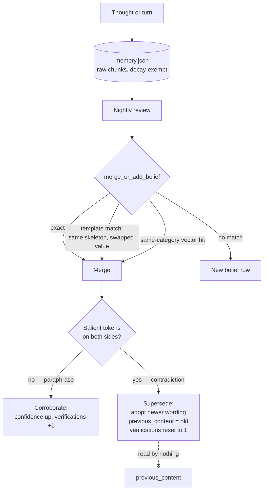

## 1. Executive Summary

AIMAOS is a 26,800-line Apache-2.0 multi-agent office runtime — an office
manager, a legal researcher, a document producer, a devops engineer and a
security officer, each with a workspace, tools and a memory of its own. Its
memory layer is a package, `core/mrag/`, with a core, a memory store and a dozen
adapters that bind it to a pulse loop, a scheduler, a dashboard, Telegram and a
skills registry.

The package shares its ancestry with [Helix AGI](../helix-agi/) — the same
author, the same category vocabulary, and modules that name the Helix instance in
their docstrings as the source of operating experience. It is not the same code.
The belief store has been rewritten around a cache with an inbound index, the
8-D physics is gone from it, an eighth category holds raw conversation chunks,
and the append-only cognitive journal has been replaced by something with the
same name and an entirely different job: a **narrative** daily journal, one
first-person markdown entry per day, ingested back into memory so the next day's
recall can surface what the agent did and felt the day before as a first-class
fact.

The mechanism worth the visit is `merge_or_add_belief`. Duplicate detection runs
three channels in order — exact id, **template match**, then same-category vector
similarity — and the middle one is the interesting one. A template match is the
same phrasing skeleton sharing an anchor token while the value tokens swap:
*"Adam prefers Python"* against *"Adam prefers Rust"*. The docstring says why it
exists: to catch *"contradictions that embeddings place far apart"*. Similarity
search is at its weakest exactly where two statements fill the same fact slot
with different values, which is also where contradiction lives, and this is a
cheap deterministic channel aimed at that gap.

What follows the detection is the second good decision. A contradiction is not
treated as corroboration: the row adopts the newer wording, `verifications` is
reset to `1.0`, confidence is replaced by the new statement's own rather than
boosted, and the stability index is multiplied by `0.7`. *"A reversal is not
corroborating evidence"*, as the comment puts it.

And the gap is one predicate wide. The superseded text is preserved on the row as
`previous_content` — the value the system decided was wrong, kept, keyed to the
belief — and **nothing ever reads it**. Re-assert the old value and the same
contradiction machinery fires in reverse: the row supersedes back, evidence
resets again, and the store oscillates between two values with no record that
either was ever judged.

## 2. Mental Model

Memory here has two layers and one direction of travel.

**Layer 1 is raw and cheap.** Every thought and conversation turn is ingested
into the `memory` category as-is, with no model call. That category is listed in
`DECAY_EXEMPT_CATEGORIES` under a comment that states the reason plainly: raw
chunks are *"the raw source material that nightly review forms beliefs FROM —
pruning one silently deletes history no later pass can recover."* Evidence is a
category, not a flag, which makes the exemption structural.

**Layer 2 is interpreted and consolidated.** A nightly review reads the raw
record and forms beliefs in the seven interpreted categories — premises,
propositions, preferences, people, skills, desires, concepts — each new candidate
passing through the three merge channels before it lands.

**Correction happens at merge time, not at review time.** There is no separate
conflict pass: a contradiction is discovered because a new candidate collides
with an old one, and it is resolved in the same call by recency.

**Forgetting is a row delete** that cleans up after itself — `remove_belief`
pops the cache entry, unindexes its relations and its template, then rewrites the
category file. The inbound index means a removed belief stops being reachable
from the beliefs that pointed at it, which is the thing a store keyed on
cross-references has to remember to do.

The dotted edge is the finding: the value that was judged wrong is stored, and no
write path consults it.

## 3. Architecture

One operator runs the whole office locally. `main.py` and `run_office.py` start a
daemon; `aimaos_ui.py` is a desktop UI; an Android client talks to the same
server over a configured network security policy. Each `OfficeAgent` builds its
workspace path from its own name and constructs a `BeliefStore` at
`<name>-AI/workspace/.memory/mrag_data`, so agent isolation is a filesystem fact
rather than a query predicate.

`core/db/office_sqlite.py` is the operational database — cases, tasks, templates,
jobs and a `schema_meta` table — and holds no memory. That separation is clean
and worth noting: the thing with migrations is the workflow state, and the thing
with the agent's beliefs is a directory of JSON files.

Models are local-first through Ollama, with a token budget the injector respects.
Dependencies are pinned in `requirements.lock` beside a floating
`requirements.txt`, and CI runs on GitHub Actions with a dependabot config.

## 4. Essential Implementation Paths

- **Store** — `core/mrag/memory/belief_store.py`: `merge_or_add_belief` (`:630`),
  `remove_belief` (`:814`), `record_usage` (`:257`), `learn_concept_expansion`
  (`:387`), `learn_relation_expansion` (`:447`), cluster tagging (`:563`).
- **Raw ingestion** — `core/mrag/core/memory_ingestor.py`.
- **Nightly** — `core/mrag/core/belief_consolidator.py`.
- **Injection** — `core/mrag/core/pre_generative_injection.py`, with
  `token_counting.py` enforcing the budget.
- **Narrative journal** — `core/mrag/core/journal.py`, idempotent per date, never
  overwriting an existing entry.
- **Vector layer** — `core/mrag/core/vector_store.py`, an ABC with pluggable
  implementations.
- **Agent wiring** — `core/office_agent.py:80-92`.
- **Privacy** — `core/privacy.py`: `redact_sensitive`, `privacy_safe_tool_record`,
  `prune_runtime_records`.

## 5. Memory Data Model

Eight categories, each a JSON file: the seven interpreted ones plus `memory` for
raw chunks. A belief carries content, confidence, verifications, a stability
index, relations, category, and — after a supersession — `previous_content`.

Three learned vocabularies sit beside the beliefs and are the least common part of
the model. `learn_concept_expansion` records that an instance belongs to a
concept; `learn_relation_expansion` records that a subject relates to named
entities, guarded by a proper-noun regex whose comment explains the failure it
prevents — a vague description like *"2 younger kids"* or a possessive like
*"Melanie's kids"* would *"act as generic extra heads that dilute retrieval for
everything on that broad topic rather than pointing at one specific belief"*.
`record_structural_cluster` and `tag_cluster_membership` track which beliefs have
been rolled up, and `is_cluster_consolidated` keeps a night from redoing work.

There is no epistemic status field. Confidence, verifications and stability carry
the whole trust model, so *rejected* is not expressible — which is what makes
`previous_content` the near-miss it is rather than the mechanism it looks like.

## 6. Retrieval Mechanics

Recall is assembled by `pre_generative_injection` under a token budget, drawing
on the category files, the learned expansions and the vector store. The
expansions are the distinctive half: a query about a concept can reach beliefs
recorded about its instances, and a query about a person can reach beliefs
recorded about the entities that person relates to, without either sharing
embedding space.

`record_usage` marks the beliefs that were actually injected, which is the input
a reinforcement rule needs and the signal an atlas reader should check before
trusting one — usage counted at injection time measures reachability, not
usefulness.

## 7. Write Mechanics

**Nothing blocks on a model at capture.** A turn reaches the raw category
immediately; belief formation is the nightly pass. Write-to-retrievable lag is
therefore zero for raw material and one night for an interpreted belief.

**The nightly pass rewrites a substantial part of the store**, merging
candidates into existing rows, adopting newer wording, resetting evidence trails
and rolling clusters up. None of it is reviewable before it takes effect, and the
only trace of a superseded value is the `previous_content` field on the row that
replaced it.

**Category files are read and rewritten whole**, with a version counter bumped on
mutation and an in-process cache in front. The cache and the inbound index make
reads cheap and make a second writer a problem the design does not address.

## 8. Agent Integration

The memory package is adapter-shaped, which is the most portable thing about it:
`adapters/` binds the same store to a pulse loop, a scheduler, a dashboard, a
skills registry, a tool orchestrator, a soul importer and Telegram comms. A
reader who wants this memory in another runtime has a working example of the
seam it needs.

Agents talk through `core/comms/bus.py` and an office board; delegation is
explicit; the security officer and the privacy module apply default-deny controls
and redaction. Memory itself is not shared between agents — there is no
cross-agent read path at all, which is the flip side of isolation by directory.

## 9. Reliability, Safety, and Trust

**Isolation is structural.** Each agent's store lives under its own workspace,
constructed from its own name. Nothing composes a scope predicate, so nothing can
forget one. That earns `scope_enforced` on the same basis as
[PromptX](../promptx/)'s one-database-per-role: the boundary is the file handle.
The limit is the same too — it is isolation between agents on one machine, not
authorisation, and there is no user or tenant axis at all.

**Privacy has code and tests.** `redact_sensitive` strips emails, SSN-shaped
strings and card numbers; `privacy_safe_tool_record` stores a digest and a length
instead of raw tool output unless raw logs are explicitly enabled; committed
tests assert the redaction holds. This is the strongest tested surface in the
repository and it protects the *job* record rather than the memory store.

**Correction is automatic, recency-ordered and unlogged.** A contradiction is
decided by token sets and resolved by adopting the newer statement. No human sees
it, nothing records that a conflict occurred beyond the overwritten field, and
the reasoning that produced the decision is a log line rather than a row.

**The memory package has no test of its own.** Twenty-six test and benchmark
files exist, several exercising the agents end to end, and none of them
constructs a `BeliefStore` and asserts a merge, a supersession or a removal. The
mechanism this report is about is the untested part of the tree.

## 10. Tests, Evals, and Benchmarks

`tests/` holds unit tests for the bus, atomic IO, privacy, jobs, workflow review
and the UI contract, plus three benchmark harnesses — delegation, identity and
autonomy, and the office suite. They are integration-shaped: they drive agents
and assert on outputs.

The self-audit is the document worth reading. `System Technical Documents/AIMAOS_flaw_report_and_benchmarks.md`
is a release audit dated the day of the pin that opens by retiring its own earlier
numbers — *"This document replaces earlier phase-by-phase benchmark notes that
described intermediate builds and machine-specific test runs"* — then lists
remaining launch risks by name, including git-history sanitation, clean-install
validation and *"the unavoidable limits of small-model output"*. A project that
deletes its own stale benchmark claims rather than leaving them to age is doing
the thing this atlas most often finds undone.

No committed artifact backs a retrieval-quality number, and none is claimed.

## 11. Patterns Worth Stealing

### Steal

**Catch value-swap contradictions with a phrasing skeleton.** Vector similarity
is weakest where two statements fill one slot with different values. A template
key — same skeleton, shared anchor token, swapped value token — is deterministic,
costs nothing, and fires exactly there. It is the cheapest contradiction detector
in this atlas.

**Refuse to let a reversal count as corroboration.** On contradiction, reset
`verifications` to one and take the new statement's own confidence rather than
boosting the old row's. Systems that increment a counter on every merge cannot
tell a fact confirmed five times from a fact that flip-flopped five times.

**Make raw evidence a category, not a flag.** `DECAY_EXEMPT_CATEGORIES` puts the
source material outside the pruning rules by construction, with the reason in the
source. A decay pass cannot forget to check a category that it was never given.

**Guard learned relation vocabulary with a proper-noun test.** The comment is
worth more than the regex: vague or possessive phrases become *"generic extra
heads"* that dilute retrieval for a whole topic.

### Avoid

**Do not store the value you rejected and never read it.** `previous_content` is
a per-row memory of exactly what a [rejected-value tombstone](../../patterns/rejected-value-tombstone/)
records, minus the part that makes it work: a lookup on the write path. As built,
re-asserting a superseded value supersedes back.

**Do not resolve a contradiction with no record that one happened.** The old
wording survives on the row, but the fact that the system changed its mind, when,
and on what evidence does not.

**Do not leave the memory layer as the untested part of a tested repository.**
The merge logic is the most consequential and most intricate code here, and every
committed test drives it from four levels up if at all.

### Fit

This suits one person running a small local office of agents on one machine, and
the shape fits that: isolation by directory, JSON files a person can open, a
nightly pass that costs one model's attention, and privacy controls that assume
real documents. The memory package is genuinely reusable — the adapter layer is
the most portable memory seam produced by either of this author's projects.

It does not suit anything where two people share an agent, where a correction has
to be defensible after the fact, or where a wrong belief has to stay wrong. The
distance to that second product is short and specific: consult `previous_content`
on the write path, add a status field, and give the merge logic tests.

## 12. Antipatterns / Risks

- **A rejected value stored and never consulted** — the oscillation is one
  re-assertion away.
- **No epistemic state**, so everything a float cannot say goes unsaid.
- **No mutation record.** Neither the store nor the operational database keeps an
  event log of memory changes; `prune_runtime_history` on the SQLite side is
  retention, not audit.
- **Whole-file rewrites behind an in-process cache**, with no lock and no second
  writer story.
- **No memory-layer tests**, against merge logic with three channels and two
  outcomes.
- **`CREATE TABLE IF NOT EXISTS` with a `schema_meta` table** — the operational
  database is versioned; the belief files are not, and their shape has already
  changed once between this author's two systems.

## 13. Build-vs-Borrow Takeaways

Borrow the template channel, the reversal rule, and the decay-exempt raw
category. All three are small, deterministic and independent of the rest of the
architecture.

Do not borrow the storage model. Eight JSON files, whole-file rewrites, a
process-local cache and no schema version is a prototype's shape, and the merge
logic that makes this system interesting deserves a store that can hold an
epistemic status and a history row beside it.

## 14. Open Questions

- Is `previous_content` intended as a tombstone precursor, and is anything
  planned to consult it?
- What happens to a belief's relations when the belief it points at is removed
  from a *different* category — the inbound index is rebuilt on load, but the
  pointer on the surviving row is not repaired.
- How does the nightly review behave when two agents' workspaces contain the same
  raw material through a shared document?
- Does `record_usage` feed anything that ranks, and if so, what stops injection
  frequency becoming a proxy for truth?

## 15. Appendix: File Index

| Path | Role |
| --- | --- |
| `core/mrag/memory/belief_store.py` | Eight categories, three merge channels, contradiction versus refinement, cache and inbound index |
| `core/mrag/core/memory_ingestor.py` | Raw chunk ingestion, no model call |
| `core/mrag/core/belief_consolidator.py` | Nightly review that forms beliefs from raw material |
| `core/mrag/core/pre_generative_injection.py` | Budgeted context assembly |
| `core/mrag/core/journal.py` | Narrative daily entry, ingested back into memory |
| `core/mrag/core/vector_store.py` | Pluggable embedding and similarity backend |
| `core/mrag/adapters/` | Bindings to pulse loop, scheduler, dashboard, skills, Telegram |
| `core/office_agent.py` | Per-agent workspace and store construction |
| `core/db/office_sqlite.py` | Cases, tasks, templates, jobs — no memory |
| `core/privacy.py` | Redaction and digest-only tool records |
| `System Technical Documents/AIMAOS_flaw_report_and_benchmarks.md` | Release audit that retires its own earlier numbers |

## History

**2026-08-07** — [`65f68450450c8ba6190197b23993d74a3ab8b020`](https://github.com/munch2u-a11y/AIMAOS/commit/65f68450450c8ba6190197b23993d74a3ab8b020) — first reading. Screened before reading: 0 auto-run surfaces, 1 build-time execution surface (`setup.py`), 2 unpinned dependency surfaces and 3 files inside the seven-day cooldown; `requirements.lock` and `requirements-dev.lock` sit beside the floating manifests. Nothing was installed, built or run. The pinned commit is the head of a 27-commit public-beta branch whose most recent work is documentation and privacy review rather than the memory package.
