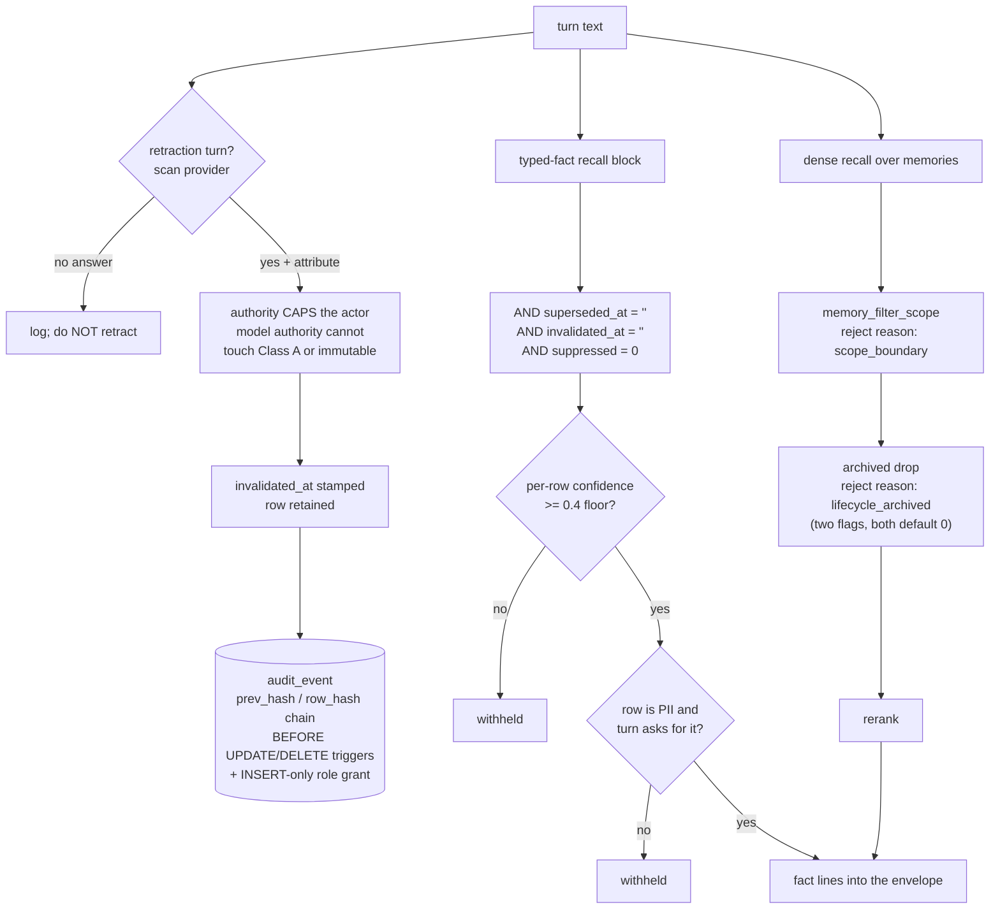

## 1. Executive Summary

aimee is a personal-assistant runtime written mostly in C — roughly 796,000
lines of C and 87,000 lines of headers, with 142,000 lines of Go, 109,000 of
Python and a small TypeScript frontend beside them, across 7,281 commits since
3 June 2026. It is AGPL-3.0. The tree ships two services: `aimee-server`, which
holds the memory of one human, and `aimee-kb`, which holds a corpus and a team's
membership graph.

The memory layer is not one thing. There is an episodic store — a `memories`
table with tiers, salience, surprise, validity bounds and a lifecycle state —
and there is a **typed-fact layer**, a graph of `(source, relation, target)`
edges carrying a confidence class, an authority rank and its own lifecycle
columns. They are written by different paths, read by different queries, and
corrected by different verbs. Most of what this report finds worth reading sits
in the second one.

Five marks. The typed-fact layer excludes superseded, invalidated and suppressed
rows from every recall query it has, unconditionally and behind no flag. The
episodic row carries event-time validity bounds separate from its transaction
timestamps, with a function that answers *was this in force on 12 June*. The
recall path filters candidates by scope and records why it dropped each one. The
audit store is append-only by two independent mechanisms and says out loud which
of them an attacker can remove. And the recall tests are built so that an empty
result fails them.

What the report cannot claim is coverage. At over a million lines this is the
largest tree in the corpus by an order of magnitude, and the sections below
state where the trace stops.

## 2. Mental Model

Two sentences from `docs/KNOWLEDGE.md` set the intent: *"Scope is an
authorization boundary. Promotion into a broader scope is an explicit audited
write,"* and *"Raw text is not treated as a fact merely because a model
extracted it."*

The second is the one the code delivers most completely. A fact arriving from a
model is not the same object as a fact the user stated, and the difference is
carried in the row rather than in a comment. `fact_class_for(authority, gate)`
maps an authenticated user's accepted assertion to Class A at confidence 1.0, a
model's accepted assertion to Class B at 0.6, and anything novel to Class C at
0.4 — which is also the floor. The mapping from provenance to authority is
deliberately narrow:

```c
assert(fact_authority_from_provenance("user_stated") == FACT_AUTHORITY_USER);
assert(fact_authority_from_provenance("agent_message") == FACT_AUTHORITY_MODEL);
assert(fact_authority_from_provenance("web") == FACT_AUTHORITY_MODEL);
assert(fact_authority_from_provenance("User_Stated") == FACT_AUTHORITY_MODEL); /* exact match */
assert(fact_authority_from_provenance("") == FACT_AUTHORITY_MODEL);
assert(fact_authority_from_provenance(NULL) == FACT_AUTHORITY_MODEL);
```

Every failure mode — wrong case, empty, null — lands on model authority. That is
the fail-closed direction, and the test asserts it in all six forms.

## 3. Architecture



The two recall paths converge on the same prompt envelope but share no gate. A
fact withheld for low confidence and a memory withheld for scope are refused by
different code, and neither refusal is silent — both write a reject reason into
the recall trace.

## 4. Essential Implementation Paths

**Turn-time retraction.** `db2_fact_ingest_turn` scans the turn for a retraction
intent, and the surrounding comment is explicit that extraction is *not* on this
path: *"Fact EXTRACTION is offline-only (the memory_facts drain runs pattern +
LLM), so we do NOT run db2_fact_ingest_text() on the turn hot path."* Retraction
stays synchronous because it is a cheap Postgres write with no model in it.

**Retraction storage.** `db2_fact_retract(source, relation, target, authority)`
normalises the relation, looks up its `correction_behavior` on the seeded
relation type, refuses when that behaviour is `CORR_IMMUTABLE` and the caller is
not a user authority, and otherwise calls `db2_fact_mutation_invalidate`. The
key is the triple. There is no row id anywhere in the call.

**Recall exclusion.** Every query in `fact_recall.c` that assembles the fact
block carries the same predicate. `db2_fact_current_count` shows the full
shape:

```sql
SELECT COUNT(*) FROM entity_edges
 WHERE (source = ?1 OR target = ?2) AND edge_class = 'semantic'
   AND superseded_at = '' AND invalidated_at = '' AND suppressed = 0
   AND lifecycle_state IN ('persistent','promoted')
```

Four separate ways for a fact to be excluded, all read together, none of them
optional.

## 5. Memory Data Model

The `memories` row carries thirty columns. The ones that matter here are
`lifecycle_state` (defaulting to `active`, with `archive_reason` and `ttl_at`
beside it), `valid_from` and `valid_until` held apart from `created_at` and
`updated_at`, `contradiction_group` and `merged_into`, and a `negation_tokens`
column for negative-polarity recall. `confidence`, `evidence_strength`,
`salience` and `surprise` are floats and are not the trust state; the state is
the enum.

`memory_provenance` records `(memory_id, session_id, action, details,
created_at)`. `memory_conflicts` pairs two memory ids with a detection time, a
`resolved` flag and a free-text `resolution`.

The typed-fact side lives in `entity_edges` with `fact_graph_changes` recording
commits, and `fact_evidence` carrying a `stance` — a supporting or opposing
citation is a row, not a score adjustment.

## 6. Retrieval Mechanics

Dense recall routes through pgvector; the direct SQL collector was removed and
the header says where it went. Around it sit a lexical fallback, relation-token
matching over the fact graph, and session-window expansion in both directions
around a hit.

Two filters run before rerank. `memory_filter_scope` drops candidates whose
scope does not match, calling `memory_scope_matches`, which returns 1 when no
scope was requested — so the boundary holds only when the caller supplies one.
Then, when both `memory_lifecycle_enabled` and `memory_lifecycle_hide_archived`
are set, archived candidates are batch-probed and dropped. Both accessors read
a config number into a variable initialised to 0 and ignore the read's return
code, so an unset key is off.

There is a third expression that is *not* a filter and should not be read as
one. `DB2_MEMORY_SCOPE_RANK_SQL` orders results — active project, active
workspace, shared or global including legacy untagged rows, then explicit-all
others — and its own instruction to callers is to place it *before* their
relevance ordering and `LIMIT`. It changes which rows survive a cap. It excludes
nothing.

## 7. Write Mechanics

Retraction is where this system has done its hardest thinking, and it did it
after being wrong three times. All three corrections are recorded in comments in
`fact_ingest.c`, and they are worth quoting because each is a shape this atlas
finds elsewhere without the diagnosis attached.

The first is a master flag:

> *"It used to sit behind config.typed_facts_enabled, a master gate that
> defaulted OFF and turned the whole layer — retraction, recall, class keying —
> into a silent no-op. A gate that silently disables a correctness feature is
> worse than no feature: this one returned 0 here, so a turn asking to forget a
> fact completed normally with the fact still standing and nothing logged."*

The second is authority ordering. The code used to resolve the actor from the
request first and fall back to the declared authority — but the request
resolver returns user authority for any authenticated principal, so a
model-composed query inside an authenticated human's session inherited the
human's rank. The measured consequence is in the comment: a Class A row at
authority rank 30 went from `persistent` to `invalidated` on the agent's own
*"please forget my email."* The fix inverts the relation, and the comment states
it as a rule in capitals: the declared authority **caps** the actor; it is not a
fallback for it.

The third is a discarded return code:

> *"A REFUSED RETRACTION IS NOT A SUCCESSFUL ONE, and this used to discard the
> difference … every one of them was thrown away with a (void) cast. The turn
> then completed normally with the fact still standing, so 'I forgot it' and 'I
> refused to forget it' looked identical from outside and left nothing in the
> log."*

And the detail that makes it a testing finding rather than a coding one: the
failure *"presented only as a unit-test count assertion three layers away with
no indication that the mutation had been declined at all"* — and it succeeded
under the SQLite shim while failing under real Postgres. A backend substitution
hid a refusal from the only assertion watching for it.

The current code logs `-2` (annotate-only target) and `-1` (policy needing
operator authority, or a failed write) distinctly, and treats neither as an
error, on the stated ground that refusals are legitimate outcomes — *"What it
must not do is stay silent."*

## 8. Agent Integration

An MCP call table exposes memory operations including `memory_provenance`, which
returns the mutation history of a single memory id to the agent. The CLI mirrors
the RPC surface, with `aimee memory get <id> --as-of <timestamp>` carrying the
event-time query. A Go control plane and several compose topologies sit around
the two services.

The `facts.retract` request accepts an `authority` field, and the boundary that
handles it is documented as the only place it may be resolved:

> *"`authority` reaches here ALREADY RESOLVED against the caller's
> authentication by the request boundary that has it … It is not a field a
> client can set on the way in; do not add a path that forwards a request body's
> value here unresolved."*

At the server edge, a request asking for user authority gets it only when
`server_account_is_person(account)` agrees.

## 9. Reliability, Safety, and Trust

The audit store is the strongest implementation of this shape in the corpus.
`audit_worm.c` builds a hash chain: each row's `row_hash` is an HMAC-SHA256 over
a length-prefixed injective encoding of the record and the previous hash, a
single-writer mutex keeps `seq` gap-free and totally ordered, and `ts` is
deliberately excluded from the hashed material. Triggers block `UPDATE` and
`DELETE`. The Postgres twin adds triggers of its own plus a writer role granted
only `INSERT` and `SELECT`.

What earns the description is the comment distinguishing the layers: the
triggers *"are NOT the adversarial guarantee (a process with file write access
can drop them) — that is the hash-chain."* Most audit implementations in this
corpus assert their own tamper-resistance. This one names which half of it an
attacker can remove.

Row-level security on `aimee-kb` is enabled and `FORCE`d on `kb_team`,
`kb_project`, `kb_team_membership`, `kb_project_membership` and `kb_admin_grant`
— the policy data itself. The content policies over `kb_documents` and
`kb_file_index` exist, use `kb_content_project_visible(project)`, and ship
disabled: enabling them is described as an act rather than a migration, to be
performed after rows have been attributed to projects. Shipping a control off
with the enabling step named is a defensible choice and an unusual one; the
consequence for a reader is that project visibility on documents is not on until
someone turns it on. No `CREATE POLICY` names a memory table at this pin.

## 10. Tests, Evals, and Benchmarks

`test_fact_recall.c` is 210 lines and is the best-constructed negative
retrieval test this atlas has read. Two user facts are committed, one normal and
one PII-sensitive. Then:

```c
int n = db2_fact_recall_block("user", 0, buf, sizeof(buf));
assert(n == 1);
assert(strstr(buf, "works_for: acme") != NULL);
assert(strstr(buf, "age: 30") == NULL);
```

The positive and the negative are asserted over the same buffer, so a recall
returning nothing fails the test instead of passing it. The next block flips the
sensitivity request and asserts the PII fact now appears — proving the gate
admits as well as withholds. A third case inserts an over-long row and asserts
it is skipped rather than truncated into the prompt.

The fourth case is the one to copy. A below-floor row is inserted and asserted
absent while its high-confidence neighbours are asserted present, and the
comment says why the fixture is shaped that way: *"a gate that read one row's
confidence for all of them would agree with all of the above."* The test is
constructed specifically to fail a whole-block implementation that would satisfy
every earlier assertion.

`docs/validation/flag-rollout-readiness.md` deserves its own paragraph. It
tracks every default-off flag against a six-point gate for flipping it on,
requiring an A/B harness isolating that one flag on a real labelled corpus with
numeric acceptance criteria *pinned before the run*, shadow mode for anything
that blocks, and a documented rollback. It records that only two flags have ever
been flipped, both via a written validation report. And it contains a
ground-truth wiring audit: every default-off flag grepped for production readers
excluding config and test files, sorted into **WIRED** — gating real behaviour,
blocked on measurement rather than code — and **INERT TOGGLE**, where *"the
`*_enabled` field is never read in production."* The count is published: five
inert toggles, no fully-dead features.

That is this atlas's producer check, run by a project on itself, with the
negative result written down rather than quietly fixed. The archived-hiding flag
this report describes appears in that table, marked as not yet cleared and
awaiting a recall-with-archival A/B.

## 11. For Your Own Build

Four things here transfer.

**Make the declared authority a cap, not a default.** The bug aimee measured —
a model-composed string inheriting an authenticated human's rank because the
request context existed — is available to any system that resolves identity
from ambient context with a structural label as fallback. Inverting it costs
one branch.

**Give a refusal a distinct return value and log it.** A forget that refuses and
a forget that succeeds must not look identical from outside. aimee's version of
this bug survived because the only assertion watching it counted rows three
layers away, and because a SQLite shim accepted what Postgres refused.

**Assert a negative beside a positive on the same buffer.** The pattern in
`test_fact_recall.c` costs one extra line per case and removes the entire class
of exclusion tests that pass because nothing was returned.

**Say which layer of your tamper-resistance an attacker can remove.** A hash
chain and a trigger are not the same guarantee. Naming the difference in the
file is worth more than either.

## 12. Open Questions

Three, and the first is the honest limit of this reading.

**Coverage.** This is a tree of over a million lines. The trace here covers the
typed-fact layer, the episodic recall path, the audit store and the scope
plumbing. It does not cover the Go control plane, the Python tooling, the
ingest workers, or the great majority of the 243 tables in the schema. Absence
of a mechanism from this report is not evidence of its absence from the tree.

**Whether memory mutations reach the WORM chain.** The RPC dispatch table in
`kb_service.c` carries `memory.store`, `memory.delete`, `memory.supersede` and
`memory.update`. Confirmed WORM producers at this pin are vault rewrap,
guardrail actions, management operations and the durable observability sink.
The path from a memory mutation to `audit_worm_append` was not traced. The mark
rests on `memory_provenance` — a named per-memory mutation record with a read
surface — and on the WORM store's own construction, not on a traced join
between them.

**Whether a retracted triple can be re-asserted.** Retraction stamps
`invalidated_at` and keys on `(source, relation, target)`, which is the right
key. But nothing found in the offline extraction path consults the invalidated
set before asserting, so a later drain that re-extracts the same triple from new
text appears able to re-establish it. This is why the `tombstone` mark is not
awarded: the retention is there, the value-keying is there, and the consultation
that would make a refusal durable was not found. A single predicate in the
assert path — refuse a triple whose invalidated twin outranks the incoming
authority — would close it.

## Appendix: File Index

| Path | What it holds |
| --- | --- |
| `src/modules/db2/c/fact_recall.c` | Every typed-fact recall query, each opening with the exclusion predicate |
| `src/modules/db2/c/fact_lifecycle.c` | `db2_fact_retract`, the immutable-relation guard, the current-count query |
| `src/modules/db2/c/fact_ingest.c` | Turn-time retraction, and the three corrections quoted in section 7 |
| `src/modules/db2/c/memory_lifecycle.h` | The five-state episodic vocabulary and `db2_memory_valid_at` |
| `src/modules/db2/c/memory_scope_query.h` | `DB2_MEMORY_SCOPE_RANK_SQL` — the ordering expression, not a filter |
| `src/modules/memory/memory_core_search_b.c` | `memory_filter_scope` and `memory_scope_matches` |
| `src/modules/memory/memory_core_search_c.c` | The recall pipeline: scope filter, lifecycle drop, rerank |
| `src/modules/audit/audit_worm.c` | The hash-chained append-only store, 710 lines |
| `src/modules/db2/c/schema.sql` | 243 tables, the RLS block, and the Postgres audit twin |
| `src/server/server_facts.c` | The `facts.retract` boundary and its authority resolution |
| `src/tests/test_fact_recall.c` | The paired positive/negative exclusion cases |
| `docs/validation/flag-rollout-readiness.md` | The six-point flip gate and the WIRED / INERT TOGGLE audit |

## History

**2026-08-25** — [`958af1c59f2db825d348d19209fb339615ed9ae5`](https://github.com/RakuenSoftware/aimee/commit/958af1c59f2db825d348d19209fb339615ed9ae5) — first reading, roughly 796,000 lines of C and 87,000 of headers plus 142,000 of Go and 109,000 of Python, 7,281 commits since 3 June 2026, AGPL-3.0. Screened before anything was read: one auto-run surface, one build-time execution, three unpinned surfaces and two files inside the seven-day cooldown; nothing was installed, nothing was compiled and no service was started, so every claim here comes from reading the tree. Five marks. `trust_state` rests on two discrete vocabularies held apart from the confidence floats beside them, with the typed-fact exclusion applied by every recall query behind no flag. `bitemporal` rests on `valid_from`/`valid_until` held separately from `created_at`/`updated_at` and read by `db2_memory_valid_at`, reachable as `--as-of`. `scope_enforced` rests on `memory_filter_scope` dropping candidates before rerank, with row-level security forced on the membership tables beside it. `audit_log` rests on the hash-chained WORM store and the per-memory `memory_provenance` rows; the path from a memory RPC to `audit_worm_append` was not traced, and section 12 says so. `negative_eval` rests on four exclusion cases in `test_fact_recall.c`, each paired with a positive over the same buffer. `tombstone` is withheld on one missing consultation: retraction retains the row and keys on the triple, which is the right key, but nothing in the offline extraction drain reads the invalidated set before asserting. `human_review` is absent — the `pending` state expires on a TTL sweep rather than a decision, and `memory_conflicts.resolution` is closed by the agent under a directive. This is the largest checkout in the corpus; the reading covers the typed-fact layer, the episodic recall path, the audit store and the scope plumbing, and not the Go control plane, the Python tooling, the ingest workers, or most of the 243 tables in the schema.
