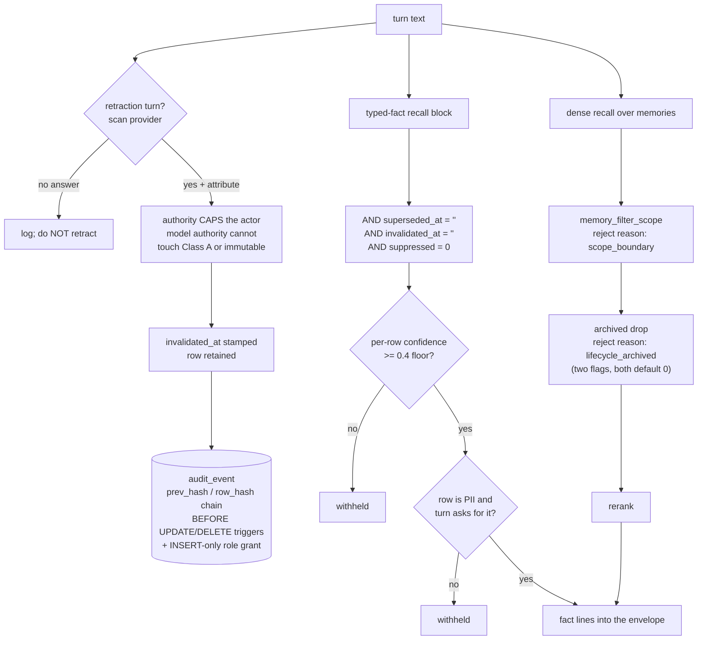

## 1. Executive Summary

aimee is a personal-assistant runtime written mostly in C — roughly 796,000
lines of C and 87,000 lines of headers, with 142,000 lines of Go, 109,000 of
Python and a small TypeScript frontend beside them, across 7,281 commits since
3 June 2026. It is AGPL-3.0. The tree ships two services: `aimee-server`, which
holds the memory of one human, and `aimee-kb`, which holds a corpus and a team's
membership graph.

The memory layer is not one thing. There is an episodic store — a `memories`
table with tiers, salience, surprise, validity bounds and a lifecycle state —
and there is a **typed-fact layer**, a graph of `(source, relation, target)`
edges carrying a confidence class, an authority rank and its own lifecycle
columns. They are written by different paths, read by different queries, and
corrected by different verbs. Most of what this report finds worth reading sits
in the second one.

Five marks. The typed-fact layer excludes superseded, invalidated and suppressed
rows from every recall query it has, unconditionally and behind no flag. The
episodic row carries event-time validity bounds separate from its transaction
timestamps, with a function that answers *was this in force on 12 June*. The
recall path filters candidates by scope and records why it dropped each one. The
audit store is append-only by two independent mechanisms and says out loud which
of them an attacker can remove. And the recall tests are built so that an empty
result fails them.

What the report cannot claim is coverage. At over a million lines this is the
largest tree in the corpus by an order of magnitude, and the sections below
state where the trace stops.

## 2. Mental Model

Two sentences from `docs/KNOWLEDGE.md` set the intent: *"Scope is an
authorization boundary. Promotion into a broader scope is an explicit audited
write,"* and *"Raw text is not treated as a fact merely because a model
extracted it."*

The second is the one the code delivers most completely. A fact arriving from a
model is not the same object as a fact the user stated, and the difference is
carried in the row rather than in a comment. `fact_class_for(authority, gate)`
maps an authenticated user's accepted assertion to Class A at confidence 1.0, a
model's accepted assertion to Class B at 0.6, and anything novel to Class C at
0.4 — which is also the floor. The mapping from provenance to authority is
deliberately narrow:

```c
assert(fact_authority_from_provenance("user_stated") == FACT_AUTHORITY_USER);
assert(fact_authority_from_provenance("agent_message") == FACT_AUTHORITY_MODEL);
assert(fact_authority_from_provenance("web") == FACT_AUTHORITY_MODEL);
assert(fact_authority_from_provenance("User_Stated") == FACT_AUTHORITY_MODEL); /* exact match */
assert(fact_authority_from_provenance("") == FACT_AUTHORITY_MODEL);
assert(fact_authority_from_provenance(NULL) == FACT_AUTHORITY_MODEL);
```

Every failure mode — wrong case, empty, null — lands on model authority. That is
the fail-closed direction, and the test asserts it in all six forms.

## 3. Architecture



The two recall paths converge on the same prompt envelope but share no gate. A
fact withheld for low confidence and a memory withheld for scope are refused by
different code, and neither refusal is silent — both write a reject reason into
the recall trace.

## 4. Essential Implementation Paths

**Turn-time retraction.** `db2_fact_ingest_turn` scans the turn for a retraction
intent, and the surrounding comment is explicit that extraction is *not* on this
path: *"Fact EXTRACTION is offline-only (the memory_facts drain runs pattern +
LLM), so we do NOT run db2_fact_ingest_text() on the turn hot path."* Retraction
stays synchronous because it is a cheap Postgres write with no model in it.

**Retraction storage.** `db2_fact_retract(source, relation, target, authority)`
normalises the relation, looks up its `correction_behavior` on the seeded
relation type, refuses when that behaviour is `CORR_IMMUTABLE` and the caller is
not a user authority, and otherwise calls `db2_fact_mutation_invalidate`. The
key is the triple. There is no row id anywhere in the call.

**Recall exclusion.** Every query in `fact_recall.c` that assembles the fact
block carries the same predicate. `db2_fact_current_count` shows the full
shape:

```sql
SELECT COUNT(*) FROM entity_edges
 WHERE (source = ?1 OR target = ?2) AND edge_class = 'semantic'
   AND superseded_at = '' AND invalidated_at = '' AND suppressed = 0
   AND lifecycle_state IN ('persistent','promoted')
```

Four separate ways for a fact to be excluded, all read together, none of them
optional.

## 5. Memory Data Model

The `memories` row carries thirty columns. The ones that matter here are
`lifecycle_state` (defaulting to `active`, with `archive_reason` and `ttl_at`
beside it), `valid_from` and `valid_until` held apart from `created_at` and
`updated_at`, `contradiction_group` and `merged_into`, and a `negation_tokens`
column for negative-polarity recall. `confidence`, `evidence_strength`,
`salience` and `surprise` are floats and are not the trust state; the state is
the enum.

`memory_provenance` records `(memory_id, session_id, action, details,
created_at)`. `memory_conflicts` pairs two memory ids with a detection time, a
`resolved` flag and a free-text `resolution`.

The typed-fact side lives in `entity_edges` with `fact_graph_changes` recording
commits, and `fact_evidence` carrying a `stance` — a supporting or opposing
citation is a row, not a score adjustment.

## 6. Retrieval Mechanics

Dense recall routes through pgvector; the direct SQL collector was removed and
the header says where it went. Around it sit a lexical fallback, relation-token
matching over the fact graph, and session-window expansion in both directions
around a hit.

Two filters run before rerank. `memory_filter_scope` drops candidates whose
scope does not match, calling `memory_scope_matches`, which returns 1 when no
scope was requested — so the boundary holds only when the caller supplies one.
Then, when both `memory_lifecycle_enabled` and `memory_lifecycle_hide_archived`
are set, archived candidates are batch-probed and dropped. Both accessors read
a config number into a variable initialised to 0 and ignore the read's return
code, so an unset key is off.

Scope reaches the SQL as two macros that are easy to confuse and are used
together. `DB2_MEMORY_SCOPE_RANK_SQL` is an ordering expression — active
project 3, active workspace 2, shared or global including legacy untagged rows
1, everything else 0 — placed before the caller's own relevance ordering and
`LIMIT`. `DB2_MEMORY_SCOPE_FILTER_SQL` wraps the same expression as a `WHERE`
predicate, `AND (?101 = 0 OR ?102 = 1 OR (rank) > 0)`, and it is the one doing
the excluding. Both the lexical readers in `memory_briefing.c` and
`memory_relations.c` and the dense path in `pgvec_transport.c` apply the filter
in the `WHERE` and the rank in the `ORDER BY`, so a row outside the caller's
scope is dropped rather than merely sorted last.

The two escapes in that predicate are worth reading. `?101 = 0` is an inactive
scope context and `?102 = 1` is `include_all`; either short-circuits the check
before the rank is evaluated, so an unset context returns everything. That is
the opposite default from the RLS block in the same schema, whose comment makes
a point of fail-closing on an unset GUC.

## 7. Write Mechanics

Retraction is where this system has done its hardest thinking, and it did it
after being wrong three times. All three corrections are recorded in comments in
`fact_ingest.c`, and they are worth quoting because each is a shape this atlas
finds elsewhere without the diagnosis attached.

The first is a master flag:

> *"It used to sit behind config.typed_facts_enabled, a master gate that
> defaulted OFF and turned the whole layer — retraction, recall, class keying —
> into a silent no-op. A gate that silently disables a correctness feature is
> worse than no feature: this one returned 0 here, so a turn asking to forget a
> fact completed normally with the fact still standing and nothing logged."*

The second is authority ordering. The code used to resolve the actor from the
request first and fall back to the declared authority — but the request
resolver returns user authority for any authenticated principal, so a
model-composed query inside an authenticated human's session inherited the
human's rank. The measured consequence is in the comment: a Class A row at
authority rank 30 went from `persistent` to `invalidated` on the agent's own
*"please forget my email."* The fix inverts the relation, and the comment states
it as a rule in capitals: the declared authority **caps** the actor; it is not a
fallback for it.

The third is a discarded return code:

> *"A REFUSED RETRACTION IS NOT A SUCCESSFUL ONE, and this used to discard the
> difference … every one of them was thrown away with a (void) cast. The turn
> then completed normally with the fact still standing, so 'I forgot it' and 'I
> refused to forget it' looked identical from outside and left nothing in the
> log."*

And the detail that makes it a testing finding rather than a coding one: the
failure *"presented only as a unit-test count assertion three layers away with
no indication that the mutation had been declined at all"* — and it succeeded
under the SQLite shim while failing under real Postgres. A backend substitution
hid a refusal from the only assertion watching for it.

The current code logs `-2` (annotate-only target) and `-1` (policy needing
operator authority, or a failed write) distinctly, and treats neither as an
error, on the stated ground that refusals are legitimate outcomes — *"What it
must not do is stay silent."*

**Correction is a table, and refusing to admit a value is its own record.**
`memory_rejection_tombstones` holds one row per refused value — `(source,
relation, target)` for a typed fact, `(memory_key, memory_content, scope_type,
scope_value)` for an episodic row — each under a partial unique index restricted
to `active = 1`, so a value has at most one live refusal. `fm_tombstone_blocks`
consults it before the mutation seam admits anything, and the episodic side has
its own consult in `memory_score_fields.c`.

Three properties make it more than a deny-list.

**It is reversible, and the reversal is attributed.** `active`, `restored_at`
and `restored_by` mean a refusal can be lifted by a named actor rather than
standing forever, and `kb_handle_memory_restore` resolves the actor from the
request and refuses unless `actor.authenticated`. Rejection carries a `reason`
and a `rejected_by` in the same way.

**The runtime cannot erase it.** A shipped Postgres check refuses the
configuration outright when the role that runs the system could destroy the
record:

```sql
IF has_table_privilege(current_user,'memory_rejection_tombstones','DELETE') OR
   has_table_privilege(current_user,'memory_rejection_tombstones','TRUNCATE') OR
   NOT has_table_privilege(current_user,'memory_rejection_tombstones','SELECT,INSERT,UPDATE') THEN
  RAISE EXCEPTION 'memory tombstone runtime privileges permit erasure or prevent review';
```

Most tombstones in this corpus are append-only by convention. This one asserts
the grant, and the error message names both failure directions — a role that can
erase the record, and a role that cannot read it for review.

**And the typed-fact seam had the property structurally before the table
existed.** `fm_load_exact` looks up an incoming triple *without* filtering by
lifecycle, so a re-assertion finds the invalidated row rather than missing it,
and revival is gated on rank:

```c
int reactivate = (exact.lifecycle == INVALIDATED || exact.lifecycle == SUPERSEDED)
                 && (int)actor->rank >= exact.authority_rank;
```

A model-authority extractor cannot raise what a user-authority actor
invalidated. When the gate refuses, or when any surviving incumbent outranks the
actor on a functional relation, the value lands as a quarantined candidate
rather than as a live fact. That is the atlas's rejected-value tombstone written
as a lookup that declines to filter — the consultation lives in the chokepoint
every assert passes rather than in the extraction path that produces them.

## 8. Agent Integration

An MCP call table exposes memory operations including `memory_provenance`, which
returns the mutation history of a single memory id to the agent. The CLI mirrors
the RPC surface, with `aimee memory get <id> --as-of <timestamp>` carrying the
event-time query. A Go control plane and several compose topologies sit around
the two services.

The `facts.retract` request accepts an `authority` field, and the boundary that
handles it is documented as the only place it may be resolved:

> *"`authority` reaches here ALREADY RESOLVED against the caller's
> authentication by the request boundary that has it … It is not a field a
> client can set on the way in; do not add a path that forwards a request body's
> value here unresolved."*

At the server edge, a request asking for user authority gets it only when
`server_account_is_person(account)` agrees.

## 9. Reliability, Safety, and Trust

The audit store is the strongest implementation of this shape in the corpus.
`audit_worm.c` builds a hash chain: each row's `row_hash` is an HMAC-SHA256 over
a length-prefixed injective encoding of the record and the previous hash, a
single-writer mutex keeps `seq` gap-free and totally ordered, and `ts` is
deliberately excluded from the hashed material. Triggers block `UPDATE` and
`DELETE`. The Postgres twin adds triggers of its own plus a writer role granted
only `INSERT` and `SELECT`.

What earns the description is the comment distinguishing the layers: the
triggers *"are NOT the adversarial guarantee (a process with file write access
can drop them) — that is the hash-chain."* Most audit implementations in this
corpus assert their own tamper-resistance. This one names which half of it an
attacker can remove.

**A poison gate sits at every boundary where untrusted text becomes prompt
context, and the memory write path is one of them.** `src/headers/integrity.h`
declares a deterministic Layer 1 pattern gate over six source classes —
`USER_STATED`, `WEB`, `DOCUMENT`, `TOOL`, `DELEGATE`, `AGENT_MESSAGE` — returning
one of four verdicts: `ACCEPT`, `QUARANTINE`, `REJECT`, `REVIEW_NEEDED`. The
pattern categories are named for what they attack: `MEMORY_RESET`,
`IDENTITY_OVERRIDE`, `AUTHORITY_CLAIM`, `INSTRUCTION_INJECTION` at block
severity, and `ENCODED_PAYLOAD` at warn.

The asymmetry is the design. A block-severity hit rejects when the source is
anything but the user, and only *quarantines* when it is the user — the header
states the rule as *"never auto-reject user input"*, which keeps a person able
to say a sentence that looks like an attack.

`integrity_ingress_decide` is the materialization boundary, and it is wired at
nine reachable call sites across five named boundaries: `document` for KB ingest
and PDF chunks, `retrieval` on pre-injection, `learning` on the learning router,
`recall` in the KB client, and `memory` three times. The memory sites carry the
argument for why memory is treated as hostile by default:

> Durable memory becomes future prompt context, so treat it as agent-message
> authority unless a future typed ingress carries an authenticated user
> provenance. Ambiguous provenance fails closed.

At the authority-aware site the source is chosen rather than fixed —
`MEMORY_AUTHORITY_USER` maps to `INTEGRITY_SOURCE_USER_STATED`, everything else
to `INTEGRITY_SOURCE_AGENT_MESSAGE`, with the autonomous flag set only for the
non-user case — so a memory the user stated is quarantined where one the agent
wrote is rejected. That a gate also runs on `recall` is the half most systems
omit: a value that got in before the gate existed is still checked on the way
out.

Retention moved off inline SQL in the same window. `db2_memory_health` now calls
`kb_memory_retention_reap(days)` and `kb_memory_sensitivity_retention_reap`,
server-side functions returning the number of rows reaped, rather than issuing a
`DELETE ... WHERE created_at < pg_now_text(?)` from C.

Row-level security on `aimee-kb` is enabled and `FORCE`d on `kb_team`,
`kb_project`, `kb_team_membership`, `kb_project_membership` and `kb_admin_grant`
— the policy data itself. The content policies over `kb_documents` and
`kb_file_index` exist, use `kb_content_project_visible(project)`, and ship
disabled: enabling them is described as an act rather than a migration, to be
performed after rows have been attributed to projects. Shipping a control off
with the enabling step named is a defensible choice and an unusual one; the
consequence for a reader is that project visibility on documents is not on until
someone turns it on. No `CREATE POLICY` names a memory table at this pin.

## 10. Tests, Evals, and Benchmarks

`test_fact_recall.c` is 210 lines and is the best-constructed negative
retrieval test this atlas has read. Two user facts are committed, one normal and
one PII-sensitive. Then:

```c
int n = db2_fact_recall_block("user", 0, buf, sizeof(buf));
assert(n == 1);
assert(strstr(buf, "works_for: acme") != NULL);
assert(strstr(buf, "age: 30") == NULL);
```

The positive and the negative are asserted over the same buffer, so a recall
returning nothing fails the test instead of passing it. The next block flips the
sensitivity request and asserts the PII fact now appears — proving the gate
admits as well as withholds. A third case inserts an over-long row and asserts
it is skipped rather than truncated into the prompt.

The fourth case is the one to copy. A below-floor row is inserted and asserted
absent while its high-confidence neighbours are asserted present, and the
comment says why the fixture is shaped that way: *"a gate that read one row's
confidence for all of them would agree with all of the above."* The test is
constructed specifically to fail a whole-block implementation that would satisfy
every earlier assertion.

`docs/validation/flag-rollout-readiness.md` deserves its own paragraph. It
tracks every default-off flag against a six-point gate for flipping it on,
requiring an A/B harness isolating that one flag on a real labelled corpus with
numeric acceptance criteria *pinned before the run*, shadow mode for anything
that blocks, and a documented rollback. It records that only two flags have ever
been flipped, both via a written validation report. And it contains a
ground-truth wiring audit: every default-off flag grepped for production readers
excluding config and test files, sorted into **WIRED** — gating real behaviour,
blocked on measurement rather than code — and **INERT TOGGLE**, where *"the
`*_enabled` field is never read in production."* The count is published: five
inert toggles, no fully-dead features.

That is this atlas's producer check, run by a project on itself, with the
negative result written down rather than quietly fixed. The archived-hiding flag
this report describes appears in that table, marked as not yet cleared and
awaiting a recall-with-archival A/B.

## 11. For Your Own Build

Four things here transfer.

**Make the declared authority a cap, not a default.** The bug aimee measured —
a model-composed string inheriting an authenticated human's rank because the
request context existed — is available to any system that resolves identity
from ambient context with a structural label as fallback. Inverting it costs
one branch.

**Give a refusal a distinct return value and log it.** A forget that refuses and
a forget that succeeds must not look identical from outside. aimee's version of
this bug survived because the only assertion watching it counted rows three
layers away, and because a SQLite shim accepted what Postgres refused.

**Assert a negative beside a positive on the same buffer.** The pattern in
`test_fact_recall.c` costs one extra line per case and removes the entire class
of exclusion tests that pass because nothing was returned.

**Say which layer of your tamper-resistance an attacker can remove.** A hash
chain and a trigger are not the same guarantee. Naming the difference in the
file is worth more than either.

## 12. Open Questions

Three, and the first is the honest limit of this reading.

**Coverage.** This is a tree of over a million lines. The trace here covers the
typed-fact layer, the episodic recall path, the audit store and the scope
plumbing. It does not cover the Go control plane, the Python tooling, the
ingest workers, or the great majority of the 243 tables in the schema. Absence
of a mechanism from this report is not evidence of its absence from the tree.

**Which of the two ledgers a given mutation reaches.** There are two, and they
are not the same mechanism. The WORM `audit_event` store described in section 9
has confirmed producers in vault rewrap, guardrail actions, management
operations and the durable observability sink; no path from a memory RPC to
`audit_worm_append` was traced. Memory mutations reach the *other* one:
`memory_evidence_events`, written by `AFTER INSERT OR UPDATE OR DELETE`
triggers on `memories`, `docs`, `document_versions`, `entity_registry`,
`entity_aliases`, `rel_types`, `derived_memory_registry`, `memory_scopes` and
`memory_links`, plus `evidence_change_item_event()` on the fact-graph commit
path. Each row carries `authenticated_actor`, `transport_identity`,
`effective_authority`, a `changeset_id`, before and after refs and the source
span and hash, under `CHECK` constraints over a fourteen-value object kind and
a twelve-value operation. Putting the producer in a trigger is the stronger
choice — application code cannot forget to call it — and it means the coverage
question is which tables carry the trigger, not which call sites remember. The
open part is whether the two ledgers are meant to converge, and what an auditor
is supposed to do with a subject whose history is split across them.

**Whether a retracted triple can be re-asserted.** Retraction stamps
`invalidated_at` and keys on `(source, relation, target)`, which is the right
key. But nothing found in the offline extraction path consults the invalidated
set before asserting, so a later drain that re-extracts the same triple from new
text appears able to re-establish it. This is why the `tombstone` mark is not
awarded: the retention is there, the value-keying is there, and the consultation
that would make a refusal durable was not found. A single predicate in the
assert path — refuse a triple whose invalidated twin outranks the incoming
authority — would close it.

## Appendix: File Index

| Path | What it holds |
| --- | --- |
| `src/modules/db2/c/fact_recall.c` | Every typed-fact recall query, each opening with the exclusion predicate |
| `src/modules/db2/c/fact_lifecycle.c` | `db2_fact_retract`, the immutable-relation guard, the current-count query |
| `src/modules/db2/c/fact_ingest.c` | Turn-time retraction, and the three corrections quoted in section 7 |
| `src/modules/db2/c/memory_lifecycle.h` | The five-state episodic vocabulary and `db2_memory_valid_at` |
| `src/modules/db2/c/memory_scope_query.h` | `DB2_MEMORY_SCOPE_RANK_SQL` — the ordering expression, not a filter |
| `src/modules/memory/memory_core_search_b.c` | `memory_filter_scope` and `memory_scope_matches` |
| `src/modules/memory/memory_core_search_c.c` | The recall pipeline: scope filter, lifecycle drop, rerank |
| `src/modules/audit/audit_worm.c` | The hash-chained append-only store, 710 lines |
| `src/modules/db2/c/schema.sql` | 243 tables, the RLS block, and the Postgres audit twin |
| `src/server/server_facts.c` | The `facts.retract` boundary and its authority resolution |
| `src/tests/test_fact_recall.c` | The paired positive/negative exclusion cases |
| `docs/validation/flag-rollout-readiness.md` | The six-point flip gate and the WIRED / INERT TOGGLE audit |

## History

**2026-08-29** — [`eb86dda7f94b7dc3f2ecaf7c981dee6d43eae3e8`](https://github.com/RakuenSoftware/aimee/commit/eb86dda7f94b7dc3f2ecaf7c981dee6d43eae3e8) — re-pinned 42 commits on, still on `testing`, 416 files and roughly 76,500 added lines in two days — most of it release blockers, Windows and macOS build work, CI ratchets and a static-analysis baseline. All seven marks re-verified and none moved.

One change reaches the memory path and it is described in section 9: the deterministic poison gate declared in `src/headers/integrity.h` is now called from `memory_core_crud.c` at two sites and from `memory_advanced.c` at a third, joining `document`, `retrieval`, `learning` and `recall` for nine reachable call sites. The comment at the memory site states the reasoning — durable memory becomes future prompt context, so it is treated as agent-message authority and ambiguous provenance fails closed — and the authority-aware site picks `USER_STATED` over `AGENT_MESSAGE` from the memory's own authority, which is the difference between quarantining a user's odd sentence and rejecting an agent's. Retention also moved from inline `DELETE` statements to the server-side `kb_memory_retention_reap` and `kb_memory_sensitivity_retention_reap` functions, each returning a reaped count.

Screened before reading: one auto-run surface (`.claude/hooks/`), one build-time execution surface, three unpinned surfaces and five files inside the seven-day cooldown; nothing was installed and nothing was run.

**2026-08-27** — [`bdf19051cd0541f1e9f3e008a570998c37f77774`](https://github.com/RakuenSoftware/aimee/commit/bdf19051cd0541f1e9f3e008a570998c37f77774) — re-pinned 47 commits on, still on `testing`. Screened again: one auto-run surface, one build-time execution surface, three unpinned surfaces, two files inside the seven-day cooldown; nothing was installed or built. No mark moved.

The change worth recording is a whole class of silent failure closed at once. Removing an `AIMEE_DB2_DISABLED` fork left sixteen memory files that reach the relational store and *"say nothing when it is gone"* — and the fork had been the reporting mechanism: *"the disabled branch returned 'memory storage unavailable', so deleting it removed the only signal. Empty then becomes indistinguishable from a genuine absence — a search that finds nothing, an entity with no edges, a key with no history all look identical to an outage."*

Two details in the repair are the transferable part. The probe *"sits on read paths where empty is genuinely ambiguous, not on write paths where 0 frequently means success and an early return would report a failed write as a clean one"* — the fix is applied where the ambiguity is, rather than uniformly. And the sentinel is chosen per function against that function's own vocabulary: `0` for the count-returning searches, `NULL` for context assembly, a plain return for the void refreshes, and `-1` for lifecycle counts, the maintenance run and the profile-card build, which already use `-1` for failure and *"must not report a store outage as a clean maintenance pass or an entity with no observations."*

Also in range: every content-carrying KB write is screened, server state moved to Postgres with the SQLite WORM store isolated, and candidate ranking collapsed from one statement per candidate to one statement.

**2026-08-26** — [`6a1b61a99c9cac5273ccf6c26d2a6a185a6985bd`](https://github.com/RakuenSoftware/aimee/commit/bdf19051cd0541f1e9f3e008a570998c37f77774) — re-pinned 231 commits on. **The branch needs stating, because its name misleads.** `origin/HEAD` points at `testing`: it is the repository's default branch and its trunk. `main` sits 2,719 commits behind it and was last touched on 3 August 2026. The previous pin was already an ancestor of `testing`, so this is an ordinary re-pin on the same line of development rather than a move to an experimental branch. Screened again before reading: one auto-run surface — a `.claude/hooks/` directory that did not exist at the previous pin — one build-time execution surface, three unpinned surfaces and two files inside the seven-day cooldown; nothing was installed and nothing was built.

Two marks added, to seven of seven. Several other systems already carried all seven — [memsem](../memsem/), [Perseus Vault](../perseus-vault/), [Plur1bus](../plur1bus/), [Provem](../provem/) and [Verel](../verel/) — so this is the sixth, and the first note written about it here claimed otherwise before the count was run.

**`tombstone` was earnable at the previous pin and was missed.** `fm_load_exact` looks up an incoming triple with no lifecycle predicate, so a re-assertion finds the invalidated row; `reactivate` then requires `actor->rank >= exact.authority_rank`, so a model-authority extractor cannot raise what a user-authority actor invalidated, and a refused revival lands as a quarantined candidate. That code is present at `958af1c5`. The previous reading searched the offline extraction drain for something that consults an invalidated set, found nothing there, and concluded the property was absent — while the consultation sits in the mutation seam every assert passes, expressed as a lookup that declines to filter. It is the third time a reading of this system has looked in the place named for a mechanism instead of the chokepoint, after the scope filter and the evidence ledger, and the project's own proposal states the property plainly: *"the exact-match lookup deliberately does not filter by lifecycle, so a re-assertion finds the dead row, and revival is gated on actor authority rank."*

What is genuinely new is the generalisation. `memory_rejection_tombstones` extends the property to episodic rows, keys each object kind on its own value tuple under a partial unique index on `active=1`, is consulted by `fm_tombstone_blocks` before an assert, and carries `reason`, `rejected_by`, `restored_at` and `restored_by`. A shipped Postgres check refuses to start when the runtime role can `DELETE` or `TRUNCATE` it. Section 8 covers it.

**`human_review`** rests on the same surface read as a review queue: `kb_handle_memory_reject` records a reason against a memory the extractor produced and preserves the row for review rather than deleting it; `idx_memory_rejection_review` orders `(active, object_kind, rejected_at DESC)`; and `kb_handle_memory_restore` refuses unless `db2_fact_actor_from_request` returns an authenticated actor, recording `restored_by`. The verdict is durable and gates what the write path admits next.

Also in range and not mark-bearing: the external vector database subsystem was removed outright, memory vector search routes through DB3 with a transport that *"refuses to route a memory search whose scope the wire cannot carry"*, memory row scope is enforced outside RLS, and the WORM chain writer moved to a sidecar. One correction to the record above rather than to the code: the project's own `correction-completeness-and-bounded-reachability.md` opens its §1.2 with *"No negative retrieval assertion — the substrate has suppression, invalidation, quarantine, erasure, scope filtering and lifecycle-filtered views. Nothing asserts that any of it survives contact with the read path."* The `negative_eval` mark here rests on `test_fact_recall.c`, whose paired cases assert a below-floor and a PII-gated row are absent from the rendered block; that is a real read-path assertion and narrower than the coverage the proposal says is missing. Both statements are true and the proposal's is the more demanding one.

**2026-08-25 (same-day correction)** — two errors in the reading above were found and fixed while checking a second source against the same pin. The report had described `DB2_MEMORY_SCOPE_RANK_SQL` as the SQL-side scope mechanism and concluded it "excludes nothing"; that is true of the rank macro and wrong about the system, because `DB2_MEMORY_SCOPE_FILTER_SQL` wraps the same expression as a `WHERE` predicate and both are applied together in `memory_briefing.c`, `memory_relations.c` and `pgvec_transport.c`. Scope on memory rows is a filter, not only an ordering. The report also carried an open question asking whether memory mutations are audited at all, framed around the WORM `audit_event` store; they are, through a different ledger — `memory_evidence_events`, written by `AFTER INSERT OR UPDATE OR DELETE` triggers on nine tables including `memories`. Section 6, section 12 and the `scoping` row are corrected. The marks are unchanged.

**2026-08-25** — [`958af1c59f2db825d348d19209fb339615ed9ae5`](https://github.com/RakuenSoftware/aimee/commit/958af1c59f2db825d348d19209fb339615ed9ae5) — first reading, roughly 796,000 lines of C and 87,000 of headers plus 142,000 of Go and 109,000 of Python, 7,281 commits since 3 June 2026, AGPL-3.0. Screened before anything was read: one auto-run surface, one build-time execution, three unpinned surfaces and two files inside the seven-day cooldown; nothing was installed, nothing was compiled and no service was started, so every claim here comes from reading the tree. Five marks. `trust_state` rests on two discrete vocabularies held apart from the confidence floats beside them, with the typed-fact exclusion applied by every recall query behind no flag. `bitemporal` rests on `valid_from`/`valid_until` held separately from `created_at`/`updated_at` and read by `db2_memory_valid_at`, reachable as `--as-of`. `scope_enforced` rests on `memory_filter_scope` dropping candidates before rerank, with row-level security forced on the membership tables beside it. `audit_log` rests on the hash-chained WORM store and the per-memory `memory_provenance` rows; the path from a memory RPC to `audit_worm_append` was not traced, and section 12 says so. `negative_eval` rests on four exclusion cases in `test_fact_recall.c`, each paired with a positive over the same buffer. `tombstone` is withheld on one missing consultation: retraction retains the row and keys on the triple, which is the right key, but nothing in the offline extraction drain reads the invalidated set before asserting. `human_review` is absent — the `pending` state expires on a TTL sweep rather than a decision, and `memory_conflicts.resolution` is closed by the agent under a directive. This is the largest checkout in the corpus; the reading covers the typed-fact layer, the episodic recall path, the audit store and the scope plumbing, and not the Go control plane, the Python tooling, the ingest workers, or most of the 243 tables in the schema.
