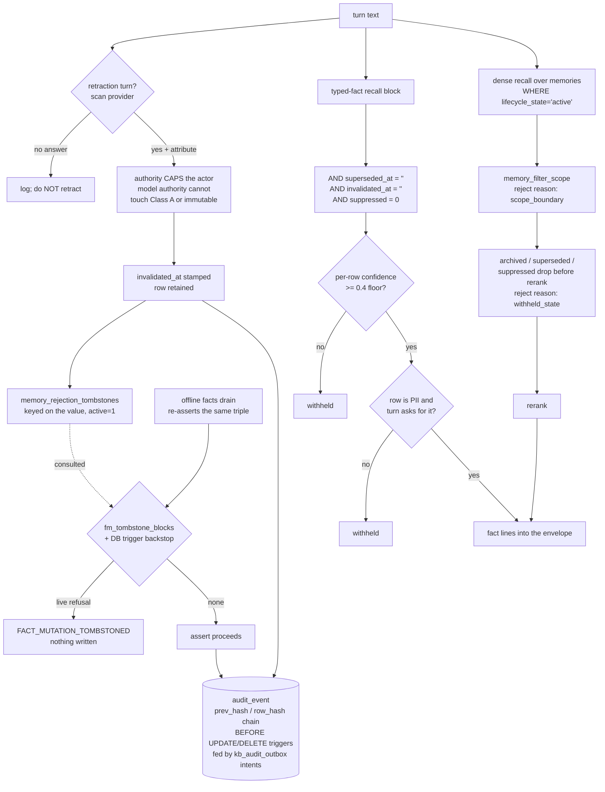

## 1. Executive Summary

aimee is a personal-assistant runtime written mostly in C — roughly 819,000
lines of C and 89,000 lines of headers, with 149,000 lines of Go, 113,000 of
Python and a small TypeScript frontend beside them, across 7,831 commits since
3 June 2026. It is AGPL-3.0. The tree ships two services: `aimee-server`, which
holds the memory of one human, and `aimee-kb`, which holds a corpus and a team's
membership graph.

The memory layer is not one thing. There is an episodic store — a `memories`
table with tiers, salience, surprise, validity bounds and a lifecycle state —
and there is a **typed-fact layer**, a graph of `(source, relation, target)`
edges carrying a confidence class, an authority rank and its own lifecycle
columns. They are written by different paths, read by different queries, and
corrected by different verbs. Most of what this report finds worth reading sits
in the second one.

Seven marks. A refused value gets its own keyed row in
`memory_rejection_tombstones`, consulted at the head of the mutation seam and
repeated as a database trigger underneath it, so a later extraction that
re-asserts the value is declined rather than admitted. The typed-fact layer
excludes superseded, invalidated and suppressed rows from every recall query it
has, unconditionally and behind no flag. The episodic row carries event-time
validity bounds separate from its transaction timestamps, with a function that
answers *was this in force on 12 June*. The recall path filters candidates by
scope and records why it dropped each one, with row-level security under it. A
person rejects and restores memories through three RPCs over one queue, and the
verdict gates what the write path will admit next. The audit store is
append-only by two independent mechanisms, says out loud which of them an
attacker can remove, and receives memory mutations from a trigger in the same
transaction as the row change. And the recall tests are built so that an empty
result fails them.

What the report cannot claim is coverage. At over a million lines this is the
largest tree in the corpus by an order of magnitude, and the sections below
state where the trace stops.

## 2. Mental Model

Two sentences from `docs/KNOWLEDGE.md` set the intent: *"Scope is an
authorization boundary. Promotion into a broader scope is an explicit audited
write,"* and *"Raw text is not treated as a fact merely because a model
extracted it."*

The second is the one the code delivers most completely. A fact arriving from a
model is not the same object as a fact the user stated, and the difference is
carried in the row rather than in a comment. `fact_class_for(authority, gate)`
maps an authenticated user's accepted assertion to Class A at confidence 1.0, a
model's accepted assertion to Class B at 0.6, and anything novel to Class C at
0.4 — which is also the floor. The mapping from provenance to authority is
deliberately narrow:

```c
assert(fact_authority_from_provenance("user_stated") == FACT_AUTHORITY_USER);
assert(fact_authority_from_provenance("agent_message") == FACT_AUTHORITY_MODEL);
assert(fact_authority_from_provenance("web") == FACT_AUTHORITY_MODEL);
assert(fact_authority_from_provenance("document") == FACT_AUTHORITY_MODEL);
assert(fact_authority_from_provenance("tool") == FACT_AUTHORITY_MODEL);
assert(fact_authority_from_provenance("delegate") == FACT_AUTHORITY_MODEL);
assert(fact_authority_from_provenance("synthesis") == FACT_AUTHORITY_MODEL);
assert(fact_authority_from_provenance("User_Stated") == FACT_AUTHORITY_MODEL); /* exact match */
assert(fact_authority_from_provenance("") == FACT_AUTHORITY_MODEL);
assert(fact_authority_from_provenance(NULL) == FACT_AUTHORITY_MODEL);
```

One string maps to user authority and nine do not. Every failure mode — wrong
case, empty, null — lands on model authority, which is the fail-closed
direction, and `test_fact_lifecycle.c:166-175` asserts it in all ten forms.

## 3. Architecture



The two recall paths converge on the same prompt envelope but share no gate. A
fact withheld for low confidence and a memory withheld for scope are refused by
different code, and neither refusal is silent — both write a reject reason into
the recall trace.

## 4. Essential Implementation Paths

**Turn-time retraction.** `db2_fact_ingest_turn` scans the turn for a retraction
intent, and the surrounding comment is explicit that extraction is *not* on this
path: *"Fact EXTRACTION is offline-only (the memory_facts drain runs pattern +
LLM), so we do NOT run db2_fact_ingest_text() on the turn hot path."* Retraction
stays synchronous because it is a cheap Postgres write with no model in it.

**Retraction storage.** `db2_fact_retract(source, relation, target, authority)`
normalises the relation, looks up its `correction_behavior` on the seeded
relation type, refuses when that behaviour is `CORR_IMMUTABLE` and the caller is
not a user authority, and otherwise calls `db2_fact_mutation_invalidate`. The
key is the triple. There is no row id anywhere in the call. Per invalidated row
that function does two things rather than one: it stamps `invalidated_at` and
bumps `version`, and it calls `fm_tombstone_add_assertion(conn, id, actor,
"explicit fact invalidation")`, which copies the row's `(source, relation,
target)` into `memory_rejection_tombstones` under the actor's rank. A retraction
therefore leaves both a dead row and a keyed refusal.

**Admission.** `db2_fact_mutation_assert` opens a transaction, backfills
identity, and calls `fm_tombstone_blocks(conn, in->source, in->relation,
in->target)` before it reads or writes anything else; a live refusal aborts the
transaction and returns `FACT_MUTATION_TOMBSTONED`. The same call guards the
approve arm of `db2_fact_mutation_review`. On the episodic side
`db2_memory_rejection_blocks(key, content)` scopes the same test by the thread's
current scope context and is called from both `db2_memory_row_insert_epistemic_ex`
and `memory_core_crud.c`.

**Recall exclusion.** Every query in `fact_recall.c` that assembles the fact
block carries the same predicate. `db2_fact_current_count` shows the full
shape:

```sql
SELECT COUNT(*) FROM entity_edges
 WHERE (source = ?1 OR target = ?2) AND edge_class = 'semantic'
   AND superseded_at = '' AND invalidated_at = '' AND suppressed = 0
   AND lifecycle_state IN ('persistent','promoted')
```

Four separate ways for a fact to be excluded, all read together, none of them
optional.

## 5. Memory Data Model

The `memories` row carries forty-five stored columns once the schema's own
`ALTER TABLE` additions have run, plus three generated full-text columns. The
ones that matter here are `lifecycle_state` (defaulting to `active`, with
`archive_reason` and `ttl_at` beside it), `activation_suppressed`, `valid_from`
and `valid_until` held apart from `created_at` and `updated_at`,
`contradiction_group` and `merged_into`, and a `negation_tokens` column for
negative-polarity recall. `confidence`, `evidence_strength`, `salience` and
`surprise` are floats and are not the trust state; the state is the enum.
`confidence_ceiling` is a fourth float and a different kind of thing — a
provenance cap the row carries rather than a score, so model-authored material
cannot climb by being merged or re-exposed.

`memory_rejection_tombstones` is the negative half of the model: `object_kind`
over `('fact','memory')`, the fact tuple and the episodic tuple in the same row
shape, `authority_rank`, `reason`, `rejected_by`, `active`, `rejected_at`,
`restored_at`, `restored_by`. Two partial unique indexes — one per object kind,
each restricted to `active=1` — make one live refusal per value the schema's
own constraint rather than the caller's discipline.

`memory_provenance` records `(memory_id, session_id, action, details,
created_at)`. `memory_conflicts` pairs two memory ids with a detection time, a
`resolved` flag and a free-text `resolution`.

The typed-fact side lives in `entity_edges` with `fact_graph_changes` recording
commits, and `fact_evidence` carrying a `stance` — a supporting or opposing
citation is a row, not a score adjustment.

## 6. Retrieval Mechanics

Dense recall routes through pgvector; the direct SQL collector was removed and
the header says where it went. Around it sit a lexical lane, relation-token
matching over the fact graph, and session-window expansion in both directions
around a hit.

The lexical lane is two queries rather than one. `db2_memory_find_facts_fts`
joins `memories_fts` to `memories` through `rowid` and is tried first;
`db2_memory_find_facts_like`, an unindexed `LOWER(...) LIKE '%…%'` scan over key,
content and use-cases, runs only when the indexed query returns nothing — kept
because *"FTS is word based"* and substring recall would otherwise be lost. What
matters for this report is that both carry `DB2_MEMORY_RECALL_FILTER_SQL` and
`DB2_MEMORY_SCOPE_RANK_SQL` in the same statement, so the lifecycle exclusion and
the scope rank travel with the lane rather than being reapplied around it, and
the substring fallback cannot admit what the indexed path would have excluded.

Sub-query expansion feeds the same array from its own lists. Both decomposition
stages — the heuristic one in `memory_generate_candidates` and the LLM one in
`memory_find_facts_scoped_impl` — collect each fragment into a private buffer and
merge with `memory_candidates_merge_interleaved`, taking rank 0 from every list
before any list's rank 1, on the stated ground that appending whole lists in turn
let the first fragment *"spend the remaining pool capacity and evict what the
later sub-questions found."* The lane-membership globals are saved and restored
around the fragment passes, because a floor built from a fragment is not the
floor the caller asked for. The scope filter runs after the merge, on everything.

Two filters run before rerank. `memory_filter_scope` drops candidates whose
scope does not match, calling `memory_scope_matches`, which returns 1 when no
scope was requested — so the boundary holds only when the caller supplies one.
Then the surviving candidate ids are batch-probed through
`db2_memory_filter_archived_ids`, whose predicate is `lifecycle_state IN
('archived','superseded') OR activation_suppressed<>0`, and any hit is dropped
with the reject reason `withheld_state`. That block sits under a comment stating
the rule — *"Negative retrieval is unconditional: corrected, archived and
explicitly suppressed memories must not re-enter through lexical, dense or
graph-fused candidates. memory_get() remains an audit/read-by-id surface."* —
and it is guarded by nothing but a non-empty candidate array.

Scope and lifecycle reach the SQL as three macros in `memory_scope_query.h` that
are easy to confuse and are composed into one another.
`DB2_MEMORY_SCOPE_RANK_SQL` is an ordering expression — an exactly matching
`(scope_type, scope_value)` 4, active project 3, active workspace 2, shared or
global including legacy untagged rows 1, everything else 0 — placed before the
caller's own relevance ordering and `LIMIT`. `DB2_MEMORY_SCOPE_FILTER_SQL` wraps
the same expression as a `WHERE` predicate, `AND (?101 = 0 OR ?102 = 1 OR (rank)
> 0)`, and it is the one doing the excluding. `DB2_MEMORY_RECALL_FILTER_SQL`
wraps *that* in an `EXISTS` requiring `lifecycle_state='active' AND
activation_suppressed=0`, under a header comment that fixes the policy in place:
*"Normal recall is deliberately stricter than scope-only history/review queries.
Lifecycle visibility is not feature-gated: rejected, archived, pending,
fulfilled, and superseded rows never enter an answer candidate set."* The recall
filter is what the candidate-producing readers use — `memory_briefing.c`,
`memory_relations.c`, `memory_query.c`, `memory_score_fields.c` and the dense
path through `pgvec_scope_query.h` — while the bare scope filter is left to the
history, review and by-id surfaces that are supposed to see more. A row outside
the caller's scope is dropped rather than merely sorted last, and a row outside
the active lifecycle never reaches the array the drop above re-checks.

The pair of flags that does exist, `memory_lifecycle_enabled` and
`memory_lifecycle_hide_archived`, gates `memory_list` — the un-filtered listing
path — and not recall. Both accessors read a config number into a variable
initialised to 0 and ignore the read's return code, so an unset key is off, and
`docs/validation/flag-rollout-readiness.md` tracks the pair against its
six-point flip gate.

The two escapes in that predicate are worth reading. `?101 = 0` is an inactive
scope context and `?102 = 1` is `include_all`; either short-circuits the check
before the rank is evaluated, so an unset context returns everything. That is
the opposite default from the RLS block in the same schema, whose comment makes
a point of fail-closing on an unset GUC.

## 7. Write Mechanics

Retraction is where this system has done its hardest thinking, and it did it
after being wrong three times. All three corrections are recorded in comments in
`fact_ingest.c`, and they are worth quoting because each is a shape this atlas
finds elsewhere without the diagnosis attached.

The first is a master flag:

> *"It used to sit behind config.typed_facts_enabled, a master gate that
> defaulted OFF and turned the whole layer — retraction, recall, class keying —
> into a silent no-op. A gate that silently disables a correctness feature is
> worse than no feature: this one returned 0 here, so a turn asking to forget a
> fact completed normally with the fact still standing and nothing logged."*

The second is authority ordering. The code used to resolve the actor from the
request first and fall back to the declared authority — but the request
resolver returns user authority for any authenticated principal, so a
model-composed query inside an authenticated human's session inherited the
human's rank. The measured consequence is in the comment: a Class A row at
authority rank 30 went from `persistent` to `invalidated` on the agent's own
*"please forget my email."* The fix inverts the relation, and the comment states
it as a rule in capitals: the declared authority **caps** the actor; it is not a
fallback for it.

The third is a discarded return code:

> *"A REFUSED RETRACTION IS NOT A SUCCESSFUL ONE, and this used to discard the
> difference … every one of them was thrown away with a (void) cast. The turn
> then completed normally with the fact still standing, so 'I forgot it' and 'I
> refused to forget it' looked identical from outside and left nothing in the
> log."*

And the detail that makes it a testing finding rather than a coding one: the
failure *"presented only as a unit-test count assertion three layers away with
no indication that the mutation had been declined at all"* — and it succeeded
under the SQLite shim while failing under real Postgres. A backend substitution
hid a refusal from the only assertion watching for it.

The current code logs `-2` (annotate-only target) and `-1` (policy needing
operator authority, or a failed write) distinctly, and treats neither as an
error, on the stated ground that refusals are legitimate outcomes — *"What it
must not do is stay silent."*

**A fourth silent failure of the same family sits on the store rather than on
the retraction.** `memory_insert_epistemic_ex` copied the caller's content
through a fixed `char safe_content[2048]`, so *"a 3000- and a 5000-byte value
both landed in DB2 as content_len=2047, with nothing logged and success
returned"* — and the exact-key merge path repeated it through
`preserved_content[2048]`, shortening a long row that was merely being re-stored
under the same key. The classification went with the bytes: `memory_scan_content`
*"only ever saw the first 2047 bytes, so it classified a long note from a
fragment,"* which makes the stored sensitivity label a description of less than
the caller asked to keep. Both buffers are sized to the content, and
`test_long_content_survives_store_and_merge` asserts the stored length at 2047,
2048, 4096 and 40,000 bytes on both the store and the merge path — reading
`length(content)` out of Postgres rather than through `memory_t`, because
`memory_t.content` is itself a fixed `char[2048]` and *"a read back through the
struct caps at 2047 no matter what the row holds, and would hide exactly the
defect under test."* That struct cap is the half still standing: it bounds every
working-set read, and `db2_kb_service_memory_get_json` escapes it only for
read-by-id, fetching the content in a second statement carrying the same
`DB2_MEMORY_SCOPE_FILTER_SQL` predicate, on the ground that *"a read-by-id
response is an audit surface and must return the row verbatim."*

**Correction is a table, and refusing to admit a value is its own record.**
`memory_rejection_tombstones` holds one row per refused value — `(source,
relation, target)` for a typed fact, `(memory_key, memory_content, scope_type,
scope_value)` for an episodic row — each under a partial unique index restricted
to `active = 1`, so a value has at most one live refusal. `fm_tombstone_blocks`
consults it before the mutation seam admits anything, and
`db2_memory_rejection_blocks` is the episodic side's consult.

Four properties make it more than a deny-list.

**The database repeats the check the C seam makes.**
`fact_rejection_tombstone_guard` on `entity_edges` and
`memory_rejection_tombstone_guard` on `memories` are `BEFORE INSERT OR UPDATE`
triggers that raise when a row would become live while a matching `active=1`
refusal exists. The schema says what they are for — a *"Database backstop for
writers that do not use the C mutation seam"* — and states the failure they
close: *"A rejected episodic value cannot become recallable merely because
another extractor or maintenance script found a different path to the table."*
A consult in the application is where the good error message lives; a trigger is
what holds when the next writer is a migration.

**It is reversible, and the reversal is attributed.** `active`, `restored_at`
and `restored_by` mean a refusal can be lifted by a named actor rather than
standing forever, and `kb_handle_memory_restore` resolves the actor from the
request and refuses unless `actor.authenticated`. Rejection carries a `reason`
and a `rejected_by` in the same way.

**The runtime cannot erase it.** A shipped Postgres check refuses the
configuration outright when the role that runs the system could destroy the
record:

```sql
IF has_table_privilege(current_user,'memory_rejection_tombstones','DELETE') OR
   has_table_privilege(current_user,'memory_rejection_tombstones','TRUNCATE') OR
   NOT has_table_privilege(current_user,'memory_rejection_tombstones','SELECT,INSERT,UPDATE') THEN
  RAISE EXCEPTION 'memory tombstone runtime privileges permit erasure or prevent review';
```

Most tombstones in this corpus are append-only by convention. This one asserts
the grant, and the error message names both failure directions — a role that can
erase the record, and a role that cannot read it for review.

**And the typed-fact seam had the property structurally before the table
existed.** `fm_load_exact` looks up an incoming triple *without* filtering by
lifecycle, so a re-assertion finds the invalidated row rather than missing it,
and revival is gated on rank:

```c
int reactivate = (strcmp(exact.lifecycle, FACT_LIFECYCLE_INVALIDATED) == 0 ||
                  strcmp(exact.lifecycle, FACT_LIFECYCLE_SUPERSEDED) == 0) &&
                 (int)actor->rank >= exact.authority_rank;
```

A model-authority extractor cannot raise what a user-authority actor
invalidated. When the gate refuses, or when any surviving incumbent outranks the
actor on a functional relation, the value lands as a quarantined candidate
rather than as a live fact. That is the atlas's rejected-value tombstone written
as a lookup that declines to filter — the consultation lives in the chokepoint
every assert passes rather than in the extraction path that produces them.

## 8. Agent Integration

An MCP call table exposes memory operations including `memory_provenance`, which
returns the mutation history of a single memory id to the agent. The CLI mirrors
the RPC surface, with `aimee memory get <id> --as-of <timestamp>` carrying the
event-time query. A Go control plane and several compose topologies sit around
the two services.

The `facts.retract` request accepts an `authority` field, and the boundary that
handles it is documented as the only place it may be resolved:

> *"`authority` reaches here ALREADY RESOLVED against the caller's
> authentication by the request boundary that has it … It is not a field a
> client can set on the way in; do not add a path that forwards a request body's
> value here unresolved."*

At the server edge, a request asking for user authority gets it only when
`server_account_is_person(account)` agrees.

## 9. Reliability, Safety, and Trust

The audit store is the strongest implementation of this shape in the corpus.
`audit_worm.c` builds a hash chain: each row's `row_hash` is an HMAC-SHA256 over
a length-prefixed injective encoding of the record and the previous hash, a
single-writer mutex keeps `seq` gap-free and totally ordered, and `ts` is
deliberately excluded from the hashed material. Triggers block `UPDATE` and
`DELETE`. It is 949 lines.

What earns the description is the comment distinguishing the layers: the
triggers *"are NOT the adversarial guarantee (a process with file write access
can drop them) — that is the hash-chain …"*. Most audit implementations in this
corpus assert their own tamper-resistance. This one names which half of it an
attacker can remove.

**The Postgres side is a queue, not a second chain, and the distinction is
worth stating precisely because it is easy to describe wrongly.** The KB
transaction writes an immutable outbox intent and nothing else; the file that
owns the seam says so — *"The KB transaction owns only an immutable PostgreSQL
outbox intent. The separately credentialed aimee-kb-worm process claims
committed intents and appends them through modules/audit/audit_worm.c … No
PostgreSQL chain builder lives here."* `kb_audit_outbox` and
`kb_audit_delivery` carry `BEFORE UPDATE`, `BEFORE DELETE` and `BEFORE TRUNCATE`
triggers raising `'WORM: % is append-only'`.

The provisioning half is a grant argument rather than a chain argument, and
`schema_grants.sql` is stricter than the design note that preceded it. The
runtime role is `REVOKE ALL` on both queue tables and re-granted `SELECT` only;
it holds `EXECUTE` on `kb_audit_worm_submit` and `kb_audit_worm_pending` and is
deliberately not granted `kb_audit_worm_append`, which is `REVOKE`d from
`PUBLIC` and granted to `aimee_kb_owner` — *"kb_audit_worm_append is
intentionally NOT granted to runtime (only the owner-run definer mutations call
it) so runtime cannot forge audit rows."* The wording a reader might expect here
— a writer role granted `INSERT, SELECT` only with `REVOKE UPDATE, DELETE` —
belongs to `docs/proposals/done/auditable-worm-audit-store.md:159` and describes
an intent, not the shipped grants: the runtime never receives `INSERT` on an
audit table at all, so the shipped provisioning is the stronger of the two and
the proposal's phrasing should not be read as a description of it.

**Memory mutations reach that queue from a trigger rather than from a call
site.** `evidence_object_mutation`, the `AFTER INSERT OR UPDATE OR DELETE`
function behind the ten `evidence_*` triggers, carries an arm specific to one
table: when `TG_TABLE_NAME='memories'` it calls
`public.memory_mutation_worm_append(authority, actor, action, id, detail)`, a
`SECURITY DEFINER` wrapper over `kb_audit_worm_append`, choosing
`memory.reject` when the lifecycle crossed into `rejected` and `memory.<op>`
otherwise. Two properties are stated in the comment beside it and are the reason
this is worth more than a log line: *"Same transaction as the row mutation: a
WORM failure aborts the memory mutation. Detail is intentionally content-free."*
Application code cannot forget to call it, and an audit that cannot be written
takes the write down with it. `scripts/memory-governance-pg-test.sql` asserts the
consequence directly, requiring at least five `memory.assert` / `memory.reject` /
`memory.invalidate` / `memory.restore` rows in `kb_audit_outbox` after the
governance flow, with the caveat written down: *"The request process proves
durable submission here. Chain construction is intentionally asynchronous and
is covered by run-worm-worker-pg-test.sh."*

**A poison gate sits at every boundary where untrusted text becomes prompt
context, and the memory write path is one of them.** `src/headers/integrity.h`
declares a deterministic Layer 1 pattern gate over six source classes —
`USER_STATED`, `WEB`, `DOCUMENT`, `TOOL`, `DELEGATE`, `AGENT_MESSAGE` — returning
one of four verdicts: `ACCEPT`, `QUARANTINE`, `REJECT`, `REVIEW_NEEDED`. The
pattern categories are named for what they attack: `MEMORY_RESET`,
`IDENTITY_OVERRIDE`, `AUTHORITY_CLAIM`, `INSTRUCTION_INJECTION` at block
severity, and `ENCODED_PAYLOAD` at warn.

The asymmetry is the design. A block-severity hit rejects when the source is
anything but the user, and only *quarantines* when it is the user — the header
states the rule as *"never auto-reject user input"*, which keeps a person able
to say a sentence that looks like an attack.

`integrity_ingress_decide` is the materialization boundary, and it is wired at
eight reachable call sites across five named boundaries: `document` for KB ingest
and PDF chunks, `retrieval` on pre-injection, `learning` on the learning router,
`recall` in the KB client, and `memory` three times — twice in
`memory_core_crud.c` and once in `memory_advanced.c`. The memory sites carry the
argument for why memory is treated as hostile by default:

> Durable memory becomes future prompt context, so treat it as agent-message
> authority unless a future typed ingress carries an authenticated user
> provenance. Ambiguous provenance fails closed.

At the authority-aware site the source is chosen rather than fixed —
`MEMORY_AUTHORITY_USER` maps to `INTEGRITY_SOURCE_USER_STATED`, everything else
to `INTEGRITY_SOURCE_AGENT_MESSAGE`, with the autonomous flag set only for the
non-user case — so a memory the user stated is quarantined where one the agent
wrote is rejected. That a gate also runs on `recall` is the half most systems
omit: a value that got in before the gate existed is still checked on the way
out.

Retention runs server-side rather than as inline SQL. `db2_memory_health` calls
`kb_memory_retention_reap(days)` and `kb_memory_sensitivity_retention_reap`,
functions returning the number of rows reaped, rather than issuing a
`DELETE ... WHERE created_at < pg_now_text(?)` from C.

**Row-level security reaches the memory tables, and reaches them differently
from the membership graph.** `memories` and `memory_rejection_tombstones` each
take `ENABLE ROW LEVEL SECURITY` and one policy — `p_memories_row_scope` and
`p_memory_rejections_row_scope` — both `USING` and `WITH CHECK` over
`memory_row_scope_visible(scope_type, scope_value)`, so the same predicate
governs what a query returns and what a write may land. The function admits a
row when it is `('global','_global')` or `('workspace','_shared')`, when the
request's `aimee.memory_scope_type` / `_value` GUCs match it exactly, when its
workspace or project matches the corresponding GUC, or when
`aimee.memory_scope_all` is `'1'`. The schema states the default it is aiming
for: *"An unset request context sees only global rows; project/workspace rows
fail closed."* The tombstone policy exempts `object_kind='fact'` from the scope
test, which is correct — a typed-fact refusal has no scope tuple to test — and
means fact refusals are visible to every scope, which is also what a value-keyed
refusal wants.

Two things temper it. These two tables take `ENABLE` without `FORCE`, unlike the
five membership and grant tables, so the table owner is not bound by the
predicate and the protection rests on the runtime role being a non-owner. And
`aimee.memory_scope_all` is a session GUC the runtime can set, so the policy
bounds a mis-scoped query rather than a compromised process.

Sitting between them is the case a policy cannot express: the two tombstone
guard triggers in section 7, which are not scope rules but value rules, and
which run on the same tables for the same reason — that the next writer may not
be the application.

On `aimee-kb`, row-level security is enabled and `FORCE`d on `kb_team`,
`kb_project`, `kb_team_membership`, `kb_project_membership` and `kb_admin_grant`
— the policy data itself. The content policies over `kb_documents` and
`kb_file_index` exist, use `kb_content_project_visible(project)`, and ship
disabled: enabling them is described as an act rather than a migration, to be
performed after rows have been attributed to projects. Shipping a control off
with the enabling step named is a defensible choice and an unusual one; the
consequence for a reader is that project visibility on documents waits on
someone turning it on.

## 10. Tests, Evals, and Benchmarks

`test_fact_recall.c` is 210 lines and is the best-constructed negative
retrieval test this atlas has read. Two user facts are committed, one normal and
one PII-sensitive. Then:

```c
int n = db2_fact_recall_block("user", 0, buf, sizeof(buf));
assert(n == 1);
assert(strstr(buf, "works_for: acme") != NULL);
assert(strstr(buf, "age: 30") == NULL);
```

The positive and the negative are asserted over the same buffer, so a recall
returning nothing fails the test instead of passing it. The next block flips the
sensitivity request and asserts the PII fact now appears — proving the gate
admits as well as withholds. A third case inserts an over-long row and asserts
it is skipped rather than truncated into the prompt.

The fourth case is the one to copy. A below-floor row is inserted and asserted
absent while its high-confidence neighbours are asserted present, and the
comment says why the fixture is shaped that way: *"a gate that read one row's
confidence for all of them would agree with all of the above."* The test is
constructed specifically to fail a whole-block implementation that would satisfy
every earlier assertion.

`docs/validation/flag-rollout-readiness.md` deserves its own paragraph. It
tracks every default-off flag against a six-point gate for flipping it on,
requiring an A/B harness isolating that one flag on a real labelled corpus with
numeric acceptance criteria *pinned before the run*, shadow mode for anything
that blocks, and a documented rollback. It records that only two flags have ever
been flipped, both via a written validation report. And it contains a
ground-truth wiring audit: every default-off flag grepped for production readers
excluding config and test files, sorted into **WIRED** — gating real behaviour,
blocked on measurement rather than code — and **INERT TOGGLE**, where *"the
`*_enabled` field is never read in production."* The count is published: five
inert toggles, no fully-dead features.

That is this atlas's producer check, run by a project on itself, with the
negative result written down rather than quietly fixed. The
`memory_lifecycle_enabled` / `_hide_archived` pair from section 6 appears in that
table with no tests recorded against it and a recall-with-archival A/B named as
what would clear it — a useful thing for a reader to check against, since the
recall path's own exclusion does not depend on that pair.

`scripts/memory-governance-pg-test.sql` is the other suite worth reading and is
the one that drives the tombstone. It runs as `aimee_kb_runtime` against a real
Postgres, asserts the runtime privilege shape on the tombstone table, asserts a
project-scoped role sees its own and shared memory rows and not another
project's, rejects a row and asserts the re-insert is refused by the trigger,
restores it and asserts the retained row becomes recallable *without creating a
second copy*, repeats the refusal test on the typed-fact side, and finishes by
counting `memory.*` rows in the audit outbox. Every assertion drives the
production path rather than a harness reimplementation of it, which the
project's own proposal names as the discipline that matters: *"A harness that
reimplements its caller certifies the storage layer and takes the wiring on
faith, and the wiring is where these bugs live."*

## 11. For Your Own Build

Five things here transfer.

**Put the refusal check in the chokepoint, then repeat it in the database.** The
C seam consults `memory_rejection_tombstones` before any assert, and a trigger on
the table repeats the test for writers that never go through the seam — a
maintenance script, a second extractor, a migration. The two together are worth
more than either, because the first is where the good error message lives and the
second is what holds when someone finds a different path to the table. The same
argument applies to the grant: a refusal the runtime can `DELETE` is a
convention, and asserting the privilege shape at startup is one query.

**Make the declared authority a cap, not a default.** The bug aimee measured —
a model-composed string inheriting an authenticated human's rank because the
request context existed — is available to any system that resolves identity
from ambient context with a structural label as fallback. Inverting it costs
one branch.

**Give a refusal a distinct return value and log it.** A forget that refuses and
a forget that succeeds must not look identical from outside. aimee's version of
this bug survived because the only assertion watching it counted rows three
layers away, and because a SQLite shim accepted what Postgres refused.

**Assert a negative beside a positive on the same buffer.** The pattern in
`test_fact_recall.c` costs one extra line per case and removes the entire class
of exclusion tests that pass because nothing was returned.

**Say which layer of your tamper-resistance an attacker can remove.** A hash
chain and a trigger are not the same guarantee. Naming the difference in the
file is worth more than either.

## 12. Open Questions

Three, and the first is the honest limit of this reading.

**Coverage.** This is a tree of over a million lines. The trace here covers the
typed-fact layer, the episodic recall path, the audit store and the scope
plumbing. It does not cover the Go control plane, the Python tooling, the
ingest workers, or the great majority of the 244 tables in the schema. Absence
of a mechanism from this report is not evidence of its absence from the tree.

**What an auditor does with two ledgers.** A memory mutation writes to both, by
two different triggers on the same table. `memory_evidence_events` is the
detailed one, written by the ten `evidence_*` triggers on `memories`, `docs`,
`document_versions`, `entity_registry`, `entity_aliases`, `rel_types`,
`derived_memory_registry`, `memory_scopes`, `memory_links` and
`ontology_packages`, plus `evidence_change_item_event()` on the fact-graph
commit path; each row carries `authenticated_actor`, `transport_identity`,
`effective_authority`, a `changeset_id`, before and after refs and the source
span and hash, under `CHECK` constraints over a fourteen-value object kind and a
twelve-value operation. The WORM chain is the tamper-evident one and gets a
content-free row for the same mutation through `memory_mutation_worm_append`.
Putting both producers in triggers is the stronger choice — application code
cannot forget to call either — and it means the coverage question is which
tables carry the trigger, not which call sites remember. The open part is what
an auditor is supposed to reconcile: one ledger holds the detail and is an
ordinary table, the other holds the proof and is content-free, and nothing read
here joins a `changeset_id` to a chain `seq`.

**Whether the refusal survives a rephrasing.** The mechanism holds against a
literal re-assertion and the tests drive it. What it is keyed on is narrower
than what `entity_edges` is keyed on: that table carries `identity_key`, a
normalized `(source, relation, target)` joined on U+001F after case folding,
whitespace collapse and relation normalization, and `fm_load_exact` prefers it
over the literal columns. `memory_rejection_tombstones` has no such column, so
`fm_tombstone_blocks` and `fact_rejection_tombstone_guard` both compare the raw
triple. An extractor emitting the same claim with a different surface form on
the next pass computes a different literal triple and is not refused by the
tombstone — though `fm_load_exact` would still find the dead row by
`identity_key` and apply the rank gate to it, so the two mechanisms disagree
about what counts as the same fact. The episodic side is keyed on exact
`memory_content` and has no second mechanism behind it. Adding `identity_key` to
the refusal row, and computing it on both the write and the consult, is the
shape that would close the gap; the project's own
`correction-completeness-and-bounded-reachability.md` names the same hole and
attributes it to the extractor rather than to an adversary.

## Appendix: File Index

| Path | What it holds |
| --- | --- |
| `src/modules/db2/c/fact_recall.c` | Every typed-fact recall query, each opening with the exclusion predicate |
| `src/modules/db2/c/fact_lifecycle.c` | `db2_fact_retract`, the immutable-relation guard, the current-count query |
| `src/modules/db2/c/fact_ingest.c` | Turn-time retraction, and the three corrections quoted in section 7 |
| `src/modules/db2/c/fact_mutation.c` | `fm_tombstone_blocks`, `fm_tombstone_add_assertion`, `fm_load_exact` and the commit seal |
| `src/modules/db2/c/memory_lifecycle.h` | The five-state episodic vocabulary and `db2_memory_valid_at` |
| `src/modules/db2/c/memory_scope_query.h` | The rank expression, the scope filter built on it, and the recall filter built on that |
| `src/modules/db2/c/memory_score_fields.c` | `db2_memory_rejection_blocks` and the epistemic row insert that consults it |
| `src/modules/db2/c/memory_query.c` | `db2_memory_reject`, `db2_memory_restore`, `db2_memory_review_list`, `db2_memory_filter_archived_ids` |
| `src/modules/memory/memory_core_search_b.c` | `memory_filter_scope` and `memory_scope_matches` |
| `src/modules/memory/memory_core_search_c.c` | The recall pipeline: scope filter, withheld-state drop, rerank |
| `src/modules/audit/audit_worm.c` | The hash-chained append-only store, 949 lines |
| `src/modules/db2/c/kb_audit_worm.c` | The outbox-intent producer seam, and the note that no Postgres chain builder exists |
| `src/modules/db2/c/schema.sql` | 244 tables, the memory RLS policies, the two tombstone trigger backstops, the audit outbox and `memory_mutation_worm_append` |
| `src/modules/db2/c/schema_grants.sql` | The WORM grant split — runtime submits through a definer and never holds the appender |
| `src/server/server_facts.c` | The `facts.retract` boundary and its authority resolution |
| `src/tests/test_fact_recall.c` | The paired positive/negative exclusion cases |
| `src/tests/test_fact_lifecycle.c` | The provenance-to-authority table and the tombstoned re-extraction case |
| `src/tests/test_memory_advanced.c` | The `dedupe_merge` provenance assertion and the long-content store/merge case |
| `src/tests/test_integration.sh` | The over-the-wire `memory.get --as-of` assertions, present and absent |
| `scripts/memory-governance-pg-test.sql` | The privilege check, both trigger backstops, and the audit-row count |
| `docs/validation/flag-rollout-readiness.md` | The six-point flip gate and the WIRED / INERT TOGGLE audit |

## History

**2026-09-01** — [`a75892e0ba335e23e1f54e85aa53795dae4abc47`](https://github.com/RakuenSoftware/aimee/commit/a75892e0ba335e23e1f54e85aa53795dae4abc47) — re-pinned 230 commits on, still on `testing`, 321 files and roughly 13,000 added lines against 3,200 removed. Screened before reading: one auto-run surface (`.claude/hooks/`, four files, byte-identical to the previous pin and registered by no `settings.json`), one build-time execution surface (`src/Makefile`), three unpinned surfaces and five files inside the seven-day cooldown — one more than last time, because the four Go module files and the frontend lockfile all moved four days ago. No new `RUNS` finding. Nothing was installed, nothing was built and nothing was run. All seven marks re-verified and none moved; every file the marks rest on is byte-identical at this pin except for the line shifts recorded below.

**The branch caveat this report has carried since 26 August no longer describes the repository.** `main` was 2,719 commits behind `testing` then; it is three behind now, having merged `testing` in PR #2937 on 31 August. `origin/HEAD` still designates `testing`, and the pin is still on it.

One published claim was wrong in the withholding direction and is corrected: the `bitemporal` evidence record said the mechanism was *"not directly tested at this pin"*, and `src/tests/test_integration.sh` has driven `memory.get` over the real wire with and without `as_of` since before the previous pin, asserting that the event-time verdict comes back for the first request and is absent from the second. The test's own comment says why it is an integration case rather than a unit one — the flag was once *"marshalled, sent, and dropped"* between client, `aimee-server` and `aimee-kb` while every unit test at each end passed against a hand-written payload that already contained the field. Separately, section 7's `reactivate` block was fenced as C but was a paraphrase; it now carries the `strcmp` form the tree actually holds.

The lexical lane changed shape and is described in section 6. `db2_memory_find_facts_fts` joins `memories_fts` through `rowid` and is tried first, with the former unconditional `LOWER(...) LIKE '%…%'` table scan kept only as a fallback when the indexed query returns nothing; both statements carry `DB2_MEMORY_RECALL_FILTER_SQL` and `DB2_MEMORY_SCOPE_RANK_SQL`, so the lifecycle exclusion and the scope rank travel with the lane. Both sub-query decomposition stages now collect each fragment into a private buffer and merge with `memory_candidates_merge_interleaved` instead of appending whole lists into the shared pool, and `memory_filter_scope` still runs after the merge on everything. Per-lane candidate and served counters were added and the comment states they are measurement rather than control.

Section 7 gains a fourth silent failure, this one on the store rather than on retraction: `memory_insert_epistemic_ex` copied content through a fixed `char safe_content[2048]`, and the exact-key merge path through `preserved_content[2048]`, so long values were clipped with success returned and the sensitivity label was computed from the first 2047 bytes. Both buffers are sized to the content and `test_long_content_survives_store_and_merge` asserts the stored length at 2047, 2048, 4096 and 40,000 bytes on both paths. The read side keeps the cap in `memory_t.content`; `db2_kb_service_memory_get_json` escapes it for read-by-id through a second scope-filtered statement.

Six line citations moved with the diff and are re-verified: `memory_score_fields.c:626-655,:679`, `memory_core_crud.c:340`, `memory_core_search_b.c:1142-1171`, `memory_core_search_c.c:1003-1040`, `memory_query.c:1816-1867,:1923-1936` and `test_memory_advanced.c:687-699`. The schema range for the `FORCE ROW LEVEL SECURITY` block is tightened to `:2660-2672`. Counts re-run at this pin and unchanged: `audit_worm.c` 949 lines, `test_fact_recall.c` 210, `test_content_scope_pg.c` 971, 244 `CREATE TABLE` statements, ten `evidence_*` triggers, eight reachable `integrity_ingress_decide` call sites, five inert toggles. Counts that moved: roughly 819,000 lines of C, 89,000 of headers, 149,000 of Go and 113,000 of Python, across 7,831 commits. `memory_rejection_tombstones` still carries no `identity_key`, so the open question in section 12 stands. No paper, no `CITATION.cff`; still AGPL-3.0.

**2026-08-31** — [`eb86dda7f94b7dc3f2ecaf7c981dee6d43eae3e8`](https://github.com/RakuenSoftware/aimee/commit/eb86dda7f94b7dc3f2ecaf7c981dee6d43eae3e8) — same pin, re-read to settle a report that disagreed with itself. The 2026-08-26 entry below promoted `tombstone` and `human_review` to seven of seven and the frontmatter carried the promotion; the body did not. Section 1 opened *"Five marks"*, section 12 argued the `tombstone` mark was withheld because *"the consultation that would make a refusal durable was not found"*, and the `matrix.risks` field — which the compare page publishes verbatim — led with *"Nothing consults the invalidated set before a later extraction re-asserts the same triple."* All three are wrong at this pin and in the same direction: `fm_tombstone_blocks` runs at the head of `db2_fact_mutation_assert` and again on the review-approve arm, `db2_memory_rejection_blocks` is the episodic consult, and two database triggers repeat the test underneath both. All three are corrected; the risks field names the real remaining gap, which is that the refusal is keyed on the raw triple while `entity_edges` is keyed on a normalized `identity_key`.

Two quotations attributed to the tree were not in it and are removed. *"preserved for review"* was cited for `human_review`; the mechanism is real — `db2_memory_reject` writes the tombstone and sets `lifecycle_state='rejected'` with `confidence=0` while keeping the row — and the record now quotes text that exists, `scripts/memory-governance-pg-test.sql`'s *"Rejecting preserves the row for review and installs a value-keyed refusal."* *"validated: REVOKE UPDATE/DELETE blocks mutation."* was cited for `audit_log` as the Postgres provisioning; the nearest real text is `docs/proposals/done/auditable-worm-audit-store.md:159`, a design note rather than shipped provisioning, and the shipped grants take a stricter route the report now states — runtime holds `SELECT` on the queue tables and `EXECUTE` on the submit definer, and never `kb_audit_worm_append`. The mark stands and does not rest on that clause: memory mutations reach the chain through `memory_mutation_worm_append`, called from the `evidence_memories` trigger in the same transaction as the row change, which also retires the open question in section 12 that said no path from a memory RPC to the WORM store had been traced.

Six factual corrections beside those. `audit_worm.c` is 949 lines, not 710, in three places. The archived drop before rerank records `withheld_state`, not `lifecycle_archived`, in the diagram and the evidence record. That drop, and the `lifecycle_state='active'` predicate in `DB2_MEMORY_RECALL_FILTER_SQL` above it, are not behind the `memory_lifecycle_enabled` / `_hide_archived` pair — the header says *"Lifecycle visibility is not feature-gated"* and the flags gate `memory_list` instead, so section 6, the diagram and the risks field were describing a gate that is not on that path. `integrity_ingress_decide` has eight reachable call sites, not nine. The schema holds 244 `CREATE TABLE` statements, the `memories` row 45 stored columns rather than thirty, `test_content_scope_pg.c` 971 lines rather than 917, and the `evidence_*` triggers cover ten tables rather than nine. Section 9's claim that no `CREATE POLICY` names a memory table was false: `p_memories_row_scope` and `p_memory_rejections_row_scope` both exist, `USING` and `WITH CHECK`, though under `ENABLE` without `FORCE`. The `fact_authority_from_provenance` block is quoted whole rather than eliding four asserts silently, and several line cites moved.

**2026-08-29** — [`eb86dda7f94b7dc3f2ecaf7c981dee6d43eae3e8`](https://github.com/RakuenSoftware/aimee/commit/eb86dda7f94b7dc3f2ecaf7c981dee6d43eae3e8) — re-pinned 42 commits on, still on `testing`, 416 files and roughly 76,500 added lines in two days — most of it release blockers, Windows and macOS build work, CI ratchets and a static-analysis baseline. All seven marks re-verified and none moved.

One change reaches the memory path and it is described in section 9: the deterministic poison gate declared in `src/headers/integrity.h` is now called from `memory_core_crud.c` at two sites and from `memory_advanced.c` at a third, joining `document`, `retrieval`, `learning` and `recall` for eight reachable call sites. The comment at the memory site states the reasoning — durable memory becomes future prompt context, so it is treated as agent-message authority and ambiguous provenance fails closed — and the authority-aware site picks `USER_STATED` over `AGENT_MESSAGE` from the memory's own authority, which is the difference between quarantining a user's odd sentence and rejecting an agent's. Retention also moved from inline `DELETE` statements to the server-side `kb_memory_retention_reap` and `kb_memory_sensitivity_retention_reap` functions, each returning a reaped count.

Screened before reading: one auto-run surface (`.claude/hooks/`), one build-time execution surface, three unpinned surfaces and five files inside the seven-day cooldown; nothing was installed and nothing was run.

**2026-08-27** — [`bdf19051cd0541f1e9f3e008a570998c37f77774`](https://github.com/RakuenSoftware/aimee/commit/bdf19051cd0541f1e9f3e008a570998c37f77774) — re-pinned 47 commits on, still on `testing`. Screened again: one auto-run surface, one build-time execution surface, three unpinned surfaces, two files inside the seven-day cooldown; nothing was installed or built. No mark moved.

The change worth recording is a whole class of silent failure closed at once. Removing an `AIMEE_DB2_DISABLED` fork left sixteen memory files that reach the relational store and *"say nothing when it is gone"* — and the fork had been the reporting mechanism: *"the disabled branch returned 'memory storage unavailable', so deleting it removed the only signal. Empty then becomes indistinguishable from a genuine absence — a search that finds nothing, an entity with no edges, a key with no history all look identical to an outage."*

Two details in the repair are the transferable part. The probe *"sits on read paths where empty is genuinely ambiguous, not on write paths where 0 frequently means success and an early return would report a failed write as a clean one"* — the fix is applied where the ambiguity is, rather than uniformly. And the sentinel is chosen per function against that function's own vocabulary: `0` for the count-returning searches, `NULL` for context assembly, a plain return for the void refreshes, and `-1` for lifecycle counts, the maintenance run and the profile-card build, which already use `-1` for failure and *"must not report a store outage as a clean maintenance pass or an entity with no observations."*

Also in range: every content-carrying KB write is screened, server state moved to Postgres with the SQLite WORM store isolated, and candidate ranking collapsed from one statement per candidate to one statement.

**2026-08-26** — [`6a1b61a99c9cac5273ccf6c26d2a6a185a6985bd`](https://github.com/RakuenSoftware/aimee/commit/6a1b61a99c9cac5273ccf6c26d2a6a185a6985bd) — re-pinned 231 commits on. **The branch needs stating, because its name misleads.** `origin/HEAD` points at `testing`: it is the repository's default branch and its trunk. `main` sits 2,719 commits behind it and was last touched on 3 August 2026. The previous pin was already an ancestor of `testing`, so this is an ordinary re-pin on the same line of development rather than a move to an experimental branch. Screened again before reading: one auto-run surface — a `.claude/hooks/` directory that did not exist at the previous pin — one build-time execution surface, three unpinned surfaces and two files inside the seven-day cooldown; nothing was installed and nothing was built.

Two marks added, to seven of seven. Several other systems already carried all seven — [memsem](../memsem/), [Perseus Vault](../perseus-vault/), [Plur1bus](../plur1bus/), [Provem](../provem/) and [Verel](../verel/) — so this is the sixth, and the first note written about it here claimed otherwise before the count was run.

**`tombstone` was earnable at the previous pin and was missed.** `fm_load_exact` looks up an incoming triple with no lifecycle predicate, so a re-assertion finds the invalidated row; `reactivate` then requires `actor->rank >= exact.authority_rank`, so a model-authority extractor cannot raise what a user-authority actor invalidated, and a refused revival lands as a quarantined candidate. That code is present at `958af1c5`. The previous reading searched the offline extraction drain for something that consults an invalidated set, found nothing there, and concluded the property was absent — while the consultation sits in the mutation seam every assert passes, expressed as a lookup that declines to filter. It is the third time a reading of this system has looked in the place named for a mechanism instead of the chokepoint, after the scope filter and the evidence ledger, and the project's own proposal states the property plainly: *"the exact-match lookup deliberately does not filter by lifecycle, so a re-assertion finds the dead row, and revival is gated on actor authority rank."*

What is genuinely new is the generalisation. `memory_rejection_tombstones` extends the property to episodic rows, keys each object kind on its own value tuple under a partial unique index on `active=1`, is consulted by `fm_tombstone_blocks` before an assert, and carries `reason`, `rejected_by`, `restored_at` and `restored_by`. A shipped Postgres check refuses to start when the runtime role can `DELETE` or `TRUNCATE` it. Section 8 covers it.

**`human_review`** rests on the same surface read as a review queue: `kb_handle_memory_reject` records a reason against a memory the extractor produced and preserves the row for review rather than deleting it; `idx_memory_rejection_review` orders `(active, object_kind, rejected_at DESC)`; and `kb_handle_memory_restore` refuses unless `db2_fact_actor_from_request` returns an authenticated actor, recording `restored_by`. The verdict is durable and gates what the write path admits next.

Also in range and not mark-bearing: the external vector database subsystem was removed outright, memory vector search routes through DB3, whose wire encoder refuses a relation label longer than `relTypeMax` rather than truncating it — *"a length past the bound is a malformed request, not a long fact"* (`server-go/modules/memory/memory.go:169`) — memory row scope is enforced outside RLS, and the WORM chain writer moved to a sidecar. One correction to the record above rather than to the code: the project's own `correction-completeness-and-bounded-reachability.md` opens its §1.2 with *"No negative retrieval assertion — the substrate has suppression, invalidation, quarantine, erasure, scope filtering and lifecycle-filtered views. Nothing asserts that any of it survives contact with the read path."* The `negative_eval` mark here rests on `test_fact_recall.c`, whose paired cases assert a below-floor and a PII-gated row are absent from the rendered block; that is a real read-path assertion and narrower than the coverage the proposal says is missing. Both statements are true and the proposal's is the more demanding one.

**2026-08-25 (same-day correction)** — two errors in the reading above were found and fixed while checking a second source against the same pin. The report had described `DB2_MEMORY_SCOPE_RANK_SQL` as the SQL-side scope mechanism and concluded it "excludes nothing"; that is true of the rank macro and wrong about the system, because `DB2_MEMORY_SCOPE_FILTER_SQL` wraps the same expression as a `WHERE` predicate and both are applied together in `memory_briefing.c`, `memory_relations.c` and `pgvec_transport.c`. Scope on memory rows is a filter, not only an ordering. The report also carried an open question asking whether memory mutations are audited at all, framed around the WORM `audit_event` store; they are, through a different ledger — `memory_evidence_events`, written by `AFTER INSERT OR UPDATE OR DELETE` triggers on nine tables including `memories`. Section 6, section 12 and the `scoping` row are corrected. The marks are unchanged.

**2026-08-25** — [`958af1c59f2db825d348d19209fb339615ed9ae5`](https://github.com/RakuenSoftware/aimee/commit/958af1c59f2db825d348d19209fb339615ed9ae5) — first reading, roughly 796,000 lines of C and 87,000 of headers plus 142,000 of Go and 109,000 of Python, 7,281 commits since 3 June 2026, AGPL-3.0. Screened before anything was read: one auto-run surface, one build-time execution, three unpinned surfaces and two files inside the seven-day cooldown; nothing was installed, nothing was compiled and no service was started, so every claim here comes from reading the tree. Five marks. `trust_state` rests on two discrete vocabularies held apart from the confidence floats beside them, with the typed-fact exclusion applied by every recall query behind no flag. `bitemporal` rests on `valid_from`/`valid_until` held separately from `created_at`/`updated_at` and read by `db2_memory_valid_at`, reachable as `--as-of`. `scope_enforced` rests on `memory_filter_scope` dropping candidates before rerank, with row-level security forced on the membership tables beside it. `audit_log` rests on the hash-chained WORM store and the per-memory `memory_provenance` rows; the path from a memory RPC to `audit_worm_append` was not traced, and section 12 says so. `negative_eval` rests on four exclusion cases in `test_fact_recall.c`, each paired with a positive over the same buffer. `tombstone` is withheld on one missing consultation: retraction retains the row and keys on the triple, which is the right key, but nothing in the offline extraction drain reads the invalidated set before asserting. `human_review` is absent — the `pending` state expires on a TTL sweep rather than a decision, and `memory_conflicts.resolution` is closed by the agent under a directive. This is the largest checkout in the corpus; the reading covers the typed-fact layer, the episodic recall path, the audit store and the scope plumbing, and not the Go control plane, the Python tooling, the ingest workers, or most of the 243 tables in the schema.
